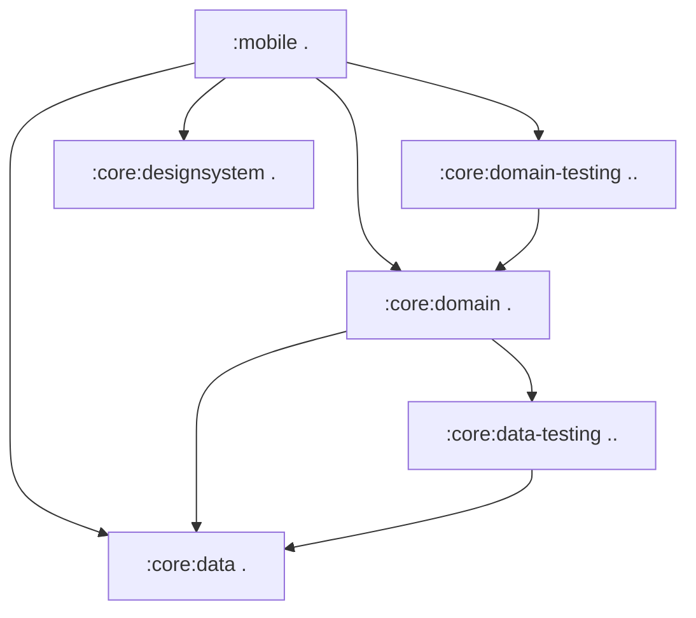
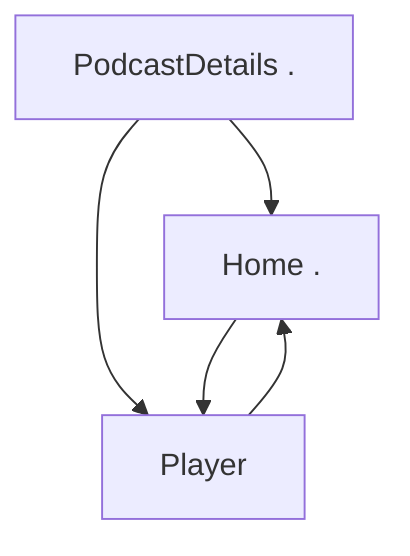

[//]: # (title: Jetpack ComposeアプリのKotlin Multiplatformへの移行)

<secondary-label ref="IntelliJ IDEA"/>
<secondary-label ref="Android Studio"/>

<tldr>
<p>このチュートリアルはIntelliJ IDEAを使用していますが、Android Studioでも同様に実行できます。
   両方のIDEは、同じコア機能とKotlin Multiplatformのサポートを共有しています。</p>
</tldr>

このガイドでは、Android専用のアプリを、ビジネスロジックからUIまで、スタック全体を横断するマルチプラットフォームアプリに移行する方法を説明します。
高度なComposeサンプルを使用して、一般的な課題とその解決策を示します。
コミットシーケンスを詳細に追うことも、一般的な移行ステップをざっと読んで興味のある部分を深く掘り下げることもできます。

開始アプリは、Jetpack ComposeでAndroid向けに構築されたポッドキャストサンプルアプリの[Jetcaster](https://github.com/android/compose-samples/tree/main/Jetcaster)です。
このサンプルは、以下の機能に依存するフル機能のアプリです。
* 複数のモジュール
* Androidリソース管理
* ネットワークおよびデータベースアクセス
* Compose Navigation
* 最新のMaterial Expressiveコンポーネント

これらの機能はすべて、Kotlin MultiplatformとCompose Multiplatformフレームワークを使用して、クロスプラットフォームアプリに適合させることができます。

Androidアプリを他のプラットフォームで動作させる準備として、以下のことができます。

1.  プロジェクトがKotlin Multiplatform (KMP) 移行の候補として適切かどうかを評価する方法を学びます。
2.  Gradleモジュールをクロスプラットフォームモジュールとプラットフォーム固有モジュールに分離する方法を確認します。
    Jetcasterの場合、ほとんどのビジネスロジックモジュールをマルチプラットフォーム化できましたが、
    一部の低レベルのシステムコールはiOSとAndroidで別々にプログラミングする必要がありました。
3.  ビルドスクリプトとコードを徐々に更新し、最小限の変更で動作する状態間を移行することで、ビジネスロジックモジュールを1つずつマルチプラットフォーム化するプロセスに従います。
4.  UIコードが共有実装にどのように移行するかを確認します。
    Compose Multiplatformを使用すると、JetcasterのUIコードのほとんどを共有できます。
    さらに重要なのは、この移行を画面ごとに段階的に実装する方法がわかることです。

結果として得られるアプリは、Android、iOS、デスクトップで動作します。
デスクトップアプリは、UIの動作を迅速に反復処理するためのツールである[Compose Hot Reload](compose-hot-reload.md)の例としても機能します。

## Kotlin Multiplatform移行の可能性に関するチェックリスト

KMP移行の主な障害はJavaとAndroid Viewsです。
プロジェクトがすでにKotlinで書かれており、UIにJetpack Composeを使用している場合、
移行の複雑さは大幅に軽減されます。

プロジェクトまたはモジュールを移行する前に考慮すべき準備事項の一般的なチェックリストを以下に示します。

1.  [Javaコードの変換または分離](#convert-or-isolate-java-code)
2.  [Android/JVM専用の依存関係の確認](#check-your-android-jvm-only-dependencies)
3.  [モジュール化の技術的負債への対処](#catch-up-with-modularization-technical-debt)
4.  [Composeへの移行](#migrate-from-views-to-jetpack-compose)

### Javaコードの変換または分離

元のAndroid Jetcasterの例では、`Objects.hash()`や`Uri.encode()`といったJava専用の呼び出し、
および`java.time`パッケージの広範な使用があります。

KotlinからJavaを呼び出すことはできますが、その逆も同様ですが、
Kotlin Multiplatformモジュールの共有コードを含む`commonMain`ソースセットにはJavaコードを含めることはできません。
したがって、Androidアプリをマルチプラットフォーム化する場合、以下のいずれかを行う必要があります。
*   このコードを`androidMain`に分離する（そしてiOS用に書き直す）、または
*   Javaコードをマルチプラットフォーム互換の依存関係を使用してKotlinに変換する。

Jetcasterでは使用されていませんが、広く採用されているJava専用ライブラリにRxJavaがあります。これは
非同期操作を管理するためのJavaフレームワークであるため、
KMP移行を開始する前に`kotlinx-coroutines`に移行することをお勧めします。

[JavaからKotlinへの移行ガイド](https://kotlinlang.org/docs/java-to-kotlin-idioms-strings.html)と、
Javaコードを自動的に変換してプロセスを効率化できる[IntelliJ IDEAのヘルパー](https://www.jetbrains.com/help/idea/get-started-with-kotlin.html#convert-java-to-kotlin)があります。

### Android/JVM専用の依存関係の確認

多くのプロジェクト、特に新しいプロジェクトでは、Javaコードがそれほど含まれていないかもしれませんが、Android専用の依存関係を持つことがよくあります。
Jetcasterの場合、代替案を特定し、それらに移行することが作業の大部分を占めました。

重要なステップは、共有する予定のコードで使用されている依存関係のリストを作成し、マルチプラットフォームの代替案が利用可能であることを確認することです。
マルチプラットフォームエコシステムはJavaエコシステムほど大きくはありませんが、急速に拡大しています。
潜在的なオプションを評価するための出発点として[klibs.io](https://klibs.io)を使用してください。

Jetcasterの場合、これらのライブラリのリストは以下の通りでした。

*   Dagger/Hilt、一般的な依存性注入ソリューション（[Koin](https://insert-koin.io/)に置き換え）

    Koinは信頼性の高いマルチプラットフォームDIフレームワークです。要件を満たさない場合や、必要な書き換えが
    広範囲にわたる場合は、他のソリューションがあります。
    [Metro](https://zacsweers.github.io/metro/latest/)フレームワークもマルチプラットフォームです。
    DaggerやKotlin Injectを含む[他のアノテーションとの相互運用](https://zacsweers.github.io/metro/latest/interop/)をサポートすることで、移行を容易にすることができます。
*   Coil 2、画像読み込みライブラリ（[バージョン3でマルチプラットフォーム化](https://coil-kt.github.io/coil/upgrading_to_coil3/)）。
*   ROME、RSSフレームワーク（マルチプラットフォームの[RSS Parser](https://github.com/prof18/RSS-Parser)に置き換え）。
*   JUnit、テストフレームワーク（[kotlin-test](https://kotlinlang.org/api/core/kotlin-test/)に置き換え）。

進めていくと、クロスプラットフォームの実装がまだ存在しないために、マルチプラットフォームで動作しなくなる小さなコード片が見つかるかもしれません。
たとえば、Jetcasterでは、Compose UIライブラリの一部である`AnnotatedString.fromHtml()`関数を、
サードパーティのマルチプラットフォーム依存関係に置き換える必要がありました。

そのようなケースをすべて事前に特定することは困難であるため、移行プロセス中に代替品を見つけたり、コードを書き直したりする準備をしてください。
そのため、最小限のステップで動作する状態から次の状態へ移行する方法を示しています。そうすることで、多くの部分が一度に変更されても、
1つの問題で進行が停滞することはありません。

### モジュール化の技術的負債への対処

KMPを使用すると、モジュールごと、画面ごとに選択的にマルチプラットフォーム状態に移行できます。
しかし、これをスムーズに機能させるには、モジュール構造が明確で操作しやすい必要があります。
[高凝集度、低結合度 (high cohesion, low coupling principle)](https://developer.android.com/topic/modularization/patterns#cohesion-coupling)の原則、
およびモジュール構造化に関するその他の推奨されるプラクティスに従って、モジュール化を評価することを検討してください。

一般的なアドバイスは次のようにまとめられます。

*   アプリの異なる機能部分を機能モジュールに分離し、
    機能モジュールをデータモジュール（データを処理し、データへのアクセスを提供する）から分離します。
*   特定のドメインのデータとビジネスロジックをモジュール内にカプセル化します。
    関連するデータ型をグループ化し、関連のないドメイン間でロジックやデータを混在させないようにします。
*   Kotlinの[可視性修飾子](https://kotlinlang.org/docs/visibility-modifiers.html)を使用して、モジュールの実装の詳細とデータソースへの外部からのアクセスを防ぎます。

明確な構造があれば、プロジェクトに多くのモジュールがある場合でも、
それらを個別にKMPに移行できるはずです。このアプローチは、完全に書き直すよりもスムーズです。

### ViewsからJetpack Composeへの移行

Kotlin Multiplatformは、クロスプラットフォームのUIコードを作成する方法としてCompose Multiplatformを提供します。
Compose Multiplatformにスムーズに移行するには、UIコードがすでにComposeを使用して書かれている必要があります。現在Viewsを使用している場合、
そのコードを新しいパラダイムと新しいフレームワークで書き直す必要があります。
これは明らかに、事前に完了しておくと簡単です。

Googleは長年にわたりComposeを進化させ、豊かにしてきました。[Jetpack Compose移行ガイド](https://developer.android.com/develop/ui/compose/migrate)をチェックして、
最も一般的なシナリオで役立つ情報を見つけてください。
Views-Composeの相互運用性も利用できますが、Javaコードと同様に、このコードは
`androidMain`ソースセットに分離する必要があります。

## アプリをマルチプラットフォーム化する手順

最初の準備と評価が完了したら、一般的なプロセスは次のとおりです。

1.  [マルチプラットフォームライブラリへの移行](#migrate-to-multiplatform-libraries)

2.  [ビジネスロジックをKMPに移行する](#migrating-the-business-logic)。
    1.  他のモジュールからの依存関係が最も少ないモジュールから始めます。
    2.  それをKMPモジュール構造に移行し、マルチプラットフォームライブラリを使用するように移行します。
    3.  依存関係ツリーの次のモジュールを選択し、プロセスを繰り返します。

    {type="alpha-lower"}
3.  [UIコードをCompose Multiplatformに移行する](#migrating-to-multiplatform-ui)。
    すべてのビジネスロジックがすでにマルチプラットフォームである場合、Compose Multiplatformへの移行は比較的
    簡単になります。
    Jetcasterの場合、画面ごとに段階的な移行を示します。また、一部の画面が移行され、一部が移行されていない場合の
    ナビゲーショングラフの調整方法も示します。

例を簡素化するために、Android固有のGlance、TV、ウェアラブルターゲットは最初から削除しました。
これらはマルチプラットフォームコードと相互作用せず、移行する必要もありません。

> 以下の手順の説明に従うか、[最終的なマルチプラットフォームJetcasterプロジェクトのリポジトリ](https://github.com/kotlin-hands-on/jetcaster-kmp-migration/commits/main/)に直接ジャンプしてください。
> 各コミットはアプリの動作状態を表しており、Android専用から完全なKotlin Multiplatformへの段階的な移行の可能性を示しています。
>
{style="tip"}

### 環境を準備する {collapsible="true"}

移行ステップを追ったり、提供されているサンプルを自分のマシンで実行したい場合は、
環境を準備してください。

1.  クイックスタートから、[Kotlin Multiplatformの環境をセットアップする](quickstart.md#set-up-the-environment)の指示を完了します。

    > iOSアプリケーションをビルドして実行するには、macOSを搭載したMacが必要です。
    > これはAppleの要件です。
    >
    {style="note"}

2.  IntelliJ IDEAまたはAndroid Studioで、サンプルリポジトリをクローンして新しいプロジェクトを作成します。

    ```text
    git@github.com:kotlin-hands-on/jetcaster-kmp-migration.git
    ```

## マルチプラットフォームライブラリへの移行

アプリの機能のほとんどが依存しているいくつかのライブラリがあります。
モジュールをマルチプラットフォーム対応に設定する前に、それらの使用をKMP互換に移行できます。

*   ROMEツールパーサーからマルチプラットフォームのRSS Parserに移行します。
    これには、API間の違い、そのうちの1つは日付の処理方法を考慮する必要があります。

    > [結果のコミット](https://github.com/kotlin-hands-on/jetcaster-kmp-migration/commit/703d670ed82656c761ed2180dc5118b89fc9c805)を参照してください。
*   Android専用のエントリポイントモジュール`mobile`を含め、アプリ全体でDagger/HiltからKoin 4に移行します。
    これには、Koinのアプローチに従って依存性注入ロジックを書き直す必要がありますが、`*.di`パッケージ以外のコードは
    ほとんど影響を受けません。

    Hiltから移行する際には、以前に生成されたHiltコードでのコンパイルエラーを避けるために、`/build`ディレクトリをクリアしてください。

    > [結果のコミット](https://github.com/kotlin-hands-on/jetcaster-kmp-migration/commit/9c59808a5e3d74e6a55cd357669b24f77bbcd9c8)を参照してください。

*   Coil 2からCoil 3にアップグレードします。ここでも、変更されたコードは比較的少ないです。

    > [結果のコミット](https://github.com/kotlin-hands-on/jetcaster-kmp-migration/commit/826fdd2b87a516d2f0bfe6b13ab8e989a065ee7a)を参照してください。

*   JUnitから`kotlin-test`に移行します。これはテストのあるすべてのモジュールに関係しますが、`kotlin-test`の互換性のおかげで、
    移行を実装するために必要な変更はほとんどありません。

    > [結果のコミット](https://github.com/kotlin-hands-on/jetcaster-kmp-migration/commit/82109598dbfeda9dceecc10b40487f80639c5db4)を参照してください。

### Java依存コードをKotlinに書き直す

主要なライブラリがすべてマルチプラットフォームになったので、Java専用の依存関係を排除する必要があります。

Java専用の呼び出しの簡単な例は`Objects.hash()`で、これをKotlinで再実装しました。
[結果のコミット](https://github.com/kotlin-hands-on/jetcaster-kmp-migration/commit/29341a430e6c98a4f7deaed1d6863edb98e25659)を参照してください。

しかし、Jetcasterの例でコードを直接共通化するのを最も妨げるのは`java.time`パッケージです。
ポッドキャストアプリでは時間計算がほぼどこにでもあるため、`kotlin.time`と`kotlinx-datetime`にコードを移行する必要があります。
これにより、KMPコード共有の真の恩恵を受けることができます。

時間関連のすべてを書き換えたものは、[このコミット](https://github.com/kotlin-hands-on/jetcaster-kmp-migration/commit/0cb5b31964991fdfaed7615523bb734b22f9c755)にまとめられています。

## ビジネスロジックの移行

主要な依存関係がマルチプラットフォームになったら、移行を開始するモジュールを選択できます。
プロジェクト内のモジュールの依存関係グラフを作成すると役立つ場合があります。
[Junie](https://www.jetbrains.com//junie/)のようなAIエージェントが、これに簡単に役立ちます。
Jetcasterの場合、モジュール依存関係の簡略化されたグラフは次のようになりました。



これは、たとえば次のシーケンスを示唆しています。

1.  `:core:data`
2.  `:core:data-testing`
3.  `:core:domain`
4.  `:core:domain-testing`
5.  `:core:designsystem` — このモジュールにはモジュールの依存関係はありませんが、UIヘルパーモジュールであるため、
    UIコードを共有モジュールに移動する準備ができてから対応します。

### :core:dataの移行

#### :core:dataの設定とデータベースコードの移行

Jetcasterはデータベースライブラリとして[Room](https://developer.android.com/training/data-storage/room)を使用しています。
Roomはバージョン2.7.0からマルチプラットフォームに対応しているため、
コードをクロスプラットフォームで動作するように更新するだけで済みます。
現時点ではまだiOSアプリはありませんが、iOSエントリポイントを設定したときに呼び出されるプラットフォーム固有のコードをすでに書くことができます。
また、後で新しいエントリポイントを追加するために、他のプラットフォーム（iOSおよびJVM）のターゲット構成も追加します。

Roomのマルチプラットフォームバージョンに切り替えるために、Androidの[一般的なセットアップガイド](https://developer.android.com/kotlin/multiplatform/room)に従いました。

> [結果のコミット](https://github.com/kotlin-hands-on/jetcaster-kmp-migration/commit/ab22fb14e9129087b310a989eb08bcc77b0e12e8)を参照してください。

*   `androidMain`、`commonMain`、`iosMain`、`jvmMain`ソースセットを備えた新しいコード構造に注目してください。
*   コード変更のほとんどは、Roomと対応するDI変更のためのexpect/actual構造を作成することに関するものです。
*   新しい`OnlineChecker`インターフェースがあり、Androidでのみインターネット接続をチェックしているという事実をカバーしています。
    [iOSアプリをターゲットとして追加する](#add-an-ios-entry-point)まで、オンラインチェッカーはスタブになります。

`:core:data-testing`モジュールもすぐにマルチプラットフォームに再構成できます。
[結果のコミット](https://github.com/kotlin-hands-on/jetcaster-kmp-migration/commit/098a72a25f07958b90ae8778081ab1c7f2988543)を参照してください。
これは、Gradle構成を更新し、ソースセットの
フォルダ構造に移動するだけで済みます。

#### :core:domainの設定と移行

すべての依存関係がすでに考慮され、マルチプラットフォームに移行されている場合、残りの作業は
コードを移動し、モジュールを再構成することだけです。

> [結果のコミット](https://github.com/kotlin-hands-on/jetcaster-kmp-migration/commit/a8376dc2f0eb29ed8b67c929970dcbe505768612)を参照してください。

`:core:data-testing`と同様に、`:core:domain-testing`モジュールも簡単にマルチプラットフォームに更新できます。

> [結果のコミット](https://github.com/kotlin-hands-on/jetcaster-kmp-migration/commit/a46f0a98b8d95656e664dca0d95da196034f2ec3)を参照してください。

#### :core:designsystemの設定と移行

UIコードのみを移行する段階になり、フォントリソースと
タイポグラフィを持つ`:core:designsystem`モジュールを移行し始めます。
KMPモジュールを設定し、`commonMain`ソースセットを作成する以外に、`MaterialExpressiveTheme`の`JetcasterTypography`引数を
コンポーザブルにし、マルチプラットフォームフォントへの呼び出しをカプセル化しました。

> [結果のコミット](https://github.com/kotlin-hands-on/jetcaster-kmp-migration/commit/4aa92e3f38d06aa64444163d865753e47e9b2a97)を参照してください。

## マルチプラットフォームUIへの移行

すべての`:core`ロジックがマルチプラットフォームになると、UIも共通コードに移動し始めることができます。
繰り返しますが、完全な移行を目指しているので、まだiOSターゲットを追加せず、Androidアプリが
共通コードに配置されたCompose部分で動作することを確認するだけです。

私たちが従うロジックを視覚化するために、Jetcasterの画面間の関係を表す簡略化された図を以下に示します。

<!-- The deep link connections and the supporting pane are commented out for the sake of brevity but may be interesting. --> 



まず、共通化するUIコードのために、共有UIモジュールを作成しました。

> [結果のコミット](https://github.com/kotlin-hands-on/jetcaster-kmp-migration/commit/a48bb1281c63a235fcc1d80e2912e75ddd5cbed4)を参照してください。

UIを段階的に移行する方法を示すために、画面ごとに移動します。
各ステップは、アプリを動作状態にし、完全に共有されたUIに一歩近づいたコミットで終わります。

上記の画面図に従って、ポッドキャスト詳細画面から始めました。

1.  移行された画面は、AndroidモジュールにまだあるComposeテーマで動作します。
    必要な作業は次のとおりです。
    1.  ViewModelと対応するDIコードを更新します。
    2.  リソースとリソースアクセサーを更新します。
        マルチプラットフォームリソースライブラリはAndroidエクスペリエンスと密接に連携していますが、
        対処すべきいくつかの顕著な違いがあります。
        *   リソースファイルの処理方法にわずかな違いがあります。
            たとえば、リソースディレクトリは`res`ではなく`composeResources`という名前である必要があり、
            Android XMLファイル内の`@android:color`の使用はカラーの16進コードに置き換える必要があります。
            詳細については、[マルチプラットフォームリソース](compose-multiplatform-resources.md)に関するドキュメントを参照してください。
        *   リソースアクセサーが生成されるクラスは`Res`と呼ばれます（Androidでは`R`）。
            リソースファイルを移動して調整した後、アクセサーを再生成し、UIコード内の各リソースのインポートを置き換えてください。

    > [結果のコミット](https://github.com/kotlin-hands-on/jetcaster-kmp-migration/commit/801f044e56224398d812eb8fd1c1d46b0e9b0087)を参照してください。

2.  Composeテーマを移行します。プラットフォーム固有のカラースキームの実装用のスタブも提供します。

    > [結果のコミット](https://github.com/kotlin-hands-on/jetcaster-kmp-migration/commit/07be9bba96a0dd91e4e0761075898b3d5272ca57)を参照してください。

3.  ホーム画面に進みます。
    1.  ViewModelを移行します。
    2.  コードを共有UIモジュールの`commonMain`に移動します。
    3.  リソースへの参照を移動し、調整します。

    > [結果のコミット](https://github.com/kotlin-hands-on/jetcaster-kmp-migration/commit/ad0012becc527c1c8cb354bb73b5da9741733a1f)を参照してください。

4.  移行を細分化する別の方法を示すために、ナビゲーションを部分的に移行しました。
    共通コードの画面をAndroidネイティブ画面と組み合わせることができます。
    `PlayerScreen`はまだ`mobile`モジュールにあり、Androidエントリポイントでのみナビゲーションに含まれています。
    これは包括的なマルチプラットフォームナビゲーションに注入されます。

    > [結果のコミット](https://github.com/kotlin-hands-on/jetcaster-kmp-migration/commit/2e0107dd4d217346b38cc9b3d5180fedcc12fb8b)を参照してください。

5.  残っているものをすべて移動して完了します。
    *   残りのナビゲーションを共通コードに移動する（[結果のコミット](https://github.com/kotlin-hands-on/jetcaster-kmp-migration/commit/48f13acc02d3630871e3671114f736cb3db51424)）。
    *   最後の画面である`PlayerScreen`をCompose Multiplatformに移行する（[結果のコミット](https://github.com/kotlin-hands-on/jetcaster-kmp-migration/commit/60d5a2f96943705c869b5726622e873925fc2651)）。

これで、すべてのUIコードが共通化されたため、それを使用して他のプラットフォーム用のアプリを迅速に作成できます。

## オプション：JVMエントリポイントの追加

このオプションのステップは、次の目的で役立ちます。
*   完全にマルチプラットフォーム化されたAndroidアプリからデスクトップアプリを作成するのにどれだけの労力が必要かを示す。
*   現在デスクトップターゲットでのみサポートされている[Compose Hot Reload](compose-hot-reload.md)を、Compose UIを迅速に反復処理するためのツールとして紹介する。

すべてのUIコードが共有されているため、デスクトップJVMアプリの新しいエントリポイントを追加するのは、
`main()`関数を作成し、DIフレームワークと統合するだけの問題です。

> [結果のコミット](https://github.com/kotlin-hands-on/jetcaster-kmp-migration/commit/af033dbf39188ef3991466727d155b988c30f1d3)を参照してください。

## iOSエントリポイントの追加

iOSエントリポイントには、KMPコードにリンクされたiOSプロジェクトが必要です。

KMPプロジェクトにiOSアプリを作成して埋め込む方法は、[アプリをマルチプラットフォームにする](https://kotlinlang.org/docs/multiplatform/multiplatform-integrate-in-existing-app.html#create-an-ios-project-in-xcode)
チュートリアルで説明されています。

> ここで使用している直接統合方法は最も簡単ですが、プロジェクトに最適な方法ではない場合があります。
> 代替案の範囲を理解するには、[iOS統合方法の概要](multiplatform-ios-integration-overview.md)を参照してください。
>
{style="note"}

iOSアプリでは、Swift UIコードをCompose Multiplatformコードに接続する必要があります。
これを行うには、埋め込まれた`JetcasterApp`コンポーザブルを持つ`UIViewController`をiOSアプリに返す関数を追加します。

> 追加されたiOSプロジェクトと対応するコードの更新については、[結果のコミット](https://github.com/kotlin-hands-on/jetcaster-kmp-migration/commit/2b2c412596e199b140089efc73de03e46f5c1d77)を参照してください。

## アプリを実行する

移行されたアプリの最終状態には、初期のAndroidモジュール（`mobile`）と新しいiOSアプリ用の実行構成があります。
対応する`main.kt`ファイルからデスクトップアプリを実行できます。
両方を実行して、共有UIがすべてのプラットフォームでどのように機能するかを確認してください！

## 最終まとめ

この移行では、純粋なAndroidアプリをKotlin Multiplatformアプリに変えるための一般的な手順に従いました。

*   マルチプラットフォームの依存関係に移行するか、不可能な場合はコードを書き直す。
*   Androidモジュールを、他のプラットフォームで利用できるように、1つずつマルチプラットフォームモジュールに変換する。
*   Compose Multiplatformコード用の共有UIモジュールを作成し、画面ごとに共有UIコードに移行する。
*   他のプラットフォーム用のエントリポイントを作成する。

このシーケンスは固定されたものではありません。他のプラットフォーム用のエントリポイントから始めて、
それらが機能するまで徐々に基盤を構築することも可能です。
Jetcasterの例では、ステップバイステップで追跡しやすい、より明確な変更シーケンスを選択しました。

ガイドまたは示されたソリューションについてフィードバックがある場合は、[YouTrack](https://kotl.in/issue)でイシューを作成してください。