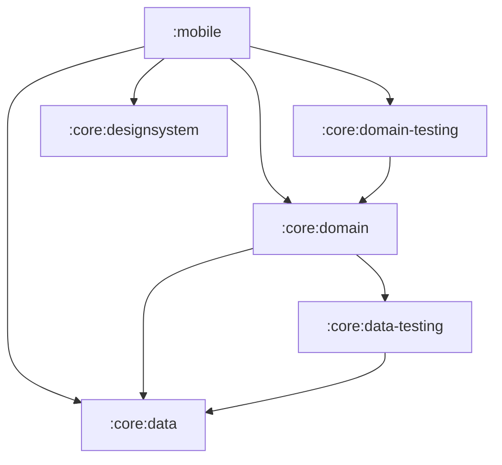
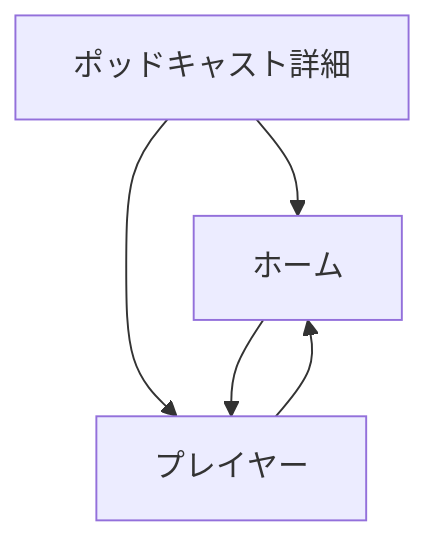

[//]: # (title: Jetpack ComposeアプリのKotlin Multiplatformへの移行)

<secondary-label ref="IntelliJ IDEA"/>
<secondary-label ref="Android Studio"/>

<tldr>
<p>このチュートリアルではIntelliJ IDEAを使用していますが、Android Studioでも進めることができます。
   どちらのIDEも、コア機能とKotlin Multiplatformのサポートは共通です。</p>
</tldr>

このガイドでは、ビジネスロジックからUIにいたるまで、スタック全体をAndroid専用アプリからマルチプラットフォームへと移行する方法について説明します。
高度なComposeサンプルを使用して、一般的な課題と解決策を例示します。
コミットの順序に沿って詳しく追うことも、一般的な移行手順をざっと確認して興味のある部分を深く掘り下げることも可能です。

開始時のアプリは、Android向けにJetpack Composeで構築されたサンプルポッドキャストアプリである[Jetcaster](https://github.com/android/compose-samples/tree/main/Jetcaster)です。
このサンプルは、以下の機能を備えたフル機能のアプリです。
* 複数のモジュール
* Androidのリソース管理
* ネットワークおよびデータベースアクセス
* Compose Navigation
* 最新のMaterial Expressiveコンポーネント

これらの機能はすべて、Kotlin MultiplatformとCompose Multiplatformフレームワークを使用してクロスプラットフォームアプリに適応させることができます。

Androidアプリを他のプラットフォームで動作させる準備として、以下を行うことができます。

1. プロジェクトがKotlin Multiplatform（KMP）移行の候補として適しているかを評価する方法を学ぶ。
2. Gradleモジュールをクロスプラットフォームモジュールとプラットフォーム固有のモジュールに分離する方法を確認する。
   Jetcasterでは、iOSとAndroidで個別にプログラミングする必要があった一部の低レベルのシステムコールを除き、ほとんどのビジネスロジックモジュールをマルチプラットフォーム化できました。
3. ビルドスクリプトとコードを段階的に更新し、最小限の変更で動作状態を維持しながら、ビジネスロジックモジュールを一つずつマルチプラットフォーム化するプロセスに従う。
4. UIコードが共有実装に移行する様子を確認する。
   Compose Multiplatformを使用することで、JetcasterのUIコードの大部分を共有できます。さらに重要なことに、この移行を画面ごとに段階的に実装する方法を確認できます。

完成したアプリは、Android、iOS、デスクトップで動作します。
デスクトップアプリは、UIの動作を素早く反復開発するための[Compose Hot Reload](compose-hot-reload.md)（Composeホットリロード）の例としても機能します。

## Kotlin Multiplatform移行の可能性に関するチェックリスト

KMP移行における主な障害は、JavaとAndroid Viewです。
プロジェクトがすでにKotlinで記述されており、UIにJetpack Composeを使用している場合、移行の複雑さは大幅に軽減されます。

プロジェクトまたはモジュールを移行する前に検討すべき一般的な準備チェックリストは以下の通りです。

1. [Javaコードの変換または分離](#convert-or-isolate-java-code)
2. [Android/JVM専用の依存関係の確認](#check-your-android-jvm-only-dependencies)
3. [モジュール化の技術的負債の解消](#catch-up-with-modularization-technical-debt)
4. [Composeへの移行](#migrate-from-views-to-jetpack-compose)

### Javaコードの変換または分離

オリジナルのAndroid Jetcasterサンプルには、`Objects.hash()` や `Uri.encode()` といったJava専用の呼び出しがあり、`java.time` パッケージも広範囲に使用されています。

KotlinからJavaを呼び出したり、その逆を行ったりすることは可能ですが、Kotlin Multiplatformモジュールの共有コードを含む `commonMain` ソースセットにはJavaコードを含めることができません。
そのため、Androidアプリをマルチプラットフォーム化する際には、以下のいずれかを行う必要があります。
* そのコードを `androidMain` に分離する（そしてiOS向けに書き直す）
* マルチプラットフォーム互換の依存関係を使用して、JavaコードをKotlinに変換する

Jetcasterでは使用されていませんが、RxJavaも広く採用されているJava固有のライブラリです。これは非同期操作を管理するためのJavaフレームワークであるため、KMP移行を開始する前に `kotlinx-coroutines` への移行が推奨されます。

[JavaからKotlinへの移行ガイド](https://kotlinlang.org/docs/java-to-kotlin-idioms-strings.html)や、Javaコードを自動的に変換してプロセスを合理化できる[IntelliJ IDEAのヘルパー](https://www.jetbrains.com/help/idea/get-started-with-kotlin.html#convert-java-to-kotlin)があります。

### Android/JVM専用の依存関係の確認

多くのプロジェクト、特に新しいプロジェクトではJavaコードがあまり含まれていないかもしれませんが、Android専用の依存関係が含まれていることがよくあります。
Jetcasterの場合、代替案を特定してそれらに移行することが作業の大部分を占めました。

重要なステップは、共有予定のコードで使用されている依存関係のリストを作成し、マルチプラットフォームの代替案が利用可能であることを確認することです。
マルチプラットフォームのエコシステムはJavaのエコシステムほど大きくはありませんが、急速に拡大しています。[klibs.io](https://klibs.io) を、潜在的なオプションを評価するための出発点として利用してください。

Jetcasterでは、これらのライブラリのリストは以下の通りでした。

* Dagger/Hilt：人気のある依存関係注入（DI）ソリューション（[Koin](https://insert-koin.io/)に置き換え）

  Koinは信頼性の高いマルチプラットフォームDIフレームワークです。ニーズに合わない場合や、必要な書き換えが大規模すぎる場合は、他のソリューションもあります。
  [Metro](https://zacsweers.github.io/metro/latest/) フレームワークもマルチプラットフォーム対応です。DaggerやKotlin Injectを含む[他のアノテーションとの相互運用](https://zacsweers.github.io/metro/latest/interop/)をサポートしているため、移行を容易にする可能性があります。
* Coil 2：画像読み込みライブラリ（[バージョン3でマルチプラットフォーム化](https://coil-kt.github.io/coil/upgrading_to_coil3/)）
* ROME：RSSフレームワーク（マルチプラットフォームの [RSS Parser](https://github.com/prof18/RSS-Parser) に置き換え）
* JUnit：テストフレームワーク（[kotlin-test](https://kotlinlang.org/api/core/kotlin-test/)に置き換え）

作業を進めるうちに、クロスプラットフォームの実装がまだ存在しないために、マルチプラットフォームで動作しなくなる小さなコードが見つかることがあります。
たとえばJetcasterでは、Compose UIライブラリの一部である `AnnotatedString.fromHtml()` 関数をサードパーティのマルチプラットフォーム依存関係に置き換える必要がありました。

このようなケースをすべて事前に特定するのは難しいため、移行プロセス中に代替案を見つけたりコードを書き直したりする準備をしておいてください。これが、最小限のステップで一つの動作状態から次の動作状態へと移行する方法を示している理由です。そうすれば、多くの部分が一度に変化しているときでも、単一の問題で進行が止まることはありません。

### モジュール化の技術的負債の解消

KMPを使用すると、モジュールごと、画面ごとに選択的にマルチプラットフォーム状態へ移行できます。
しかし、これをスムーズに行うためには、モジュール構造が明確で操作しやすい必要があります。
モジュールの構造化に関する他の推奨プラクティスとともに、[高凝集度・低結合度の原則](https://developer.android.com/topic/modularization/patterns#cohesion-coupling)に従ってモジュール化を評価することを検討してください。

一般的なアドバイスは次のように要約できます。

* アプリの機能の明確な部分を機能モジュール（feature modules）に分離し、データへのアクセスを処理・提供するデータモジュールと機能モジュールを分離しておく。
* 特定のドメインのデータとビジネスロジックをモジュール内にカプセル化する。関連するデータ型をグループ化し、無関係なドメイン間でロジックやデータを混合しないようにする。
* Kotlinの[可視性修飾子](https://kotlinlang.org/docs/visibility-modifiers.html)を使用して、モジュールの実装詳細やデータソースへの外部からのアクセスを防止する。

構造が明確であれば、プロジェクトに多くのモジュールがあっても、個別にKMPに移行できるはずです。このアプローチは、フルリライトを試みるよりもスムーズです。

### ViewからJetpack Composeへの移行

Kotlin Multiplatformは、クロスプラットフォームのUIコードを作成する方法としてCompose Multiplatformを提供しています。
Compose Multiplatformへスムーズに移行するには、UIコードがすでにComposeを使用して記述されている必要があります。現在Viewを使用している場合は、そのコードを新しいパラダイムと新しいフレームワークで書き直す必要があります。
これは事前に行っておく方が明らかに簡単です。

Googleは長期間にわたりComposeを進化させ、充実させてきました。一般的なシナリオについては[Jetpack Compose移行ガイド](https://developer.android.com/develop/ui/compose/migrate)を確認するか、[AIで移行するためのエージェントスキル](https://github.com/android/skills/blob/main/jetpack-compose/migration/migrate-xml-views-to-jetpack-compose/SKILL.md)を試してみてください。
ViewとComposeの相互運用性を使用することもできますが、Javaコードと同様に、このコードは `androidMain` ソースセットに分離する必要があります。

## アプリをマルチプラットフォーム化する手順

初期の準備と評価が終わった後の一般的なプロセスは以下の通りです。

1. [マルチプラットフォームライブラリへの移行](#migrate-to-multiplatform-libraries)

2. [ビジネスロジックのKMPへの移行](#migrating-the-business-logic)
   1. 依存している他のモジュールが最も少ないモジュールから開始する。
   2. それをKMPモジュール構造に移行し、マルチプラットフォームライブラリを使用するように移行する。
   3. 依存関係ツリーの次のモジュールを選択し、プロセスを繰り返す。
   
   {type="alpha-lower"}
3. [UIコードのCompose Multiplatformへの移行](#migrating-to-multiplatform-ui)
   すべてのビジネスロジックがすでにマルチプラットフォーム化されている場合、Compose Multiplatformへの移行は比較的簡単になります。
   Jetcasterでは、画面ごとに移行する増分移行を示します。また、一部の画面が移行済みで一部が未移行の場合のナビゲーショングラフの調整方法も示します。

例をシンプルにするため、マルチプラットフォームコードと相互作用せず、移行の必要がないAndroid固有のGlance、TV、ウェアラブルターゲットは最初から削除しました。

> 以下の手順の説明に従うことも、[最終的なマルチプラットフォームJetcasterプロジェクトのリポジトリ](https://github.com/kotlin-hands-on/jetcaster-kmp-migration/commits/main/)に直接ジャンプすることもできます。
> 各コミットはアプリの動作状態を表しており、Android専用から完全なKotlin Multiplatformへの段階的な移行の可能性を示しています。
> 
{style="tip"}

### 環境の準備 {collapsible="true"}

移行手順に従ったり、提供されたサンプルをマシンで実行したりする場合は、環境を準備してください。

1. クイックスタートから、[Kotlin Multiplatform環境のセットアップ](quickstart.md#set-up-the-environment)の手順を完了してください。

   > iOSアプリケーションをビルドして実行するには、macOSを搭載したMacが必要です。
   > これはAppleの要件です。
   >
   {style="note"}

2. IntelliJ IDEAまたはAndroid Studioで、サンプルリポジトリをクローンして新しいプロジェクトを作成します。

   ```text
   git@github.com:kotlin-hands-on/jetcaster-kmp-migration.git
   ```

## マルチプラットフォームライブラリへの移行

アプリの機能の大部分が依存しているいくつかのライブラリがあります。
モジュールをマルチプラットフォーム対応に構成する前に、これらの使用をKMP互換に移行できます。

* ROMEツールパーサーからマルチプラットフォームのRSS Parserに移行する。
  これには、日付の処理方法など、API間の違いを考慮する必要があります。

  > [移行結果のコミット](https://github.com/kotlin-hands-on/jetcaster-kmp-migration/commit/703d670ed82656c761ed2180dc5118b89fc9c805)を参照してください。
* Android専用のエントリーポイントモジュール `mobile` を含むアプリ全体で、Dagger/HiltからKoin 4に移行する。
  これにはKoinのアプローチに従って依存関係注入のロジックを書き換える必要がありますが、`*.di` パッケージ以外のコードはほとんど影響を受けません。

  Hiltから移行する際は、以前に生成されたHiltコードによるコンパイルエラーを避けるため、必ず `/build` ディレクトリをクリーンアップしてください。

  > [移行結果のコミット](https://github.com/kotlin-hands-on/jetcaster-kmp-migration/commit/9c59808a5e3d74e6a55cd357669b24f77bbcd9c8)を参照してください。

* Coil 2からCoil 3にアップグレードする。これも、修正されたコードは比較的わずかでした。

  > [移行結果のコミット](https://github.com/kotlin-hands-on/jetcaster-kmp-migration/commit/826fdd2b87a516d2f0bfe6b13ab8e989a065ee7a)を参照してください。

* JUnitから `kotlin-test` に移行する。これはテストを含むすべてのモジュールに関係しますが、`kotlin-test` の互換性のおかげで、移行を実装するために必要な変更は非常にわずかです。

  > [移行結果のコミット](https://github.com/kotlin-hands-on/jetcaster-kmp-migration/commit/82109598dbfeda9dceecc10b40487f80639c5db4)を参照してください。

### Java依存コードのKotlinへの書き換え

主要なライブラリがすべてマルチプラットフォーム化されたので、Java専用の依存関係を排除する必要があります。

Java専用の呼び出しの簡単な例は `Objects.hash()` で、これをKotlinで再実装しました。
[移行結果のコミット](https://github.com/kotlin-hands-on/jetcaster-kmp-migration/commit/29341a430e6c98a4f7deaed1d6863edb98e25659)を参照してください。

しかし、Jetcasterの例でコードを直接共通化（commonizing）することを最も妨げているのは `java.time` パッケージです。
ポッドキャストアプリでは時間の計算がほぼすべての場所で行われるため、KMP’のコード共有の恩恵を真に受けるには、そのコードを `kotlin.time` と `kotlinx-datetime` に移行する必要があります。

時間に関連するすべての書き換えは、[このコミット](https://github.com/kotlin-hands-on/jetcaster-kmp-migration/commit/0cb5b31964991fdfaed7615523bb734b22f9c755)にまとめられています。

## ビジネスロジックの移行

主要な依存関係がマルチプラットフォーム化されたら、移行を開始するモジュールを選択できます。
プロジェクト内のモジュールの依存関係グラフを作成すると役立ちます。
[Junie](https://www.jetbrains.com//junie/) のようなAIエージェントがこれに簡単に対応できます。
Jetcasterの場合、簡略化されたモジュール依存関係グラフは以下のようになります。


```mermaid
flowchart TB
  %% Style for modules
  %% classDef Module fill:#e6f7ff,stroke:#0086c9,stroke-width:1px,color:#003a52

  %% Modules
  M_MOBILE[":mobile"]
  M_CORE_DATA[":core:data"]
  M_CORE_DATA_TESTING[":core:data-testing"]
  M_CORE_DOMAIN[":core:domain"]
  M_CORE_DOMAIN_TESTING[":core:domain-testing"]
  M_CORE_DESIGNSYSTEM[":core:designsystem"]

  class M_MOBILE,M_CORE_DATA,M_CORE_DATA_TESTING,M_CORE_DOMAIN,M_CORE_DOMAIN_TESTING,M_CORE_DESIGNSYSTEM Module

  %% Internal dependencies between modules
  %% :mobile
  M_MOBILE --> M_CORE_DATA
  M_MOBILE --> M_CORE_DESIGNSYSTEM
  M_MOBILE --> M_CORE_DOMAIN
  M_MOBILE --> M_CORE_DOMAIN_TESTING

  %% :core:domain
  M_CORE_DOMAIN --> M_CORE_DATA
  M_CORE_DOMAIN --> M_CORE_DATA_TESTING

  %% :core:data-testing
  M_CORE_DATA_TESTING --> M_CORE_DATA

  %% :core:domain-testing
  M_CORE_DOMAIN_TESTING --> M_CORE_DOMAIN

  %% :core:designsystem and :core:data have no intra-project dependencies
```

これは、たとえば以下のような順序を示唆しています。

1. `:core:data`
2. `:core:data-testing`
3. `:core:domain`
4. `:core:domain-testing`
5. `:core:designsystem` — これにはモジュール依存関係はありませんが、UIヘルパーモジュールであるため、UIコードを共有モジュールに移動する準備が整ったときに対処します。

### :core:data の移行

#### :core:data の構成とデータベースコードの移行

Jetcasterはデータベースライブラリとして [Room](https://developer.android.com/training/data-storage/room) を使用しています。
Roomはバージョン2.7.0からマルチプラットフォームに対応しているため、
コードをプラットフォーム間で動作するように更新するだけで済みます。
この時点ではiOSアプリはまだありませんが、iOSエントリーポイントをセットアップしたときに呼び出されるプラットフォーム固有のコードをすでに記述することができます。
また、後で新しいエントリーポイントを追加する準備として、他のプラットフォーム（iOSおよびJVM）のターゲット構成も追加します。

Roomのマルチプラットフォームバージョンに切り替えるために、Androidの[一般的なセットアップガイド](https://developer.android.com/kotlin/multiplatform/room)に従いました。

> [移行結果のコミット](https://github.com/kotlin-hands-on/jetcaster-kmp-migration/commit/ab22fb14e9129087b310a989eb08bcc77b0e12e8)を参照してください。

* `androidMain`、`commonMain`、`iosMain`、`jvmMain` ソースセットを持つ新しいコード構造に注目してください。
* コード変更の大部分は、Roomの expect/actual 構造の作成と対応するDIの変更に関するものです。
* Androidでのみインターネット接続を確認しているという事実をカバーする、新しい `OnlineChecker` インターフェースがあります。[iOSアプリをターゲットとして追加](#add-an-ios-entry-point)するまで、オンラインチェッカーはスタブになります。

また、すぐに `:core:data-testing` モジュールをマルチプラットフォームに再構成することもできます。
[移行結果のコミット](https://github.com/kotlin-hands-on/jetcaster-kmp-migration/commit/098a72a25f07958b90ae8778081ab1c7f2988543)を参照してください。
これにはGradle構成の更新と、ソースセットのフォルダ構造への移動のみが必要です。

#### :core:domain の構成と移行

すべての依存関係がすでに考慮され、マルチプラットフォームに移行されている場合、あとはコードを移動してモジュールを再構成するだけです。

> [移行結果のコミット](https://github.com/kotlin-hands-on/jetcaster-kmp-migration/commit/a8376dc2f0eb29ed8b67c929970dcbe505768612)を参照してください。

同様に、`:core:data-testing` と同様に、`:core:domain-testing` モジュールも簡単にマルチプラットフォームに更新できます。

> [移行結果のコミット](https://github.com/kotlin-hands-on/jetcaster-kmp-migration/commit/a46f0a98b8d95656e664dca0d95da196034f2ec3)を参照してください。

#### :core:designsystem の構成と移行

UIコードの移行のみが残った状態で、フォントリソースとタイポグラフィを含む `:core:designsystem` モジュールの移行を開始します。
KMPモジュールの構成と `commonMain` ソースセットの作成に加え、`MaterialExpressiveTheme` の `JetcasterTypography` 引数をコンポーザブルにし、マルチプラットフォームフォントへの呼び出しをカプセル化しました。

> [移行結果のコミット](https://github.com/kotlin-hands-on/jetcaster-kmp-migration/commit/4aa92e3f38d06aa64444163d865753e47e9b2a97)を参照してください。

## マルチプラットフォームUIへの移行

すべての `:core` ロジックがマルチプラットフォーム化されたら、UIも共通コードへの移動を開始できます。
ここでも、完全な移行を目指しているため、まだiOSターゲットは追加せず、共通コードに配置されたComposeパーツでAndroidアプリが動作することを確認するにとどめます。

私たちがたどるロジックを視覚化するために、Jetcasterの画面間の関係を表す簡略化された図を示します。


```mermaid
---
config:
  labelBackground: '#ded'
---
flowchart TB
  %% Nodes (plain labels, no quotes/parentheses/braces)
  %% Start[Start]
  Home[ホーム]
  Player[プレイヤー]
  PodcastDetailsRoute[ポッドキャスト詳細]

  %% Home main actions
  Home --> Player

  %% From PodcastDetails route
  PodcastDetailsRoute --> Player
  PodcastDetailsRoute --> Home

  %% Back behavior from Player (returns to previous context)
  Player --> Home
```

まず、共通化するUIコードのために共有UIモジュールを作成しました。

> [移行結果のコミット](https://github.com/kotlin-hands-on/jetcaster-kmp-migration/commit/a48bb1281c63a235fcc1d80e2912e75ddd5cbed4)を参照してください。

UIを段階的に移行することを実演するために、画面ごとに移動していきます。
各ステップは、アプリが動作状態にあり、完全に共有されたUIに少し近づいたコミットで終了します。

上の画面図に基づき、ポッドキャスト詳細画面から開始しました。

1. 移行された画面は、ComposeテーマがまだAndroidモジュールにある状態でも動作します。
   行う必要があること：
   1. ViewModelと対応するDIコードを更新する。
   2. リソースとリソースアクセサを更新する。
      マルチプラットフォームリソースライブラリはAndroidの体験と密接に調整されていますが、対処が必要な注目すべき違いがいくつかあります。
      * リソースファイルの処理方法にわずかな違いがあります。
        たとえば、リソースディレクトリは `res` ではなく `composeResources` という名前にする必要があり、Android XMLファイルでの `@android:color` の使用は色の16進コードに置き換える必要があります。
        詳細は、[マルチプラットフォームリソース](compose-multiplatform-resources.md)に関するドキュメントを参照してください。
      * 生成されたリソースアクセサクラスの名前は（Androidの `R` に対して） `Res` になります。
        リソースファイルを移動して調整した後、アクセサを再生成し、UIコード内の各リソースのインポートを置き換えます。
      
   > [移行結果のコミット](https://github.com/kotlin-hands-on/jetcaster-kmp-migration/commit/801f044e56224398d812eb8fd1c1d46b0e9b0087)を参照してください。

2. Composeテーマを移行します。また、カラーパターンのプラットフォーム固有の実装のためのスタブも提供します。

   > [移行結果のコミット](https://github.com/kotlin-hands-on/jetcaster-kmp-migration/commit/07be9bba96a0dd91e4e0761075898b3d5272ca57)を参照してください。

3. ホーム画面を続けます。
   1. ViewModelを移行する。
   2. 共有UIモジュールの `commonMain` にコードを移動する。
   3. リソースへの参照を移動し、調整する。

   > [移行結果のコミット](https://github.com/kotlin-hands-on/jetcaster-kmp-migration/commit/ad0012becc527c1c8cb354bb73b5da9741733a1f)を参照してください。

4. 移行を細分化する別の方法を示すために、ナビゲーションを部分的に移行しました。
   共通コード内の画面とAndroidネイティブ画面を組み合わせることができます。
   `PlayerScreen` はまだ `mobile` モジュールにあり、Androidエントリーポイント専用のナビゲーションに含まれています。
   これは、包括的なマルチプラットフォームナビゲーションに注入されます。

   > [移行結果のコミット](https://github.com/kotlin-hands-on/jetcaster-kmp-migration/commit/2e0107dd4d217346b38cc9b3d5180fedcc12fb8b)を参照してください。
   
5. 残っているものをすべて移動して完了します。
   * ナビゲーションの残りを共通コードに移動する（[移行結果のコミット](https://github.com/kotlin-hands-on/jetcaster-kmp-migration/commit/48f13acc02d3630871e3671114f736cb3db51424)）。
   * 最後の画面である `PlayerScreen` をCompose Multiplatformに移行する（[移行結果のコミット](https://github.com/kotlin-hands-on/jetcaster-kmp-migration/commit/60d5a2f96943705c869b5726622e873925fc2651)）。

すべてのUIコードが共通化されたので、これを使用して他のプラットフォーム用のアプリを素早く作成できます。

## オプション：JVMエントリーポイントの追加

このオプションのステップは以下に役立ちます。
* 完全にマルチプラットフォーム化されたAndroidアプリからデスクトップアプリを作成するのに、いかに手間がかからないかを示す。
* Compose UIを迅速に反復開発するためのツールとして、現在はデスクトップターゲットのみでサポートされている [Compose Hot Reload](compose-hot-reload.md)（Composeホットリロード）を紹介する。

すべてのUIコードが共有されているため、デスクトップJVMアプリの新しいエントリーポイントを追加するには、`main()` 関数を作成してDIフレームワークと統合するだけです。

> [移行結果のコミット](https://github.com/kotlin-hands-on/jetcaster-kmp-migration/commit/af033dbf39188ef3991466727d155b988c30f1d3)を参照してください。

## iOSエントリーポイントの追加

iOSエントリーポイントには、KMPコードとリンクされたiOSプロジェクトが必要です。

KMPプロジェクトでのiOSアプリの作成と埋め込みについては、[アプリのマルチプラットフォーム化](https://kotlinlang.org/docs/multiplatform/multiplatform-integrate-in-existing-app.html#create-an-ios-project-in-xcode)チュートリアルで説明されています。

> ここで使用している直接統合（direct integration）方法は最も簡単ですが、お使いのプロジェクトにとって最適ではない場合があります。
> 代替案の範囲を理解するには、[iOS統合方法の概要](multiplatform-ios-integration-overview.md)を参照してください。
>
{style="note"}

iOSアプリでは、Swift UIコードをCompose Multiplatformコードと接続する必要があります。
そのために、iOSアプリに、埋め込まれた `JetcasterApp` コンポーザブルを持つ `UIViewController` を返す関数を追加します。

> 追加されたiOSプロジェクトと対応するコードの更新については、[移行結果のコミット](https://github.com/kotlin-hands-on/jetcaster-kmp-migration/commit/2b2c412596e199b140089efc73de03e46f5c1d77)を参照してください。

## アプリの実行

移行されたアプリの最終状態には、初期のAndroidモジュール（`mobile`）と新しいiOSアプリの実行構成（Run configuration）があります。
デスクトップアプリは、対応する `main.kt` ファイルから実行できます。
両方を実行して、共有UIがすべてのプラットフォームでどのように動作するかを確認してください。

## 最終まとめ

この移行では、純粋なAndroidアプリをKotlin Multiplatformアプリに変えるための一般的な手順に従いました。

* マルチプラットフォームの依存関係に移行するか、不可能な場合はコードを書き換える。
* 他のプラットフォームで使用可能なAndroidモジュールを、一つずつマルチプラットフォームモジュールに変換する。
* Compose Multiplatformコード用の共有UIモジュールを作成し、画面ごとに共有UIコードへ移行する。
* 他のプラットフォーム用のエントリーポイントを作成する。

この順序は固定されているわけではありません。他のプラットフォーム用のエントリーポイントから開始し、それらが動作するまでその下の基盤を徐々に構築していくことも可能です。
Jetcasterの例では、ステップバイステップで追いやすい、より明確な変化の順序を選択しました。

ガイドや示された解決策についてフィードバックがある場合は、[YouTrack](https://kotl.in/issue) で課題を作成してください。