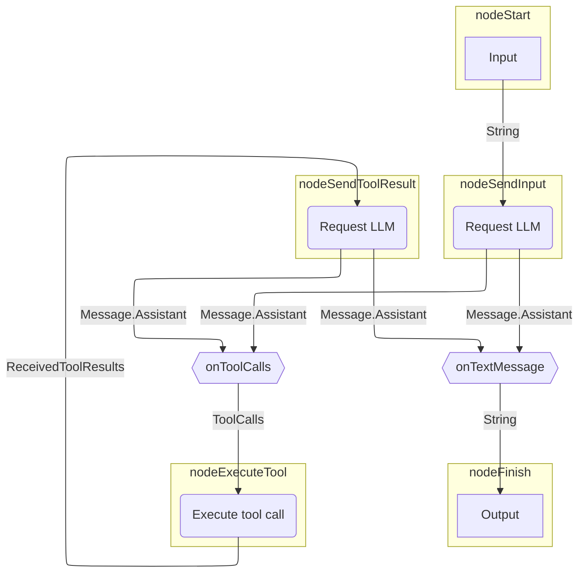
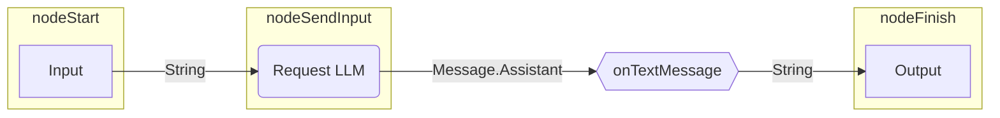

# グラフベースのエージェント

グラフベースのエージェントでは、動作を明示的な状態マシン（state machine）としてモデル化します。
グラフ戦略（graph strategy）のノードはアクション（LLMの呼び出し、ツールの実行）を表し、
エッジはノード間のデータフローを表します。

グラフベースのエージェントの主な利点は以下の通りです：

- 可視化が容易
- 状態の永続化
- 構成可能な（コンポーザブルな）アーキテクチャ

??? note "前提条件"

    --8<-- "quickstart-snippets.md:prerequisites"

    --8<-- "quickstart-snippets.md:dependencies"

    --8<-- "quickstart-snippets.md:api-key"

    このページのエグザンプルは、Ollamaを介してLlama 3.2をローカルで実行していることを前提としています。

このページでは、[基本的なエージェント](basic-agents.md)で使用されているストラテジーグラフ（strategy graph）を再作成する方法について説明します。
このグラフは、LLMにリクエストを送信し、その後、応答を出力するか（LLMがアシスタントメッセージで応答した場合）、
またはツールを実行します（LLMがツール呼び出しを要求した場合）。
ツール呼び出しの場合、エージェントはツールの結果をLLMに送信し、
その後、応答を出力するか、再びツールを実行します。

以下はストラテジーグラフのイラストです：


<!--- KNIT example-graph-agents-01.txt -->

## ストラテジーグラフを構築する

Koogでは、[`AIAgentGraphStrategyBuilder`](https://api.koog.ai/agents/agents-core/ai.koog.agents.core.dsl.builder/-a-i-agent-graph-strategy-builder/index.html)を使用して戦略を実装します。
各ノードに入力型と出力型があるのと同様に、
戦略全体としても入力型と出力型を定義します。
この例では、入力型と出力型を文字列（String）と仮定します。
これは、この戦略を実装するエージェントが文字列を受け取り、文字列を返すことを意味します。

戦略を作成するには、入力型と出力型を2つのジェネリクスとして指定した[`strategy()`](https://api.koog.ai/agents/agents-core/ai.koog.agents.core.dsl.builder/strategy.html)関数を使用し、
戦略に一意の識別子を指定して、ノードとエッジを定義します。

=== "Kotlin"

    <!--- INCLUDE
    import ai.koog.agents.core.dsl.builder.strategy
    import ai.koog.agents.core.dsl.extension.*
    -->
    ```kotlin
    val calculatorAgentStrategy = strategy<String, String>("Simple calculator") {
        val nodeSendInput by nodeLLMRequest()
        val nodeExecuteTool by nodeExecuteTools()
        val nodeSendToolResult by nodeLLMSendToolResults()
        
        edge(nodeStart forwardTo nodeSendInput)
        edge(nodeSendInput forwardTo nodeFinish onTextMessage { true })
        edge(nodeSendInput forwardTo nodeExecuteTool onToolCalls { true })
        edge(nodeExecuteTool forwardTo nodeSendToolResult)
        edge(nodeSendToolResult forwardTo nodeFinish onTextMessage { true })
        edge(nodeSendToolResult forwardTo nodeExecuteTool onToolCalls { true })
    }
    ```
    <!--- KNIT example-graph-agents-01.kt -->

=== "Java"

    <!--- INCLUDE
    import ai.koog.agents.core.agent.entity.AIAgentEdge;
    import ai.koog.agents.core.agent.entity.AIAgentGraphStrategy;
    import ai.koog.agents.core.agent.entity.AIAgentNode;
    import ai.koog.prompt.message.Message;
    import ai.koog.prompt.message.MessagePart;
    import java.util.stream.Collectors;
    class exampleGraphAgentsJava01 {
        public static void main(String[] args) {
    -->
    <!--- SUFFIX
        }
    }
    -->
    ```java
    var calculatorAgentStrategy = AIAgentGraphStrategy.builder("Simple calculator")
        .withInput(String.class)
        .withOutput(String.class);

    var nodeSendInput = AIAgentNode.llmRequest("nodeSendInput");
    var nodeExecuteTool = AIAgentNode.executeTools("nodeExecuteTool");
    var nodeSendToolResult = AIAgentNode.llmSendToolResults("nodeSendToolResult");

    calculatorAgentStrategy.edge(AIAgentEdge.builder()
        .from(calculatorAgentStrategy.nodeStart)
        .to(nodeSendInput)
        .build());
    calculatorAgentStrategy.edge(AIAgentEdge.builder()
        .from(nodeSendInput)
        .to(calculatorAgentStrategy.nodeFinish)
        .onTextMessage()
        .build());
    calculatorAgentStrategy.edge(AIAgentEdge.builder()
        .from(nodeSendInput)
        .to(nodeExecuteTool)
        .onToolCalls()
        .build());
    calculatorAgentStrategy.edge(nodeExecuteTool, nodeSendToolResult);
    calculatorAgentStrategy.edge(AIAgentEdge.builder()
        .from(nodeSendToolResult)
        .to(calculatorAgentStrategy.nodeFinish)
        .onTextMessage()
        .build());
    calculatorAgentStrategy.edge(AIAgentEdge.builder()
        .from(nodeSendToolResult)
        .to(nodeExecuteTool)
        .onToolCalls()
        .build());
    ```
    <!--- KNIT exampleGraphAgentsJava01.java -->

この例では[事前定義されたノード](../nodes-and-components.md)のみを使用していますが、
[カスタムノード](../custom-nodes.md)を作成することもできます。

すべてのストラテジーグラフには、[エッジ](../custom-strategy-graphs.md#edges)で接続された`nodeStart`から`nodeFinish`へのパスが必要です。
エッジには、特定のエッジをたどるタイミングを決定するための条件を設定できます。
また、エッジは前のノードの出力を次のノードに渡す前に変換することもできます。
これは、出力型と入力型が一致しないノードを接続するために必要です。

上記の例では、`onToolCalls { true }`は、前のノードが少なくとも1つのツール呼び出し（`MessagePart.Tool.Call`）を含むアシスタントメッセージを返した場合にのみ、そのエッジをたどることを意味します。

`onTextMessage { true }`を使用すると、前のノードがテキストパート（`MessagePart.Text`）を含むアシスタントメッセージを返した場合にのみ、そのエッジをたどります。
この関数は、それらのパートのテキスト内容を抽出して結合し、`nodeFinish`が文字列を期待しているのに合わせて、実質的に`Message.Assistant`を`String`に変換します。

!!! tip

    `onTextMessage { true }`の代わりに、以下のように記述することもできます：

    <!--- INCLUDE
    import ai.koog.prompt.message.MessagePart
    /**
    -->
    <!--- SUFFIX
    **/
    -->
    ```kotlin
    onMessageParts(MessagePart.Text::class) transformed { it.joinToString("
") { part -> part.text } }
    ```
    <!--- KNIT example-graph-agents-02.kt -->

    または：

    <!--- INCLUDE
    import ai.koog.prompt.message.Message
    import ai.koog.prompt.message.MessagePart
    /**
    -->
    <!--- SUFFIX
    **/
    -->
    ```kotlin
    onCondition { it is Message.Assistant } transformed { (it as Message.Assistant).parts.filterIsInstance<MessagePart.Text>().joinToString("
") { part -> part.text } }
    ```
    <!--- KNIT example-graph-agents-03.kt -->

## エージェントを作成して実行する

この戦略を使用してエージェントインスタンスを作成し、実行してみましょう：

=== "Kotlin"

    <!--- INCLUDE
    import ai.koog.agents.core.agent.AIAgent
    import ai.koog.agents.core.dsl.builder.strategy
    import ai.koog.agents.core.dsl.extension.*
    import ai.koog.agents.core.dsl.extension.nodeExecuteTools
    import ai.koog.agents.core.dsl.extension.nodeLLMRequest
    import ai.koog.agents.core.dsl.extension.nodeLLMSendToolResults
    import ai.koog.prompt.executor.llms.all.simpleOllamaAIExecutor
    import ai.koog.prompt.executor.ollama.client.OllamaModels
    import kotlinx.coroutines.runBlocking
    -->
    ```kotlin
    val calculatorAgentStrategy = strategy<String, String>("Simple calculator") {
        val nodeSendInput by nodeLLMRequest()
        val nodeExecuteTool by nodeExecuteTools()
        val nodeSendToolResult by nodeLLMSendToolResults()
    
        edge(nodeStart forwardTo nodeSendInput)
        edge(nodeSendInput forwardTo nodeFinish onTextMessage { true })
        edge(nodeSendInput forwardTo nodeExecuteTool onToolCalls { true })
        edge(nodeExecuteTool forwardTo nodeSendToolResult)
        edge(nodeSendToolResult forwardTo nodeFinish onTextMessage { true })
        edge(nodeSendToolResult forwardTo nodeExecuteTool onToolCalls { true })
    }
    
    val mathAgent = AIAgent(
        promptExecutor = simpleOllamaAIExecutor(),
        llmModel = OllamaModels.Meta.LLAMA_3_2,
        strategy = calculatorAgentStrategy
    )
    
    fun main() = runBlocking {
        val result = mathAgent.run("Multiply 3 by 4, then multiply the result by 5, then add 10, then add 123.")
        println(result)
    }
    ```
    <!--- KNIT example-graph-agents-04.kt -->

=== "Java"

    <!--- INCLUDE
    import ai.koog.agents.core.agent.AIAgent;
    import ai.koog.agents.core.agent.entity.AIAgentEdge;
    import ai.koog.agents.core.agent.entity.AIAgentGraphStrategy;
    import ai.koog.agents.core.agent.entity.AIAgentNode;
    import ai.koog.prompt.executor.ollama.client.OllamaModels;
    import ai.koog.prompt.message.Message;
    import ai.koog.prompt.message.MessagePart;
    import ai.koog.prompt.executor.model.PromptExecutor;
    import java.util.stream.Collectors;
    class exampleGraphAgentsJava02 {
        public static void main(String[] args) {
    -->
    <!--- SUFFIX
        }
    }
    -->
    ```java
    var calculatorAgentStrategy = AIAgentGraphStrategy.builder("Simple calculator")
        .withInput(String.class)
        .withOutput(String.class);

    var nodeSendInput = AIAgentNode.llmRequest("nodeSendInput");
    var nodeExecuteTool = AIAgentNode.executeTools("nodeExecuteTool");
    var nodeSendToolResult = AIAgentNode.llmSendToolResults("nodeSendToolResult");

    calculatorAgentStrategy.edge(AIAgentEdge.builder()
        .from(calculatorAgentStrategy.nodeStart)
        .to(nodeSendInput)
        .build());
    calculatorAgentStrategy.edge(AIAgentEdge.builder()
        .from(nodeSendInput)
        .to(calculatorAgentStrategy.nodeFinish)
        .onTextMessage()
        .build());
    calculatorAgentStrategy.edge(AIAgentEdge.builder()
        .from(nodeSendInput)
        .to(nodeExecuteTool)
        .onToolCalls()
        .build());
    calculatorAgentStrategy.edge(nodeExecuteTool, nodeSendToolResult);
    calculatorAgentStrategy.edge(AIAgentEdge.builder()
        .from(nodeSendToolResult)
        .to(calculatorAgentStrategy.nodeFinish)
        .onTextMessage()
        .build());
    calculatorAgentStrategy.edge(AIAgentEdge.builder()
        .from(nodeSendToolResult)
        .to(nodeExecuteTool)
        .onToolCalls()
        .build());

    var promptExecutor = PromptExecutor.builder()
        .ollama("http://localhost:11434")
        .build();

    AIAgent<String, String> mathAgent = AIAgent.builder()
        .promptExecutor(promptExecutor)
        .llmModel(OllamaModels.Meta.LLAMA_3_2)
        .graphStrategy(calculatorAgentStrategy.build())
        .build();

        String result = mathAgent.run("Multiply 3 by 4, then multiply the result by 5, then add 10, then add 123.", null);
        System.out.println(result);
    ```
    <!--- KNIT exampleGraphAgentsJava02.java -->

このエージェントを実行すると、以下のような応答が返ってきます：

```text
To calculate this, I'll follow the order of operations:

1. Multiply 3 by 4: 3 * 4 = 12
2. Multiply the result by 5: 12 * 5 = 60
3. Add 10: 60 + 10 = 70
4. Add 123: 70 + 123 = 193

The final answer is 193.
```
<!--- KNIT example-graph-agents-02.txt -->

しかし、このエージェントにはツールが設定されていないため、LLMはツール呼び出しを返すことはなく、単に回答全体を生成します。
実質的に起こっていることは以下の通りです：


<!--- KNIT example-graph-agents-03.txt -->

このケースでは正解していますが、回答は基盤となるLLMの計算能力に依存します。
計算が正確であることを保証するために、エージェントに数学ツールを提供する必要があります。
そうすれば、LLMは決定論的に計算を実行するツールを呼び出すように判断できるようになります。

## ツールを追加する

数学演算を実行するための[ツール](../tools-overview.md)を定義し、それらを[ToolRegistry](https://api.koog.ai/agents/agents-tools/ai.koog.agents.core.tools/-tool-registry/index.html)に追加します：

=== "Kotlin"

    <!--- INCLUDE
    import ai.koog.agents.core.tools.ToolRegistry
    import ai.koog.agents.core.tools.annotations.LLMDescription
    import ai.koog.agents.core.tools.annotations.Tool
    import ai.koog.agents.core.tools.reflect.ToolSet
    -->
    ```kotlin
    @LLMDescription("Tools for performing math operations")
    class MathTools : ToolSet {
        @Tool
        @LLMDescription("Adds two numbers and returns the result")
        fun add(a: Int, b: Int): Int {
            // これは必須ではありませんが、コンソール出力でツール呼び出しを確認するのに役立ちます
            println("Adding $a and $b...")
            return a + b
        }
        @Tool
        @LLMDescription("Multiplies two numbers and returns the result")
        fun multiply(a: Int, b: Int): Int {
            // これは必須ではありませんが、コンソール出力でツール呼び出しを確認するのに役立ちます
            println("Multiplying $a and $b...")
            return a * b
        }
    }
    
    val toolRegistry = ToolRegistry {
        tools(MathTools())
    }
    ```
    <!--- KNIT example-graph-agents-05.kt -->

=== "Java"

    <!--- INCLUDE
    import ai.koog.agents.core.tools.ToolRegistry;
    import ai.koog.agents.core.tools.annotations.LLMDescription;
    import ai.koog.agents.core.tools.annotations.Tool;
    import ai.koog.agents.core.tools.reflect.ToolSet;
    import static ai.koog.prompt.executor.llms.all.SimplePromptExecutors.simpleOllamaAIExecutor;
    class exampleGraphAgentsJava03 {
    -->
    <!--- SUFFIX
    }
    -->
    ```java
    @LLMDescription("Tools for performing math operations")
    public static class MathTools implements ToolSet {
        @Tool
        @LLMDescription("Adds two numbers and returns the result")
        public int add(int a, int b) {
            // これは必須ではありませんが、コンソール出力でツール呼び出しを確認するのに役立ちます
            System.out.println("Adding " + a + " and " + b + "...");
            return a + b;
        }

        @Tool
        @LLMDescription("Multiplies two numbers and returns the result")
        public int multiply(int a, int b) {
            // これは必須ではありませんが、コンソール出力でツール呼び出しを確認するのに役立ちます
            System.out.println("Multiplying " + a + " and " + b + "...");
            return a * b;
        }
    }
    public static void main(String[] args) {
        ToolRegistry toolRegistry = ToolRegistry.builder()
            .tools(new MathTools())
            .build();
    }
    ```
    <!--- KNIT exampleGraphAgentsJava03.java -->

エージェントの設定にツールレジストリを追加します：

=== "Kotlin"

    <!--- INCLUDE
    import ai.koog.agents.core.agent.AIAgent
    import ai.koog.agents.core.dsl.builder.strategy
    import ai.koog.agents.core.dsl.extension.*
    import ai.koog.agents.core.dsl.extension.nodeExecuteTools
    import ai.koog.agents.core.dsl.extension.nodeLLMRequest
    import ai.koog.agents.core.dsl.extension.nodeLLMSendToolResults
    import ai.koog.agents.core.tools.ToolRegistry
    import ai.koog.agents.core.tools.annotations.LLMDescription
    import ai.koog.agents.core.tools.annotations.Tool
    import ai.koog.agents.core.tools.reflect.ToolSet
    import ai.koog.prompt.executor.llms.all.simpleOllamaAIExecutor
    import ai.koog.prompt.executor.ollama.client.OllamaModels
    import kotlinx.coroutines.runBlocking
    
    @LLMDescription("Tools for performing math operations")
    class MathTools : ToolSet {
        @Tool
        @LLMDescription("Adds two numbers and returns the result")
        fun add(a: Int, b: Int): Int {
            // これは必須ではありませんが、コンソール出力でツール呼び出しを確認するのに役立ちます
            println("Adding $a and $b...")
            return a + b
        }
        @Tool
        @LLMDescription("Multiplies two numbers and returns the result")
        fun multiply(a: Int, b: Int): Int {
            // これは必須ではありませんが、コンソール出力でツール呼び出しを確認するのに役立ちます
            println("Multiplying $a and $b...")
            return a * b
        }
    }
    
    val toolRegistry = ToolRegistry {
        tools(MathTools())
    }
    
    val calculatorAgentStrategy = strategy<String, String>("Simple calculator") {
        val nodeSendInput by nodeLLMRequest()
        val nodeExecuteTool by nodeExecuteTools()
        val nodeSendToolResult by nodeLLMSendToolResults()
    
        edge(nodeStart forwardTo nodeSendInput)
        edge(nodeSendInput forwardTo nodeFinish onTextMessage { true })
        edge(nodeSendInput forwardTo nodeExecuteTool onToolCalls { true })
        edge(nodeExecuteTool forwardTo nodeSendToolResult)
        edge(nodeSendToolResult forwardTo nodeFinish onTextMessage { true })
        edge(nodeSendToolResult forwardTo nodeExecuteTool onToolCalls { true })
    }
    -->
    ```kotlin
    val mathAgent = AIAgent(
        promptExecutor = simpleOllamaAIExecutor(),
        llmModel = OllamaModels.Meta.LLAMA_3_2,
        strategy = calculatorAgentStrategy,
        toolRegistry = toolRegistry
    )
    
    fun main() = runBlocking {
        val result = mathAgent.run("Multiply 3 by 4, then multiply the result by 5, then add 10, then add 123.")
        println(result)
    }
    ```
    <!--- KNIT example-graph-agents-06.kt -->

=== "Java"

    <!--- INCLUDE
    import ai.koog.agents.core.agent.AIAgent;
    import ai.koog.agents.core.agent.entity.AIAgentEdge;
    import ai.koog.agents.core.agent.entity.AIAgentGraphStrategy;
    import ai.koog.agents.core.agent.entity.AIAgentNode;
    import ai.koog.agents.core.tools.ToolRegistry;
    import ai.koog.agents.core.tools.annotations.LLMDescription;
    import ai.koog.agents.core.tools.annotations.Tool;
    import ai.koog.agents.core.tools.reflect.ToolSet;
    import ai.koog.prompt.executor.ollama.client.OllamaModels;
    import ai.koog.prompt.message.Message;
    import ai.koog.prompt.message.MessagePart;
    import ai.koog.prompt.executor.model.PromptExecutor;
    import java.util.stream.Collectors;
    class exampleGraphAgentsJava04 {
        @LLMDescription("Tools for performing math operations")
        public static class MathTools implements ToolSet {
            @Tool
            @LLMDescription("Adds two numbers and returns the result")
            public int add(int a, int b) {
                // これは必須ではありませんが、コンソール出力でツール呼び出しを確認するのに役立ちます
                System.out.println("Adding " + a + " and " + b + "...");
                return a + b;
        }
            @Tool
            @LLMDescription("Multiplies two numbers and returns the result")
            public int multiply(int a, int b) {
                // これは必須ではありませんが、コンソール出力でツール呼び出しを確認するのに役立ちます
                System.out.println("Multiplying " + a + " and " + b + "...");
                return a * b;
            }
        }
        public static void main(String[] args) {
            ToolRegistry toolRegistry = ToolRegistry.builder()
                .tools(new MathTools())
                .build();
            var calculatorAgentStrategy = AIAgentGraphStrategy.builder("Simple calculator")
                .withInput(String.class)
                .withOutput(String.class);
            var nodeSendInput = AIAgentNode.llmRequest("nodeSendInput");
            var nodeExecuteTool = AIAgentNode.executeTools("nodeExecuteTool");
            var nodeSendToolResult = AIAgentNode.llmSendToolResults("nodeSendToolResult");
            calculatorAgentStrategy.edge(AIAgentEdge.builder()
                .from(calculatorAgentStrategy.nodeStart)
                .to(nodeSendInput)
                .build());
            calculatorAgentStrategy.edge(AIAgentEdge.builder()
                .from(nodeSendInput)
                .to(calculatorAgentStrategy.nodeFinish)
                .onTextMessage()
                .build());
            calculatorAgentStrategy.edge(AIAgentEdge.builder()
                .from(nodeSendInput)
                .to(nodeExecuteTool)
                .onToolCalls()
                .build());
            calculatorAgentStrategy.edge(nodeExecuteTool, nodeSendToolResult);
            calculatorAgentStrategy.edge(AIAgentEdge.builder()
                .from(nodeSendToolResult)
                .to(calculatorAgentStrategy.nodeFinish)
                .onTextMessage()
                .build());
            calculatorAgentStrategy.edge(AIAgentEdge.builder()
                .from(nodeSendToolResult)
                .to(nodeExecuteTool)
                .onToolCalls()
                .build());
            var promptExecutor = PromptExecutor.builder()
                .ollama("http://localhost:11434")
                .build();
    -->
    <!--- SUFFIX
        }
    }
    -->
    ```java
    AIAgent<String, String> mathAgent = AIAgent.builder()
        .promptExecutor(promptExecutor)
        .llmModel(OllamaModels.Meta.LLAMA_3_2)
        .graphStrategy(calculatorAgentStrategy.build())
        .toolRegistry(toolRegistry)
        .build();

    String result = mathAgent.run("Multiply 3 by 4, then multiply the result by 5, then add 10, then add 123.", null);
    System.out.println(result);
    ```
    <!--- KNIT exampleGraphAgentsJava04.java -->

これでエージェントを実行すると、以下のような応答が返ってきます：

```text
Multiplying 3 and 4...
The output from the first operation was multiplied by 5:
5 * 12 = 60

Then, 10 was added to the result:
60 + 10 = 70

Finally, 123 was added to the result:
70 + 123 = 193
```
<!--- KNIT example-graph-agents-04.txt -->

この出力によると、エージェントは正しく計算を行っていますが、すべての演算に対して対応するツールを呼び出すのではなく、`multiply`ツールを1回だけ呼び出しています。
システムプロンプトでエージェントの役割を説明し、適切なツールの使用手順を提供することで、エージェントを助けることができます。

## システムプロンプトを提供する

[システムプロンプト](../prompts/prompt-creation/index.md#system-message)は、エージェントの役割とタスク実行の手順を定義します。
今回の例では、エージェントが複雑な多段階の計算をどのように処理すべきかを記述することが重要です：

=== "Kotlin"

    <!--- INCLUDE
    import ai.koog.agents.core.agent.AIAgent
    import ai.koog.agents.core.dsl.builder.strategy
    import ai.koog.agents.core.dsl.extension.*
    import ai.koog.agents.core.dsl.extension.nodeExecuteTools
    import ai.koog.agents.core.dsl.extension.nodeLLMRequest
    import ai.koog.agents.core.dsl.extension.nodeLLMSendToolResults
    import ai.koog.agents.core.tools.ToolRegistry
    import ai.koog.agents.core.tools.annotations.LLMDescription
    import ai.koog.agents.core.tools.annotations.Tool
    import ai.koog.agents.core.tools.reflect.ToolSet
    import ai.koog.prompt.executor.llms.all.simpleOllamaAIExecutor
    import ai.koog.prompt.executor.ollama.client.OllamaModels
    import kotlinx.coroutines.runBlocking
    
    @LLMDescription("Tools for performing math operations")
    class MathTools : ToolSet {
        @Tool
        @LLMDescription("Adds two numbers and returns the result")
        fun add(a: Int, b: Int): Int {
            // これは必須ではありませんが、コンソール出力でツール呼び出しを確認するのに役立ちます
            println("Adding $a and $b...")
            return a + b
        }
        @Tool
        @LLMDescription("Multiplies two numbers and returns the result")
        fun multiply(a: Int, b: Int): Int {
            // これは必須ではありませんが、コンソール出力でツール呼び出しを確認するのに役立ちます
            println("Multiplying $a and $b...")
            return a * b
        }
    }
    
    val toolRegistry = ToolRegistry {
        tools(MathTools())
    }
    
    val calculatorAgentStrategy = strategy<String, String>("Simple calculator") {
        val nodeSendInput by nodeLLMRequest()
        val nodeExecuteTool by nodeExecuteTools()
        val nodeSendToolResult by nodeLLMSendToolResults()
    
        edge(nodeStart forwardTo nodeSendInput)
        edge(nodeSendInput forwardTo nodeFinish onTextMessage { true })
        edge(nodeSendInput forwardTo nodeExecuteTool onToolCalls { true })
        edge(nodeExecuteTool forwardTo nodeSendToolResult)
        edge(nodeSendToolResult forwardTo nodeFinish onTextMessage { true })
        edge(nodeSendToolResult forwardTo nodeExecuteTool onToolCalls { true })
    }
    -->
    ```kotlin
    val mathAgent = AIAgent(
        promptExecutor = simpleOllamaAIExecutor(),
        llmModel = OllamaModels.Meta.LLAMA_3_2,
        systemPrompt = """
                    あなたはシンプルな計算機アシスタントです。
                    'add'（足し算）と 'multiply'（掛け算）ツールを使用して、2つの数値を計算できます。
                    ユーザーが入力を行ったら、要求された数値と演算を抽出してください。
                    最初の演算に適切なツールを使用し、次にその次のツールというように、結果が計算されるまで繰り返してください。
                    常に、計算過程と結果を示す明確でフレンドリーなメッセージで回答してください。
                    """.trimIndent(),
        toolRegistry = toolRegistry,
        strategy = calculatorAgentStrategy
    )
    
    fun main() = runBlocking {
        val result = mathAgent.run("Multiply 3 by 4, then multiply the result by 5, then add 10, then add 123.")
        println(result)
    }
    ```
    <!--- KNIT example-graph-agents-07.kt -->

=== "Java"

    <!--- INCLUDE
    import ai.koog.agents.core.agent.AIAgent;
    import ai.koog.agents.core.agent.entity.AIAgentEdge;
    import ai.koog.agents.core.agent.entity.AIAgentGraphStrategy;
    import ai.koog.agents.core.agent.entity.AIAgentNode;
    import ai.koog.agents.core.tools.ToolRegistry;
    import ai.koog.agents.core.tools.annotations.LLMDescription;
    import ai.koog.agents.core.tools.annotations.Tool;
    import ai.koog.agents.core.tools.reflect.ToolSet;
    import ai.koog.prompt.executor.ollama.client.OllamaModels;
    import ai.koog.prompt.message.Message;
    import ai.koog.prompt.message.MessagePart;
    import ai.koog.prompt.executor.model.PromptExecutor;
    import java.util.stream.Collectors;
    class exampleGraphAgentsJava05 {
        @LLMDescription("Tools for performing math operations")
        public static class MathTools implements ToolSet {
            @Tool
            @LLMDescription("Adds two numbers and returns the result")
            public int add(int a, int b) {
                // これは必須ではありませんが、コンソール出力でツール呼び出しを確認するのに役立ちます
                System.out.println("Adding " + a + " and " + b + "...");
                return a + b;
        }
            @Tool
            @LLMDescription("Multiplies two numbers and returns the result")
            public int multiply(int a, int b) {
                // これは必須ではありませんが、コンソール出力でツール呼び出しを確認するのに役立ちます
                System.out.println("Multiplying " + a + " and " + b + "...");
                return a * b;
            }
        }
        public static void main(String[] args) {
            ToolRegistry toolRegistry = ToolRegistry.builder()
                .tools(new MathTools())
                .build();
            var calculatorAgentStrategy = AIAgentGraphStrategy.builder("Simple calculator")
                .withInput(String.class)
                .withOutput(String.class); 
            var nodeSendInput = AIAgentNode.llmRequest("nodeSendInput");
            var nodeExecuteTool = AIAgentNode.executeTools("nodeExecuteTool");
            var nodeSendToolResult = AIAgentNode.llmSendToolResults("nodeSendToolResult"); 
            calculatorAgentStrategy.edge(AIAgentEdge.builder()
                .from(calculatorAgentStrategy.nodeStart)
                .to(nodeSendInput)
                .build());
            calculatorAgentStrategy.edge(AIAgentEdge.builder()
                .from(nodeSendInput)
                .to(calculatorAgentStrategy.nodeFinish)
                .onTextMessage()
                .build());
            calculatorAgentStrategy.edge(AIAgentEdge.builder()
                .from(nodeSendInput)
                .to(nodeExecuteTool)
                .onToolCalls()
                .build());
            calculatorAgentStrategy.edge(nodeExecuteTool, nodeSendToolResult);
            calculatorAgentStrategy.edge(AIAgentEdge.builder()
                .from(nodeSendToolResult)
                .to(calculatorAgentStrategy.nodeFinish)
                .onTextMessage()
                .build());
            calculatorAgentStrategy.edge(AIAgentEdge.builder()
                .from(nodeSendToolResult)
                .to(nodeExecuteTool)
                .onToolCalls()
                .build());
            var promptExecutor = PromptExecutor.builder()
                .ollama("http://localhost:11434")
                .build();
    -->
    <!--- SUFFIX
        }
    }
    -->
    ```java
    AIAgent<String, String> mathAgent = AIAgent.builder()
        .promptExecutor(promptExecutor)
        .llmModel(OllamaModels.Meta.LLAMA_3_2)
        .systemPrompt("あなたはシンプルな計算機アシスタントです。'add'と'multiply'ツールを使用して、2つの数値を計算できます。ユーザーが入力を行ったら、要求された数値と演算を抽出してください。最初の演算に適切なツールを使用し、次にその次のツールというように、結果が計算されるまで繰り返してください。常に、計算過程と結果を示す明確でフレンドリーなメッセージで回答してください。")
        .graphStrategy(calculatorAgentStrategy.build())
        .toolRegistry(toolRegistry)
        .build();

    String result = mathAgent.run("Multiply 3 by 4, then multiply the result by 5, then add 10, then add 123.", null);
    System.out.println(result);
    ```
    <!--- KNIT exampleGraphAgentsJava05.java -->

これでエージェントを実行すると、以下のような応答が返ってきます：

```text
Multiplying 3 and 4...
Multiplying 12 and 5...
Adding 60 and 10...
Adding 70 and 123...
The final result is: 193
```
<!--- KNIT example-graph-agents-05.txt -->

見ての通り、エージェントは各演算に対して適切なツールを正しく呼び出すようになり、ハルシネーション（もっともらしい嘘）による結果のリスクを回避し、決定論的に計算を実行できるようになりました。

## 次のステップ

- [関数型エージェント](functional-agents.md)や[プランナーエージェント](planner-agents/index.md)と比較する
- [機能のインストール](../features/index.md)でエージェントを強化する
- [構造化出力](../structured-output.md)で予測可能性と信頼性を向上させる