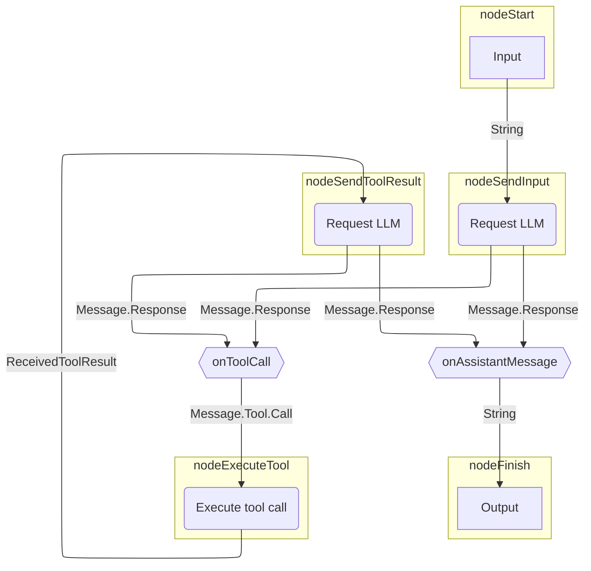
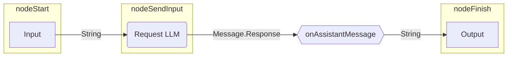

# グラフベースのエージェント

グラフベースのエージェントでは、動作を明示的な状態マシン（state machine）としてモデル化します。
グラフ戦略のノードはアクション（LLMの呼び出し、ツールの実行）を表し、
エッジはノード間のデータフローを表します。

グラフベースのエージェントの主な利点は以下の通りです：

- 可視化が容易
- 状態の永続化
- 構成可能な（コンポーザブルな）アーキテクチャ

??? note "前提条件"

    --8<-- "quickstart-snippets.md:prerequisites"

    --8<-- "quickstart-snippets.md:dependencies"

    --8<-- "quickstart-snippets.md:api-key"

    このページのアドバイスは、Ollamaを介してLlama 3.2をローカルで実行していることを前提としています。

このページでは、[基本的なエージェント](basic-agents.md)で使用されているストラテジーグラフを再作成する方法について説明します。
このグラフは、LLMにリクエストを送信し、その後、応答を出力するか（LLMがアシスタントメッセージで応答した場合）、
ツールを実行します（LLMがツール呼び出しを要求した場合）。
ツール呼び出しの場合、エージェントはツールの結果をLLMに送信し、
その後、応答を出力するか、再びツールを実行します。

以下はストラテジーグラフのイラストです：



## ストラテジーグラフを構築する

Koogでは、[`AIAgentGraphStrategyBuilder`](https://api.koog.ai/agents/agents-core/ai.koog.agents.core.dsl.builder/-a-i-agent-graph-strategy-builder/index.html)を使用して戦略を実装します。
各ノードに入力型と出力型があるのと同様に、
戦略全体としても入力型と出力型を定義します。
この例では、入力型と出力型を文字列（String）と仮定します。
これは、この戦略を実装するエージェントが文字列を受け取り、文字列を返すことを意味します。

戦略を作成するには、入力型と出力型を2つのジェネリクスとして指定した[`strategy()`](https://api.koog.ai/agents/agents-core/ai.koog.agents.core.dsl.builder/strategy.html)関数を使用し、
戦略に一意の識別子を指定して、ノードとエッジを定義します。

<!--- INCLUDE
import ai.koog.agents.core.dsl.builder.forwardTo
import ai.koog.agents.core.dsl.builder.strategy
import ai.koog.agents.core.dsl.extension.*
-->
```kotlin
val calculatorAgentStrategy = strategy<String, String>("Simple calculator") {
    val nodeSendInput by nodeLLMRequest()
    val nodeExecuteTool by nodeExecuteTool()
    val nodeSendToolResult by nodeLLMSendToolResult()
    
    edge(nodeStart forwardTo nodeSendInput)
    edge(nodeSendInput forwardTo nodeFinish onAssistantMessage { true })
    edge(nodeSendInput forwardTo nodeExecuteTool onToolCall { true })
    edge(nodeExecuteTool forwardTo nodeSendToolResult)
    edge(nodeSendToolResult forwardTo nodeFinish onAssistantMessage { true })
    edge(nodeSendToolResult forwardTo nodeExecuteTool onToolCall { true })
}
```
<!--- KNIT example-graph-agents-01.kt -->

この例では[事前定義されたノード](../nodes-and-components.md)のみを使用していますが、
[カスタムノード](../custom-nodes.md)を作成することもできます。

すべてのストラテジーグラフには、[エッジ](../custom-strategy-graphs.md#edges)で接続された`nodeStart`から`nodeFinish`へのパスが必要です。
エッジには、特定のエッジをたどるタイミングを決定するための条件を設定できます。
また、エッジは前のノードの出力を次のノードに渡す前に変換することもできます。
これは、出力型と入力型が一致しないノードを接続するために必要です。

上記の例では、`onToolCall { true }`は、前のノードがツール呼び出し`Message.Tool.Call`を返した場合にのみ、
そのエッジをたどることを意味します。

`onAssistantMessage { true }`を使用すると、前のノードがアシスタントメッセージ`Message.Assistant`を返した場合にのみ、
そのエッジをたどります。
この関数はアシスタントメッセージの内容も抽出するため、
`nodeFinish`が文字列を期待しているのに合わせて、実質的に`Message.Assistant`を`String`に変換します。

!!! tip

    `onAssistantMessage {true}`の代わりに、以下のように記述することもできます：

    ```kotlin
    onIsInstance(Message.Assistant::class) transformed { it.content }
    ```

    または：

    ```kotlin
    onCondition { it is Message.Assistant } transformed { it.asAssistantMessage().content }
    ```

## エージェントを作成して実行する

この戦略を使用してエージェントインスタンスを作成し、実行してみましょう：

<!--- CLEAR -->
<!--- INCLUDE
import ai.koog.agents.core.agent.AIAgent
import ai.koog.agents.core.dsl.builder.forwardTo
import ai.koog.agents.core.dsl.builder.strategy
import ai.koog.agents.core.dsl.extension.*
import ai.koog.agents.core.dsl.extension.nodeExecuteTool
import ai.koog.agents.core.dsl.extension.nodeLLMRequest
import ai.koog.agents.core.dsl.extension.nodeLLMSendToolResult
import ai.koog.prompt.executor.llms.all.simpleOllamaAIExecutor
import ai.koog.prompt.executor.ollama.client.OllamaModels
import kotlinx.coroutines.runBlocking
-->
```kotlin
val calculatorAgentStrategy = strategy<String, String>("Simple calculator") {
    val nodeSendInput by nodeLLMRequest()
    val nodeExecuteTool by nodeExecuteTool()
    val nodeSendToolResult by nodeLLMSendToolResult()

    edge(nodeStart forwardTo nodeSendInput)
    edge(nodeSendInput forwardTo nodeFinish onAssistantMessage { true })
    edge(nodeSendInput forwardTo nodeExecuteTool onToolCall { true })
    edge(nodeExecuteTool forwardTo nodeSendToolResult)
    edge(nodeSendToolResult forwardTo nodeFinish onAssistantMessage { true })
    edge(nodeSendToolResult forwardTo nodeExecuteTool onToolCall { true })
}

val mathAgent = AIAgent(
    promptExecutor = simpleOllamaAIExecutor(),
    llmModel = OllamaModels.Meta.LLAMA_3_2,
    strategy = calculatorAgentStrategy
)

fun main() = runBlocking {
    val result = mathAgent.run("Multiply 3 by 4, then multiply the result by 5, then add 10, then add 123.")
    println(result)
}
```
<!--- KNIT example-graph-agents-02.kt -->

このエージェントを実行すると、以下のような応答が返ってきます：

```text
To calculate this, I'll follow the order of operations:

1. Multiply 3 by 4: 3 * 4 = 12
2. Multiply the result by 5: 12 * 5 = 60
3. Add 10: 60 + 10 = 70
4. Add 123: 70 + 123 = 193

The final answer is 193.
```

しかし、このエージェントにはツールが設定されていないため、LLMはツール呼び出しを返すことはなく、
単に回答全体を生成します。
実質的に起こっていることは以下の通りです：



このケースでは正解していますが、回答は基盤となるLLMの計算能力に依存します。
計算が正確であることを保証するために、エージェントに数学ツールを提供する必要があります。
そうすれば、LLMは決定論的に計算を実行するツールを呼び出すように判断できるようになります。

## ツールを追加する

数学演算を実行するための[ツール](../tools-overview.md)を定義し、それらを[ToolRegistry](https://api.koog.ai/agents/agents-tools/ai.koog.agents.core.tools/-tool-registry/index.html)に追加します：

<!--- INCLUDE
import ai.koog.agents.core.tools.ToolRegistry
import ai.koog.agents.core.tools.annotations.LLMDescription
import ai.koog.agents.core.tools.annotations.Tool
import ai.koog.agents.core.tools.reflect.ToolSet
import ai.koog.agents.core.tools.reflect.tools
-->
```kotlin
@LLMDescription("Tools for performing math operations")
class MathTools : ToolSet {
    @Tool
    @LLMDescription("Adds two numbers and returns the result")
    fun add(a: Int, b: Int): Int {
        // This is not necessary, but it helps to see the tool call in the console output
        println("Adding $a and $b...")
        return a + b
    }
    @Tool
    @LLMDescription("Multiplies two numbers and returns the result")
    fun multiply(a: Int, b: Int): Int {
        // This is not necessary, but it helps to see the tool call in the console output
        println("Multiplying $a and $b...")
        return a * b
    }
}

val toolRegistry = ToolRegistry {
    tools(MathTools())
}
```
<!--- KNIT example-graph-agents-03.kt -->

エージェントの設定にツールレジストリを追加します：

<!--- INCLUDE
import ai.koog.agents.core.agent.AIAgent
import ai.koog.agents.core.dsl.builder.forwardTo
import ai.koog.agents.core.dsl.builder.strategy
import ai.koog.agents.core.dsl.extension.*
import ai.koog.agents.core.dsl.extension.nodeExecuteTool
import ai.koog.agents.core.dsl.extension.nodeLLMRequest
import ai.koog.agents.core.dsl.extension.nodeLLMSendToolResult
import ai.koog.agents.core.tools.ToolRegistry
import ai.koog.agents.core.tools.annotations.LLMDescription
import ai.koog.agents.core.tools.annotations.Tool
import ai.koog.agents.core.tools.reflect.ToolSet
import ai.koog.agents.core.tools.reflect.tools
import ai.koog.prompt.executor.llms.all.simpleOllamaAIExecutor
import ai.koog.prompt.executor.ollama.client.OllamaModels
import kotlinx.coroutines.runBlocking

@LLMDescription("Tools for performing math operations")
class MathTools : ToolSet {
    @Tool
    @LLMDescription("Adds two numbers and returns the result")
    fun add(a: Int, b: Int): Int {
        // This is not necessary, but it helps to see the tool call in the console output
        println("Adding $a and $b...")
        return a + b
    }
    @Tool
    @LLMDescription("Multiplies two numbers and returns the result")
    fun multiply(a: Int, b: Int): Int {
        // This is not necessary, but it helps to see the tool call in the console output
        println("Multiplying $a and $b...")
        return a * b
    }
}

val toolRegistry = ToolRegistry {
    tools(MathTools())
}

val calculatorAgentStrategy = strategy<String, String>("Simple calculator") {
    val nodeSendInput by nodeLLMRequest()
    val nodeExecuteTool by nodeExecuteTool()
    val nodeSendToolResult by nodeLLMSendToolResult()

    edge(nodeStart forwardTo nodeSendInput)
    edge(nodeSendInput forwardTo nodeFinish onAssistantMessage { true })
    edge(nodeSendInput forwardTo nodeExecuteTool onToolCall { true })
    edge(nodeExecuteTool forwardTo nodeSendToolResult)
    edge(nodeSendToolResult forwardTo nodeFinish onAssistantMessage { true })
    edge(nodeSendToolResult forwardTo nodeExecuteTool onToolCall { true })
}
-->
```kotlin
val mathAgent = AIAgent(
    promptExecutor = simpleOllamaAIExecutor(),
    llmModel = OllamaModels.Meta.LLAMA_3_2,
    strategy = calculatorAgentStrategy,
    toolRegistry = toolRegistry
)

fun main() = runBlocking {
    val result = mathAgent.run("Multiply 3 by 4, then multiply the result by 5, then add 10, then add 123.")
    println(result)
}
```
<!--- KNIT example-graph-agents-04.kt -->

これでエージェントを実行すると、以下のような応答が返ってきます：

```text
Multiplying 3 and 4...
The output from the first operation was multiplied by 5:
5 * 12 = 60

Then, 10 was added to the result:
60 + 10 = 70

Finally, 123 was added to the result:
70 + 123 = 193
```

この出力によると、エージェントは正しく計算を行っていますが、すべての演算に対して対応するツールを呼び出すのではなく、`multiply`ツールを1回だけ呼び出しています。
システムプロンプトでエージェントの役割を説明し、適切なツールの使用手順を提供することで、エージェントを助けることができます。

## システムプロンプトを提供する

[システムプロンプト](../prompts/prompt-creation/index.md#system-message)は、エージェントの役割とタスク実行の手順を定義します。
今回の例では、エージェントが複雑な多段階の計算をどのように処理すべきかを記述することが重要です：

<!--- INCLUDE
import ai.koog.agents.core.agent.AIAgent
import ai.koog.agents.core.dsl.builder.forwardTo
import ai.koog.agents.core.dsl.builder.strategy
import ai.koog.agents.core.dsl.extension.*
import ai.koog.agents.core.dsl.extension.nodeExecuteTool
import ai.koog.agents.core.dsl.extension.nodeLLMRequest
import ai.koog.agents.core.dsl.extension.nodeLLMSendToolResult
import ai.koog.agents.core.tools.ToolRegistry
import ai.koog.agents.core.tools.annotations.LLMDescription
import ai.koog.agents.core.tools.annotations.Tool
import ai.koog.agents.core.tools.reflect.ToolSet
import ai.koog.agents.core.tools.reflect.tools
import ai.koog.prompt.executor.llms.all.simpleOllamaAIExecutor
import ai.koog.prompt.executor.ollama.client.OllamaModels
import kotlinx.coroutines.runBlocking

@LLMDescription("Tools for performing math operations")
class MathTools : ToolSet {
    @Tool
    @LLMDescription("Adds two numbers and returns the result")
    fun add(a: Int, b: Int): Int {
        // This is not necessary, but it helps to see the tool call in the console output
        println("Adding $a and $b...")
        return a + b
    }
    @Tool
    @LLMDescription("Multiplies two numbers and returns the result")
    fun multiply(a: Int, b: Int): Int {
        // This is not necessary, but it helps to see the tool call in the console output
        println("Multiplying $a and $b...")
        return a * b
    }
}

val toolRegistry = ToolRegistry {
    tools(MathTools())
}

val calculatorAgentStrategy = strategy<String, String>("Simple calculator") {
    val nodeSendInput by nodeLLMRequest()
    val nodeExecuteTool by nodeExecuteTool()
    val nodeSendToolResult by nodeLLMSendToolResult()

    edge(nodeStart forwardTo nodeSendInput)
    edge(nodeSendInput forwardTo nodeFinish onAssistantMessage { true })
    edge(nodeSendInput forwardTo nodeExecuteTool onToolCall { true })
    edge(nodeExecuteTool forwardTo nodeSendToolResult)
    edge(nodeSendToolResult forwardTo nodeFinish onAssistantMessage { true })
    edge(nodeSendToolResult forwardTo nodeExecuteTool onToolCall { true })
}
-->
```kotlin
val mathAgent = AIAgent(
    promptExecutor = simpleOllamaAIExecutor(),
    llmModel = OllamaModels.Meta.LLAMA_3_2,
    systemPrompt = """
                You are a simple calculator assistant.
                You can add and multiply two numbers using the 'add' and 'multiply' tools.
                When the user provides input, extract the numbers and operations they requested.
                Use the appropriate tool for the first operation, then the next one, and so on, until you calculate the result.
                Always respond with a clear, friendly message showing the calculation and result.
                """.trimIndent(),
    toolRegistry = toolRegistry,
    strategy = calculatorAgentStrategy
)

fun main() = runBlocking {
    val result = mathAgent.run("Multiply 3 by 4, then multiply the result by 5, then add 10, then add 123.")
    println(result)
}
```
<!--- KNIT example-graph-agents-05.kt -->

これでエージェントを実行すると、以下のような応答が返ってきます：

```text
Multiplying 3 and 4...
Multiplying 12 and 5...
Adding 60 and 10...
Adding 70 and 123...
The final result is: 193
```

見ての通り、エージェントは各演算に対して適切なツールを正しく呼び出すようになり、ハルシネーション（もっともらしい嘘）による結果のリスクを回避し、決定論的に計算を実行できるようになりました。

## 次のステップ

- [関数型エージェント](functional-agents.md)や[プランナーエージェント](planner-agents/index.md)と比較する
- [追加機能のインストール](../features-overview.md)でエージェントを強化する
- [構造化出力](../structured-output.md)で予測可能性と信頼性を向上させる