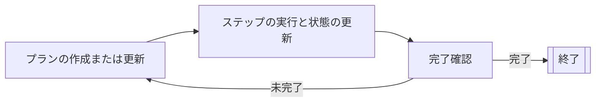

# プランナーエージェント

プランナーエージェント（Planner agents）は、反復的なプランニングサイクルを通じて、多段階のタスクを計画し実行するAIエージェントです。
これらは継続的にプランを構築または更新し、ステップを実行し、現在の状態に照らして完了条件をチェックします。

プランナーエージェントは、上位レベルの目標をより小さく実行可能なステップに分解し、
各ステップの結果に基づいてプランを適応させる必要がある複雑なタスクに適しています。

[グラフベースのエージェント](../graph-based-agents.md)ではすべてのノードとエッジを定義しますが、
プランナーエージェントでは、型指定された入力と出力を持つアクション（ノード）のみを定義します。
プランナーは、目的の状態を達成するために適した妥当なエッジを作成し、
ステップ間の最適パスを更新することもできます。
これにより、グラフベースのエージェントと比較して、より強力ですが制御性は低くなる、よりダイナミックなアプローチが可能になります。

プランナーエージェントは、反復的なプランニングサイクルを通じて動作します：

1. プランナーは、現在の状態に基づいてプランを作成または更新します。
2. プランナーはプランから1つのステップを実行し、状態を更新します。
3. プランナーは、現在の状態に応じてプランが完了したかどうかを判断します。
    - プランが完了している場合、サイクルは終了します。
    - プランが完了していない場合、サイクルは最初のステップから繰り返されます。

Koogは、2つのタイプのプランナーエージェントを提供しています：

- [LLMベースのプランナー](llm-based-planners.md)は、LLMを使用してプランを作成および更新します。
- [GOAPエージェント](goap-agents.md)は、最適なアクションシーケンスを決定するために特別なアルゴリズムを使用します。