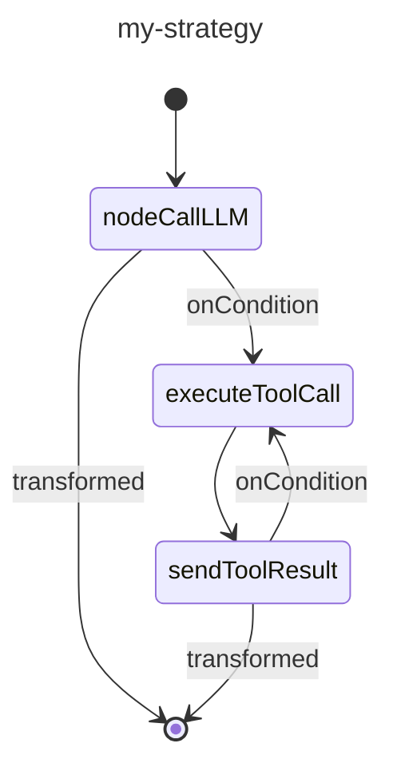

# カスタム戦略グラフ

戦略グラフは、Koog フレームワークにおけるエージェントワークフローの根幹です。これらは、エージェントがどのように入力を処理し、ツールと対話し、出力を生成するかを定義します。戦略グラフは、エッジによって接続されたノードで構成され、実行のフローを決定する条件が含まれます。

戦略グラフを作成することで、単純なチャットボットから複雑なデータ処理パイプラインまで、特定のニーズに合わせてエージェントの動作をカスタマイズできます。

## 戦略グラフのアーキテクチャ

ハイレベルでは、戦略グラフは以下のコンポーネントで構成されます。

- **戦略 (Strategy)**: グラフの最上位コンテナ。ジェネリックパラメータを使用して指定された入力および出力タイプを持つ `strategy` 関数を使用して作成されます。
- **サブグラフ (Subgraphs)**: 独自のツールセットとコンテキストを持つことができるグラフのセクション。
- **ノード (Nodes)**: ワークフロー内の個々の操作または変換。
- **エッジ (Edges)**: 遷移条件と変換を定義するノード間の接続。

戦略グラフは `nodeStart` と呼ばめる特殊なノードで始まり、`nodeFinish` で終わります。
これらのノード間のパスは、グラフで指定されたエッジと条件によって決定されます。

## 戦略グラフのコンポーネント

### ノード

ノードは戦略グラフの構成要素です。各ノードは特定の操作を表します。

Koog フレームワークは定義済みのノードを提供しており、`node` 関数を使用してカスタムノードを作成することもできます。

詳細については、「[定義済みのノードとコンポーネント](nodes-and-components.md)」および「[カスタムノード](custom-nodes.md)」を参照してください。

### エッジ

エッジはノードを接続し、戦略グラフにおける操作のフローを定義します。
エッジは、`edge` 関数と `forwardTo` 中置関数（infix function）を使用して作成されます。

<!--- INCLUDE
import ai.koog.agents.core.dsl.builder.forwardTo
import ai.koog.agents.core.dsl.builder.strategy
import ai.koog.agents.core.dsl.builder.node
import ai.koog.agents.core.dsl.builder.parallel
import ai.koog.agents.core.dsl.builder.subgraph

val strategy = strategy<String, String>("strategy_name") {
        val sourceNode by node<String, String> { input -> input }
        val targetNode by node<String, String> { input -> input }
-->
<!--- SUFFIX
}
-->
```kotlin
edge(sourceNode forwardTo targetNode)
```
<!--- KNIT example-custom-strategy-graphs-01.kt -->

#### 条件

条件は、戦略グラフにおいて特定のエッジをいつたどるかを決定します。いくつかのタイプの条件があり、一般的なものを以下に示します。

| 条件タイプ | 説明 |
|---------------------|------------------------------------------------------------------------------------------|
| `onCondition` | boolean 値を返すラムダ式を受け取る汎用的な条件。 |
| `onToolCall` | LLM がツールを呼び出したときに一致する条件。 |
| `onAssistantMessage` | LLM がメッセージで応答したときに一致する条件。 |
| `onMultipleToolCalls` | LLM が複数のツールを呼び出したときに一致する条件。 |
| `onToolNotCalled` | LLM がツールを呼び出さなかったときに一致する条件。 |

`transformed` 関数を使用すると、ターゲットノードに渡す前に出力を変換できます。

<!--- INCLUDE
import ai.koog.agents.core.dsl.builder.forwardTo
import ai.koog.agents.core.dsl.builder.strategy
import ai.koog.agents.core.dsl.builder.node
import ai.koog.agents.core.dsl.builder.parallel
import ai.koog.agents.core.dsl.builder.subgraph

val strategy = strategy<String, String>("strategy_name") {
        val sourceNode by node<String, String> { input -> input }
        val targetNode by node<String, String> { input -> input }
-->
<!--- SUFFIX
}
-->
```kotlin
edge(sourceNode forwardTo targetNode 
        onCondition { input -> input.length > 10 }
        transformed { input -> input.uppercase() }
)
```
<!--- KNIT example-custom-strategy-graphs-02.kt -->

### サブグラフ

サブグラフは、独自のツールセットとコンテキストで動作する戦略グラフのセクションです。
戦略グラフには複数のサブグラフを含めることができます。各サブグラフは `subgraph` 関数を使用して定義されます。

<!--- INCLUDE
import ai.koog.agents.core.dsl.builder.strategy
import ai.koog.agents.core.dsl.builder.node
import ai.koog.agents.core.dsl.builder.parallel
import ai.koog.agents.core.dsl.builder.subgraph

typealias Input = String
typealias Output = Int

typealias FirstInput = String
typealias FirstOutput = Int

typealias SecondInput = String
typealias SecondOutput = Int
-->
```kotlin
val strategy = strategy<Input, Output>("strategy-name") {
    val firstSubgraph by subgraph<FirstInput, FirstOutput>("first") {
        // このサブグラフのノードとエッジを定義
    }
    val secondSubgraph by subgraph<SecondInput, SecondOutput>("second") {
        // このサブグラフのノードとエッジを定義
    }
}
```
<!--- KNIT example-custom-strategy-graphs-03.kt -->

サブグラフは、ツールレジストリにある任意のツールを使用できます。
ただし、このレジストリからサブグラフで使用できるツールのサブセットを指定し、それを `subgraph` 関数の引数として渡すことができます。

<!--- INCLUDE
import ai.koog.agents.core.dsl.builder.strategy
import ai.koog.agents.core.dsl.builder.node
import ai.koog.agents.core.dsl.builder.parallel
import ai.koog.agents.core.dsl.builder.subgraph
import ai.koog.agents.ext.tool.SayToUser

typealias Input = String
typealias Output = Int

typealias FirstInput = String
typealias FirstOutput = Int

val someTool = SayToUser

-->
```kotlin
val strategy = strategy<Input, Output>("strategy-name") {
    val firstSubgraph by subgraph<FirstInput, FirstOutput>(
        name = "first",
        tools = listOf(someTool)
    ) {
        // このサブグラフのノードとエッジを定義
    }
   // 他のサブグラフを定義
}
```
<!--- KNIT example-custom-strategy-graphs-04.kt -->

## 基本的な戦略グラフの作成

基本的な戦略グラフは次のように動作します。

1. 入力を LLM に送信します。
2. LLM がメッセージで応答した場合、プロセスを終了します。
3. LLM がツールを呼び出した場合、ツールを実行します。
4. ツールの結果を LLM に送り返します。
5. LLM がメッセージで応答した場合、プロセスを終了します。
6. LLM が別のツールを呼び出した場合、ツールを実行し、ステップ 4 からプロセスを繰り返します。


基本的な戦略グラフの例を以下に示します。

<!--- INCLUDE
import ai.koog.agents.core.dsl.builder.forwardTo
import ai.koog.agents.core.dsl.builder.strategy
import ai.koog.agents.core.dsl.builder.node
import ai.koog.agents.core.dsl.builder.parallel
import ai.koog.agents.core.dsl.builder.subgraph
import ai.koog.agents.core.dsl.extension.nodeExecuteTool
import ai.koog.agents.core.dsl.extension.nodeLLMRequest
import ai.koog.agents.core.dsl.extension.nodeLLMSendToolResult
import ai.koog.agents.core.dsl.extension.onAssistantMessage
import ai.koog.agents.core.dsl.extension.onToolCall

-->
```kotlin
val myStrategy = strategy<String, String>("my-strategy") {
    val nodeCallLLM by nodeLLMRequest()
    val executeToolCall by nodeExecuteTool()
    val sendToolResult by nodeLLMSendToolResult()

    edge(nodeStart forwardTo nodeCallLLM)
    edge(nodeCallLLM forwardTo nodeFinish onAssistantMessage { true })
    edge(nodeCallLLM forwardTo executeToolCall onToolCall { true })
    edge(executeToolCall forwardTo sendToolResult)
    edge(sendToolResult forwardTo nodeFinish onAssistantMessage { true })
    edge(sendToolResult forwardTo executeToolCall onToolCall { true })
}
```
<!--- KNIT example-custom-strategy-graphs-05.kt -->

## 戦略グラフの可視化

JVM では、戦略グラフの [Mermaid 状態遷移図 (state diagram)](https://mermaid.js.org/syntax/stateDiagram.html) を生成できます。

前の例で作成したグラフの場合、以下を実行できます。

<!--- INCLUDE
import ai.koog.agents.core.agent.asMermaidDiagram
import ai.koog.agents.core.dsl.builder.forwardTo
import ai.koog.agents.core.dsl.builder.strategy
import ai.koog.agents.core.dsl.builder.node
import ai.koog.agents.core.dsl.builder.parallel
import ai.koog.agents.core.dsl.builder.subgraph
import ai.koog.agents.core.dsl.extension.nodeExecuteTool
import ai.koog.agents.core.dsl.extension.nodeLLMRequest
import ai.koog.agents.core.dsl.extension.nodeLLMSendToolResult
import ai.koog.agents.core.dsl.extension.onAssistantMessage
import ai.koog.agents.core.dsl.extension.onToolCall

fun main() {
    val myStrategy = strategy("my-strategy") {
        val nodeCallLLM by nodeLLMRequest()
        val executeToolCall by nodeExecuteTool()
        val sendToolResult by nodeLLMSendToolResult()
    
        edge(nodeStart forwardTo nodeCallLLM)
        edge(nodeCallLLM forwardTo nodeFinish onAssistantMessage { true })
        edge(nodeCallLLM forwardTo executeToolCall onToolCall { true })
        edge(executeToolCall forwardTo sendToolResult)
        edge(sendToolResult forwardTo nodeFinish onAssistantMessage { true })
        edge(sendToolResult forwardTo executeToolCall onToolCall { true })
    }
-->
<!--- SUFFIX
}
-->

```kotlin
val mermaidDiagram: String = myStrategy.asMermaidDiagram()

println(mermaidDiagram)
```

出力は以下のようになります。


<!--- KNIT example-custom-strategy-graphs-06.kt -->

## 高度な戦略テクニック

### 履歴の圧縮

長期間の会話では、履歴が肥大化し、大量のトークンを消費する可能性があります。履歴を圧縮する方法については、「[履歴の圧縮](history-compression.md)」を参照してください。

### ツールの並列実行

複数のツールを並列に実行する必要があるワークフローでは、`nodeExecuteMultipleTools` ノードを使用できます。

<!--- INCLUDE
import ai.koog.agents.core.dsl.builder.forwardTo
import ai.koog.agents.core.dsl.builder.strategy
import ai.koog.agents.core.dsl.builder.node
import ai.koog.agents.core.dsl.builder.parallel
import ai.koog.agents.core.dsl.builder.subgraph
import ai.koog.agents.core.dsl.extension.nodeExecuteMultipleTools
import ai.koog.agents.core.dsl.extension.nodeLLMSendMultipleToolResults
import ai.koog.prompt.message.Message

val strategy = strategy<String, String>("strategy_name") {
    val someNode by node<String, List<Message.Tool.Call>> { emptyList() }
-->
<!--- SUFFIX
}
-->
```kotlin
val executeMultipleTools by nodeExecuteMultipleTools()
val processMultipleResults by nodeLLMSendMultipleToolResults()

edge(someNode forwardTo executeMultipleTools)
edge(executeMultipleTools forwardTo processMultipleResults)
```
<!--- KNIT example-custom-strategy-graphs-07.kt -->

ストリーミングデータには、`toParallelToolCallsRaw` 拡張関数を使用することもできます。

<!--- INCLUDE
/*
-->
<!--- SUFFIX
*/
-->
```kotlin
parseMarkdownStreamToBooks(markdownStream).toParallelToolCallsRaw(BookTool::class).collect()
```
<!--- KNIT example-custom-strategy-graphs-08.kt -->

詳細については、「[ツール](tools-overview.md#parallel-tool-calls)」を参照してください。

### ノードの並列実行

ノードの並列実行により、複数のノードを同時に実行できるため、パフォーマンスが向上し、複雑なワークフローが可能になります。

ノードの並列実行を開始するには、`parallel` メソッドを使用します。

<!--- INCLUDE
import ai.koog.agents.core.dsl.builder.strategy
import ai.koog.agents.core.dsl.builder.node
import ai.koog.agents.core.dsl.builder.parallel
import ai.koog.agents.core.dsl.builder.subgraph

val strategy = strategy<String, String>("strategy_name") {
    val nodeCalcTokens by node<String, Int> { 42 }
    val nodeCalcSymbols by node<String, Int> { 42 }
    val nodeCalcWords by node<String, Int> { 42 }

-->
<!--- SUFFIX
}
-->
```kotlin
val calc by parallel<String, Int>(
    nodeCalcTokens, nodeCalcSymbols, nodeCalcWords,
) {
    selectByMax { it }
}
```
<!--- KNIT example-custom-strategy-graphs-09.kt -->

上記のコードは、`nodeCalcTokens`、`nodeCalcSymbols`、および `nodeCalcWords` ノードを並列に実行し、その結果を `AsyncParallelResult` のインスタンスとして返す `calc` という名前のノードを作成します。

ノードの並列実行に関する詳細情報とリファレンスについては、「[ノードの並列実行](parallel-node-execution.md)」を参照してください。

### 条件分岐

特定の条件に基づいて異なるパスを必要とする複雑なワークフローでは、条件分岐を使用できます。

<!--- INCLUDE
import ai.koog.agents.core.dsl.builder.forwardTo
import ai.koog.agents.core.dsl.builder.strategy
import ai.koog.agents.core.dsl.builder.node
import ai.koog.agents.core.dsl.builder.parallel
import ai.koog.agents.core.dsl.builder.subgraph

val strategy = strategy<String, String>("strategy_name") {
    val someNode by node<String, String> { it }
-->
<!--- SUFFIX
}
-->
```kotlin
val branchA by node<String, String> { input ->
    // ブランチ A のロジック
    "Branch A: $input"
}

val branchB by node<String, String> { input ->
    // ブランチ B のロジック
    "Branch B: $input"
}

edge(
    (someNode forwardTo branchA)
            onCondition { input -> input.contains("A") }
)
edge(
    (someNode forwardTo branchB)
            onCondition { input -> input.contains("B") }
)
```
<!--- KNIT example-custom-strategy-graphs-10.kt -->

## ベストプラクティス

カスタム戦略グラフを作成する際は、以下のベストプラクティスに従ってください。

- シンプルに保つ。シンプルなグラフから始め、必要に応じて複雑さを追加します。
- ノードとエッジに分かりやすい名前を付け、グラフを理解しやすくします。
- 考えられるすべてのパスとエッジケースを処理します。
- さまざまな入力でグラフをテストし、期待通りに動作することを確認します。
- 将来の参照のために、グラフの目的と動作をドキュメント化します。
- 定義済みの戦略や一般的なパターンを出発点として使用します。
- 長期間の会話では、履歴の圧縮を使用してトークンの使用量を削減します。
- サブグラフを使用してグラフを整理し、ツールへのアクセスを管理します。

## 使用例

### トーン分析戦略

トーン分析戦略は、履歴の圧縮を含むツールベースの戦略の良い例です。

<!--- INCLUDE
import ai.koog.agents.core.agent.entity.AIAgentGraphStrategy
import ai.koog.agents.core.dsl.builder.forwardTo
import ai.koog.agents.core.dsl.builder.strategy
import ai.koog.agents.core.dsl.builder.node
import ai.koog.agents.core.dsl.builder.parallel
import ai.koog.agents.core.dsl.builder.subgraph
import ai.koog.agents.core.dsl.extension.nodeExecuteTool
import ai.koog.agents.core.dsl.extension.nodeLLMCompressHistory
import ai.koog.agents.core.dsl.extension.nodeLLMRequest
import ai.koog.agents.core.dsl.extension.nodeLLMSendToolResult
import ai.koog.agents.core.dsl.extension.onAssistantMessage
import ai.koog.agents.core.dsl.extension.onToolCall
import ai.koog.agents.core.environment.ReceivedToolResult
import ai.koog.agents.core.tools.ToolRegistry
-->
```kotlin
fun toneStrategy(name: String, toolRegistry: ToolRegistry): AIAgentGraphStrategy<String, String> {
    return strategy(name) {
        val nodeSendInput by nodeLLMRequest()
        val nodeExecuteTool by nodeExecuteTool()
        val nodeSendToolResult by nodeLLMSendToolResult()
        val nodeCompressHistory by nodeLLMCompressHistory<ReceivedToolResult>()

        // エージェントのフローを定義
        edge(nodeStart forwardTo nodeSendInput)

        // LLM がメッセージで応答した場合、終了
        edge(
            (nodeSendInput forwardTo nodeFinish)
                    onAssistantMessage { true }
        )

        // LLM がツールを呼び出した場合、それを実行
        edge(
            (nodeSendInput forwardTo nodeExecuteTool)
                    onToolCall { true }
        )

        // 履歴が大きくなりすぎた場合、圧縮する
        edge(
            (nodeExecuteTool forwardTo nodeCompressHistory)
                    onCondition { _ -> llm.readSession { prompt.messages.size > 100 } }
        )

        edge(nodeCompressHistory forwardTo nodeSendToolResult)

        // そうでない場合は、ツールの結果を直接送信
        edge(
            (nodeExecuteTool forwardTo nodeSendToolResult)
                    onCondition { _ -> llm.readSession { prompt.messages.size <= 100 } }
        )

        // LLM が別のツールを呼び出した場合、それを実行
        edge(
            (nodeSendToolResult forwardTo nodeExecuteTool)
                    onToolCall { true }
        )

        // LLM がメッセージで応答した場合、終了
        edge(
            (nodeSendToolResult forwardTo nodeFinish)
                    onAssistantMessage { true }
        )
    }
}
```
<!--- KNIT example-custom-strategy-graphs-11.kt -->

この戦略は以下のことを行います。

1. 入力を LLM に送信します。
2. LLM がメッセージで応答した場合、戦略はプロセスを終了します。
3. LLM がツールを呼び出した場合、戦略はツールを実行します。
4. 履歴が大きすぎる（100 メッセージ超）場合、戦略はツールの結果を送信する前に履歴を圧縮します。
5. そうでない場合は、戦略はツールの結果を直接送信します。
6. LLM が別のツールを呼び出した場合、戦略はそれを実行します。
7. LLM がメッセージで応答した場合、戦略はプロセスを終了します。

## トラブルシューティング

カスタム戦略グラフを作成する際に、いくつかの一般的な問題に遭遇することがあります。トラブルシューティングのヒントを以下に示します。

### グラフが終了ノードに到達しない

グラフが終了ノードに到達しない場合は、以下を確認してください。

- 開始ノードからのすべてのパスが、最終的に終了ノードにつながっているか。
- 条件が厳しすぎて、エッジをたどることができなくなっていないか。
- 終了条件のないサイクルがグラフ内に存在しないか。

### ツール呼び出しが実行されない

ツール呼び出しが実行されない場合は、以下を確認してください。

- ツールがツールレジストリに適切に登録されているか。
- LLM ノードからツール実行ノードへのエッジに、正しい条件 (`onToolCall { true }`) が設定されているか。

### 履歴が大きくなりすぎる

履歴が大きくなりすぎてトークンを過剰に消費する場合は、以下を検討してください。

- 履歴圧縮ノードを追加する。
- 条件を使用して履歴のサイズを確認し、大きくなりすぎたときに圧縮する。
- より積極的な圧縮戦略（例：より小さい N 値を指定した `FromLastNMessages`）を使用する。

### グラフが予期しない動作をする

グラフが予期しない分岐に進む場合は、以下を確認してください。

- 条件が正しく定義されているか。
- 条件が期待通りの順序で評価されているか（エッジは定義された順序でチェックされます）。
- より一般的な条件で誤って条件を上書きしていないか。

### パフォーマンスの問題が発生する

グラフにパフォーマンスの問題がある場合は、以下を検討してください。

- 不要なノードやエッジを削除してグラフを簡素化する。
- 独立した操作にはツールの並列実行を使用する。
- 履歴を圧縮する。
- より効率的なノードや操作を使用する。