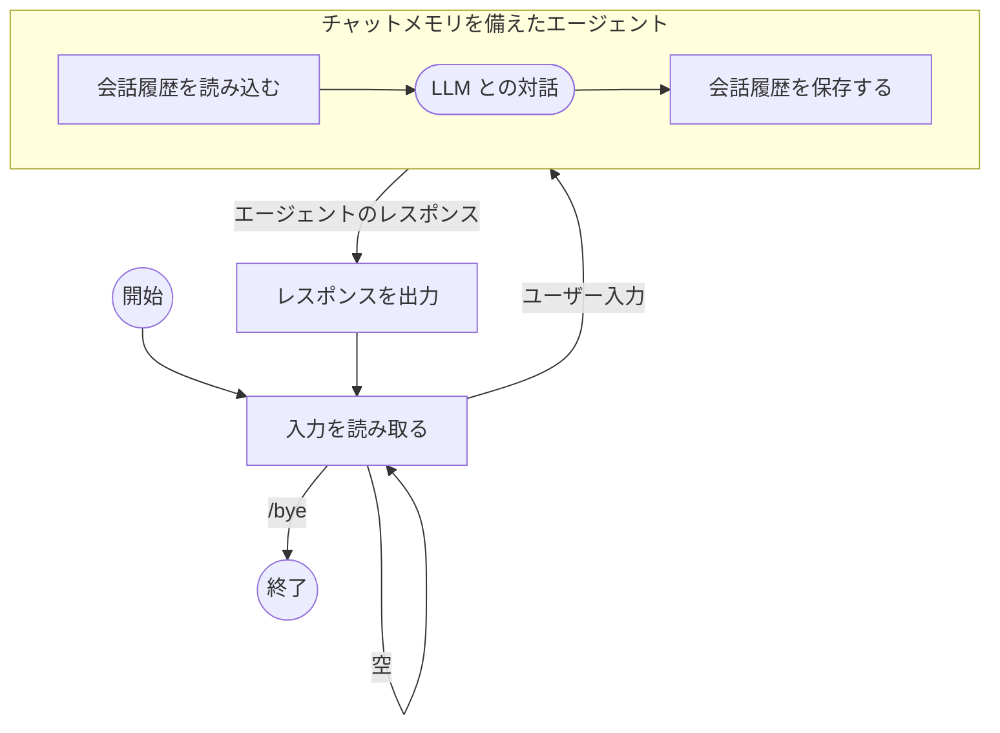

# メモリ機能を備えたチャットエージェントの構築

このガイドでは、[ChatMemory](index.md) 機能を使用して、複数のエージェントとのやり取りを通じて以前のメッセージを記憶する、対話型のコマンドラインチャットアプリケーションを作成する方法を紹介します。

この CLI アプリケーションは、以下のループを実行します。

- コンソールから入力を読み取ります。
- 入力が `/bye` または空でない場合、ユーザー入力と指定されたセッション ID を使用してエージェントを実行します。
- エージェントはまず、そのセッション ID の以前の会話履歴を読み込み、ユーザー入力に加えてメッセージをプロンプトに追加します。
- エージェントは LLM との対話を実行します。
- 実行の最後に、レスポンスを返す前に、エージェントは指定されたセッション ID の下に完全な会話履歴を保存し、サイズを最新の 20 メッセージに制限します。
- その後、アプリはエージェントからのレスポンスを出力します。

以下はその図解です。



## コード

??? note "前提条件"

    --8<-- "quickstart-snippets.md:prerequisites"

    メインの [Koog agents パッケージ](https://central.sonatype.com/artifact/ai.koog/koog-agents/) と [チャットメモリ機能パッケージ](https://mvnrepository.com/artifact/ai.koog/agents-features-memory) を依存関係として追加します。

    === "Gradle (Kotlin)"
    
        ```kotlin title="build.gradle.kts"
        dependencies {
            implementation("ai.koog:koog-agents:1.0.0")
            implementation("ai.koog:agents-features-memory:1.0.0")
        }
        ```
    
    === "Gradle (Groovy)"
    
        ```groovy title="build.gradle"
        dependencies {
            implementation 'ai.koog:koog-agents:0.7.0'
            implementation 'ai.koog:agents-features-memory:0.7.0'
        }
        ```
    
    === "Maven"
    
        ```xml title="pom.xml"
        <dependency>
            <groupId>ai.koog</groupId>
            <artifactId>koog-agents-jvm</artifactId>
            <version>1.0.0</version>
        </dependency>
        <dependency>
            <groupId>ai.koog</groupId>
            <artifactId>agents-features-memory-jvm</artifactId>
            <version>0.7.0</version>
        </dependency>
        ```

    --8<-- "quickstart-snippets.md:api-key"

    このページの例では、`OPENAI_API_KEY` 環境変数が設定されていることを前提としています。

=== "Kotlin"

    <!--- INCLUDE
    import ai.koog.agents.chatMemory.feature.ChatMemory
    import ai.koog.agents.chatMemory.feature.InMemoryChatHistoryProvider
    import ai.koog.agents.core.agent.AIAgent
    import ai.koog.prompt.executor.clients.openai.OpenAIModels
    import ai.koog.prompt.executor.llms.all.simpleOpenAIExecutor
    -->
    ```kotlin
    suspend fun main() {
        val sessionId = "my-conversation"

        simpleOpenAIExecutor(System.getenv("OPENAI_API_KEY")).use { executor ->
            val agent = AIAgent(
                promptExecutor = executor,
                llmModel = OpenAIModels.Chat.GPT5_2,
                systemPrompt = "You are a helpful assistant."
            ) {
                install(ChatMemory) {
                    windowSize(20) // 最新の20メッセージのみを保持
                }
            }

            while (true) {
                print("You: ")
                val input = readln().trim()
                if (input == "/bye") break
                if (input.isEmpty()) continue

                val reply = agent.run(input, sessionId)
                println("Assistant: $reply
")
            }
        }
    }
    ```

=== "Java"

    ```java
    public class ExampleChatAgentOpenAI {
        public static void main(String[] args) {
            String sessionId = "my-conversation";
    
            try (var executor = simpleOpenAIExecutor(System.getenv("OPENAI_API_KEY"))) {
                AIAgent<String, String> agent = AIAgent.builder()
                        .promptExecutor(executor)
                        .llmModel(OpenAIModels.Chat.GPT5_2)
                        .systemPrompt("You are a helpful assistant.")
                        .install(ChatMemory.Feature, config -> {
                            config.windowSize(20); // 最新の20メッセージのみを保持
                        })
                        .build();
    
                Scanner scanner = new Scanner(System.in);
                while (true) {
                    System.out.print("You: ");
                    String input = scanner.nextLine().trim();
                    if (input.equals("/bye")) break;
                    if (input.isEmpty()) continue;
    
                    String reply = agent.run(input, sessionId);
                    System.out.println("Assistant: " + reply + "
");
                }
            } catch (Exception e) {
                e.printStackTrace();
            }
        }
    }
    ```

## 実装の詳細

`agent.run()` の 2 番目の引数は、進行中の会話を識別し区別するために使用される [セッション ID](index.md#session-ids) です。
この例では、一度に 1 つの会話しか行われないため、これは定数になっています。
実際のアプリケーションでは、例えば同じユーザーに関連する会話に対して個別のユニーク ID を持たせることができます。

エージェントは、会話履歴をメモリに保存するデフォルトの [履歴プロバイダー (history provider)](index.md#history-providers) を使用します。
つまり、アプリケーションが終了すると履歴は失われます。
実際のアプリケーションでは、データベースやファイルに履歴を永続的に保存するために、カスタム履歴プロバイダーを実装する必要があります。

`windowSize(20)` [プリプロセッサ (preprocessor)](index.md#preprocessors) は、コンテキストサイズを制限することを保証します。エージェントは最新の 20 メッセージのみを保存します。
これがないと、プロンプトのサイズがコンテキスト制限を超えて増大する可能性があります。

## セッションの例

```
You: My name is Alice.
Assistant: Nice to meet you, Alice! How can I help you today?

You: What's my favorite color? It's blue.
Assistant: Got it — your favorite color is blue!

You: What's my name?
Assistant: Your name is Alice!
```

各やり取りは個別のエージェント実行ですが、`ChatMemory` 機能が 3 番目のメッセージを処理する前に以前のやり取りを読み込んだため、エージェントは「Your name is Alice!」と正しく答えています。