# 事前定義されたノードとコンポーネント

ノードは、Koogフレームワークにおけるエージェントワークフローの基本的な構成要素です。
各ノードはワークフロー内の特定の操作または変換を表し、エッジを使用して接続することで実行フローを定義できます。

一般的に、ノードを使用すると、複雑なロジックを再利用可能なコンポーネントとしてカプセル化し、さまざまなエージェントワークフローに簡単に統合できます。このガイドでは、エージェント戦略で使用できる既存のノードについて説明します。

各ノードは基本的に、特定の型の入力を受け取り、特定の型の出力を返す関数です。

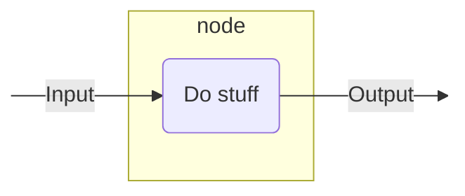

文字列を入力として受け取り、その文字列の長さ（整数）を出力として返すノードを定義する方法を以下に示します。

<!--- INCLUDE
import ai.koog.agents.core.dsl.builder.strategy

val strategy = strategy<String, String>("strategy_name") {
-->
<!--- SUFFIX
}
-->
```kotlin
val nodeLength by node<String, Int> { input ->
    input.length
}
```
<!--- KNIT example-nodes-and-component-01.kt -->

詳細については、[`node()`](https://api.koog.ai/agents/agents-core/ai.koog.agents.core.dsl.builder/-a-i-agent-subgraph-builder-base/node.html)を参照してください。

## ユーティリティノード

### nodeDoNothing

何もせずに入力を出力として返すシンプルなパススルーノードです。詳細については、[APIリファレンス](https://api.koog.ai/agents/agents-core/ai.koog.agents.core.dsl.extension/node-do-nothing.html)を参照してください。

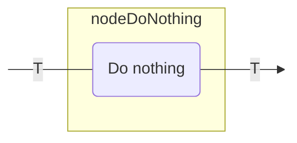

このノードは次の目的で使用できます。

- グラフにプレースホルダーノードを作成する。
- データを変更せずに接続点を作成する。

以下に例を示します。

<!--- INCLUDE
import ai.koog.agents.core.dsl.builder.forwardTo
import ai.koog.agents.core.dsl.builder.strategy
import ai.koog.agents.core.dsl.extension.nodeDoNothing

val strategy = strategy<String, String>("strategy_name") {
-->
<!--- SUFFIX
}
-->
```kotlin
val passthrough by nodeDoNothing<String>("passthrough")

edge(nodeStart forwardTo passthrough)
edge(passthrough forwardTo nodeFinish)
```
<!--- KNIT example-nodes-and-component-02.kt -->

## LLMノード

### nodeAppendPrompt

提供されたプロンプトビルダーを使用してLLMプロンプトにメッセージを追加するノードです。
これは、実際のLLMリクエストを行う前に会話コンテキストを変更する場合に役立ちます。詳細については、[APIリファレンス](https://api.koog.ai/agents/agents-core/ai.koog.agents.core.dsl.extension/node-update-prompt.html)。

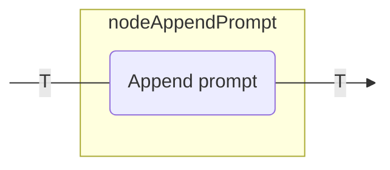

このノードは次の目的で使用できます。

- プロンプトにシステム指示を追加する。
- 会話にユーザーメッセージを挿入する。
- 後続のLLMリクエストのためのコンテキストを準備する。

以下に例を示します。

<!--- INCLUDE
import ai.koog.agents.core.dsl.builder.forwardTo
import ai.koog.agents.core.dsl.builder.strategy
import ai.koog.agents.core.dsl.extension.nodeAppendPrompt

typealias Input = Unit
typealias Output = Unit

val strategy = strategy<String, String>("strategy_name") {
-->
<!--- SUFFIX
}
-->
```kotlin
val firstNode by node<Input, Output> {
    // Transform input to output
}

val secondNode by node<Output, Output> {
    // Transform output to output
}

// Node will get the value of type Output as input from the previous node and path through it to the next node
val setupContext by nodeAppendPrompt<Output>("setupContext") {
    system("You are a helpful assistant specialized in Kotlin programming.")
    user("I need help with Kotlin coroutines.")
}

edge(firstNode forwardTo setupContext)
edge(setupContext forwardTo secondNode)
```
<!--- KNIT example-nodes-and-component-03.kt -->

### nodeLLMSendMessageOnlyCallingTools

ユーザーメッセージをLLMプロンプトに追加し、LLMがツールのみを呼び出せる応答を取得するノードです。詳細については、[APIリファレンス](https://api.koog.ai/agents/agents-core/ai.koog.agents.core.dsl.extension/node-l-l-m-send-message-only-calling-tools.html)を参照してください。

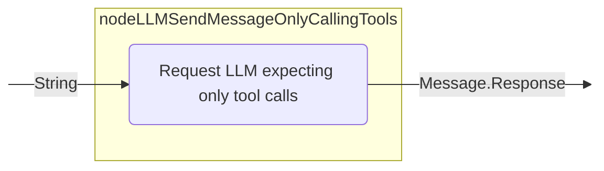

### nodeLLMSendMessageForceOneTool

ユーザーメッセージをLLMプロンプトに追加し、LLMに特定のツールを使用させるノードです。詳細については、[APIリファレンス](https://api.koog.ai/agents/agents-core/ai.koog.agents.core.dsl.extension/node-l-l-m-send-message-force-one-tool.html)を参照してください。

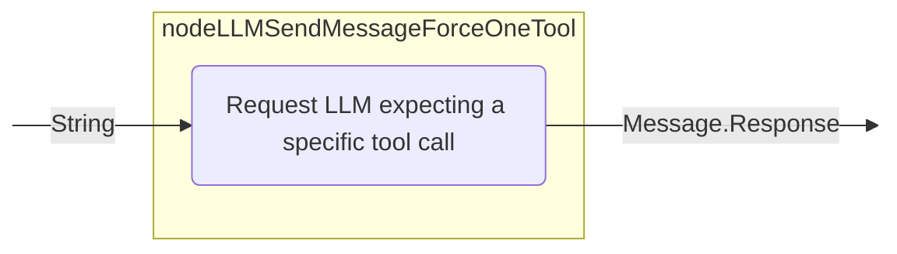

### nodeLLMRequest

ユーザーメッセージをLLMプロンプトに追加し、オプションでツール使用を含む応答を取得するノードです。ノードの設定によって、メッセージの処理中にツール呼び出しが許可されるかどうかが決まります。詳細については、[APIリファレンス](https://api.koog.ai/agents/agents-core/ai.koog.agents.core.dsl.extension/node-l-l-m-request.html)を参照してください。

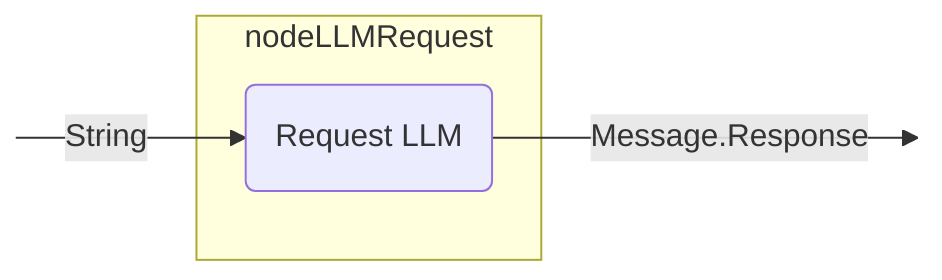

このノードは次の目的で使用できます。

- 現在のプロンプトに対するLLM応答を生成し、LLMがツール呼び出しを生成できるかどうかを制御する。

以下に例を示します。

<!--- INCLUDE
import ai.koog.agents.core.dsl.builder.forwardTo
import ai.koog.agents.core.dsl.builder.strategy
import ai.koog.agents.core.dsl.extension.nodeLLMRequest
import ai.koog.agents.core.dsl.extension.nodeDoNothing

val strategy = strategy<String, String>("strategy_name") {
    val getUserQuestion by nodeDoNothing<String>()
-->
<!--- SUFFIX
}
-->
```kotlin
val requestLLM by nodeLLMRequest("requestLLM", allowToolCalls = true)
edge(getUserQuestion forwardTo requestLLM)
```
<!--- KNIT example-nodes-and-component-04.kt -->

### nodeLLMRequestStructured

ユーザーメッセージをLLMプロンプトに追加し、エラー修正機能を備えたLLMから構造化データを要求するノードです。詳細については、[APIリファレンス](https://api.koog.ai/agents/agents-core/ai.koog.agents.core.dsl.extension/node-l-l-m-request-structured.html)を参照してください。

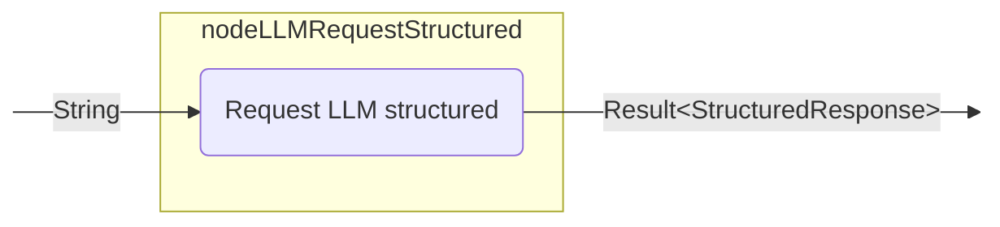

### nodeLLMRequestStreaming

ユーザーメッセージをLLMプロンプトに追加し、ストリームデータ変換の有無にかかわらずLLM応答をストリームするノードです。詳細については、[APIリファレンス](https://api.koog.ai/agents/agents-core/ai.koog.agents.core.dsl.extension/node-l-l-m-request-streaming.html)を参照してください。

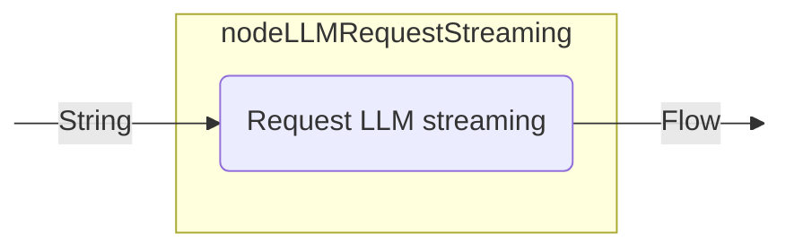

### nodeLLMRequestMultiple

ユーザーメッセージをLLMプロンプトに追加し、ツール呼び出しが有効な複数のLLM応答を取得するノードです。詳細については、[APIリファレンス](https://api.koog.ai/agents/agents-core/ai.koog.agents.core.dsl.extension/node-l-l-m-request-multiple.html)を参照してください。

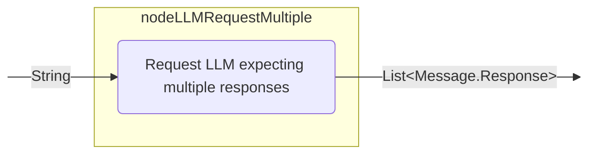

このノードは次の目的で使用できます。

- 複数のツール呼び出しを必要とする複雑なクエリを処理する。
- 複数のツール呼び出しを生成する。
- 複数の並行アクションを必要とするワークフローを実装する。

以下に例を示します。

<!--- INCLUDE
import ai.koog.agents.core.dsl.builder.forwardTo
import ai.koog.agents.core.dsl.builder.strategy
import ai.koog.agents.core.dsl.extension.nodeLLMRequestMultiple
import ai.koog.agents.core.dsl.extension.nodeDoNothing

val strategy = strategy<String, String>("strategy_name") {
    val getComplexUserQuestion by nodeDoNothing<String>()
-->
<!--- SUFFIX
}
-->
```kotlin
val requestLLMMultipleTools by nodeLLMRequestMultiple()
edge(getComplexUserQuestion forwardTo requestLLMMultipleTools)
```
<!--- KNIT example-nodes-and-component-05.kt -->

### nodeLLMCompressHistory

現在のLLMプロンプト（メッセージ履歴）を要約に圧縮し、メッセージを簡潔な要約（TL;DR）に置き換えるノードです。詳細については、[APIリファレンス](https://api.koog.ai/agents/agents-core/ai.koog.agents.core.dsl.extension/node-l-l-m-compress-history.html)を参照してください。
これは、履歴を圧縮してトークン使用量を削減することで、長い会話を管理するのに役立ちます。

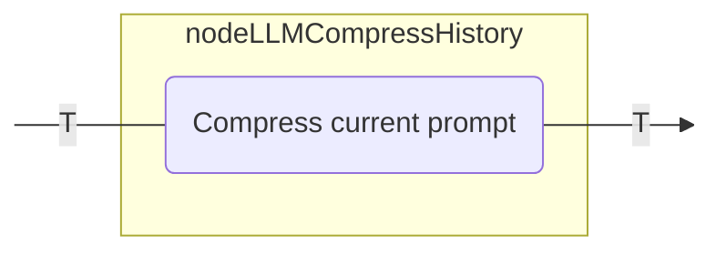

履歴圧縮の詳細については、[履歴圧縮](history-compression.md)を参照してください。

このノードは次の目的で使用できます。

- トークン使用量を削減するために長い会話を管理する。
- コンテキストを維持するために会話履歴を要約する。
- 長時間実行されるエージェントでメモリ管理を実装する。

以下に例を示します。

<!--- INCLUDE
import ai.koog.agents.core.dsl.builder.forwardTo
import ai.koog.agents.core.dsl.builder.strategy
import ai.koog.agents.core.dsl.extension.nodeLLMCompressHistory
import ai.koog.agents.core.dsl.extension.nodeDoNothing
import ai.koog.agents.core.dsl.extension.HistoryCompressionStrategy

val strategy = strategy<String, String>("strategy_name") {
    val generateHugeHistory by nodeDoNothing<String>()
-->
<!--- SUFFIX
}
-->
```kotlin
val compressHistory by nodeLLMCompressHistory<String>(
    "compressHistory",
    strategy = HistoryCompressionStrategy.FromLastNMessages(10),
    preserveMemory = true
)
edge(generateHugeHistory forwardTo compressHistory)
```
<!--- KNIT example-nodes-and-component-06.kt -->

## ツールノード

### nodeExecuteTool

単一のツール呼び出しを実行し、その結果を返すノードです。このノードは、LLMによって行われたツール呼び出しを処理するために使用されます。詳細については、[APIリファレンス](https://api.koog.ai/agents/agents-core/ai.koog.agents.core.dsl.extension/node-execute-tool.html)を参照してください。

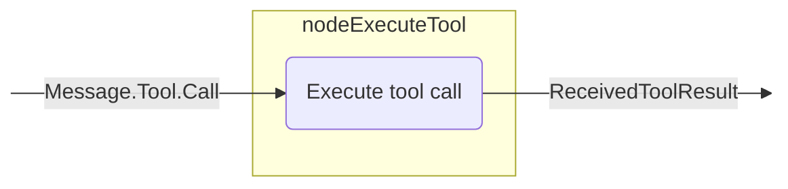

このノードは次の目的で使用できます。

- LLMによって要求されたツールを実行する。
- LLMの決定に応じて特定のアクションを処理する。
- エージェントワークフローに外部機能を統合する。

以下に例を示します。

<!--- INCLUDE
import ai.koog.agents.core.dsl.builder.forwardTo
import ai.koog.agents.core.dsl.builder.strategy
import ai.koog.agents.core.dsl.extension.nodeExecuteTool
import ai.koog.agents.core.dsl.extension.nodeLLMRequest
import ai.koog.agents.core.dsl.extension.onToolCall

val strategy = strategy<String, String>("strategy_name") {
-->
<!--- SUFFIX
}
-->
```kotlin
val requestLLM by nodeLLMRequest()
val executeTool by nodeExecuteTool()
edge(requestLLM forwardTo executeTool onToolCall { true })
```
<!--- KNIT example-nodes-and-component-07.kt -->

### nodeLLMSendToolResult

ツール結果をプロンプトに追加し、LLM応答を要求するノードです。詳細については、[APIリファレンス](https://api.koog.ai/agents/agents-core/ai.koog.agents.core.dsl.extension/node-l-l-m-send-tool-result.html)を参照してください。

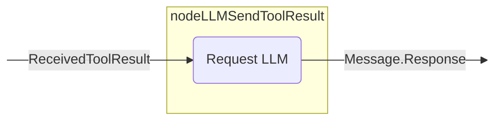

このノードは次の目的で使用できます。

- ツール実行の結果を処理する。
- ツール出力に基づいて応答を生成する。
- ツール実行後に会話を続ける。

以下に例を示します。

<!--- INCLUDE
import ai.koog.agents.core.dsl.builder.forwardTo
import ai.koog.agents.core.dsl.builder.strategy
import ai.koog.agents.core.dsl.extension.nodeExecuteTool
import ai.koog.agents.core.dsl.extension.nodeLLMSendToolResult

val strategy = strategy<String, String>("strategy_name") {
-->
<!--- SUFFIX
}
-->
```kotlin
val executeTool by nodeExecuteTool()
val sendToolResultToLLM by nodeLLMSendToolResult()
edge(executeTool forwardTo sendToolResultToLLM)
```
<!--- KNIT example-nodes-and-component-08.kt -->

### nodeExecuteMultipleTools

複数のツール呼び出しを実行するノードです。これらの呼び出しはオプションで並行して実行できます。詳細については、[APIリファレンス](https://api.koog.ai/agents/agents-core/ai.koog.agents.core.dsl.extension/node-execute-multiple-tools.html)を参照してください。

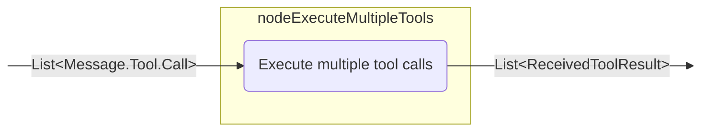

このノードは次の目的で使用できます。

- 複数のツールを並行して実行する。
- 複数のツール実行を必要とする複雑なワークフローを処理する。
- ツール呼び出しをバッチ処理することでパフォーマンスを最適化する。

以下に例を示します。

<!--- INCLUDE
import ai.koog.agents.core.dsl.builder.forwardTo
import ai.koog.agents.core.dsl.builder.strategy
import ai.koog.agents.core.dsl.extension.nodeLLMRequestMultiple
import ai.koog.agents.core.dsl.extension.nodeExecuteMultipleTools
import ai.koog.agents.core.dsl.extension.onMultipleToolCalls

val strategy = strategy<String, String>("strategy_name") {
-->
<!--- SUFFIX
}
-->
```kotlin
val requestLLMMultipleTools by nodeLLMRequestMultiple()
val executeMultipleTools by nodeExecuteMultipleTools()
edge(requestLLMMultipleTools forwardTo executeMultipleTools onMultipleToolCalls { true })
```
<!--- KNIT example-nodes-and-component-09.kt -->

### nodeLLMSendMultipleToolResults

複数のツール結果をプロンプトに追加し、複数のLLM応答を取得するノードです。詳細については、[APIリファレンス](https://api.koog.ai/agents/agents-core/ai.koog.agents.core.dsl.extension/node-l-l-m-send-multiple-tool-results.html)を参照してください。

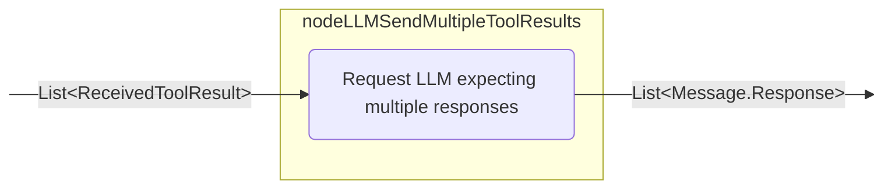

このノードは次の目的で使用できます。

- 複数のツール実行の結果を処理する。
- 複数のツール呼び出しを生成する。
- 複数の並行アクションを含む複雑なワークフローを実装する。

以下に例を示します。

<!--- INCLUDE
import ai.koog.agents.core.dsl.builder.forwardTo
import ai.koog.agents.core.dsl.builder.strategy
import ai.koog.agents.core.dsl.extension.nodeLLMSendMultipleToolResults
import ai.koog.agents.core.dsl.extension.nodeExecuteMultipleTools

val strategy = strategy<String, String>("strategy_name") {
-->
<!--- SUFFIX
}
-->
```kotlin
val executeMultipleTools by nodeExecuteMultipleTools()
val sendMultipleToolResultsToLLM by nodeLLMSendMultipleToolResults()
edge(executeMultipleTools forwardTo sendMultipleToolResultsToLLM)
```
<!--- KNIT example-nodes-and-component-10.kt -->

## ノード出力変換

このフレームワークは、ノードの出力に変換を適用する、変換されたバージョンのノードを作成できる `transform` 拡張関数を提供します。これは、元のノードの機能を維持しながら、ノードの出力を異なる型または形式に変換する必要がある場合に役立ちます。

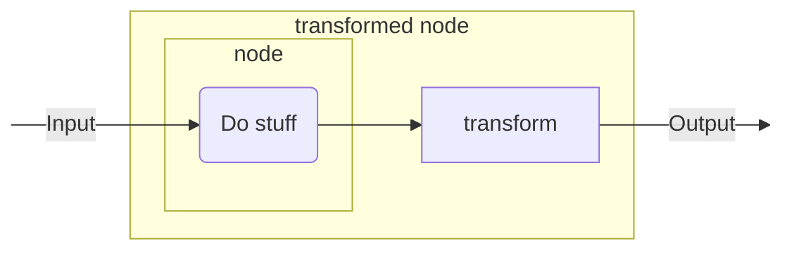

### transform

[`transform()`](https://api.koog.ai/agents/agents-core/ai.koog.agents.core.dsl.builder/-a-i-agent-node-delegate/transform.html) 関数は、元のノードをラップし、その出力に変換関数を適用する新しい `AIAgentNodeDelegate` を作成します。

<!--- INCLUDE
/**
-->
<!--- SUFFIX
**/
-->
```kotlin
inline fun <reified T> AIAgentNodeDelegate<Input, Output>.transform(
    noinline transformation: suspend (Output) -> T
): AIAgentNodeDelegate<Input, T>
```
<!--- KNIT example-nodes-and-component-11.kt -->

#### カスタムノード変換

カスタムノードの出力を異なるデータ型に変換する:

<!--- INCLUDE
import ai.koog.agents.core.dsl.builder.forwardTo
import ai.koog.agents.core.dsl.builder.strategy
import ai.koog.agents.core.dsl.extension.nodeDoNothing

val strategy = strategy<String, Int>("strategy_name") {
-->
<!--- SUFFIX
}
-->
```kotlin
val textNode by nodeDoNothing<String>("textNode").transform<Int> { text ->
    text.split(" ").filter { it.isNotBlank() }.size
}

edge(nodeStart forwardTo textNode)
edge(textNode forwardTo nodeFinish)
```
<!--- KNIT example-nodes-and-component-12.kt -->

#### 組み込みノード変換

`nodeLLMRequest`のような組み込みノードの出力を変換する:

<!--- INCLUDE
import ai.koog.agents.core.dsl.builder.forwardTo
import ai.koog.agents.core.dsl.builder.strategy
import ai.koog.agents.core.dsl.extension.nodeLLMRequest

val strategy = strategy<String, Int>("strategy_name") {
-->
<!--- SUFFIX
}
-->
```kotlin
val lengthNode by nodeLLMRequest("llmRequest").transform<Int> { assistantMessage ->
    assistantMessage.content.length
}

edge(nodeStart forwardTo lengthNode)
edge(lengthNode forwardTo nodeFinish)
```
<!--- KNIT example-nodes-and-component-13.kt -->

## 事前定義されたサブグラフ

このフレームワークは、一般的に使用されるパターンとワークフローをカプセル化した事前定義されたサブグラフを提供します。これらのサブグラフは、ベースノードとエッジの作成を自動的に処理することで、複雑なエージェント戦略の開発を簡素化します。

事前定義されたサブグラフを使用すると、さまざまな一般的なパイプラインを実装できます。以下に例を示します:

1.  データを準備する。
2.  タスクを実行する。
3.  タスク結果を検証する。結果が正しくない場合、調整を行うためのフィードバックメッセージとともにステップ2に戻る。

### subgraphWithTask

提供されたツールを使用して特定のタスクを実行し、構造化された結果を返すサブグラフです。複数の応答を伴うLLMインタラクション（アシスタントがツール呼び出しを挟んで複数の応答を生成する場合）をサポートし、ツール呼び出しの実行方法を制御できます。詳細については、[APIリファレンス](https://api.koog.ai/agents/agents-ext/ai.koog.agents.ext.agent/subgraph-with-task.html)を参照してください。

このサブグラフは次の目的で使用できます。

- より大きなワークフロー内で特定のタスクを処理する特殊なコンポーネントを作成する。
- 明確な入出力インターフェースで複雑なロジックをカプセル化する。
- タスク固有のツール、モデル、プロンプトを設定する。
- 自動圧縮で会話履歴を管理する。
- 構造化されたエージェントワークフローとタスク実行パイプラインを開発する。
- 複数のアシスタント応答とツール呼び出しを含むフローなど、LLMタスク実行から構造化された結果を生成する。

APIは、オプションパラメーターを使用して実行を微調整することを可能にします。

-   実行モード (runMode)：タスク実行中のツール呼び出しの実行方法を制御します（デフォルトはシーケンシャル）。基盤となるモデル/エグゼキュータがサポートしている場合、これを使用して異なるツール実行戦略を切り替えます。
-   アシスタント応答最大繰り返し数 (assistantResponseRepeatMax)：タスクが完了できないと判断されるまでに許可されるアシスタント応答の数を制限します（提供されない場合は安全な内部制限がデフォルトとなります）。

サブグラフにタスクをテキストとして提供し、必要に応じてLLMを設定し、必要なツールを提供すると、サブグラフがそのタスクを処理して解決します。以下に例を示します:

<!--- INCLUDE
import ai.koog.agents.core.dsl.builder.strategy
import ai.koog.agents.ext.tool.SayToUser
import ai.koog.prompt.executor.clients.openai.OpenAIModels
import ai.koog.agents.ext.agent.subgraphWithTask
import ai.koog.agents.core.agent.ToolCalls

val searchTool = SayToUser
val calculatorTool = SayToUser
val weatherTool = SayToUser

val strategy = strategy<String, String>("strategy_name") {
-->
<!--- SUFFIX
}
-->
```kotlin
val processQuery by subgraphWithTask<String, String>(
    tools = listOf(searchTool, calculatorTool, weatherTool),
    llmModel = OpenAIModels.Chat.GPT4o,
    runMode = ToolCalls.SEQUENTIAL,
    assistantResponseRepeatMax = 3,
) { userQuery ->
    """
    You are a helpful assistant that can answer questions about various topics.
    Please help with the following query:
    $userQuery
    """
}
```
<!--- KNIT example-nodes-and-component-14.kt -->

### subgraphWithVerification

`subgraphWithTask`の特殊なバージョンで、タスクが正しく実行されたかを確認し、発生した問題の詳細を提供します。このサブグラフは、検証または品質チェックを必要とするワークフローに役立ちます。詳細については、[APIリファレンス](https://api.koog.ai/agents/agents-ext/ai.koog.agents.ext.agent/subgraph-with-verification.html)を参照してください。

このサブグラフは次の目的で使用できます。

- タスク実行の正確性を検証する。
- ワークフローに品質管理プロセスを実装する。
- 自己検証コンポーネントを作成する。
- 成功/失敗ステータスと詳細なフィードバックを含む構造化された検証結果を生成する。

このサブグラフは、LLMがワークフローの最後に検証ツールを呼び出し、タスクが正常に完了したかどうかをチェックすることを保証します。この検証が最終ステップとして実行されることを保証し、タスクが正常に完了したかどうかを示す `CriticResult` と詳細なフィードバックを返します。
以下に例を示します:

<!--- INCLUDE
import ai.koog.agents.core.dsl.builder.strategy
import ai.koog.agents.ext.tool.SayToUser
import ai.koog.prompt.executor.clients.anthropic.AnthropicModels
import ai.koog.agents.ext.agent.subgraphWithVerification
import ai.koog.agents.core.agent.ToolCalls

val runTestsTool = SayToUser
val analyzeTool = SayToUser
val readFileTool = SayToUser

val strategy = strategy<String, String>("strategy_name") {
-->
<!--- SUFFIX
}
-->
```kotlin
val verifyCode by subgraphWithVerification<String>(
    tools = listOf(runTestsTool, analyzeTool, readFileTool),
    llmModel = AnthropicModels.Sonnet_3_7,
    runMode = ToolCalls.SEQUENTIAL,
    assistantResponseRepeatMax = 3,
) { codeToVerify ->
    """
    You are a code reviewer. Please verify that the following code meets all requirements:
    1. It compiles without errors
    2. All tests pass
    3. It follows the project's coding standards

    Code to verify:
    $codeToVerify
    """
}
```
<!--- KNIT example-nodes-and-component-15.kt -->

## 事前定義された戦略と一般的な戦略パターン

このフレームワークは、さまざまなノードを組み合わせた事前定義された戦略を提供します。
ノードはエッジを使用して接続され、操作のフローを定義し、各エッジをたどるタイミングを特定する条件が含まれます。

必要に応じて、これらの戦略をエージェントワークフローに統合できます。

### 単一実行戦略

単一実行戦略は、エージェントが一度入力を処理し、結果を返す非対話型のユースケース向けに設計されています。

この戦略は、複雑なロジックを必要としない単純なプロセスを実行する必要がある場合に使用できます。

<!--- INCLUDE
import ai.koog.agents.core.agent.entity.AIAgentGraphStrategy
import ai.koog.agents.core.dsl.builder.forwardTo
import ai.koog.agents.core.dsl.builder.strategy
import ai.koog.agents.core.dsl.extension.*

-->
```kotlin

public fun singleRunStrategy(): AIAgentGraphStrategy<String, String> = strategy("single_run") {
    val nodeCallLLM by nodeLLMRequest("sendInput")
    val nodeExecuteTool by nodeExecuteTool("nodeExecuteTool")
    val nodeSendToolResult by nodeLLMSendToolResult("nodeSendToolResult")

    edge(nodeStart forwardTo nodeCallLLM)
    edge(nodeCallLLM forwardTo nodeExecuteTool onToolCall { true })
    edge(nodeCallLLM forwardTo nodeFinish onAssistantMessage { true })
    edge(nodeExecuteTool forwardTo nodeSendToolResult)
    edge(nodeSendToolResult forwardTo nodeFinish onAssistantMessage { true })
    edge(nodeSendToolResult forwardTo nodeExecuteTool onToolCall { true })
}
```
<!--- KNIT example-nodes-and-component-16.kt -->

### ツールベース戦略

ツールベース戦略は、特定の操作を実行するためにツールに大きく依存するワークフロー向けに設計されています。
通常、LLMの決定に基づいてツールを実行し、結果を処理します。

<!--- INCLUDE
import ai.koog.agents.core.agent.entity.AIAgentGraphStrategy
import ai.koog.agents.core.dsl.builder.forwardTo
import ai.koog.agents.core.dsl.builder.strategy
import ai.koog.agents.core.dsl.extension.*
import ai.koog.agents.core.tools.ToolRegistry

-->
```kotlin
fun toolBasedStrategy(name: String, toolRegistry: ToolRegistry): AIAgentGraphStrategy<String, String> {
    return strategy(name) {
        val nodeSendInput by nodeLLMRequest()
        val nodeExecuteTool by nodeExecuteTool()
        val nodeSendToolResult by nodeLLMSendToolResult()

        // Define the flow of the agent
        edge(nodeStart forwardTo nodeSendInput)

        // If the LLM responds with a message, finish
        edge(
            (nodeSendInput forwardTo nodeFinish)
                    onAssistantMessage { true }
        )

        // If the LLM calls a tool, execute it
        edge(
            (nodeSendInput forwardTo nodeExecuteTool)
                    onToolCall { true }
        )

        // Send the tool result back to the LLM
        edge(nodeExecuteTool forwardTo nodeSendToolResult)

        // If the LLM calls another tool, execute it
        edge(
            (nodeSendToolResult forwardTo nodeExecuteTool)
                    onToolCall { true }
        )

        // If the LLM responds with a message, finish
        edge(
            (nodeSendToolResult forwardTo nodeFinish)
                    onAssistantMessage { true }
        )
    }
}
```
<!--- KNIT example-nodes-and-component-17.kt -->

### ストリーミングデータ戦略

ストリーミングデータ戦略は、LLMからのストリーミングデータを処理するために設計されています。通常、
ストリーミングデータを要求し、それを処理し、処理されたデータとともにツールを呼び出す可能性があります。

<!--- INCLUDE
import ai.koog.agents.core.dsl.builder.forwardTo
import ai.koog.agents.core.dsl.builder.strategy
import ai.koog.agents.example.exampleStreamingApi03.Book
import ai.koog.agents.example.exampleStreamingApi04.markdownBookDefinition
import ai.koog.agents.example.exampleStreamingApi06.parseMarkdownStreamToBooks
-->
```kotlin
val agentStrategy = strategy<String, List<Book>>("library-assistant") {
    // Describe the node containing the output stream parsing
    val getMdOutput by node<String, List<Book>> { booksDescription ->
        val books = mutableListOf<Book>()
        val mdDefinition = markdownBookDefinition()

        llm.writeSession { 
            appendPrompt { user(booksDescription) }
            // Initiate the response stream in the form of the definition `mdDefinition`
            val markdownStream = requestLLMStreaming(mdDefinition)
            // Call the parser with the result of the response stream and perform actions with the result
            parseMarkdownStreamToBooks(markdownStream).collect { book ->
                books.add(book)
                println("Parsed Book: ${book.title} by ${book.author}")
            }
        }

        books
    }
    // Describe the agent's graph making sure the node is accessible
    edge(nodeStart forwardTo getMdOutput)
    edge(getMdOutput forwardTo nodeFinish)
}
```
<!--- KNIT example-nodes-and-component-18.kt -->