# 構成済みのノードとコンポーネント

ノードは、Koogフレームワークにおけるエージェントワークフローの基本的な構成要素です。
各ノードはワークフロー内の特定の操作や変換を表し、これらをエッジで接続することで実行フローを定義できます。

一般に、ノードを使用すると、複雑なロジックを再利用可能なコンポーネントとしてカプセル化でき、さまざまなエージェントワークフローに簡単に統合できるようになります。このガイドでは、エージェント戦略（strategy）で使用できる既存のノードについて説明します。

各ノードは本質的に、特定の型の入力を受け取り、特定の型の出力を返す関数です。

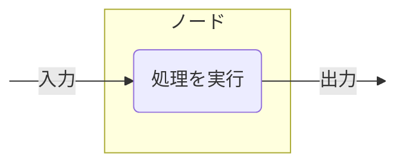
```mermaid
graph LR
    in:::hidden
    out:::hidden
    
    subgraph node ["ノード"]
        execute(処理を実行)
    end
    
    in --入力--> execute --出力--> out

    classDef hidden display: none;
```

以下は、入力として文字列を受け取り、出力としてその文字列の長さ（整数）を返すノードを定義する方法です。

<!--- INCLUDE
import ai.koog.agents.core.dsl.builder.strategy

val strategy = strategy<String, String>("strategy_name") {
-->
<!--- SUFFIX
}
-->
```kotlin
val nodeLength by node<String, Int> { input ->
    input.length
}
```
<!--- KNIT example-nodes-and-component-01.kt -->

詳細については、[`node()`](api:agents-core::ai.koog.agents.core.dsl.builder.AIAgentSubgraphBuilderBase.node) を参照してください。

## ユーティリティノード

### nodeDoNothing

何も行わず、入力をそのまま出力として返すシンプルなパススルーノードです。詳細は [APIリファレンス](api:agents-core::ai.koog.agents.core.dsl.extension.nodeDoNothing) を参照してください。

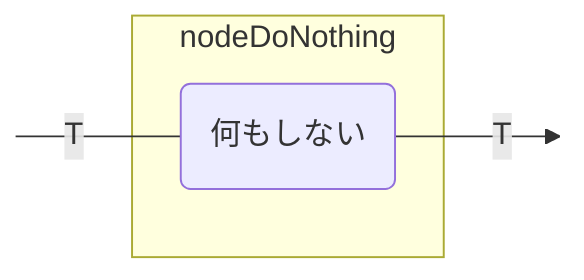
```mermaid
graph LR
    in:::hidden
    out:::hidden
    
    subgraph node ["nodeDoNothing"]
        execute(何もしない)
    end
    
    in ---|T| execute --T--> out

    classDef hidden display: none;
```

このノードは以下の目的で使用できます：

- グラフ内にプレースホルダーノードを作成する。
- データを変更せずに接続点を作成する。

例を以下に示します：

<!--- INCLUDE
import ai.koog.agents.core.dsl.builder.forwardTo
import ai.koog.agents.core.dsl.builder.strategy
import ai.koog.agents.core.dsl.extension.nodeDoNothing

val strategy = strategy<String, String>("strategy_name") {
-->
<!--- SUFFIX
}
-->
```kotlin
val passthrough by nodeDoNothing<String>("passthrough")

edge(nodeStart forwardTo passthrough)
edge(passthrough forwardTo nodeFinish)
```
<!--- KNIT example-nodes-and-component-02.kt -->

## LLMノード

### nodeAppendPrompt

提供されたプロンプトビルダーを使用して、LLMプロンプトにメッセージを追加するノードです。
これは、実際のLLMリクエストを行う前に、会話のコンテキストを修正するのに役立ちます。詳細は [APIリファレンス](api:agents-core::ai.koog.agents.core.dsl.extension.nodeUpdatePrompt) を参照してください。

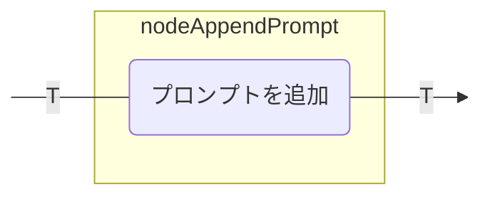
```mermaid
graph LR
    in:::hidden
    out:::hidden
    
    subgraph node ["nodeAppendPrompt"]
        execute(プロンプトを追加)
    end
    
    in ---|T| execute --T--> out

    classDef hidden display: none;
```

このノードは以下の目的で使用できます：

- プロンプトにシステム指示を追加する。
- 会話にユーザーメッセージを挿入する。
- 後続のLLMリクエストのためのコンテキストを準備する。

例を以下に示します：

<!--- INCLUDE
import ai.koog.agents.core.dsl.builder.forwardTo
import ai.koog.agents.core.dsl.builder.strategy
import ai.koog.agents.core.dsl.extension.nodeAppendPrompt

typealias Input = Unit
typealias Output = Unit

val strategy = strategy<String, String>("strategy_name") {
-->
<!--- SUFFIX
}
-->
```kotlin
val firstNode by node<Input, Output> {
    // 入力を出力に変換
}

val secondNode by node<Output, Output> {
    // 出力を出力に変換
}

// ノードは前のノードから Output 型の値を入力として受け取り、
// それをそのまま次のノードに渡します。
val setupContext by nodeAppendPrompt<Output>("setupContext") {
    system("You are a helpful assistant specialized in Kotlin programming.")
    user("I need help with Kotlin coroutines.")
}

edge(firstNode forwardTo setupContext)
edge(setupContext forwardTo secondNode)
```
<!--- KNIT example-nodes-and-component-03.kt -->

### nodeLLMSendMessageOnlyCallingTools

LLMプロンプトにユーザーメッセージを追加し、LLMがツール呼び出しのみを行えるレスポンスを取得するノードです。詳細は [APIリファレンス](api:agents-core::ai.koog.agents.core.dsl.extension.nodeLLMSendMessageOnlyCallingTools) を参照してください。

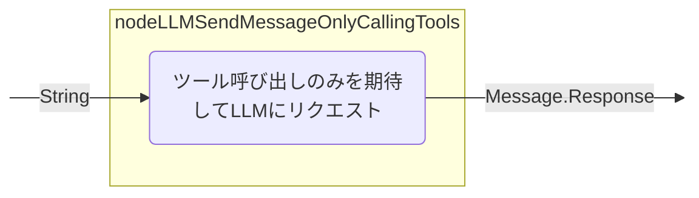
```mermaid
graph LR
    in:::hidden
    out:::hidden
    
    subgraph node ["nodeLLMSendMessageOnlyCallingTools"]
        execute(ツール呼び出しのみを期待してLLMにリクエスト)
    end
    
    in --String--> execute --Message.Response--> out

    classDef hidden display: none;
```

### nodeLLMSendMessageForceOneTool

LLMプロンプトにユーザーメッセージを追加し、LLMに特定のツールの使用を強制するノードです。詳細は [APIリファレンス](api:agents-core::ai.koog.agents.core.dsl.extension.nodeLLMSendMessageForceOneTool) を参照してください。

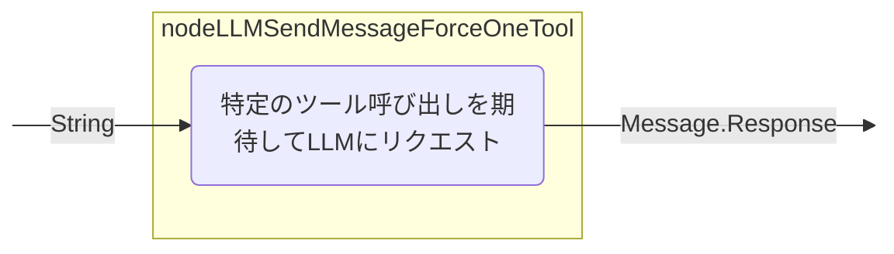
```mermaid
graph LR
    in:::hidden
    out:::hidden
    
    subgraph node ["nodeLLMSendMessageForceOneTool"]
        execute(特定のツール呼び出しを期待してLLMにリクエスト)
    end
    
    in --String--> execute --Message.Response--> out

    classDef hidden display: none;
```

### nodeLLMRequest

LLMプロンプトにユーザーメッセージを追加し、オプションでツールを使用できるレスポンスを取得するノードです。ノードの設定により、メッセージの処理中にツール呼び出しを許可するかどうかが決まります。詳細は [APIリファレンス](api:agents-core::ai.koog.agents.core.dsl.extension.nodeLLMRequest) を参照してください。

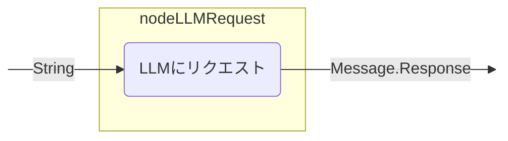
```mermaid
graph LR
    in:::hidden
    out:::hidden
    
    subgraph node ["nodeLLMRequest"]
        execute(LLMにリクエスト)
    end
    
    in --String--> execute --Message.Response--> out

    classDef hidden display: none;
```

このノードは以下の目的で使用できます：

- 現在のプロンプトに対してLLMレスポンスを生成し、LLMによるツール呼び出し生成を許可するかどうかを制御する。

例を以下に示します：

<!--- INCLUDE
import ai.koog.agents.core.dsl.builder.forwardTo
import ai.koog.agents.core.dsl.builder.strategy
import ai.koog.agents.core.dsl.extension.nodeLLMRequest
import ai.koog.agents.core.dsl.extension.nodeDoNothing

val strategy = strategy<String, String>("strategy_name") {
    val getUserQuestion by nodeDoNothing<String>()
-->
<!--- SUFFIX
}
-->
```kotlin
val requestLLM by nodeLLMRequest("requestLLM", allowToolCalls = true)
edge(getUserQuestion forwardTo requestLLM)
```
<!--- KNIT example-nodes-and-component-04.kt -->

### nodeLLMRequestStructured

LLMプロンプトにユーザーメッセージを追加し、エラー訂正機能を備えた構造化データをLLMに要求するノードです。詳細は [APIリファレンス](api:agents-core::ai.koog.agents.core.dsl.extension.nodeLLMRequestStructured) を参照してください。

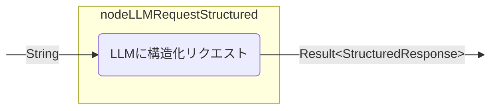
```mermaid
graph LR
    in:::hidden
    out:::hidden
    
    subgraph node ["nodeLLMRequestStructured"]
        execute(LLMに構造化リクエスト)
    end
    
    in --String--> execute -- "Result&lt;StructuredResponse&gt;" --> out

    classDef hidden display: none;
```

### nodeLLMRequestStreaming

LLMプロンプトにユーザーメッセージを追加し、ストリームデータの変換の有無にかかわらず、LLMレスポンスをストリーミングするノードです。詳細は [APIリファレンス](api:agents-core::ai.koog.agents.core.dsl.extension.nodeLLMRequestStreaming) を参照してください。

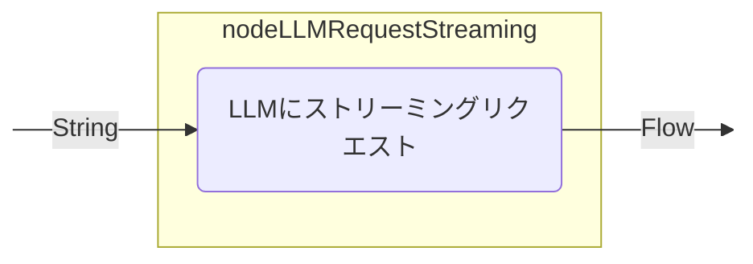
```mermaid
graph LR
    in:::hidden
    out:::hidden
    
    subgraph node ["nodeLLMRequestStreaming"]
        execute(LLMにストリーミングリクエスト)
    end
    
    in --String--> execute --Flow--> out

    classDef hidden display: none;
```

### nodeLLMRequestMultiple

LLMプロンプトにユーザーメッセージを追加し、ツール呼び出しを有効にした状態で複数のLLMレスポンスを取得するノードです。詳細は [APIリファレンス](api:agents-core::ai.koog.agents.core.dsl.extension.nodeLLMRequestMultiple) を参照してください。

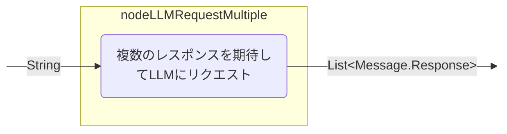
```mermaid
graph LR
    in:::hidden
    out:::hidden
    
    subgraph node ["nodeLLMRequestMultiple"]
        execute(複数のレスポンスを期待してLLMにリクエスト)
    end
    
    in --String--> execute -- "List&lt;Message.Response&gt;" --> out

    classDef hidden display: none;
```

このノードは以下の目的で使用できます：

- 複数のツール呼び出しを必要とする複雑なクエリを処理する。
- 複数のツール呼び出しを生成する。
- 複数の並列アクションを必要とするワークフローを実装する。

例を以下に示します：

<!--- INCLUDE
import ai.koog.agents.core.dsl.builder.forwardTo
import ai.koog.agents.core.dsl.builder.strategy
import ai.koog.agents.core.dsl.extension.nodeLLMRequestMultiple
import ai.koog.agents.core.dsl.extension.nodeDoNothing

val strategy = strategy<String, String>("strategy_name") {
    val getComplexUserQuestion by nodeDoNothing<String>()
-->
<!--- SUFFIX
}
-->
```kotlin
val requestLLMMultipleTools by nodeLLMRequestMultiple()
edge(getComplexUserQuestion forwardTo requestLLMMultipleTools)
```
<!--- KNIT example-nodes-and-component-05.kt -->

### nodeLLMCompressHistory

現在のLLMプロンプト（メッセージ履歴）を要約に圧縮し、メッセージを簡潔なサマリー（TL;DR）に置き換えるノードです。詳細は [APIリファレンス](api:agents-core::ai.koog.agents.core.dsl.extension.nodeLLMCompressHistory) を参照してください。
これは、履歴を圧縮してトークンの使用量を抑えることにより、長い会話を管理するのに役立ちます。

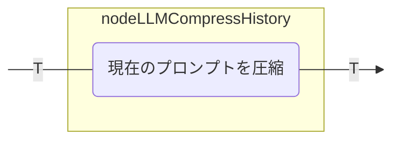
```mermaid
graph LR
    in:::hidden
    out:::hidden
    
    subgraph node ["nodeLLMCompressHistory"]
        execute(現在のプロンプトを圧縮)
    end
    
    in ---|T| execute --T--> out

    classDef hidden display: none;
```

履歴の圧縮についての詳細は、[履歴の圧縮](history-compression.md) を参照してください。

このノードは以下の目的で使用できます：

- 長い会話を管理し、トークンの使用量を削減する。
- 会話履歴を要約してコンテキストを維持する。
- 長期間実行されるエージェントにおいてメモリ管理を実装する。

例を以下に示します：

<!--- INCLUDE
import ai.koog.agents.core.dsl.builder.forwardTo
import ai.koog.agents.core.dsl.builder.strategy
import ai.koog.agents.core.dsl.extension.nodeLLMCompressHistory
import ai.koog.agents.core.dsl.extension.nodeDoNothing
import ai.koog.agents.core.dsl.extension.HistoryCompressionStrategy

val strategy = strategy<String, String>("strategy_name") {
    val generateHugeHistory by nodeDoNothing<String>()
-->
<!--- SUFFIX
}
-->
```kotlin
val compressHistory by nodeLLMCompressHistory<String>(
    "compressHistory",
    strategy = HistoryCompressionStrategy.FromLastNMessages(10),
    preserveMemory = true
)
edge(generateHugeHistory forwardTo compressHistory)
```
<!--- KNIT example-nodes-and-component-06.kt -->

## ツールノード

### nodeExecuteTool

単一のツール呼び出しを実行し、その結果を返すノードです。このノードは、LLMによって行われたツール呼び出しを処理するために使用されます。詳細は [APIリファレンス](api:agents-core::ai.koog.agents.core.dsl.extension.nodeExecuteTool) を参照してください。

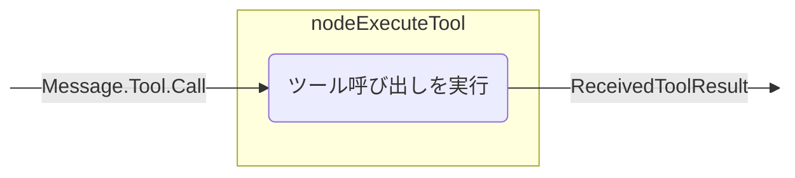
```mermaid
graph LR
    in:::hidden
    out:::hidden
    
    subgraph node ["nodeExecuteTool"]
        execute(ツール呼び出しを実行)
    end
    
    in --Message.Tool.Call--> execute --ReceivedToolResult--> out

    classDef hidden display: none;
```

このノードは以下の目的で使用できます：

- LLMから要求されたツールを実行する。
- LLMの決定に応じた特定のアクションを処理する。
- エージェントのワークフローに外部機能を統合する。

例を以下に示します：

<!--- INCLUDE
import ai.koog.agents.core.dsl.builder.forwardTo
import ai.koog.agents.core.dsl.builder.strategy
import ai.koog.agents.core.dsl.extension.nodeExecuteTool
import ai.koog.agents.core.dsl.extension.nodeLLMRequest
import ai.koog.agents.core.dsl.extension.onToolCall

val strategy = strategy<String, String>("strategy_name") {
-->
<!--- SUFFIX
}
-->
```kotlin
val requestLLM by nodeLLMRequest()
val executeTool by nodeExecuteTool()
edge(requestLLM forwardTo executeTool onToolCall { true })
```
<!--- KNIT example-nodes-and-component-07.kt -->

### nodeLLMSendToolResult

ツールの結果をプロンプトに追加し、LLMレスポンスを要求するノードです。詳細は [APIリファレンス](api:agents-core::ai.koog.agents.core.dsl.extension.nodeLLMSendToolResult) を参照してください。

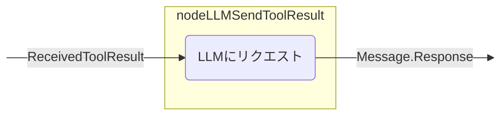
```mermaid
graph LR
    in:::hidden
    out:::hidden
    
    subgraph node ["nodeLLMSendToolResult"]
        execute(LLMにリクエスト)
    end
    
    in --ReceivedToolResult--> execute --Message.Response--> out

    classDef hidden display: none;
```

このノードは以下の目的で使用できます：

- ツール実行の結果を処理する。
- ツールの出力に基づいてレスポンスを生成する。
- ツール実行後に会話を継続する。

例を以下に示します：

<!--- INCLUDE
import ai.koog.agents.core.dsl.builder.forwardTo
import ai.koog.agents.core.dsl.builder.strategy
import ai.koog.agents.core.dsl.extension.nodeExecuteTool
import ai.koog.agents.core.dsl.extension.nodeLLMSendToolResult

val strategy = strategy<String, String>("strategy_name") {
-->
<!--- SUFFIX
}
-->
```kotlin
val executeTool by nodeExecuteTool()
val sendToolResultToLLM by nodeLLMSendToolResult()
edge(executeTool forwardTo sendToolResultToLLM)
```
<!--- KNIT example-nodes-and-component-08.kt -->

### nodeExecuteMultipleTools

複数のツール呼び出しを実行するノードです。これらの呼び出しは、オプションで並列実行できます。詳細は [APIリファレンス](api:agents-core::ai.koog.agents.core.dsl.extension.nodeExecuteMultipleTools) を参照してください。

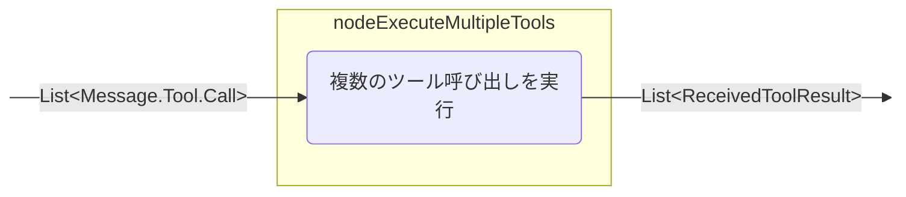
```mermaid
graph LR
    in:::hidden
    out:::hidden
    
    subgraph node ["nodeExecuteMultipleTools"]
        execute(複数のツール呼び出しを実行)
    end
    
    in -- "List&lt;Message.Tool.Call&gt;" --> execute -- "List&lt;ReceivedToolResult&gt;" --> out

    classDef hidden display: none;
```

このノードは以下の目的で使用できます：

- 複数のツールを並列に実行する。
- 複数のツール実行を必要とする複雑なワークフローを処理する。
- ツール呼び出しをバッチ処理してパフォーマンスを最適化する。

例を以下に示します：

<!--- INCLUDE
import ai.koog.agents.core.dsl.builder.forwardTo
import ai.koog.agents.core.dsl.builder.strategy
import ai.koog.agents.core.dsl.extension.nodeLLMRequestMultiple
import ai.koog.agents.core.dsl.extension.nodeExecuteMultipleTools
import ai.koog.agents.core.dsl.extension.onMultipleToolCalls

val strategy = strategy<String, String>("strategy_name") {
-->
<!--- SUFFIX
}
-->
```kotlin
val requestLLMMultipleTools by nodeLLMRequestMultiple()
val executeMultipleTools by nodeExecuteMultipleTools()
edge(requestLLMMultipleTools forwardTo executeMultipleTools onMultipleToolCalls { true })
```
<!--- KNIT example-nodes-and-component-09.kt -->

### nodeLLMSendMultipleToolResults

複数のツールの結果をプロンプトに追加し、複数のLLMレスポンスを取得するノードです。詳細は [APIリファレンス](api:agents-core::ai.koog.agents.core.dsl.extension.nodeLLMSendMultipleToolResults) を参照してください。

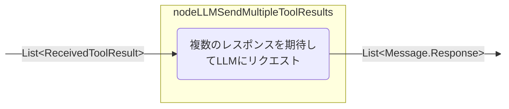
```mermaid
graph LR
    in:::hidden
    out:::hidden
    
    subgraph node ["nodeLLMSendMultipleToolResults"]
        execute(複数のレスポンスを期待してLLMにリクエスト)
    end
    
    in -- "List&lt;ReceivedToolResult&gt;" --> execute -- "List&lt;Message.Response&gt;" --> out

    classDef hidden display: none;
```

このノードは以下の目的で使用できます：

- 複数のツール実行の結果を処理する。
- 複数のツール呼び出しを生成する。
- 複数の並列アクションを伴う複雑なワークフローを実装する。

例を以下に示します：

<!--- INCLUDE
import ai.koog.agents.core.dsl.builder.forwardTo
import ai.koog.agents.core.dsl.builder.strategy
import ai.koog.agents.core.dsl.extension.nodeLLMSendMultipleToolResults
import ai.koog.agents.core.dsl.extension.nodeExecuteMultipleTools

val strategy = strategy<String, String>("strategy_name") {
-->
<!--- SUFFIX
}
-->
```kotlin
val executeMultipleTools by nodeExecuteMultipleTools()
val sendMultipleToolResultsToLLM by nodeLLMSendMultipleToolResults()
edge(executeMultipleTools forwardTo sendMultipleToolResultsToLLM)
```
<!--- KNIT example-nodes-and-component-10.kt -->

## ノード出力の変換

フレームワークは、出力に変換を適用する「変換済みノード」を作成できる `transform` 拡張関数を提供しています。これは、元のノードの機能を維持したまま、ノードの出力を別の型や形式に変換する必要がある場合に便利です。

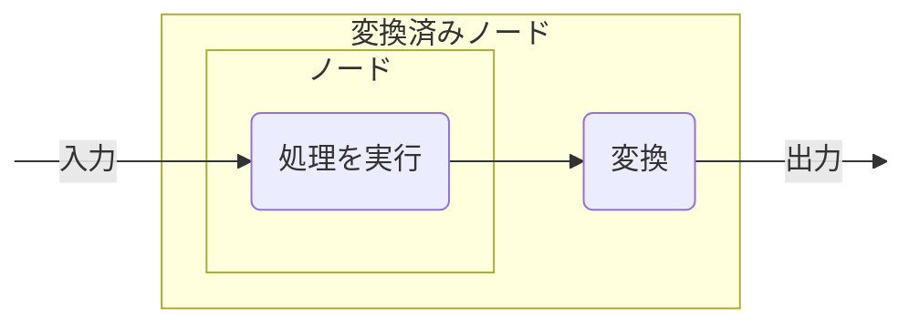
```mermaid
graph LR
    in:::hidden
    out:::hidden
    
    subgraph nodeWithTransform [変換済みノード]
        subgraph node ["ノード"]
            execute(処理を実行)
        end
        transform(変換)
    end
    
    in --入力--> execute --> transform --出力--> out

    classDef hidden display: none;
```

### transform

[`transform()`](api:agents-core::ai.koog.agents.core.dsl.builder.AIAgentNodeDelegate.transform) 関数は、元のノードをラップし、その出力に変換関数を適用する新しい `AIAgentNodeDelegate` を作成します。

<!--- INCLUDE
/**
-->
<!--- SUFFIX
**/
-->
```kotlin
inline fun <reified T> AIAgentNodeDelegate<Input, Output>.transform(
    noinline transformation: suspend (Output) -> T
): AIAgentNodeDelegate<Input, T>
```
<!--- KNIT example-nodes-and-component-11.kt -->

#### カスタムノードの変換

カスタムノードの出力を別のデータ型に変換します。

<!--- INCLUDE
import ai.koog.agents.core.dsl.builder.forwardTo
import ai.koog.agents.core.dsl.builder.strategy
import ai.koog.agents.core.dsl.extension.nodeDoNothing

val strategy = strategy<String, Int>("strategy_name") {
-->
<!--- SUFFIX
}
-->
```kotlin
val textNode by nodeDoNothing<String>("textNode").transform<Int> { text ->
    text.split(" ").filter { it.isNotBlank() }.size
}

edge(nodeStart forwardTo textNode)
edge(textNode forwardTo nodeFinish)
```
<!--- KNIT example-nodes-and-component-12.kt -->

#### 組み込みノードの変換

`nodeLLMRequest` のような組み込みノードの出力を変換します。

<!--- INCLUDE
import ai.koog.agents.core.dsl.builder.forwardTo
import ai.koog.agents.core.dsl.builder.strategy
import ai.koog.agents.core.dsl.extension.nodeLLMRequest

val strategy = strategy<String, Int>("strategy_name") {
-->
<!--- SUFFIX
}
-->
```kotlin
val lengthNode by nodeLLMRequest("llmRequest").transform<Int> { assistantMessage ->
    assistantMessage.content.length
}

edge(nodeStart forwardTo lengthNode)
edge(lengthNode forwardTo nodeFinish)
```
<!--- KNIT example-nodes-and-component-13.kt -->

## 構成済みサブグラフ

フレームワークは、一般的に使用されるパターンやワークフローをカプセル化した構成済みサブグラフを提供しています。これらのサブグラフは、ベースとなるノードとエッジの作成を自動的に処理することで、複雑なエージェント戦略の開発を簡素化します。

構成済みサブグラフを使用することで、さまざまな一般的なパイプラインを実装できます。以下に例を示します：

1. データを準備する。
2. タスクを実行する。
3. タスク結果を検証する。結果が不正確な場合は、調整を行うためのフィードバックメッセージを添えてステップ2に戻る。

### subgraphWithTask

提供されたツールを使用して特定のタスクを実行し、構造化された結果を返すサブグラフです。マルチレスポンスLLMインタラクション（アシスタントがツール呼び出しを挟んで複数のレスポンスを生成する場合がある）をサポートし、ツール呼び出しの実行方法を制御できます。詳細は [APIリファレンス](api:agents-ext::ai.koog.agents.ext.agent.subgraphWithTask) を参照してください。

このサブグラフは以下の目的で使用できます：

- より大きなワークフロー内で特定のタスクを処理する特別なコンポーネントを作成する。
- 明確な入出力インターフェースを持つ複雑なロジックをカプセル化する。
- タスク固有のツール、モデル、プロンプトを構成する。
- 自動圧縮機能を使用して会話履歴を管理する。
- 構造化されたエージェントワークフローやタスク実行パイプラインを開発する。
- LLMタスク実行から構造化された結果（複数のアシスタントレスポンスやツール呼び出しを含むフローを含む）を生成する。

APIでは、オプションのパラメータを使用して実行を微調整できます：

- runMode: タスク中のツール呼び出しの実行方法を制御します（デフォルトはシーケンシャル）。基盤となるモデル/エグゼキューターがサポートしている場合、異なるツール実行戦略を切り替えるために使用します。
- assistantResponseRepeatMax: タスクを完了できないと判断するまでに許可されるアシスタントレスポンスの回数を制限します（指定されない場合は、安全な内部制限がデフォルトで適用されます）。

サブグラフにタスクをテキストとして提供し、必要に応じてLLMを構成し、必要なツールを提供すれば、サブグラフがタスクを処理して解決します。例を以下に示します：

<!--- INCLUDE
import ai.koog.agents.core.dsl.builder.strategy
import ai.koog.agents.ext.tool.SayToUser
import ai.koog.prompt.executor.clients.openai.OpenAIModels
import ai.koog.agents.ext.agent.subgraphWithTask
import ai.koog.agents.core.agent.ToolCalls

val searchTool = SayToUser
val calculatorTool = SayToUser
val weatherTool = SayToUser

val strategy = strategy<String, String>("strategy_name") {
-->
<!--- SUFFIX
}
-->
```kotlin
val processQuery by subgraphWithTask<String, String>(
    tools = listOf(searchTool, calculatorTool, weatherTool),
    llmModel = OpenAIModels.Chat.GPT4o,
    runMode = ToolCalls.SEQUENTIAL,
    assistantResponseRepeatMax = 3,
) { userQuery ->
    """
    You are a helpful assistant that can answer questions about various topics.
    Please help with the following query:
    $userQuery
    """
}
```
<!--- KNIT example-nodes-and-component-14.kt -->

### subgraphWithVerification

`subgraphWithTask` の特別バージョンで、タスクが正しく実行されたかどうかを検証し、発生した問題の詳細を提供します。このサブグラフは、バリデーションや品質チェックが必要なワークフローに役立ちます。詳細は [APIリファレンス](api:agents-ext::ai.koog.agents.ext.agent.subgraphWithVerification) を参照してください。

このサブグラフは以下の目的で使用できます：

- タスク実行の正確性を検証する。
- ワークフローに品質管理プロセスを実装する。
- 自己検証コンポーネントを作成する。
- 成功/失敗のステータスと詳細なフィードバックを含む、構造化された検証結果を生成する。

このサブグラフは、ワークフローの最後にLLMが検証ツールを呼び出して、タスクが正常に完了したかどうかを確認するようにします。この検証が最終ステップとして実行されることを保証し、タスクが正常に完了したかどうかを示す `CriticResult` と詳細なフィードバックを返します。
例を以下に示します：

<!--- INCLUDE
import ai.koog.agents.core.dsl.builder.strategy
import ai.koog.agents.ext.tool.SayToUser
import ai.koog.prompt.executor.clients.anthropic.AnthropicModels
import ai.koog.agents.ext.agent.subgraphWithVerification
import ai.koog.agents.core.agent.ToolCalls

val runTestsTool = SayToUser
val analyzeTool = SayToUser
val readFileTool = SayToUser

val strategy = strategy<String, String>("strategy_name") {
-->
<!--- SUFFIX
}
-->
```kotlin
val verifyCode by subgraphWithVerification<String>(
    tools = listOf(runTestsTool, analyzeTool, readFileTool),
    llmModel = AnthropicModels.Opus_4_6,
    runMode = ToolCalls.SEQUENTIAL,
    assistantResponseRepeatMax = 3,
) { codeToVerify ->
    """
    You are a code reviewer. Please verify that the following code meets all requirements:
    1. It compiles without errors
    2. All tests pass
    3. It follows the project's coding standards

    Code to verify:
    $codeToVerify
    """
}
```
<!--- KNIT example-nodes-and-component-15.kt -->

## 構成済みの戦略（Strategy）と一般的な戦略パターン

フレームワークは、さまざまなノードを組み合わせた構成済みの戦略（Strategy）を提供しています。
ノードは、各エッジをいつたどるかを指定する条件とともに、エッジを使用して接続され、操作のフローを定義します。

必要に応じて、これらの戦略をエージェントワークフローに統合できます。

### 単発実行戦略（Single run strategy）

単発実行戦略は、エージェントが一度だけ入力を処理して結果を返す、非対話型のユースケース向けに設計されています。

複雑なロジックを必要としない、単純なプロセスを実行する場合にこの戦略を使用できます。

<!--- INCLUDE
import ai.koog.agents.core.agent.entity.AIAgentGraphStrategy
import ai.koog.agents.core.dsl.builder.forwardTo
import ai.koog.agents.core.dsl.builder.strategy
import ai.koog.agents.core.dsl.extension.*

-->
```kotlin

public fun singleRunStrategy(): AIAgentGraphStrategy<String, String> = strategy("single_run") {
    val nodeCallLLM by nodeLLMRequest("sendInput")
    val nodeExecuteTool by nodeExecuteTool("nodeExecuteTool")
    val nodeSendToolResult by nodeLLMSendToolResult("nodeSendToolResult")

    edge(nodeStart forwardTo nodeCallLLM)
    edge(nodeCallLLM forwardTo nodeExecuteTool onToolCall { true })
    edge(nodeCallLLM forwardTo nodeFinish onAssistantMessage { true })
    edge(nodeExecuteTool forwardTo nodeSendToolResult)
    edge(nodeSendToolResult forwardTo nodeFinish onAssistantMessage { true })
    edge(nodeSendToolResult forwardTo nodeExecuteTool onToolCall { true })
}
```
<!--- KNIT example-nodes-and-component-16.kt -->

### ツールベースの戦略（Tool-based strategy）

ツールベースの戦略は、特定の操作を実行するためにツールに大きく依存するワークフロー向けに設計されています。
通常、LLMの決定に基づいてツールを実行し、その結果を処理します。

<!--- INCLUDE
import ai.koog.agents.core.agent.entity.AIAgentGraphStrategy
import ai.koog.agents.core.dsl.builder.forwardTo
import ai.koog.agents.core.dsl.builder.strategy
import ai.koog.agents.core.dsl.extension.*
import ai.koog.agents.core.tools.ToolRegistry

-->
```kotlin
fun toolBasedStrategy(name: String, toolRegistry: ToolRegistry): AIAgentGraphStrategy<String, String> {
    return strategy(name) {
        val nodeSendInput by nodeLLMRequest()
        val nodeExecuteTool by nodeExecuteTool()
        val nodeSendToolResult by nodeLLMSendToolResult()

        // エージェントのフローを定義
        edge(nodeStart forwardTo nodeSendInput)

        // LLMがメッセージで応答した場合は終了
        edge(
            (nodeSendInput forwardTo nodeFinish)
                    onAssistantMessage { true }
        )

        // LLMがツールを呼び出した場合はそれを実行
        edge(
            (nodeSendInput forwardTo nodeExecuteTool)
                    onToolCall { true }
        )

        // ツールの結果をLLMに送り返す
        edge(nodeExecuteTool forwardTo nodeSendToolResult)

        // LLMが別のツールを呼び出した場合はそれを実行
        edge(
            (nodeSendToolResult forwardTo nodeExecuteTool)
                    onToolCall { true }
        )

        // LLMがメッセージで応答した場合は終了
        edge(
            (nodeSendToolResult forwardTo nodeFinish)
                    onAssistantMessage { true }
        )
    }
}
```
<!--- KNIT example-nodes-and-component-17.kt -->

### ストリーミングデータ戦略（Streaming data strategy）

ストリーミングデータ戦略は、LLMからのストリーミングデータを処理するために設計されています。通常、ストリーミングデータを要求し、それを処理し、処理されたデータを使用してツールを呼び出す可能性があります。

<!--- INCLUDE
import ai.koog.agents.core.dsl.builder.forwardTo
import ai.koog.agents.core.dsl.builder.strategy
import ai.koog.agents.example.exampleStreamingApi03.Book
import ai.koog.agents.example.exampleStreamingApi04.markdownBookDefinition
import ai.koog.agents.example.exampleStreamingApi06.parseMarkdownStreamToBooks
-->
```kotlin
val agentStrategy = strategy<String, List<Book>>("library-assistant") {
    // 出力ストリームのパースを含むノードを記述
    val getMdOutput by node<String, List<Book>> { booksDescription ->
        val books = mutableListOf<Book>()
        val mdDefinition = markdownBookDefinition()

        llm.writeSession { 
            appendPrompt { user(booksDescription) }
            // mdDefinition の形式でレスポンスストリームを開始
            val markdownStream = requestLLMStreaming(mdDefinition)
            // レスポンスストリームの結果を使用してパーサーを呼び出し、その結果に対してアクションを実行
            parseMarkdownStreamToBooks(markdownStream).collect { book ->
                books.add(book)
                println("Parsed Book: ${book.title} by ${book.author}")
            }
        }

        books
    }
    // ノードにアクセスできるようにエージェントのグラフを記述
    edge(nodeStart forwardTo getMdOutput)
    edge(getMdOutput forwardTo nodeFinish)
}
```
<!--- KNIT example-nodes-and-component-18.kt -->