# 構成済みのノードとコンポーネント

ノードは、Koogフレームワークにおけるエージェントワークフローの基本的な構成要素です。
各ノードはワークフロー内の特定の操作や変換を表し、これらをエッジで接続することで実行フローを定義できます。

一般に、ノードを使用すると、複雑なロジックを再利用可能なコンポーネントとしてカプセル化でき、さまざまなエージェントワークフローに簡単に統合できるようになります。このガイドでは、エージェント戦略（strategy）で使用できる既存のノードについて説明します。

各ノードは本質的に、特定の型の入力を受け取り、特定の型の出力を返す関数（Kotlin）またはアクション（Java）です。

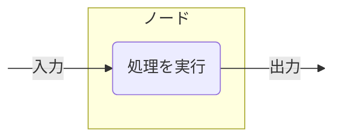
```mermaid
graph LR
    in:::hidden
    out:::hidden
    
    subgraph node ["ノード"]
        execute(処理を実行)
    end
    
    in --入力--> execute --出力--> out

    classDef hidden display: none;
```
<!--- KNIT example-nodes-and-component-01.txt -->

以下は、入力として文字列を受け取り、出力としてその文字列の長さ（整数）を返すノードを定義する方法です。

=== "Kotlin"
    <!--- INCLUDE
    import ai.koog.agents.core.dsl.builder.strategy
    import ai.koog.agents.core.dsl.builder.node
    val strategy = strategy<String, String>("strategy_name") {
    -->
    <!--- SUFFIX
    }
    -->
    ```kotlin
    val nodeLength by node<String, Int> { input ->
        input.length
    }
    ```
    <!--- KNIT example-nodes-and-component-01.kt -->

=== "Java"

    <!--- INCLUDE
    import ai.koog.agents.core.agent.entity.AIAgentGraphStrategy;
    import ai.koog.agents.core.agent.entity.AIAgentNode;
    class exampleNodesAndComponentsJava01 {
        public static void main(String[] args) {
    -->
    <!--- SUFFIX
        }
    }
    -->
    ```java
    var nodeLength = AIAgentNode.builder("nodeLength")
        .withInput(String.class)
        .withOutput(Integer.class)
        .withAction((input, ctx) -> input.length())
        .build();
    ```
    <!--- KNIT exampleNodesAndComponentsJava01.java -->

詳細については、[node()](api:agents-core::ai.koog.agents.core.dsl.builder.node) (Kotlin) または Java 用の [AIAgentNode.builder()](api:agents-core::ai.koog.agents.core.agent.entity.AIAgentNode.Companion.builder) を参照してください。

## ユーティリティノード

### パススルーノード

何も行わず、入力をそのまま出力として返すシンプルなパススルーノードです。詳細は [nodeDoNothing](api:agents-core::ai.koog.agents.core.dsl.extension.nodeDoNothing) (Kotlin) または [AIAgentNode.doNothing()](api:agents-core::ai.koog.agents.core.agent.entity.AIAgentNode.Companion.doNothing) (Java) を参照してください。

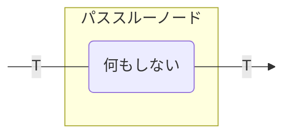
```mermaid
graph LR
    in:::hidden
    out:::hidden
    
    subgraph node ["パススルーノード"]
        execute(何もしない)
    end
    
    in ---|T| execute --T--> out

    classDef hidden display: none;
```
<!--- KNIT example-nodes-and-component-02.txt -->

このノードは以下の目的で使用できます：

- グラフ内にプレースホルダーノードを作成する。
- データを変更せずに接続点を作成する。

例を以下に示します：

=== "Kotlin"

    <!--- INCLUDE
    import ai.koog.agents.core.dsl.builder.strategy
    import ai.koog.agents.core.dsl.builder.node
    import ai.koog.agents.core.dsl.extension.nodeDoNothing
    val strategy = strategy<String, String>("strategy_name") {
    -->
    <!--- SUFFIX
    }
    -->
    ```kotlin
    val passthrough by nodeDoNothing<String>("passthrough")

    edge(nodeStart forwardTo passthrough)
    edge(passthrough forwardTo nodeFinish)
    ```
    <!--- KNIT example-nodes-and-component-02.kt -->

=== "Java"
    
    <!--- INCLUDE
    import ai.koog.agents.core.agent.entity.AIAgentGraphStrategy;
    import ai.koog.agents.core.agent.entity.AIAgentNode;
    class exampleNodesAndComponentsJava02 {
        public static void main(String[] args) {
            var strategy = AIAgentGraphStrategy.builder("strategy_name")
                .withInput(String.class)
                .withOutput(String.class);
    -->
    <!--- SUFFIX
        }
    }
    -->
    ```java
    var passthrough = AIAgentNode.builder("passthrough")
        .withInput(String.class)
        .withOutput(String.class)
        .withAction((input, ctx) -> input)
        .build();

    strategy.edge(strategy.nodeStart, passthrough);
    strategy.edge(passthrough, strategy.nodeFinish);
    ```
    <!--- KNIT exampleNodesAndComponentsJava02.java -->

## LLMノード

### プロンプト準備ノード

**提供されたプロンプトビルダーを使用して、LLMプロンプトにメッセージを追加するノードです。これは、実際のLLMリクエストを行う前に、会話のコンテキストを修正するのに役立ちます。** 詳細は [nodeAppendPrompt](api:agents-core::ai.koog.agents.core.dsl.extension.nodeAppendPrompt) (Kotlin) または [AIAgentNode.appendPrompt()](api:agents-core::ai.koog.agents.core.agent.entity.AIAgentNodeBuilderWithInput.appendPrompt) (Java) を参照してください。

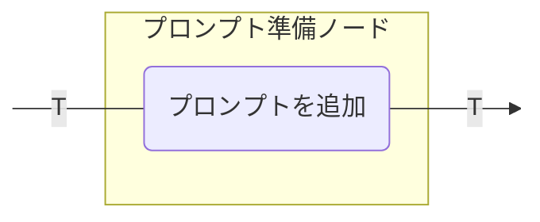
```mermaid
graph LR
    in:::hidden
    out:::hidden
    
    subgraph node ["プロンプト準備ノード"]
        execute(プロンプトを追加)
    end
    
    in ---|T| execute --T--> out

    classDef hidden display: none;
```
<!--- KNIT example-nodes-and-component-03.txt -->

このノードは以下の目的で使用できます：

- プロンプトにシステム指示を追加する。
- 会話にユーザーメッセージを挿入する。
- 後続のLLMリクエストのためのコンテキストを準備する。

例を以下に示します：

=== "Kotlin"

    <!--- INCLUDE
    import ai.koog.agents.core.dsl.builder.strategy
    import ai.koog.agents.core.dsl.builder.node
    import ai.koog.agents.core.dsl.extension.nodeAppendPrompt
    typealias Input = Unit
    typealias Output = Unit
    val strategy = strategy<String, String>("strategy_name") {
    -->
    <!--- SUFFIX
    }
    -->
    ```kotlin
    val firstNode by node<Input, Output> {
        // 入力を出力に変換
    }

    val secondNode by node<Output, Output> {
        // 出力を出力に変換
    }

    // ノードは前のノードから Output 型の値を入力として受け取り、それをそのまま次のノードに渡します。
    val setupContext by nodeAppendPrompt<Output>("setupContext") {
        system("You are a helpful assistant specialized in Kotlin programming.")
        user("I need help with Kotlin coroutines.")
    }

    edge(firstNode forwardTo setupContext)
    edge(setupContext forwardTo secondNode)
    ```
    <!--- KNIT example-nodes-and-component-03.kt -->

=== "Java"

    <!--- INCLUDE
    import ai.koog.agents.core.agent.entity.AIAgentGraphStrategy;
    import ai.koog.agents.core.agent.entity.AIAgentNode;
    class exampleNodesAndComponentsJava03 {
        class Output {}
        class Input extends Output { }
        public static void main(String[] args) {
            var strategy = AIAgentGraphStrategy.builder("strategy_name")
                .withInput(String.class)
                .withOutput(String.class);
    -->
    <!--- SUFFIX
        }
    }
    -->
    ```java
    var firstNode = AIAgentNode.builder()
        .withInput(Input.class)
        .withOutput(Output.class)
        .withAction((input, ctx) -> {
            // 入力を出力に変換
            return input;
        })
        .build();

    var secondNode = AIAgentNode.builder()
        .withInput(Output.class)
        .withOutput(Output.class)
        .withAction((output, ctx) -> {
            // 出力を出力に変換
            return output;
        })
        .build();

    var setupContext = AIAgentNode.builder()
        .withInput(Output.class)
        .appendPrompt(prompt -> {
            prompt.system("You are a helpful assistant specialized in Kotlin programming.");
            prompt.user("I need help with Kotlin coroutines.");
        });

    strategy.edge(firstNode, setupContext);
    strategy.edge(setupContext, secondNode);
    ```
    <!--- KNIT exampleNodesAndComponentsJava03.java -->

### ツール呼び出し専用ノード

LLMプロンプトにユーザーメッセージを追加し、LLMがツール呼び出しのみを行えるレスポンスを取得するノードです。詳細は [nodeLLMSendMessageOnlyCallingTools](api:agents-core::ai.koog.agents.core.dsl.extension.nodeLLMSendMessageOnlyCallingTools) (Kotlin) または [AIAgentNode.llmSendMessageOnlyCallingTools()](api:agents-core::ai.koog.agents.core.agent.entity.AIAgentNode.Companion.llmSendMessageOnlyCallingTools) (Java) を参照してください。

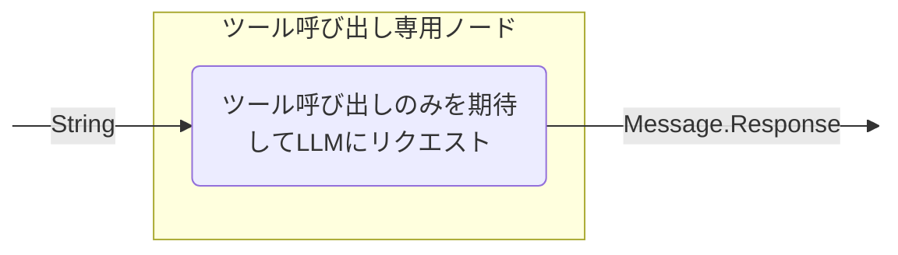
```mermaid
graph LR
    in:::hidden
    out:::hidden
    
    subgraph node ["ツール呼び出し専用ノード"]
        execute(ツール呼び出しのみを期待してLLMにリクエスト)
    end
    
    in --String--> execute --Message.Response--> out

    classDef hidden display: none;
```
<!--- KNIT example-nodes-and-component-04.txt -->

### 特定ツールの使用強制ノード

LLMプロンプトにユーザーメッセージを追加し、LLMに特定のツールの使用を強制するノードです。詳細は [nodeLLMSendMessageForceOneTool](api:agents-core::ai.koog.agents.core.dsl.extension.nodeLLMSendMessageForceOneTool) (Kotlin) または [AIAgentNode.llmSendMessageForceOneTool()](api:agents-core::ai.koog.agents.core.agent.entity.AIAgentNode.Companion.llmSendMessageForceOneTool) (Java) を参照してください。

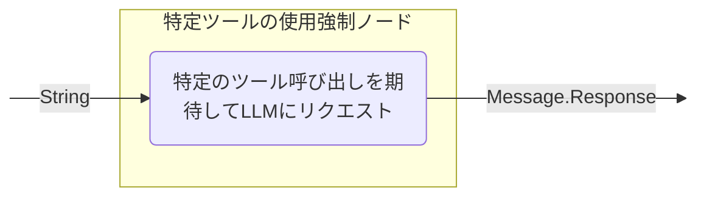
```mermaid
graph LR
    in:::hidden
    out:::hidden
    
    subgraph node ["特定ツールの使用強制ノード"]
        execute(特定のツール呼び出しを期待してLLMにリクエスト)
    end
    
    in --String--> execute --Message.Response--> out

    classDef hidden display: none;
```
<!--- KNIT example-nodes-and-component-05.txt -->

### LLMリクエストノード

LLMプロンプトにユーザーメッセージを追加し、オプションでツールを使用できるレスポンスを取得するノードです。ノードの設定により、メッセージの処理中にツール呼び出しを許可するかどうかが決まります。詳細は [nodeLLMRequest](api:agents-core::ai.koog.agents.core.dsl.extension.nodeLLMRequest) (Kotlin) または [AIAgentNode.llmRequest()](api:agents-core::ai.koog.agents.core.agent.entity.AIAgentNode.Companion.llmRequest) (Java) を参照してください。

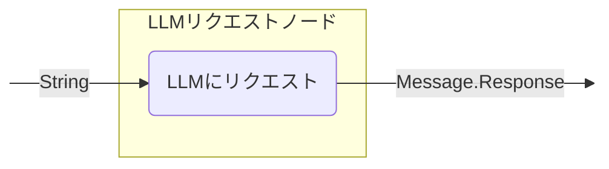
```mermaid
graph LR
    in:::hidden
    out:::hidden
    
    subgraph node ["LLMリクエストノード"]
        execute(LLMにリクエスト)
    end
    
    in --String--> execute --Message.Response--> out

    classDef hidden display: none;
```
<!--- KNIT example-nodes-and-component-06.txt -->

このノードは以下の目的で使用できます：

- 現在のプロンプトに対してLLMレスポンスを生成し、LLMによるツール呼び出し生成を許可するかどうかを制御する。

例を以下に示します：

=== "Kotlin"

    <!--- INCLUDE
    import ai.koog.agents.core.dsl.builder.strategy
    import ai.koog.agents.core.dsl.builder.node
    import ai.koog.agents.core.dsl.extension.nodeLLMRequest
    import ai.koog.agents.core.dsl.extension.nodeDoNothing
    val strategy = strategy<String, String>("strategy_name") {
        val getUserQuestion by nodeDoNothing<String>()
    -->
    <!--- SUFFIX
    }
    -->
    ```kotlin
    val requestLLM by nodeLLMRequest("requestLLM")
    edge(getUserQuestion forwardTo requestLLM)
    ```
    <!--- KNIT example-nodes-and-component-04.kt -->

=== "Java"

    <!--- INCLUDE
    import ai.koog.agents.core.agent.entity.AIAgentEdge;
    import ai.koog.agents.core.agent.entity.AIAgentGraphStrategy;
    import ai.koog.agents.core.agent.entity.AIAgentNode;
    class exampleNodesAndComponentsJava04 {
        public static void main(String[] args) {
            var strategy = AIAgentGraphStrategy.builder("strategy_name")
                .withInput(String.class)
                .withOutput(String.class);
            var getUserQuestion = AIAgentNode.builder("getUserQuestion")
                .withInput(String.class)
                .withOutput(String.class)
                .withAction((input, ctx) -> input)
                .build();
    -->
    <!--- SUFFIX
        }
    }
    -->
    ```java
    var requestLLM = AIAgentNode.llmRequest("requestLLM");

    strategy.edge(AIAgentEdge.builder()
        .from(getUserQuestion)
        .to(requestLLM)
        .build());
    ```
    <!--- KNIT exampleNodesAndComponentsJava04.java -->

### 構造化レスポンス対応LLMリクエストノード

LLMプロンプトにユーザーメッセージを追加し、エラー訂正機能を備えた構造化データをLLMに要求するノードです。詳細は [nodeLLMRequestStructured](api:agents-core::ai.koog.agents.core.dsl.extension.nodeLLMRequestStructured) (Kotlin) または [AIAgentNode.llmRequestStructured()](api:agents-core::ai.koog.agents.core.agent.entity.AIAgentNode.Companion.llmRequestStructured) (Java) を参照してください。

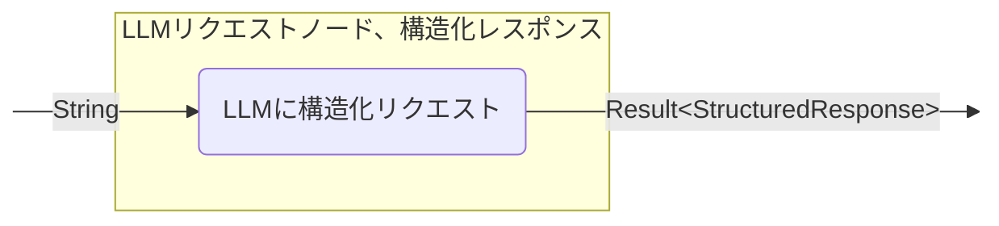
```mermaid
graph LR
    in:::hidden
    out:::hidden
    
    subgraph node ["LLMリクエストノード、構造化レスポンス"]
        execute(LLMに構造化リクエスト)
    end
    
    in --String--> execute -- "Result&lt;StructuredResponse&gt;" --> out

    classDef hidden display: none;
```
<!--- KNIT example-nodes-and-component-07.txt -->

### ストリーミングレスポンス対応LLMリクエストノード

LLMプロンプトにユーザーメッセージを追加し、ストリームデータの変換の有無にかかわらず、LLMレスポンスをストリーミングするノードです。詳細は [nodeLLMRequestStreaming](api:agents-core::ai.koog.agents.core.dsl.extension.nodeLLMRequestStreaming) (Kotlin) または [AIAgentNode.llmRequestStreaming()](api:agents-core::ai.koog.agents.core.agent.entity.AIAgentNode.Companion.llmRequestStreaming) (Java) を参照してください。

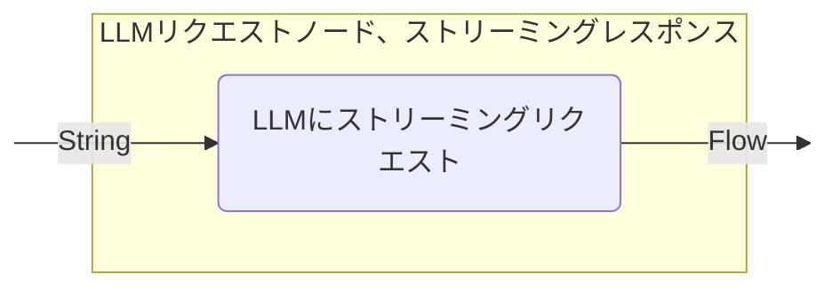
```mermaid
graph LR
    in:::hidden
    out:::hidden
    
    subgraph node ["LLMリクエストノード、ストリーミングレスポンス"]
        execute(LLMにストリーミングリクエスト)
    end
    
    in --String--> execute --Flow--> out

    classDef hidden display: none;
```
<!--- KNIT example-nodes-and-component-08.txt -->

### 複数レスポンス対応LLMリクエストノード

LLMプロンプトにユーザーメッセージを追加し、ツール呼び出しを有効にした状態で複数のLLMレスポンスを取得するノードです。詳細は [nodeLLMRequest](api:agents-core::ai.koog.agents.core.dsl.extension.nodeLLMRequest) (Kotlin) または [AIAgentNode.llmRequest()](api:agents-core::ai.koog.agents.core.agent.entity.AIAgentNode.Companion.llmRequest) (Java) を参照してください。

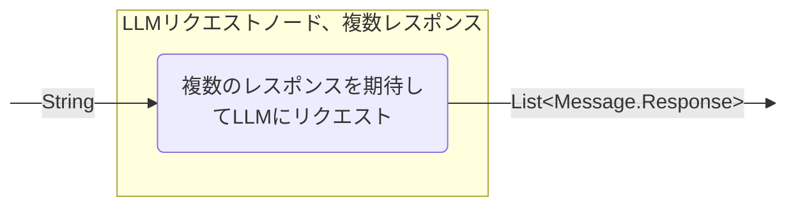
```mermaid
graph LR
    in:::hidden
    out:::hidden
    
    subgraph node ["LLMリクエストノード、複数レスポンス"]
        execute(複数のレスポンスを期待してLLMにリクエスト)
    end
    
    in --String--> execute -- "List&lt;Message.Response&gt;" --> out

    classDef hidden display: none;
```
<!--- KNIT example-nodes-and-component-09.txt -->

このノードは以下の目的で使用できます：

- 複数のツール呼び出しを必要とする複雑なクエリを処理する。
- 複数のツール呼び出しを生成する。
- 複数の並列アクションを必要とするワークフローを実装する。

例を以下に示します：

=== "Kotlin"

    <!--- INCLUDE
    import ai.koog.agents.core.dsl.builder.strategy
    import ai.koog.agents.core.dsl.builder.node
    import ai.koog.agents.core.dsl.extension.nodeLLMRequest
    import ai.koog.agents.core.dsl.extension.nodeDoNothing
    val strategy = strategy<String, String>("strategy_name") {
        val getComplexUserQuestion by nodeDoNothing<String>()
    -->
    <!--- SUFFIX
    }
    -->
    ```kotlin
    val requestLLMMultipleTools by nodeLLMRequest()
    edge(getComplexUserQuestion forwardTo requestLLMMultipleTools)
    ```
    <!--- KNIT example-nodes-and-component-05.kt -->

=== "Java"

    <!--- INCLUDE
    import ai.koog.agents.core.agent.entity.AIAgentEdge;
    import ai.koog.agents.core.agent.entity.AIAgentGraphStrategy;
    import ai.koog.agents.core.agent.entity.AIAgentNode;
    class exampleNodesAndComponentsJava05 {
        public static void main(String[] args) {
            var strategy = AIAgentGraphStrategy.builder("strategy_name")
                .withInput(String.class)
                .withOutput(String.class);
            var getComplexUserQuestion = AIAgentNode.builder("getComplexUserQuestion")
                .withInput(String.class)
                .withOutput(String.class)
                .withAction((input, ctx) -> input)
                .build();
    -->
    <!--- SUFFIX
        }
    }
    -->
    ```java
    var requestLLMMultipleTools = AIAgentNode.llmRequest("requestLLMMultipleTools");

    strategy.edge(AIAgentEdge.builder()
        .from(getComplexUserQuestion)
        .to(requestLLMMultipleTools)
        .build());
    ```
    <!--- KNIT exampleNodesAndComponentsJava05.java -->

### 履歴圧縮ノード

現在のLLMプロンプト（メッセージ履歴）を要約に圧縮し、メッセージを簡潔なサマリー（TL;DR）に置き換えるノードです。これは、履歴を圧縮してトークンの使用量を抑えることにより、長い会話を管理するのに役立ちます。詳細は [nodeLLMCompressHistory](api:agents-core::ai.koog.agents.core.dsl.extension.nodeLLMCompressHistory) (Kotlin) または [AIAgentNode.llmCompressHistory()](api:agents-core::ai.koog.agents.core.agent.entity.AIAgentNode.Companion.llmCompressHistory) (Java) を参照してください。

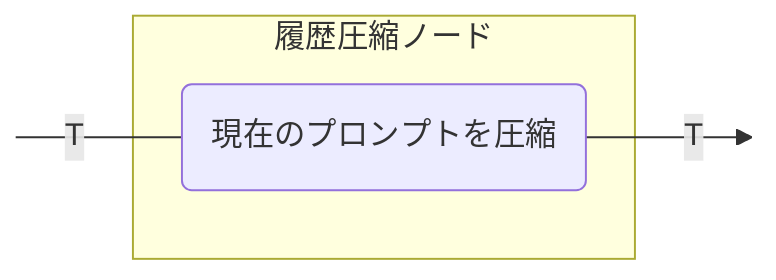
```mermaid
graph LR
    in:::hidden
    out:::hidden
    
    subgraph node ["履歴圧縮ノード"]
        execute(現在のプロンプトを圧縮)
    end
    
    in ---|T| execute --T--> out

    classDef hidden display: none;
```
<!--- KNIT example-nodes-and-component-10.txt -->

履歴の圧縮についての詳細は、[履歴の圧縮](history-compression.md) を参照してください。

このノードは以下の目的で使用できます：

- 長い会話を管理し、トークンの使用量を削減する。
- 会話履歴を要約してコンテキストを維持する。
- 長期間実行されるエージェントにおいてメモリ管理を実装する。

例を以下に示します：

=== "Kotlin"

    <!--- INCLUDE
    import ai.koog.agents.core.dsl.builder.strategy
    import ai.koog.agents.core.dsl.builder.node
    import ai.koog.agents.core.dsl.extension.nodeLLMCompressHistory
    import ai.koog.agents.core.dsl.extension.nodeDoNothing
    import ai.koog.agents.core.dsl.extension.HistoryCompressionStrategy
    val strategy = strategy<String, String>("strategy_name") {
        val generateHugeHistory by nodeDoNothing<String>()
    -->
    <!--- SUFFIX
    }
    -->
    ```kotlin
    val compressHistory by nodeLLMCompressHistory<String>(
        "compressHistory",
        strategy = HistoryCompressionStrategy.FromLastNMessages(10),
        preserveMemory = true
    )
    edge(generateHugeHistory forwardTo compressHistory)
    ```
    <!--- KNIT example-nodes-and-component-06.kt -->

=== "Java"
    
    <!--- INCLUDE
    import ai.koog.agents.core.agent.entity.AIAgentGraphStrategy;
    import ai.koog.agents.core.agent.entity.AIAgentNode;
    class exampleNodesAndComponentsJava06 {
        public static void main(String[] args) {
            var strategy = AIAgentGraphStrategy.builder("strategy_name")
                .withInput(String.class)
                .withOutput(String.class);
            var generateHugeHistory = AIAgentNode.builder("generateHugeHistory")
                .withInput(String.class)
                .withOutput(String.class)
                .withAction((input, ctx) -> input)
                .build();
    -->
    <!--- SUFFIX
        }
    }
    -->
    ```java
    var compressHistory = AIAgentNode.llmCompressHistory("compressHistory")
        .withInput(String.class)
        .build();

    strategy.edge(generateHugeHistory, compressHistory);
    ```
    <!--- KNIT exampleNodesAndComponentsJava06.java -->

## ツールノード

### ツール実行ノード

単一のツール呼び出しを実行し、その結果を返すノードです。このノードは、LLMによって行われたツール呼び出しを処理するために使用されます。詳細は [nodeExecuteTool](api:agents-core::ai.koog.agents.core.dsl.extension.nodeExecuteTool) (Kotlin) または [AIAgentNode.executeTool()](api:agents-core::ai.koog.agents.core.agent.entity.AIAgentNode.Companion.executeTool) (Java) を参照してください。

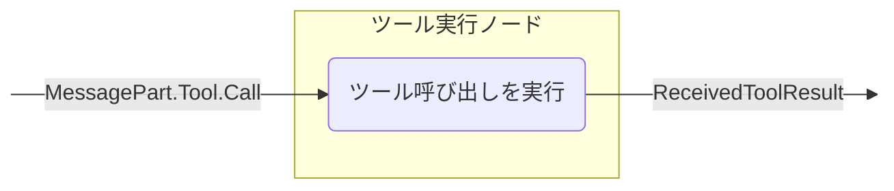
```mermaid
graph LR
    in:::hidden
    out:::hidden
    
    subgraph node ["ツール実行ノード"]
        execute(ツール呼び出しを実行)
    end
    
    in --MessagePart.Tool.Call--> execute --ReceivedToolResult--> out

    classDef hidden display: none;
```
<!--- KNIT example-nodes-and-component-11.txt -->

このノードは以下の目的で使用できます：

- LLMから要求されたツールを実行する。
- LLMの決定に応じた特定のアクションを処理する。
- エージェントのワークフローに外部機能を統合する。

例を以下に示します：

=== "Kotlin"

    <!--- INCLUDE
    import ai.koog.agents.core.dsl.builder.strategy
    import ai.koog.agents.core.dsl.builder.node
    import ai.koog.agents.core.dsl.extension.nodeExecuteTools
    import ai.koog.agents.core.dsl.extension.nodeLLMRequest
    import ai.koog.agents.core.dsl.extension.onToolCalls
    val strategy = strategy<String, String>("strategy_name") {
    -->
    <!--- SUFFIX
    }
    -->
    ```kotlin
    val requestLLM by nodeLLMRequest()
    val executeTool by nodeExecuteTools()
    edge(requestLLM forwardTo executeTool onToolCalls { true })
    ```
    <!--- KNIT example-nodes-and-component-07.kt -->

=== "Java"

    <!--- INCLUDE
    import ai.koog.agents.core.agent.entity.AIAgentGraphStrategy;
    import ai.koog.agents.core.agent.entity.AIAgentNode;
    import ai.koog.agents.core.agent.entity.AIAgentEdge;
    import ai.koog.prompt.message.Message;
    import ai.koog.prompt.message.MessagePart;
    class exampleNodesAndComponentsJava07 {
        public static void main(String[] args) {
            var strategy = AIAgentGraphStrategy.builder("strategy_name")
                .withInput(String.class)
                .withOutput(String.class);
    -->
    <!--- SUFFIX
        }
    }
    -->
    ```java
    var requestLLM = AIAgentNode.llmRequest("requestLLM");
    var executeTool = AIAgentNode.executeTools("executeTool");

    strategy.edge(AIAgentEdge.builder()
        .from(requestLLM)
        .to(executeTool)
        .onToolCalls()
        .build());
    ```
    <!--- KNIT exampleNodesAndComponentsJava07.java -->

### ツール結果フォローアップノード

ツールの結果をプロンプトに追加し、LLMレスポンスを要求するノードです。詳細は [nodeLLMSendToolResult](api:agents-core::ai.koog.agents.core.dsl.extension.nodeLLMSendToolResult) (Kotlin) または [AIAgentNode.llmSendToolResult()](api:agents-core::ai.koog.agents.core.agent.entity.AIAgentNode.Companion.llmSendToolResult) (Java) を参照してください。

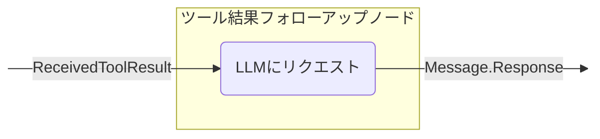
```mermaid
graph LR
    in:::hidden
    out:::hidden
    
    subgraph node ["ツール結果フォローアップノード"]
        execute(LLMにリクエスト)
    end
    
    in --ReceivedToolResult--> execute --Message.Response--> out

    classDef hidden display: none;
```
<!--- KNIT example-nodes-and-component-12.txt -->

このノードは以下の目的で使用できます：

- ツール実行の結果を処理する。
- ツールの出力に基づいてレスポンスを生成する。
- ツール実行後に会話を継続する。

例を以下に示します：

=== "Kotlin"

    <!--- INCLUDE
    import ai.koog.agents.core.dsl.builder.strategy
    import ai.koog.agents.core.dsl.builder.node
    import ai.koog.agents.core.dsl.extension.nodeExecuteTools
    import ai.koog.agents.core.dsl.extension.nodeLLMSendToolResults
    val strategy = strategy<String, String>("strategy_name") {
    -->
    <!--- SUFFIX
    }
    -->
    ```kotlin
    val executeTool by nodeExecuteTools()
    val sendToolResultToLLM by nodeLLMSendToolResults()
    edge(executeTool forwardTo sendToolResultToLLM)
    ```
    <!--- KNIT example-nodes-and-component-08.kt -->

=== "Java"
    
    <!--- INCLUDE
    import ai.koog.agents.core.agent.entity.AIAgentGraphStrategy;
    import ai.koog.agents.core.agent.entity.AIAgentNode;
    class exampleNodesAndComponentsJava08 {
        public static void main(String[] args) {
            var strategy = AIAgentGraphStrategy.builder("strategy_name")
                .withInput(String.class)
                .withOutput(String.class);
    -->
    <!--- SUFFIX
        }
    }
    -->
    ```java
    var executeTool = AIAgentNode.executeTools("executeTool");
    var sendToolResultToLLM = AIAgentNode.llmSendToolResults("sendToolResultToLLM");

    strategy.edge(executeTool, sendToolResultToLLM);
    ```
    <!--- KNIT exampleNodesAndComponentsJava08.java -->

### 複数ツール実行ノード

複数のツール呼び出しを実行するノードです。これらの呼び出しは、オプションで並列実行できます。詳細は [nodeExecuteMultipleTools](api:agents-core::ai.koog.agents.core.dsl.extension.nodeExecuteMultipleTools) (Kotlin) または [AIAgentNode.executeMultipleTools()](api:agents-core::ai.koog.agents.core.agent.entity.AIAgentNode.Companion.executeMultipleTools) (Java) を参照してください。

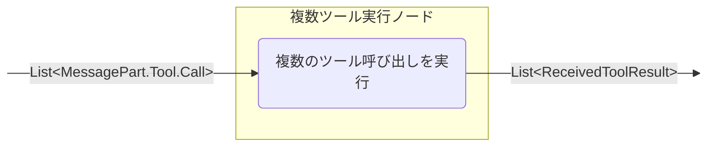
```mermaid
graph LR
    in:::hidden
    out:::hidden
    
    subgraph node ["複数ツール実行ノード"]
        execute(複数のツール呼び出しを実行)
    end
    
    in -- "List&lt;MessagePart.Tool.Call&gt;" --> execute -- "List&lt;ReceivedToolResult&gt;" --> out

    classDef hidden display: none;
```
<!--- KNIT example-nodes-and-component-13.txt -->

このノードは以下の目的で使用できます：

- 複数のツールを並列に実行する。
- 複数のツール実行を必要とする複雑なワークフローを処理する。
- ツール呼び出しをバッチ処理してパフォーマンスを最適化する。

例を以下に示します：

=== "Kotlin"

    <!--- INCLUDE
    import ai.koog.agents.core.dsl.builder.strategy
    import ai.koog.agents.core.dsl.builder.node
    import ai.koog.agents.core.dsl.extension.nodeLLMRequest
    import ai.koog.agents.core.dsl.extension.nodeExecuteTools
    import ai.koog.agents.core.dsl.extension.onToolCalls
    val strategy = strategy<String, String>("strategy_name") {
    -->
    <!--- SUFFIX
    }
    -->
    ```kotlin
    val requestLLMMultipleTools by nodeLLMRequest()
    val executeMultipleTools by nodeExecuteTools(parallel = true)
    edge(requestLLMMultipleTools forwardTo executeMultipleTools onToolCalls { true })
    ```
    <!--- KNIT example-nodes-and-component-09.kt -->

=== "Java"

    <!--- INCLUDE
    import ai.koog.agents.core.agent.entity.AIAgentGraphStrategy;
    import ai.koog.agents.core.agent.entity.AIAgentNode;
    import ai.koog.agents.core.agent.entity.AIAgentEdge;
    import ai.koog.prompt.message.Message;
    import ai.koog.prompt.message.MessagePart;
    class exampleNodesAndComponentsJava09 {
        public static void main(String[] args) {
            var strategy = AIAgentGraphStrategy.builder("strategy_name")
                .withInput(String.class)
                .withOutput(String.class);
    -->
    <!--- SUFFIX
        }
    }
    -->
    ```java
    var requestLLMMultipleTools = AIAgentNode.llmRequest("requestLLMMultipleTools");
    var executeMultipleTools = AIAgentNode.executeTools("executeMultipleTools");

    // アシスタントレスポンスからのツール呼び出しをツール実行ノードにルーティングします
    strategy.edge(AIAgentEdge.builder()
        .from(requestLLMMultipleTools)
        .to(executeMultipleTools)
        .onToolCalls()
        .build());
    ```
    <!--- KNIT exampleNodesAndComponentsJava09.java -->

### 複数ツール結果フォローアップノード

複数のツールの結果をプロンプトに追加し、複数のLLMレスポンスを取得するノードです。詳細は [nodeLLMSendMultipleToolResults](api:agents-core::ai.koog.agents.core.dsl.extension.nodeLLMSendMultipleToolResults) (Kotlin) または [AIAgentNode.llmSendMultipleToolResults()](api:agents-core::ai.koog.agents.core.agent.entity.AIAgentNode.Companion.llmSendMultipleToolResults) (Java) を参照してください。

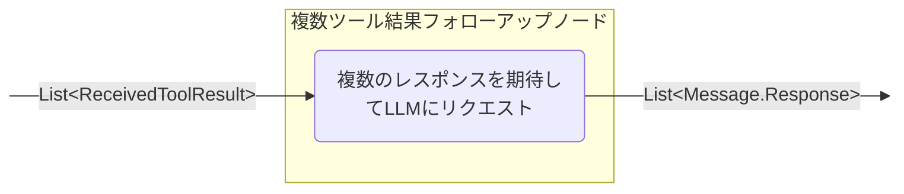
```mermaid
graph LR
    in:::hidden
    out:::hidden
    
    subgraph node ["複数ツール結果フォローアップノード"]
        execute(複数のレスポンスを期待してLLMにリクエスト)
    end
    
    in -- "List&lt;ReceivedToolResult&gt;" --> execute -- "List&lt;Message.Response&gt;" --> out

    classDef hidden display: none;
```
<!--- KNIT example-nodes-and-component-14.txt -->

このノードは以下の目的で使用できます：

- 複数のツール実行の結果を処理する。
- 複数のツール呼び出しを生成する。
- 複数の並列アクションを伴う複雑なワークフローを実装する。

例を以下に示します：

=== "Kotlin"

    <!--- INCLUDE
    import ai.koog.agents.core.dsl.builder.strategy
    import ai.koog.agents.core.dsl.builder.node
    import ai.koog.agents.core.dsl.extension.nodeLLMSendToolResults
    import ai.koog.agents.core.dsl.extension.nodeExecuteTools
    val strategy = strategy<String, String>("strategy_name") {
    -->
    <!--- SUFFIX
    }
    -->
    ```kotlin
    val executeTools by nodeExecuteTools(parallel = true)
    val sendToolResultsToLLM by nodeLLMSendToolResults()
    edge(executeTools forwardTo sendToolResultsToLLM)
    ```
    <!--- KNIT example-nodes-and-component-10.kt -->

=== "Java"
    
    <!--- INCLUDE
    import ai.koog.agents.core.agent.entity.AIAgentGraphStrategy;
    import ai.koog.agents.core.agent.entity.AIAgentNode;
    import ai.koog.prompt.message.Message;
    class exampleNodesAndComponentsJava10 {
        public static void main(String[] args) {
            var strategy = AIAgentGraphStrategy.builder("strategy_name")
                .withInput(String.class)
                .withOutput(String.class);
    -->
    <!--- SUFFIX
        }
    }
    -->
    ```java
    var executeTools = AIAgentNode.executeTools("executeTools");
    var sendToolResultsToLLM = AIAgentNode.llmSendToolResults("sendToolResultsToLLM");

    strategy.edge(executeTools, sendToolResultsToLLM);
    ```
    <!--- KNIT exampleNodesAndComponentsJava10.java -->

## ノード出力の変換

フレームワークは、出力に変換を適用する「変換済みノード」を作成できる Kotlin の `transform` 拡張関数を提供しています。Java では、明示的な変換を行う中間ノードを作成することで、同じ結果を実現します。これは、元のノードの機能を維持したまま、ノードの出力を別の型や形式に変換する必要がある場合に便利です。

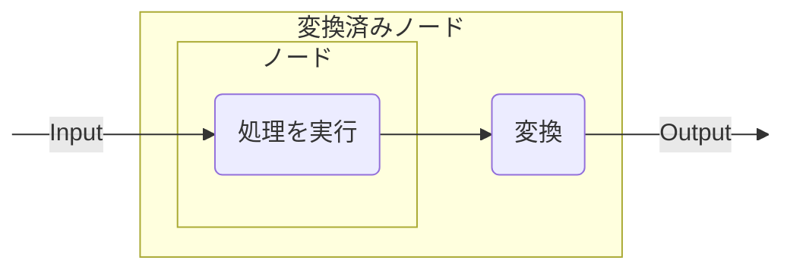
```mermaid
graph LR
    in:::hidden
    out:::hidden
    
    subgraph nodeWithTransform [変換済みノード]
        subgraph node ["ノード"]
            execute(処理を実行)
        end
        transform(変換)
    end
    
    in --Input--> execute --> transform --Output--> out

    classDef hidden display: none;
```
<!--- KNIT example-nodes-and-component-15.txt -->

### ノードの変換

Kotlin では、[transform()](api:agents-core::ai.koog.agents.core.dsl.builder.AIAgentNodeDelegate.transform) 関数は、元のノードをラップし、その出力に変換関数を適用する新しい `AIAgentNodeDelegate` を作成します。Java では、`AIAgentNode.builder()` と明示的な型パラメータを使用して、変換ロジックを含むノードを手動で構成する必要があります。

=== "Kotlin"

    <!--- INCLUDE
    /**
    -->
    <!--- SUFFIX
    **/
    -->
    ```kotlin
    inline fun <reified T> AIAgentNodeDelegate<Input, Output>.transform(
        noinline transformation: suspend (Output) -> T
    ): AIAgentNodeDelegate<Input, T>
    ```
    <!--- KNIT example-nodes-and-component-11.kt -->

=== "Java"

    ```java
    // Javaでは、AIAgentNode.builder()と明示的な型パラメータを使用して、
    // 変換ロジックを含むノードを手動で構成する必要があります。
    // ノード変換のJavaでのアプローチについては、以下の例を参照してください。
    ```
    <!--- KNIT example-nodes-and-component-java-01.java -->

#### カスタムノードの変換

カスタムノードの出力を別のデータ型に変換します。

=== "Kotlin"

    <!--- INCLUDE
    import ai.koog.agents.core.dsl.builder.strategy
    import ai.koog.agents.core.dsl.builder.node
    import ai.koog.agents.core.dsl.extension.nodeDoNothing
    val strategy = strategy<String, Int>("strategy_name") {
    -->
    <!--- SUFFIX
    }
    -->
    ```kotlin
    val textNode by nodeDoNothing<String>("textNode").transform<Int> { text ->
        text.split(" ").filter { it.isNotBlank() }.size
    }

    edge(nodeStart forwardTo textNode)
    edge(textNode forwardTo nodeFinish)
    ```
    <!--- KNIT example-nodes-and-component-12.kt -->

=== "Java"
    
    <!--- INCLUDE
    import ai.koog.agents.core.agent.entity.AIAgentGraphStrategy;
    import ai.koog.agents.core.agent.entity.AIAgentNode;
    class exampleNodesAndComponentsJava11 {
        public static void main(String[] args) {
            var strategy = AIAgentGraphStrategy.builder("strategy_name")
                .withInput(String.class)
                .withOutput(Integer.class);
    -->
    <!--- SUFFIX
        }
    }
    -->
    ```java
    var textNode = AIAgentNode.builder("textNode")
        .withInput(String.class)
        .withOutput(Integer.class)
        .withAction((text, ctx) -> {
            String[] words = text.split(" ");
            int count = 0;
            for (String word : words) {
                if (!word.isBlank()) {
                    count++;
                }
            }
            return count;
        })
        .build();

    strategy.edge(strategy.nodeStart, textNode);
    strategy.edge(textNode, strategy.nodeFinish);
    ```
    <!--- KNIT exampleNodesAndComponentsJava11.java -->

#### 組み込みノードの変換

`nodeLLMRequest` (Kotlin) または `AIAgentNode.llmRequest()` (Java) のような組み込みノードの出力を変換します。

=== "Kotlin"

    <!--- INCLUDE
    import ai.koog.agents.core.dsl.builder.strategy
    import ai.koog.agents.core.dsl.builder.node
    import ai.koog.agents.core.dsl.extension.nodeLLMRequest
    import ai.koog.prompt.message.MessagePart
    val strategy = strategy<String, Int>("strategy_name") {
    -->
    <!--- SUFFIX
    }
    -->
    ```kotlin
    val lengthNode by nodeLLMRequest("llmRequest").transform<Int> { assistantMessage ->
        assistantMessage.parts.filterIsInstance<MessagePart.Text>().joinToString("
") { it.text }.length
    }

    edge(nodeStart forwardTo lengthNode)
    edge(lengthNode forwardTo nodeFinish)
    ```
    <!--- KNIT example-nodes-and-component-13.kt -->

=== "Java"
    
    <!--- INCLUDE
    import ai.koog.agents.core.agent.entity.AIAgentEdge;
    import ai.koog.agents.core.agent.entity.AIAgentGraphStrategy;
    import ai.koog.agents.core.agent.entity.AIAgentNode;
    import ai.koog.prompt.message.Message;
    import ai.koog.prompt.message.MessagePart;
    import java.util.stream.Collectors;
    class exampleNodesAndComponentsJava12 {
        public static void main(String[] args) {
            var strategy = AIAgentGraphStrategy.builder("strategy_name")
                .withInput(String.class)
                .withOutput(Integer.class);
    -->
    <!--- SUFFIX
        }
    }
    -->
    ```java
    var llmRequest = AIAgentNode.llmRequest("llmRequest");
    var lengthNode = AIAgentNode.builder("lengthNode")
        .withInput(Message.Assistant.class)
        .withOutput(Integer.class)
        .withAction((assistantMessage, ctx) -> {
            String text = assistantMessage.getParts().stream()
                .filter(p -> p instanceof MessagePart.Text)
                .map(p -> ((MessagePart.Text) p).getText())
                .collect(Collectors.joining());
            return text.length();
        })
        .build();

    strategy.edge(AIAgentEdge.builder()
        .from(strategy.nodeStart)
        .to(llmRequest)
        .build());
    strategy.edge(llmRequest, lengthNode);
    strategy.edge(lengthNode, strategy.nodeFinish);
    ```
    <!--- KNIT exampleNodesAndComponentsJava12.java -->

## 構成済みサブグラフ

フレームワークは、一般的に使用されるパターンやワークフローをカプセル化した構成済みサブグラフを提供しています。これらのサブグラフは、ベースとなるノードとエッジの作成を自動的に処理することで、複雑なエージェント戦略の開発を簡素化します。APIはKotlinとJavaの間で一貫しており、KotlinではDSL関数を使用し、Javaではビルダーメソッドを使用します。

構成済みサブグラフを使用することで、さまざまな一般的なパイプラインを実装できます。以下に例を示します：

1. データを準備する。
2. タスクを実行する。
3. タスク結果を検証する。結果が不正確な場合は、調整を行うためのフィードバックメッセージを添えてステップ2に戻る。

### タスク実行サブグラフ

提供されたツールを使用して特定のタスクを実行し、構造化された結果を返すサブグラフです。マルチレスポンスLLMインタラクション（アシスタントがツール呼び出しを挟んで複数のレスポンスを生成する場合がある）をサポートし、ツール呼び出しの実行方法を制御できます。Kotlin では [subgraphWithTask()](api:agents-core::ai.koog.agents.ext.agent.subgraphWithTask) を、Java では [AIAgentSubgraph.builder().withTask()](api:agents-core::ai.koog.agents.core.agent.entity.TypedAIAgentSubgraphBuilder.withTask) を使用します。

このサブグラフは以下の目的で使用できます：

- より大きなワークフロー内で特定のタスクを処理する特別なコンポーネントを作成する。
- 明確な入出力インターフェースを持つ複雑なロジックをカプセル化する。
- タスク固有のツール、モデル、プロンプトを構成する。
- 自動圧縮機能を使用して会話履歴を管理する。
- 構造化されたエージェントワークフローやタスク実行パイプラインを開発する。
- LLMタスク実行から構造化された結果（複数のアシスタントレスポンスやツール呼び出しを含むフローを含む）を生成する。

APIでは、オプションのパラメータを使用して実行を微調整できます：

- [runMode](api:agents-core::ai.koog.agents.core.agent.entity.SubgraphWithTaskBuilder.runMode): タスク中のツール呼び出しの実行方法を制御します（デフォルトはシーケンシャル）。基盤となるモデル/エグゼキューターがサポートしている場合、異なるツール実行戦略を切り替えるために使用します。
- [assistantResponseRepeatMax](api:agents-core::ai.koog.agents.core.agent.entity.SubgraphWithTaskBuilder.assistantResponseRepeatMax): タスクを完了できないと判断するまでに許可されるアシスタントレスポンスの回数を制限します（指定されない場合は、安全な内部制限がデフォルトで適用されます）。

サブグラフにタスクをテキストとして提供し、必要に応じてLLMを構成し、必要なツールを提供すれば、サブグラフがタスクを処理して解決します。例を以下に示します：

=== "Kotlin"

    <!--- INCLUDE
    import ai.koog.agents.core.dsl.builder.strategy
    import ai.koog.agents.core.dsl.builder.node
    import ai.koog.agents.ext.tool.SayToUser
    import ai.koog.prompt.executor.clients.openai.OpenAIModels
    import ai.koog.agents.ext.agent.subgraphWithTask
    val searchTool = SayToUser
    val calculatorTool = SayToUser
    val weatherTool = SayToUser
    val strategy = strategy<String, String>("strategy_name") {
    -->
    <!--- SUFFIX
    }
    -->
    ```kotlin
    val processQuery by subgraphWithTask<String, String>(
        tools = listOf(searchTool, calculatorTool, weatherTool),
        llmModel = OpenAIModels.Chat.GPT4o,
        parallelTools = false,
        assistantResponseRepeatMax = 3,
    ) { userQuery ->
        """
        You are a helpful assistant that can answer questions about various topics.
        Please help with the following query:
        $userQuery
        """
    }
    ```
    <!--- KNIT example-nodes-and-component-14.kt -->

=== "Java"
    
    <!--- INCLUDE
    import ai.koog.agents.core.agent.entity.AIAgentGraphStrategy;
    import ai.koog.agents.core.agent.entity.AIAgentSubgraph;
    import ai.koog.agents.ext.tool.SayToUser;
    import java.util.List;
    class exampleNodesAndComponentsJava13 {
        public static void main(String[] args) {
            var strategy = AIAgentGraphStrategy.builder("strategy_name")
                .withInput(String.class)
                .withOutput(String.class);
            SayToUser searchTool = SayToUser.INSTANCE;
            SayToUser calculatorTool = SayToUser.INSTANCE;
            SayToUser weatherTool = SayToUser.INSTANCE;
    -->
    <!--- SUFFIX
        }
    }
    -->
    ```java
    var processQuery = AIAgentSubgraph.builder("processQuery")
        .limitedTools(List.of(searchTool, calculatorTool, weatherTool))
        .withInput(String.class)
        .withOutput(String.class)
        .withTask(userQuery ->
            "You are a helpful assistant that can answer questions about various topics.
" +
            "Please help with the following query:
" +
            userQuery)
        .parallelTools(false)
        .assistantResponseRepeatMax(3)
        .build();
    ```
    <!--- KNIT exampleNodesAndComponentsJava13.java -->

### 検証機能付きタスク実行サブグラフ

`subgraphWithTask` の特別バージョンで、タスクが正しく実行されたかどうかを検証し、発生した問題の詳細を提供します。このサブグラフは、バリデーションや品質チェックが必要なワークフローに役立ちます。Kotlin では [subgraphWithVerification()](api:agents-core::ai.koog.agents.ext.agent.subgraphWithVerification) を、Java では `AIAgentSubgraph.builder().withVerification()` を使用します。

このサブグラフは以下の目的で使用できます：

- タスク実行の正確性を検証する。
- ワークフローに品質管理プロセスを実装する。
- 自己検証コンポーネントを作成する。
- 成功/失敗のステータスと詳細なフィードバックを含む、構造化された検証結果を生成する。

このサブグラフは、ワークフローの最後にLLMが検証ツールを呼び出して、タスクが正常に完了したかどうかを確認するようにします。この検証が最終ステップとして実行されることを保証し、タスクが正常に完了したかどうかを示す [CriticResult](api:agents-core::ai.koog.agents.ext.agent.CriticResult) と詳細なフィードバックを返します。
例を以下に示します：

=== "Kotlin"

    <!--- INCLUDE
    import ai.koog.agents.core.dsl.builder.strategy
    import ai.koog.agents.core.dsl.builder.node
    import ai.koog.agents.ext.tool.SayToUser
    import ai.koog.prompt.executor.clients.anthropic.AnthropicModels
    import ai.koog.agents.ext.agent.subgraphWithVerification
    val runTestsTool = SayToUser
    val analyzeTool = SayToUser
    val readFileTool = SayToUser
    val strategy = strategy<String, String>("strategy_name") {
    -->
    <!--- SUFFIX
    }
    -->
    ```kotlin
    val verifyCode by subgraphWithVerification<String>(
        tools = listOf(runTestsTool, analyzeTool, readFileTool),
        llmModel = AnthropicModels.Opus_4_6,
        parallelTools = false,
        assistantResponseRepeatMax = 3,
    ) { codeToVerify ->
        """
        You are a code reviewer. Please verify that the following code meets all requirements:
        1. It compiles without errors
        2. All tests pass
        3. It follows the project's coding standards

        Code to verify:
        $codeToVerify
        """
    }
    ```
    <!--- KNIT example-nodes-and-component-15.kt -->

=== "Java"

    <!--- INCLUDE
    import ai.koog.agents.core.agent.entity.AIAgentGraphStrategy;
    import ai.koog.agents.core.agent.entity.AIAgentSubgraph;
    import ai.koog.agents.ext.tool.SayToUser;
    import java.util.List;
    class exampleNodesAndComponentsJava14 {
        public static void main(String[] args) {
            var strategy = AIAgentGraphStrategy.builder("strategy_name")
                .withInput(String.class)
                .withOutput(String.class);
            SayToUser runTestsTool = SayToUser.INSTANCE;
            SayToUser analyzeTool = SayToUser.INSTANCE;
            SayToUser readFileTool = SayToUser.INSTANCE;
    -->
    <!--- SUFFIX
        }
    }
    -->
    ```java
    var verifyCode = AIAgentSubgraph.builder("verifyCode")
        .limitedTools(List.of(runTestsTool, analyzeTool, readFileTool))
        .withInput(String.class)
        .withVerification(codeToVerify ->
            "You are a code reviewer. Please verify that the following code meets all requirements:
" +
            "1. It compiles without errors
" +
            "2. All tests pass
" +
            "3. It follows the project's coding standards
\n" +
            "Code to verify:
" +
            codeToVerify)
        .parallelTools(false)
        .assistantResponseRepeatMax(3)
        .build();
    ```
    <!--- KNIT exampleNodesAndComponentsJava14.java -->

## 構成済みの戦略（Strategy）と一般的な戦略パターン

Koogは、さまざまなノードを組み合わせた構成済みの戦略（Strategy）を提供しています。
ノードは、各エッジをいつたどるかを指定する条件とともに、エッジを使用して接続され、操作のフローを定義します。

必要に応じて、これらの戦略をエージェントワークフローに統合できます。

### 単発実行戦略

単発実行戦略は、エージェントが一度だけ入力を処理して結果を返す、非対話型のユースケース向けに設計されています。

複雑なロジックを必要としない、単純なプロセスを実行する場合にこの戦略を使用できます。

=== "Kotlin"

    <!--- INCLUDE
    import ai.koog.agents.core.agent.entity.AIAgentGraphStrategy
    import ai.koog.agents.core.dsl.builder.strategy
    import ai.koog.agents.core.dsl.builder.node
    import ai.koog.agents.core.dsl.extension.*
    -->
    ```kotlin
    public fun singleRunStrategy(): AIAgentGraphStrategy<String, String> = strategy("single_run") {
        val nodeCallLLM by nodeLLMRequest("sendInput")
        val nodeExecuteTool by nodeExecuteTools("nodeExecuteTool")
        val nodeSendToolResult by nodeLLMSendToolResults("nodeSendToolResult")

        edge(nodeStart forwardTo nodeCallLLM)
        edge(nodeCallLLM forwardTo nodeExecuteTool onToolCalls { true })
        edge(nodeCallLLM forwardTo nodeFinish onTextMessage { true })
        edge(nodeExecuteTool forwardTo nodeSendToolResult)
        edge(nodeSendToolResult forwardTo nodeFinish onTextMessage { true })
        edge(nodeSendToolResult forwardTo nodeExecuteTool onToolCalls { true })
    }
    ```
    <!--- KNIT example-nodes-and-component-16.kt -->

=== "Java"
    
    <!--- INCLUDE
    import ai.koog.agents.core.agent.entity.AIAgentEdge;
    import ai.koog.agents.core.agent.entity.AIAgentGraphStrategy;
    import ai.koog.agents.core.agent.entity.AIAgentNode;
    import ai.koog.prompt.message.Message;
    import ai.koog.prompt.message.MessagePart;
    import java.util.stream.Collectors;
    class exampleNodesAndComponentsJava15 {
    -->
    <!--- SUFFIX
        public static void main(String[] args) {
        }
    }
    -->
    ```java
    public static AIAgentGraphStrategy<String, String> singleRunStrategy() {
        var strategy = AIAgentGraphStrategy.builder("single_run")
            .withInput(String.class)
            .withOutput(String.class);

        var nodeCallLLM = AIAgentNode.llmRequest("sendInput");
        var nodeExecuteTool = AIAgentNode.executeTools("nodeExecuteTool");
        var nodeSendToolResult = AIAgentNode.llmSendToolResults("nodeSendToolResult");

        strategy.edge(AIAgentEdge.builder()
            .from(strategy.nodeStart)
            .to(nodeCallLLM)
            .build());

        strategy.edge(AIAgentEdge.builder()
            .from(nodeCallLLM)
            .to(nodeExecuteTool)
            .onToolCalls()
            .build());

        strategy.edge(AIAgentEdge.builder()
            .from(nodeCallLLM)
            .to(strategy.nodeFinish)
            .onTextMessage()
            .build());

        strategy.edge(nodeExecuteTool, nodeSendToolResult);

        strategy.edge(AIAgentEdge.builder()
            .from(nodeSendToolResult)
            .to(strategy.nodeFinish)
            .onTextMessage()
            .build());

        strategy.edge(AIAgentEdge.builder()
            .from(nodeSendToolResult)
            .to(nodeExecuteTool)
            .onToolCalls()
            .build());

        return strategy.build();
    }
    ```
    <!--- KNIT exampleNodesAndComponentsJava15.java -->

### ツールベースの戦略

ツールベースの戦略は、特定の操作を実行するためにツールに大きく依存するワークフロー向けに設計されています。
通常、LLMの決定に基づいてツールを実行し、その結果を処理します。

=== "Kotlin"

    <!--- INCLUDE
    import ai.koog.agents.core.agent.entity.AIAgentGraphStrategy
    import ai.koog.agents.core.dsl.builder.strategy
    import ai.koog.agents.core.dsl.builder.node
    import ai.koog.agents.core.dsl.extension.*
    import ai.koog.agents.core.tools.ToolRegistry
    -->
    ```kotlin
    fun toolBasedStrategy(name: String, toolRegistry: ToolRegistry): AIAgentGraphStrategy<String, String> {
        return strategy(name) {
            val nodeSendInput by nodeLLMRequest()
            val nodeExecuteTool by nodeExecuteTools()
            val nodeSendToolResult by nodeLLMSendToolResults()

            // エージェントのフローを定義
            edge(nodeStart forwardTo nodeSendInput)

            // LLMがメッセージで応答した場合は終了
            edge(
                (nodeSendInput forwardTo nodeFinish)
                        onTextMessage { true }
            )

            // LLMがツールを呼び出した場合はそれを実行
            edge(
                (nodeSendInput forwardTo nodeExecuteTool)
                        onToolCalls { true }
            )

            // ツールの結果をLLMに送り返す
            edge(nodeExecuteTool forwardTo nodeSendToolResult)

            // LLMが別のツールを呼び出した場合はそれを実行
            edge(
                (nodeSendToolResult forwardTo nodeExecuteTool)
                        onToolCalls { true }
            )

            // LLMがメッセージで応答した場合は終了
            edge(
                (nodeSendToolResult forwardTo nodeFinish)
                        onTextMessage { true }
            )
        }
    }
    ```
    <!--- KNIT example-nodes-and-component-17.kt -->

=== "Java"
    
    <!--- INCLUDE
    import ai.koog.agents.core.agent.entity.AIAgentEdge;
    import ai.koog.agents.core.agent.entity.AIAgentGraphStrategy;
    import ai.koog.agents.core.agent.entity.AIAgentNode;
    import ai.koog.prompt.message.Message;
    import ai.koog.prompt.message.MessagePart;
    import ai.koog.agents.core.tools.ToolRegistry;
    import java.util.stream.Collectors;
    class exampleNodesAndComponentsJava16 {
    -->
    <!--- SUFFIX
        public static void main(String[] args) {
        }
    }
    -->
    ```java
    public static AIAgentGraphStrategy<String, String> toolBasedStrategy(String name, ToolRegistry toolRegistry) {
        var strategy = AIAgentGraphStrategy.builder(name)
            .withInput(String.class)
            .withOutput(String.class);

        var nodeSendInput = AIAgentNode.llmRequest("nodeSendInput");
        var nodeExecuteTool = AIAgentNode.executeTools("nodeExecuteTool");
        var nodeSendToolResult = AIAgentNode.llmSendToolResults("nodeSendToolResult");

        // エージェントのフローを定義
        strategy.edge(AIAgentEdge.builder()
            .from(strategy.nodeStart)
            .to(nodeSendInput)
            .build());

        // LLMがメッセージで応答した場合は終了
        strategy.edge(AIAgentEdge.builder()
            .from(nodeSendInput)
            .to(strategy.nodeFinish)
            .onTextMessage()
            .build());

        // LLMがツールを呼び出した場合はそれを実行
        strategy.edge(AIAgentEdge.builder()
            .from(nodeSendInput)
            .to(nodeExecuteTool)
            .onToolCalls(call -> true)
            .build());

        // ツールの結果をLLMに送り返す
        strategy.edge(nodeExecuteTool, nodeSendToolResult);

        // LLMが別のツールを呼び出した場合はそれを実行
        strategy.edge(AIAgentEdge.builder()
            .from(nodeSendToolResult)
            .to(nodeExecuteTool)
            .onToolCalls()
            .build());

        // LLMがメッセージで応答した場合は終了
        strategy.edge(AIAgentEdge.builder()
            .from(nodeSendToolResult)
            .to(strategy.nodeFinish)
            .onTextMessage()
            .build());

        return strategy.build();
    }
    ```
    <!--- KNIT exampleNodesAndComponentsJava16.java -->

### ストリーミングデータ戦略

ストリーミングデータ戦略は、LLMからのストリーミングデータを処理するために設計されています。通常、ストリーミングデータを要求し、それを処理し、処理されたデータを使用してツールを呼び出す可能性があります。

=== "Kotlin"

    <!--- INCLUDE
    import ai.koog.agents.core.dsl.builder.strategy
    import ai.koog.agents.core.dsl.builder.node
    import ai.koog.agents.example.exampleStreamingApi05.Book
    import ai.koog.agents.example.exampleStreamingApi06.markdownBookDefinition
    import ai.koog.agents.example.exampleStreamingApi08.parseMarkdownStreamToBooks
    -->
    ```kotlin
    val agentStrategy = strategy<String, List<Book>>("library-assistant") {
        // 出力ストリームのパースを含むノードを記述
        val getMdOutput by node<String, List<Book>> { booksDescription ->
            val books = mutableListOf<Book>()
            val mdDefinition = markdownBookDefinition()

            llm.writeSession {
                appendPrompt { user(booksDescription) }
                // mdDefinition の形式でレスポンスストリームを開始
                val markdownStream = requestLLMStreaming(mdDefinition)
                // レスポンスストリームの結果を使用してパーサーを呼び出し、その結果に対してアクションを実行
                parseMarkdownStreamToBooks(markdownStream).collect { book ->
                    books.add(book)
                    println("Parsed Book: ${book.title} by ${book.author}")
                }
            }

            books
        }
        // ノードにアクセスできるようにエージェントのグラフを記述
        edge(nodeStart forwardTo getMdOutput)
        edge(getMdOutput forwardTo nodeFinish)
    }
    ```
    <!--- KNIT example-nodes-and-component-18.kt -->

=== "Java"

    <!--- INCLUDE
    import ai.koog.agents.core.agent.entity.AIAgentGraphStrategy;
    import ai.koog.agents.core.agent.entity.AIAgentNode;
    import ai.koog.prompt.streaming.StreamFrame;
    import ai.koog.prompt.structure.StructureDefinition;
    import ai.koog.prompt.structure.markdown.MarkdownStructureDefinition;
    import ai.koog.serialization.TypeCapture;
    import ai.koog.serialization.TypeToken;
    import java.util.ArrayList;
    import java.util.List;
    import java.util.concurrent.Flow;
    class exampleNodesAndComponentsJava17 {
        class Book {
            String getTitle() {
                return "";
            }
            String getAuthor() {
                return "";
            }
        }
        public static MarkdownStructureDefinition markdownBookDefinition() {
            return null;
        }
        public static Flow.Publisher<Book> parseMarkdownStreamToBooks(Flow.Publisher<StreamFrame> markdownStream) {
            return null;
        }
        public static void main(String[] args) {
    -->
    <!--- SUFFIX
        }
    }
    -->
    ```java
    var strategy = AIAgentGraphStrategy.builder()
        .withInput(String.class)
        .withOutput(List.class);

    var getMdOutput = AIAgentNode.builder()
        .withInput(String.class)
        .<List<Book>>withOutput(TypeToken.of(new TypeCapture<List<Book>>() {}))
        .withAction((booksDescription, ctx) -> {
            var books = new ArrayList<Book>();
            StructureDefinition mdDefinition = markdownBookDefinition();

            ctx.getLlm().writeSession(session -> {
                session.appendPrompt(prompt -> {
                    prompt.user(booksDescription);
                });

                // mdDefinition の形式でレスポンスストリームを開始
                var markdownStream = session.requestLLMStreaming(mdDefinition);
                // レスポンスストリームの結果を使用してパーサーを呼び出し、その結果に対してアクションを実行
                parseMarkdownStreamToBooks(markdownStream).subscribe(new Flow.Subscriber<>() {
                    @Override
                    public void onSubscribe(Flow.Subscription subscription) {
                    }

                    @Override
                    public void onNext(Book book) {
                        books.add(book);
                        System.out.println("Parsed Book: " + book.getTitle() + " by " + book.getAuthor());
                    }

                    @Override
                    public void onError(Throwable throwable) {
                    }

                    @Override
                    public void onComplete() {
                    }
                });

                return null;
            });

            return books;
        })
        .build();

    strategy.edge(strategy.nodeStart, getMdOutput);
    strategy.edge(getMdOutput, strategy.nodeFinish);
    ```
    <!--- KNIT exampleNodesAndComponentsJava17.java -->