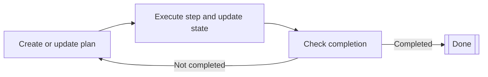

# プランナーエージェント (Planner agents)

プランナーエージェント (Planner agents) は、反復的なプランニングサイクルを通じて多段階のタスクを計画・実行できるAIエージェントです。
これらは継続的にプランを作成または更新し、ステップを実行し、現在の状態に対して完了条件をチェックします。

プランナーエージェントは、高レベルのゴールをより小さく実行可能なステップに分割し、
各ステップの結果に基づいてプランを適応させる必要がある複雑なタスクに適しています。

プランナーエージェントは、以下の反復的なプランニングサイクルを通じて動作します。

1. プランナーは現在の状態に基づいてプランを作成または更新します。
2. プランナーはプランから1つのステップを実行し、状態を更新します。
3. プランナーは現在の状態に従ってプランが完了したかどうかを判断します。
    - プランが完了していれば、サイクルは終了します。
    - プランが完了していなければ、最初のステップからサイクルを繰り返します。



## 前提条件 (Prerequisites)

開始する前に、以下が準備されていることを確認してください。

- 動作するKotlin/JVMプロジェクト。
- Java 17+ がインストールされていること。
- AIエージェントの実装に使用するLLMプロバイダーの有効なAPIキー。利用可能なすべてのプロバイダーのリストについては、
[LLMプロバイダー](llm-providers.md)を参照してください。

!!! tip
    APIキーの保存には、環境変数または安全な設定管理システムを使用してください。
    ソースコードにAPIキーを直接ハードコードすることは避けてください。

## 依存関係の追加

プランナーエージェントを使用するには、ビルド設定に以下の依存関係を含めてください。

```
dependencies {
    implementation("ai.koog:koog-agents:VERSION")
}
```

利用可能なすべてのインストール方法については、[Koogのインストール](getting-started.md#install-koog)を参照してください。

## シンプルなLLMベースのプランナー

シンプルなLLMベースのプランナーは、LLMを使用してプランの生成と評価を行います。
これらは文字列ベースの状態 (string-based state) で動作し、LLMリクエストを通じてステップを実行します。
文字列ベースの状態とは、エージェントの状態が単一の文字列として記述されることを意味し、
エージェントは初期状態の文字列を受け取り、結果として最終状態の文字列を返します。

Koogは2つのシンプルなプランナーを提供しています。

- [SimpleLLMPlanner](https://api.koog.ai/agents/agents-core/ai.koog.agents.planner.llm/-simple-l-l-m-planner/index.html)
    は、最初に一度だけプランを生成し、完了するまでそのプランに従います。
    再プランニングを含めるには、`SimpleLLMPlanner`を継承して`assessPlan`メソッドをオーバーライドし、
    エージェントがいつ再プランニングすべきかを指定します。
- [SimpleLLMWithCriticPlanner](https://api.koog.ai/agents/agents-core/ai.koog.agents.planner.llm/-simple-l-l-with-critic-planner/index.html)
    は、LLMを使用する`assessPlan`メソッドを実装しています。
    このメソッドはLLMリクエストを通じてプランの妥当性をチェックし、エージェントが再プランニングすべきかどうかを評価します。

以下の例は、`SimpleLLMPlanner`を使用してシンプルなプランナーエージェントを作成する方法を示しています。

<!--- INCLUDE
import ai.koog.agents.core.agent.config.AIAgentConfig
import ai.koog.agents.planner.AIAgentPlannerStrategy
import ai.koog.agents.planner.PlannerAIAgent
import ai.koog.agents.planner.llm.SimpleLLMPlanner
import ai.koog.prompt.dsl.prompt
import ai.koog.prompt.executor.clients.openai.OpenAIModels
import ai.koog.prompt.executor.llms.all.simpleOpenAIExecutor
import kotlinx.coroutines.runBlocking
-->
```kotlin
// プランナーを作成
val planner = SimpleLLMPlanner()

// プランナーストラテジーでラップする
val strategy = AIAgentPlannerStrategy(
    name = "simple-planner",
    planner = planner
)

// エージェントを設定
val agentConfig = AIAgentConfig(
    prompt = prompt("planner") {
        system("You are a helpful planning assistant.")
    },
    model = OpenAIModels.Chat.GPT4o,
    maxAgentIterations = 50
)

// プランナーエージェントを作成
val agent = PlannerAIAgent(
    promptExecutor = simpleOpenAIExecutor(System.getenv("OPENAI_API_KEY")),
    strategy = strategy,
    agentConfig = agentConfig
)

suspend fun main() {
    // タスクを指定してエージェントを実行
    val result = agent.run("Create a plan to organize a team meeting")
    println(result)
}
```
<!--- KNIT example-planner-01.kt -->

## GOAP (Goal-Oriented Action Planning)

GOAPは、[A*（エースター）探索](https://en.wikipedia.org/wiki/A*_search_algorithm)を使用して最適なアクションシーケンスを見つけるアルゴリズム的なプランニングアプローチです。
LLMを使用してプランを生成する代わりに、
GOAPエージェントは事前に定義されたゴールとアクションに基づいてアクションシーケンスを自動的に発見します。
Koogでは、GOAPはゴールとアクションを宣言的に定義できるDSLを通じて実装されています。

GOAPプランナーは、主に3つの概念で動作します。

- **状態 (State)**: 世界の現在の状態を表します。
- **アクション (Actions)**: 前提条件、効果（ビリーフ）、コスト、および実行ロジックを含め、何ができるかを定義します。
- **ゴール (Goals)**: ターゲット条件、ヒューリスティックコスト、および価値関数を定義します。

GOAPプランナーは、総コストを最小限に抑えながらゴール条件を満たすアクションのシーケンスを見つけるためにA*探索を使用します。

GOAPエージェントを作成するには、以下を行う必要があります。

1. ゴールに固有のさまざまな側面を表すプロパティを持つデータクラスとして状態を定義します。
2. [goap()](https://api.koog.ai/agents/agents-core/ai.koog.agents.planner.goap/goap.html)関数を使用して[GOAPPlanner](https://api.koog.ai/agents/agents-core/ai.koog.agents.planner.goap/-g-o-a-p-planner/index.html)インスタンスを作成します。
    1. [action()](https://api.koog.ai/agents/agents-core/ai.koog.agents.planner.goap/-g-o-a-p-planner-builder/action.html)関数を使用して、前提条件とビリーフを持つアクションを定義します。
    2. [goal()](https://api.koog.ai/agents/agents-core/ai.koog.agents.planner.goap/-g-o-a-p-planner-builder/goal.html)関数を使用して、完了条件を持つゴールを定義します。
3. プランナーを[AIAgentPlannerStrategy](https://api.koog.ai/agents/agents-core/ai.koog.agents.planner/-a-i-agent-planner-strategy/index.html)でラップし、[PlannerAIAgent](https://api.koog.ai/agents/agents-core/ai.koog.agents.planner/-planner-a-i-agent/index.html)のコンストラクタに渡します。

!!! note

    プランナーは個々のアクションとそのシーケンスを選択します。
    各アクションには、アクションが実行されるために真である必要がある前提条件と、
    予測される結果を定義するビリーフが含まれます。
    ビリーフの詳細については、[実際の実行と比較した状態のビリーフ](#state-beliefs-compared-to-actual-execution)を参照してください。

以下の例では、GOAPが記事作成のための高レベルなプランニング（アウトライン → ドラフト → レビュー → 公開）を処理し、
LLMが各アクション内で実際のコンテンツ生成を実行します。

<!--- INCLUDE
import ai.koog.agents.core.agent.AIAgent
import ai.koog.agents.core.agent.config.AIAgentConfig
import ai.koog.agents.planner.AIAgentPlannerStrategy
import ai.koog.agents.planner.goap.GoapAgentState
import ai.koog.prompt.dsl.prompt
import ai.koog.prompt.executor.clients.openai.OpenAIModels
import ai.koog.prompt.executor.llms.all.simpleOpenAIExecutor
-->
```kotlin
// コンテンツ作成のための状態を定義
data class ContentState(
    val topic: String,
    val hasOutline: Boolean = false,
    val outline: String = "",
    val hasDraft: Boolean = false,
    val draft: String = "",
    val hasReview: Boolean = false,
    val isPublished: Boolean = false
) : GoapAgentState<String, String>(topic) {
    // エージェントの出力:
    override fun provideOutput(): String = draft
}

// エージェントを作成して実行
val agentConfig = AIAgentConfig(
    prompt = prompt("writer") {
        system("You are a professional content writer.")
    },
    model = OpenAIModels.Chat.GPT4o,
    maxAgentIterations = 20
)

// LLMを活用したアクションを持つGOAPプランナーストラテジーを作成
val plannerStrategy = AIAgentPlannerStrategy.goap("content-planner", ::ContentState) {
    // 前提条件とビリーフを持つアクションを定義
    action(
        name = "Create outline",
        precondition = { state -> !state.hasOutline },
        belief = { state -> state.copy(hasOutline = true, outline = "Outline") },
        cost = { 1.0 }
    ) { ctx, state ->
        // LLMを使用してアウトラインを作成
        val response = ctx.llm.writeSession {
            appendPrompt {
                user("Create a detailed outline for an article about: ${state.topic}")
            }
            requestLLM()
        }
        state.copy(hasOutline = true, outline = response.content)
    }

    action(
        name = "Write draft",
        precondition = { state -> state.hasOutline && !state.hasDraft },
        belief = { state -> state.copy(hasDraft = true, draft = "Draft") },
        cost = { 2.0 }
    ) { ctx, state ->
        // LLMを使用してドラフトを作成
        val response = ctx.llm.writeSession {
            appendPrompt {
                user("Write an article based on this outline:
${state.outline}")
            }
            requestLLM()
        }
        state.copy(hasDraft = true, draft = response.content)
    }

    action(
        name = "Review content",
        precondition = { state -> state.hasDraft && !state.hasReview },
        belief = { state -> state.copy(hasReview = true) },
        cost = { 1.0 }
    ) { ctx, state ->
        // LLMを使用してドラフトをレビュー
        val response = ctx.llm.writeSession {
            appendPrompt {
                user("Review this article and suggest improvements:
${state.draft}")
            }
            requestLLM()
        }
        println("Review feedback: ${response.content}")
        state.copy(hasReview = true)
    }

    action(
        name = "Publish",
        precondition = { state -> state.hasReview && !state.isPublished },
        belief = { state -> state.copy(isPublished = true) },
        cost = { 1.0 }
    ) { ctx, state ->
        println("Publishing article...")
        state.copy(isPublished = true)
    }

    // 完了条件を持つゴールを定義
    goal(
        name = "Published article",
        description = "Complete and publish the article",
        condition = { state -> state.isPublished }
    )
}

val agent = AIAgent(
    promptExecutor = simpleOpenAIExecutor(System.getenv("OPENAI_API_KEY")),
    strategy = plannerStrategy,
    agentConfig = agentConfig
)

suspend fun main() {
    val result = agent.run("The Future of AI in Software Development")
    println("Final draft: $result")
}
```
<!--- KNIT example-planner-02.kt -->

## 高度なGOAP機能

### カスタムコスト関数

A*探索は最適なアクションシーケンスを見つける際の要因としてコストを使用するため、
プランナーをガイドするためにアクションとゴールのカスタムコスト関数を定義できます。

```kotlin
action(
    name = "Expensive operation",
    precondition = { true },
    belief = { state -> state.copy(operationDone = true) },
    cost = { state ->
        // 状態に基づいた動的なコスト
        if (state.hasOptimization) 1.0 else 10.0
    }
) { ctx, state ->
    // アクションを実行
    state.copy(operationDone = true)
}
```

### 実際の実行と比較した状態のビリーフ

GOAPは、ビリーフ（楽観的な予測）と実際の実行という概念を区別します。

- **ビリーフ (Belief)**: プランナーが起こると考えていることで、プランニングに使用されます。
- **実行 (Execution)**: 実際に起こることで、実際の状態更新に使用されます。

これにより、プランナーは期待される結果に基づいてプランを作成しつつ、実際の結果を適切に処理することができます。

```kotlin
action(
    name = "Attempt complex task",
    precondition = { state -> !state.taskComplete },
    belief = { state ->
        // 楽観的なビリーフ: タスクは成功する
        state.copy(taskComplete = true)
    },
    cost = { 5.0 }
) { ctx, state ->
    // 実際の実行は失敗したり、異なる結果になったりする可能性がある
    val success = performComplexTask()
    state.copy(
        taskComplete = success,
        attempts = state.attempts + 1
    )
}