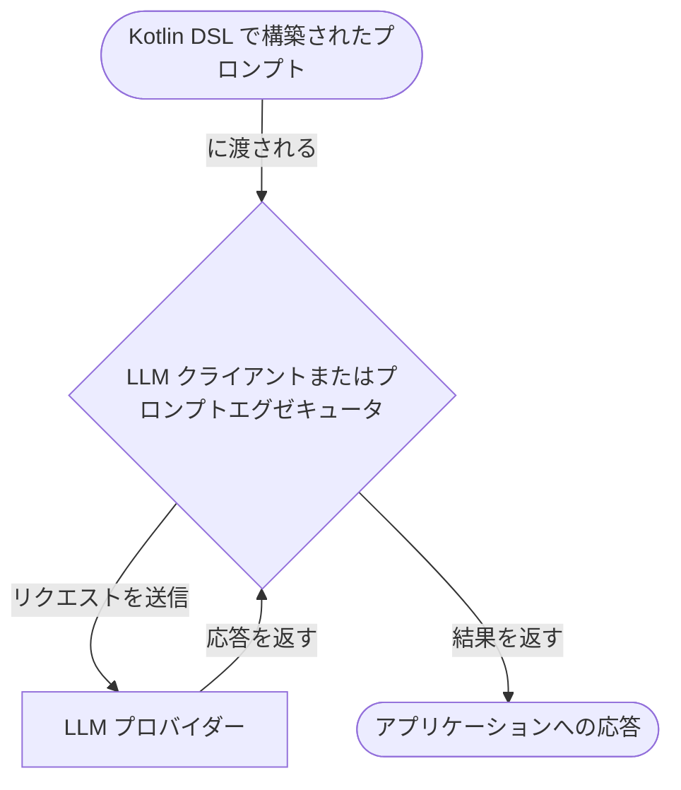
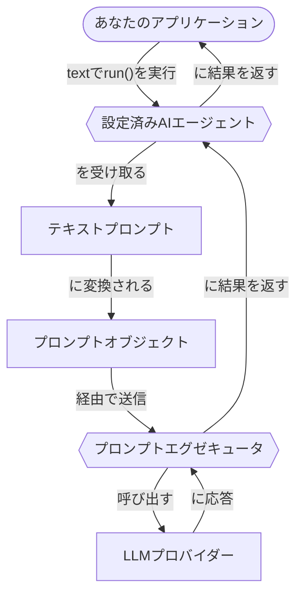

# プロンプト

プロンプトは、大規模言語モデル (LLM) が応答を生成する際にガイドとなる指示です。
プロンプトは、LLM とのやり取りのコンテンツと構造を定義します。
このセクションでは、Koog でプロンプトを作成し、実行する方法について説明します。

## プロンプトの作成

Koog では、プロンプトは [**Prompt**](https://api.koog.ai/prompt/prompt-model/ai.koog.prompt.dsl/-prompt/index.html)
データクラスのインスタンスであり、以下のプロパティを持ちます。

-   `id`: プロンプトの一意の識別子。
-   `messages`: LLM との会話を表すメッセージのリスト。
-   `params`: オプションの [LLM 設定パラメータ](prompt-creation/index.md#prompt-parameters) (temperature、tool choice など)。

`Prompt` クラスを直接インスタンス化することもできますが、
プロンプトを作成する推奨される方法は、会話を定義するための構造化された方法を提供する [Kotlin DSL](prompt-creation/index.md) を使用することです。

<!--- INCLUDE
import ai.koog.prompt.dsl.prompt
-->
```kotlin
val myPrompt = prompt("hello-koog") {
    system("You are a helpful assistant.")
    user("What is Koog?")
}
```
<!--- KNIT example-prompts-01.kt -->

!!! note
    AI エージェントは、シンプルなテキストプロンプトを入力として受け取ることができます。
    これらはテキストプロンプトを自動的に Prompt オブジェクトに変換し、実行のために LLM に送信します。
    これは、単一のリクエストを実行するだけで、複雑な会話ロジックを必要としない [基本的なエージェント](../basic-agents.md) に役立ちます。

## プロンプトの実行

Koog は、LLM に対してプロンプトを実行するための2つの抽象化レベル、LLM クライアントとプロンプトエグゼキュータを提供します。
どちらも Prompt オブジェクトを受け入れ、AI エージェントなしで直接プロンプトを実行するために使用できます。
実行フローは、クライアントとエグゼキュータの両方で同じです。



<div class="grid cards" markdown>

-   :material-arrow-right-bold:{ .lg .middle } [**LLM クライアント**](llm-clients.md)

    ---

    特定の LLM プロバイダーとの直接的な対話のための低レベルのインターフェース。
    単一のプロバイダーと連携し、高度なライフサイクル管理を必要としない場合に使用します。

-   :material-swap-horizontal:{ .lg .middle } [**プロンプトエグゼキュータ**](prompt-executors.md)

    ---

    1つまたは複数の LLM クライアントのライフサイクルを管理する高レベルの抽象化。
    複数のプロバイダーでプロンプトを実行するための統一された API と、プロバイダー間の動的な切り替えやフォールバック機能が必要な場合に使用します。

</div>

## パフォーマンスの最適化と障害処理

Koog を使用すると、プロンプトの実行時にパフォーマンスを最適化し、障害を処理できます。

<div class="grid cards" markdown>

-   :material-cached:{ .lg .middle } [**LLM 応答のキャッシュ**](llm-response-caching.md)

    ---

    LLM 応答をキャッシュして、パフォーマンスを最適化し、繰り返しのリクエストに対してコストを削減します。

-   :material-shield-check:{ .lg .middle } [**障害処理**](handling-failures.md)

    ---

    アプリケーションで組み込みのリトライ、タイムアウト、その他のエラー処理メカニズムを使用します。

</div>

## AI エージェントにおけるプロンプト

Koog では、AI エージェントはそのライフサイクル中にプロンプトを維持および管理します。
LLM クライアントやエグゼキュータがプロンプトの実行に使用される一方で、エージェントはプロンプト更新のフローを処理し、会話履歴が適切かつ一貫性を保つようにします。

エージェントにおけるプロンプトのライフサイクルは、通常、いくつかの段階を含みます。

1.  初期プロンプトの設定。
2.  プロンプトの自動更新。
3.  コンテキストウィンドウの管理。
4.  プロンプトの手動管理。

### 初期プロンプトの設定

[エージェントを初期化する](../getting-started/#create-and-run-an-agent) 際、エージェントの動作を設定する [システムメッセージ](prompt-creation/index.md#system-message) を定義します。
その後、エージェントの `run()` メソッドを呼び出すとき、通常、初期の [ユーザーメッセージ](prompt-creation/index.md#user-messages) を入力として提供します。
これらのメッセージが一緒になって、エージェントの初期プロンプトを形成します。例：

<!--- INCLUDE
import ai.koog.agents.core.agent.AIAgent
import ai.koog.prompt.executor.clients.openai.OpenAIModels
import ai.koog.prompt.executor.llms.all.simpleOpenAIExecutor
import kotlinx.coroutines.runBlocking

val apiKey = System.getenv("OPENAI_API_KEY")

fun main() = runBlocking {
-->
<!--- SUFFIX
}
-->
```kotlin
// エージェントを作成
val agent = AIAgent(
    promptExecutor = simpleOpenAIExecutor(apiKey),
    systemPrompt = "You are a helpful assistant.",
    llmModel = OpenAIModels.Chat.GPT4o
)

// エージェントを実行
val result = agent.run("What is Koog?")
```
<!--- KNIT example-prompts-02.kt -->

この例では、エージェントはテキストプロンプトを自動的に Prompt オブジェクトに変換し、プロンプトエグゼキュータに送信します。



より [高度な設定](../complex-workflow-agents.md#4-configure-the-agent) については、[AIAgentConfig](https://api.koog.ai/agents/agents-core/ai.koog.agents.core.agent.config/-a-i-agent-config/index.html) を使用して、エージェントの初期プロンプトを定義することもできます。

### プロンプトの自動更新

エージェントがその戦略を実行する際、[定義済みのノード](../nodes-and-components.md) はプロンプトを自動的に更新します。
例：

-   [`nodeLLMRequest`](../nodes-and-components/#nodellmrequest): ユーザーメッセージをプロンプトに追加し、LLM の応答を捕捉します。
-   [`nodeLLMSendToolResult`](../nodes-and-components/#nodellmsendtoolresult): ツール実行結果を会話に追加します。
-   [`nodeAppendPrompt`](../nodes-and-components/#nodeappendprompt): ワークフローの任意の時点で、特定のメッセージをプロンプトに挿入します。

### コンテキストウィンドウの管理

長期にわたるインタラクションにおいて、LLM のコンテキストウィンドウを超過するのを避けるために、エージェントは [履歴圧縮](../history-compression.md) 機能を使用できます。

### プロンプトの手動管理

複雑なワークフローの場合、[LLM セッション](../sessions.md) を使用してプロンプトを手動で管理できます。
エージェント戦略またはカスタムノードでは、`llm.writeSession` を使用して `Prompt` オブジェクトにアクセスし、変更できます。
これにより、必要に応じてメッセージを追加、削除、または並べ替えることができます。