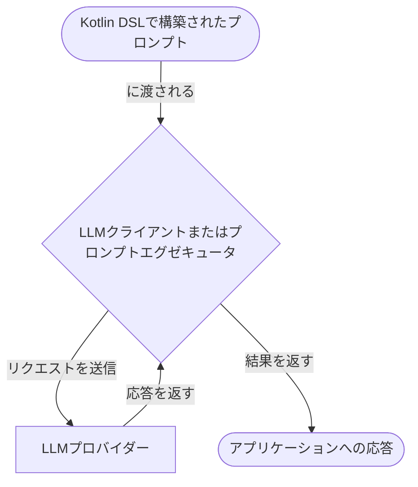

# プロンプト

プロンプトは、大規模言語モデル (LLM) が応答を生成する際にガイドとなる指示です。
プロンプトは、LLM とのやり取りのコンテンツと構造を定義します。
このセクションでは、Koog でプロンプトを作成し、実行する方法について説明します。

## プロンプトの作成

Koog では、すべてのプロンプトは [**Prompt**](https://api.koog.ai/prompt/prompt-model/ai.koog.prompt.dsl/-prompt/index.html)
オブジェクトとして表現されます。Prompt オブジェクトには以下が含まれます。

-   **ID**: プロンプトの一意の識別子。
-   **メッセージ**: LLM との会話を表すメッセージのリスト。
-   **パラメータ**: オプションの [LLM 設定パラメータ](https://api.koog.ai/prompt/prompt-model/ai.koog.prompt.params/-l-l-m-params/index.html)
    (temperature、tool choice など)。

すべての Prompt オブジェクトは、Kotlin DSL を使用して定義された構造化プロンプトであり、これにより会話の構造を指定できます。

!!! note
    AI エージェントを使用すると、Prompt オブジェクトを作成する代わりに、シンプルなテキストプロンプトを提供できます。
    エージェントはテキストプロンプトを自動的に Prompt オブジェクトに変換し、実行のために LLM に送信します。
    これは、単一のリクエストを実行するだけでよい [基本的なエージェント](basic-agents.md) に役立ちます。

<div class="grid cards" markdown>

-   :material-code-braces:{ .lg .middle } [**構造化プロンプト**](structured-prompts.md)

    ---

    複雑な複数ターンの会話のために、型安全な構造化プロンプトを作成します。

-   :material-multimedia:{ .lg .middle } [**マルチモーダル入力**](multimodal-inputs.md)

    ---

    構造化プロンプトで、テキストとともに画像、音声、ビデオ、ドキュメントを送信します。

</div>

## プロンプトの実行

Koog は、LLM に対してプロンプトを実行するための2つの抽象化レベル、LLM クライアントとプロンプトエグゼキュータを提供します。
これらは Prompt オブジェクトのみを受け入れ、AI エージェントなしで直接プロンプトを実行するために使用できます。
実行フローは、クライアントとエグゼキュータの両方で同じです。



<div class="grid cards" markdown>

-   :material-arrow-right-bold:{ .lg .middle } [**LLM クライアント**](llm-clients.md)

    ---

    特定の LLM プロバイダーとの直接的な対話のための低レベルのインターフェース。
    単一のプロバイダーと連携し、高度なライフサイクル管理を必要としない場合に使用します。

-   :material-swap-horizontal:{ .lg .middle } [**プロンプトエグゼキュータ**](prompt-executors.md)

    ---

    1つまたは複数の LLM クライアントのライフサイクルを管理する高レベルの抽象化。
    複数のプロバイダーでプロンプトを実行するための統一された API と、プロバイダー間の動的な切り替えやフォールバック機能が必要な場合に使用します。

</div>

シンプルなテキストプロンプトを実行したい場合は、Kotlin DSL を使用して Prompt オブジェクトにラップするか、これを自動的に行ってくれる AI エージェントを使用します。
以下にエージェントの実行フローを示します。


<!--- INCLUDE
import ai.koog.agents.core.agent.AIAgent
import ai.koog.prompt.executor.clients.openai.OpenAIModels
import ai.koog.prompt.executor.llms.all.simpleOpenAIExecutor
import kotlinx.coroutines.runBlocking

val apiKey = System.getenv("OPENAI_API_KEY")

fun main() = runBlocking {
-->
```kotlin
// エージェントを作成
val agent = AIAgent(
    promptExecutor = simpleOpenAIExecutor(apiKey),
    llmModel = OpenAIModels.Chat.GPT4o
)

// エージェントを実行
val result = agent.run("What is Koog?")
```
<!--- KNIT example-prompts-01.kt -->

## パフォーマンスの最適化と障害処理

Koog を使用すると、プロンプトの実行時にパフォーマンスを最適化し、障害を処理できます。

<div class="grid cards" markdown>

-   :material-cached:{ .lg .middle } [**LLM 応答のキャッシュ**](llm-response-caching.md)

    ---

    LLM 応答をキャッシュして、パフォーマンスを最適化し、繰り返しのリクエストに対してコストを削減します。

-   :material-shield-check:{ .lg .middle } [**障害処理**](handling-failures.md)

    ---

    アプリケーションで組み込みのリトライ、タイムアウト、その他のエラー処理メカニズムを使用します。

</div>