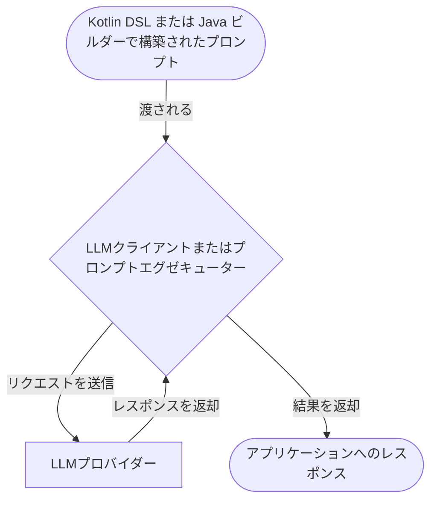
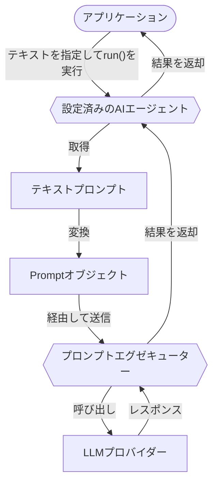

# プロンプト

プロンプトは、大規模言語モデル（LLM）がレスポンスを生成するための指示です。
プロンプトは、LLMとのインタラクションの内容と構造を定義します。
このセクションでは、Koogを使用してプロンプトを作成し、実行する方法について説明します。

## プロンプトの作成

Koogにおいて、プロンプトは以下のプロパティを持つ [**Prompt**](api:prompt-model::ai.koog.prompt.dsl.Prompt) データクラスのインスタンスです。

- `id`: プロンプトの一意の識別子。
- `messages`: LLMとの会話を表すメッセージのリスト。
- `params`: オプションの [LLM構成パラメータ](prompt-creation/index.md#prompt-parameters)（temperature、ツールの選択など）。

`Prompt` クラスを直接インスタンス化することもできますが、推奨されるプロンプトの作成方法は [Kotlin DSL](prompt-creation/index.md) または Java ビルダー API を使用することです。これにより、構造化された方法で会話を定義できます。

!!! note
    このページの Kotlin の例では Kotlin DSL を使用しています。Java の例では `Prompt.builder("id")` ビルダーを使用し、`system(...)`、`user(...)`、`assistant(...)`、`toolCall(...)`、`toolResult(...)`、および必要に応じて `withOutput(Foo.class)` などの明示的なメソッドを使用しています。

=== "Kotlin"

    <!--- INCLUDE
    import ai.koog.prompt.dsl.prompt
    -->
    ```kotlin
    val myPrompt = prompt("hello-koog") {
        system("You are a helpful assistant.")
        user("What is Koog?")
    }
    ```
    <!--- KNIT example-prompts-01.kt -->

=== "Java"

    <!--- INCLUDE
    /**
    -->
    <!--- SUFFIX
    **/
    -->
    ```java
    var myPrompt = Prompt.builder("hello-koog")
        .system("You are a helpful assistant.")
        .user("What is Koog?")
        .build();
    ```
    <!--- KNIT example-prompts-java-01.java -->

!!! note
    AIエージェントは、単純なテキストプロンプトを入力として受け取ることができます。
    エージェントはテキストプロンプトを自動的に Prompt オブジェクトに変換し、実行のためにLLMに送信します。
    これは、単一のリクエストを実行するだけでよく、複雑な会話ロジックを必要としない[基本的なエージェント](../agents/basic-agents.md)に役立ちます。

## プロンプトの実行

Koogは、LLMに対してプロンプトを実行するための2つの抽象化レベルを提供しています：LLMクライアントとプロンプトエグゼキューター（prompt executors）です。
どちらも Prompt オブジェクトを受け取り、AIエージェントなしでプロンプトを直接実行するために使用できます。
実行フローは、クライアントとエグゼキューターの両方で同じです。


```mermaid
flowchart TB
    A([Kotlin DSL または Java ビルダーで構築されたプロンプト])
    B{LLMクライアントまたはプロンプトエグゼキューター}
    C[LLMプロバイダー]
    D([アプリケーションへのレスポンス])

    A -->|"渡される"| B
    B -->|"リクエストを送信"| C
    C -->|"レスポンスを返却"| B
    B -->|"結果を返却"| D
```
<!--- KNIT example-prompts-01.txt -->

<div class="grid cards" markdown>

-   :material-arrow-right-bold:{ .lg .middle } [**LLMクライアント**](llm-clients.md)

    ---

    特定のLLMプロバイダーと直接やり取りするための低レベルインターフェースです。
    単一のプロバイダーを使用し、高度なライフサイクル管理を必要としない場合に使用します。

-   :material-swap-horizontal:{ .lg .middle } [**プロンプトエグゼキューター**](prompt-executors.md)

    ---

    1つまたは複数のLLMクライアントのライフサイクルを管理する高レベルの抽象化です。
    複数のプロバイダーにわたってプロンプトを実行するための統一APIが必要な場合や、動的な切り替え、フォールバックが必要な場合に使用します。

</div>

## パフォーマンスの最適化と失敗への対応

Koogでは、プロンプト実行時のパフォーマンスの最適化や失敗への対応が可能です。

<div class="grid cards" markdown>

-   :material-cached:{ .lg .middle } [**LLMレスポンスのキャッシュ**](llm-response-caching.md)

    ---

    LLMのレスポンスをキャッシュすることで、パフォーマンスを最適化し、繰り返されるリクエストのコストを削減します。

-   :material-shield-check:{ .lg .middle } [**失敗への対応**](handling-failures.md)

    ---

    アプリケーションに組み込みのリトライ、タイムアウト、その他のエラーハンドリングメカニズムを使用します。

</div>

## AIエージェントにおけるプロンプト

Koogでは、AIエージェントがライフサイクル全体を通じてプロンプトを維持・管理します。
LLMクライアントやエグゼキューターがプロンプトの実行に使用される一方で、エージェントはプロンプト更新のフローを処理し、会話履歴の関連性と一貫性を維持します。

エージェントにおけるプロンプトリサイクルには、通常、以下のいくつかのステージが含まれます。

1. 初期プロンプトの設定。
2. プロンプトの自動更新。
3. コンテキストウィンドウの管理。
4. 手動によるプロンプト管理。

### 初期プロンプトの設定

[エージェントを初期化](../quickstart.md#create-your-first-koog-agent)する際、エージェントの動作を規定する [システムメッセージ](prompt-creation/index.md#system-message) を定義できます。
その後、エージェントの `run()` メソッドを呼び出す際に、通常は初期の [ユーザーメッセージ](prompt-creation/index.md#user-messages) を入力として提供します。
これらのメッセージが組み合わさって、エージェントの初期プロンプトが形成されます。例：

=== "Kotlin"

    <!--- INCLUDE
    import ai.koog.agents.core.agent.AIAgent
    import ai.koog.prompt.executor.clients.openai.OpenAIModels
    import ai.koog.prompt.executor.llms.all.simpleOpenAIExecutor
    import kotlinx.coroutines.runBlocking
    val apiKey = System.getenv("OPENAI_API_KEY")
    fun main() = runBlocking {
    -->
    <!--- SUFFIX
    }
    -->
    ```kotlin
    // エージェントの作成
    val agent = AIAgent(
        promptExecutor = simpleOpenAIExecutor(apiKey),
        systemPrompt = "You are a helpful assistant.",
        llmModel = OpenAIModels.Chat.GPT4o
    )
    
    // エージェントの実行
    val result = agent.run("What is Koog?")
    ```
    <!--- KNIT example-prompts-02.kt -->

=== "Java"

    <!--- INCLUDE
    /**
    -->
    <!--- SUFFIX
    **/
    -->
    ```java
    AIAgent<String, String> agent = AIAgent.builder()
        .promptExecutor(simpleOpenAIExecutor(System.getenv("OPENAI_API_KEY")))
        .systemPrompt("You are a helpful assistant. Answer user questions concisely.")
        .llmModel(OpenAIModels.Chat.GPT4o)
        .build();

    var result = agent.run("What is Koog?");
    ```
    <!--- KNIT example-prompts-java-02.java -->

この例では、エージェントは自動的にテキストプロンプトを Prompt オブジェクトに変換し、それをプロンプトエグゼキューターに送信します。


```mermaid
flowchart TB
    A([アプリケーション])
    B{{設定済みのAIエージェント}}
    C["テキストプロンプト"]
    D["Promptオブジェクト"]
    E{{プロンプトエグゼキューター}}
    F[LLMプロバイダー]

    A -->|"テキストを指定してrun()を実行"| B
    B -->|"取得"| C
    C -->|"変換"| D
    D -->|"経由して送信"| E
    E -->|"呼び出し"| F
    F -->|"レスポンス"| E
    E -->|"結果を返却"| B
    B -->|"結果を返却"| A
```
<!--- KNIT example-prompts-02.txt -->

より高度な設定のために、[AIAgentConfig](api:agents-core::ai.koog.agents.core.agent.config.AIAgentConfig) を使用してエージェントの初期プロンプトを定義することもできます。

### プロンプトの自動更新

エージェントが戦略（strategy）を実行する際、[定義済みのノード](../nodes-and-components.md) が自動的にプロンプトを更新します。
例えば：

- [`nodeLLMRequest`](../nodes-and-components.md#nodellmrequest): ユーザーメッセージをプロンプトに追加し、LLMのレスポンスを取得します。
- [`nodeLLMSendToolResult`](../nodes-and-components.md#nodellmsendtoolresult): ツールの実行結果を会話に追加します。
- [`nodeAppendPrompt`](../nodes-and-components.md#nodeappendprompt): ワークフローの任意のポイントで特定のメッセージをプロンプトに挿入します。

### コンテキストウィンドウの管理

長時間のインタラクションでLLMのコンテキストウィンドウを超えないようにするために、エージェントは [履歴圧縮](../history-compression.md) 機能を使用できます。

### 手動によるプロンプト管理

複雑なワークフローの場合、[LLMセッション](../sessions.md) を使用して手動でプロンプトを管理できます。
エージェントの戦略やカスタムノード内では、`llm.writeSession` を使用して `Prompt` オブジェクトにアクセスし、変更を加えることができます。これにより、必要に応じてメッセージを追加、削除、または並べ替えることが可能になります。