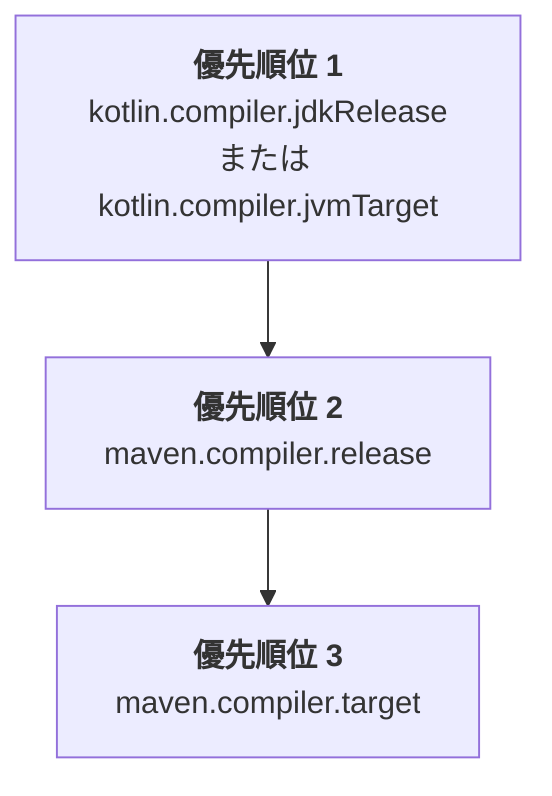

[//]: # (title: Mavenプロジェクトの設定)

既存のJava MavenプロジェクトにKotlinを導入する場合、または新しいKotlin Mavenプロジェクトを作成する場合、KotlinのソースとモジュールをコンパイルするKotlin Mavenプラグインを追加する必要があります。

現在、Maven v3のみがサポートされています。

## 自動設定

JavaとKotlinの混合プロジェクトおよび純粋なKotlinプロジェクトの両方で、`<extensions>`オプションを使用してMavenの設定を簡略化できます。このアプローチでは、Mavenコンパイラプラグイン（Maven compiler plugin）を設定する必要がないため、時間を節約できます。

`<extensions>`を使用してKotlin Mavenプラグインを適用するには、`pom.xml`ビルドファイルを次のように更新します。

1. `<properties>`セクションで、使用するKotlinのバージョンとJVMのターゲットバージョンを定義します。

   ```xml
   <properties>
       <maven.compiler.release>17</maven.compiler.release>
       <kotlin.version>%kotlinVersion%</kotlin.version>
   </properties>
   ```

2. `<build><plugins>`セクションで、`<extensions>`オプションを有効にしたKotlin Mavenプラグインを追加します。

   ```xml
   <build>
       <plugins>
           <!-- Kotlinコンパイラプラグインの設定 -->
           <plugin>
               <groupId>org.jetbrains.kotlin</groupId>
               <artifactId>kotlin-maven-plugin</artifactId>
               <version>${kotlin.version}</version>
               <extensions>true</extensions> <!-- 拡張機能を有効化 -->
           </plugin>
           <!-- extensionsを使用する場合、Mavenコンパイラプラグインの設定は不要 -->
       </plugins>
   </build>
   ```

`<extensions>`オプションは以下を行います：

* `src/main/kotlin`および`src/test/kotlin`ディレクトリが存在し、プラグイン設定で指定されていない場合に、それらをソースルートとして登録します。
* プロジェクトで[`kotlin-stdlib`への依存関係](maven-set-dependencies.md#dependency-on-the-standard-library)がまだ定義されていない場合に、それを追加します。
* `compile`、`test-compile`、`kapt`、`test-kapt`の実行（execution）をビルドに追加し、適切な[ライフサイクルフェーズ](https://maven.apache.org/guides/introduction/introduction-to-the-lifecycle.html)にバインドします。これにより、`kapt`、Kotlinの`compile`、およびJavaの`compile`の各実行が正しい順序で実行されるように、`<id>`や`<goals>`を含む`<executions>`セクションを手動で設定する必要がなくなります。
* [JVMターゲットバージョンを、プロジェクトで設定されたJavaコンパイラのバージョンと自動的に合わせます。](#jvmターゲットバージョン)
   
JavaとKotlinの混合プロジェクトの場合、この設定により以下が保証されます：

* Kotlinコードが最初にコンパイルされます。
* JavaコードはKotlinの後にコンパイルされ、Kotlinクラスを参照できます。
* デフォルトのMavenの挙動によってプラグインの順序が上書きされることはありません。

拡張機能の設定は`<executions>`セクション全体を置き換えます。実行（execution）を設定する必要がある場合は、[KotlinとJavaソースのコンパイル](#kotlinとjavaソースのコンパイル)の例を参照してください。

> 複数のビルドプラグインがデフォルトのライフサイクルを上書きしており、かつ`<extensions>`オプションも有効にしている場合、`<build>`セクション内の最後のプラグインがライフサイクル設定の優先権を持ちます。それ以前のライフサイクル設定への変更はすべて無視されます。
>
{style="note"}

### JVMターゲットバージョン

`<extensions>`オプションは、KotlinコンパイラとMavenコンパイラが同じバイトコードバージョンをターゲットにすることを保証します。

Kotlin Mavenプラグインは、以下の順序でJVMターゲットバージョンを自動的に解決します。



#### Kotlinコンパイラのバージョン

プロジェクトで `kotlin.compiler.jdkRelease` または `kotlin.compiler.jvmTarget` プロパティのいずれかが定義されている場合、その設定が優先されます。

これらのKotlinコンパイラオプションの挙動の違いに注意してください：

| Kotlinコンパイラオプション | 出力のバイトコードバージョンを制御する | APIを指定したJDKに制限する |
|------------------------------|-----------------------------------------|-----------------------------------------------------------------------------------------------|
| `kotlin.compiler.jvmTarget`  | はい | コード内のJDK APIに制限なし |
| `kotlin.compiler.jdkRelease` | はい | はい － 特定のAPIバージョンのみが許可される（Javaの `--release` コンパイラオプションと同等） |

> `kotlin.compiler.jdkRelease` と `kotlin.compiler.jvmTarget` に異なるJDKオプションを同時に設定しないでください。設定した場合、エラーが発生します。
>
{style="note"}

#### Mavenコンパイラのバージョン

* `kotlin.compiler.jdkRelease` と `kotlin.compiler.jvmTarget` のどちらのオプションも設定されていない場合、プラグインは `maven.compiler.release` のバージョンを採用します。

  `maven.compiler.release` バージョンは、プロジェクトのプロパティとして定義するか、`maven-compiler-plugin` の設定内で定義できます。
* Mavenの `release` バージョンが設定されていない場合、プラグインは `maven.compiler.target` のバージョンを採用します。

  これは、プロジェクトのプロパティとして定義するか、`maven-compiler-plugin` の設定内で定義できます。

Mavenコンパイラの `target` オプションと `release` オプションの挙動の違いに注意してください：

| Mavenコンパイラオプション | Kotlinの `jvmTarget` を設定する | Kotlinの `jdkRelease` を設定する | APIを指定したJDKに制限する |
|--------------------------|---------------------------|----------------------------|----------------------------------------------|
| `maven.compiler.target`  | はい | いいえ | いいえ － ビルドのJDKクラスパスは可視のまま |
| `maven.compiler.release` | はい | はい | はい － 特定のAPIバージョンのみに制限 |

> `<extensions>` オプションは、プロジェクトレベルのプロパティとグローバルな `maven-compiler-plugin` 設定のみをチェックします。プラグインの `<executions>` セクション内で定義された設定はチェックしません。
>
{style="note"}

### Mavenコンパイラのバージョン

現在、`<extensions>`で使用されるMavenコンパイラプラグインのデフォルトバージョンは **%mavenExtensionsVersion%** です。別のバージョンを個別に設定することもできます：

```xml
<build>
    <plugins>
        <!-- Kotlinコンパイラプラグインの設定 -->
        <plugin>
            <groupId>org.jetbrains.kotlin</groupId>
            <artifactId>kotlin-maven-plugin</artifactId>
            <version>${kotlin.version}</version>
            <extensions>true</extensions>
        </plugin>
        <!-- Javaクラス用のMavenコンパイラプラグインの設定 -->
        <plugin>
            <groupId>org.apache.maven.plugins</groupId>
            <artifactId>maven-compiler-plugin</artifactId>
            <version>%mavenPluginVersion%</version>
        </plugin>
    </plugins>
</build>
```

## 手動設定

Kotlin Mavenプラグインで`<extensions>`を有効にしない場合は、ソースコードが正しくコンパイルされるようにプロジェクトを手動で設定する必要があります。

Mavenプロジェクトを、[JavaとKotlinソースの組み合わせ](#kotlinとjavaソースのコンパイル)または[Kotlinのみのソース](#kotlinのみのソースのコンパイル)をコンパイルするように設定できます。

### KotlinとJavaソースのコンパイル

KotlinとJavaの両方のソースファイルがあるプロジェクトをコンパイルするには、Javaコンパイラの前にKotlinコンパイラが実行されるようにする必要があります。

Javaコンパイラは、Kotlinの宣言が`.class`ファイルにコンパイルされるまでそれらを認識できません。JavaコードでKotlinクラスを使用する場合、`cannot find symbol`エラーを避けるために、それらのクラスを先にコンパイルする必要があります。

Mavenは、主に次の2つの要因に基づいてプラグインの実行順序を決定します：

* `pom.xml`ファイル内でのプラグイン宣言の順序。
* `default-compile`や`default-testCompile`などの組み込みのデフォルト実行。これらは、`pom.xml`ファイル内での位置に関係なく、常にユーザー定義の実行よりも前に実行されます。

実行順序を制御するには：

* `maven-compiler-plugin`の前に`kotlin-maven-plugin`を宣言します。
* Javaコンパイラプラグインのデフォルトの実行を無効にします。
* コンパイルフェーズを明示的に制御するためにカスタム実行を追加します。

> デフォルトの実行を無効にするには、Mavenの特別なフェーズである`none`を使用できます。
>
{style="note"}

Kotlin Mavenプラグインを適用するには、`pom.xml`ビルドファイルを次のように更新します。

```xml
<build>
    <plugins>
        <!-- Kotlinコンパイラプラグインの設定 -->
        <plugin>
            <groupId>org.jetbrains.kotlin</groupId>
            <artifactId>kotlin-maven-plugin</artifactId>
            <version>${kotlin.version}</version>
            <executions>
                <execution>
                    <id>kotlin-compile</id>
                    <phase>compile</phase>
                    <goals>
                        <goal>compile</goal>
                    </goals>
                    <configuration>
                        <sourceDirs>
                            <sourceDir>src/main/kotlin</sourceDir>
                            <!-- KotlinコードがJavaコードを参照できるようにする -->
                            <sourceDir>src/main/java</sourceDir>
                        </sourceDirs>
                    </configuration>
                </execution>
                <execution>
                    <id>kotlin-test-compile</id>
                    <phase>test-compile</phase>
                    <goals>
                        <goal>test-compile</goal>
                    </goals>
                    <configuration>
                        <sourceDirs>
                            <sourceDir>src/test/kotlin</sourceDir>
                            <sourceDir>src/test/java</sourceDir>
                        </sourceDirs>
                    </configuration>
                </execution>
            </executions>
        </plugin>

        <!-- Mavenコンパイラプラグインの設定 -->
        <plugin>
            <groupId>org.apache.maven.plugins</groupId>
            <artifactId>maven-compiler-plugin</artifactId>
            <version>3.15.0</version>
            <executions>
                <!-- デフォルトの実行を無効化 -->
                <execution>
                    <id>default-compile</id>
                    <phase>none</phase>
                </execution>
                <execution>
                    <id>default-testCompile</id>
                    <phase>none</phase>
                </execution>

                <!-- カスタム実行を定義 -->
                <execution>
                    <id>java-compile</id>
                    <phase>compile</phase>
                    <goals>
                        <goal>compile</goal>
                    </goals>
                </execution>
                <execution>
                    <id>java-test-compile</id>
                    <phase>test-compile</phase>
                    <goals>
                        <goal>testCompile</goal>
                    </goals>
                </execution>
            </executions>
        </plugin>
    </plugins>
</build>
```

この設定により、以下が保証されます：

* Kotlinコードが最初にコンパイルされます。
* JavaコードはKotlinの後にコンパイルされ、Kotlinクラスを参照できます。
* デフォルトのMavenの挙動によってプラグインの順序が上書きされることはありません。

Mavenがプラグインの実行をどのように処理するかについての詳細は、Maven公式ドキュメントの[Guide to default plugin execution IDs](https://maven.apache.org/guides/mini/guide-default-execution-ids.html)を参照してください。

### Kotlinのみのソースのコンパイル

Kotlinソースファイルのみのプロジェクトをコンパイルするには、ソースルートを宣言し、Kotlin Mavenプラグインを設定します。

1. `<build>`セクションでソースディレクトリを指定します。

    ```xml
    <build>
        <sourceDirectory>src/main/kotlin</sourceDirectory>
        <testSourceDirectory>src/test/kotlin</testSourceDirectory>
    </build>
    ```

2. Kotlin Mavenプラグインが適用されていることを確認します。

    ```xml
    <build>
        <plugins>
            <plugin>
                <groupId>org.jetbrains.kotlin</groupId>
                <artifactId>kotlin-maven-plugin</artifactId>
                <version>${kotlin.version}</version>
                <executions>
                    <execution>
                        <id>compile</id>
                        <goals>
                            <goal>compile</goal>
                        </goals>
                    </execution>
                    <execution>
                        <id>test-compile</id>
                        <goals>
                            <goal>test-compile</goal>
                        </goals>
                    </execution>
                </executions>
            </plugin>
        </plugins>
    </build>
    ```

### JDKバージョンの設定

Kotlinは、ビルドでのJDKバージョンの管理に役立つ [Mavenツールチェーン (Maven Toolchains)](https://maven.apache.org/guides/mini/guide-using-toolchains.html) をサポートしています。

ビルドで `maven-toolchains-plugin` を設定すると、Mavenを実行しているJVMのバージョン（`JAVA_HOME` パスで設定されたもの）とは無関係に、Kotlinのコンパイルに使用するJDKバージョンを指定できます。Kotlin Mavenプラグインは、選択されたJDKツールチェーンを自動的に取得します。

これにより、Kotlinのコンパイルを含む、ビルド内のすべてのプラグインで使用されるJDKを制御する単一のツールチェーンを構成できます。例えば：

```xml
<plugin>
    <groupId>org.apache.maven.plugins</groupId>
    <artifactId>maven-toolchains-plugin</artifactId>
    <version>3.2.0</version>
    <executions>
        <execution>
            <goals>
                <goal>toolchain</goal>
            </goals>
        </execution>
    </executions>
    <configuration>
        <toolchains>
            <jdk>
                <version>21</version>
            </jdk>
        </toolchains>
    </configuration>
</plugin>
```

JDKバージョンを設定するさまざまな方法の優先順位に注意してください：

```Mermaid
graph TD
    A["<b>優先順位 1</b><br/>kotlin-maven-plugin の jdkHome オプション"]
    B["<b>優先順位 2</b><br/>maven-toolchains-plugin で設定された<br/>JDKバージョン"]
    C["<b>優先順位 3</b><br/>JAVA_HOME のバージョン"]

    A --> B
    B --> C
```

* `kotlin-maven-plugin` 設定の `jdkHome` オプションで設定されたJDKバージョンは、常にツールチェーンのバージョンよりも優先されます。
* `maven-toolchains-plugin` のJDKバージョンは、`JAVA_HOME` パスで設定されたJDKバージョンを上書きします。

また、プラグイン固有の `<jdkToolchain>` オプションを使用して、`kotlin-maven-plugin` のツールチェーンでJDKバージョンを直接設定することもできます。`maven-toolchains-plugin` を使用する場合と比較して、このパラメータはKotlinのコンパイルにのみ影響し、ビルド内の他のプラグインには影響しません。

> 現在、特定のJDKバージョンを使用するように `maven-toolchains-plugin` を設定しても、`kotlin-maven-plugin` の [`kapt` および `test-kapt` ゴールには影響しません](https://youtrack.jetbrains.com/issue/KT-79897)。代わりに、`JAVA_HOME` パスに必要なバージョンを設定してください。
>
{style="note"}

#### JDK 17 の使用

JDK 17を使用するには、`.mvn/jvm.config` ファイルに以下を追加します：

```none
--add-opens=java.base/java.lang=ALL-UNNAMED
--add-opens=java.base/java.io=ALL-UNNAMED
```

## 次のステップ

[Kotlin Mavenプロジェクトでの依存関係の設定](maven-set-dependencies.md)