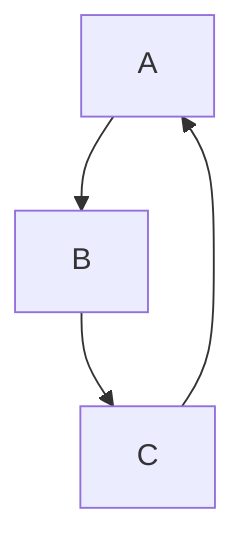
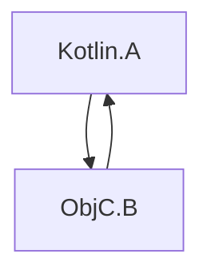

[//]: # (title: Swift/Objective-C ARCとの統合)

KotlinとObjective-Cは異なるメモリ管理戦略を使用しています。Kotlinはトレース型ガベージコレクターを持ち、
Objective-Cは自動参照カウント (ARC) に依存しています。

これらの戦略間の統合は通常シームレスであり、一般に追加の作業は必要ありません。
ただし、いくつかの留意すべき点があります。

## スレッド

### デイニシャライザ

Swift/Objective-Cオブジェクト、およびそれらが参照するオブジェクトのデイニシャライズは、
これらのオブジェクトがメインスレッドでKotlinに渡された場合、メインスレッドで呼び出されます。例：

```kotlin
// Kotlin
class KotlinExample {
    fun action(arg: Any) {
        println(arg)
    }
}
```

```swift
// Swift
class SwiftExample {
    init() {
        print("init on \(Thread.current)")
    }

    deinit {
        print("deinit on \(Thread.current)")
    }
}

func test() {
    KotlinExample().action(arg: SwiftExample())
}
```

結果の出力：

```text
init on <_NSMainThread: 0x600003bc0000>{number = 1, name = main}
shared.SwiftExample
deinit on <_NSMainThread: 0x600003bc0000>{number = 1, name = main}
```

Swift/Objective-Cオブジェクトのデイニシャライズは、代わりに特別なGCスレッドで呼び出されます。以下の条件の場合です。

*   Swift/Objective-Cオブジェクトがメインスレッド以外のスレッドでKotlinに渡された場合。
*   メインのディスパッチキューが処理されていない場合。

特別なGCスレッドでデイニシャライズを明示的に呼び出したい場合は、
`gradle.properties`で`kotlin.native.binary.objcDisposeOnMain=false`を設定します。このオプションは、
Swift/Objective-CオブジェクトがメインスレッドでKotlinに渡された場合でも、特別なGCスレッドでのデイニシャライズを有効にします。

特別なGCスレッドはObjective-Cランタイムに準拠しており、これはランループを持ち、
オートリリースプールをドレインすることを意味します。

### 完了ハンドラ

Kotlinのsuspend関数をSwiftから呼び出す際、完了ハンドラはメインスレッド以外のスレッドで呼び出されることがあります。例：

```kotlin
// Kotlin
// coroutineScope, launch, and delay are from kotlinx.coroutines
suspend fun asyncFunctionExample() = coroutineScope {
    launch {
        delay(1000L)
        println("World!")
    }
    println("Hello")
}
```

```swift
// Swift
func test() {
    print("Running test on \(Thread.current)")
    PlatformKt.asyncFunctionExample(completionHandler: { _ in
        print("Running completion handler on \(Thread.current)")
    })
}
```

結果の出力：

```text
Running test on <_NSMainThread: 0x600001b100c0>{number = 1, name = main}
Hello
World!
Running completion handler on <NSThread: 0x600001b45bc0>{number = 7, name = (null)}
```

## ガベージコレクションとライフサイクル

### オブジェクトの回収

オブジェクトはガベージコレクション中にのみ回収されます。これは、相互運用境界を越えてKotlin/Nativeに入るSwift/Objective-Cオブジェクトにも当てはまります。例：

```kotlin
// Kotlin
class KotlinExample {
    fun action(arg: Any) {
        println(arg)
    }
}
```

```swift
// Swift
class SwiftExample {
    deinit {
        print("SwiftExample deinit")
    }
}

func test() {
    swiftTest()
    kotlinTest()
}

func swiftTest() {
    print(SwiftExample())
    print("swiftTestFinished")
}

func kotlinTest() {
    KotlinExample().action(arg: SwiftExample())
    print("kotlinTest finished")
}
```

結果の出力：

```text
shared.SwiftExample
SwiftExample deinit
swiftTestFinished
shared.SwiftExample
kotlinTest finished
SwiftExample deinit
```

### Objective-Cオブジェクトのライフサイクル

Objective-Cオブジェクトは必要以上に長く存続する可能性があり、これがパフォーマンスの問題を引き起こすことがあります。たとえば、
長いループが各イテレーションでSwift/Objective-C相互運用境界を越えるいくつかの一時オブジェクトを作成する場合などです。

[GCログ](native-memory-manager.md#monitor-gc-performance)には、ルートセット内の安定参照の数が表示されます。
この数が増え続ける場合、Swift/Objective-Cオブジェクトが解放されるべき時に解放されていないことを示す可能性があります。
この場合、相互運用呼び出しを行うループ本体の周りに`autoreleasepool`ブロックを試してください。

```kotlin
// Kotlin
fun growingMemoryUsage() {
    repeat(Int.MAX_VALUE) {
        NSLog("$it
")
    }
}

fun steadyMemoryUsage() {
    repeat(Int.MAX_VALUE) {
        autoreleasepool {
            NSLog("$it
")
        }
    }
}
```

### SwiftとKotlinオブジェクトチェーンのガベージコレクション

次の例を考えてみましょう。

```kotlin
// Kotlin
interface Storage {
    fun store(arg: Any)
}

class KotlinStorage(var field: Any? = null) : Storage {
    override fun store(arg: Any) {
        field = arg
    }
}

class KotlinExample {
    fun action(firstSwiftStorage: Storage, secondSwiftStorage: Storage) {
        // Here, we create the following chain:
        // firstKotlinStorage -> firstSwiftStorage -> secondKotlinStorage -> secondSwiftStorage.
        val firstKotlinStorage = KotlinStorage()
        firstKotlinStorage.store(firstSwiftStorage)
        val secondKotlinStorage = KotlinStorage()
        firstSwiftStorage.store(secondKotlinStorage)
        secondKotlinStorage.store(secondSwiftStorage)
    }
}
```

```swift
// Swift
class SwiftStorage : Storage {

    let name: String

    var field: Any? = nil

    init(_ name: String) {
        self.name = name
    }

    func store(arg: Any) {
        field = arg
    }

    deinit {
        print("deinit SwiftStorage \(name)")
    }
}

func test() {
    KotlinExample().action(
        firstSwiftStorage: SwiftStorage("first"),
        secondSwiftStorage: SwiftStorage("second")
    )
}
```

ログに「deinit SwiftStorage first」と「deinit SwiftStorage second」のメッセージが表示されるまでには時間がかかります。
その理由は、`firstKotlinStorage`と`secondKotlinStorage`が異なるGCサイクルで収集されるためです。
イベントのシーケンスは次のとおりです。

1.  `KotlinExample.action`が完了します。`firstKotlinStorage`は何にも参照されていないため「デッド」と見なされますが、
    `secondKotlinStorage`は`firstSwiftStorage`によって参照されているため「デッド」ではありません。
2.  最初のGCサイクルが開始され、`firstKotlinStorage`が収集されます。
3.  `firstSwiftStorage`への参照がないため、これも「デッド」となり、`deinit`が呼び出されます。
4.  2番目のGCサイクルが開始されます。`firstSwiftStorage`が`secondKotlinStorage`を参照しなくなったため、`secondKotlinStorage`が収集されます。
5.  `secondSwiftStorage`が最終的に回収されます。

SwiftおよびObjective-CオブジェクトのデイニシャライズがGCサイクルの後に発生するため、これら4つのオブジェクトを収集するには2つのGCサイクルが必要です。この制限は、`deinit`が任意のコードを呼び出すことができることに起因しており、これにはGCポーズ中に実行できないKotlinコードも含まれます。

### 循環参照 (Retain cycles)

_循環参照_では、複数のオブジェクトが強参照を使用して循環的に互いを参照します。



Kotlinのトレース型GCとObjective-CのARCは、循環参照の扱いが異なります。到達不能になったオブジェクトについて、KotlinのGCは適切にそのようなサイクルを回収できますが、Objective-CのARCはできません。したがって、Kotlinオブジェクトの循環参照は回収できますが、[Swift/Objective-Cオブジェクトの循環参照は回収できません](https://docs.swift.org/swift-book/documentation/the-swift-programming-language/automaticreferencecounting/#Strong-Reference-Cycles-Between-Class-Instances)。

循環参照がObjective-CオブジェクトとKotlinオブジェクトの両方を含む場合を考えてみましょう。



これは、KotlinとObjective-Cのメモリ管理モデルを組み合わせることを含み、それらが連携して循環参照を処理（回収）することはできません。つまり、少なくとも1つのObjective-Cオブジェクトが存在する場合、オブジェクトグラフ全体の循環参照は回収できず、Kotlin側からサイクルを破ることは不可能です。

残念ながら、Kotlin/Nativeコードでの循環参照を自動的に検出するための特別なツールは現在利用できません。
循環参照を避けるには、[弱参照または非所有参照](https://docs.swift.org/swift-book/documentation/the-swift-programming-language/automaticreferencecounting/#Resolving-Strong-Reference-Cycles-Between-Class-Instances)を使用してください。

## バックグラウンド状態とApp Extensionのサポート

現在のメモリマネージャーは、デフォルトではアプリケーションの状態を追跡せず、[App Extension](https://developer.apple.com/app-extensions/)とそのままでは統合されていません。

これは、メモリマネージャーがGCの動作を適切に調整しないことを意味し、場合によっては有害になることがあります。この動作を変更するには、`gradle.properties`に次の[実験的 (Experimental)](components-stability.md)バイナリオプションを追加します。

```none
kotlin.native.binary.appStateTracking=enabled
```

これにより、アプリケーションがバックグラウンドにある場合、タイマーベースのガベージコレクターの呼び出しがオフになり、メモリ消費量が過度に高くなった場合にのみGCが呼び出されるようになります。

## 次のステップ

[Swift/Objective-Cの相互運用性](native-objc-interop.md)について、さらに詳しく学んでください。