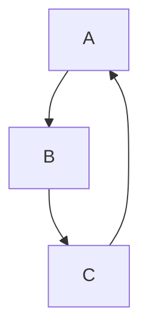
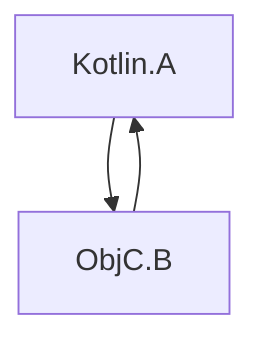

[//]: # (title: Swift/Objective-C ARCとの統合)

KotlinとObjective-Cは異なるメモリ管理戦略を使用します。Kotlinはトラシングガベージコレクターを備えていますが、Objective-Cは自動参照カウント (ARC) に依存しています。

これらの戦略間の統合は通常シームレスであり、一般的に追加の作業は不要です。しかし、留意すべきいくつかの具体的な点があります。

## スレッド

### デイニシャライザー

Swift/Objective-C オブジェクトおよびそれらが参照するオブジェクトのデイニシャライズは、これらのオブジェクトがメインスレッドでKotlinに渡された場合、メインスレッドで呼び出されます。例：

```kotlin
// Kotlin
class KotlinExample {
    fun action(arg: Any) {
        println(arg)
    }
}
```

```swift
// Swift
class SwiftExample {
    init() {
        print("init on \(Thread.current)")
    }

    deinit {
        print("deinit on \(Thread.current)")
    }
}

func test() {
    KotlinExample().action(arg: SwiftExample())
}
```

結果の出力：

```text
init on <_NSMainThread: 0x600003bc0000>{number = 1, name = main}
shared.SwiftExample
deinit on <_NSMainThread: 0x600003bc0000>{number = 1, name = main}
```

Swift/Objective-C オブジェクトのデイニシャライズは、メインスレッドではなく特別なGCスレッドで呼び出されます。以下のいずれかの条件に該当する場合です。

*   Swift/Objective-C オブジェクトがメインスレッド以外のスレッドでKotlinに渡された場合。
*   メインディスパッチキューが処理されない場合。

特別なGCスレッドでデイニシャライズを明示的に呼び出したい場合は、`gradle.properties`ファイルで`kotlin.native.binary.objcDisposeOnMain=false`を設定してください。このオプションは、Swift/Objective-C オブジェクトがメインスレッドでKotlinに渡された場合でも、特別なGCスレッドでのデイニシャライズを有効にします。

特別なGCスレッドはObjective-Cランタイムに準拠しており、実行ループを持ち、オートリリースプールをドレインします。

### 完了ハンドラー

SwiftからKotlinのサスペンド関数を呼び出す際、完了ハンドラーはメインスレッド以外のスレッドで呼び出される場合があります。例：

```kotlin
// Kotlin
// coroutineScope, launch, and delay are from kotlinx.coroutines
suspend fun asyncFunctionExample() = coroutineScope {
    launch {
        delay(1000L)
        println("World!")
    }
    println("Hello")
}
```

```swift
// Swift
func test() {
    print("Running test on \(Thread.current)")
    PlatformKt.asyncFunctionExample(completionHandler: { _ in
        print("Running completion handler on \(Thread.current)")
    })
}
```

結果の出力：

```text
Running test on <_NSMainThread: 0x600001b100c0>{number = 1, name = main}
Hello
World!
Running completion handler on <NSThread: 0x600001b45bc0>{number = 7, name = (null)}
```

## ガベージコレクションとライフサイクル

### オブジェクトの再利用

オブジェクトはガベージコレクション中にのみ再利用されます。これは、相互運用境界を越えてKotlin/Nativeに入るSwift/Objective-Cオブジェクトにも適用されます。例：

```kotlin
// Kotlin
class KotlinExample {
    fun action(arg: Any) {
        println(arg)
    }
}
```

```swift
// Swift
class SwiftExample {
    deinit {
        print("SwiftExample deinit")
    }
}

func test() {
    swiftTest()
    kotlinTest()
}

func swiftTest() {
    print(SwiftExample())
    print("swiftTestFinished")
}

func kotlinTest() {
    KotlinExample().action(arg: SwiftExample())
    print("kotlinTest finished")
}
```

結果の出力：

```text
shared.SwiftExample
SwiftExample deinit
swiftTestFinished
shared.SwiftExample
kotlinTest finished
SwiftExample deinit
```

### Objective-Cオブジェクトのライフサイクル

Objective-Cオブジェクトは、必要以上に長く存続する可能性があり、これがパフォーマンスの問題を引き起こすことがあります。例えば、長時間のループが、各イテレーションでSwift/Objective-Cの相互運用境界を越える一時的なオブジェクトを多数作成する場合などです。

[GCログ](native-memory-manager.md#monitor-gc-performance)には、ルートセット内の安定参照の数が表示されます。この数が継続的に増加する場合、Swift/Objective-Cオブジェクトが本来解放されるべき時に解放されていないことを示している可能性があります。この場合、相互運用呼び出しを行うループ本体の周囲に`autoreleasepool`ブロックを試してみてください。

```kotlin
// Kotlin
fun growingMemoryUsage() {
    repeat(Int.MAX_VALUE) {
        NSLog("$it
")
    }
}

fun steadyMemoryUsage() {
    repeat(Int.MAX_VALUE) {
        autoreleasepool {
            NSLog("$it
")
        }
    }
}
```

### SwiftとKotlinオブジェクトのチェインのガベージコレクション

次の例を考えてみましょう。

```kotlin
// Kotlin
interface Storage {
    fun store(arg: Any)
}

class KotlinStorage(var field: Any? = null) : Storage {
    override fun store(arg: Any) {
        field = arg
    }
}

class KotlinExample {
    fun action(firstSwiftStorage: Storage, secondSwiftStorage: Storage) {
        // Here, we create the following chain:
        // firstKotlinStorage -> firstSwiftStorage -> secondKotlinStorage -> secondSwiftStorage.
        val firstKotlinStorage = KotlinStorage()
        firstKotlinStorage.store(firstSwiftStorage)
        val secondKotlinStorage = KotlinStorage()
        firstSwiftStorage.store(secondKotlinStorage)
        secondKotlinStorage.store(secondSwiftStorage)
    }
}
```

```swift
// Swift
class SwiftStorage : Storage {

    let name: String

    var field: Any? = nil

    init(_ name: String) {
        self.name = name
    }

    func store(arg: Any) {
        field = arg
    }

    deinit {
        print("deinit SwiftStorage \(name)")
    }
}

func test() {
    KotlinExample().action(
        firstSwiftStorage: SwiftStorage("first"),
        secondSwiftStorage: SwiftStorage("second")
    )
}
```

ログに"deinit SwiftStorage first"と"deinit SwiftStorage second"のメッセージが表示されるまでには、ある程度の時間がかかります。その理由は、`firstKotlinStorage`と`secondKotlinStorage`が異なるGCサイクルで回収されるためです。イベントのシーケンスは次のとおりです。

1.  `KotlinExample.action`が終了します。`firstKotlinStorage`は何も参照されていないため「デッド」と見なされますが、`secondKotlinStorage`は`firstSwiftStorage`によって参照されているため「デッド」ではありません。
2.  最初のGCサイクルが開始され、`firstKotlinStorage`が回収されます。
3.  `firstSwiftStorage`への参照がなくなるため、これも「デッド」となり、`deinit`が呼び出されます。
4.  2番目のGCサイクルが開始されます。`firstSwiftStorage`が`secondKotlinStorage`を参照しなくなったため、`secondKotlinStorage`が回収されます。
5.  最後に`secondSwiftStorage`が再利用されます。

SwiftおよびObjective-CオブジェクトのデイニシャライズがGCサイクルの後に発生するため、これら4つのオブジェクトを回収するには2つのGCサイクルが必要です。この制限は、任意のコード（GC一時停止中に実行できないKotlinコードを含む）を呼び出すことができる`deinit`に起因します。

### 参照サイクル

_参照サイクル_では、複数のオブジェクトが強参照を使用して循環的に互いを参照します。



KotlinのトラシングGCとObjective-CのARCは、参照サイクルを異なる方法で処理します。オブジェクトが到達不能になった場合、KotlinのGCはそのようなサイクルを適切に回収できますが、Objective-CのARCはできません。したがって、Kotlinオブジェクトの参照サイクルは回収できますが、[Swift/Objective-Cオブジェクトの参照サイクルは回収できません](https://docs.swift.org/swift-book/documentation/the-swift-programming-language/automaticreferencecounting/#Strong-Reference-Cycles-Between-Class-Instances)。

参照サイクルにObjective-CオブジェクトとKotlinオブジェクトの両方が含まれるケースを考えてみましょう。



これは、参照サイクルを一緒に処理（回収）できないKotlinとObjective-Cのメモリ管理モデルを組み合わせることを意味します。つまり、Objective-Cオブジェクトが少なくとも1つ存在する場合、オブジェクトグラフ全体の参照サイクルは回収できず、Kotlin側からサイクルを破ることは不可能です。

残念ながら、Kotlin/Nativeコードで参照サイクルを自動的に検出するための特別なツールは現在ありません。参照サイクルを回避するには、[weakまたはunowned参照](https://docs.swift.org/swift-book/documentation/the-swift-programming-language/automaticreferencecounting/#Resolving-Strong-Reference-Cycles-Between-Class-Instances)を使用してください。

## バックグラウンド状態とApp Extensionsのサポート

現在のメモリマネージャーは、デフォルトではアプリケーションの状態を追跡せず、[App Extensions](https://developer.apple.com/app-extensions/)とそのままでは統合されません。

これは、メモリマネージャーがGCの動作をそれに応じて調整しないことを意味し、場合によっては有害となる可能性があります。この動作を変更するには、次の[実験的な (Experimental)](components-stability.md)バイナリオプションを`gradle.properties`に追加してください。

```none
kotlin.native.binary.appStateTracking=enabled
```

これにより、アプリケーションがバックグラウンドにある場合のタイマーベースのガベージコレクターの呼び出しがオフになり、メモリ消費量が過度に高くなった場合にのみGCが呼び出されるようになります。

## 次のステップ

[Swift/Objective-Cの相互運用](native-objc-interop.md)についてさらに詳しく学びましょう。