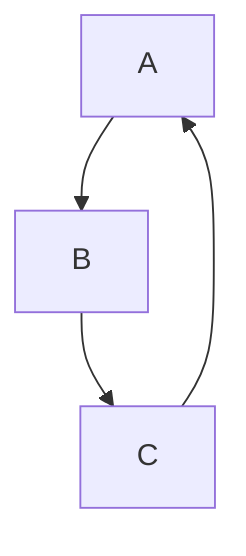
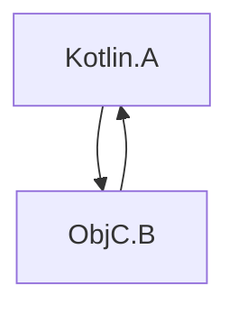

[//]: # (title: Swift/Objective-C ARCとの統合)

KotlinとObjective-Cでは、異なるメモリ管理戦略が使用されています。Kotlinにはトレーシングガベージコレクタ（tracing garbage collector）があり、Objective-Cは自動参照カウンティング（ARC）に依存しています。

これらの戦略間の統合は通常シームレスであり、一般的に追加の作業は必要ありません。ただし、留意すべき点がいくつかあります。

## スレッド

### デイニシャライザ

Swift/Objective-Cオブジェクト、およびそれらが参照するオブジェクトがメインスレッドでKotlinに渡された場合、それらのオブジェクトのデイニシャライゼーション（deinitialization）はメインスレッドで呼び出されます。例：

```kotlin
// Kotlin
class KotlinExample {
    fun action(arg: Any) {
        println(arg)
    }
}
```

```swift
// Swift
class SwiftExample {
    init() {
        print("init on \(Thread.current)")
    }

    deinit {
        print("deinit on \(Thread.current)")
    }
}

func test() {
    KotlinExample().action(arg: SwiftExample())
}
```

結果の出力：

```text
init on <_NSMainThread: 0x600003bc0000>{number = 1, name = main}
shared.SwiftExample
deinit on <_NSMainThread: 0x600003bc0000>{number = 1, name = main}
```

以下の場合、Swift/Objective-Cオブジェクトのデイニシャライゼーションは、メインスレッドではなく専用のGCスレッドで呼び出されます。

* Swift/Objective-Cオブジェクトが、メインスレッド以外のスレッドでKotlinに渡された場合。
* メインのディスパッチキュー（dispatch queue）が処理されていない場合。

明示的に専用のGCスレッドでデイニシャライゼーションを呼び出したい場合は、`gradle.properties` で `kotlin.native.binary.objcDisposeOnMain=false` を設定してください。このオプションを有効にすると、Swift/Objective-CオブジェクトがメインスレッドでKotlinに渡された場合でも、専用のGCスレッドでデイニシャライゼーションが行われるようになります。

専用のGCスレッドはObjective-Cランタイムに準拠しており、ランループ（run loop）を持ち、オートリリースプール（autorelease pool）をドレイン（解放）します。

### コンプリーションハンドラ

SwiftからKotlinの中断関数（suspending functions）を呼び出す際、コンプリーションハンドラ（completion handlers）がメイン以外のスレッドで呼び出されることがあります。例：

```kotlin
// Kotlin
// coroutineScope, launch, および delay は kotlinx.coroutines のものです
suspend fun asyncFunctionExample() = coroutineScope {
    launch {
        delay(1000L)
        println("World!")
    }
    println("Hello")
}
```

```swift
// Swift
func test() {
    print("Running test on \(Thread.current)")
    PlatformKt.asyncFunctionExample(completionHandler: { _ in
        print("Running completion handler on \(Thread.current)")
    })
}
```

結果の出力：

```text
Running test on <_NSMainThread: 0x600001b100c0>{number = 1, name = main}
Hello
World!
Running completion handler on <NSThread: 0x600001b45bc0>{number = 7, name = (null)}
```

## ガベージコレクションとライフサイクル

### オブジェクトの回収

オブジェクトはガベージコレクション中にのみ回収されます。これは、Kotlin/Nativeとの相互運用（インターオプ）の境界を越えるSwift/Objective-Cオブジェクトにも適用されます。例：

```kotlin
// Kotlin
class KotlinExample {
    fun action(arg: Any) {
        println(arg)
    }
}
```

```swift
// Swift
class SwiftExample {
    deinit {
        print("SwiftExample deinit")
    }
}

func test() {
    swiftTest()
    kotlinTest()
}

func swiftTest() {
    print(SwiftExample())
    print("swiftTestFinished")
}

func kotlinTest() {
    KotlinExample().action(arg: SwiftExample())
    print("kotlinTest finished")
}
```

結果の出力：

```text
shared.SwiftExample
SwiftExample deinit
swiftTestFinished
shared.SwiftExample
kotlinTest finished
SwiftExample deinit
```

### Objective-Cオブジェクトのライフサイクル

Objective-Cオブジェクトが本来よりも長く生存し、パフォーマンスの問題を引き起こすことがあります。例えば、長時間実行されるループ内で、イテレーションごとにSwift/Objective-Cの相互運用の境界を越える一時的なオブジェクトが複数作成される場合などです。

[GCログ](native-memory-manager.md#monitor-gc-performance)には、ルートセット内の stable ref の数が表示されます。この数が増え続けている場合、Swift/Objective-Cオブジェクトが適切なタイミングで解放されていない可能性があります。その場合は、相互運用呼び出しを行うループ本体を `autoreleasepool` ブロックで囲んでみてください：

```kotlin
// Kotlin
fun growingMemoryUsage() {
    repeat(Int.MAX_VALUE) {
        NSLog("$it
")
    }
}

fun steadyMemoryUsage() {
    repeat(Int.MAX_VALUE) {
        autoreleasepool {
            NSLog("$it
")
        }
    }
}
```

### SwiftおよびKotlinオブジェクトのチェーンのガベージコレクション

以下の例を考えてみましょう。

```kotlin
// Kotlin
interface Storage {
    fun store(arg: Any)
}

class KotlinStorage(var field: Any? = null) : Storage {
    override fun store(arg: Any) {
        field = arg
    }
}

class KotlinExample {
    fun action(firstSwiftStorage: Storage, secondSwiftStorage: Storage) {
        // ここで、以下のチェーンを作成します：
        // firstKotlinStorage -> firstSwiftStorage -> secondKotlinStorage -> secondSwiftStorage.
        val firstKotlinStorage = KotlinStorage()
        firstKotlinStorage.store(firstSwiftStorage)
        val secondKotlinStorage = KotlinStorage()
        firstSwiftStorage.store(secondKotlinStorage)
        secondKotlinStorage.store(secondSwiftStorage)
    }
}
```

```swift
// Swift
class SwiftStorage : Storage {

    let name: String

    var field: Any? = nil

    init(_ name: String) {
        self.name = name
    }

    func store(arg: Any) {
        field = arg
    }

    deinit {
        print("deinit SwiftStorage \(name)")
    }
}

func test() {
    KotlinExample().action(
        firstSwiftStorage: SwiftStorage("first"),
        secondSwiftStorage: SwiftStorage("second")
    )
}
```

ログに "deinit SwiftStorage first" と "deinit SwiftStorage second" のメッセージが表示されるまでには、少し時間がかかります。その理由は、`firstKotlinStorage` と `secondKotlinStorage` が異なるGCサイクルで回収されるためです。イベントの順序は以下の通りです：

1. `KotlinExample.action` が終了します。`firstKotlinStorage` はどこからも参照されていないため「デッド（回収可能）」と見なされますが、`secondKotlinStorage` は `firstSwiftStorage` から参照されているため、デッドとは見なされません。
2. 最初のGCサイクルが開始され、`firstKotlinStorage` が回収されます。
3. これにより `firstSwiftStorage` への参照がなくなり、これも「デッド」となり、`deinit` が呼び出されます。
4. 2回目のGCサイクルが開始されます。`firstSwiftStorage` が参照しなくなったため、`secondKotlinStorage` が回収されます。
5. 最終的に `secondSwiftStorage` が回収されます。

SwiftおよびObjective-CオブジェクトのデイニシャライゼーションはGCサイクルの後に行われるため、これら4つのオブジェクトを回収するには2回のGCサイクルが必要になります。この制限は `deinit` に由来します。`deinit` は任意のコードを呼び出すことができ、その中にはGCポーズ（GC pause）中に実行できないKotlinコードも含まれる可能性があるためです。

### 循環参照（Retain cycles）

「循環参照（retain cycle）」では、複数のオブジェクトが強参照を使用して互いに巡回するように参照し合います：


```mermaid
graph TD
    A --> B
    B --> C
    C --> A
```

KotlinのトレーシングGCとObjective-CのARCでは、循環参照の扱いが異なります。オブジェクトが到達不能になったとき、KotlinのGCはこのような循環を適切に回収できますが、Objective-CのARCは回収できません。したがって、Kotlinオブジェクトのみの循環参照は回収できますが、[Swift/Objective-Cオブジェクトの循環参照は回収できません](https://docs.swift.org/swift-book/documentation/the-swift-programming-language/automaticreferencecounting/#Strong-Reference-Cycles-Between-Class-Instances)。

循環参照にObjective-CオブジェクトとKotlinオブジェクトの両方が含まれる場合を考えてみましょう：


```mermaid
graph TD
    Kotlin.A --> ObjC.B
    ObjC.B --> Kotlin.A
```

これには、循環参照を一緒に処理（回収）できないKotlinとObjective-Cのメモリ管理モデルの組み合わせが含まれます。つまり、少なくとも1つのObjective-Cオブジェクトが存在する場合、オブジェクトグラフ全体の循環参照を回収することはできず、Kotlin側からその循環を断ち切ることも不可能です。

残念ながら、現在Kotlin/Nativeコードで循環参照を自動的に検出するための特別なツールは提供されていません。循環参照を避けるには、[弱参照（weak reference）または非所有参照（unowned reference）](https://docs.swift.org/swift-book/documentation/the-swift-programming-language/automaticreferencecounting/#Resolving-Strong-Reference-Cycles-Between-Class-Instances)を使用してください。

## バックグラウンド状態とApp Extensionsのサポート

現在のメモリマネージャーは、デフォルトではアプリケーションの状態を追跡せず、[App Extensions](https://developer.apple.com/app-extensions/)とも標準では統合されていません。

これは、メモリマネージャーがアプリケーションの状態に応じてGCの動作を調整しないことを意味し、場合によっては悪影響を及ぼす可能性があります。この動作を変更するには、以下の[実験的（Experimental）](components-stability.md)なバイナリオプションを `gradle.properties` に追加してください：

```none
kotlin.native.binary.appStateTracking=enabled
```

これにより、アプリケーションがバックグラウンドにあるときのタイマーベースのガベージコレクタ起動が無効になり、メモリ消費量が高くなった場合にのみGCが呼び出されるようになります。

## 次のステップ

[Swift/Objective-Cとの相互運用性](native-objc-interop.md)について詳しく学ぶ。