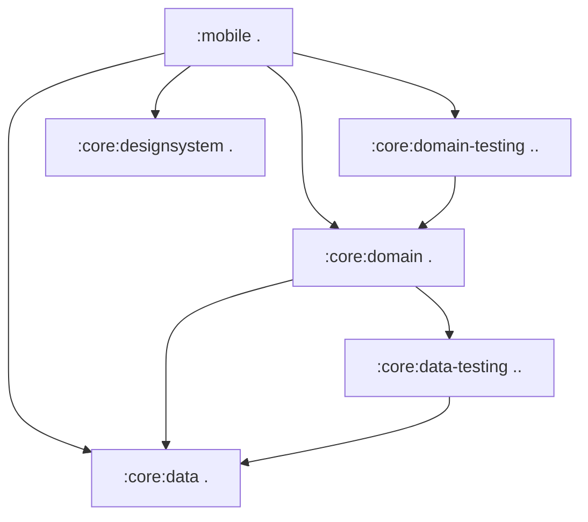
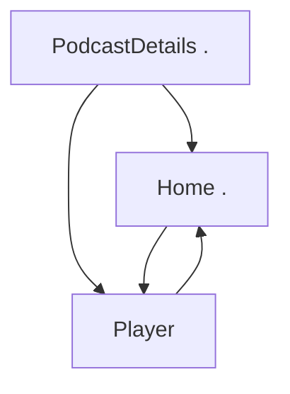

[//]: # (title: 将 Jetpack Compose 应用程序迁移到 Kotlin Multiplatform)

<secondary-label ref="IntelliJ IDEA"/>
<secondary-label ref="Android Studio"/>

<tldr>
<p>本教程使用 IntelliJ IDEA，但你也可以在 Android Studio 中跟随操作。这两个 IDE 共享相同的核心功能和 Kotlin Multiplatform 支持。</p>
</tldr>

本指南旨在将一个纯 Android 应用程序迁移，以使其在整个技术栈上实现多平台化，从业务逻辑到用户界面。它通过一个高级 Compose 示例，展示了常见的挑战和解决方案。你可以密切跟随提交序列，或大致浏览通用的迁移步骤，并深入研究你感兴趣的任何部分。

初始应用程序是 [Jetcaster](https://github.com/android/compose-samples/tree/main/Jetcaster)，一个使用 Jetpack Compose 为 Android 构建的示例播客应用程序。该示例是一个功能完备的应用程序，它依赖于：
* 多个模块。
* Android 资源管理。
* 网络和数据库访问。
* Compose Navigation。
* 最新的 Material Expressive 组件。

所有这些特性都可以使用 Kotlin Multiplatform 和 Compose Multiplatform 框架，适配成一个跨平台应用程序。

为了让你的 Android 应用程序能够在其他平台运行，你可以：

1. 了解如何评估你的项目是否适合 Kotlin Multiplatform (KMP) 迁移。
2. 了解如何将 Gradle 模块分离为跨平台模块和平台特有的模块。对于 Jetcaster，我们能够使大多数业务逻辑模块实现多平台化，除了某些需要为 iOS 和 Android 分别编程的低层系统调用。
3. 遵循逐步将业务逻辑模块多平台化的过程，通过逐步更新构建脚本和代码，以最小的改动在工作状态之间切换。
4. 了解 UI 代码如何过渡到共享实现：使用 Compose Multiplatform，你可以在 Jetcaster 中共享大部分 UI 代码。更重要的是，你将看到如何逐步实现这一过渡，逐屏进行。

最终的应用程序在 Android、iOS 和桌面平台运行。桌面应用程序也可用作 [Compose 热重载](compose-hot-reload.md) 示例：一种快速迭代 UI 行为的方式。

## 潜在 Kotlin Multiplatform 迁移的核对清单

潜在 KMP 迁移的主要障碍是 Java 和 Android Views。如果你的项目已经用 Kotlin 编写并使用 Jetpack Compose 作为 UI，这将大大降低迁移的复杂性。

以下是你在迁移项目或模块之前应考虑的通用准备工作核对清单：

1. [转换或隔离 Java 代码](#convert-or-isolate-java-code)
2. [检查你的 Android/JVM 专属依赖项](#check-your-android-jvm-only-dependencies)
3. [解决模块化技术债](#catch-up-with-modularization-technical-debt)
4. [迁移到 Compose](#migrate-from-views-to-jetpack-compose)

### 转换或隔离 Java 代码

在原始的 Android Jetcaster 示例中，存在诸如 `Objects.hash()` 和 `Uri.encode()` 等纯 Java 调用，以及对 `java.time` 包的广泛使用。

虽然你可以在 Kotlin 中调用 Java，反之亦然，但 `commonMain` 源集（包含 Kotlin Multiplatform 模块中的共享代码）无法包含 Java 代码。因此，当你将 Android 应用程序多平台化时，你需要：
* 将此代码隔离在 `androidMain` 中（并为 iOS 重写），或者
* 使用多平台兼容的依赖项将 Java 代码转换为 Kotlin。

另一个 Java 特有的库 RxJava 未在 Jetcaster 中使用，但被广泛采用。由于它是一个用于管理异步操作的 Java 框架，建议在开始 KMP 迁移之前迁移到 `kotlinx-coroutines`。

有 [从 Java 迁移到 Kotlin 的指南](https://kotlinlang.org/docs/java-to-kotlin-idioms-strings.html)，以及 [IntelliJ IDEA 中的一个助手](https://www.jetbrains.com/help/idea/get-started-with-kotlin.html#convert-java-to-kotlin) 可以自动转换 Java 代码并简化此过程。

### 检查你的 Android/JVM 专属依赖项

虽然许多项目，尤其是新项目，可能不包含太多 Java 代码，但它们通常具有 Android 专属的依赖项。对于 Jetcaster，识别替代方案并迁移到这些方案占据了大部分工作。

一个重要的步骤是列出你计划共享的代码中使用的依赖项，并确保有多平台替代方案可用。虽然多平台生态系统不如 Java 生态系统庞大，但它正在迅速扩张。使用 [klibs.io](https://klibs.io) 作为起点来评估潜在选项。

对于 Jetcaster，这些库的列表如下：

* Dagger/Hilt，一种流行的依赖注入解决方案（已替换为 [Koin](https://insert-koin.io/)）

  Koin 是一个可靠的多平台 DI 框架。如果它不能满足你的需求或所需的重写过于广泛，还有其他解决方案。[Metro](https://zacsweers.github.io/metro/latest/) 框架也是多平台的。它可以通过支持[与其他注解的互操作](https://zacsweers.github.io/metro/latest/interop/)来简化迁移，包括 Dagger 和 Kotlin Inject。
* Coil 2，一个图像加载库（在版本 3 中[成为多平台](https://coil-kt.github.io/coil/upgrading_to_coil3/)）。
* ROME，一个 RSS 框架（已替换为多平台 [RSS Parser](https://github.com/prof18/RSS-Parser)）。
* JUnit，一个测试框架（已替换为 [kotlin-test](https://kotlinlang.org/api/core/kotlin-test/)）。

在此过程中，你可能会发现一些在多平台中停止工作的代码片段，因为目前还没有跨平台实现。例如，在 Jetcaster 中，我们不得不替换 `AnnotatedString.fromHtml()` 函数，它是 Compose UI 库的一部分，用第三方多平台依赖项替换。

很难提前识别所有此类情况，因此请准备在迁移过程中寻找替代方案或重写代码。这就是为什么我们展示了如何以最小的步骤从一个工作状态转移到另一个工作状态。这样，当许多部分同时发生变化时，单个问题就不会阻碍你的进展。

### 解决模块化技术债

KMP 允许你选择性地迁移到多平台状态，逐模块、逐屏幕进行。但要使其顺利进行，你的模块结构需要清晰且易于操作。考虑根据[高内聚、低耦合原则](https://developer.android.com/topic/modularization/patterns#cohesion-coupling)评估你的模块化，以及其他推荐的模块结构实践。

一般性建议可归纳如下：

* 将应用程序功能的不同部分分离到特性模块中，并使特性模块与处理和提供数据访问的数据模块分开。
* 在模块内封装特定领域的数据和业务逻辑。将相关数据类型组合在一起，避免在不相关的领域混合逻辑或数据。
* 通过使用 Kotlin [可见性修饰符](https://kotlinlang.org/docs/visibility-modifiers.html)，防止外部访问模块的实现细节和数据源。

结构清晰后，即使你的项目有大量模块，你也应该能够单独将它们迁移到 KMP。这种方法比尝试完全重写更平滑。

### 从 Views 迁移到 Jetpack Compose

Kotlin Multiplatform 提供了 Compose Multiplatform 作为创建跨平台 UI 代码的方式。为了顺利过渡到 Compose Multiplatform，你的 UI 代码应已使用 Compose 编写。如果你当前正在使用 Views，则需要用新的范式和新的框架重写该代码。提前完成此操作显然会更容易。

Google 长期以来一直在推进和丰富 Compose。请查看 [Jetpack Compose 迁移指南](https://developer.android.com/develop/ui/compose/migrate) 以获取最常见场景的帮助。你还可以使用 Views-Compose 互操作性，但与 Java 代码一样，此代码必须隔离在你的 `androidMain` 源集中。

## 应用程序多平台化步骤

完成初步准备和评估后，一般过程是：

1. [迁移到多平台库](#migrate-to-multiplatform-libraries)

2. [将你的业务逻辑过渡到 KMP](#migrating-the-business-logic)。
   1. 从依赖项最少的模块开始。
   2. 将其迁移到 KMP 模块结构并迁移到使用多平台库。
   3. 选择依赖树中的下一个模块并重复此过程。
   
   {type="alpha-lower"}
3. [将你的 UI 代码过渡到 Compose Multiplatform](#migrating-to-multiplatform-ui)。
   当你的所有业务逻辑都已实现多平台化时，过渡到 Compose Multiplatform 变得相对简单。对于 Jetcaster，我们通过逐屏迁移展示了增量迁移。我们还展示了当部分屏幕已迁移而部分未迁移时如何调整导航图。

为了简化示例，我们从一开始就移除了 Android 特有的 Glance、TV 和可穿戴设备目标，因为它们无论如何都不与多平台代码交互，也无需迁移。

> 你可以遵循下面的步骤描述，或直接跳转到[包含最终多平台 Jetcaster 项目的版本库](https://github.com/kotlin-hands-on/jetcaster-kmp-migration/commits/main/)。每个提交都代表应用程序的一个工作状态，以展示从纯 Android 逐步迁移到完全 Kotlin Multiplatform 的潜力。
> 
{style="tip"}

### 准备环境 {collapsible="true"}

如果你希望按照迁移步骤操作或在你的机器上运行提供的示例，请确保准备好环境：

1. 从快速入门中，完成[为 Kotlin Multiplatform 设置环境](quickstart.md#set-up-the-environment)的说明。

   > 你需要一台装有 macOS 的 Mac 电脑才能构建并运行 iOS 应用程序。这是 Apple 的要求。
   >
   {style="note"}

2. 在 IntelliJ IDEA 或 Android Studio 中，通过克隆示例版本库来创建新项目：

   ```text
   git@github.com:kotlin-hands-on/jetcaster-kmp-migration.git
   ```

## 迁移到多平台库

应用程序的大部分功能都依赖于一些库。我们可以在配置模块以支持多平台之前，将其用法过渡到 KMP 兼容。

* 从 ROME 工具解析器迁移到多平台 RSS Parser。这需要考虑 API 之间的差异，其中之一是它们如何处理日期。

  > 请参见[结果提交](https://github.com/kotlin-hands-on/jetcaster-kmp-migration/commit/703d670ed82656c761ed2180dc5118b89fc9c805)。
* 将 Dagger/Hilt 迁移到 Koin 4，覆盖整个应用程序，包括纯 Android 入口点模块 `mobile`。这需要根据 Koin 方法重写依赖注入逻辑，但 `*.di` 包之外的代码基本不受影响。

  当你从 Hilt 迁移时，确保清除 `/build` 目录以避免之前生成的 Hilt 代码中出现编译错误。

  > 请参见[结果提交](https://github.com/kotlin-hands-on/jetcaster-kmp-migration/commit/9c59808a5e3d74e6a55cd357669b24f77bbcd9c8)。

* 从 Coil 2 升级到 Coil 3。同样，修改的代码相对较少。

  > 请参见[结果提交](https://github.com/kotlin-hands-on/jetcaster-kmp-migration/commit/826fdd2b87a516d2f0bfe6b13ab8e989a065ee7a)。

* 从 JUnit 迁移到 `kotlin-test`。这涉及所有包含测试的模块，但由于 `kotlin-test` 的兼容性，实现迁移所需的更改非常少。

  > 请参见[结果提交](https://github.com/kotlin-hands-on/jetcaster-kmp-migration/commit/82109598dbfeda9dceecc10b40487f80639c5db4)。

### 将依赖 Java 的代码重写为 Kotlin

既然主要库都已是多平台的，我们需要消除纯 Java 依赖项。

一个简单的纯 Java 调用示例是 `Objects.hash()`，我们在 Kotlin 中重新实现了它。
请参见[结果提交](https://github.com/kotlin-hands-on/jetcaster-kmp-migration/commit/29341a430e6c98a4f7deaed1d6863edb98e25659)。

但在 Jetcaster 示例中，主要阻止我们直接公共化代码的是 `java.time` 包。时间计算几乎存在于播客应用程序的每个地方，因此我们需要将该代码迁移到 `kotlin.time` 和 `kotlinx-datetime` 以真正从 KMP 代码共享中受益。

所有与时间相关的重写都收集在[此提交](https://github.com/kotlin-hands-on/jetcaster-kmp-migration/commit/0cb5b31964991fdfaed7615523bb734b22f9c755)中。

## 迁移业务逻辑

一旦主要依赖项实现多平台化，我们就可以选择一个模块开始迁移。构建项目中模块的依赖图会很有用。像 [Junie](https://www.jetbrains.com//junie/) 这样的 AI 代理可以轻松提供帮助。对于 Jetcaster，简化的模块依赖图如下所示：



这建议了以下序列，例如：

1. `:core:data`
2. `:core:data-testing`
4. `:core:domain`
5. `:core:domain-testing`
1. `:core:designsystem` — 尽管它没有模块依赖，但这是一个 UI 助手模块，因此我们只有在准备好将 UI 代码移入共享模块时才会处理它。

### 迁移 :core:data

#### 配置 :core:data 并迁移数据库代码

Jetcaster 使用 [Room](https://developer.android.com/training/data-storage/room) 作为数据库库。由于 Room 从 2.7.0 版本开始支持多平台，我们只需要更新代码使其跨平台工作。此时我们还没有 iOS 应用程序，但我们已经可以编写平台特有的代码，当我们设置 iOS 入口点时会调用这些代码。我们还为其他平台（iOS 和 JVM）添加了目标配置，以便稍后添加新的入口点。

为了切换到 Room 的多平台版本，我们遵循了 Android 的[通用设置指南](https://developer.android.com/kotlin/multiplatform/room)。

> 请参见[结果提交](https://github.com/kotlin-hands-on/jetcaster-kmp-migration/commit/ab22fb14e9129087b310a989eb08bcc77b0e12e8)。

* 注意新的代码结构，包含 `androidMain`、`commonMain`、`iosMain` 和 `jvmMain` 源集。
* 大多数代码更改是关于为 Room 创建 expect/actual 结构以及相应的 DI 更改。
* 有一个新的 `OnlineChecker` 接口，它涵盖了以下事实：我们仅在 Android 上检测互联网连接。在我们[将 iOS 应用程序添加为目标](#add-an-ios-entry-point)之前，在线检测器将是一个存根。

我们还可以立即将 `:core:data-testing` 模块重新配置为多平台。
请参见[结果提交](https://github.com/kotlin-hands-on/jetcaster-kmp-migration/commit/098a72a25f07958b90ae8778081ab1c7f2988543)。它只需要更新 Gradle 配置并迁移到源集文件夹结构。

#### 配置并迁移 :core:domain

如果所有依赖项都已考虑在内并迁移到多平台，我们唯一需要做的就是移动代码并重新配置模块。

> 请参见[结果提交](https://github.com/kotlin-hands-on/jetcaster-kmp-migration/commit/a8376dc2f0eb29ed8b67c929970dcbe505768612)。

与 `:core:data-testing` 类似，我们也可以轻松地将 `:core:domain-testing` 模块更新为多平台。

> 请参见[结果提交](https://github.com/kotlin-hands-on/jetcaster-kmp-migration/commit/a46f0a98b8d95656e664dca0d95da196034f2ec3)。

#### 配置并迁移 :core:designsystem

仅剩下 UI 代码需要迁移，我们开始转换 `:core:designsystem` 模块，包括字体资源和排版。除了配置 KMP 模块和创建 `commonMain` 源集之外，我们将 `MaterialExpressiveTheme` 的 `JetcasterTypography` 实参转换为一个可组合项，封装了对多平台字体的调用。

> 请参见[结果提交](https://github.com/kotlin-hands-on/jetcaster-kmp-migration/commit/4aa92e3f38d06aa64444163d865753e47e9b2a97)。

## 迁移到多平台 UI

当所有 `:core` 逻辑都已实现多平台化时，你也可以开始将 UI 迁移到公共代码。再次，由于我们旨在实现完全迁移，我们尚未添加 iOS 目标，只是确保 Android 应用程序与放置在公共代码中的 Compose 部分协同工作。

为了可视化我们将遵循的逻辑，以下是表示 Jetcaster 屏幕之间关系的简化图：

<!-- The deep link connections and the supporting pane are commented out for the sake of brevity but may be interesting. --> 



首先，我们创建了一个共享 UI 模块，用于我们将公共化的 UI 代码。

> 请参见[结果提交](https://github.com/kotlin-hands-on/jetcaster-kmp-migration/commit/a48bb1281c63a235fcc1d80e2912e75ddd5cbed4)。

为了演示逐步迁移 UI，我们将逐屏进行。每一步都将以一个提交结束，该提交包含处于工作状态的应用程序，更接近完全共享的 UI。

在上面的屏幕图指导下，我们从播客详情屏幕开始：

1. 迁移后的屏幕将与仍在 Android 模块中的 Compose 主题一起工作。我们需要做的是：
   1. 更新 ViewModel 和相应的 DI 代码。
   2. 更新资源和资源访问器。
      尽管多平台资源库与 Android 体验密切相关，但仍有一些显著差异需要解决：
      * 资源文件处理方式略有不同。例如，资源目录需要命名为 `composeResources` 而不是 `res`，并且 Android XML 文件中 `@android:color` 的用法需要替换为颜色十六进制代码。关于[多平台资源](compose-multiplatform-resources.md)的文档，请参阅以了解更多信息。
      * 生成的资源访问器类名为 `Res`（与 Android 上的 `R` 相对）。移动和调整资源文件后，重新生成访问器并替换 UI 代码中每个资源的导入。
      
   > 请参见[结果提交](https://github.com/kotlin-hands-on/jetcaster-kmp-migration/commit/801f044e56224398d812eb8fd1c1d46b0e9b0087)。

2. 迁移 Compose 主题。我们还为平台特有的配色方案实现提供了存根。

   > 请参见[结果提交](https://github.com/kotlin-hands-on/jetcaster-kmp-migration/commit/07be9bba96a0dd91e4e0761075898b3d5272ca57)。

3. 继续主屏幕：
   1. 迁移 ViewModel。
   2. 将代码移至共享 UI 模块中的 `commonMain`。
   3. 移动和调整对资源的引用。

   > 请参见[结果提交](https://github.com/kotlin-hands-on/jetcaster-kmp-migration/commit/ad0012becc527c1c8cb354bb73b5da9741733a1f)。

4. 为了演示另一种原子化迁移方式，我们部分迁移了导航。我们可以在公共代码中结合屏幕与 Android 原生屏幕。`PlayerScreen` 仍然位于 `mobile` 模块中，并且仅为 Android 入口点包含在导航中。它被注入到总体的多平台导航中。

   > 请参见[结果提交](https://github.com/kotlin-hands-on/jetcaster-kmp-migration/commit/2e0107dd4d217346b38cc9b3d5180fedcc12fb8b)。
   
5. 最后，移动所有剩余内容：
   * 将剩余的导航移至公共代码 ([结果提交](https://github.com/kotlin-hands-on/jetcaster-kmp-migration/commit/48f13acc02d3630871e3671114f736cb3db51424))。
   * 将最后一个屏幕 `PlayerScreen` 迁移到 Compose Multiplatform ([结果提交](https://github.com/kotlin-hands-on/jetcaster-kmp-migration/commit/60d5a2f96943705c869b5726622e873925fc2651))。

既然所有 UI 代码都已公共化，我们可以用它来快速为其他平台创建应用程序。

## 可选：添加 JVM 入口点

此可选步骤有助于：
* 展示将一个已完全多平台化的 Android 应用程序创建为桌面应用程序所需的工作量有多小。
* 展示 [Compose 热重载](compose-hot-reload.md)（目前仅支持桌面目标）作为快速迭代 Compose UI 的工具。

共享所有 UI 代码后，为桌面 JVM 应用程序添加新的入口点，只需创建一个 `main()` 函数并将其与 DI 框架集成。

> 请参见[结果提交](https://github.com/kotlin-hands-on/jetcaster-kmp-migration/commit/af033dbf39188ef3991466727d155b988c30f1d3)。

## 添加 iOS 入口点

iOS 入口点需要一个 iOS 项目，该项目与 KMP 代码链接。

在[将应用程序多平台化](https://kotlinlang.org/docs/multiplatform/multiplatform-integrate-in-existing-app.html#create-an-ios-project-in-xcode)教程中介绍了如何在 KMP 项目中创建和嵌入 iOS 应用程序。

> 我们在此处使用的直接集成方法最直接，但可能不适用于你的项目。关于 [iOS 集成方法概述](multiplatform-ios-integration-overview.md)，请参见以了解一系列替代方案。
>
{style="note"}

在 iOS 应用程序中，我们需要将 Swift UI 代码与我们的 Compose Multiplatform 代码连接。我们通过添加一个返回 `UIViewController` 的函数来实现，该 `UIViewController` 包含嵌入的 `JetcasterApp` 可组合项，并添加到 iOS 应用程序。

> 请参见[结果提交](https://github.com/kotlin-hands-on/jetcaster-kmp-migration/commit/2b2c412596e199b140089efc73de03e46f5c1d77)中添加的 iOS 项目和相应的代码更新。

## 运行应用程序

在迁移后的应用程序的最终状态中，存在用于初始 Android 模块 (`mobile`) 和新 iOS 应用程序的运行配置。你可以从相应的 `main.kt` 文件运行桌面应用程序。运行它们，看看共享 UI 是如何在所有平台上工作的吧！

## 最终总结

在此次迁移中，我们遵循了将纯 Android 应用程序转换为 Kotlin Multiplatform 应用程序的通用步骤：

* 过渡到多平台依赖项，或在不可能的情况下重写代码。
* 逐个将可在其他平台使用的 Android 模块转换为多平台模块。
* 为 Compose Multiplatform 代码创建一个共享 UI 模块，并逐屏过渡到共享 UI 代码。
* 为其他平台创建入口点。

这个序列并非一成不变。可以从其他平台的入口点开始，逐步为它们构建基础，直到它们正常工作。在 Jetcaster 示例中，我们选择了一个更清晰的更改序列，易于一步一步地遵循。

如果你对本指南或所示范的解决方案有任何反馈，请在 [YouTrack](https://kotl.in/issue) 中创建议题。