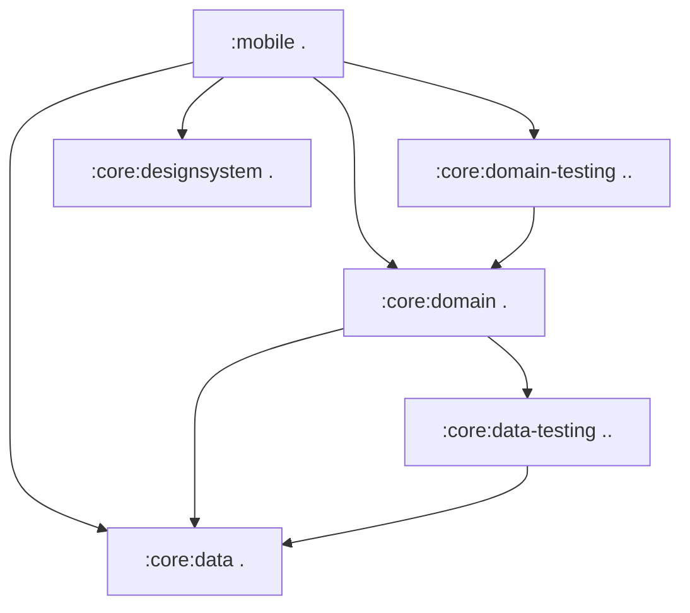
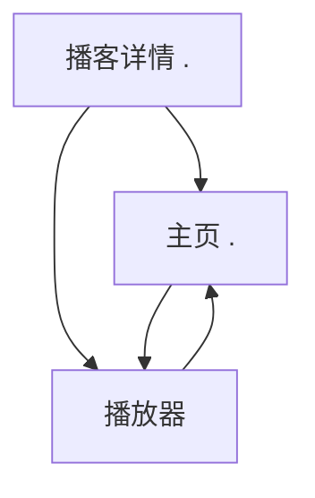

[//]: # (title: 将 Jetpack Compose 应用迁移到 Kotlin Multiplatform)

<secondary-label ref="IntelliJ IDEA"/>
<secondary-label ref="Android Studio"/>

<tldr>
<p>本教程使用 IntelliJ IDEA，但你也可以在 Android Studio 中参考。
   这两款 IDE 共享相同的核心功能和 Kotlin Multiplatform 支持。</p>
</tldr>

本指南介绍了如何将一个仅限 Android 的应用迁移到从业务逻辑到 UI 的全栈跨平台状态。
它通过一个高级 Compose 示例说明了常见的挑战和解决方案。
你可以紧跟提交序列，也可以浏览通用的迁移步骤并深入研究你感兴趣的任何部分。

起始应用是 [Jetcaster](https://github.com/android/compose-samples/tree/main/Jetcaster)，
这是一个为 Android 构建的、采用 Jetpack Compose 的播客示例应用。
该示例是一个功能齐全的应用，依赖于：
* 多个模块。
* Android 资源管理。
* 网络和数据库访问。
* Compose Navigation。
* 最新的 Material Expressive 组件。

所有这些功能都可以使用 Kotlin Multiplatform 和
Compose Multiplatform 框架适配到跨平台应用中。

为了准备让你的 Android 应用在其他平台上运行，你可以：

1. 了解如何评估你的项目是否适合作为 Kotlin Multiplatform (KMP) 迁移的候选项。
2. 了解如何将 Gradle 模块划分为跨平台模块和平台特定模块。
   对于 Jetcaster，我们能够将大多数业务逻辑模块转换为多平台模块，
   除了某些低层级系统调用（需要分别为 iOS 和 Android 编写程序）。
3. 按照将业务逻辑模块逐一转换为多平台模块的过程进行操作，
   通过逐步更新构建脚本和代码，以最小的改动在工作状态之间切换。
4. 了解 UI 代码如何过渡到共享实现：
   使用 Compose Multiplatform，你可以共享 Jetcaster 中大部分的 UI 代码。
   更重要的是，你将看到如何逐个屏幕地逐步实现这种过渡。

最终的应用可在 Android、iOS 和桌面端上运行。
桌面应用还充当了 [Compose 热重载](compose-hot-reload.md)示例：
这是一种快速迭代 UI 行为的方法。

## 潜在 Kotlin Multiplatform 迁移的核对清单

潜在 KMP 迁移的主要障碍是 Java 和 Android View。
如果你的项目已经使用 Kotlin 编写并使用 Jetpack Compose 构建 UI，
迁移的复杂性将大大降低。

以下是在迁移项目或模块之前应考虑的常规准备工作清单：

1. [转换或隔离 Java 代码](#convert-or-isolate-java-code)
2. [检查仅限 Android/JVM 的依赖项](#check-your-android-jvm-only-dependencies)
3. [清理模块化技术债务](#catch-up-with-modularization-technical-debt)
4. [迁移到 Compose](#migrate-from-views-to-jetpack-compose)

### 转换或隔离 Java 代码

在原始的 Android Jetcaster 示例中，存在仅限 Java 的调用，如 `Objects.hash()` 和 `Uri.encode()`，
以及对 `java.time` 软件包的大量使用。

虽然你可以从 Kotlin 调用 Java（反之亦然），
但包含 Kotlin Multiplatform 模块中共享代码的 `commonMain` 源集不能包含 Java 代码。
因此，当你将 Android 应用转换为多平台应用时，你需要执行以下任一操作：
* 将此类代码隔离在 `androidMain` 中（并为 iOS 重写），或者
* 使用兼容多平台的依赖项将 Java 代码转换为 Kotlin。

另一个 Java 特有的库 RxJava 虽然在 Jetcaster 中未使用，但被广泛采用。由于它是
一个用于管理异步操作的 Java 框架，
建议在开始 KMP 迁移之前先迁移到 `kotlinx-coroutines`。

这里有 [Java 迁移到 Kotlin 的指南](https://kotlinlang.org/docs/java-to-kotlin-idioms-strings.html)，
以及 [IntelliJ IDEA 中的辅助工具](https://www.jetbrains.com/help/idea/get-started-with-kotlin.html#convert-java-to-kotlin)，
它可以自动转换 Java 代码并简化该过程。

### 检查仅限 Android/JVM 的依赖项

虽然很多项目（尤其是较新的项目）可能不包含太多 Java 代码，但它们通常具有仅限 Android 的依赖项。
对于 Jetcaster 而言，识别替代方案并迁移到这些方案占据了大部分工作。

一个重要的步骤是列出你计划共享的代码中所使用的依赖项清单，并确保有可用的多平台替代方案。
虽然多平台生态系统不如 Java 生态系统庞大，但它正在迅速扩展。
可以使用 [klibs.io](https://klibs.io) 作为评估潜在选项的起点。

对于 Jetcaster，这些库的清单如下：

* Dagger/Hilt，一种流行的依赖注入解决方案（替换为 [Koin](https://insert-koin.io/)）

  Koin 是一个可靠的多平台 DI 框架。如果它不能满足你的需求或所需的重写
  过于广泛，还有其他解决方案。
  [Metro](https://zacsweers.github.io/metro/latest/) 框架也是多平台的。
  它可以通过支持[与其他注解的互操作](https://zacsweers.github.io/metro/latest/interop/)（包括 Dagger 和 Kotlin Inject）来帮助简化迁移。
* Coil 2，一个图像加载库（在 [第 3 版中已变为多平台](https://coil-kt.github.io/coil/upgrading_to_coil3/)）。
* ROME，一个 RSS 框架（替换为多平台的 [RSS Parser](https://github.com/prof18/RSS-Parser)）。
* JUnit，一个测试框架（替换为 [kotlin-test](https://kotlinlang.org/api/core/kotlin-test/)）。

随着迁移的进行，你可能会发现由于尚不存在跨平台实现，一小部分代码在多平台中停止工作。
例如，在 Jetcaster 中，我们不得不将 Compose UI 库中的 `AnnotatedString.fromHtml()` 函数
替换为第三方多平台依赖项。

很难提前识别所有此类情况，因此请准备好在迁移过程中寻找替代方案或重写代码。
这就是为什么我们展示如何以尽可能小的步骤从一个工作状态移动到另一个工作状态。通过这种方式，即使许多部分同时发生变化，单一问题
也不会阻碍你的进度。

### 清理模块化技术债务

KMP 允许你逐模块、逐屏幕地选择性迁移到多平台状态。
但为了使其顺利运行，你的模块结构需要清晰且易于操作。
考虑根据[高内聚、低耦合原则](https://developer.android.com/topic/modularization/patterns#cohesion-coupling)
以及其他推荐的模块结构实践来评估你的模块化情况。

通用建议可以总结如下：

* 将应用功能的不同部分拆分为功能模块，
  并将功能模块与处理和提供数据访问的数据模块分开。
* 将特定领域的数据和业务逻辑封装在一个模块内。
  将相关数据类型分组在一起，避免在不相关的领域之间混合逻辑或数据。
* 通过使用 Kotlin [可见性修饰符](https://kotlinlang.org/docs/visibility-modifiers.html)来防止外部访问模块的实现细节和数据源。

凭借清晰的结构，即使你的项目有很多模块，
你也应该能够逐个将它们迁移到 KMP。这种方法比尝试完整重写要顺畅得多。

### 从 View 迁移到 Jetpack Compose

Kotlin Multiplatform 提供了 Compose Multiplatform 作为创建跨平台 UI 代码的方式。
为了顺利过渡到 Compose Multiplatform，你的 UI 代码应该已经使用 Compose 编写。如果你当前正在使用 View，
你将需要使用新范式和新框架重写该代码。
显然，如果提前完成这项工作会更容易。

Google 长期以来一直在推进和丰富 Compose。查看 [Jetpack Compose 迁移指南](https://developer.android.com/develop/ui/compose/migrate)
以获取有关最常见场景的帮助，或尝试使用 [AI 迁移代理技能](https://github.com/android/skills/blob/main/jetpack-compose/migration/migrate-xml-views-to-jetpack-compose/SKILL.md)。
你也可以使用 View-Compose 互操作，但就像 Java 代码一样，此类代码必须隔离在你的
`androidMain` 源集中。

## 使应用支持多平台的步骤

完成初步准备和评估后，一般流程如下：

1. [迁移到多平台库](#migrate-to-multiplatform-libraries)

2. [将业务逻辑过渡到 KMP](#migrating-the-business-logic)。
   1. 从依赖其他模块最少的模块开始。
   2. 将其迁移到 KMP 模块结构并迁移到使用多平台库。
   3. 选取依赖树中的下一个模块并重复此过程。
   
   {type="alpha-lower"}
3. [将 UI 代码过渡到 Compose Multiplatform](#migrating-to-multiplatform-ui)。
   当你的所有业务逻辑已经是多平台时，过渡到 Compose Multiplatform 会变得相对
   简单。
   对于 Jetcaster，我们展示了通过逐个屏幕迁移的增量迁移过程。我们还展示了在某些屏幕已迁移而某些屏幕未迁移时，
   如何调整导航图。

为了简化示例，我们从一开始就移除了 Android 特有的 Glance、TV 和可穿戴设备目标，
因为它们反正不会与多平台代码交互，也不需要被迁移。

> 你可以参考下面步骤的说明，或者直接跳转到[包含最终多平台 Jetcaster 项目的仓库](https://github.com/kotlin-hands-on/jetcaster-kmp-migration/commits/main/)。
> 每个提交代表了应用的一个工作状态，以展示从仅限 Android
> 到完全 Kotlin Multiplatform 的渐进式迁移潜力。
> 
{style="tip"}

### 准备环境 {collapsible="true"}

如果你想按照迁移步骤操作或在你的机器上运行提供的示例，
请确保你准备好了环境：

1. 根据快速入门，完成[为 Kotlin Multiplatform 设置环境](quickstart.md#set-up-the-environment)的说明。

   > 你需要一台装有 macOS 的 Mac 来构建和运行 iOS 应用程序。
   > 这是 Apple 的要求。
   >
   {style="note"}

2. 在 IntelliJ IDEA 或 Android Studio 中，通过克隆示例仓库创建一个新项目：

   ```text
   git@github.com:kotlin-hands-on/jetcaster-kmp-migration.git
   ```

## 迁移到多平台库

应用的大部分功能都依赖于几个库。
在为多平台支持配置模块之前，我们可以先将它们的使用转换为 KMP 兼容：

* 从 ROME tools 解析器迁移到多平台 RSS Parser。
  这需要考虑到 API 之间的差异，其中之一是它们处理日期的方式。

  > 请参阅[生成的提交](https://github.com/kotlin-hands-on/jetcaster-kmp-migration/commit/703d670ed82656c761ed2180dc5118b89fc9c805)。
* 在整个应用中（包括仅限 Android 的入口点模块 `mobile`）从 Dagger/Hilt 迁移到 Koin 4。
  这需要根据 Koin 方法重写依赖注入逻辑，但 `*.di` 软件包之外的代码
  基本不受影响。

  当你从 Hilt 迁移出来时，请确保清理 `/build` 目录，以避免在先前生成的 Hilt 代码中出现编译错误。

  > 请参阅[生成的提交](https://github.com/kotlin-hands-on/jetcaster-kmp-migration/commit/9c59808a5e3d74e6a55cd357669b24f77bbcd9c8)。

* 从 Coil 2 升级到 Coil 3。同样，修改的代码相对较少。

  > 请参阅[生成的提交](https://github.com/kotlin-hands-on/jetcaster-kmp-migration/commit/826fdd2b87a516d2f0bfe6b13ab8e989a065ee7a)。

* 从 JUnit 迁移到 `kotlin-test`。这涉及到所有带有测试的模块，但得益于 `kotlin-test` 的兼容性，
  实现迁移所需的改动非常少。

  > 请参阅[生成的提交](https://github.com/kotlin-hands-on/jetcaster-kmp-migration/commit/82109598dbfeda9dceecc10b40487f80639c5db4)。

### 将依赖 Java 的代码重写为 Kotlin

既然主要库都已是多平台，我们需要消除仅限 Java 的依赖项。

仅限 Java 调用的一个简单例子是 `Objects.hash()`，我们在 Kotlin 中重新实现了它。
请参阅[生成的提交](https://github.com/kotlin-hands-on/jetcaster-kmp-migration/commit/29341a430e6c98a4f7deaed1d6863edb98e25659)。

但在 Jetcaster 示例中，主要阻碍我们直接实现代码通用化的是 `java.time` 软件包。
播客应用中几乎到处都有时间计算，因此我们需要将该代码迁移到 `kotlin.time` 和 `kotlinx-datetime`，
以真正从 KMP 代码共享中获益。

所有与时间相关的重写都收集在[此提交](https://github.com/kotlin-hands-on/jetcaster-kmp-migration/commit/0cb5b31964991fdfaed7615523bb734b22f9c755)中。

## 迁移业务逻辑

一旦主要依赖项变为多平台，我们就可以选择一个模块开始迁移。
构建项目中模块的依赖关系图会很有用。
像 [Junie](https://www.jetbrains.com//junie/) 这样的 AI 代理可以轻松提供帮助。
对于 Jetcaster，简化的模块依赖图如下所示：


```mermaid
flowchart TB
  %% Style for modules
  %% classDef Module fill:#e6f7ff,stroke:#0086c9,stroke-width:1px,color:#003a52

  %% Modules
  M_MOBILE[":mobile ."]
  M_CORE_DATA[":core:data ."]
  M_CORE_DATA_TESTING[":core:data-testing .."]
  M_CORE_DOMAIN[":core:domain ."]
  M_CORE_DOMAIN_TESTING[":core:domain-testing .."]
  M_CORE_DESIGNSYSTEM[":core:designsystem ."]

  class M_MOBILE,M_CORE_DATA,M_CORE_DATA_TESTING,M_CORE_DOMAIN,M_CORE_DOMAIN_TESTING,M_CORE_DESIGNSYSTEM Module

  %% Internal dependencies between modules
  %% :mobile
  M_MOBILE --> M_CORE_DATA
  M_MOBILE --> M_CORE_DESIGNSYSTEM
  M_MOBILE --> M_CORE_DOMAIN
  M_MOBILE --> M_CORE_DOMAIN_TESTING

  %% :core:domain
  M_CORE_DOMAIN --> M_CORE_DATA
  M_CORE_DOMAIN --> M_CORE_DATA_TESTING

  %% :core:data-testing
  M_CORE_DATA_TESTING --> M_CORE_DATA

  %% :core:domain-testing
  M_CORE_DOMAIN_TESTING --> M_CORE_DOMAIN

  %% :core:designsystem and :core:data have no intra-project dependencies
```

例如，这建议了以下序列：

1. `:core:data`
2. `:core:data-testing`
4. `:core:domain`
5. `:core:domain-testing`
1. `:core:designsystem` —— 虽然它没有模块依赖项，但这是一个 UI 辅助模块，
   因此我们仅在准备将 UI 代码移入共享模块时才处理它。 

### 迁移 :core:data

#### 配置 :core:data 并迁移数据库代码

Jetcaster 使用 [Room](https://developer.android.com/training/data-storage/room) 作为数据库库。
由于 Room 从 2.7.0 版本开始支持多平台，
我们只需要更新代码以实现跨平台运行。
此时我们还没有 iOS 应用，但我们已经可以编写平台特定代码，这些代码将在
我们设置 iOS 入口点时被调用。
我们还为其他平台（iOS 和 JVM）的目标添加了配置，以便为以后添加新入口点做准备。

为了切换到多平台版本的 Room，我们遵循了 Android 的[通用设置指南](https://developer.android.com/kotlin/multiplatform/room)。

> 请参阅[生成的提交](https://github.com/kotlin-hands-on/jetcaster-kmp-migration/commit/ab22fb14e9129087b310a989eb08bcc77b0e12e8)。

* 请注意新的代码结构，包含 `androidMain`、`commonMain`、`iosMain` 和 `jvmMain` 源集。
* 大多数代码更改是关于为 Room 创建 expect/actual 结构以及相应的 DI 更改。
* 有一个新的 `OnlineChecker` 接口，用于涵盖我们仅在 Android 上检查互联网连接
  的事实。在[添加 iOS 应用作为目标](#add-an-ios-entry-point)之前，在线检查器将是一个存根。

我们也可以立即将 `:core:data-testing` 模块重新配置为多平台。
请参阅[生成的提交](https://github.com/kotlin-hands-on/jetcaster-kmp-migration/commit/098a72a25f07958b90ae8778081ab1c7f2988543)。
它只需要更新 Gradle 配置并迁移到源集
文件夹结构。

#### 配置并迁移 :core:domain

如果所有依赖项都已考虑在内并迁移到多平台，我们唯一要做的就是
移动代码并重新配置模块。

> 请参阅[生成的提交](https://github.com/kotlin-hands-on/jetcaster-kmp-migration/commit/a8376dc2f0eb29ed8b67c929970dcbe505768612)。

与 `:core:data-testing` 类似，我们也可以轻松地将 `:core:domain-testing` 模块更新为多平台。

> 请参阅[生成的提交](https://github.com/kotlin-hands-on/jetcaster-kmp-migration/commit/a46f0a98b8d95656e664dca0d95da196034f2ec3)。

#### 配置并迁移 :core:designsystem

在只剩下 UI 代码需要迁移的情况下，我们开始迁移 `:core:designsystem` 模块，包括字体资源
和排版。
除了配置 KMP 模块并创建 `commonMain` 源集外，我们将 `MaterialExpressiveTheme` 的 `JetcasterTypography` 参数
转换为了一个可组合项，封装了对多平台字体的调用。

> 请参阅[生成的提交](https://github.com/kotlin-hands-on/jetcaster-kmp-migration/commit/4aa92e3f38d06aa64444163d865753e47e9b2a97)。

## 迁移到多平台 UI

当所有的 `:core` 逻辑都是多平台时，你也可以开始将 UI 移至公共代码。
再次强调，由于我们的目标是全面迁移，我们还没有添加 iOS 目标，只是确保 Android 应用
能够配合放置在公共代码中的 Compose 部分运行。

为了直观展示我们将遵循的逻辑，这里有一个表示 Jetcaster 屏幕之间关系的简化图表：

<!-- 为了简洁起见，深层链接连接和辅助窗格已被注释掉，但可能会很有趣。 --> 


```mermaid
---
config:
  labelBackground: '#ded'
---
flowchart TB
  %% Nodes (plain labels, no quotes/parentheses/braces)
  %% Start[Start .]
  Home[主页 .]
  Player[播放器]
  PodcastDetailsRoute[播客详情 .]
  %% DeepLinkEpisodes[Deep link to player]
  %% DeepLinkPodcasts[Deep link to podcast]

  %% Home’s supporting pane represented as a subgraph
  %% subgraph HomeSupportingPane
    %% direction LR
    %% HomeMain[Home main content]
    %% PodcastDetailsPane[PodcastDetails in supporting pane]
  %% end

  %% Start and primary navigation
  %% Start --> Home

  %% Home main actions
  Home --> Player
  %% Home -->|Select podcast| PodcastDetailsPane

  %% From PodcastDetails (supporting pane) actions
  %% PodcastDetailsPane --> Player
  %% PodcastDetailsPane --> Home

  %% Standalone routes (deep links)
  %% DeepLinkEpisodes --> Player
  %% DeepLinkPodcasts --> PodcastDetailsRoute

  %% From standalone PodcastDetails route
  PodcastDetailsRoute --> Player
  PodcastDetailsRoute --> Home

  %% Back behavior from Player (returns to previous context)
  Player --> Home
  %% Player -->|Back| PodcastDetailsPane
```

首先，我们为将要通用化的 UI 代码创建了一个共享 UI 模块。

> 请参阅[生成的提交](https://github.com/kotlin-hands-on/jetcaster-kmp-migration/commit/a48bb1281c63a235fcc1d80e2912e75ddd5cbed4)。

为了演示逐步迁移 UI，我们将逐个屏幕进行。
每个步骤都会以一个包含处于工作状态的应用的提交结束，离完全共享的 UI 又近了一步。

根据上面的屏幕图表引导，我们从播客详情屏幕开始：

1. 迁移后的屏幕仍将与 Android 模块中的 Compose 主题配合工作。
   我们需要做的是：
   1. 更新 ViewModel 和相应的 DI 代码。
   2. 更新资源和资源访问器。
      虽然多平台资源库与 Android 体验高度一致，但仍有一些
      显著差异需要处理：
      * 资源文件的处理方式略有不同。
        例如，资源目录需要命名为 `composeResources` 而不是 `res`，
        并且 Android XML 文件中 `@android:color` 的用法需要替换为颜色十六进制代码。
        请参阅关于[多平台资源](compose-multiplatform-resources.md)的文档以了解更多信息。
      * 生成的带有资源访问器的类名为 `Res`（与 Android 上的 `R` 不同）。
        移动并调整资源文件后，重新生成访问器并替换 UI 代码中每个资源的导入。
      
   > 请参阅[生成的提交](https://github.com/kotlin-hands-on/jetcaster-kmp-migration/commit/801f044e56224398d812eb8fd1c1d46b0e9b0087)。

2. 迁移 Compose 主题。我们还为配色方案的平台特定实现提供了存根。

   > 请参阅[生成的提交](https://github.com/kotlin-hands-on/jetcaster-kmp-migration/commit/07be9bba96a0dd91e4e0761075898b3d5272ca57)。

3. 继续迁移主页屏幕：
   1. 迁移 ViewModel。
   2. 将代码移动到共享 UI 模块中的 `commonMain`。
   3. 移动并调整对资源的引用。

   > 请参阅[生成的提交](https://github.com/kotlin-hands-on/jetcaster-kmp-migration/commit/ad0012becc527c1c8cb354bb73b5da9741733a1f)。

4. 为了演示另一种原子化迁移的方式，我们部分迁移了导航。
   我们可以将公共代码中的屏幕与 Android 原生屏幕结合使用。
   `PlayerScreen` 仍位于 `mobile` 模块中，并且仅针对 Android 入口点包含在导航中。
   它被注入到总体的多平台导航中。

   > 请参阅[生成的提交](https://github.com/kotlin-hands-on/jetcaster-kmp-migration/commit/2e0107dd4d217346b38cc9b3d5180fedcc12fb8b)。
   
5. 最后移动剩余的所有内容：
   * 将剩余的导航移动到公共代码（[生成的提交](https://github.com/kotlin-hands-on/jetcaster-kmp-migration/commit/48f13acc02d3630871e3671114f736cb3db51424)）。
   * 将最后一个屏幕 `PlayerScreen` 迁移到 Compose Multiplatform（[生成的提交](https://github.com/kotlin-hands-on/jetcaster-kmp-migration/commit/60d5a2f96943705c869b5726622e873925fc2651)）。

既然所有 UI 代码都已通用化，我们可以利用它快速为其他平台创建应用。

## 可选：添加 JVM 入口点

此可选步骤有助于：
* 展示从已完全支持多平台的 Android 应用中创建桌面应用所需的精力是多么少。
* 展示 [Compose 热重载](compose-hot-reload.md)（目前仅支持桌面目标），
  作为快速迭代 Compose UI 的工具。

在共享所有 UI 代码的情况下，为桌面 JVM 应用添加新入口点只需
创建一个 `main()` 函数并将其与 DI 框架集成。

> 请参阅[生成的提交](https://github.com/kotlin-hands-on/jetcaster-kmp-migration/commit/af033dbf39188ef3991466727d155b988c30f1d3)。

## 添加 iOS 入口点

iOS 入口点需要一个与 KMP 代码链接的 iOS 项目。

[使你的应用支持多平台](https://kotlinlang.org/docs/multiplatform/multiplatform-integrate-in-existing-app.html#create-an-ios-project-in-xcode)
教程中涵盖了在 KMP 项目中创建并嵌入 iOS 应用的内容。

> 我们在此使用的直接集成方法是最简单直接的，但可能不是你项目的最佳选择。
> 请参阅 [iOS 集成方法概述](multiplatform-ios-integration-overview.md)以了解各种替代方案。
>
{style="note"}

在 iOS 应用中，我们需要将 Swift UI 代码与我们的 Compose Multiplatform 代码连接起来。
我们在 iOS 应用中添加一个函数，该函数返回一个带有嵌入式 `JetcasterApp` 可组合项的 `UIViewController`。

> 请参阅添加的 iOS 项目以及[生成的提交](https://github.com/kotlin-hands-on/jetcaster-kmp-migration/commit/2b2c412596e199b140089efc73de03e46f5c1d77)中相应的代码更新。

## 运行应用

在迁移后应用的最终状态中，有初始 Android 模块 (`mobile`)
和新 iOS 应用的运行配置。
你可以从相应的 `main.kt` 文件运行桌面应用。
运行它们两者，看看共享 UI 在所有平台上的运行情况！

## 最终总结

在本次迁移中，我们遵循了将纯 Android 应用转换为 Kotlin Multiplatform 应用的常规步骤：

* 过渡到多平台依赖项，或者在无法实现的情况下重写代码。
* 将可在其他平台上使用的 Android 模块逐个转换为多平台模块。
* 为 Compose Multiplatform 代码创建一个共享 UI 模块，并逐个屏幕地过渡到共享 UI 代码。
* 为其他平台创建入口点。

这个序列并非一成不变。可以从其他平台的入口点开始，
并逐渐在它们之下构建基础直到它们能够运行。
在 Jetcaster 示例中，我们选择了一个更清晰的变化序列，以便于逐步遵循。

如果你对本指南或演示的解决方案有任何反馈，请在 [YouTrack](https://kotl.in/issue) 中创建问题。