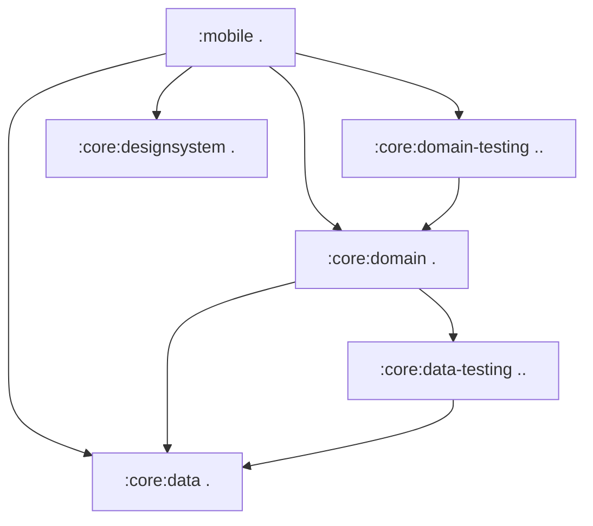
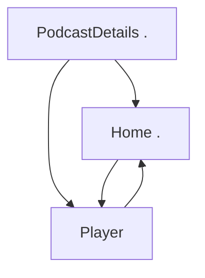

[//]: # (title: Jetpack Compose 앱을 Kotlin Multiplatform로 마이그레이션하기)

<secondary-label ref="IntelliJ IDEA"/>
<secondary-label ref="Android Studio"/>

<tldr>
<p>이 튜토리얼은 IntelliJ IDEA를 사용하지만, Android Studio에서도 따라 할 수 있습니다.
   두 IDE 모두 동일한 핵심 기능과 Kotlin Multiplatform 지원을 공유합니다.</p>
</tldr>

이 가이드는 Android 전용 앱을 비즈니스 로직부터 UI까지 전체 스택에 걸쳐 멀티플랫폼으로 마이그레이션하는 방법을 다룹니다.
고급 Compose 샘플을 사용하여 일반적인 과제와 해결책을 설명합니다.
커밋 순서를 면밀히 따라가거나, 일반적인 마이그레이션 단계를 훑어보고 관심 있는 부분에 대해 더 깊이 탐구할 수 있습니다.

시작 앱은 Jetpack Compose로 Android용으로 빌드된 샘플 팟캐스트 앱인 [Jetcaster](https://github.com/android/compose-samples/tree/main/Jetcaster)입니다.
이 샘플은 다음을 기반으로 하는 모든 기능이 포함된 앱입니다:
* 여러 모듈
* Android 리소스 관리
* 네트워크 및 데이터베이스 액세스
* Compose Navigation
* 최신 Material Expressive 컴포넌트

이러한 모든 기능은 Kotlin Multiplatform와 Compose Multiplatform 프레임워크를 사용하여 크로스 플랫폼 앱으로 적용될 수 있습니다.

Android 앱이 다른 플랫폼에서 작동하도록 준비하려면 다음을 수행할 수 있습니다:

1. Kotlin Multiplatform (KMP) 마이그레이션 후보로서 프로젝트를 평가하는 방법을 알아봅니다.
2. Gradle 모듈을 크로스 플랫폼 모듈과 플랫폼별 모듈로 분리하는 방법을 살펴봅니다.
   Jetcaster의 경우, iOS와 Android에 대해 별도로 프로그래밍해야 하는 일부 저수준 시스템 호출을 제외하고 대부분의 비즈니스 로직 모듈을 멀티플랫폼으로 만들 수 있었습니다.
3. 빌드 스크립트와 코드를 점진적으로 업데이트하여 최소한의 변경으로 작동 상태를 전환하면서 비즈니스 로직 모듈을 하나씩 멀티플랫폼으로 만드는 과정을 따릅니다.
4. UI 코드가 공유 구현으로 전환되는 방식을 살펴봅니다:
   Compose Multiplatform를 사용하면 Jetcaster의 대부분 UI 코드를 공유할 수 있습니다.
   더 중요하게는, 이 전환을 화면별로 점진적으로 구현하는 방법을 알게 될 것입니다.

결과 앱은 Android, iOS 및 데스크톱에서 실행됩니다.
데스크톱 앱은 또한 UI 동작을 빠르게 반복할 수 있는 방법인 [Compose 핫 리로드](compose-hot-reload.md)의 예시로도 사용됩니다.

## 잠재적인 Kotlin Multiplatform 마이그레이션을 위한 체크리스트

잠재적인 KMP 마이그레이션의 주요 장애물은 Java와 Android Views입니다.
만약 프로젝트가 이미 Kotlin으로 작성되었고 UI에 Jetpack Compose를 사용한다면, 마이그레이션의 복잡성을 상당히 낮출 수 있습니다.

프로젝트 또는 모듈을 마이그레이션하기 전에 고려해야 할 일반적인 준비 사항 체크리스트는 다음과 같습니다:

1. [Java 코드 변환 또는 격리](#convert-or-isolate-java-code)
2. [Android/JVM 전용 종속성 확인](#check-your-android-jvm-only-dependencies)
3. [모듈화 기술 부채 해결](#catch-up-with-modularization-technical-debt)
4. [Compose로 마이그레이션](#migrate-from-views-to-jetpack-compose)

### Java 코드 변환 또는 격리

원래 Android Jetcaster 예제에는 `Objects.hash()` 및 `Uri.encode()`와 같은 Java 전용 호출과 `java.time` 패키지의 광범위한 사용이 있습니다.

Kotlin에서 Java를 호출하거나 그 반대로 호출할 수 있지만, Kotlin Multiplatform 모듈의 공유 코드를 포함하는 `commonMain` 소스 세트에는 Java 코드가 포함될 수 없습니다.
따라서 Android 앱을 멀티플랫폼으로 만들 때 다음 중 하나를 수행해야 합니다:
* 이 코드를 `androidMain`에 격리하거나 (그리고 iOS용으로 다시 작성하거나), 또는
* 멀티플랫폼 호환 종속성을 사용하여 Java 코드를 Kotlin으로 변환합니다.

또 다른 Java 특정 라이브러리인 RxJava는 Jetcaster에서 사용되지 않지만 널리 채택되고 있습니다. RxJava는
비동기 작업을 관리하기 위한 Java 프레임워크이므로, KMP 마이그레이션을 시작하기 전에 `kotlinx-coroutines`로 마이그레이션하는 것이 좋습니다.

Java에서 Kotlin으로 마이그레이션하기 위한 [가이드](https://kotlinlang.org/docs/java-to-kotlin-idioms-strings.html)와 Java 코드를 자동으로 변환하고 프로세스를 간소화할 수 있는 [IntelliJ IDEA의 헬퍼](https://www.jetbrains.com/help/idea/get-started-with-kotlin.html#convert-java-to-kotlin)도 있습니다.

### Android/JVM 전용 종속성 확인

많은 프로젝트, 특히 최신 프로젝트에는 Java 코드가 많지 않을 수 있지만, Android 전용 종속성을 사용하는 경우가 많습니다.
Jetcaster의 경우, 대안을 식별하고 그 대안으로 마이그레이션하는 것이 작업의 대부분을 차지했습니다.

중요한 단계는 공유할 코드에서 사용되는 종속성 목록을 작성하고 멀티플랫폼 대안이 사용 가능한지 확인하는 것입니다.
멀티플랫폼 생태계는 Java 생태계만큼 크지는 않지만, 빠르게 확장되고 있습니다.
잠재적인 옵션을 평가하기 위한 시작점으로 [klibs.io](https://klibs.io)를 사용하세요.

Jetcaster의 경우, 이러한 라이브러리 목록은 다음과 같았습니다:

* 널리 사용되는 의존성 주입(Dependency Injection) 솔루션인 Dagger/Hilt ([Koin](https://insert-koin.io/)으로 대체)

  Koin은 신뢰할 수 있는 멀티플랫폼 DI 프레임워크입니다. 요구 사항을 충족하지 못하거나 필요한 재작업이 너무 광범위하다면 다른 솔루션도 있습니다.
  [Metro](https://zacsweers.github.io/metro/latest/) 프레임워크 또한 멀티플랫폼입니다.
  Dagger 및 Kotlin Inject을 포함하여 [다른 어노테이션과의 상호 운용성(interop)](https://zacsweers.github.io/metro/latest/interop/)을 지원하여 마이그레이션을 용이하게 할 수 있습니다.
* 이미지 로딩 라이브러리인 Coil 2 ([버전 3에서 멀티플랫폼이 됨](https://coil-kt.github.io/coil/upgrading_to_coil3/)).
* RSS 프레임워크인 ROME (멀티플랫폼 [RSS Parser](https://github.com/prof18/RSS-Parser)로 대체).
* 테스트 프레임워크인 JUnit ([kotlin-test](https://kotlinlang.org/api/core/kotlin-test/)로 대체).

진행하면서 크로스 플랫폼 구현이 아직 존재하지 않아 멀티플랫폼에서 작동하지 않는 작은 코드 조각을 발견할 수 있습니다.
예를 들어, Jetcaster에서는 Compose UI 라이브러리의 일부인 `AnnotatedString.fromHtml()` 함수를 타사 멀티플랫폼 종속성으로 대체해야 했습니다.

이러한 모든 경우를 미리 식별하기는 어려우므로, 마이그레이션 과정에서 대체품을 찾거나 코드를 다시 작성할 준비를 하십시오.
이것이 우리가 가장 작은 단계로 하나의 작동 상태에서 다른 상태로 이동하는 방법을 보여주는 이유입니다. 그렇게 하면, 많은 부분이 동시에 변경될 때 단일 문제가 진행을 멈추게 하지 않을 것입니다.

### 모듈화 기술 부채 해결

KMP를 사용하면 모듈별, 화면별로 선택적으로 멀티플랫폼 상태로 마이그레이션할 수 있습니다.
그러나 원활하게 작동하려면 모듈 구조가 명확하고 조작하기 쉬워야 합니다.
[높은 응집도, 낮은 결합도(high cohesion, low coupling) 원칙](https://developer.android.com/topic/modularization/patterns#cohesion-coupling) 및 모듈 구조화를 위한 기타 권장 사항에 따라 모듈화를 평가해 보세요.

일반적인 조언은 다음과 같이 요약할 수 있습니다:

* 앱 기능의 개별적인 부분을 기능 모듈로 분리하고, 기능 모듈을 데이터를 처리하고 액세스를 제공하는 데이터 모듈과 분리하십시오.
* 특정 도메인의 데이터와 비즈니스 로직을 모듈 내에 캡슐화하십시오.
  관련 데이터 유형을 함께 그룹화하고, 관련 없는 도메인 간에 로직이나 데이터를 혼합하지 마십시오.
* Kotlin [가시성 변경자(visibility modifiers)](https://kotlinlang.org/docs/visibility-modifiers.html)를 사용하여 모듈의 구현 세부 정보 및 데이터 소스에 대한 외부 액세스를 방지하십시오.

명확한 구조를 가지고 있다면, 프로젝트에 많은 모듈이 있더라도 개별적으로 KMP로 마이그레이션할 수 있을 것입니다. 이 접근 방식은 전체 재작성을 시도하는 것보다 원활합니다.

### Views에서 Jetpack Compose로 마이그레이션

Kotlin Multiplatform는 크로스 플랫폼 UI 코드를 생성하는 방법으로 Compose Multiplatform를 제공합니다.
Compose Multiplatform로 원활하게 전환하려면 UI 코드가 이미 Compose를 사용하여 작성되어 있어야 합니다. 현재 Views를 사용하고 있다면,
새로운 패러다임과 새로운 프레임워크를 사용하여 해당 코드를 다시 작성해야 합니다.
이는 미리 수행하면 확실히 더 쉽습니다.

Google은 오랫동안 Compose를 발전시키고 풍부하게 만들어왔습니다. 가장 일반적인 시나리오에 대한 도움을 위해 [Jetpack Compose 마이그레이션 가이드](https://developer.android.com/develop/ui/compose/migrate)를 확인하세요.
Views-Compose 상호 운용성(interoperability)을 사용할 수도 있지만, Java 코드와 마찬가지로 이 코드는 `androidMain` 소스 세트에 격리되어야 합니다.

## 앱을 멀티플랫폼으로 만들기 위한 단계

초기 준비 및 평가가 완료되면, 일반적인 프로세스는 다음과 같습니다:

1. [멀티플랫폼 라이브러리로 마이그레이션](#migrate-to-multiplatform-libraries)

2. [비즈니스 로직을 KMP로 전환합니다.](#migrating-the-business-logic)
   1. 다른 모듈의 의존성이 가장 적은 모듈부터 시작합니다.
   2. KMP 모듈 구조로 마이그레이션하고 멀티플랫폼 라이브러리를 사용하도록 전환합니다.
   3. 의존성 트리에서 다음 모듈을 선택하고 프로세스를 반복합니다.
   
   {type="alpha-lower"}
3. [UI 코드를 Compose Multiplatform로 전환합니다.](#migrating-to-multiplatform-ui)
   모든 비즈니스 로직이 이미 멀티플랫폼이라면, Compose Multiplatform로 전환하는 것은 비교적 간단해집니다.
   Jetcaster의 경우, 화면별로 점진적인 마이그레이션을 보여줍니다. 또한 일부 화면이 마이그레이션되었고 일부는 아직 마이그레이션되지 않았을 때 내비게이션 그래프를 조정하는 방법도 보여줍니다.

예제를 단순화하기 위해, Android 특정 Glance, TV 및 웨어러블 타겟은 어차피 멀티플랫폼 코드와 상호 작용하지 않으며 마이그레이션할 필요가 없으므로 처음부터 제거했습니다.

> 아래 단계 설명을 따르거나, [최종 멀티플랫폼 Jetcaster 프로젝트가 있는 저장소](https://github.com/kotlin-hands-on/jetcaster-kmp-migration/commits/main/)로 바로 이동할 수 있습니다.
> 각 커밋은 앱의 작동 상태를 나타내며, Android 전용 앱에서 완전히 Kotlin Multiplatform 앱으로 점진적으로 마이그레이션할 수 있는 잠재력을 보여줍니다.
> 
{style="tip"}

### 환경 준비 {collapsible="true"}

마이그레이션 단계를 따르거나 제공된 샘플을 머신에서 실행하려면, 환경을 준비했는지 확인하십시오:

1. 빠른 시작에서 [Kotlin Multiplatform 환경 설정](quickstart.md#set-up-the-environment) 지침을 완료하십시오.

   > iOS 애플리케이션을 빌드하고 실행하려면 macOS가 설치된 Mac이 필요합니다.
   > 이는 Apple의 요구 사항입니다.
   >
   {style="note"}

2. IntelliJ IDEA 또는 Android Studio에서 샘플 저장소를 클론하여 새 프로젝트를 생성합니다:

   ```text
   git@github.com:kotlin-hands-on/jetcaster-kmp-migration.git
   ```

## 멀티플랫폼 라이브러리로 마이그레이션

앱 기능의 대부분이 의존하는 몇 가지 라이브러리가 있습니다.
멀티플랫폼 지원을 위해 모듈을 구성하기 전에 해당 라이브러리의 사용법을 KMP 호환으로 전환할 수 있습니다:

* ROME 도구 파서에서 멀티플랫폼 RSS Parser로 마이그레이션합니다.
  이는 API 간의 차이를 고려해야 하며, 그중 하나는 날짜를 처리하는 방식입니다.

  > [결과 커밋](https://github.com/kotlin-hands-on/jetcaster-kmp-migration/commit/703d670ed82656c761ed2180dc5118b89fc9c805)을 참조하십시오.
* Android 전용 진입점(entry point) 모듈 `mobile`을 포함하여 앱 전체에서 Dagger/Hilt를 Koin 4로 마이그레이션합니다.
  이는 Koin 접근 방식에 따라 의존성 주입 로직을 다시 작성해야 하지만, `*.di` 패키지 외부의 코드는 대부분 영향을 받지 않습니다.

  Hilt에서 마이그레이션할 때는 이전에 생성된 Hilt 코드의 컴파일 오류를 방지하기 위해 `/build` 디렉토리를 지워야 합니다.

  > [결과 커밋](https://github.com/kotlin-hands-on/jetcaster-kmp-migration/commit/9c59808a5e3d74e6a55cd357669b24f77bbcd9c8)을 참조하십시오.

* Coil 2에서 Coil 3으로 업그레이드합니다. 이번에도 상대적으로 적은 코드만 수정되었습니다.

  > [결과 커밋](https://github.com/kotlin-hands-on/jetcaster-kmp-migration/commit/826fdd2b87a516d2f0bfe6b13ab8e989a065ee7a)을 참조하십시오.

* JUnit에서 `kotlin-test`로 마이그레이션합니다. 이는 테스트가 있는 모든 모듈에 해당하지만, `kotlin-test` 호환성 덕분에 마이그레이션을 구현하는 데 필요한 변경 사항은 거의 없습니다.

  > [결과 커밋](https://github.com/kotlin-hands-on/jetcaster-kmp-migration/commit/82109598dbfeda9dceecc10b40487f80639c5db4)을 참조하십시오.

### Java 의존 코드를 Kotlin으로 다시 작성

이제 주요 라이브러리가 모두 멀티플랫폼이 되었으므로, Java 전용 종속성을 제거해야 합니다.

Java 전용 호출의 간단한 예시는 `Objects.hash()`이며, 이를 Kotlin으로 다시 구현했습니다.
[결과 커밋](https://github.com/kotlin-hands-on/jetcaster-kmp-migration/commit/29341a430e6c98a4f7deaed1d6863edb98e25659)을 참조하십시오.

하지만 Jetcaster 예제에서 코드를 직접 공통화하는 것을 대부분 방해하는 것은 `java.time` 패키지입니다.
시간 계산은 팟캐스트 앱의 거의 모든 곳에 있으므로, KMP 코드 공유의 진정한 이점을 얻기 위해 해당 코드를 `kotlin.time` 및 `kotlinx-datetime`으로 마이그레이션해야 합니다.

시간 관련 모든 재작업은 [이 커밋](https://github.com/kotlin-hands-on/jetcaster-kmp-migration/commit/0cb5b31964991fdfaed7615523bb734b22f9c755)에 모여 있습니다.

## 비즈니스 로직 마이그레이션

주요 종속성(dependency)이 멀티플랫폼이 되면 마이그레이션을 시작할 모듈을 선택할 수 있습니다.
프로젝트 모듈의 의존성 그래프를 구축하는 것이 유용할 수 있습니다.
[Junie](https://www.jetbrains.com//junie/)와 같은 AI 에이전트가 이를 쉽게 도울 수 있습니다.
Jetcaster의 경우, 단순화된 모듈 의존성 그래프는 다음과 같았습니다:



예를 들어, 다음 순서를 제안합니다:

1. `:core:data`
2. `:core:data-testing`
4. `:core:domain`
5. `:core:domain-testing`
1. `:core:designsystem` — 이 모듈은 다른 모듈 의존성은 없지만 UI 헬퍼 모듈이므로, UI 코드를 공유 모듈로 옮길 준비가 되었을 때만 다룹니다.

### :core:data 마이그레이션

#### :core:data 구성 및 데이터베이스 코드 마이그레이션

Jetcaster는 데이터베이스 라이브러리로 [Room](https://developer.android.com/training/data-storage/room)을 사용합니다.
Room은 버전 2.7.0부터 멀티플랫폼이므로,
코드가 플랫폼 전반에서 작동하도록 업데이트하기만 하면 됩니다.
이 시점에는 아직 iOS 앱이 없지만, iOS 진입점(entry point)을 설정할 때 호출될 플랫폼별 코드를 이미 작성할 수 있습니다.
또한 나중에 새 진입점(entry point)을 추가할 준비를 위해 다른 플랫폼(iOS 및 JVM)의 타겟에 대한 구성도 추가합니다.

Room의 멀티플랫폼 버전으로 전환하기 위해 Android의 [일반 설정 가이드](https://developer.android.com/kotlin/multiplatform/room)를 따랐습니다.

> [결과 커밋](https://github.com/kotlin-hands-on/jetcaster-kmp-migration/commit/ab22fb14e9129087b310a989eb08bcc77b0e12e8)을 참조하십시오.

* `androidMain`, `commonMain`, `iosMain`, `jvmMain` 소스 세트가 있는 새로운 코드 구조를 주목하십시오.
* 대부분의 코드 변경은 Room에 대한 expect/actual 구조와 해당 DI 변경 사항을 생성하는 것에 관한 것입니다.
* Android에서만 인터넷 연결을 확인한다는 사실을 처리하는 새로운 `OnlineChecker` 인터페이스가 있습니다. [iOS 앱을 타겟으로 추가](#add-an-ios-entry-point)할 때까지 온라인 검사기는 스텁(stub)이 될 것입니다.

`core:data-testing` 모듈을 즉시 멀티플랫폼으로 재구성할 수도 있습니다.
[결과 커밋](https://github.com/kotlin-hands-on/jetcaster-kmp-migration/commit/098a72a25f07958b90ae8778081ab1c7f2988543)을 참조하십시오.
이는 Gradle 구성을 업데이트하고 소스 세트 폴더 구조로 이동하는 것만 필요합니다.

#### :core:domain 구성 및 마이그레이션

모든 종속성이 이미 처리되고 멀티플랫폼으로 마이그레이션되었다면, 우리가 해야 할 유일한 일은 코드를 옮기고 모듈을 재구성하는 것입니다.

> [결과 커밋](https://github.com/kotlin-hands-on/jetcaster-kmp-migration/commit/a8376dc2f0eb29ed8b67c929970dcbe505768612)을 참조하십시오.

`:core:data-testing`과 마찬가지로, `:core:domain-testing` 모듈도 쉽게 멀티플랫폼으로 업데이트할 수 있습니다.

> [결과 커밋](https://github.com/kotlin-hands-on/jetcaster-kmp-migration/commit/a46f0a98b8d95656e664dca0d95da196034f2ec3)을 참조하십시오.

#### :core:designsystem 구성 및 마이그레이션

마이그레이션할 UI 코드만 남은 상태에서, 글꼴 리소스와 타이포그래피를 포함하는 `:core:designsystem` 모듈 전환을 시작합니다.
KMP 모듈을 구성하고 `commonMain` 소스 세트를 생성하는 것 외에도, `MaterialExpressiveTheme`의 `JetcasterTypography` 인수를 컴포저블(composable)로 만들어 멀티플랫폼 글꼴 호출을 캡슐화했습니다.

> [결과 커밋](https://github.com/kotlin-hands-on/jetcaster-kmp-migration/commit/4aa92e3f38d06aa64444163d865753e47e9b2a97)을 참조하십시오.

## 멀티플랫폼 UI로 마이그레이션

모든 `:core` 로직이 멀티플랫폼일 때, UI도 공통 코드로 옮기기 시작할 수 있습니다.
다시 한번, 완전한 마이그레이션을 목표로 하므로 아직 iOS 타겟을 추가하지 않고, 공통 코드에 배치된 Compose 부분으로 Android 앱이 작동하는지 확인하는 것만 합니다.

따라갈 로직을 시각화하기 위해, Jetcaster 화면 간의 관계를 나타내는 단순화된 다이어그램은 다음과 같습니다:

<!-- The deep link connections and the supporting pane are commented out for the sake of brevity but may be interesting. --> 



먼저, 공통으로 만들 UI 코드를 위해 공유 UI 모듈을 생성했습니다.

> [결과 커밋](https://github.com/kotlin-hands-on/jetcaster-kmp-migration/commit/a48bb1281c63a235fcc1d80e2912e75ddd5cbed4)을 참조하십시오.

UI를 점진적으로 마이그레이션하는 것을 보여주기 위해, 화면별로 이동할 것입니다.
각 단계는 앱이 작동하는 상태를 포함하는 커밋으로 끝날 것이며, 완전히 공유되는 UI에 조금 더 가까워질 것입니다.

위의 화면 다이어그램을 기반으로 팟캐스트 세부 정보 화면부터 시작했습니다:

1. 마이그레이션된 화면은 Compose 테마가 여전히 Android 모듈에 있는 상태에서 작동할 것입니다.
   해야 할 일은 다음과 같습니다:
   1. ViewModel과 해당 DI 코드를 업데이트합니다.
   2. 리소스 및 리소스 접근자(resource accessors)를 업데이트합니다.
      멀티플랫폼 리소스 라이브러리가 Android 경험과 밀접하게 일치하지만, 해결해야 할 몇 가지 주목할 만한 차이점이 있습니다:
      * 리소스 파일 처리 방식에 약간의 차이가 있습니다.
        예를 들어, 리소스 디렉토리는 `res` 대신 `composeResources`라고 불려야 하며, Android XML 파일의 `@android:color` 사용은 색상 헥스 코드로 대체되어야 합니다.
        더 자세한 내용은 [멀티플랫폼 리소스](compose-multiplatform-resources.md) 문서를 참조하십시오.
      * 리소스 접근자(resource accessors)를 포함하는 생성된 클래스는 `Res`라고 불립니다 (Android의 `R`과 대조적으로).
        리소스 파일을 이동하고 조정한 후, 접근자를 재생성하고 UI 코드의 각 리소스에 대한 임포트(import)를 대체하십시오.
      
   > [결과 커밋](https://github.com/kotlin-hands-on/jetcaster-kmp-migration/commit/801f044e56224398d812eb8fd1c1d46b0e9b0087)을 참조하십시오.

2. Compose 테마를 마이그레이션합니다. 또한 플랫폼별 색 구성표 구현을 위한 스텁(stub)을 제공합니다.

   > [결과 커밋](https://github.com/kotlin-hands-on/jetcaster-kmp-migration/commit/07be9bba96a0dd91e4e0761075898b3d5272ca57)을 참조하십시오.

3. 홈 화면을 계속합니다:
   1. ViewModel을 마이그레이션합니다.
   2. 공유 UI 모듈의 `commonMain`으로 코드를 이동합니다.
   3. 리소스 참조를 이동하고 조정합니다.

   > [결과 커밋](https://github.com/kotlin-hands-on/jetcaster-kmp-migration/commit/ad0012becc527c1c8cb354bb73b5da9741733a1f)을 참조하십시오.

4. 마이그레이션을 세분화하는 또 다른 방법을 보여주기 위해, 내비게이션(navigation)을 부분적으로 마이그레이션했습니다.
   공통 코드의 화면을 Android 네이티브 화면과 결합할 수 있습니다.
   `PlayerScreen`은 여전히 `mobile` 모듈에 있으며, Android 진입점(entry point)에 대해서만 내비게이션에 포함됩니다.
   이것은 전반적인 멀티플랫폼 내비게이션에 주입됩니다.

   > [결과 커밋](https://github.com/kotlin-hands-on/jetcaster-kmp-migration/commit/2e0107dd4d217346b38cc9b3d5180fedcc12fb8b)을 참조하십시오.
   
5. 남은 모든 것을 이동하여 마무리합니다:
   * 나머지 내비게이션을 공통 코드로 이동합니다 ([결과 커밋](https://github.com/kotlin-hands-on/jetcaster-kmp-migration/commit/48f13acc02d3630871e3671114f736cb3db51424)).
   * 마지막 화면인 `PlayerScreen`을 Compose Multiplatform로 마이그레이션합니다 ([결과 커밋](https://github.com/kotlin-hands-on/jetcaster-kmp-migration/commit/60d5a2f96943705c869b5726622e873925fc2651)).

이제 모든 UI 코드가 공통화되었으므로, 이를 사용하여 다른 플랫폼용 앱을 빠르게 만들 수 있습니다.

## 선택 사항: JVM 진입점(Entry Point) 추가

이 선택적 단계는 다음을 돕습니다:
* 완전히 멀티플랫폼으로 만들어진 Android 앱으로 데스크톱 앱을 만드는 데 얼마나 적은 노력이 필요한지 보여줍니다.
* 현재 데스크톱 타겟에서만 지원되는 [Compose 핫 리로드(Hot Reload)](compose-hot-reload.md)를 Compose UI를 빠르게 반복하는 도구로 선보입니다.

모든 UI 코드가 공유되므로, 데스크톱 JVM 앱을 위한 새로운 진입점(entry point)을 추가하는 것은 `main()` 함수를 생성하고 이를 DI 프레임워크와 통합하는 문제입니다.

> [결과 커밋](https://github.com/kotlin-hands-on/jetcaster-kmp-migration/commit/af033dbf39188ef3991466727d155b988c30f1d3)을 참조하십시오.

## iOS 진입점(Entry Point) 추가

iOS 진입점(entry point)은 KMP 코드와 연결된 iOS 프로젝트를 필요로 합니다.

KMP 프로젝트에서 iOS 앱을 생성하고 임베딩하는 것은 [앱을 멀티플랫폼으로 만들기](https://kotlinlang.org/docs/multiplatform/multiplatform-integrate-in-existing-app.html#create-an-ios-project-in-xcode) 튜토리얼에서 다룹니다.

> 여기서 사용하는 직접 통합(direct integration) 방식이 가장 간단하지만, 프로젝트에 가장 적합하지 않을 수도 있습니다.
> 다양한 대안을 이해하려면 [iOS 통합 방법 개요](multiplatform-ios-integration-overview.md)를 참조하십시오.
>
{style="note"}

iOS 앱에서는 Swift UI 코드를 Compose Multiplatform 코드와 연결해야 합니다.
이는 임베디드 `JetcasterApp` 컴포저블(composable)을 포함하는 `UIViewController`를 반환하는 함수를 iOS 앱에 추가하여 수행합니다.

> 추가된 iOS 프로젝트와 해당 코드 업데이트는 [결과 커밋](https://github.com/kotlin-hands-on/jetcaster-kmp-migration/commit/2b2c412596e199b140089efc73de03e46f5c1d77)을 참조하십시오.

## 앱 실행

마이그레이션된 앱의 최종 상태에는 초기 Android 모듈(`mobile`)과 새로운 iOS 앱에 대한 실행 구성이 있습니다.
해당 `main.kt` 파일에서 데스크톱 앱을 실행할 수 있습니다.
두 앱을 모두 실행하여 공유 UI가 모든 플랫폼에서 어떻게 작동하는지 확인하십시오!

## 최종 요약

이 마이그레이션에서는 순수한 Android 앱을 Kotlin Multiplatform 앱으로 전환하기 위한 일반적인 단계를 따랐습니다:

* 멀티플랫폼 종속성으로 전환하거나, 불가능한 경우 코드를 다시 작성합니다.
* 다른 플랫폼에서 사용 가능한 Android 모듈을 하나씩 멀티플랫폼 모듈로 변환합니다.
* Compose Multiplatform 코드를 위한 공유 UI 모듈을 생성하고, 화면별로 공유 UI 코드로 전환합니다.
* 다른 플랫폼을 위한 진입점(entry point)을 생성합니다.

이 순서는 고정된 것이 아닙니다. 다른 플랫폼을 위한 진입점(entry point)부터 시작하여 작동할 때까지 점진적으로 기반을 구축하는 것도 가능합니다.
Jetcaster 예제에서는 단계별로 따르기 쉬운 더 명확한 변경 순서를 선택했습니다.

가이드 또는 제시된 해결책에 대한 피드백이 있다면, [YouTrack](https://kotl.in/issue)에 이슈를 생성하십시오.