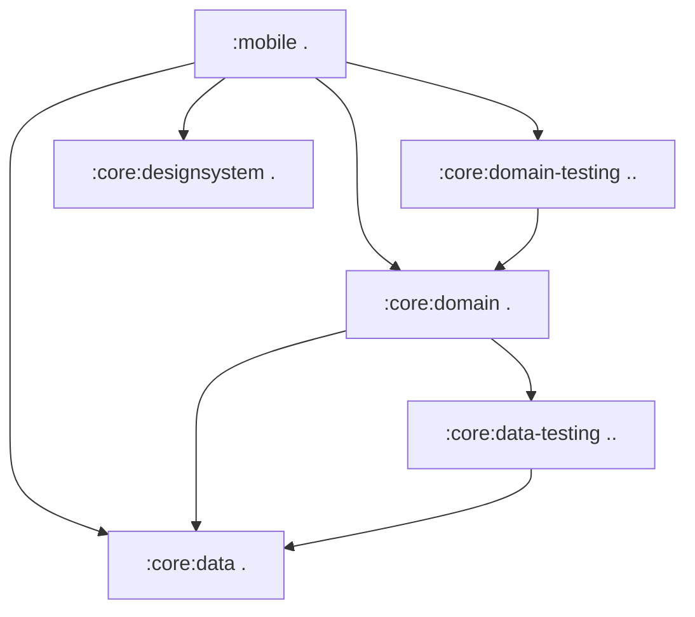
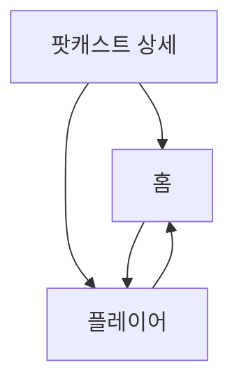

[//]: # (title: Jetpack Compose 앱을 Kotlin Multiplatform으로 마이그레이션하기)

<secondary-label ref="IntelliJ IDEA"/>
<secondary-label ref="Android Studio"/>

<tldr>
<p>이 튜토리얼은 IntelliJ IDEA를 사용하지만, Android Studio에서도 따라 할 수 있습니다.
   두 IDE는 동일한 핵심 기능과 Kotlin Multiplatform 지원을 공유합니다.</p>
</tldr>

이 가이드는 안드로이드 전용 앱을 비즈니스 로직부터 UI까지 전체 스택에 걸쳐 멀티플랫폼으로 마이그레이션하는 과정을 다룹니다.
고급 Compose 샘플을 사용하여 일반적인 과제와 해결 방법을 설명합니다.
커밋 순서를 면밀히 따라가거나, 일반적인 마이그레이션 단계를 훑어보며 관심 있는 부분을 심층적으로 살펴볼 수 있습니다.

시작 앱은 [Jetcaster](https://github.com/android/compose-samples/tree/main/Jetcaster)로, Jetpack Compose로 구축된 안드로이드용 샘플 팟캐스트 앱입니다.
이 샘플은 다음과 같은 기능을 갖춘 완전한 앱입니다.
* 멀티 모듈 구성.
* 안드로이드 리소스 관리.
* 네트워크 및 데이터베이스 액세스.
* Compose Navigation.
* 최신 Material Expressive 컴포넌트.

이러한 모든 기능은 Kotlin Multiplatform과 Compose Multiplatform 프레임워크를 사용하여 크로스 플랫폼 앱으로 전환할 수 있습니다.

안드로이드 앱을 다른 플랫폼에서도 작동하도록 준비하려면 다음 과정을 수행합니다.

1. 프로젝트가 Kotlin Multiplatform(KMP) 마이그레이션에 적합한지 평가하는 방법을 배웁니다.
2. Gradle 모듈을 크로스 플랫폼 모듈과 플랫폼 전용 모듈로 분리하는 방법을 확인합니다.
   Jetcaster의 경우, iOS와 안드로이드에서 별도로 프로그래밍해야 하는 일부 저수준 시스템 호출을 제외하고 대부분의 비즈니스 로직 모듈을 멀티플랫폼으로 만들 수 있었습니다.
3. 빌드 스크립트와 코드를 점진적으로 업데이트하여 최소한의 변경으로 작동 상태를 유지하면서 비즈니스 로직 모듈을 하나씩 멀티플랫폼으로 만드는 과정을 따릅니다.
4. UI 코드가 공유 구현으로 전환되는 과정을 확인합니다.
   Compose Multiplatform을 사용하면 Jetcaster UI 코드의 대부분을 공유할 수 있습니다.
   더 중요한 것은, 화면별로 이 전환을 점진적으로 구현하는 방법을 보게 될 것입니다.

결과물인 앱은 안드로이드, iOS 및 데스크톱에서 실행됩니다.
데스크톱 앱은 UI 동작을 빠르게 반복 수정할 수 있는 방법인 [Compose Hot Reload](compose-hot-reload.md) 예제로도 활용됩니다.

## Kotlin Multiplatform 마이그레이션 체크리스트

KMP 마이그레이션의 주요 장애물은 Java와 Android View입니다.
프로젝트가 이미 Kotlin으로 작성되어 있고 UI에 Jetpack Compose를 사용하고 있다면 마이그레이션 복잡성이 상당히 낮아집니다.

프로젝트나 모듈을 마이그레이션하기 전에 고려해야 할 일반적인 체크리스트는 다음과 같습니다.

1. [Java 코드 변환 또는 격리](#convert-or-isolate-java-code)
2. [Android/JVM 전용 의존성 확인](#check-your-android-jvm-only-dependencies)
3. [모듈화 기술 부채 해결](#catch-up-with-modularization-technical-debt)
4. [Compose로 마이그레이션](#migrate-from-views-to-jetpack-compose)

### Java 코드 변환 또는 격리

원래의 안드로이드 Jetcaster 예제에는 `Objects.hash()` 및 `Uri.encode()`와 같은 Java 전용 호출과 `java.time` 패키지의 광범위한 사용이 포함되어 있습니다.

Kotlin에서 Java를 호출하거나 그 반대로 호출할 수 있지만, Kotlin Multiplatform 모듈에서 공유 코드를 포함하는 `commonMain` 소스 세트에는 Java 코드를 포함할 수 없습니다.
따라서 안드로이드 앱을 멀티플랫폼으로 만들 때는 다음 중 하나를 수행해야 합니다.
* 해당 코드를 `androidMain`에 격리하고 iOS용으로 다시 작성합니다.
* Java 코드를 멀티플랫폼 호환 의존성을 사용하는 Kotlin 코드로 변환합니다.

또 다른 Java 전용 라이브러리인 RxJava는 Jetcaster에서 사용되지 않지만 널리 채택되어 있습니다. RxJava는 비동기 작업을 관리하기 위한 Java 프레임워크이므로, KMP 마이그레이션을 시작하기 전에 `kotlinx-coroutines`로 마이그레이션하는 것이 권장됩니다.

[Java에서 Kotlin으로 마이그레이션하기 위한 가이드](https://kotlinlang.org/docs/java-to-kotlin-idioms-strings.html)와 Java 코드를 자동으로 변환하여 프로세스를 간소화할 수 있는 [IntelliJ IDEA의 헬퍼](https://www.jetbrains.com/help/idea/get-started-with-kotlin.html#convert-java-to-kotlin)가 마련되어 있습니다.

### Android/JVM 전용 의존성 확인

많은 프로젝트, 특히 최신 프로젝트는 Java 코드를 많이 포함하지 않을 수 있지만, 안드로이드 전용 의존성을 가지고 있는 경우가 많습니다.
Jetcaster의 경우, 대안을 찾고 마이그레이션하는 것이 작업의 대부분을 차지했습니다.

중요한 단계는 공유하려는 코드에서 사용되는 의존성 목록을 작성하고 멀티플랫폼 대안이 있는지 확인하는 것입니다.
멀티플랫폼 생태계가 Java 생태계만큼 크지는 않지만 빠르게 확장되고 있습니다.
잠재적인 옵션을 평가하기 위한 시작점으로 [klibs.io](https://klibs.io)를 활용해 보세요.

Jetcaster의 경우, 해당 라이브러리 목록은 다음과 같았습니다.

* 인기 있는 의존성 주입(DI) 솔루션인 Dagger/Hilt ([Koin](https://insert-koin.io/)으로 교체됨)

  Koin은 신뢰할 수 있는 멀티플랫폼 DI 프레임워크입니다. Koin이 요구 사항을 충족하지 못하거나 코드 재작성 범위가 너무 넓다면 다른 솔루션도 있습니다.
  [Metro](https://zacsweers.github.io/metro/latest/) 프레임워크도 멀티플랫폼을 지원합니다.
  Metro는 Dagger 및 Kotlin Inject를 포함한 [다른 어노테이션과의 상호 운용성](https://zacsweers.github.io/metro/latest/interop/)을 지원하여 마이그레이션을 용이하게 할 수 있습니다.
* 이미지 로딩 라이브러리인 Coil 2 ([버전 3에서 멀티플랫폼이 됨](https://coil-kt.github.io/coil/upgrading_to_coil3/)).
* RSS 프레임워크인 ROME (멀티플랫폼용 [RSS Parser](https://github.com/prof18/RSS-Parser)로 교체됨).
* 테스트 프레임워크인 JUnit ([kotlin-test](https://kotlinlang.org/api/core/kotlin-test/)로 교체됨).

작업을 진행하다 보면 아직 크로스 플랫폼 구현이 존재하지 않아 멀티플랫폼에서 작동이 중단되는 작은 코드 조각을 발견할 수 있습니다.
예를 들어, Jetcaster에서는 Compose UI 라이브러리의 일부인 `AnnotatedString.fromHtml()` 함수를 서드파티 멀티플랫폼 의존성으로 교체해야 했습니다.

이러한 모든 사례를 사전에 식별하기는 어려우므로, 마이그레이션 과정에서 교체 대상을 찾거나 코드를 다시 작성할 준비를 해야 합니다.
이것이 바로 우리가 가능한 한 작은 단계로 하나의 작동 상태에서 다음 상태로 이동하는 방법을 보여주는 이유입니다. 그렇게 하면 많은 부분이 동시에 변경될 때 단일 이슈로 인해 전체 진행이 중단되지 않습니다.

### 모듈화 기술 부채 해결

KMP를 사용하면 모듈별, 화면별로 선택적으로 멀티플랫폼 상태로 마이그레이션할 수 있습니다.
하지만 이 과정이 순조롭게 진행되려면 모듈 구조가 명확하고 조작하기 쉬워야 합니다.
모듈 구조화에 권장되는 다른 관례와 함께 [높은 응집도, 낮은 결합도 원칙(high cohesion, low coupling principle)](https://developer.android.com/topic/modularization/patterns#cohesion-coupling)에 따라 모듈화를 평가해 보세요.

일반적인 조언은 다음과 같이 요약할 수 있습니다.

* 앱 기능의 서로 다른 부분을 피처(feature) 모듈로 분리하고, 데이터에 액세스하고 처리하는 데이터 모듈과 피처 모듈을 분리하여 유지합니다.
* 특정 도메인의 데이터 및 비즈니스 로직을 모듈 내에 캡슐화합니다. 관련 데이터 유형을 함께 그룹화하고, 관련 없는 도메인 간에 로직이나 데이터를 섞지 마십시오.
* Kotlin [가시성 수정자(visibility modifiers)](https://kotlinlang.org/docs/visibility-modifiers.html)를 사용하여 모듈의 구현 세부 정보 및 데이터 소스에 대한 외부 액세스를 방지합니다.

구조가 명확하다면 프로젝트에 모듈이 많더라도 개별적으로 KMP로 마이그레이션할 수 있습니다. 이 방식이 전체를 한꺼번에 다시 작성하는 것보다 훨씬 원활합니다.

### Migrate from Views to Jetpack Compose

Kotlin Multiplatform은 크로스 플랫폼 UI 코드를 생성하는 방법으로 Compose Multiplatform을 제공합니다.
Compose Multiplatform으로 원활하게 전환하려면 UI 코드가 이미 Compose로 작성되어 있어야 합니다. 현재 View를 사용하고 있다면, 새로운 패러다임과 프레임워크를 사용하여 해당 코드를 다시 작성해야 합니다.
당연히 이 작업은 미리 완료해 두는 것이 더 쉽습니다.

구글은 오랫동안 Compose를 발전시키고 풍부하게 만들어 왔습니다. 가장 일반적인 시나리오에 대한 도움을 얻으려면 [Jetpack Compose 마이그레이션 가이드](https://developer.android.com/develop/ui/compose/migrate)를 확인하거나 [AI를 활용한 마이그레이션 에이전트 스킬](https://github.com/android/skills/blob/main/jetpack-compose/migration/migrate-xml-views-to-jetpack-compose/SKILL.md)을 사용해 보세요.
View-Compose 상호 운용성을 사용할 수도 있지만, Java 코드와 마찬가지로 이 코드는 `androidMain` 소스 세트에 격리되어야 합니다.

## 앱을 멀티플랫폼으로 만드는 단계

초기 준비 및 평가가 완료된 후의 일반적인 프로세스는 다음과 같습니다.

1. [멀티플랫폼 라이브러리로 마이그레이션](#migrate-to-multiplatform-libraries)

2. [비즈니스 로직을 KMP로 전환](#migrating-the-business-logic).
   1. 의존하는 다른 모듈이 가장 적은 모듈부터 시작합니다.
   2. 해당 모듈을 KMP 모듈 구조로 마이그레이션하고 멀티플랫폼 라이브러리를 사용하도록 변경합니다.
   3. 의존성 트리에서 다음 모듈을 선택하고 프로세스를 반복합니다.
   
   {type="alpha-lower"}
3. [UI 코드를 Compose Multiplatform으로 전환](#migrating-to-multiplatform-ui).
   모든 비즈니스 로직이 이미 멀티플랫폼화되었다면 Compose Multiplatform으로의 전환은 비교적 간단해집니다.
   Jetcaster의 경우, 화면별로 마이그레이션하는 점진적 마이그레이션을 보여줍니다. 또한 일부 화면은 마이그레이션되고 일부는 마이그레이션되지 않았을 때 내비게이션 그래프를 조정하는 방법도 보여줍니다.

예제를 단순화하기 위해, 멀티플랫폼 코드와 상호 작용하지 않으며 마이그레이션할 필요가 없는 안드로이드 전용 Glance, TV 및 웨어러블 타겟은 처음부터 제거했습니다.

> 아래 단계에 대한 설명을 따라가거나, [최종 멀티플랫폼 Jetcaster 프로젝트가 포함된 저장소](https://github.com/kotlin-hands-on/jetcaster-kmp-migration/commits/main/)로 바로 이동할 수 있습니다.
> 각 커밋은 안드로이드 전용에서 완전한 Kotlin Multiplatform으로의 점진적 마이그레이션 가능성을 보여주기 위해 앱의 작동 상태를 나타냅니다.
> 
{style="tip"}

### 환경 준비 {collapsible="true"}

마이그레이션 단계를 따라하거나 제공된 샘플을 로컬 머신에서 실행하려면 환경을 준비해야 합니다.

1. 퀵스타트 가이드에서 [Kotlin Multiplatform 환경 설정](quickstart.md#set-up-the-environment) 지침을 완료합니다.

   > iOS 애플리케이션을 빌드하고 실행하려면 macOS가 설치된 Mac이 필요합니다.
   > 이는 Apple의 요구 사항입니다.
   >
   {style="note"}

2. IntelliJ IDEA 또는 Android Studio에서 샘플 저장소를 클론하여 새 프로젝트를 생성합니다.

   ```text
   git@github.com:kotlin-hands-on/jetcaster-kmp-migration.git
   ```

## 멀티플랫폼 라이브러리로 마이그레이션

앱 기능의 대부분이 의존하는 몇 가지 라이브러리가 있습니다.
멀티플랫폼 지원을 위해 모듈을 구성하기 전에 이러한 라이브러리 사용을 KMP 호환 방식으로 전환할 수 있습니다.

* ROME 툴 파서에서 멀티플랫폼 RSS Parser로 마이그레이션합니다.
  이 과정에서 날짜 처리 방식과 같은 API 간의 차이점을 고려해야 합니다.

  > [결과 커밋](https://github.com/kotlin-hands-on/jetcaster-kmp-migration/commit/703d670ed82656c761ed2180dc5118b89fc9c805)을 확인하세요.
* 안드로이드 전용 진입점 모듈인 `mobile`을 포함하여 앱 전체에서 Dagger/Hilt를 Koin 4로 마이그레이션합니다.
  Koin 방식에 따라 의존성 주입 로직을 다시 작성해야 하지만, `*.di` 패키지 외부의 코드는 거의 영향을 받지 않습니다.

  Hilt에서 마이그레이션할 때는 이전에 생성된 Hilt 코드에서 컴파일 오류가 발생하지 않도록 `/build` 디렉토리를 삭제해야 합니다.

  > [결과 커밋](https://github.com/kotlin-hands-on/jetcaster-kmp-migration/commit/9c59808a5e3d74e6a55cd357669b24f77bbcd9c8)을 확인하세요.

* Coil 2에서 Coil 3으로 업그레이드합니다. 이 역시 수정된 코드는 비교적 적습니다.

  > [결과 커밋](https://github.com/kotlin-hands-on/jetcaster-kmp-migration/commit/826fdd2b87a516d2f0bfe6b13ab8e989a065ee7a)을 확인하세요.

* JUnit에서 `kotlin-test`로 마이그레이션합니다. 이는 테스트가 있는 모든 모듈에 해당되지만, `kotlin-test`의 호환성 덕분에 마이그레이션을 구현하는 데 필요한 변경 사항은 매우 적습니다.

  > [결과 커밋](https://github.com/kotlin-hands-on/jetcaster-kmp-migration/commit/82109598dbfeda9dceecc10b40487f80639c5db4)을 확인하세요.

### Java 의존적인 코드를 Kotlin으로 재작성

이제 주요 라이브러리가 모두 멀티플랫폼화되었으므로 Java 전용 의존성을 제거해야 합니다.

Java 전용 호출의 간단한 예는 `Objects.hash()`이며, 이를 Kotlin으로 다시 구현했습니다.
[결과 커밋](https://github.com/kotlin-hands-on/jetcaster-kmp-migration/commit/29341a430e6c98a4f7deaed1d6863edb98e25659)을 확인하세요.

하지만 Jetcaster 예제에서 코드를 직접 공통화(commonizing)하는 데 가장 큰 걸림돌은 `java.time` 패키지입니다.
팟캐스트 앱의 거의 모든 곳에서 시간 계산이 사용되므로, KMP 코드 공유의 이점을 진정으로 누리려면 해당 코드를 `kotlin.time` 및 `kotlinx-datetime`으로 마이그레이션해야 합니다.

시간과 관련된 모든 재작성 작업은 [이 커밋](https://github.com/kotlin-hands-on/jetcaster-kmp-migration/commit/0cb5b31964991fdfaed7615523bb734b22f9c755)에 모여 있습니다.

## 비즈니스 로직 마이그레이션

주요 의존성이 멀티플랫폼화되면 마이그레이션을 시작할 모듈을 선택할 수 있습니다.
프로젝트 모듈의 의존성 그래프를 그려보는 것이 유용할 수 있습니다.
[Junie](https://www.jetbrains.com//junie/)와 같은 AI 에이전트가 이를 쉽게 도와줄 수 있습니다.
For Jetcaster, the simplified graph of module dependencies looked like this:


```mermaid
flowchart TB
  %% Style for modules
  %% classDef Module fill:#e6f7ff,stroke:#0086c9,stroke-width:1px,color:#003a52

  %% Modules
  M_MOBILE[":mobile ."]
  M_CORE_DATA[":core:data ."]
  M_CORE_DATA_TESTING[":core:data-testing .."]
  M_CORE_DOMAIN[":core:domain ."]
  M_CORE_DOMAIN_TESTING[":core:domain-testing .."]
  M_CORE_DESIGNSYSTEM[":core:designsystem ."]

  class M_MOBILE,M_CORE_DATA,M_CORE_DATA_TESTING,M_CORE_DOMAIN,M_CORE_DOMAIN_TESTING,M_CORE_DESIGNSYSTEM Module

  %% Internal dependencies between modules
  %% :mobile
  M_MOBILE --> M_CORE_DATA
  M_MOBILE --> M_CORE_DESIGNSYSTEM
  M_MOBILE --> M_CORE_DOMAIN
  M_MOBILE --> M_CORE_DOMAIN_TESTING

  %% :core:domain
  M_CORE_DOMAIN --> M_CORE_DATA
  M_CORE_DOMAIN --> M_CORE_DATA_TESTING

  %% :core:data-testing
  M_CORE_DATA_TESTING --> M_CORE_DATA

  %% :core:domain-testing
  M_CORE_DOMAIN_TESTING --> M_CORE_DOMAIN

  %% :core:designsystem and :core:data have no intra-project dependencies
```

이는 예를 들어 다음과 같은 순서를 제안합니다.

1. `:core:data`
2. `:core:data-testing`
3. `:core:domain`
4. `:core:domain-testing`
5. `:core:designsystem` — 이 모듈은 모듈 의존성이 없지만 UI 헬퍼 모듈이므로, UI 코드를 공유 모듈로 옮길 준비가 되었을 때 다룹니다.

### :core:data 마이그레이션

#### :core:data 구성 및 데이터베이스 코드 마이그레이션

Jetcaster는 데이터베이스 라이브러리로 [Room](https://developer.android.com/training/data-storage/room)을 사용합니다.
Room은 버전 2.7.0부터 멀티플랫폼을 지원하므로, 플랫폼 간에 작동하도록 코드만 업데이트하면 됩니다.
이 시점에서는 아직 iOS 앱이 없지만, 나중에 iOS 진입점을 설정할 때 호출될 플랫폼 전용 코드를 이미 작성할 수 있습니다.
또한 나중에 새로운 진입점을 추가할 준비를 하기 위해 다른 플랫폼(iOS 및 JVM)에 대한 타겟 구성을 추가합니다.

Room의 멀티플랫폼 버전으로 전환하기 위해 안드로이드의 [일반 설정 가이드](https://developer.android.com/kotlin/multiplatform/room)를 따랐습니다.

> [결과 커밋](https://github.com/kotlin-hands-on/jetcaster-kmp-migration/commit/ab22fb14e9129087b310a989eb08bcc77b0e12e8)을 확인하세요.

* `androidMain`, `commonMain`, `iosMain`, `jvmMain` 소스 세트를 포함하는 새로운 코드 구조에 주목하세요.
* 코드 변경의 대부분은 Room을 위한 expect/actual 구조 생성과 이에 따른 DI 변경 사항입니다.
* 안드로이드에서만 인터넷 연결을 확인한다는 사실을 보완하는 새로운 `OnlineChecker` 인터페이스가 있습니다. [iOS 앱을 타겟으로 추가](#add-an-ios-entry-point)하기 전까지 온라인 체커는 스텁(stub)으로 유지됩니다.

`:core:data-testing` 모듈도 즉시 멀티플랫폼으로 재구성할 수 있습니다.
[결과 커밋](https://github.com/kotlin-hands-on/jetcaster-kmp-migration/commit/098a72a25f07958b90ae8778081ab1c7f2988543)을 확인하세요.
Gradle 구성을 업데이트하고 소스 세트 폴더 구조로 이동하기만 하면 됩니다.

#### :core:domain 구성 및 마이그레이션

모든 의존성이 이미 고려되고 멀티플랫폼으로 마이그레이션되었다면, 코드를 이동하고 모듈을 재구성하기만 하면 됩니다.

> [결과 커밋](https://github.com/kotlin-hands-on/jetcaster-kmp-migration/commit/a8376dc2f0eb29ed8b67c929970dcbe505768612)을 확인하세요.

`:core:data-testing`과 유사하게 `:core:domain-testing` 모듈도 쉽게 멀티플랫폼으로 업데이트할 수 있습니다.

> [결과 커밋](https://github.com/kotlin-hands-on/jetcaster-kmp-migration/commit/a46f0a98b8d95656e664dca0d95da196034f2ec3)을 확인하세요.

#### :core:designsystem 구성 및 마이그레이션

UI 코드만 마이그레이션하면 되는 상황에서, 글꼴 리소스와 타이포그래피가 포함된 `:core:designsystem` 모듈의 전환을 시작합니다.
KMP 모듈 구성 및 `commonMain` 소스 세트 생성 외에도, `MaterialExpressiveTheme`의 `JetcasterTypography` 인수를 컴포저블로 만들어 멀티플랫폼 글꼴에 대한 호출을 캡슐화했습니다.

> [결과 커밋](https://github.com/kotlin-hands-on/jetcaster-kmp-migration/commit/4aa92e3f38d06aa64444163d865753e47e9b2a97)을 확인하세요.

## UI 코드를 멀티플랫폼으로 마이그레이션

모든 `:core` 로직이 멀티플랫폼화되면 UI도 공통 코드로 옮기기 시작할 수 있습니다.
다시 말하지만, 완전한 마이그레이션을 목표로 하므로 아직 iOS 타겟을 추가하지는 않고, 안드로이드 앱이 공통 코드에 배치된 Compose 부분과 잘 작동하는지만 확인합니다.

우리가 따를 로직을 시각화하기 위해, Jetcaster 화면 간의 관계를 나타내는 단순화된 다이어그램은 다음과 같습니다.

<!-- The deep link connections and the supporting pane are commented out for the sake of brevity but may be interesting. --> 


```mermaid
---
config:
  labelBackground: '#ded'
---
flowchart TB
  %% Nodes (plain labels, no quotes/parentheses/braces)
  %% Start[Start .]
  Home[홈]
  Player[플레이어]
  PodcastDetailsRoute[팟캐스트 상세]
  %% DeepLinkEpisodes[Deep link to player]
  %% DeepLinkPodcasts[Deep link to podcast]

  %% Home’s supporting pane represented as a subgraph
  %% subgraph HomeSupportingPane
    %% direction LR
    %% HomeMain[Home main content]
    %% PodcastDetailsPane[PodcastDetails in supporting pane]
  %% end

  %% Start and primary navigation
  %% Start --> Home

  %% Home main actions
  Home --> Player
  %% Home -->|Select podcast| PodcastDetailsPane

  %% From PodcastDetails (supporting pane) actions
  %% PodcastDetailsPane --> Player
  %% PodcastDetailsPane --> Home

  %% Standalone routes (deep links)
  %% DeepLinkEpisodes --> Player
  %% DeepLinkPodcasts --> PodcastDetailsRoute

  %% From standalone PodcastDetails route
  PodcastDetailsRoute --> Player
  PodcastDetailsRoute --> Home

  %% Back behavior from Player (returns to previous context)
  Player --> Home
  %% Player -->|Back| PodcastDetailsPane
```

먼저, 공통으로 만들 UI 코드를 위해 공유 UI 모듈을 생성했습니다.

> [결과 커밋](https://github.com/kotlin-hands-on/jetcaster-kmp-migration/commit/a48bb1281c63a235fcc1d80e2912e75ddd5cbed4)을 확인하세요.

UI를 점진적으로 마이그레이션하는 것을 보여주기 위해 화면별로 이동하겠습니다.
각 단계는 앱이 작동하는 상태인 커밋으로 끝나며, 완전히 공유된 UI에 한 걸음 더 가까워집니다.

위의 화면 다이어그램에 따라 팟캐스트 상세 화면부터 시작했습니다.

1. 마이그레이션된 화면은 여전히 안드로이드 모듈에 있는 Compose 테마와 함께 작동합니다.
   수행해야 할 작업은 다음과 같습니다.
   1. ViewModel 및 해당 DI 코드를 업데이트합니다.
   2. 리소스 및 리소스 접근자(accessor)를 업데이트합니다.
      멀티플랫폼 리소스 라이브러리는 안드로이드 경험과 매우 유사하지만, 해결해야 할 몇 가지 눈에 띄는 차이점이 있습니다.
      * 리소스 파일 처리 방식에 약간의 차이가 있습니다.
        예를 들어 리소스 디렉토리 이름은 `res` 대신 `composeResources`여야 하며, 안드로이드 XML 파일의 `@android:color` 사용은 색상 16진수 코드로 대체되어야 합니다.
        자세한 내용은 [멀티플랫폼 리소스](compose-multiplatform-resources.md) 설명서를 참조하세요.
      * 생성된 리소스 접근자 클래스 이름은 `Res`입니다(안드로이드의 `R`과 대조됨).
        리소스 파일을 이동하고 조정한 후 접근자를 다시 생성하고 UI 코드의 각 리소스 임포트를 교체합니다.
      
   > [결과 커밋](https://github.com/kotlin-hands-on/jetcaster-kmp-migration/commit/801f044e56224398d812eb8fd1c1d46b0e9b0087)을 확인하세요.

2. Compose 테마를 마이그레이션합니다. 또한 컬러 스킴의 플랫폼별 구현을 위한 스텁(stub)을 제공합니다.

   > [결과 커밋](https://github.com/kotlin-hands-on/jetcaster-kmp-migration/commit/07be9bba96a0dd91e4e0761075898b3d5272ca57)을 확인하세요.

3. 홈 화면 작업을 계속합니다.
   1. ViewModel을 마이그레이션합니다.
   2. 공유 UI 모듈의 `commonMain`으로 코드를 이동합니다.
   3. 리소스 참조를 이동하고 조정합니다.

   > [결과 커밋](https://github.com/kotlin-hands-on/jetcaster-kmp-migration/commit/ad0012becc527c1c8cb354bb73b5da9741733a1f)을 확인하세요.

4. 마이그레이션을 세분화하는 또 다른 방법을 보여주기 위해 내비게이션을 부분적으로 마이그레이션했습니다.
   공통 코드의 화면과 안드로이드 네이티브 화면을 결합할 수 있습니다.
   `PlayerScreen`은 여전히 `mobile` 모듈에 위치하며, 안드로이드 진입점에 대해서만 내비게이션에 포함됩니다.
   이는 상위 멀티플랫폼 내비게이션에 주입됩니다.

   > [결과 커밋](https://github.com/kotlin-hands-on/jetcaster-kmp-migration/commit/2e0107dd4d217346b38cc9b3d5180fedcc12fb8b)을 확인하세요.
   
5. 남은 모든 것을 이동하여 마무리합니다.
   * 내비게이션의 나머지 부분을 공통 코드로 이동합니다 ([결과 커밋](https://github.com/kotlin-hands-on/jetcaster-kmp-migration/commit/48f13acc02d3630871e3671114f736cb3db51424)).
   * 마지막 화면인 `PlayerScreen`을 Compose Multiplatform으로 마이그레이션합니다 ([결과 커밋](https://github.com/kotlin-hands-on/jetcaster-kmp-migration/commit/60d5a2f96943705c869b5726622e873925fc2651)).

이제 모든 UI 코드가 공통화되었으므로, 이를 사용하여 다른 플랫폼용 앱을 빠르게 만들 수 있습니다.

## 선택 사항: JVM 진입점 추가

이 선택적 단계는 다음을 돕습니다.
* 완전히 멀티플랫폼화된 안드로이드 앱에서 데스크톱 앱을 만드는 데 얼마나 적은 노력이 드는지 보여줍니다.
* Compose UI를 빠르게 반복 수정하기 위한 도구로서, 현재 데스크톱 타겟에서만 지원되는 [Compose Hot Reload](compose-hot-reload.md)를 소개합니다.

모든 UI 코드가 공유된 상태에서 데스크톱 JVM 앱을 위한 새로운 진입점을 추가하는 것은 `main()` 함수를 만들고 이를 DI 프레임워크와 통합하는 문제일 뿐입니다.

> [결과 커밋](https://github.com/kotlin-hands-on/jetcaster-kmp-migration/commit/af033dbf39188ef3991466727d155b988c30f1d3)을 확인하세요.

## iOS 진입점 추가

iOS 진입점에는 KMP 코드와 연결된 iOS 프로젝트가 필요합니다.

KMP 프로젝트에서 iOS 앱을 생성하고 임베딩하는 방법은 [앱을 멀티플랫폼으로 만들기](https://kotlinlang.org/docs/multiplatform/multiplatform-integrate-in-existing-app.html#create-an-ios-project-in-xcode) 튜토리얼에서 다룹니다.

> 여기서 사용하는 직접 통합 방식이 가장 간단하지만, 프로젝트에 가장 적합한 방식은 아닐 수 있습니다. 다양한 대안을 이해하려면 [iOS 통합 방법 개요](multiplatform-ios-integration-overview.md)를 참조하세요.
>
{style="note"}

iOS 앱에서는 Swift UI 코드를 Compose Multiplatform 코드와 연결해야 합니다.
iOS 앱에 `JetcasterApp` 컴포저블이 포함된 `UIViewController`를 반환하는 함수를 추가하여 이를 수행합니다.

> 추가된 iOS 프로젝트와 그에 따른 코드 업데이트를 [결과 커밋](https://github.com/kotlin-hands-on/jetcaster-kmp-migration/commit/2b2c412596e199b140089efc73de03e46f5c1d77)에서 확인하세요.

## 앱 실행

마이그레이션된 앱의 최종 상태에는 초기 안드로이드 모듈(`mobile`)과 새로운 iOS 앱에 대한 실행 구성이 있습니다.
데스크톱 앱은 해당 `main.kt` 파일에서 실행할 수 있습니다.
모두 실행하여 공유 UI가 모든 플랫폼에서 어떻게 작동하는지 확인해 보세요!

## 최종 요약

이 마이그레이션에서는 순수 안드로이드 앱을 Kotlin Multiplatform 앱으로 전환하기 위한 일반적인 단계를 따랐습니다.

* 멀티플랫폼 의존성으로 전환하거나, 불가능한 경우 코드를 다시 작성합니다.
* 다른 플랫폼에서 사용 가능한 안드로이드 모듈을 하나씩 멀티플랫폼 모듈로 변환합니다.
* Compose Multiplatform 코드를 위한 공유 UI 모듈을 생성하고, 화면별로 공유 UI 코드로 전환합니다.
* 다른 플랫폼을 위한 진입점을 생성합니다.

이 순서가 절대적인 것은 아닙니다. 다른 플랫폼을 위한 진입점부터 시작하여, 제대로 작동할 때까지 그 아래의 기초를 점진적으로 구축할 수도 있습니다.
Jetcaster 예제에서는 단계별로 따라하기 쉬운 명확한 변경 순서를 선택했습니다.

가이드나 제시된 솔루션에 대한 의견이 있으시면 [YouTrack](https://kotl.in/issue)에서 이슈를 생성해 주세요.