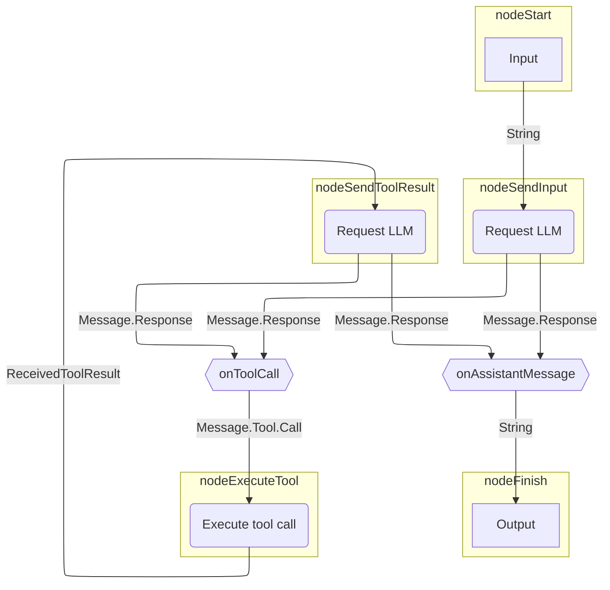
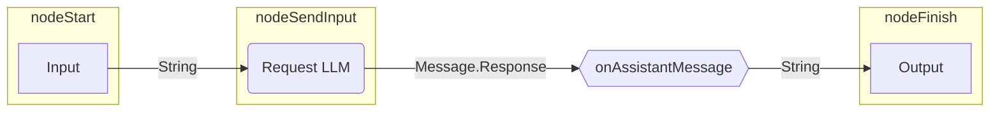

# 그래프 기반 에이전트

그래프 기반 에이전트를 사용하면 동작을 명시적인 상태 머신(state machine)으로 모델링할 수 있습니다.
그래프 전략의 노드(node)는 액션(LLM 호출, 도구 실행)을 나타내고
에지(edge)는 노드 간의 데이터 흐름을 나타냅니다.

그래프 기반 에이전트의 주요 장점은 다음과 같습니다.

- 시각화하기 쉬움
- 상태 지속성(State persistence)
- 조합 가능한 아키텍처(Composable architecture)

??? note "사전 요구 사항"

    --8<-- "quickstart-snippets.md:prerequisites"

    --8<-- "quickstart-snippets.md:dependencies"

    --8<-- "quickstart-snippets.md:api-key"

    이 페이지의 예제는 Ollama를 통해 로컬에서 Llama 3.2를 실행하고 있다고 가정합니다.

이 페이지에서는 [기본 에이전트](basic-agents.md)에서 사용되는 전략 그래프를 다시 만드는 방법을 설명합니다.
이 전략은 LLM에 요청을 보낸 다음, (LLM이 어시스턴트 메시지로 응답한 경우) 응답을 출력하거나
(LLM이 도구 호출을 요청한 경우) 도구를 실행합니다.
도구 호출의 경우, 에이전트는 도구 결과를 LLM에 보내고
다시 응답을 출력하거나 도구를 실행합니다.

다음은 전략 그래프의 그림입니다.



## 전략 그래프 빌드하기

Koog에서는 [`AIAgentGraphStrategyBuilder`](https://api.koog.ai/agents/agents-core/ai.koog.agents.core.dsl.builder/-a-i-agent-graph-strategy-builder/index.html)를 사용하여 전략을 구현합니다.
모든 노드에 입력 및 출력 타입이 있는 것과 마찬가지로,
전략 전체로서도 입력 및 출력 타입을 정의합니다.
이 예제에서는 입력 및 출력 타입이 문자열(string)이라고 가정하며,
이는 이 전략을 구현하는 에이전트가 문자열을 기대하고 문자열을 반환함을 의미합니다.

전략을 생성하려면 입력 및 출력 타입을 두 개의 제네릭으로 받는 [`strategy()`](https://api.koog.ai/agents/agents-core/ai.koog.agents.core.dsl.builder/strategy.html) 함수를 사용하고,
전략의 고유 식별자를 제공한 뒤 노드와 에지를 정의합니다.

<!--- INCLUDE
import ai.koog.agents.core.dsl.builder.forwardTo
import ai.koog.agents.core.dsl.builder.strategy
import ai.koog.agents.core.dsl.extension.*
-->
```kotlin
val calculatorAgentStrategy = strategy<String, String>("Simple calculator") {
    val nodeSendInput by nodeLLMRequest()
    val nodeExecuteTool by nodeExecuteTool()
    val nodeSendToolResult by nodeLLMSendToolResult()
    
    edge(nodeStart forwardTo nodeSendInput)
    edge(nodeSendInput forwardTo nodeFinish onAssistantMessage { true })
    edge(nodeSendInput forwardTo nodeExecuteTool onToolCall { true })
    edge(nodeExecuteTool forwardTo nodeSendToolResult)
    edge(nodeSendToolResult forwardTo nodeFinish onAssistantMessage { true })
    edge(nodeSendToolResult forwardTo nodeExecuteTool onToolCall { true })
}
```
<!--- KNIT example-graph-agents-01.kt -->

이 예제는 [사전 정의된 노드](../nodes-and-components.md)만 사용하지만,
[커스텀 노드](../custom-nodes.md)를 생성할 수도 있습니다.

모든 전략 그래프는 [에지(edge)](../custom-strategy-graphs.md#edges)로 연결된 `nodeStart`에서 `nodeFinish`까지의 경로를 가져야 합니다.
에지는 특정 에지를 따라갈 시점을 결정하는 조건을 가질 수 있습니다.
또한 에지는 이전 노드의 출력을 다음 노드로 전달하기 전에 변환할 수도 있습니다.
이는 출력과 입력 타입이 일치하지 않는 노드들을 연결하는 데 필요합니다.

이전 예제에서 `onToolCall { true }`는 이전 노드가 도구 호출 `Message.Tool.Call`을 반환한 경우에만
해당 에지를 따라간다는 것을 의미합니다.

`onAssistantMessage { true }`를 사용하면 이전 노드가 어시스턴트 메시지 `Message.Assistant`를 반환한 경우에만
에지를 따라갑니다. 이 함수는 또한 어시스턴트 메시지의 내용을 추출하여,
`nodeFinish`가 문자열을 기대하기 때문에 `Message.Assistant`를 `String`으로 효과적으로 변환합니다.

!!! tip

    `onAssistantMessage {true}` 대신 다음과 같이 할 수 있습니다.

    ```kotlin
    onIsInstance(Message.Assistant::class) transformed { it.content }
    ```

    또는:

    ```kotlin
    onCondition { it is Message.Assistant } transformed { it.asAssistantMessage().content }
    ```

## 에이전트 생성 및 실행

이 전략으로 에이전트 인스턴스를 생성하고 실행해 보겠습니다.

<!--- CLEAR -->
<!--- INCLUDE
import ai.koog.agents.core.agent.AIAgent
import ai.koog.agents.core.dsl.builder.forwardTo
import ai.koog.agents.core.dsl.builder.strategy
import ai.koog.agents.core.dsl.extension.*
import ai.koog.agents.core.dsl.extension.nodeExecuteTool
import ai.koog.agents.core.dsl.extension.nodeLLMRequest
import ai.koog.agents.core.dsl.extension.nodeLLMSendToolResult
import ai.koog.prompt.executor.llms.all.simpleOllamaAIExecutor
import ai.koog.prompt.executor.ollama.client.OllamaModels
import kotlinx.coroutines.runBlocking
-->
```kotlin
val calculatorAgentStrategy = strategy<String, String>("Simple calculator") {
    val nodeSendInput by nodeLLMRequest()
    val nodeExecuteTool by nodeExecuteTool()
    val nodeSendToolResult by nodeLLMSendToolResult()

    edge(nodeStart forwardTo nodeSendInput)
    edge(nodeSendInput forwardTo nodeFinish onAssistantMessage { true })
    edge(nodeSendInput forwardTo nodeExecuteTool onToolCall { true })
    edge(nodeExecuteTool forwardTo nodeSendToolResult)
    edge(nodeSendToolResult forwardTo nodeFinish onAssistantMessage { true })
    edge(nodeSendToolResult forwardTo nodeExecuteTool onToolCall { true })
}

val mathAgent = AIAgent(
    promptExecutor = simpleOllamaAIExecutor(),
    llmModel = OllamaModels.Meta.LLAMA_3_2,
    strategy = calculatorAgentStrategy
)

fun main() = runBlocking {
    val result = mathAgent.run("Multiply 3 by 4, then multiply the result by 5, then add 10, then add 123.")
    println(result)
}
```
<!--- KNIT example-graph-agents-02.kt -->

이 에이전트를 실행하면 다음과 같은 응답이 출력됩니다.

```text
To calculate this, I'll follow the order of operations:

1. Multiply 3 by 4: 3 * 4 = 12
2. Multiply the result by 5: 12 * 5 = 60
3. Add 10: 60 + 10 = 70
4. Add 123: 70 + 123 = 193

The final answer is 193.
```

하지만 이 에이전트에는 도구가 없기 때문에 LLM은 도구 호출을 반환하지 않고
단순히 전체 답변을 생성합니다.
실제로는 다음과 같은 과정이 일어납니다.



이 경우에는 결과가 정확하더라도, 답변은 기본 LLM의 산술 능력에 의존하게 됩니다.
계산이 정확한지 확인하려면 에이전트에 수학 도구를 제공해야 합니다.
그러면 LLM은 계산을 결정론적(deterministically)으로 수행하는 도구를 호출하기로 결정할 수 있습니다.

## 도구 추가하기

수학 연산을 수행하기 위한 [도구](../tools-overview.md)를 정의하고 [ToolRegistry](https://api.koog.ai/agents/agents-tools/ai.koog.agents.core.tools/-tool-registry/index.html)에 추가합니다.

<!--- INCLUDE
import ai.koog.agents.core.tools.ToolRegistry
import ai.koog.agents.core.tools.annotations.LLMDescription
import ai.koog.agents.core.tools.annotations.Tool
import ai.koog.agents.core.tools.reflect.ToolSet
import ai.koog.agents.core.tools.reflect.tools
-->
```kotlin
@LLMDescription("Tools for performing math operations")
class MathTools : ToolSet {
    @Tool
    @LLMDescription("Adds two numbers and returns the result")
    fun add(a: Int, b: Int): Int {
        // 꼭 필요한 것은 아니지만, 콘솔 출력에서 도구 호출을 확인하는 데 도움이 됩니다.
        println("Adding $a and $b...")
        return a + b
    }
    @Tool
    @LLMDescription("Multiplies two numbers and returns the result")
    fun multiply(a: Int, b: Int): Int {
        // 꼭 필요한 것은 아니지만, 콘솔 출력에서 도구 호출을 확인하는 데 도움이 됩니다.
        println("Multiplying $a and $b...")
        return a * b
    }
}

val toolRegistry = ToolRegistry {
    tools(MathTools())
}
```
<!--- KNIT example-graph-agents-03.kt -->

에이전트 구성에 도구 레지스트리를 추가합니다.

<!--- INCLUDE
import ai.koog.agents.core.agent.AIAgent
import ai.koog.agents.core.dsl.builder.forwardTo
import ai.koog.agents.core.dsl.builder.strategy
import ai.koog.agents.core.dsl.extension.*
import ai.koog.agents.core.dsl.extension.nodeExecuteTool
import ai.koog.agents.core.dsl.extension.nodeLLMRequest
import ai.koog.agents.core.dsl.extension.nodeLLMSendToolResult
import ai.koog.agents.core.tools.ToolRegistry
import ai.koog.agents.core.tools.annotations.LLMDescription
import ai.koog.agents.core.tools.annotations.Tool
import ai.koog.agents.core.tools.reflect.ToolSet
import ai.koog.agents.core.tools.reflect.tools
import ai.koog.prompt.executor.llms.all.simpleOllamaAIExecutor
import ai.koog.prompt.executor.ollama.client.OllamaModels
import kotlinx.coroutines.runBlocking

@LLMDescription("Tools for performing math operations")
class MathTools : ToolSet {
    @Tool
    @LLMDescription("Adds two numbers and returns the result")
    fun add(a: Int, b: Int): Int {
        // 꼭 필요한 것은 아니지만, 콘솔 출력에서 도구 호출을 확인하는 데 도움이 됩니다.
        println("Adding $a and $b...")
        return a + b
    }
    @Tool
    @LLMDescription("Multiplies two numbers and returns the result")
    fun multiply(a: Int, b: Int): Int {
        // 꼭 필요한 것은 아니지만, 콘솔 출력에서 도구 호출을 확인하는 데 도움이 됩니다.
        println("Multiplying $a and $b...")
        return a * b
    }
}

val toolRegistry = ToolRegistry {
    tools(MathTools())
}

val calculatorAgentStrategy = strategy<String, String>("Simple calculator") {
    val nodeSendInput by nodeLLMRequest()
    val nodeExecuteTool by nodeExecuteTool()
    val nodeSendToolResult by nodeLLMSendToolResult()

    edge(nodeStart forwardTo nodeSendInput)
    edge(nodeSendInput forwardTo nodeFinish onAssistantMessage { true })
    edge(nodeSendInput forwardTo nodeExecuteTool onToolCall { true })
    edge(nodeExecuteTool forwardTo nodeSendToolResult)
    edge(nodeSendToolResult forwardTo nodeFinish onAssistantMessage { true })
    edge(nodeSendToolResult forwardTo nodeExecuteTool onToolCall { true })
}
-->
```kotlin
val mathAgent = AIAgent(
    promptExecutor = simpleOllamaAIExecutor(),
    llmModel = OllamaModels.Meta.LLAMA_3_2,
    strategy = calculatorAgentStrategy,
    toolRegistry = toolRegistry
)

fun main() = runBlocking {
    val result = mathAgent.run("Multiply 3 by 4, then multiply the result by 5, then add 10, then add 123.")
    println(result)
}
```
<!--- KNIT example-graph-agents-04.kt -->

이제 에이전트를 실행하면 다음과 같은 응답이 출력됩니다.

```text
Multiplying 3 and 4...
The output from the first operation was multiplied by 5:
5 * 12 = 60

Then, 10 was added to the result:
60 + 10 = 70

Finally, 123 was added to the result:
70 + 123 = 193
```

이 출력에 따르면 에이전트는 계산을 올바르게 수행했지만, 모든 연산에 대해 해당 도구를 호출하는 대신 `multiply` 도구만 한 번 호출했습니다.
시스템 프롬프트에 에이전트의 역할을 설명하고 적절한 도구 사용 지침을 제공함으로써 에이전트를 도울 수 있습니다.

## 시스템 프롬프트 제공하기

[시스템 프롬프트](../prompts/prompt-creation/index.md#system-message)는 에이전트의 역할과 작업 수행 지침을 정의합니다.
우리 예제에서는 에이전트가 복잡한 다단계 계산을 처리하는 방법을 설명하는 것이 중요합니다.

<!--- INCLUDE
import ai.koog.agents.core.agent.AIAgent
import ai.koog.agents.core.dsl.builder.forwardTo
import ai.koog.agents.core.dsl.builder.strategy
import ai.koog.agents.core.dsl.extension.*
import ai.koog.agents.core.dsl.extension.nodeExecuteTool
import ai.koog.agents.core.dsl.extension.nodeLLMRequest
import ai.koog.agents.core.dsl.extension.nodeLLMSendToolResult
import ai.koog.agents.core.tools.ToolRegistry
import ai.koog.agents.core.tools.annotations.LLMDescription
import ai.koog.agents.core.tools.annotations.Tool
import ai.koog.agents.core.tools.reflect.ToolSet
import ai.koog.agents.core.tools.reflect.tools
import ai.koog.prompt.executor.llms.all.simpleOllamaAIExecutor
import ai.koog.prompt.executor.ollama.client.OllamaModels
import kotlinx.coroutines.runBlocking

@LLMDescription("Tools for performing math operations")
class MathTools : ToolSet {
    @Tool
    @LLMDescription("Adds two numbers and returns the result")
    fun add(a: Int, b: Int): Int {
        // 꼭 필요한 것은 아니지만, 콘솔 출력에서 도구 호출을 확인하는 데 도움이 됩니다.
        println("Adding $a and $b...")
        return a + b
    }
    @Tool
    @LLMDescription("Multiplies two numbers and returns the result")
    fun multiply(a: Int, b: Int): Int {
        // 꼭 필요한 것은 아니지만, 콘솔 출력에서 도구 호출을 확인하는 데 도움이 됩니다.
        println("Multiplying $a and $b...")
        return a * b
    }
}

val toolRegistry = ToolRegistry {
    tools(MathTools())
}

val calculatorAgentStrategy = strategy<String, String>("Simple calculator") {
    val nodeSendInput by nodeLLMRequest()
    val nodeExecuteTool by nodeExecuteTool()
    val nodeSendToolResult by nodeLLMSendToolResult()

    edge(nodeStart forwardTo nodeSendInput)
    edge(nodeSendInput forwardTo nodeFinish onAssistantMessage { true })
    edge(nodeSendInput forwardTo nodeExecuteTool onToolCall { true })
    edge(nodeExecuteTool forwardTo nodeSendToolResult)
    edge(nodeSendToolResult forwardTo nodeFinish onAssistantMessage { true })
    edge(nodeSendToolResult forwardTo nodeExecuteTool onToolCall { true })
}
-->
```kotlin
val mathAgent = AIAgent(
    promptExecutor = simpleOllamaAIExecutor(),
    llmModel = OllamaModels.Meta.LLAMA_3_2,
    systemPrompt = """
                You are a simple calculator assistant.
                You can add and multiply two numbers using the 'add' and 'multiply' tools.
                When the user provides input, extract the numbers and operations they requested.
                Use the appropriate tool for the first operation, then the next one, and so on, until you calculate the result.
                Always respond with a clear, friendly message showing the calculation and result.
                """.trimIndent(),
    toolRegistry = toolRegistry,
    strategy = calculatorAgentStrategy
)

fun main() = runBlocking {
    val result = mathAgent.run("Multiply 3 by 4, then multiply the result by 5, then add 10, then add 123.")
    println(result)
}
```
<!--- KNIT example-graph-agents-05.kt -->

이제 에이전트를 실행하면 다음과 같은 응답이 출력됩니다.

```text
Multiplying 3 and 4...
Multiplying 12 and 5...
Adding 60 and 10...
Adding 70 and 123...
The final result is: 193
```

보시는 것처럼 이제 에이전트는 각 연산에 대해 적절한 도구를 올바르게 호출하여, 환각(hallucination)된 결과를 낼 위험 없이 계산을 결정론적으로 수행합니다.

## 다음 단계

- [함수형 에이전트](functional-agents.md) 및 [플래너 에이전트](planner-agents/index.md)와 비교해 보세요.
- [추가 기능 설치](../features-overview.md)를 통해 에이전트를 강화하세요.
- [구조화된 출력](../structured-output.md)으로 예측 가능성과 신뢰성을 향상시키세요.