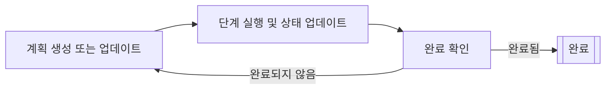

# 플래너 에이전트 (Planner agents)

플래너 에이전트는 반복적인 계획 주기(iterative planning cycles)를 통해 다단계 작업을 계획하고 실행하는 AI 에이전트입니다.
이들은 지속적으로 계획을 수립하거나 업데이트하고, 각 단계를 실행하며, 현재 상태를 기준으로 완료 기준을 점검합니다.

플래너 에이전트는 상위 수준의 목표를 더 작고 실행 가능한 단계로 세분화하고,
각 단계의 결과에 따라 계획을 조정해야 하는 복잡한 작업에 적합합니다.

[그래프 기반 에이전트](../graph-based-agents.md)에서는 모든 노드(node)와 엣지(edge)를 직접 정의하는 반면,
플래너 에이전트에서는 타입이 지정된 입력과 출력을 가진 행동(노드)만 정의합니다.
플래너는 원하는 상태를 달성하기에 적합하고 합리적인 엣지를 스스로 생성하며,
단계 사이의 최적 경로를 업데이트할 수도 있습니다.
이를 통해 그래프 기반 에이전트에 비해 제어력은 다소 낮을 수 있지만, 더욱 강력하고 동적인 접근이 가능해집니다.

플래너 에이전트는 다음과 같은 반복적인 계획 주기를 통해 작동합니다:

1. 플래너가 현재 상태를 기반으로 계획을 생성하거나 업데이트합니다.
2. 플래너가 계획에서 단일 단계를 실행하고 상태를 업데이트합니다.
3. 플래너가 현재 상태에 따라 계획이 완료되었는지 판단합니다.
    - 계획이 완료되면 주기가 종료됩니다.
    - 계획이 완료되지 않으면 첫 번째 단계부터 주기를 반복합니다.

Koog는 두 가지 유형의 플래너 에이전트를 제공합니다:

- [LLM 기반 플래너(LLM-based planners)](llm-based-planners.md): LLM을 사용하여 계획을 생성하고 업데이트합니다.
- [GOAP 에이전트(GOAP agents)](goap-agents.md): 특수한 알고리즘을 사용하여 최적의 행동 시퀀스를 결정합니다.