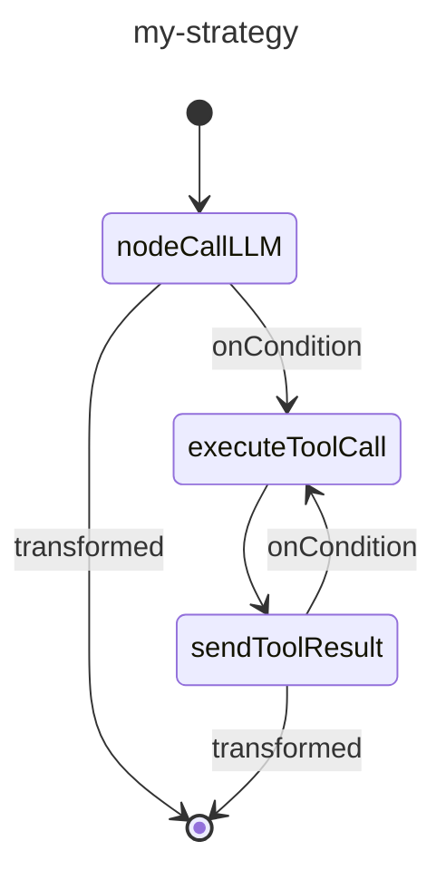

# 사용자 지정 전략 그래프

전략 그래프는 Koog 프레임워크에서 에이전트 워크플로우의 중추입니다. 이는 에이전트가 입력을 처리하고, 도구와 상호작용하며, 출력을 생성하는 방식을 정의합니다. 전략 그래프는 엣지로 연결된 노드로 구성되며, 조건이 실행 흐름을 결정합니다.

전략 그래프를 생성하면 간단한 챗봇을 만들든, 복잡한 데이터 처리 파이프라인을 만들든, 그 중간의 어떤 것을 만들든 관계없이 특정 요구 사항에 맞춰 에이전트의 동작을 맞춤 설정할 수 있습니다.

## 전략 그래프 아키텍처

높은 수준에서 전략 그래프는 다음 구성 요소로 이루어집니다.

-   **Strategy**: 제네릭 매개변수를 사용하여 지정된 입력 및 출력 타입을 가지며, `strategy` 함수를 사용하여 생성되는 그래프의 최상위 컨테이너입니다.
-   **Subgraphs**: 자체 도구 및 컨텍스트 세트를 가질 수 있는 그래프 섹션입니다.
-   **Nodes**: 워크플로우의 개별 작업 또는 변환입니다.
-   **Edges**: 전환 조건과 변환을 정의하는 노드 간 연결입니다.

전략 그래프는 `nodeStart`라는 특수 노드에서 시작하여 `nodeFinish`에서 끝납니다. 이 노드들 사이의 경로는 그래프에 지정된 엣지와 조건에 의해 결정됩니다.

## 전략 그래프 구성 요소

### 노드

노드는 전략 그래프의 빌딩 블록입니다. 각 노드는 특정 작업을 나타냅니다.

Koog 프레임워크는 미리 정의된 노드를 제공하며, `node` 함수를 사용하여 사용자 지정 노드를 생성할 수도 있습니다.

자세한 내용은 [미리 정의된 노드 및 구성 요소](nodes-and-components.md) 및 [사용자 지정 노드](custom-nodes.md)를 참조하세요.

### 엣지

엣지는 노드를 연결하고 전략 그래프에서 작업 흐름을 정의합니다.
엣지는 `edge` 함수와 `forwardTo` 중위 함수를 사용하여 생성됩니다.

<!--- INCLUDE
import ai.koog.agents.core.dsl.builder.forwardTo
import ai.koog.agents.core.dsl.builder.strategy

val strategy = strategy<String, String>("strategy_name") {
        val sourceNode by node<String, String> { input -> input }
        val targetNode by node<String, String> { input -> input }
-->
<!--- SUFFIX
}
-->
```kotlin
edge(sourceNode forwardTo targetNode)
```
<!--- KNIT example-custom-strategy-graphs-01.kt -->

#### 조건

조건은 전략 그래프에서 특정 엣지를 따라갈 시기를 결정합니다. 몇 가지 유형의 조건이 있으며, 다음은 일반적인 조건들입니다.

| 조건 유형           | 설명                                                         |
| :------------------ | :----------------------------------------------------------- |
| onCondition         | 불리언 값을 반환하는 람다 표현식을 인자로 받는 범용 조건입니다. |
| onToolCall          | LLM이 도구를 호출할 때 일치하는 조건입니다.                  |
| onAssistantMessage  | LLM이 메시지로 응답할 때 일치하는 조건입니다.                |
| onMultipleToolCalls | LLM이 여러 도구를 호출할 때 일치하는 조건입니다.             |
| onToolNotCalled     | LLM이 도구를 호출하지 않을 때 일치하는 조건입니다.           |

대상 노드로 전달하기 전에 `transformed` 함수를 사용하여 출력을 변환할 수 있습니다.

<!--- INCLUDE
import ai.koog.agents.core.dsl.builder.forwardTo
import ai.koog.agents.core.dsl.builder.strategy

val strategy = strategy<String, String>("strategy_name") {
        val sourceNode by node<String, String> { input -> input }
        val targetNode by node<String, String> { input -> input }
-->
<!--- SUFFIX
}
-->
```kotlin
edge(sourceNode forwardTo targetNode 
        onCondition { input -> input.length > 10 }
        transformed { input -> input.uppercase() }
)
```
<!--- KNIT example-custom-strategy-graphs-02.kt -->

### 서브그래프

서브그래프는 자체 도구 및 컨텍스트 세트로 작동하는 전략 그래프의 섹션입니다.
전략 그래프는 여러 서브그래프를 포함할 수 있습니다. 각 서브그래프는 `subgraph` 함수를 사용하여 정의됩니다.

<!--- INCLUDE
import ai.koog.agents.core.dsl.builder.strategy

typealias Input = String
typealias Output = Int

typealias FirstInput = String
typealias FirstOutput = Int

typealias SecondInput = String
typealias SecondOutput = Int
-->
```kotlin
val strategy = strategy<Input, Output>("strategy-name") {
    val firstSubgraph by subgraph<FirstInput, FirstOutput>("first") {
        // Define nodes and edges for this subgraph
    }
    val secondSubgraph by subgraph<SecondInput, SecondOutput>("second") {
        // Define nodes and edges for this subgraph
    }
}
```
<!--- KNIT example-custom-strategy-graphs-03.kt -->

서브그래프는 도구 레지스트리의 모든 도구를 사용할 수 있습니다.
그러나 이 레지스트리에서 서브그래프에서 사용할 수 있는 도구의 하위 집합을 지정하고 이를 `subgraph` 함수의 인수로 전달할 수 있습니다.

<!--- INCLUDE
import ai.koog.agents.core.dsl.builder.strategy
import ai.koog.agents.ext.tool.SayToUser

typealias Input = String
typealias Output = Int

typealias FirstInput = String
typealias FirstOutput = Int

val someTool = SayToUser

-->
```kotlin
val strategy = strategy<Input, Output>("strategy-name") {
    val firstSubgraph by subgraph<FirstInput, FirstOutput>(
        name = "first",
        tools = listOf(someTool)
    ) {
        // Define nodes and edges for this subgraph
    }
   // Define other subgraphs
}
```
<!--- KNIT example-custom-strategy-graphs-04.kt -->

## 기본 전략 그래프 생성

기본 전략 그래프는 다음과 같이 작동합니다:

1.  LLM에 입력을 보냅니다.
2.  LLM이 메시지로 응답하면 프로세스를 마칩니다.
3.  LLM이 도구를 호출하면 도구를 실행합니다.
4.  도구 결과를 LLM에 다시 보냅니다.
5.  LLM이 메시지로 응답하면 프로세스를 마칩니다.
6.  LLM이 다른 도구를 호출하면 도구를 실행하고, 프로세스는 4단계부터 반복됩니다.


다음은 기본 전략 그래프의 예시입니다.

<!--- INCLUDE
import ai.koog.agents.core.dsl.builder.forwardTo
import ai.koog.agents.core.dsl.builder.strategy
import ai.koog.agents.core.dsl.extension.nodeExecuteTool
import ai.koog.agents.core.dsl.extension.nodeLLMRequest
import ai.koog.agents.core.dsl.extension.nodeLLMSendToolResult
import ai.koog.agents.core.dsl.extension.onAssistantMessage
import ai.koog.agents.core.dsl.extension.onToolCall

-->
```kotlin
val myStrategy = strategy<String, String>("my-strategy") {
    val nodeCallLLM by nodeLLMRequest()
    val executeToolCall by nodeExecuteTool()
    val sendToolResult by nodeLLMSendToolResult()

    edge(nodeStart forwardTo nodeCallLLM)
    edge(nodeCallLLM forwardTo nodeFinish onAssistantMessage { true })
    edge(nodeCallLLM forwardTo executeToolCall onToolCall { true })
    edge(executeToolCall forwardTo sendToolResult)
    edge(sendToolResult forwardTo nodeFinish onAssistantMessage { true })
    edge(sendToolResult forwardTo executeToolCall onToolCall { true })
}
```
<!--- KNIT example-custom-strategy-graphs-05.kt -->

## 전략 그래프 시각화

JVM에서는 전략 그래프의 [Mermaid 상태 다이어그램](https://mermaid.js.org/syntax/stateDiagram.html)을 생성할 수 있습니다.

이전 예시에서 생성된 그래프에 대해 다음을 실행할 수 있습니다.

<!--- INCLUDE
import ai.koog.agents.core.agent.asMermaidDiagram
import ai.koog.agents.core.dsl.builder.forwardTo
import ai.koog.agents.core.dsl.builder.strategy
import ai.koog.agents.core.dsl.extension.nodeExecuteTool
import ai.koog.agents.core.dsl.extension.nodeLLMRequest
import ai.koog.agents.core.dsl.extension.nodeLLMSendToolResult
import ai.koog.agents.core.dsl.extension.onAssistantMessage
import ai.koog.agents.core.dsl.extension.onToolCall

fun main() {
    val myStrategy = strategy("my-strategy") {
        val nodeCallLLM by nodeLLMRequest()
        val executeToolCall by nodeExecuteTool()
        val sendToolResult by nodeLLMSendToolResult()
    
        edge(nodeStart forwardTo nodeCallLLM)
        edge(nodeCallLLM forwardTo nodeFinish onAssistantMessage { true })
        edge(nodeCallLLM forwardTo executeToolCall onToolCall { true })
        edge(executeToolCall forwardTo sendToolResult)
        edge(sendToolResult forwardTo nodeFinish onAssistantMessage { true })
        edge(sendToolResult forwardTo executeToolCall onToolCall { true })
    }
-->
<!--- SUFFIX
}
-->

```kotlin
val mermaidDiagram: String = myStrategy.asMermaidDiagram()

println(mermaidDiagram)
```

그러면 다음과 같은 출력이 생성됩니다.


<!--- KNIT example-custom-strategy-graphs-06.kt -->

## 고급 전략 기술

### 기록 압축

장기 실행 대화의 경우 기록이 커져 많은 토큰을 소비할 수 있습니다. 기록을 압축하는 방법은 [기록 압축](history-compression.md)을 참조하세요.

### 병렬 도구 실행

여러 도구를 병렬로 실행해야 하는 워크플로우의 경우 `nodeExecuteMultipleTools` 노드를 사용할 수 있습니다.

<!--- INCLUDE
import ai.koog.agents.core.dsl.builder.forwardTo
import ai.koog.agents.core.dsl.builder.strategy
import ai.koog.agents.core.dsl.extension.nodeExecuteMultipleTools
import ai.koog.agents.core.dsl.extension.nodeLLMSendMultipleToolResults
import ai.koog.prompt.message.Message

val strategy = strategy<String, String>("strategy_name") {
    val someNode by node<String, List<Message.Tool.Call>> { emptyList() }
-->
<!--- SUFFIX
}
-->
```kotlin
val executeMultipleTools by nodeExecuteMultipleTools()
val processMultipleResults by nodeLLMSendMultipleToolResults()

edge(someNode forwardTo executeMultipleTools)
edge(executeMultipleTools forwardTo processMultipleResults)
```
<!--- KNIT example-custom-strategy-graphs-07.kt -->

또한 스트리밍 데이터의 경우 `toParallelToolCallsRaw` 확장 함수를 사용할 수도 있습니다.

<!--- INCLUDE
/*
-->
<!--- SUFFIX
*/
-->
```kotlin
parseMarkdownStreamToBooks(markdownStream).toParallelToolCallsRaw(BookTool::class).collect()
```
<!--- KNIT example-custom-strategy-graphs-08.kt -->

자세한 내용은 [도구](tools-overview.md#parallel-tool-calls)를 참조하세요.

### 병렬 노드 실행

병렬 노드 실행을 통해 여러 노드를 동시에 실행하여 성능을 향상시키고 복잡한 워크플로우를 구현할 수 있습니다.

병렬 노드 실행을 시작하려면 `parallel` 메서드를 사용하세요:

<!--- INCLUDE
import ai.koog.agents.core.dsl.builder.strategy

val strategy = strategy<String, String>("strategy_name") {
    val nodeCalcTokens by node<String, Int> { 42 }
    val nodeCalcSymbols by node<String, Int> { 42 }
    val nodeCalcWords by node<String, Int> { 42 }

-->
<!--- SUFFIX
}
-->
```kotlin
val calc by parallel<String, Int>(
    nodeCalcTokens, nodeCalcSymbols, nodeCalcWords,
) {
    selectByMax { it }
}
```
<!--- KNIT example-custom-strategy-graphs-09.kt -->

위 코드는 `calc`라는 노드를 생성하여 `nodeCalcTokens`, `nodeCalcSymbols`, `nodeCalcWords` 노드를 병렬로 실행하고, 그 결과를 `AsyncParallelResult` 인스턴스로 반환합니다.

병렬 노드 실행과 관련된 더 자세한 정보 및 상세한 참조는 [병렬 노드 실행](parallel-node-execution.md)을 참조하세요.

### 조건부 분기

특정 조건에 따라 다른 경로가 필요한 복잡한 워크플로우의 경우 조건부 분기를 사용할 수 있습니다.

<!--- INCLUDE
import ai.koog.agents.core.dsl.builder.forwardTo
import ai.koog.agents.core.dsl.builder.strategy

val strategy = strategy<String, String>("strategy_name") {
    val someNode by node<String, String> { it }
-->
<!--- SUFFIX
}
-->
```kotlin
val branchA by node<String, String> { input ->
    // Logic for branch A
    "Branch A: $input"
}

val branchB by node<String, String> { input ->
    // Logic for branch B
    "Branch B: $input"
}

edge(
    (someNode forwardTo branchA)
            onCondition { input -> input.contains("A") }
)
edge(
    (someNode forwardTo branchB)
            onCondition { input -> input.contains("B") }
)
```
<!--- KNIT example-custom-strategy-graphs-10.kt -->

## 모범 사례

사용자 지정 전략 그래프를 생성할 때 다음 모범 사례를 따르세요.

-   간단하게 유지하세요. 간단한 그래프로 시작하여 필요에 따라 복잡성을 추가하세요.
-   그래프를 이해하기 쉽도록 노드와 엣지에 설명적인 이름을 지정하세요.
-   가능한 모든 경로와 엣지 케이스를 처리하세요.
-   다양한 입력으로 그래프를 테스트하여 예상대로 작동하는지 확인하세요.
-   나중에 참조할 수 있도록 그래프의 목적과 동작을 문서화하세요.
-   미리 정의된 전략 또는 일반적인 패턴을 시작점으로 사용하세요.
-   장기 실행 대화의 경우 기록 압축을 사용하여 토큰 사용량을 줄이세요.
-   서브그래프를 사용하여 그래프를 구성하고 도구 액세스를 관리하세요.

## 사용 예시

### 어조 분석 전략

어조 분석 전략은 기록 압축을 포함하는 도구 기반 전략의 좋은 예시입니다.

<!--- INCLUDE
import ai.koog.agents.core.agent.entity.AIAgentGraphStrategy
import ai.koog.agents.core.dsl.builder.forwardTo
import ai.koog.agents.core.dsl.builder.strategy
import ai.koog.agents.core.dsl.extension.nodeExecuteTool
import ai.koog.agents.core.dsl.extension.nodeLLMCompressHistory
import ai.koog.agents.core.dsl.extension.nodeLLMRequest
import ai.koog.agents.core.dsl.extension.nodeLLMSendToolResult
import ai.koog.agents.core.dsl.extension.onAssistantMessage
import ai.koog.agents.core.dsl.extension.onToolCall
import ai.koog.agents.core.environment.ReceivedToolResult
import ai.koog.agents.core.tools.ToolRegistry
-->
```kotlin
fun toneStrategy(name: String, toolRegistry: ToolRegistry): AIAgentGraphStrategy<String, String> {
    return strategy(name) {
        val nodeSendInput by nodeLLMRequest()
        val nodeExecuteTool by nodeExecuteTool()
        val nodeSendToolResult by nodeLLMSendToolResult()
        val nodeCompressHistory by nodeLLMCompressHistory<ReceivedToolResult>()

        // Define the flow of the agent
        edge(nodeStart forwardTo nodeSendInput)

        // If the LLM responds with a message, finish
        edge(
            (nodeSendInput forwardTo nodeFinish)
                    onAssistantMessage { true }
        )

        // If the LLM calls a tool, execute it
        edge(
            (nodeSendInput forwardTo nodeExecuteTool)
                    onToolCall { true }
        )

        // If the history gets too large, compress it
        edge(
            (nodeExecuteTool forwardTo nodeCompressHistory)
                    onCondition { _ -> llm.readSession { prompt.messages.size > 100 } }
        )

        edge(nodeCompressHistory forwardTo nodeSendToolResult)

        // Otherwise, send the tool result directly
        edge(
            (nodeExecuteTool forwardTo nodeSendToolResult)
                    onCondition { _ -> llm.readSession { prompt.messages.size <= 100 } }
        )

        // If the LLM calls another tool, execute it
        edge(
            (nodeSendToolResult forwardTo nodeExecuteTool)
                    onToolCall { true }
        )

        // If the LLM responds with a message, finish
        edge(
            (nodeSendToolResult forwardTo nodeFinish)
                    onAssistantMessage { true }
        )
    }
}
```
<!--- KNIT example-custom-strategy-graphs-11.kt -->

이 전략은 다음을 수행합니다:

1.  LLM에 입력을 보냅니다.
2.  LLM이 메시지로 응답하면 전략이 프로세스를 마칩니다.
3.  LLM이 도구를 호출하면 전략이 도구를 실행합니다.
4.  기록이 너무 크면(100개 이상의 메시지) 전략은 도구 결과를 보내기 전에 압축합니다.
5.  그렇지 않으면 전략은 도구 결과를 직접 보냅니다.
6.  LLM이 다른 도구를 호출하면 전략이 이를 실행합니다.
7.  LLM이 메시지로 응답하면 전략이 프로세스를 마칩니다.

## 문제 해결

사용자 지정 전략 그래프를 생성할 때 몇 가지 일반적인 문제가 발생할 수 있습니다. 다음은 몇 가지 문제 해결 팁입니다.

### 그래프가 종료 노드에 도달하지 못함

그래프가 종료 노드에 도달하지 못하는 경우 다음을 확인하세요:

-   시작 노드부터의 모든 경로가 최종적으로 종료 노드로 이어지는지 확인하세요.
-   조건이 너무 제한적이어서 엣지가 따라가지 못하는 경우가 없는지 확인하세요.
-   종료 조건이 없는 순환이 그래프에 없는지 확인하세요.

### 도구 호출이 실행되지 않음

도구 호출이 실행되지 않는 경우 다음을 확인하세요:

-   도구가 도구 레지스트리에 제대로 등록되어 있는지 확인하세요.
-   LLM 노드에서 도구 실행 노드로 가는 엣지에 올바른 조건(`onToolCall { true }`)이 있는지 확인하세요.

### 기록이 너무 커짐

기록이 너무 커져 많은 토큰을 소비하는 경우 다음을 고려하세요:

-   기록 압축 노드를 추가하세요.
-   조건을 사용하여 기록 크기를 확인하고 너무 커지면 압축하세요.
-   더 적극적인 압축 전략(예: 더 작은 N 값을 사용하는 `FromLastNMessages`)을 사용하세요.

### 그래프가 예상치 않게 동작함

그래프가 예상치 못한 분기를 따르는 경우 다음을 확인하세요:

-   조건이 올바르게 정의되었는지 확인하세요.
-   조건이 예상된 순서로 평가되는지 확인하세요(엣지는 정의된 순서대로 확인됩니다).
-   더 일반적인 조건으로 우발적으로 조건을 덮어쓰지 않았는지 확인하세요.

### 성능 문제가 발생함

그래프에 성능 문제가 있는 경우 다음을 고려하세요:

-   불필요한 노드와 엣지를 제거하여 그래프를 단순화하세요.
-   독립적인 작업에는 병렬 도구 실행을 사용하세요.
-   기록을 압축하세요.
-   더 효율적인 노드와 작업을 사용하세요.