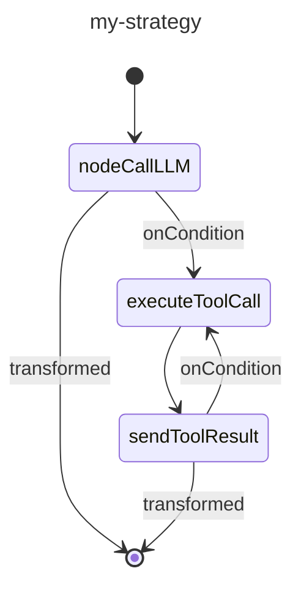

# 커스텀 전략 그래프 (Custom strategy graphs)

전략 그래프(Strategy graphs)는 Koog 프레임워크에서 에이전트 워크플로의 중추입니다. 이는 에이전트가 입력을 처리하고, 도구와 상호작용하며, 출력을 생성하는 방식을 정의합니다. 전략 그래프는 에지로 연결된 노드들로 구성되며, 실행 흐름은 조건에 따라 결정됩니다.

전략 그래프를 생성하면 단순한 챗봇부터 복잡한 데이터 처리 파이프라인에 이르기까지 에이전트의 동작을 특정 요구 사항에 맞게 조정할 수 있습니다.

## 전략 그래프 아키텍처 (Strategy graph architecture)

상위 수준에서 전략 그래프는 다음과 같은 구성 요소로 이루어집니다:

- **전략(Strategy)**: 그래프를 위한 최상위 컨테이너로, 제네릭 파라미터를 사용하여 지정된 입력 및 출력 타입을 가진 `strategy` 함수를 통해 생성됩니다.
- **서브그래프(Subgraphs)**: 자체적인 도구 세트와 컨텍스트를 가질 수 있는 그래프의 섹션입니다.
- **노드(Nodes)**: 워크플로의 개별 작업 또는 변환입니다.
- **에지(Edges)**: 전이 조건과 변환을 정의하는 노드 간의 연결입니다.

전략 그래프는 `nodeStart`라는 특별한 노드에서 시작하여 `nodeFinish`에서 끝납니다. 이 노드들 사이의 경로는 그래프에 지정된 에지와 조건에 의해 결정됩니다.

## 전략 그래프 구성 요소 (Strategy graph components)

### 노드 (Nodes)

노드는 전략 그래프의 기본 빌딩 블록입니다. 각 노드는 특정 작업을 나타냅니다.

Koog 프레임워크는 미리 정의된 노드를 제공하며, `node` 함수를 사용하여 커스텀 노드를 생성할 수도 있습니다.

자세한 내용은 [미리 정의된 노드 및 구성 요소](nodes-and-components.md) 및 [커스텀 노드](custom-nodes.md)를 참조하세요.

### 에지 (Edges)

에지는 노드를 연결하고 전략 그래프에서 작업의 흐름을 정의합니다. 에지는 `edge` 함수와 `forwardTo` 중위 함수(infix function)를 사용하여 생성됩니다:

=== "Kotlin"

    <!--- INCLUDE
    import ai.koog.agents.core.dsl.builder.forwardTo
    import ai.koog.agents.core.dsl.builder.strategy
    import ai.koog.agents.core.dsl.builder.node
    import ai.koog.agents.core.dsl.builder.parallel
    import ai.koog.agents.core.dsl.builder.subgraph
    val strategy = strategy<String, String>("strategy_name") {
            val sourceNode by node<String, String> { input -> input }
            val targetNode by node<String, String> { input -> input }
    -->
    <!--- SUFFIX
    }
    -->
    ```kotlin
    edge(sourceNode forwardTo targetNode)
    ```
    <!--- KNIT example-custom-strategy-graphs-01.kt -->

=== "Java"

    <!--- INCLUDE
    import ai.koog.agents.core.agent.entity.AIAgentGraphStrategy;
    import ai.koog.agents.core.agent.entity.AIAgentNode;
    class exampleCustomStrategyGraphsJava01 {
        public static void main(String[] args) {
            var strategy = AIAgentGraphStrategy.builder("strategyName")
                .withInput(String.class)
                .withOutput(String.class);
            var sourceNode = AIAgentNode.builder("source")
                .withInput(String.class)
                .withOutput(String.class)
                .withAction((input, ctx) -> input)
                .build();
            var targetNode = AIAgentNode.builder("target")
                .withInput(String.class)
                .withOutput(String.class)
                .withAction((input, ctx) -> input)
                .build();
    -->
    <!--- SUFFIX
        }
    }
    -->
    ```java
    strategy.edge(sourceNode, targetNode);
    ```
    <!--- KNIT exampleCustomStrategyGraphsJava01.java -->

#### 조건 (Conditions)

조건은 전략 그래프에서 특정 에지를 따라갈 시점을 결정합니다. 다음과 같은 몇 가지 일반적인 조건 유형이 있습니다:

| 조건 유형 | 설명 |
|---------------------|------------------------------------------------------------------------------------------|
| onCondition         | 불리언(boolean) 값을 반환하는 람다 표현식을 받는 범용 조건입니다. |
| onToolCalls         | LLM이 하나 이상의 도구를 호출할 때 일치하는 조건입니다. |
| onTextMessage       | LLM이 텍스트 메시지로 응답할 때 일치하는 조건입니다. |
| onToolNotCalled     | LLM이 도구를 호출하지 않을 때 일치하는 조건입니다. |

`transformed` 함수를 사용하면 출력을 대상 노드로 전달하기 전에 변환할 수 있습니다:

=== "Kotlin"

    <!--- INCLUDE
    import ai.koog.agents.core.dsl.builder.forwardTo
    import ai.koog.agents.core.dsl.builder.strategy
    import ai.koog.agents.core.dsl.builder.node
    import ai.koog.agents.core.dsl.builder.parallel
    import ai.koog.agents.core.dsl.builder.subgraph
    val strategy = strategy<String, String>("strategy_name") {
            val sourceNode by node<String, String> { input -> input }
            val targetNode by node<String, String> { input -> input }
    -->
    <!--- SUFFIX
    }
    -->
    ```kotlin
    edge(sourceNode forwardTo targetNode 
            onCondition { input -> input.length > 10 }
            transformed { input -> input.uppercase() }
    )
    ```
    <!--- KNIT example-custom-strategy-graphs-02.kt -->

=== "Java"

    <!--- INCLUDE
    import ai.koog.agents.core.agent.entity.AIAgentEdge;
    import ai.koog.agents.core.agent.entity.AIAgentGraphStrategy;
    import ai.koog.agents.core.agent.entity.AIAgentNode;
    class exampleCustomStrategyGraphsJava02 {
        public static void main(String[] args) {
            var strategy = AIAgentGraphStrategy.builder("strategyName")
                .withInput(String.class)
                .withOutput(String.class);
            var sourceNode = AIAgentNode.builder("source")
                .withInput(String.class)
                .withOutput(String.class)
                .withAction((input, ctx) -> input)
                .build();
            var targetNode = AIAgentNode.builder("target")
                .withInput(String.class)
                .withOutput(String.class)
                .withAction((input, ctx) -> input)
                .build();
    -->
    <!--- SUFFIX
        }
    }
    -->
    ```java
    strategy.edge(AIAgentEdge.builder()
        .from(sourceNode)
        .to(targetNode)
        .onCondition(input -> input.length() > 10)
        .transformed(input -> input.toUpperCase())
        .build());
    ```
    <!--- KNIT exampleCustomStrategyGraphsJava02.java -->

### 서브그래프 (Subgraphs)

서브그래프는 자체적인 도구 세트와 컨텍스트로 작동하는 전략 그래프의 섹션입니다. 전략 그래프는 여러 개의 서브그래프를 포함할 수 있습니다. 각 서브그래프는 `subgraph` 함수를 사용하여 정의됩니다:

=== "Kotlin"

    <!--- INCLUDE
    import ai.koog.agents.core.dsl.builder.strategy
    import ai.koog.agents.core.dsl.builder.node
    import ai.koog.agents.core.dsl.builder.parallel
    import ai.koog.agents.core.dsl.builder.subgraph
    typealias Input = String
    typealias Output = Int
    typealias FirstInput = String
    typealias FirstOutput = Int
    typealias SecondInput = String
    typealias SecondOutput = Int
    -->
    ```kotlin
    val strategy = strategy<Input, Output>("strategy-name") {
        val firstSubgraph by subgraph<FirstInput, FirstOutput>("first") {
            // 이 서브그래프를 위한 노드와 에지 정의
        }
        val secondSubgraph by subgraph<SecondInput, SecondOutput>("second") {
            // 이 서브그래프를 위한 노드와 에지 정의
        }
    }
    ```
    <!--- KNIT example-custom-strategy-graphs-03.kt -->

=== "Java"

    <!--- INCLUDE
    import ai.koog.agents.core.agent.entity.AIAgentSubgraph;
    class exampleCustomStrategyGraphsJava03 {
        class FirstInput {}
        class FirstOutput {}
        class SecondInput {}
        class SecondOutput {}
        public static void main(String[] args) {
    -->
    <!--- SUFFIX
        }
    }
    -->
    ```java
    var firstSubgraph = AIAgentSubgraph.builder("first")
        .withInput(FirstInput.class)
        .withOutput(FirstOutput.class)
        .define(subgraph -> {
            // 이 서브그래프를 위한 노드와 에지 정의
        })
        .build();

    var secondSubgraph = AIAgentSubgraph.builder("second")
        .withInput(SecondInput.class)
        .withOutput(SecondOutput.class)
        .define(subgraph -> {
            // 이 서브그래프를 위한 노드와 에지 정의
        })
        .build();
    ```
    <!--- KNIT exampleCustomStrategyGraphsJava03.java -->

서브그래프는 도구 레지스트리(tool registry)의 모든 도구를 사용할 수 있습니다. 그러나 이 레지스트리에서 서브그래프에서 사용할 도구의 하위 세트를 지정하여 `subgraph` 함수의 인자로 전달할 수도 있습니다:

=== "Kotlin"

    <!--- INCLUDE
    import ai.koog.agents.core.dsl.builder.strategy
    import ai.koog.agents.core.dsl.builder.node
    import ai.koog.agents.core.dsl.builder.parallel
    import ai.koog.agents.core.dsl.builder.subgraph
    import ai.koog.agents.ext.tool.SayToUser
    typealias Input = String
    typealias Output = Int
    typealias FirstInput = String
    typealias FirstOutput = Int
    val someTool = SayToUser
    -->
    ```kotlin
    val strategy = strategy<Input, Output>("strategy-name") {
        val firstSubgraph by subgraph<FirstInput, FirstOutput>(
            name = "first",
            tools = listOf(someTool)
        ) {
            // 이 서브그래프를 위한 노드와 에지 정의
        }
       // 다른 서브그래프 정의
    }
    ```
    <!--- KNIT example-custom-strategy-graphs-04.kt -->

=== "Java"

    <!--- INCLUDE
    import ai.koog.agents.core.agent.entity.AIAgentSubgraph;
    import ai.koog.agents.core.tools.reflect.ToolSet;
    class exampleCustomStrategyGraphsJava04 {
        class FirstInput {}
        class FirstOutput {}
        static ToolSet someTools = null;
        public static void main(String[] args) {
    -->
    <!--- SUFFIX
        }
    }
    -->
    ```java
    var firstSubgraph = AIAgentSubgraph.builder("first")
        .withInput(FirstInput.class)
        .withOutput(FirstOutput.class)
        .limitedTools(someTools)
        .define(subgraph -> {
            // 이 서브그래프를 위한 노드와 에지 정의
        })
        .build();
    ```
    <!--- KNIT exampleCustomStrategyGraphsJava04.java -->

## 기본 전략 그래프 생성 (Basic strategy graph creation)

기본 전략 그래프는 다음과 같이 작동합니다: 

1. 입력을 LLM으로 보냅니다.
2. LLM이 메시지로 응답하면 프로세스를 종료합니다.
3. LLM이 도구를 호출하면 도구를 실행합니다.
4. 도구 결과를 다시 LLM으로 보냅니다.
5. LLM이 메시지로 응답하면 프로세스를 종료합니다.
6. LLM이 다른 도구를 호출하면 도구를 실행하고 4단계부터 프로세스를 반복합니다.


다음은 기본 전략 그래프의 예시입니다:

=== "Kotlin"

    <!--- INCLUDE
    import ai.koog.agents.core.dsl.builder.forwardTo
    import ai.koog.agents.core.dsl.builder.strategy
    import ai.koog.agents.core.dsl.builder.node
    import ai.koog.agents.core.dsl.builder.parallel
    import ai.koog.agents.core.dsl.builder.subgraph
    import ai.koog.agents.core.dsl.extension.asUserMessage
    import ai.koog.agents.core.dsl.extension.nodeExecuteToolsAndGetResults
    import ai.koog.agents.core.dsl.extension.nodeLLMRequest
    import ai.koog.agents.core.dsl.extension.nodeLLMSendToolResults
    import ai.koog.agents.core.dsl.extension.onTextMessage
    import ai.koog.agents.core.dsl.extension.onToolCalls
    -->
    ```kotlin
    val myStrategy = strategy<String, String>("my-strategy") {
        val nodeCallLLM by nodeLLMRequest()
        val executeToolCall by nodeExecuteToolsAndGetResults()
        val sendToolResult by nodeLLMSendToolResults()
    
        edge(nodeStart forwardTo nodeCallLLM asUserMessage { it })
        edge(nodeCallLLM forwardTo nodeFinish onTextMessage { true })
        edge(nodeCallLLM forwardTo executeToolCall onToolCalls { true })
        edge(executeToolCall forwardTo sendToolResult)
        edge(sendToolResult forwardTo nodeFinish onTextMessage { true })
        edge(sendToolResult forwardTo executeToolCall onToolCalls { true })
    }
    ```
    <!--- KNIT example-custom-strategy-graphs-05.kt -->

=== "Java"

    <!--- INCLUDE
    import ai.koog.agents.core.agent.entity.AIAgentEdge;
    import ai.koog.agents.core.agent.entity.AIAgentGraphStrategy;
    import ai.koog.agents.core.agent.entity.AIAgentNode;
    import ai.koog.prompt.message.Message;
    import ai.koog.prompt.message.MessagePart;
    import java.util.stream.Collectors;
    class exampleCustomStrategyGraphsJava05 {
        public static void main(String[] args) {
    -->
    <!--- SUFFIX
        }
    }
    -->
    ```java
    var graph = AIAgentGraphStrategy.builder("single_run")
        .withInput(String.class)
        .withOutput(String.class);

    var nodeCallLLM = AIAgentNode.llmRequest("sendInput");
    var nodeExecuteTool = AIAgentNode.executeTools("nodeExecuteTool");
    var nodeSendToolResult = AIAgentNode.llmRequest("nodeSendToolResult");

    graph.edge(AIAgentEdge.builder()
        .from(graph.nodeStart)
        .to(nodeCallLLM)
        .asUserMessage(input -> input)
        .build());

    graph.edge(AIAgentEdge.builder()
        .from(nodeCallLLM)
        .to(nodeExecuteTool)
        .onToolCalls(call -> true)
        .build());

    graph.edge(AIAgentEdge.builder()
        .from(nodeCallLLM)
        .to(graph.nodeFinish)
        .onTextMessage()
        .build());

    graph.edge(nodeExecuteTool, nodeSendToolResult);

    graph.edge(AIAgentEdge.builder()
        .from(nodeSendToolResult)
        .to(graph.nodeFinish)
        .onTextMessage()
        .build());

    graph.edge(AIAgentEdge.builder()
        .from(nodeSendToolResult)
        .to(nodeExecuteTool)
        .onToolCalls(call -> true)
        .build());

    var strategy = graph.build();
    ```
    <!--- KNIT exampleCustomStrategyGraphsJava05.java -->

## 전략 그래프 시각화 (Visualizing strategy graph)

JVM에서는 전략 그래프에 대한 [Mermaid 상태 다이어그램(state diagram)](https://mermaid.js.org/syntax/stateDiagram.html)을 생성할 수 있습니다.

이전 예제에서 생성한 그래프의 경우 다음을 실행할 수 있습니다:

=== "Kotlin"

    <!--- INCLUDE
    import ai.koog.agents.core.agent.asMermaidDiagram
    import ai.koog.agents.core.dsl.builder.forwardTo
    import ai.koog.agents.core.dsl.builder.strategy
    import ai.koog.agents.core.dsl.builder.node
    import ai.koog.agents.core.dsl.builder.parallel
    import ai.koog.agents.core.dsl.builder.subgraph
    import ai.koog.agents.core.dsl.extension.asUserMessage
    import ai.koog.agents.core.dsl.extension.nodeExecuteToolsAndGetResults
    import ai.koog.agents.core.dsl.extension.nodeLLMRequest
    import ai.koog.agents.core.dsl.extension.nodeLLMSendToolResults
    import ai.koog.agents.core.dsl.extension.onTextMessage
    import ai.koog.agents.core.dsl.extension.onToolCalls
    fun main() {
        val myStrategy = strategy<String, String>("my-strategy") {
            val nodeCallLLM by nodeLLMRequest()
            val executeToolCall by nodeExecuteToolsAndGetResults()
            val sendToolResult by nodeLLMSendToolResults()
            edge(nodeStart forwardTo nodeCallLLM asUserMessage { it })
            edge(nodeCallLLM forwardTo nodeFinish onTextMessage { true })
            edge(nodeCallLLM forwardTo executeToolCall onToolCalls { true })
            edge(executeToolCall forwardTo sendToolResult)
            edge(sendToolResult forwardTo nodeFinish onTextMessage { true })
            edge(sendToolResult forwardTo executeToolCall onToolCalls { true })
        }
    -->
    <!--- SUFFIX
    }
    -->
    
    ```kotlin
    val mermaidDiagram: String = myStrategy.asMermaidDiagram()
    
    println(mermaidDiagram)
    ```
    <!--- KNIT example-custom-strategy-graphs-06.kt -->

=== "Java"

    <!--- INCLUDE
    import ai.koog.agents.core.agent.MermaidDiagramGenerator;
    import ai.koog.agents.core.agent.entity.AIAgentGraphStrategy;
    class exampleCustomStrategyGraphsJava06 {
        public static void main(String[] args) {
            var myStrategy = AIAgentGraphStrategy.builder("single_run")
                .withInput(String.class)
                .withOutput(String.class)
                .build();
    -->
    <!--- SUFFIX
        }
    }
    -->
    ```java
    var mermaidDiagram = MermaidDiagramGenerator.INSTANCE.generate(myStrategy);
    System.out.println(mermaidDiagram);
    ```
    <!--- KNIT exampleCustomStrategyGraphsJava06.java -->

출력 결과는 다음과 같습니다:

```mermaid
---
title: my-strategy
---
stateDiagram
    state "nodeCallLLM" as nodeCallLLM
    state "executeToolCall" as executeToolCall
    state "sendToolResult" as sendToolResult

    [*] --> nodeCallLLM
    nodeCallLLM --> [*] : transformed
    nodeCallLLM --> executeToolCall : onCondition
    executeToolCall --> sendToolResult
    sendToolResult --> [*] : transformed
    sendToolResult --> executeToolCall : onCondition
```
<!--- KNIT example-custom-strategy-graphs-01.txt -->

## 고급 전략 기법 (Advanced strategy techniques)

### 히스토리 압축 (History compression)

장시간 실행되는 대화의 경우, 히스토리가 커져서 많은 토큰을 소비할 수 있습니다. 히스토리를 압축하는 방법은 [히스토리 압축](history-compression.md)을 참조하세요.

### 병렬 도구 실행 (Parallel tool execution)

여러 도구를 병렬로 실행해야 하는 워크플로의 경우 `nodeExecuteToolsAndGetResults` 노드를 `parallel = true`와 함께 사용할 수 있습니다:

<!--- INCLUDE
import ai.koog.agents.core.dsl.builder.forwardTo
import ai.koog.agents.core.dsl.builder.strategy
import ai.koog.agents.core.dsl.builder.node
import ai.koog.agents.core.dsl.builder.parallel
import ai.koog.agents.core.dsl.builder.subgraph
import ai.koog.agents.core.dsl.extension.ToolCalls
import ai.koog.agents.core.dsl.extension.nodeExecuteToolsAndGetResults
import ai.koog.agents.core.dsl.extension.nodeLLMSendToolResults

val strategy = strategy<String, String>("strategy_name") {
    val someNode by node<String, ToolCalls> { ToolCalls(emptyList()) }
-->
<!--- SUFFIX
}
-->
```kotlin
val executeMultipleTools by nodeExecuteToolsAndGetResults(parallel = true)
val processMultipleResults by nodeLLMSendToolResults()

edge(someNode forwardTo executeMultipleTools)
edge(executeMultipleTools forwardTo processMultipleResults)
```
<!--- KNIT example-custom-strategy-graphs-07.kt -->

스트리밍 데이터의 경우 `toParallelToolCallsRaw` 확장 함수를 사용할 수도 있습니다:

<!--- INCLUDE
/*
-->
<!--- SUFFIX
*/
-->
```kotlin
parseMarkdownStreamToBooks(markdownStream).toParallelToolCallsRaw(BookTool::class).collect()
```
<!--- KNIT example-custom-strategy-graphs-08.kt -->

자세한 내용은 [도구](tools-overview.md#parallel-tool-calls)를 참조하세요. 

### 병렬 노드 실행 (Parallel node execution) 

병렬 노드 실행을 사용하면 여러 노드를 동시에 실행하여 성능을 향상시키고 복잡한 워크플로를 구현할 수 있습니다.

병렬 노드 실행을 시작하려면 `parallel` 메서드를 사용합니다:

<!--- INCLUDE
import ai.koog.agents.core.dsl.builder.strategy
import ai.koog.agents.core.dsl.builder.node
import ai.koog.agents.core.dsl.builder.parallel
import ai.koog.agents.core.dsl.builder.subgraph

val strategy = strategy<String, String>("strategy_name") {
    val nodeCalcTokens by node<String, Int> { 42 }
    val nodeCalcSymbols by node<String, Int> { 42 }
    val nodeCalcWords by node<String, Int> { 42 }

-->
<!--- SUFFIX
}
-->
```kotlin
val calc by parallel<String, Int>(
    nodeCalcTokens, nodeCalcSymbols, nodeCalcWords,
) {
    selectByMax { it }
}
```
<!--- KNIT example-custom-strategy-graphs-09.kt -->

위 코드는 `nodeCalcTokens`, `nodeCalcSymbols`, `nodeCalcWords` 노드를 병렬로 실행하고 결과를 `AsyncParallelResult` 인스턴스로 반환하는 `calc`라는 노드를 생성합니다.

병렬 노드 실행에 관한 더 자세한 정보와 상세 레퍼런스는 [병렬 노드 실행](parallel-node-execution.md)을 참조하세요.

### 조건부 분기 (Conditional branching)

특정 조건에 따라 다른 경로가 필요한 복잡한 워크플로의 경우 조건부 분기를 사용할 수 있습니다:

<!--- INCLUDE
import ai.koog.agents.core.dsl.builder.forwardTo
import ai.koog.agents.core.dsl.builder.strategy
import ai.koog.agents.core.dsl.builder.node
import ai.koog.agents.core.dsl.builder.parallel
import ai.koog.agents.core.dsl.builder.subgraph

val strategy = strategy<String, String>("strategy_name") {
    val someNode by node<String, String> { it }
-->
<!--- SUFFIX
}
-->
```kotlin
val branchA by node<String, String> { input ->
    // 분기 A를 위한 로직
    "Branch A: $input"
}

val branchB by node<String, String> { input ->
    // 분기 B를 위한 로직
    "Branch B: $input"
}

edge(
    (someNode forwardTo branchA)
            onCondition { input -> input.contains("A") }
)
edge(
    (someNode forwardTo branchB)
            onCondition { input -> input.contains("B") }
)
```
<!--- KNIT example-custom-strategy-graphs-10.kt -->

## 권장 사항 (Best practices)

커스텀 전략 그래프를 생성할 때 다음 권장 사항을 따르세요:

- 단순함을 유지하세요. 간단한 그래프로 시작하여 필요에 따라 복잡성을 추가하세요.
- 그래프를 이해하기 쉽도록 노드와 에지에 설명이 포함된 이름을 부여하세요.
- 가능한 모든 경로와 예외 상황(edge cases)을 처리하세요.
- 그래프가 예상대로 동작하는지 다양한 입력으로 테스트하세요.
- 미래의 참고를 위해 그래프의 목적과 동작을 문서화하세요.
- 미리 정의된 전략이나 일반적인 패턴을 시작점으로 활용하세요.
- 장시간 실행되는 대화의 경우 토큰 사용량을 줄이기 위해 히스토리 압축을 사용하세요.
- 서브그래프를 사용하여 그래프를 구조화하고 도구 액세스를 관리하세요.

## 사용 예시 (Usage examples)

### 어조 분석 전략 (Tone analysis strategy)

어조 분석 전략은 히스토리 압축을 포함하는 도구 기반 전략의 좋은 예시입니다.

<!--- INCLUDE
import ai.koog.agents.core.agent.entity.AIAgentGraphStrategy
import ai.koog.agents.core.dsl.builder.forwardTo
import ai.koog.agents.core.dsl.builder.strategy
import ai.koog.agents.core.dsl.builder.node
import ai.koog.agents.core.dsl.builder.parallel
import ai.koog.agents.core.dsl.builder.subgraph
import ai.koog.agents.core.dsl.extension.ReceivedToolResults
import ai.koog.agents.core.dsl.extension.asUserMessage
import ai.koog.agents.core.dsl.extension.nodeExecuteToolsAndGetResults
import ai.koog.agents.core.dsl.extension.nodeLLMCompressHistory
import ai.koog.agents.core.dsl.extension.nodeLLMRequest
import ai.koog.agents.core.dsl.extension.nodeLLMSendToolResults
import ai.koog.agents.core.dsl.extension.onTextMessage
import ai.koog.agents.core.dsl.extension.onToolCalls
import ai.koog.agents.core.tools.ToolRegistry
-->
```kotlin
fun toneStrategy(name: String, toolRegistry: ToolRegistry): AIAgentGraphStrategy<String, String> {
    return strategy(name) {
        val nodeSendInput by nodeLLMRequest()
        val nodeExecuteTool by nodeExecuteToolsAndGetResults()
        val nodeSendToolResult by nodeLLMSendToolResults()
        val nodeCompressHistory by nodeLLMCompressHistory<ReceivedToolResults>()

        // 에이전트의 흐름 정의
        edge(nodeStart forwardTo nodeSendInput asUserMessage { it })

        // LLM이 메시지로 응답하면 종료
        edge(
            (nodeSendInput forwardTo nodeFinish)
                onTextMessage { true }
        )

        // LLM이 도구를 호출하면 실행
        edge(
            (nodeSendInput forwardTo nodeExecuteTool)
                    onToolCalls { true }
        )

        // 히스토리가 너무 커지면 압축
        edge(
            (nodeExecuteTool forwardTo nodeCompressHistory)
                    onCondition { _ -> llm.readSession { prompt.messages.size > 100 } }
        )

        edge(nodeCompressHistory forwardTo nodeSendToolResult)

        // 그렇지 않으면 도구 결과를 직접 전송
        edge(
            (nodeExecuteTool forwardTo nodeSendToolResult)
                    onCondition { _ -> llm.readSession { prompt.messages.size <= 100 } }
        )

        // LLM이 다른 도구를 호출하면 실행
        edge(
            (nodeSendToolResult forwardTo nodeExecuteTool)
                    onToolCalls { true }
        )

        // LLM이 메시지로 응답하면 종료
        edge(
            (nodeSendToolResult forwardTo nodeFinish)
                onTextMessage { true }
        )
    }
}
```
<!--- KNIT example-custom-strategy-graphs-11.kt -->

이 전략은 다음과 같은 작업을 수행합니다:

1. 입력을 LLM으로 보냅니다.
2. LLM이 메시지로 응답하면 전략이 프로세스를 종료합니다.
3. LLM이 도구를 호출하면 전략이 도구를 실행합니다.
4. 히스토리가 너무 큰 경우(메시지 100개 초과), 전략은 도구 결과를 보내기 전에 히스토리를 압축합니다.
5. 그렇지 않으면 전략은 도구 결과를 직접 보냅니다.
6. LLM이 다른 도구를 호출하면 전략이 이를 실행합니다.
7. LLM이 메시지로 응답하면 전략이 프로세스를 종료합니다.

## 문제 해결 (Troubleshooting)

커스텀 전략 그래프를 생성할 때 몇 가지 일반적인 문제가 발생할 수 있습니다. 다음은 문제 해결을 위한 팁입니다.

### 그래프가 종료 노드에 도달하지 못함

그래프가 종료 노드(`nodeFinish`)에 도달하지 않는 경우 다음을 확인하세요:

- 시작 노드로부터의 모든 경로가 결국 종료 노드로 이어지는지 확인합니다.
- 조건이 너무 엄격하여 에지를 따라가는 것을 방해하고 있지 않은지 확인합니다.
- 탈출 조건이 없는 사이클(순환)이 그래프에 존재하지 않는지 확인합니다.

### 도구 호출이 실행되지 않음

도구 호출이 실행되지 않는 경우 다음을 확인하세요:

- 도구가 도구 레지스트리에 적절히 등록되어 있는지 확인합니다.
- LLM 노드에서 도구 실행 노드로 이어지는 에지에 올바른 조건(`onToolCall { true }`)이 설정되어 있는지 확인합니다.

### 히스토리 압축 (History compression)

히스토리가 너무 커져서 토큰을 너무 많이 소비하는 경우 다음을 고려하세요:

- 히스토리 압축 노드를 추가합니다.
- 히스토리 크기를 체크하는 조건을 사용하여 너무 커졌을 때 압축하도록 합니다.
- 더 공격적인 압축 전략(예: N 값이 더 작은 `FromLastNMessages`)을 사용합니다.

### 그래프가 예상치 않게 동작함

그래프가 예상치 못한 분기로 이동하는 경우 다음을 확인하세요:

- 조건이 올바르게 정의되었는지 확인합니다.
- 조건이 예상되는 순서대로 평가되는지 확인합니다 (에지는 정의된 순서대로 확인됩니다).
- 더 일반적인 조건으로 인해 실수로 조건을 덮어쓰고 있지 않은지 확인합니다.

### 성능 이슈 발생

그래프에 성능 문제가 있는 경우 다음을 고려하세요:

- 불필요한 노드와 에지를 제거하여 그래프를 단순화합니다.
- 독립적인 작업에 대해서는 병렬 도구 실행을 사용합니다.
- 히스토리를 압축합니다.
- 더 효율적인 노드와 작업을 사용합니다.