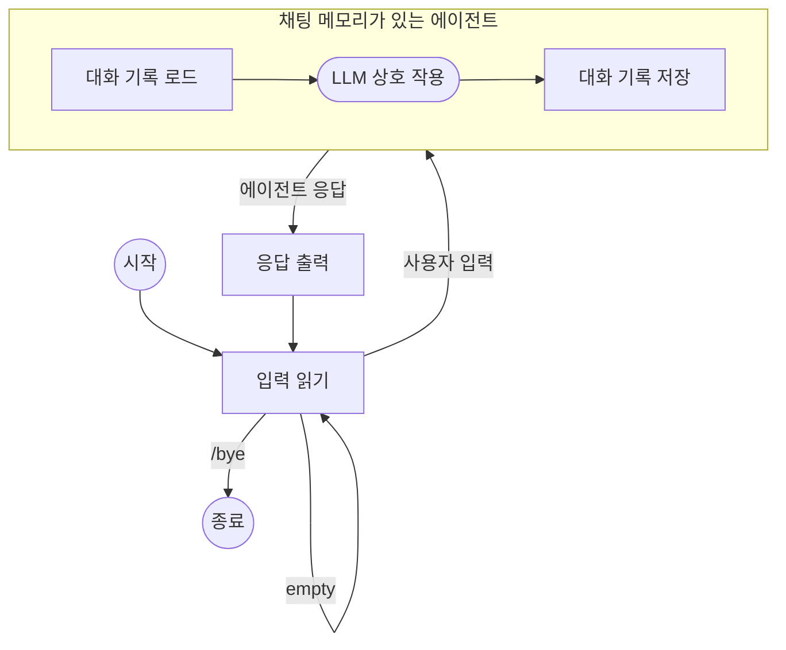

# 메모리 기능이 포함된 채팅 에이전트 구축하기

이 가이드는 [ChatMemory](index.md) 기능을 사용하여 여러 에이전트 상호 작용에서 이전 메시지를 기억하는 대화형 커맨드라인 채팅 애플리케이션을 만드는 방법을 보여줍니다.

CLI 애플리케이션은 다음과 같은 루프를 실행합니다:

- 콘솔에서 입력을 읽습니다.
- 입력이 `/bye`가 아니거나 비어 있지 않으면, 사용자 입력과 지정된 세션 ID(session ID)로 에이전트를 실행합니다.
- 에이전트는 먼저 해당 세션 ID에 대한 이전 대화 기록을 로드하고, 사용자 입력과 함께 프롬프트에 메시지를 추가합니다.
- 에이전트가 LLM 상호 작용을 수행합니다.
- 실행이 끝나고 응답을 반환하기 전에, 에이전트는 전체 대화 기록을 지정된 세션 ID 아래에 저장하며, 크기를 최신 20개의 메시지로 제한합니다.
- 그 다음 앱은 에이전트의 응답을 출력합니다.

전체적인 흐름은 다음과 같습니다:



## 코드

??? note "사전 요구 사항"

    --8<-- "quickstart-snippets.md:prerequisites"

    메인 [Koog agents 패키지](https://central.sonatype.com/artifact/ai.koog/koog-agents/)와 [채팅 메모리 기능 패키지](https://mvnrepository.com/artifact/ai.koog/agents-features-memory)를 종속성으로 추가하세요:

    === "Gradle (Kotlin)"
    
        ```kotlin title="build.gradle.kts"
        dependencies {
            implementation("ai.koog:koog-agents:1.0.0")
            implementation("ai.koog:agents-features-memory:1.0.0")
        }
        ```
    
    === "Gradle (Groovy)"
    
        ```groovy title="build.gradle"
        dependencies {
            implementation 'ai.koog:koog-agents:0.7.0'
            implementation 'ai.koog:agents-features-memory:0.7.0'
        }
        ```
    
    === "Maven"
    
        ```xml title="pom.xml"
        <dependency>
            <groupId>ai.koog</groupId>
            <artifactId>koog-agents-jvm</artifactId>
            <version>1.0.0</version>
        </dependency>
        <dependency>
            <groupId>ai.koog</groupId>
            <artifactId>agents-features-memory-jvm</artifactId>
            <version>0.7.0</version>
        </dependency>
        ```

    --8<-- "quickstart-snippets.md:api-key"

    이 페이지의 예제는 `OPENAI_API_KEY` 환경 변수를 설정했다고 가정합니다.

=== "Kotlin"

    <!--- INCLUDE
    import ai.koog.agents.chatMemory.feature.ChatMemory
    import ai.koog.agents.chatMemory.feature.InMemoryChatHistoryProvider
    import ai.koog.agents.core.agent.AIAgent
    import ai.koog.prompt.executor.clients.openai.OpenAIModels
    import ai.koog.prompt.executor.llms.all.simpleOpenAIExecutor
    -->
    ```kotlin
    suspend fun main() {
        val sessionId = "my-conversation"

        simpleOpenAIExecutor(System.getenv("OPENAI_API_KEY")).use { executor ->
            val agent = AIAgent(
                promptExecutor = executor,
                llmModel = OpenAIModels.Chat.GPT5_2,
                systemPrompt = "You are a helpful assistant."
            ) {
                install(ChatMemory) {
                    windowSize(20) // 마지막 20개의 메시지만 유지
                }
            }

            while (true) {
                print("You: ")
                val input = readln().trim()
                if (input == "/bye") break
                if (input.isEmpty()) continue

                val reply = agent.run(input, sessionId)
                println("Assistant: $reply
")
            }
        }
    }
    ```

=== "Java"

    ```java
    public class ExampleChatAgentOpenAI {
        public static void main(String[] args) {
            String sessionId = "my-conversation";
    
            try (var executor = simpleOpenAIExecutor(System.getenv("OPENAI_API_KEY"))) {
                AIAgent<String, String> agent = AIAgent.builder()
                        .promptExecutor(executor)
                        .llmModel(OpenAIModels.Chat.GPT5_2)
                        .systemPrompt("You are a helpful assistant.")
                        .install(ChatMemory.Feature, config -> {
                            config.windowSize(20); // 마지막 20개의 메시지만 유지
                        })
                        .build();
    
                Scanner scanner = new Scanner(System.in);
                while (true) {
                    System.out.print("You: ");
                    String input = scanner.nextLine().trim();
                    if (input.equals("/bye")) break;
                    if (input.isEmpty()) continue;
    
                    String reply = agent.run(input, sessionId);
                    System.out.println("Assistant: " + reply + "
");
                }
            } catch (Exception e) {
                e.printStackTrace();
            }
        }
    }
    ```

## 구현 세부 사항

`agent.run()`의 두 번째 인자는 진행 중인 대화를 식별하고 구분하는 데 사용되는 [세션 ID(session ID)](index.md#session-ids)입니다.
이 예제에서는 한 번에 하나의 대화만 진행되므로 상수로 처리되었습니다.
실제 애플리케이션에서는 예를 들어 동일한 사용자와 관련된 대화에 대해 별도의 고유 ID를 가질 수 있습니다.

에이전트는 대화 기록을 메모리에 저장하는 기본 [기록 제공자(history provider)](index.md#history-providers)를 사용합니다.
즉, 애플리케이션이 종료되면 기록이 손실됩니다.
실제 애플리케이션에서는 데이터베이스나 파일에 기록을 영구적으로 저장하기 위해 커스텀 기록 제공자를 구현해야 합니다.

`windowSize(20)` [전처리기(preprocessor)](index.md#preprocessors)는 제한된 컨텍스트 크기를 보장합니다:
에이전트는 최대 20개의 최신 메시지만 저장합니다.
이것이 없으면 프롬프트 크기가 컨텍스트 제한을 초과하여 커질 수 있습니다.

## 예제 세션

```
You: My name is Alice.
Assistant: Nice to meet you, Alice! How can I help you today?

You: What's my favorite color? It's blue.
Assistant: Got it — your favorite color is blue!

You: What's my name?
Assistant: Your name is Alice!
```

각 상호 작용은 개별적인 에이전트 실행이지만, `ChatMemory` 기능이 세 번째 메시지를 처리하기 전에 이전 대화 내용을 로드했기 때문에 에이전트는 "Your name is Alice!"라고 정확하게 답변합니다.