# 사전에 정의된 노드 및 컴포넌트

노드(Node)는 Koog 프레임워크에서 에이전트 워크플로를 구성하는 기본 블록입니다.
각 노드는 워크플로 내의 특정 작업이나 변환을 나타내며, 에지(edge)를 사용하여 노드들을 연결함으로써 실행 흐름을 정의할 수 있습니다.

일반적으로 노드를 사용하면 복잡한 로직을 재사용 가능한 컴포넌트로 캡슐화하여 다양한 에이전트 워크플로에 쉽게 통합할 수 있습니다. 이 가이드에서는 에이전트 전략에서 사용할 수 있는 기존 노드들을 살펴보겠습니다.

각 노드는 본질적으로 특정 유형의 입력을 받아 특정 유형의 출력을 반환하는 함수입니다.

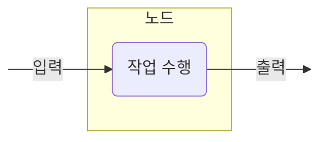
<!--- KNIT example-nodes-and-component-01.txt -->

다음은 문자열을 입력으로 받아 문자열의 길이(정수)를 출력으로 반환하는 노드를 정의하는 방법입니다.

=== "Kotlin"
    <!--- INCLUDE
    import ai.koog.agents.core.dsl.builder.strategy
    import ai.koog.agents.core.dsl.builder.node
    val strategy = strategy<String, String>("strategy_name") {
    -->
    <!--- SUFFIX
    }
    -->
    ```kotlin
    val nodeLength by node<String, Int> { input ->
        input.length
    }
    ```
    <!--- KNIT example-nodes-and-component-01.kt -->

=== "Java"

    <!--- INCLUDE
    import ai.koog.agents.core.agent.entity.AIAgentGraphStrategy;
    import ai.koog.agents.core.agent.entity.AIAgentNode;
    class exampleNodesAndComponentsJava01 {
        public static void main(String[] args) {
    -->
    <!--- SUFFIX
        }
    }
    -->
    ```java
    var nodeLength = AIAgentNode.builder("nodeLength")
        .withInput(String.class)
        .withOutput(Integer.class)
        .withAction((input, ctx) -> input.length())
        .build();
    ```
    <!--- KNIT exampleNodesAndComponentsJava01.java -->

더 자세한 정보는 [`node()`](api:agents-core::ai.koog.agents.core.dsl.builder.AIAgentSubgraphBuilderBase.node)를 참조하세요.

## 유틸리티 노드

### nodeDoNothing

아무 작업도 수행하지 않고 입력을 그대로 출력으로 반환하는 간단한 패스스루(pass-through) 노드입니다. 자세한 내용은 [API 레퍼런스](api:agents-core::ai.koog.agents.core.dsl.extension.nodeDoNothing)를 참조하세요.

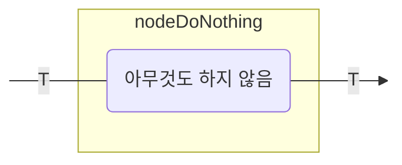
<!--- KNIT example-nodes-and-component-02.txt -->

이 노드는 다음과 같은 목적으로 사용할 수 있습니다:

- 그래프에 플레이스홀더(placeholder) 노드 생성.
- 데이터를 수정하지 않고 연결 지점 생성.

예시는 다음과 같습니다:

=== "Kotlin"

    <!--- INCLUDE
    import ai.koog.agents.core.dsl.builder.forwardTo
    import ai.koog.agents.core.dsl.builder.strategy
    import ai.koog.agents.core.dsl.builder.node
    import ai.koog.agents.core.dsl.extension.nodeDoNothing
    val strategy = strategy<String, String>("strategy_name") {
    -->
    <!--- SUFFIX
    }
    -->
    ```kotlin
    val passthrough by nodeDoNothing<String>("passthrough")

    edge(nodeStart forwardTo passthrough)
    edge(passthrough forwardTo nodeFinish)
    ```
    <!--- KNIT example-nodes-and-component-02.kt -->

=== "Java"
    
    <!--- INCLUDE
    import ai.koog.agents.core.agent.entity.AIAgentGraphStrategy;
    import ai.koog.agents.core.agent.entity.AIAgentNode;
    class exampleNodesAndComponentsJava02 {
        public static void main(String[] args) {
            var strategy = AIAgentGraphStrategy.builder("strategy_name")
                .withInput(String.class)
                .withOutput(String.class);
    -->
    <!--- SUFFIX
        }
    }
    -->
    ```java
    var passthrough = AIAgentNode.doNothing(String.class);

    strategy.edge(strategy.nodeStart, passthrough);
    strategy.edge(passthrough, strategy.nodeFinish);
    ```
    <!--- KNIT exampleNodesAndComponentsJava02.java -->

## LLM 노드

### nodeAppendPrompt

제공된 프롬프트 빌더를 사용하여 LLM 프롬프트에 메시지를 추가하는 노드입니다.
실제 LLM 요청을 보내기 전에 대화 컨텍스트를 수정하는 데 유용합니다. 자세한 내용은 [API 레퍼런스](api:agents-core::ai.koog.agents.core.dsl.extension.nodeUpdatePrompt)를 참조하세요.

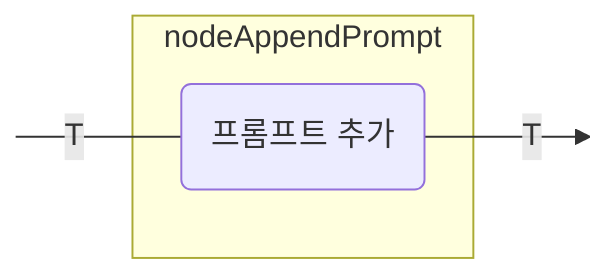
<!--- KNIT example-nodes-and-component-03.txt -->

이 노드는 다음과 같은 목적으로 사용할 수 있습니다:

- 프롬프트에 시스템 지침 추가.
- 대화에 사용자 메시지 삽입.
- 후속 LLM 요청을 위한 컨텍스트 준비.

예시는 다음과 같습니다:

=== "Kotlin"

    <!--- INCLUDE
    import ai.koog.agents.core.dsl.builder.forwardTo
    import ai.koog.agents.core.dsl.builder.strategy
    import ai.koog.agents.core.dsl.builder.node
    import ai.koog.agents.core.dsl.extension.nodeAppendPrompt
    typealias Input = Unit
    typealias Output = Unit
    val strategy = strategy<String, String>("strategy_name") {
    -->
    <!--- SUFFIX
    }
    -->
    ```kotlin
    val firstNode by node<Input, Output> {
        // 입력을 출력으로 변환
    }

    val secondNode by node<Output, Output> {
        // 출력을 출력으로 변환
    }

    // 이 노드는 이전 노드로부터 Output 타입의 값을 입력으로 받아 다음 노드로 전달합니다.
    val setupContext by nodeAppendPrompt<Output>("setupContext") {
        system("You are a helpful assistant specialized in Kotlin programming.")
        user("I need help with Kotlin coroutines.")
    }

    edge(firstNode forwardTo setupContext)
    edge(setupContext forwardTo secondNode)
    ```
    <!--- KNIT example-nodes-and-component-03.kt -->

=== "Java"

    <!--- INCLUDE
    import ai.koog.agents.core.agent.entity.AIAgentGraphStrategy;
    import ai.koog.agents.core.agent.entity.AIAgentNode;
    class exampleNodesAndComponentsJava03 {
        class Output {}
        class Input extends Output { }
        public static void main(String[] args) {
            var strategy = AIAgentGraphStrategy.builder("strategy_name")
                .withInput(String.class)
                .withOutput(String.class);
    -->
    <!--- SUFFIX
        }
    }
    -->
    ```java
    var firstNode = AIAgentNode.builder()
        .withInput(Input.class)
        .withOutput(Output.class)
        .withAction((input, ctx) -> {
            // 입력을 출력으로 변환
            return input;
        })
        .build();

    var secondNode = AIAgentNode.builder()
        .withInput(Output.class)
        .withOutput(Output.class)
        .withAction((output, ctx) -> {
            // 출력을 출력으로 변환
            return output;
        })
        .build();

    var setupContext = AIAgentNode.builder()
        .withInput(Output.class)
        .appendPrompt(prompt -> {
            prompt.system("You are a helpful assistant specialized in Kotlin programming.");
            prompt.user("I need help with Kotlin coroutines.");
        });

    strategy.edge(firstNode, setupContext);
    strategy.edge(setupContext, secondNode);
    ```
    <!--- KNIT exampleNodesAndComponentsJava03.java -->

### nodeLLMSendMessageOnlyCallingTools

LLM 프롬프트에 사용자 메시지를 추가하고, LLM이 오직 도구만 호출할 수 있는 응답을 받는 노드입니다. 자세한 내용은 [API 레퍼런스](api:agents-core::ai.koog.agents.core.dsl.extension.nodeLLMSendMessageOnlyCallingTools)를 참조하세요.

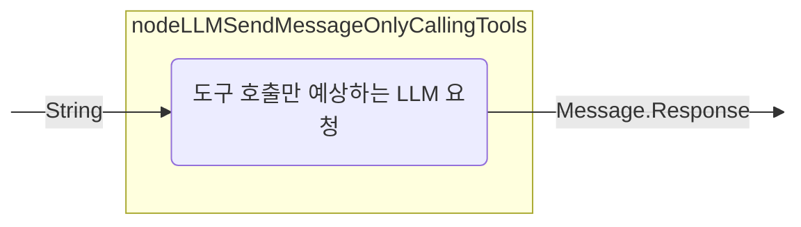
<!--- KNIT example-nodes-and-component-04.txt -->

### nodeLLMSendMessageForceOneTool

LLM 프롬프트에 사용자 메시지를 추가하고 LLM이 특정 도구를 반드시 사용하도록 강제하는 노드입니다. 자세한 내용은 [API 레퍼런스](api:agents-core::ai.koog.agents.core.dsl.extension.nodeLLMSendMessageForceOneTool)를 참조하세요.

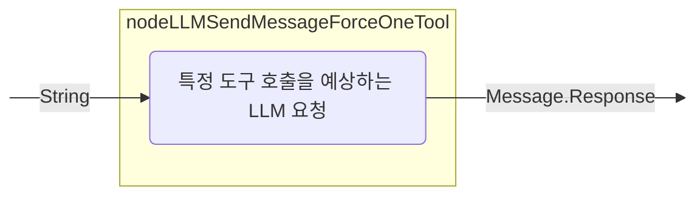
<!--- KNIT example-nodes-and-component-05.txt -->

### nodeLLMRequest

LLM 프롬프트에 사용자 메시지를 추가하고 선택적인 도구 사용과 함께 응답을 받는 노드입니다. 노드 구성에 따라 메시지 처리 중에 도구 호출을 허용할지 여부가 결정됩니다. 자세한 내용은 [API 레퍼런스](api:agents-core::ai.koog.agents.core.dsl.extension.nodeLLMRequest)를 참조하세요.

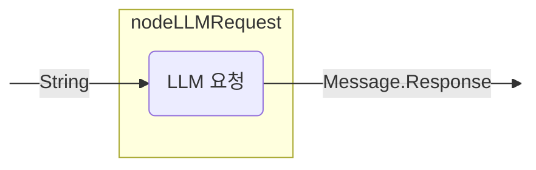
<!--- KNIT example-nodes-and-component-06.txt -->

이 노드는 다음과 같은 목적으로 사용할 수 있습니다:

- 현재 프롬프트에 대해 LLM 응답을 생성하며, LLM이 도구 호출을 생성할 수 있는지 제어합니다.

예시는 다음과 같습니다:

=== "Kotlin"

    <!--- INCLUDE
    import ai.koog.agents.core.dsl.builder.forwardTo
    import ai.koog.agents.core.dsl.builder.strategy
    import ai.koog.agents.core.dsl.builder.node
    import ai.koog.agents.core.dsl.extension.nodeLLMRequest
    import ai.koog.agents.core.dsl.extension.nodeDoNothing
    val strategy = strategy<String, String>("strategy_name") {
        val getUserQuestion by nodeDoNothing<String>()
    -->
    <!--- SUFFIX
    }
    -->
    ```kotlin
    val requestLLM by nodeLLMRequest("requestLLM", allowToolCalls = true)
    edge(getUserQuestion forwardTo requestLLM)
    ```
    <!--- KNIT example-nodes-and-component-04.kt -->

=== "Java"

    <!--- INCLUDE
    import ai.koog.agents.core.agent.entity.AIAgentGraphStrategy;
    import ai.koog.agents.core.agent.entity.AIAgentNode;
    class exampleNodesAndComponentsJava04 {
        public static void main(String[] args) {
            var strategy = AIAgentGraphStrategy.builder("strategy_name")
                .withInput(String.class)
                .withOutput(String.class);
            var getUserQuestion = AIAgentNode.builder("getUserQuestion")
                .withInput(String.class)
                .withOutput(String.class)
                .withAction((input, ctx) -> input)
                .build();
    -->
    <!--- SUFFIX
        }
    }
    -->
    ```java
    var requestLLM = AIAgentNode.llmRequest(true, "requestLLM");

    strategy.edge(getUserQuestion, requestLLM);
    ```
    <!--- KNIT exampleNodesAndComponentsJava04.java -->

### nodeLLMRequestStructured

LLM 프롬프트에 사용자 메시지를 추가하고 에러 수정 기능이 포함된 구조화된 데이터를 LLM에 요청하는 노드입니다. 자세한 내용은 [API 레퍼런스](api:agents-core::ai.koog.agents.core.dsl.extension.nodeLLMRequestStructured)를 참조하세요.

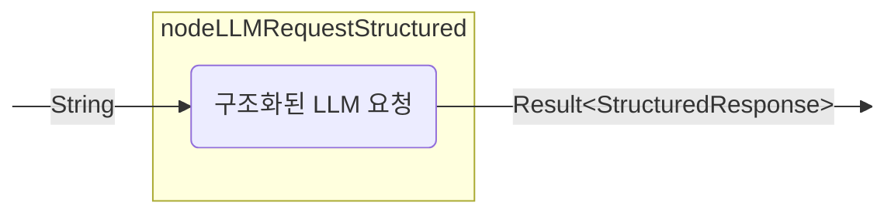
<!--- KNIT example-nodes-and-component-07.txt -->

### nodeLLMRequestStreaming

LLM 프롬프트에 사용자 메시지를 추가하고, 스트림 데이터 변환 유무와 관계없이 LLM 응답을 스트리밍하는 노드입니다. 자세한 내용은 [API 레퍼런스](api:agents-core::ai.koog.agents.core.dsl.extension.nodeLLMRequestStreaming)를 참조하세요.

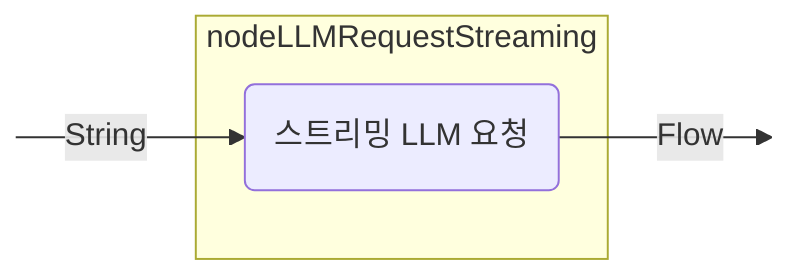
<!--- KNIT example-nodes-and-component-08.txt -->

### nodeLLMRequestMultiple

LLM 프롬프트에 사용자 메시지를 추가하고 도구 호출이 활성화된 상태에서 여러 LLM 응답을 받는 노드입니다. 자세한 내용은 [API 레퍼런스](api:agents-core::ai.koog.agents.core.dsl.extension.nodeLLMRequestMultiple)를 참조하세요.

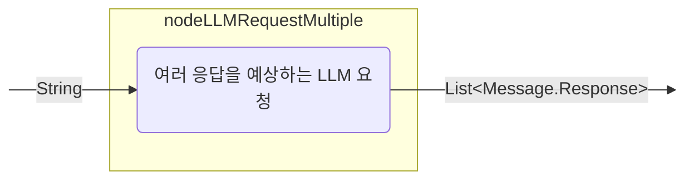
<!--- KNIT example-nodes-and-component-09.txt -->

이 노드는 다음과 같은 목적으로 사용할 수 있습니다:

- 여러 도구 호출이 필요한 복잡한 쿼리 처리.
- 여러 도구 호출 생성.
- 여러 병렬 작업이 필요한 워크플로 구현.

예시는 다음과 같습니다:

=== "Kotlin"

    <!--- INCLUDE
    import ai.koog.agents.core.dsl.builder.forwardTo
    import ai.koog.agents.core.dsl.builder.strategy
    import ai.koog.agents.core.dsl.builder.node
    import ai.koog.agents.core.dsl.extension.nodeLLMRequestMultiple
    import ai.koog.agents.core.dsl.extension.nodeDoNothing
    val strategy = strategy<String, String>("strategy_name") {
        val getComplexUserQuestion by nodeDoNothing<String>()
    -->
    <!--- SUFFIX
    }
    -->
    ```kotlin
    val requestLLMMultipleTools by nodeLLMRequestMultiple()
    edge(getComplexUserQuestion forwardTo requestLLMMultipleTools)
    ```
    <!--- KNIT example-nodes-and-component-05.kt -->

=== "Java"

    <!--- INCLUDE
    import ai.koog.agents.core.agent.entity.AIAgentGraphStrategy;
    import ai.koog.agents.core.agent.entity.AIAgentNode;
    class exampleNodesAndComponentsJava05 {
        public static void main(String[] args) {
            var strategy = AIAgentGraphStrategy.builder("strategy_name")
                .withInput(String.class)
                .withOutput(String.class);
            var getComplexUserQuestion = AIAgentNode.builder("getComplexUserQuestion")
                .withInput(String.class)
                .withOutput(String.class)
                .withAction((input, ctx) -> input)
                .build();
    -->
    <!--- SUFFIX
        }
    }
    -->
    ```java
    var requestLLMMultipleTools = AIAgentNode.llmRequestMultiple("requestLLMMultipleTools");

    strategy.edge(getComplexUserQuestion, requestLLMMultipleTools);
    ```
    <!--- KNIT exampleNodesAndComponentsJava05.java -->

### nodeLLMCompressHistory

현재 LLM 프롬프트(메시지 히스토리)를 요약(TL;DR)으로 압축하여 메시지를 간결한 요약으로 대체하는 노드입니다. 자세한 내용은 [API 레퍼런스](api:agents-core::ai.koog.agents.core.dsl.extension.nodeLLMCompressHistory)를 참조하세요.
히스토리를 압축하여 토큰 사용량을 줄임으로써 긴 대화를 관리하는 데 유용합니다.

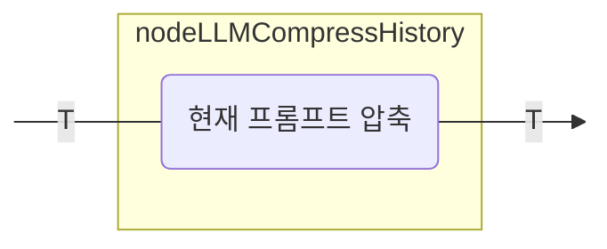
<!--- KNIT example-nodes-and-component-10.txt -->

히스토리 압축에 대해 더 자세히 알아보려면 [히스토리 압축](history-compression.md)을 참조하세요.

이 노드는 다음과 같은 목적으로 사용할 수 있습니다:

- 긴 대화를 관리하여 토큰 사용량 절감.
- 대화 히스토리를 요약하여 컨텍스트 유지.
- 장기 실행 에이전트에서의 메모리 관리 구현.

예시는 다음과 같습니다:

=== "Kotlin"

    <!--- INCLUDE
    import ai.koog.agents.core.dsl.builder.forwardTo
    import ai.koog.agents.core.dsl.builder.strategy
    import ai.koog.agents.core.dsl.builder.node
    import ai.koog.agents.core.dsl.extension.nodeLLMCompressHistory
    import ai.koog.agents.core.dsl.extension.nodeDoNothing
    import ai.koog.agents.core.dsl.extension.HistoryCompressionStrategy
    val strategy = strategy<String, String>("strategy_name") {
        val generateHugeHistory by nodeDoNothing<String>()
    -->
    <!--- SUFFIX
    }
    -->
    ```kotlin
    val compressHistory by nodeLLMCompressHistory<String>(
        "compressHistory",
        strategy = HistoryCompressionStrategy.FromLastNMessages(10),
        preserveMemory = true
    )
    edge(generateHugeHistory forwardTo compressHistory)
    ```
    <!--- KNIT example-nodes-and-component-06.kt -->

=== "Java"
    
    <!--- INCLUDE
    import ai.koog.agents.core.agent.entity.AIAgentGraphStrategy;
    import ai.koog.agents.core.agent.entity.AIAgentNode;
    class exampleNodesAndComponentsJava06 {
        public static void main(String[] args) {
            var strategy = AIAgentGraphStrategy.builder("strategy_name")
                .withInput(String.class)
                .withOutput(String.class);
            var generateHugeHistory = AIAgentNode.builder("generateHugeHistory")
                .withInput(String.class)
                .withOutput(String.class)
                .withAction((input, ctx) -> input)
                .build();
    -->
    <!--- SUFFIX
        }
    }
    -->
    ```java
    var compressHistory = AIAgentNode.llmCompressHistory("compressHistory")
        .withInput(String.class)
        .build();

    strategy.edge(generateHugeHistory, compressHistory);
    ```
    <!--- KNIT exampleNodesAndComponentsJava06.java -->

## 도구 노드

### nodeExecuteTool

단일 도구 호출을 실행하고 그 결과를 반환하는 노드입니다. 이 노드는 LLM이 요청한 도구 호출을 처리하는 데 사용됩니다. 자세한 내용은 [API 레퍼런스](api:agents-core::ai.koog.agents.core.dsl.extension.nodeExecuteTool)를 참조하세요.

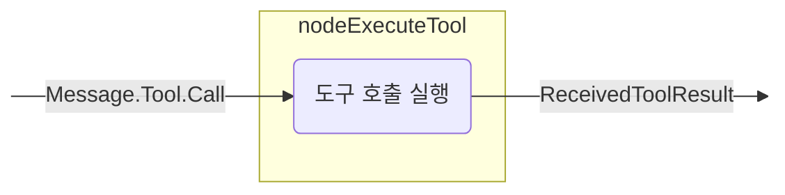
<!--- KNIT example-nodes-and-component-11.txt -->

이 노드는 다음과 같은 목적으로 사용할 수 있습니다:

- LLM이 요청한 도구 실행.
- LLM의 결정에 따른 특정 작업 처리.
- 외부 기능을 에이전트 워크플로에 통합.

예시는 다음과 같습니다:

=== "Kotlin"

    <!--- INCLUDE
    import ai.koog.agents.core.dsl.builder.forwardTo
    import ai.koog.agents.core.dsl.builder.strategy
    import ai.koog.agents.core.dsl.builder.node
    import ai.koog.agents.core.dsl.extension.nodeExecuteTool
    import ai.koog.agents.core.dsl.extension.nodeLLMRequest
    import ai.koog.agents.core.dsl.extension.onToolCall
    val strategy = strategy<String, String>("strategy_name") {
    -->
    <!--- SUFFIX
    }
    -->
    ```kotlin
    val requestLLM by nodeLLMRequest()
    val executeTool by nodeExecuteTool()
    edge(requestLLM forwardTo executeTool onToolCall { true })
    ```
    <!--- KNIT example-nodes-and-component-07.kt -->

=== "Java"

    <!--- INCLUDE
    import ai.koog.agents.core.agent.entity.AIAgentGraphStrategy;
    import ai.koog.agents.core.agent.entity.AIAgentNode;
    import ai.koog.agents.core.agent.entity.AIAgentEdge;
    import ai.koog.prompt.message.Message;
    class exampleNodesAndComponentsJava07 {
        public static void main(String[] args) {
            var strategy = AIAgentGraphStrategy.builder("strategy_name")
                .withInput(String.class)
                .withOutput(String.class);
    -->
    <!--- SUFFIX
        }
    }
    -->
    ```java
    var requestLLM = AIAgentNode.llmRequest(true, "requestLLM");
    var executeTool = AIAgentNode.executeTool("executeTool");

    strategy.edge(AIAgentEdge.builder()
        .from(requestLLM)
        .to(executeTool)
        .onIsInstance(Message.Tool.Call.class)
        .build());
    ```
    <!--- KNIT exampleNodesAndComponentsJava07.java -->

### nodeLLMSendToolResult

프롬프트에 도구 결과를 추가하고 LLM 응답을 요청하는 노드입니다. 자세한 내용은 [API 레퍼런스](api:agents-core::ai.koog.agents.core.dsl.extension.nodeLLMSendToolResult)를 참조하세요.

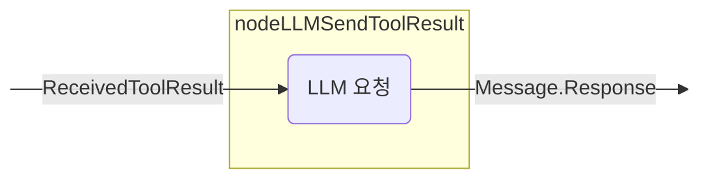
<!--- KNIT example-nodes-and-component-12.txt -->

이 노드는 다음과 같은 목적으로 사용할 수 있습니다:

- 도구 실행 결과 처리.
- 도구 출력을 기반으로 응답 생성.
- 도구 실행 후 대화 계속 진행.

예시는 다음과 같습니다:

=== "Kotlin"

    <!--- INCLUDE
    import ai.koog.agents.core.dsl.builder.forwardTo
    import ai.koog.agents.core.dsl.builder.strategy
    import ai.koog.agents.core.dsl.builder.node
    import ai.koog.agents.core.dsl.extension.nodeExecuteTool
    import ai.koog.agents.core.dsl.extension.nodeLLMSendToolResult
    val strategy = strategy<String, String>("strategy_name") {
    -->
    <!--- SUFFIX
    }
    -->
    ```kotlin
    val executeTool by nodeExecuteTool()
    val sendToolResultToLLM by nodeLLMSendToolResult()
    edge(executeTool forwardTo sendToolResultToLLM)
    ```
    <!--- KNIT example-nodes-and-component-08.kt -->

=== "Java"
    
    <!--- INCLUDE
    import ai.koog.agents.core.agent.entity.AIAgentGraphStrategy;
    import ai.koog.agents.core.agent.entity.AIAgentNode;
    class exampleNodesAndComponentsJava08 {
        public static void main(String[] args) {
            var strategy = AIAgentGraphStrategy.builder("strategy_name")
                .withInput(String.class)
                .withOutput(String.class);
    -->
    <!--- SUFFIX
        }
    }
    -->
    ```java
    var executeTool = AIAgentNode.executeTool("executeTool");
    var sendToolResultToLLM = AIAgentNode.llmSendToolResult("sendToolResultToLLM");

    strategy.edge(executeTool, sendToolResultToLLM);
    ```
    <!--- KNIT exampleNodesAndComponentsJava08.java -->

### nodeExecuteMultipleTools

여러 도구 호출을 실행하는 노드입니다. 이러한 호출은 선택적으로 병렬 실행될 수 있습니다. 자세한 내용은 [API 레퍼런스](api:agents-core::ai.koog.agents.core.dsl.extension.nodeExecuteMultipleTools)를 참조하세요.

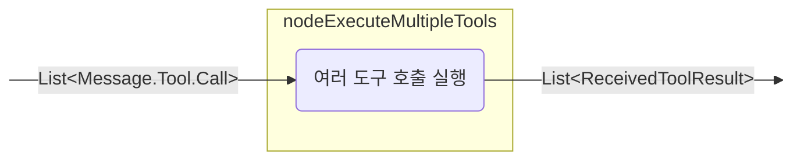
<!--- KNIT example-nodes-and-component-13.txt -->

이 노드는 다음과 같은 목적으로 사용할 수 있습니다:

- 여러 도구를 병렬로 실행.
- 여러 도구 실행이 필요한 복잡한 워크플로 처리.
- 도구 호출을 일괄 처리하여 성능 최적화.

예시는 다음과 같습니다:

=== "Kotlin"

    <!--- INCLUDE
    import ai.koog.agents.core.dsl.builder.forwardTo
    import ai.koog.agents.core.dsl.builder.strategy
    import ai.koog.agents.core.dsl.builder.node
    import ai.koog.agents.core.dsl.extension.nodeLLMRequestMultiple
    import ai.koog.agents.core.dsl.extension.nodeExecuteMultipleTools
    import ai.koog.agents.core.dsl.extension.onMultipleToolCalls
    val strategy = strategy<String, String>("strategy_name") {
    -->
    <!--- SUFFIX
    }
    -->
    ```kotlin
    val requestLLMMultipleTools by nodeLLMRequestMultiple()
    val executeMultipleTools by nodeExecuteMultipleTools()
    edge(requestLLMMultipleTools forwardTo executeMultipleTools onMultipleToolCalls { true })
    ```
    <!--- KNIT example-nodes-and-component-09.kt -->

=== "Java"

    <!--- INCLUDE
    import ai.koog.agents.core.agent.entity.AIAgentGraphStrategy;
    import ai.koog.agents.core.agent.entity.AIAgentNode;
    import ai.koog.agents.core.agent.entity.AIAgentEdge;
    import ai.koog.prompt.message.Message;
    class exampleNodesAndComponentsJava09 {
        public static void main(String[] args) {
            var strategy = AIAgentGraphStrategy.builder("strategy_name")
                .withInput(String.class)
                .withOutput(String.class);
    -->
    <!--- SUFFIX
        }
    }
    -->
    ```java
    var requestLLMMultipleTools = AIAgentNode.llmRequestMultiple("requestLLMMultipleTools");
    var executeMultipleTools = AIAgentNode.executeMultipleTools(false, "executeMultipleTools");

    // 응답 리스트에서 도구 호출 추출
    strategy.edge(AIAgentEdge.builder()
        .from(requestLLMMultipleTools)
        .to(executeMultipleTools)
        .onCondition(responses -> responses.stream()
            .anyMatch(msg -> msg instanceof Message.Tool.Call))
        .transformed(responses -> responses.stream()
            .filter(msg -> msg instanceof Message.Tool.Call)
            .map(msg -> (Message.Tool.Call) msg)
            .toList())
        .build());
    ```
    <!--- KNIT exampleNodesAndComponentsJava09.java -->

### nodeLLMSendMultipleToolResults

프롬프트에 여러 도구 결과를 추가하고 여러 LLM 응답을 받는 노드입니다. 자세한 내용은 [API 레퍼런스](api:agents-core::ai.koog.agents.core.dsl.extension.nodeLLMSendMultipleToolResults)를 참조하세요.

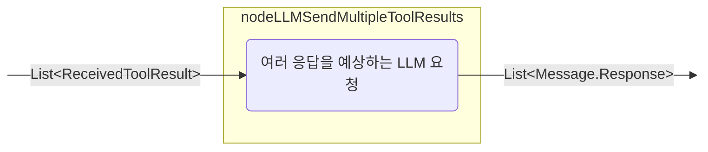
<!--- KNIT example-nodes-and-component-14.txt -->

이 노드는 다음과 같은 목적으로 사용할 수 있습니다:

- 여러 도구 실행의 결과 처리.
- 여러 도구 호출 생성.
- 여러 병렬 작업이 포함된 복잡한 워크플로 구현.

예시는 다음과 같습니다:

=== "Kotlin"

    <!--- INCLUDE
    import ai.koog.agents.core.dsl.builder.forwardTo
    import ai.koog.agents.core.dsl.builder.strategy
    import ai.koog.agents.core.dsl.builder.node
    import ai.koog.agents.core.dsl.extension.nodeLLMSendMultipleToolResults
    import ai.koog.agents.core.dsl.extension.nodeExecuteMultipleTools
    val strategy = strategy<String, String>("strategy_name") {
    -->
    <!--- SUFFIX
    }
    -->
    ```kotlin
    val executeMultipleTools by nodeExecuteMultipleTools()
    val sendMultipleToolResultsToLLM by nodeLLMSendMultipleToolResults()
    edge(executeMultipleTools forwardTo sendMultipleToolResultsToLLM)
    ```
    <!--- KNIT example-nodes-and-component-10.kt -->

=== "Java"
    
    <!--- INCLUDE
    import ai.koog.agents.core.agent.entity.AIAgentGraphStrategy;
    import ai.koog.agents.core.agent.entity.AIAgentNode;
    import ai.koog.prompt.message.Message;
    class exampleNodesAndComponentsJava10 {
        public static void main(String[] args) {
            var strategy = AIAgentGraphStrategy.builder("strategy_name")
                .withInput(String.class)
                .withOutput(String.class);
    -->
    <!--- SUFFIX
        }
    }
    -->
    ```java
    var executeMultipleTools = AIAgentNode.executeMultipleTools(false, "executeMultipleTools");
    var sendMultipleToolResultsToLLM = AIAgentNode.llmSendMultipleToolResults("sendMultipleToolResultsToLLM");

    strategy.edge(executeMultipleTools, sendMultipleToolResultsToLLM);
    ```
    <!--- KNIT exampleNodesAndComponentsJava10.java -->

## 노드 출력 변환

프레임워크는 출력에 변환을 적용하는 변환된 버전의 노드를 만들 수 있는 `transform` 확장 함수를 제공합니다. 이는 기존 노드의 기능은 유지하면서 노드의 출력을 다른 타입이나 형식으로 변환해야 할 때 유용합니다.

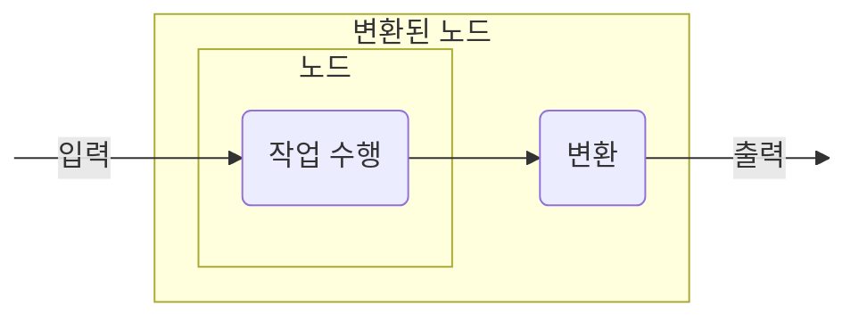
<!--- KNIT example-nodes-and-component-15.txt -->

### transform

[`transform()`](api:agents-core::ai.koog.agents.core.dsl.builder.AIAgentNodeDelegate.transform) 함수는 원래 노드를 래핑하고 출력에 변환 함수를 적용하는 새로운 `AIAgentNodeDelegate`를 생성합니다.

=== "Kotlin"

    <!--- INCLUDE
    /**
    -->
    <!--- SUFFIX
    **/
    -->
    ```kotlin
    inline fun <reified T> AIAgentNodeDelegate<Input, Output>.transform(
        noinline transformation: suspend (Output) -> T
    ): AIAgentNodeDelegate<Input, T>
    ```
    <!--- KNIT example-nodes-and-component-11.kt -->

=== "Java"

    ```java
    // Java에서는 AIAgentNode.builder()와 명시적 타입 파라미터를 사용하여
    // 변환 로직이 포함된 노드를 수동으로 구성해야 합니다.
    // 노드 변환에 대한 Java 접근 방식은 아래 예시를 참조하세요.
    ```
    <!--- KNIT example-nodes-and-component-java-01.java -->

#### 커스텀 노드 변환

커스텀 노드의 출력을 다른 데이터 타입으로 변환합니다:

=== "Kotlin"

    <!--- INCLUDE
    import ai.koog.agents.core.dsl.builder.forwardTo
    import ai.koog.agents.core.dsl.builder.strategy
    import ai.koog.agents.core.dsl.builder.node
    import ai.koog.agents.core.dsl.extension.nodeDoNothing
    val strategy = strategy<String, Int>("strategy_name") {
    -->
    <!--- SUFFIX
    }
    -->
    ```kotlin
    val textNode by nodeDoNothing<String>("textNode").transform<Int> { text ->
        text.split(" ").filter { it.isNotBlank() }.size
    }

    edge(nodeStart forwardTo textNode)
    edge(textNode forwardTo nodeFinish)
    ```
    <!--- KNIT example-nodes-and-component-12.kt -->

=== "Java"
    
    <!--- INCLUDE
    import ai.koog.agents.core.agent.entity.AIAgentGraphStrategy;
    import ai.koog.agents.core.agent.entity.AIAgentNode;
    class exampleNodesAndComponentsJava11 {
        public static void main(String[] args) {
            var strategy = AIAgentGraphStrategy.builder("strategy_name")
                .withInput(String.class)
                .withOutput(Integer.class);
    -->
    <!--- SUFFIX
        }
    }
    -->
    ```java
    var textNode = AIAgentNode.builder("textNode")
        .withInput(String.class)
        .withOutput(Integer.class)
        .withAction((text, ctx) -> {
            String[] words = text.split(" ");
            int count = 0;
            for (String word : words) {
                if (!word.isBlank()) {
                    count++;
                }
            }
            return count;
        })
        .build();

    strategy.edge(strategy.nodeStart, textNode);
    strategy.edge(textNode, strategy.nodeFinish);
    ```
    <!--- KNIT exampleNodesAndComponentsJava11.java -->

#### 내장 노드 변환

`nodeLLMRequest`와 같은 내장 노드의 출력을 변환합니다:

=== "Kotlin"

    <!--- INCLUDE
    import ai.koog.agents.core.dsl.builder.forwardTo
    import ai.koog.agents.core.dsl.builder.strategy
    import ai.koog.agents.core.dsl.builder.node
    import ai.koog.agents.core.dsl.extension.nodeLLMRequest
    val strategy = strategy<String, Int>("strategy_name") {
    -->
    <!--- SUFFIX
    }
    -->
    ```kotlin
    val lengthNode by nodeLLMRequest("llmRequest").transform<Int> { assistantMessage ->
        assistantMessage.content.length
    }

    edge(nodeStart forwardTo lengthNode)
    edge(lengthNode forwardTo nodeFinish)
    ```
    <!--- KNIT example-nodes-and-component-13.kt -->

=== "Java"
    
    <!--- INCLUDE
    import ai.koog.agents.core.agent.entity.AIAgentGraphStrategy;
    import ai.koog.agents.core.agent.entity.AIAgentNode;
    import ai.koog.prompt.message.Message;
    class exampleNodesAndComponentsJava12 {
        public static void main(String[] args) {
            var strategy = AIAgentGraphStrategy.builder("strategy_name")
                .withInput(String.class)
                .withOutput(Integer.class);
    -->
    <!--- SUFFIX
        }
    }
    -->
    ```java
    var llmRequest = AIAgentNode.llmRequest(true, "llmRequest");
    var lengthNode = AIAgentNode.builder("lengthNode")
        .withInput(Message.Response.class)
        .withOutput(Integer.class)
        .withAction((assistantMessage, ctx) -> {
            if (assistantMessage instanceof Message.Assistant) {
                return ((Message.Assistant) assistantMessage).getContent().length();
            }
            return 0;
        })
        .build();

    strategy.edge(strategy.nodeStart, llmRequest);
    strategy.edge(llmRequest, lengthNode);
    strategy.edge(lengthNode, strategy.nodeFinish);
    ```
    <!--- KNIT exampleNodesAndComponentsJava12.java -->

## 사전에 정의된 서브그래프

프레임워크는 자주 사용되는 패턴과 워크플로를 캡슐화한 사전에 정의된 서브그래프를 제공합니다. 이러한 서브그래프는 베이스 노드와 에지의 생성을 자동으로 처리하여 복잡한 에이전트 전략의 개발을 단순화합니다.

사전에 정의된 서브그래프를 사용하여 다음과 같은 다양한 인기 파이프라인을 구현할 수 있습니다. 예시는 다음과 같습니다:

1. 데이터 준비.
2. 작업 실행.
3. 작업 결과 검증. 결과가 올바르지 않으면 피드백 메시지와 함께 2단계로 돌아가 조정 수행.

### subgraphWithTask

제공된 도구를 사용하여 특정 작업을 수행하고 구조화된 결과를 반환하는 서브그래프입니다. 다중 응답 LLM 상호작용(어시스턴트가 도구 호출과 섞인 여러 응답을 생성할 수 있음)을 지원하며 도구 호출의 실행 방식을 제어할 수 있습니다. 자세한 내용은 [API 레퍼런스](api:agents-ext::ai.koog.agents.ext.agent.subgraphWithTask).

이 서브그래프는 다음과 같은 목적으로 사용할 수 있습니다:

- 더 큰 워크플로 내에서 특정 작업을 처리하는 특별한 컴포넌트 생성.
- 명확한 입력 및 출력 인터페이스를 가진 복잡한 로직 캡슐화.
- 작업별 도구, 모델 및 프롬프트 구성.
- 자동 압축 기능을 포함한 대화 히스토리 관리.
- 구조화된 에이전트 워크플로 및 작업 실행 파이프라인 개발.
- 여러 어시스턴트 응답 및 도구 호출이 포함된 흐름을 포함하여 LLM 작업 실행으로부터 구조화된 결과 생성.

API를 사용하면 다음과 같은 선택적 파라미터로 실행을 세밀하게 조정할 수 있습니다:

- runMode: 작업 중 도구 호출이 실행되는 방식 제어(기본값은 순차적). 기본 모델/실행기에서 지원하는 경우 다른 도구 실행 전략으로 전환하는 데 사용합니다.
- assistantResponseRepeatMax: 작업을 완료할 수 없다고 결론 내리기 전까지 허용되는 어시스턴트 응답 횟수를 제한합니다(제공되지 않으면 안전한 내부 제한값으로 설정됨).

작업을 텍스트로 서브그래프에 제공하고, 필요한 경우 LLM을 구성하고 필요한 도구를 제공하면 서브그래프가 작업을 처리하고 해결합니다. 예시는 다음과 같습니다:

=== "Kotlin"

    <!--- INCLUDE
    import ai.koog.agents.core.dsl.builder.strategy
    import ai.koog.agents.core.dsl.builder.node
    import ai.koog.agents.ext.tool.SayToUser
    import ai.koog.prompt.executor.clients.openai.OpenAIModels
    import ai.koog.agents.ext.agent.subgraphWithTask
    import ai.koog.agents.core.agent.ToolCalls
    val searchTool = SayToUser
    val calculatorTool = SayToUser
    val weatherTool = SayToUser
    val strategy = strategy<String, String>("strategy_name") {
    -->
    <!--- SUFFIX
    }
    -->
    ```kotlin
    val processQuery by subgraphWithTask<String, String>(
        tools = listOf(searchTool, calculatorTool, weatherTool),
        llmModel = OpenAIModels.Chat.GPT4o,
        runMode = ToolCalls.SEQUENTIAL,
        assistantResponseRepeatMax = 3,
    ) { userQuery ->
        """
        You are a helpful assistant that can answer questions about various topics.
        Please help with the following query:
        $userQuery
        """
    }
    ```
    <!--- KNIT example-nodes-and-component-14.kt -->

=== "Java"
    
    <!--- INCLUDE
    import ai.koog.agents.core.agent.entity.AIAgentGraphStrategy;
    import ai.koog.agents.core.agent.entity.AIAgentSubgraph;
    import ai.koog.agents.ext.tool.SayToUser;
    import java.util.List;
    class exampleNodesAndComponentsJava13 {
        public static void main(String[] args) {
            var strategy = AIAgentGraphStrategy.builder("strategy_name")
                .withInput(String.class)
                .withOutput(String.class);
            SayToUser searchTool = SayToUser.INSTANCE;
            SayToUser calculatorTool = SayToUser.INSTANCE;
            SayToUser weatherTool = SayToUser.INSTANCE;
    -->
    <!--- SUFFIX
        }
    }
    -->
    ```java
    var processQuery = AIAgentSubgraph.builder("processQuery")
        .limitedTools(List.of(searchTool, calculatorTool, weatherTool))
        .withInput(String.class)
        .withOutput(String.class)
        .withTask(userQuery ->
            "You are a helpful assistant that can answer questions about various topics.
" +
            "Please help with the following query:
" +
            userQuery)
        .build();
    ```
    <!--- KNIT exampleNodesAndComponentsJava13.java -->

### subgraphWithVerification

작업이 올바르게 수행되었는지 검증하고 발생한 문제에 대한 세부 정보를 제공하는 `subgraphWithTask`의 특수 버전입니다. 이 서브그래프는 유효성 검사 또는 품질 체크가 필요한 워크플로에 유용합니다. 자세한 내용은 [API 레퍼런스](api:agents-ext::ai.koog.agents.ext.agent.subgraphWithVerification).

이 서브그래프는 다음과 같은 목적으로 사용할 수 있습니다:

- 작업 실행의 정확성 검증.
- 워크플로에 품질 관리 프로세스 구현.
- 자체 검증 컴포넌트 생성.
- 성공/실패 상태 및 상세 피드백이 포함된 구조화된 검증 결과 생성.

이 서브그래프는 워크플로의 끝에서 LLM이 검증 도구를 호출하여 작업이 성공적으로 완료되었는지 확인하도록 보장합니다. 이 검증이 마지막 단계로 수행되도록 보장하며, 작업의 성공 여부와 상세 피드백을 나타내는 `CriticResult`를 반환합니다.
예시는 다음과 같습니다:

=== "Kotlin"

    <!--- INCLUDE
    import ai.koog.agents.core.dsl.builder.strategy
    import ai.koog.agents.core.dsl.builder.node
    import ai.koog.agents.ext.tool.SayToUser
    import ai.koog.prompt.executor.clients.anthropic.AnthropicModels
    import ai.koog.agents.ext.agent.subgraphWithVerification
    import ai.koog.agents.core.agent.ToolCalls
    val runTestsTool = SayToUser
    val analyzeTool = SayToUser
    val readFileTool = SayToUser
    val strategy = strategy<String, String>("strategy_name") {
    -->
    <!--- SUFFIX
    }
    -->
    ```kotlin
    val verifyCode by subgraphWithVerification<String>(
        tools = listOf(runTestsTool, analyzeTool, readFileTool),
        llmModel = AnthropicModels.Opus_4_6,
        runMode = ToolCalls.SEQUENTIAL,
        assistantResponseRepeatMax = 3,
    ) { codeToVerify ->
        """
        You are a code reviewer. Please verify that the following code meets all requirements:
        1. It compiles without errors
        2. All tests pass
        3. It follows the project's coding standards

        Code to verify:
        $codeToVerify
        """
    }
    ```
    <!--- KNIT example-nodes-and-component-15.kt -->

=== "Java"

    <!--- INCLUDE
    import ai.koog.agents.core.agent.entity.AIAgentGraphStrategy;
    import ai.koog.agents.core.agent.entity.AIAgentSubgraph;
    import ai.koog.agents.ext.tool.SayToUser;
    import java.util.List;
    class exampleNodesAndComponentsJava14 {
        public static void main(String[] args) {
            var strategy = AIAgentGraphStrategy.builder("strategy_name")
                .withInput(String.class)
                .withOutput(String.class);
            SayToUser runTestsTool = SayToUser.INSTANCE;
            SayToUser analyzeTool = SayToUser.INSTANCE;
            SayToUser readFileTool = SayToUser.INSTANCE;
    -->
    <!--- SUFFIX
        }
    }
    -->
    ```java
    var verifyCode = AIAgentSubgraph.builder("verifyCode")
        .limitedTools(List.of(runTestsTool, analyzeTool, readFileTool))
        .withInput(String.class)
        .withVerification(codeToVerify ->
            "You are a code reviewer. Please verify that the following code meets all requirements:
" +
            "1. It compiles without errors
" +
            "2. All tests pass
" +
            "3. It follows the project's coding standards
\n" +
            "Code to verify:
" +
            codeToVerify)
        .build();
    ```
    <!--- KNIT exampleNodesAndComponentsJava14.java -->

## 사전에 정의된 전략 및 공통 전략 패턴

프레임워크는 다양한 노드를 결합한 사전에 정의된 전략들을 제공합니다.
노드들은 에지를 사용하여 연결되어 작업 흐름을 정의하며, 각 에지를 따를 시점을 지정하는 조건이 포함됩니다.

필요에 따라 이러한 전략들을 에이전트 워크플로에 통합할 수 있습니다.

### 단회 실행 전략 (Single run strategy)

단회 실행 전략은 에이전트가 입력을 한 번 처리하고 결과를 반환하는 비대화형 유스케이스를 위해 설계되었습니다.

복잡한 로직이 필요하지 않은 단순한 프로세스를 실행해야 할 때 이 전략을 사용할 수 있습니다.

=== "Kotlin"

    <!--- INCLUDE
    import ai.koog.agents.core.agent.entity.AIAgentGraphStrategy
    import ai.koog.agents.core.dsl.builder.forwardTo
    import ai.koog.agents.core.dsl.builder.strategy
    import ai.koog.agents.core.dsl.builder.node
    import ai.koog.agents.core.dsl.extension.*
    -->
    ```kotlin
    public fun singleRunStrategy(): AIAgentGraphStrategy<String, String> = strategy("single_run") {
        val nodeCallLLM by nodeLLMRequest("sendInput")
        val nodeExecuteTool by nodeExecuteTool("nodeExecuteTool")
        val nodeSendToolResult by nodeLLMSendToolResult("nodeSendToolResult")

        edge(nodeStart forwardTo nodeCallLLM)
        edge(nodeCallLLM forwardTo nodeExecuteTool onToolCall { true })
        edge(nodeCallLLM forwardTo nodeFinish onAssistantMessage { true })
        edge(nodeExecuteTool forwardTo nodeSendToolResult)
        edge(nodeSendToolResult forwardTo nodeFinish onAssistantMessage { true })
        edge(nodeSendToolResult forwardTo nodeExecuteTool onToolCall { true })
    }
    ```
    <!--- KNIT example-nodes-and-component-16.kt -->

=== "Java"
    
    <!--- INCLUDE
    import ai.koog.agents.core.agent.entity.AIAgentEdge;
    import ai.koog.agents.core.agent.entity.AIAgentGraphStrategy;
    import ai.koog.agents.core.agent.entity.AIAgentNode;
    import ai.koog.prompt.message.Message;
    class exampleNodesAndComponentsJava15 {
    -->
    <!--- SUFFIX
        public static void main(String[] args) {
        }
    }
    -->
    ```java
    public static AIAgentGraphStrategy<String, String> singleRunStrategy() {
        var strategy = AIAgentGraphStrategy.builder("single_run")
            .withInput(String.class)
            .withOutput(String.class);

        var nodeCallLLM = AIAgentNode.llmRequest(true, "sendInput");
        var nodeExecuteTool = AIAgentNode.executeTool("nodeExecuteTool");
        var nodeSendToolResult = AIAgentNode.llmSendToolResult("nodeSendToolResult");

        strategy.edge(strategy.nodeStart, nodeCallLLM);

        strategy.edge(AIAgentEdge.builder()
            .from(nodeCallLLM)
            .to(nodeExecuteTool)
            .onIsInstance(Message.Tool.Call.class)
            .build());

        strategy.edge(AIAgentEdge.builder()
            .from(nodeCallLLM)
            .to(strategy.nodeFinish)
            .onIsInstance(Message.Assistant.class)
            .transformed(Message.Assistant::getContent)
            .build());

        strategy.edge(nodeExecuteTool, nodeSendToolResult);

        strategy.edge(AIAgentEdge.builder()
            .from(nodeSendToolResult)
            .to(strategy.nodeFinish)
            .onIsInstance(Message.Assistant.class)
            .transformed(Message.Assistant::getContent)
            .build());

        strategy.edge(AIAgentEdge.builder()
            .from(nodeSendToolResult)
            .to(nodeExecuteTool)
            .onIsInstance(Message.Tool.Call.class)
            .build());

        return strategy.build();
    }
    ```
    <!--- KNIT exampleNodesAndComponentsJava15.java -->

### 도구 기반 전략 (Tool-based strategy)

도구 기반 전략은 특정 작업을 수행하기 위해 도구에 크게 의존하는 워크플로를 위해 설계되었습니다.
일반적으로 LLM의 결정에 따라 도구를 실행하고 결과를 처리합니다.

=== "Kotlin"

    <!--- INCLUDE
    import ai.koog.agents.core.agent.entity.AIAgentGraphStrategy
    import ai.koog.agents.core.dsl.builder.forwardTo
    import ai.koog.agents.core.dsl.builder.strategy
    import ai.koog.agents.core.dsl.builder.node
    import ai.koog.agents.core.dsl.extension.*
    import ai.koog.agents.core.tools.ToolRegistry
    -->
    ```kotlin
    fun toolBasedStrategy(name: String, toolRegistry: ToolRegistry): AIAgentGraphStrategy<String, String> {
        return strategy(name) {
            val nodeSendInput by nodeLLMRequest()
            val nodeExecuteTool by nodeExecuteTool()
            val nodeSendToolResult by nodeLLMSendToolResult()

            // 에이전트의 흐름 정의
            edge(nodeStart forwardTo nodeSendInput)

            // LLM이 메시지로 응답하면 종료
            edge(
                (nodeSendInput forwardTo nodeFinish)
                        onAssistantMessage { true }
            )

            // LLM이 도구를 호출하면 실행
            edge(
                (nodeSendInput forwardTo nodeExecuteTool)
                        onToolCall { true }
            )

            // 도구 결과를 다시 LLM에 전송
            edge(nodeExecuteTool forwardTo nodeSendToolResult)

            // LLM이 다른 도구를 호출하면 실행
            edge(
                (nodeSendToolResult forwardTo nodeExecuteTool)
                        onToolCall { true }
            )

            // LLM이 메시지로 응답하면 종료
            edge(
                (nodeSendToolResult forwardTo nodeFinish)
                        onAssistantMessage { true }
            )
        }
    }
    ```
    <!--- KNIT example-nodes-and-component-17.kt -->

=== "Java"
    
    <!--- INCLUDE
    import ai.koog.agents.core.agent.entity.AIAgentEdge;
    import ai.koog.agents.core.agent.entity.AIAgentGraphStrategy;
    import ai.koog.agents.core.agent.entity.AIAgentNode;
    import ai.koog.prompt.message.Message;
    import ai.koog.agents.core.tools.ToolRegistry;
    class exampleNodesAndComponentsJava16 {
    -->
    <!--- SUFFIX
        public static void main(String[] args) {
        }
    }
    -->
    ```java
    public static AIAgentGraphStrategy<String, String> toolBasedStrategy(String name, ToolRegistry toolRegistry) {
        var strategy = AIAgentGraphStrategy.builder(name)
            .withInput(String.class)
            .withOutput(String.class);

        var nodeSendInput = AIAgentNode.llmRequest(true, "nodeSendInput");
        var nodeExecuteTool = AIAgentNode.executeTool("nodeExecuteTool");
        var nodeSendToolResult = AIAgentNode.llmSendToolResult("nodeSendToolResult");

        // 에이전트의 흐름 정의
        strategy.edge(strategy.nodeStart, nodeSendInput);

        // LLM이 메시지로 응답하면 종료
        strategy.edge(AIAgentEdge.builder()
            .from(nodeSendInput)
            .to(strategy.nodeFinish)
            .onIsInstance(Message.Assistant.class)
            .transformed(Message.Assistant::getContent)
            .build());

        // LLM이 도구를 호출하면 실행
        strategy.edge(AIAgentEdge.builder()
            .from(nodeSendInput)
            .to(nodeExecuteTool)
            .onIsInstance(Message.Tool.Call.class)
            .build());

        // 도구 결과를 다시 LLM에 전송
        strategy.edge(nodeExecuteTool, nodeSendToolResult);

        // LLM이 다른 도구를 호출하면 실행
        strategy.edge(AIAgentEdge.builder()
            .from(nodeSendToolResult)
            .to(nodeExecuteTool)
            .onIsInstance(Message.Tool.Call.class)
            .build());

        // LLM이 메시지로 응답하면 종료
        strategy.edge(AIAgentEdge.builder()
            .from(nodeSendToolResult)
            .to(strategy.nodeFinish)
            .onIsInstance(Message.Assistant.class)
            .transformed(Message.Assistant::getContent)
            .build());

        return strategy.build();
    }
    ```
    <!--- KNIT exampleNodesAndComponentsJava16.java -->

### 스트리밍 데이터 전략 (Streaming data strategy)

스트리밍 데이터 전략은 LLM으로부터 스트리밍 데이터를 처리하기 위해 설계되었습니다. 일반적으로 스트리밍 데이터를 요청하고, 이를 처리하며, 필요한 경우 처리된 데이터를 사용하여 도구를 호출합니다.

=== "Kotlin"

    <!--- INCLUDE
    import ai.koog.agents.core.dsl.builder.forwardTo
    import ai.koog.agents.core.dsl.builder.strategy
    import ai.koog.agents.core.dsl.builder.node
    import ai.koog.agents.example.exampleStreamingApi05.Book
    import ai.koog.agents.example.exampleStreamingApi06.markdownBookDefinition
    import ai.koog.agents.example.exampleStreamingApi08.parseMarkdownStreamToBooks
    -->
    ```kotlin
    val agentStrategy = strategy<String, List<Book>>("library-assistant") {
        // 출력 스트림 파싱을 포함하는 노드 정의
        val getMdOutput by node<String, List<Book>> { booksDescription ->
            val books = mutableListOf<Book>()
            val mdDefinition = markdownBookDefinition()

            llm.writeSession {
                appendPrompt { user(booksDescription) }
                // `mdDefinition` 정의 형식으로 응답 스트림 시작
                val markdownStream = requestLLMStreaming(mdDefinition)
                // 응답 스트림의 결과로 파서를 호출하고 결과에 대한 작업 수행
                parseMarkdownStreamToBooks(markdownStream).collect { book ->
                    books.add(book)
                    println("Parsed Book: ${book.title} by ${book.author}")
                }
            }

            books
        }
        // 노드에 접근 가능한지 확인하며 에이전트의 그래프 정의
        edge(nodeStart forwardTo getMdOutput)
        edge(getMdOutput forwardTo nodeFinish)
    }
    ```
    <!--- KNIT example-nodes-and-component-18.kt -->

=== "Java"

    <!--- INCLUDE
    import ai.koog.agents.core.agent.entity.AIAgentGraphStrategy;
    import ai.koog.agents.core.agent.entity.AIAgentNode;
    import ai.koog.prompt.streaming.StreamFrame;
    import ai.koog.prompt.structure.StructureDefinition;
    import ai.koog.prompt.structure.markdown.MarkdownStructureDefinition;
    import ai.koog.serialization.TypeCapture;
    import ai.koog.serialization.TypeToken;
    import java.util.ArrayList;
    import java.util.List;
    import java.util.concurrent.Flow;
    class exampleNodesAndComponentsJava17 {
        class Book {
            String getTitle() {
                return "";
            }
            String getAuthor() {
                return "";
            }
        }
        public static MarkdownStructureDefinition markdownBookDefinition() {
            return null;
        }
        public static Flow.Publisher<Book> parseMarkdownStreamToBooks(Flow.Publisher<StreamFrame> markdownStream) {
            return null;
        }
        public static void main(String[] args) {
    -->
    <!--- SUFFIX
        }
    }
    -->
    ```java
    var strategy = AIAgentGraphStrategy.builder()
        .withInput(String.class)
        .withOutput(List.class);

    var getMdOutput = AIAgentNode.builder()
        .withInput(String.class)
        .<List<Book>>withOutput(TypeToken.of(new TypeCapture<List<Book>>() {}))
        .withAction((booksDescription, ctx) -> {
            var books = new ArrayList<Book>();
            StructureDefinition mdDefinition = markdownBookDefinition();

            ctx.getLlm().writeSession(session -> {
                session.appendPrompt(prompt -> {
                    prompt.user(booksDescription);
                });

                // `mdDefinition` 정의 형식으로 응답 스트림 시작
                var markdownStream = session.requestLLMStreaming(mdDefinition);
                // 응답 스트림의 결과로 파서를 호출하고 결과에 대한 작업 수행
                parseMarkdownStreamToBooks(markdownStream).subscribe(new Flow.Subscriber<>() {
                    @Override
                    public void onSubscribe(Flow.Subscription subscription) {
                    }

                    @Override
                    public void onNext(Book book) {
                        books.add(book);
                        System.out.println("Parsed Book: " + book.getTitle() + " by " + book.getAuthor());
                    }

                    @Override
                    public void onError(Throwable throwable) {
                    }

                    @Override
                    public void onComplete() {
                    }
                });

                return null;
            });

            return books;
        })
        .build();

    strategy.edge(strategy.nodeStart, getMdOutput);
    strategy.edge(getMdOutput, strategy.nodeFinish);
    ```
    <!--- KNIT exampleNodesAndComponentsJava17.java -->