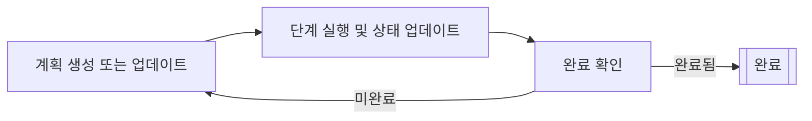

# 플래너 에이전트 (Planner agents)

플래너 에이전트는 반복적인 계획 주기를 통해 다단계 작업을 계획하고 실행할 수 있는 AI 에이전트입니다.
이들은 지속적으로 계획을 생성하거나 업데이트하고, 단계를 실행하며, 현재 상태를 기준으로 완료 기준을 확인합니다.

플래너 에이전트는 상위 수준의 목표를 더 작고 실행 가능한 단계로 나누고,
각 단계의 결과에 따라 계획을 조정해야 하는 복잡한 작업에 적합합니다.

플래너 에이전트는 다음과 같은 반복적인 계획 주기를 통해 작동합니다:

1. 플래너가 현재 상태를 기반으로 계획을 생성하거나 업데이트합니다.
2. 플래너가 계획에서 단계를 하나 실행하여 상태를 업데이트합니다.
3. 플래너가 현재 상태에 따라 계획이 완료되었는지 확인합니다.
    - 계획이 완료되면 주기가 종료됩니다.
    - 계획이 완료되지 않으면 첫 번째 단계부터 주기를 반복합니다.



## 사전 요구 사항

시작하기 전에 다음 사항을 준비했는지 확인하세요:

- 작동하는 Kotlin/JVM 프로젝트.
- Java 17 이상 설치.
- AI 에이전트를 구현하는 데 사용하는 LLM 제공업체의 유효한 API 키. 모든 사용 가능한 제공업체 목록은 [LLM 제공업체](llm-providers.md)를 참조하세요.

!!! tip
    API 키를 저장할 때는 환경 변수나 보안 구성 관리 시스템을 사용하세요.
    소스 코드에 API 키를 직접 하드코딩하지 마세요.

## 의존성 추가

플래너 에이전트를 사용하려면 빌드 설정에 다음 의존성을 추가하세요:

```
dependencies {
    implementation("ai.koog:koog-agents:VERSION")
}
```

사용 가능한 모든 설치 방법은 [Koog 설치하기](getting-started.md#install-koog)를 참조하세요.

## 단순 LLM 기반 플래너 (Simple LLM-based planners)

단순 LLM 기반 플래너는 LLM을 사용하여 계획을 생성하고 평가합니다.
이들은 문자열 기반 상태(string-based state)에서 작동하며 LLM 요청을 통해 단계를 실행합니다.
문자열 기반 상태란 에이전트의 상태가 단일 문자열로 기록됨을 의미하며,
에이전트는 초기 상태 문자열을 받아 결과로 최종 상태 문자열을 반환합니다.

Koog는 두 가지 단순 플래너를 제공합니다:

- [SimpleLLMPlanner](https://api.koog.ai/agents/agents-core/ai.koog.agents.planner.llm/-simple-l-l-m-planner/index.html)
    맨 처음에 한 번만 계획을 생성한 다음, 계획이 완료될 때까지 해당 계획을 따릅니다.
    재계획(replanning)을 포함하려면 `SimpleLLMPlanner`를 확장하고 `assessPlan` 메서드를 오버라이드하여 에이전트가 언제 재계획을 해야 하는지 지정하세요.
- [SimpleLLMWithCriticPlanner](https://api.koog.ai/agents/agents-core/ai.koog.agents.planner.llm/-simple-l-l-with-critic-planner/index.html)
    LLM을 사용하는 `assessPlan` 메서드를 구현합니다.
    이 메서드는 LLM 요청을 통해 계획의 유효성을 확인하고 에이전트가 재계획을 해야 하는지 평가합니다.

다음 예제는 `SimpleLLMPlanner`를 사용하여 간단한 플래너 에이전트를 만드는 방법을 보여줍니다:

<!--- INCLUDE
import ai.koog.agents.core.agent.config.AIAgentConfig
import ai.koog.agents.planner.AIAgentPlannerStrategy
import ai.koog.agents.planner.PlannerAIAgent
import ai.koog.agents.planner.llm.SimpleLLMPlanner
import ai.koog.prompt.dsl.prompt
import ai.koog.prompt.executor.clients.openai.OpenAIModels
import ai.koog.prompt.executor.llms.all.simpleOpenAIExecutor
import kotlinx.coroutines.runBlocking
-->
```kotlin
// 플래너 생성
val planner = SimpleLLMPlanner()

// 플래너 전략으로 감싸기
val strategy = AIAgentPlannerStrategy(
    name = "simple-planner",
    planner = planner
)

// 에이전트 구성
val agentConfig = AIAgentConfig(
    prompt = prompt("planner") {
        system("You are a helpful planning assistant.")
    },
    model = OpenAIModels.Chat.GPT4o,
    maxAgentIterations = 50
)

// 플래너 에이전트 생성
val agent = PlannerAIAgent(
    promptExecutor = simpleOpenAIExecutor(System.getenv("OPENAI_API_KEY")),
    strategy = strategy,
    agentConfig = agentConfig
)

suspend fun main() {
    // 작업을 사용하여 에이전트 실행
    val result = agent.run("Create a plan to organize a team meeting")
    println(result)
}
```
<!--- KNIT example-planner-01.kt -->

## GOAP (Goal-Oriented Action Planning)

GOAP(목표 지향적 행동 계획)는 최적의 행동 시퀀스를 찾기 위해 [A* 검색 (A* search)](https://en.wikipedia.org/wiki/A*_search_algorithm)을 사용하는 알고리즘 기반 계획 접근 방식입니다.
LLM을 사용하여 계획을 생성하는 대신, GOAP 에이전트는 사전 정의된 목표와 행동을 기반으로 행동 시퀀스를 자동으로 검색합니다.
Koog에서 GOAP는 목표와 행동을 선언적으로 정의할 수 있는 DSL을 통해 구현됩니다.

GOAP 플래너는 세 가지 주요 개념을 중심으로 작동합니다:

- **상태 (State)**: 세상의 현재 상태를 나타냅니다.
- **행동 (Actions)**: 전제 조건(preconditions), 효과(신념/beliefs), 비용(costs) 및 실행 로직을 포함하여 수행할 수 있는 작업을 정의합니다.
- **목표 (Goals)**: 목표 조건, 휴리스틱 비용(heuristic costs) 및 가치 함수를 정의합니다.

GOAP 플래너는 A* 검색을 사용하여 총 비용을 최소화하면서 목표 조건을 충족하는 행동 시퀀스를 찾습니다.

GOAP 에이전트를 만들려면 다음 단계가 필요합니다:

1. 목표와 관련된 다양한 측면을 나타내는 프로퍼티를 가진 데이터 클래스로 상태를 정의합니다.
2. [goap()](https://api.koog.ai/agents/agents-core/ai.koog.agents.planner.goap/goap.html) 함수를 사용하여 [GOAPPlanner](https://api.koog.ai/agents/agents-core/ai.koog.agents.planner.goap/-g-o-a-p-planner/index.html) 인스턴스를 생성합니다.
    1. [action()](https://api.koog.ai/agents/agents-core/ai.koog.agents.planner.goap/-g-o-a-p-planner-builder/action.html) 함수를 사용하여 전제 조건과 신념(beliefs)이 포함된 행동을 정의합니다.
    2. [goal()](https://api.koog.ai/agents/agents-core/ai.koog.agents.planner.goap/-g-o-a-p-planner-builder/goal.html) 함수를 사용하여 완료 조건이 포함된 목표를 정의합니다.
3. 플래너를 [AIAgentPlannerStrategy](https://api.koog.ai/agents/agents-core/ai.koog.agents.planner/-a-i-agent-planner-strategy/index.html)로 감싸고 [PlannerAIAgent](https://api.koog.ai/agents/agents-core/ai.koog.agents.planner/-planner-a-i-agent/index.html) 생성자에 전달합니다.

!!! note

    플래너는 개별 행동과 그 시퀀스를 선택합니다.
    각 행동에는 행동이 실행되기 위해 참이어야 하는 전제 조건과 예측된 결과를 정의하는 신념(belief)이 포함됩니다.
    신념에 대한 자세한 내용은 [실제 실행과 비교한 상태 신념](#실제-실행과-비교한-상태-신념) 섹션을 참조하세요.

다음 예제에서 GOAP는 기사 작성(개요 → 초안 → 검토 → 발행)을 위한 상위 수준 계획을 처리하며, LLM은 각 행동 내에서 실제 콘텐츠 생성을 수행합니다.

<!--- INCLUDE
import ai.koog.agents.core.agent.AIAgent
import ai.koog.agents.core.agent.config.AIAgentConfig
import ai.koog.agents.planner.AIAgentPlannerStrategy
import ai.koog.agents.planner.goap.GoapAgentState
import ai.koog.prompt.dsl.prompt
import ai.koog.prompt.executor.clients.openai.OpenAIModels
import ai.koog.prompt.executor.llms.all.simpleOpenAIExecutor
-->
```kotlin
// 콘텐츠 생성을 위한 상태 정의
data class ContentState(
    val topic: String,
    val hasOutline: Boolean = false,
    val outline: String = "",
    val hasDraft: Boolean = false,
    val draft: String = "",
    val hasReview: Boolean = false,
    val isPublished: Boolean = false
) : GoapAgentState<String, String>(topic) {
    // 에이전트의 출력물:
    override fun provideOutput(): String = draft
}

// 에이전트 생성 및 실행
val agentConfig = AIAgentConfig(
    prompt = prompt("writer") {
        system("You are a professional content writer.")
    },
    model = OpenAIModels.Chat.GPT4o,
    maxAgentIterations = 20
)

// LLM 기반 행동을 포함한 GOAP 플래너 전략 생성
val plannerStrategy = AIAgentPlannerStrategy.goap("content-planner", ::ContentState) {
    // 전제 조건과 신념을 포함한 행동 정의
    action(
        name = "Create outline",
        precondition = { state -> !state.hasOutline },
        belief = { state -> state.copy(hasOutline = true, outline = "Outline") },
        cost = { 1.0 }
    ) { ctx, state ->
        // LLM을 사용하여 개요 생성
        val response = ctx.llm.writeSession {
            appendPrompt {
                user("Create a detailed outline for an article about: ${state.topic}")
            }
            requestLLM()
        }
        state.copy(hasOutline = true, outline = response.content)
    }

    action(
        name = "Write draft",
        precondition = { state -> state.hasOutline && !state.hasDraft },
        belief = { state -> state.copy(hasDraft = true, draft = "Draft") },
        cost = { 2.0 }
    ) { ctx, state ->
        // LLM을 사용하여 초안 작성
        val response = ctx.llm.writeSession {
            appendPrompt {
                user("Write an article based on this outline:
${state.outline}")
            }
            requestLLM()
        }
        state.copy(hasDraft = true, draft = response.content)
    }

    action(
        name = "Review content",
        precondition = { state -> state.hasDraft && !state.hasReview },
        belief = { state -> state.copy(hasReview = true) },
        cost = { 1.0 }
    ) { ctx, state ->
        // LLM을 사용하여 초안 검토
        val response = ctx.llm.writeSession {
            appendPrompt {
                user("Review this article and suggest improvements:
${state.draft}")
            }
            requestLLM()
        }
        println("Review feedback: ${response.content}")
        state.copy(hasReview = true)
    }

    action(
        name = "Publish",
        precondition = { state -> state.hasReview && !state.isPublished },
        belief = { state -> state.copy(isPublished = true) },
        cost = { 1.0 }
    ) { ctx, state ->
        println("Publishing article...")
        state.copy(isPublished = true)
    }

    // 완료 조건을 포함한 목표 정의
    goal(
        name = "Published article",
        description = "Complete and publish the article",
        condition = { state -> state.isPublished }
    )
}

val agent = AIAgent(
    promptExecutor = simpleOpenAIExecutor(System.getenv("OPENAI_API_KEY")),
    strategy = plannerStrategy,
    agentConfig = agentConfig
)

suspend fun main() {
    val result = agent.run("The Future of AI in Software Development")
    println("Final draft: $result")
}
```
<!--- KNIT example-planner-02.kt -->

## 고급 GOAP 기능

### 사용자 정의 비용 함수 (Custom cost functions)

A* 검색은 최적의 행동 시퀀스를 찾기 위해 비용(cost)을 요소로 사용하므로, 플래너를 가이드하기 위해 행동과 목표에 대한 사용자 정의 비용 함수를 정의할 수 있습니다:

```kotlin
action(
    name = "Expensive operation",
    precondition = { true },
    belief = { state -> state.copy(operationDone = true) },
    cost = { state ->
        // 상태에 따른 동적 비용
        if (state.hasOptimization) 1.0 else 10.0
    }
) { ctx, state ->
    // 행동 실행
    state.copy(operationDone = true)
}
```

### 실제 실행과 비교한 상태 신념 (State beliefs compared to actual execution)

GOAP는 신념(belief, 낙관적 예측)과 실제 실행(actual execution)의 개념을 구분합니다:

- **신념 (Belief)**: 계획을 수립하기 위해 플래너가 발생할 것이라고 생각하는 것.
- **실행 (Execution)**: 실제 상태 업데이트에 사용되는, 실제로 발생하는 것.

이를 통해 플래너는 실제 결과를 적절히 처리하면서 예상되는 결과에 기반하여 계획을 세울 수 있습니다:

```kotlin
action(
    name = "Attempt complex task",
    precondition = { state -> !state.taskComplete },
    belief = { state ->
        // 낙관적 신념: 작업이 성공할 것임
        state.copy(taskComplete = true)
    },
    cost = { 5.0 }
) { ctx, state ->
    // 실제 실행은 실패하거나 다른 결과를 가져올 수 있음
    val success = performComplexTask()
    state.copy(
        taskComplete = success,
        attempts = state.attempts + 1
    )
}