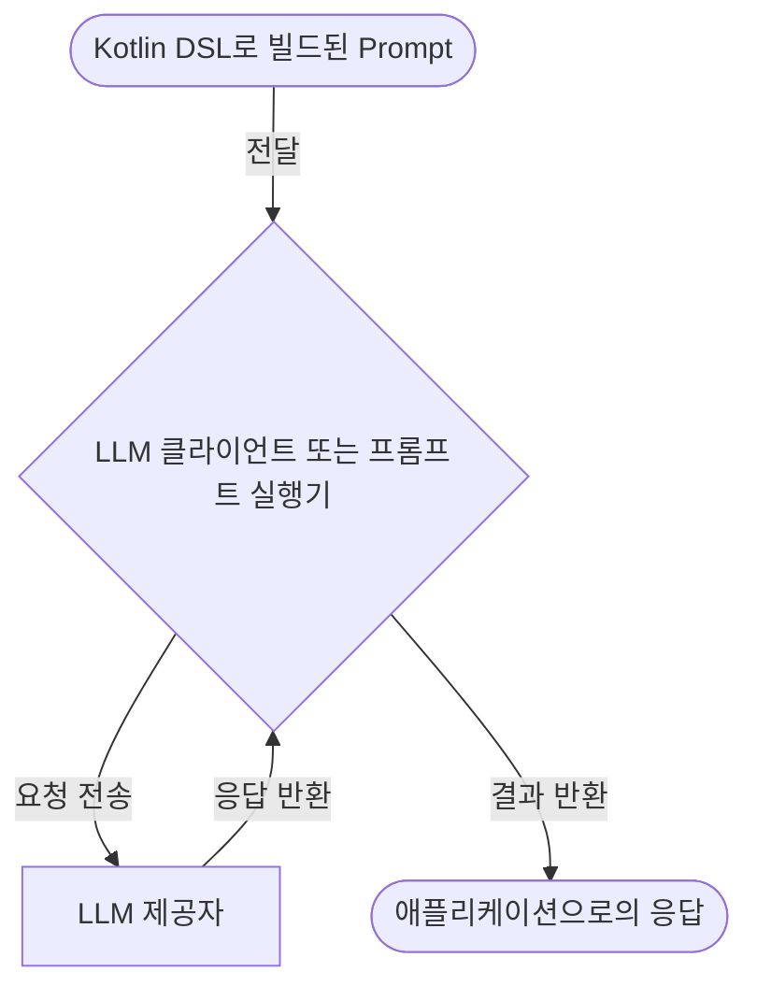
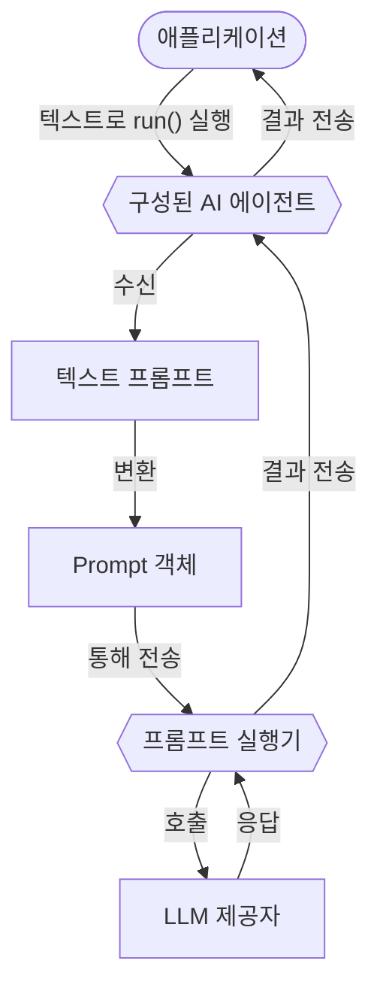

# 프롬프트

프롬프트는 대규모 언어 모델(LLM)이 응답을 생성하도록 안내하는 지침입니다.
이는 LLM과의 상호 작용 내용과 구조를 정의합니다.
이 섹션에서는 Koog를 사용하여 프롬프트를 생성하고 실행하는 방법을 설명합니다.

## 프롬프트 생성

Koog에서 프롬프트는 다음 속성을 가진 [**Prompt**](https://api.koog.ai/prompt/prompt-model/ai.koog.prompt.dsl/-prompt/index.html) 데이터 클래스의 인스턴스입니다:

- `id`: 프롬프트의 고유 식별자.
- `messages`: LLM과의 대화를 나타내는 메시지 목록.
- `params`: 선택적 [LLM 구성 매개변수](prompt-creation/index.md#prompt-parameters) (예: `temperature`, `tool choice` 등).

`Prompt` 클래스를 직접 인스턴스화할 수 있지만, 프롬프트를 생성하는 권장 방법은 [Kotlin DSL](prompt-creation/index.md)을 사용하는 것입니다. 이는 대화를 정의하는 구조화된 방법을 제공합니다.

<!--- INCLUDE
import ai.koog.prompt.dsl.prompt
-->
```kotlin
val myPrompt = prompt("hello-koog") {
    system("You are a helpful assistant.")
    user("What is Koog?")
}
```
<!--- KNIT example-prompts-01.kt -->

!!! note
    AI 에이전트는 간단한 텍스트 프롬프트를 입력으로 받을 수 있습니다.
    이들은 텍스트 프롬프트를 Prompt 객체로 자동 변환하여 실행을 위해 LLM으로 보냅니다.
    이는 단일 요청만 실행하면 되고 복잡한 대화 로직이 필요하지 않은 [기본 에이전트](../basic-agents.md)에 유용합니다.

## 프롬프트 실행

Koog는 LLM에 대해 프롬프트를 실행하기 위한 두 가지 추상화 수준, 즉 LLM 클라이언트와 프롬프트 실행기를 제공합니다. 둘 다 Prompt 객체를 허용하며, AI 에이전트 없이 직접 프롬프트 실행에 사용될 수 있습니다.
클라이언트와 실행기 모두에 대한 실행 흐름은 동일합니다:



<div class="grid cards" markdown>

-   :material-arrow-right-bold:{ .lg .middle } [**LLM 클라이언트**](llm-clients.md)

    ---

    특정 LLM 제공자와 직접 상호 작용하기 위한 저수준 인터페이스입니다.
    단일 제공자와 작업하고 고급 수명 주기 관리가 필요하지 않을 때 사용합니다.

-   :material-swap-horizontal:{ .lg .middle } [**프롬프트 실행기**](prompt-executors.md)

    ---

    하나 이상의 LLM 클라이언트의 수명 주기를 관리하는 고수준 추상화입니다.
    여러 제공자에서 프롬프트를 실행하기 위한 통합 API가 필요하고, 이들 간의 동적 전환 및 대체 기능이 필요할 때 사용합니다.

</div>

## 성능 최적화 및 실패 처리

Koog는 프롬프트 실행 시 성능을 최적화하고 실패를 처리할 수 있도록 합니다.

<div class="grid cards" markdown>

-   :material-cached:{ .lg .middle } [**LLM 응답 캐싱**](llm-response-caching.md)

    ---

    LLM 응답을 캐시하여 반복되는 요청에 대한 성능을 최적화하고 비용을 절감합니다.

-   :material-shield-check:{ .lg .middle } [**실패 처리**](handling-failures.md)

    ---

    애플리케이션에서 내장된 재시도, 타임아웃 및 기타 오류 처리 메커니즘을 사용합니다.

</div>

## AI 에이전트의 프롬프트

Koog에서 AI 에이전트는 수명 주기 동안 프롬프트를 유지하고 관리합니다. LLM 클라이언트나 실행기가 프롬프트를 실행하는 데 사용되지만, 에이전트는 프롬프트 업데이트 흐름을 처리하여 대화 기록이 관련성 있고 일관성을 유지하도록 보장합니다.

에이전트의 프롬프트 수명 주기는 일반적으로 여러 단계를 포함합니다:

1. 초기 프롬프트 설정.
2. 자동 프롬프트 업데이트.
3. 컨텍스트 창 관리.
4. 수동 프롬프트 관리.

### 초기 프롬프트 설정

에이전트를 [초기화할](../getting-started/#create-and-run-an-agent) 때, 에이전트의 동작을 설정하는 [시스템 메시지](prompt-creation/index.md#system-message)를 정의합니다. 그런 다음, 에이전트의 `run()` 메서드를 호출할 때, 일반적으로 초기 [사용자 메시지](prompt-creation/index.md#user-messages)를 입력으로 제공합니다. 이 메시지들은 함께 에이전트의 초기 프롬프트를 형성합니다. 예를 들어:

<!--- INCLUDE
import ai.koog.agents.core.agent.AIAgent
import ai.koog.prompt.executor.clients.openai.OpenAIModels
import ai.koog.prompt.executor.llms.all.simpleOpenAIExecutor
import kotlinx.coroutines.runBlocking

val apiKey = System.getenv("OPENAI_API_KEY")

fun main() = runBlocking {
-->
<!--- SUFFIX
}
-->
```kotlin
// 에이전트 생성
val agent = AIAgent(
    promptExecutor = simpleOpenAIExecutor(apiKey),
    systemPrompt = "You are a helpful assistant.",
    llmModel = OpenAIModels.Chat.GPT4o
)

// 에이전트 실행
val result = agent.run("What is Koog?")
```
<!--- KNIT example-prompts-02.kt -->

이 예시에서 에이전트는 텍스트 프롬프트를 Prompt 객체로 자동 변환하여 프롬프트 실행기로 보냅니다.



더 [고급 구성](../complex-workflow-agents.md#4-configure-the-agent)의 경우, [AIAgentConfig](https://api.koog.ai/agents/agents-core/ai.koog.agents.core.agent.config/-a-i-agent-config/index.html)를 사용하여 에이전트의 초기 프롬프트를 정의할 수도 있습니다.

### 자동 프롬프트 업데이트

에이전트가 전략을 실행할 때, [미리 정의된 노드들](../nodes-and-components.md)이 프롬프트를 자동으로 업데이트합니다. 예를 들어:

- [`nodeLLMRequest`](../nodes-and-components/#nodellmrequest): 프롬프트에 사용자 메시지를 추가하고 LLM 응답을 캡처합니다.
- [`nodeLLMSendToolResult`](../nodes-and-components/#nodellmsendtoolresult): 대화에 도구 실행 결과를 추가합니다.
- [`nodeAppendPrompt`](../nodes-and-components/#nodeappendprompt): 워크플로의 어느 지점에서든 프롬프트에 특정 메시지를 삽입합니다.

### 컨텍스트 창 관리

장기 실행 상호 작용에서 LLM 컨텍스트 창을 초과하는 것을 방지하기 위해, 에이전트는 [기록 압축](../history-compression.md) 기능을 사용할 수 있습니다.

### 수동 프롬프트 관리

복잡한 워크플로의 경우, [LLM 세션](../sessions.md)을 사용하여 프롬프트를 수동으로 관리할 수 있습니다. 에이전트 전략이나 사용자 정의 노드에서 `llm.writeSession`을 사용하여 `Prompt` 객체에 접근하고 변경할 수 있습니다. 이를 통해 필요에 따라 메시지를 추가, 제거 또는 재정렬할 수 있습니다.