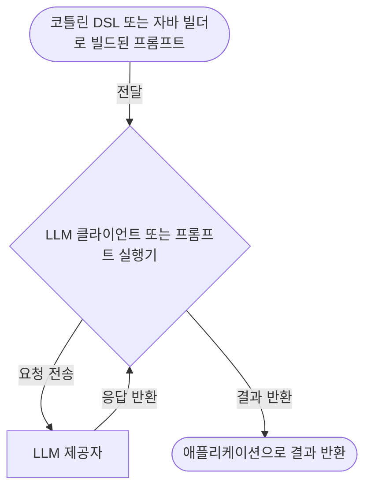
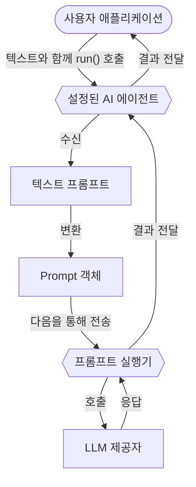

# 프롬프트

프롬프트(Prompts)는 거대 언어 모델(LLM)이 응답을 생성하도록 안내하는 지침입니다.
프롬프트는 LLM과의 상호작용에 대한 내용과 구조를 정의합니다.
이 섹션에서는 Koog를 사용하여 프롬프트를 생성하고 실행하는 방법을 설명합니다.

## 프롬프트 생성하기

Koog에서 프롬프트는 다음과 같은 프로퍼티를 가진 [**Prompt**](api:prompt-model::ai.koog.prompt.dsl.Prompt) 데이터 클래스의 인스턴스입니다:

- `id`: 프롬프트의 고유 식별자입니다.
- `messages`: LLM과의 대화를 나타내는 메시지 목록입니다.
- `params`: 선택 사항인 [LLM 구성 파라미터](prompt-creation/index.md#prompt-parameters) (temperature, 도구 선택 등)입니다.

`Prompt` 클래스를 직접 인스턴스화할 수도 있지만, 대화를 정의하는 구조화된 방법을 제공하는 [코틀린 DSL](prompt-creation/index.md) 또는 자바 빌더 API를 사용하여 프롬프트를 생성하는 것이 권장되는 방식입니다.

!!! note
    이 페이지의 코틀린 예제는 코틀린 DSL을 사용합니다. 자바 예제는 상황에 따라 `system(...)`, `user(...)`, `assistant(...)`, `toolCall(...)`, `toolResult(...)`와 같은 명시적인 메서드 및 `withOutput(Foo.class)`를 사용하는 `Prompt.builder("id")` 빌더를 사용합니다.

=== "Kotlin"

    <!--- INCLUDE
    import ai.koog.prompt.dsl.prompt
    -->
    ```kotlin
    val myPrompt = prompt("hello-koog") {
        system("You are a helpful assistant.")
        user("What is Koog?")
    }
    ```
    <!--- KNIT example-prompts-01.kt -->

=== "Java"

    <!--- INCLUDE
    /**
    -->
    <!--- SUFFIX
    **/
    -->
    ```java
    var myPrompt = Prompt.builder("hello-koog")
        .system("You are a helpful assistant.")
        .user("What is Koog?")
        .build();
    ```
    <!--- KNIT example-prompts-java-01.java -->

!!! note
    AI 에이전트는 단순한 텍스트 프롬프트를 입력으로 받을 수 있습니다.
    에이전트는 텍스트 프롬프트를 `Prompt` 객체로 자동 변환하여 실행을 위해 LLM으로 보냅니다.
    이는 단일 요청만 실행하면 되고 복잡한 대화 로직이 필요하지 않은 [기본 에이전트](../agents/basic-agents.md)에 유용합니다.

## 프롬프트 실행하기

Koog는 LLM을 대상으로 프롬프트를 실행하기 위해 LLM 클라이언트와 프롬프트 실행기(Prompt executor)라는 두 가지 수준의 추상화를 제공합니다.
두 방식 모두 `Prompt` 객체를 전달받으며, AI 에이전트 없이 직접 프롬프트를 실행하는 데 사용할 수 있습니다. 실행 흐름은 클라이언트와 실행기 모두 동일합니다.


```mermaid
flowchart TB
    A([코틀린 DSL 또는 자바 빌더로 빌드된 프롬프트])
    B{LLM 클라이언트 또는 프롬프트 실행기}
    C[LLM 제공자]
    D([애플리케이션으로 결과 반환])

    A -->|"전달"| B
    B -->|"요청 전송"| C
    C -->|"응답 반환"| B
    B -->|"결과 반환"| D
```
<!--- KNIT example-prompts-01.txt -->

<div class="grid cards" markdown>

-   :material-arrow-right-bold:{ .lg .middle } [**LLM 클라이언트**](llm-clients.md)

    ---

    특정 LLM 제공자와 직접 상호작용하기 위한 저수준 인터페이스입니다.
    단일 제공자를 사용하며 고급 수명 주기 관리가 필요하지 않을 때 사용합니다.

-   :material-swap-horizontal:{ .lg .middle } [**프롬프트 실행기**](prompt-executors.md)

    ---

    하나 또는 여러 LLM 클라이언트의 수명 주기를 관리하는 고수준 추상화입니다.
    여러 제공자 간의 동적 전환 및 폴백(fallback) 기능과 함께, 통합된 API가 필요할 때 사용합니다.

</div>

## 성능 최적화 및 오류 처리

Koog를 사용하면 프롬프트를 실행할 때 성능을 최적화하고 오류를 처리할 수 있습니다.

<div class="grid cards" markdown>

-   :material-cached:{ .lg .middle } [**LLM 응답 캐싱**](llm-response-caching.md)

    ---

    LLM 응답을 캐시하여 반복되는 요청에 대한 성능을 최적화하고 비용을 절감합니다.

-   :material-shield-check:{ .lg .middle } [**오류 처리**](handling-failures.md)

    ---

    애플리케이션에서 내장된 재시도(retry), 타임아웃 및 기타 에러 처리 메커니즘을 사용합니다.

</div>

## AI 에이전트에서의 프롬프트

Koog에서 AI 에이전트는 수명 주기 동안 프롬프트를 유지하고 관리합니다.
LLM 클라이언트나 실행기가 프롬프트를 실행하는 데 사용되는 반면, 에이전트는 프롬프트 업데이트 흐름을 처리하여 대화 기록이 관련성 있고 일관되게 유지되도록 보장합니다.

에이전트의 프롬프트 수명 주기는 보통 다음과 같은 몇 가지 단계를 포함합니다:

1. 초기 프롬프트 설정.
2. 자동 프롬프트 업데이트.
3. 컨텍스트 윈도우 관리.
4. 수동 프롬프트 관리.

### 초기 프롬프트 설정

[에이전트를 초기화](../quickstart.md#create-your-first-koog-agent)할 때, 에이전트의 행동을 설정하는 [시스템 메시지](prompt-creation/index.md#system-message)를 정의할 수 있습니다.
그 다음 에이전트의 `run()` 메서드를 호출할 때, 일반적으로 초기 [사용자 메시지](prompt-creation/index.md#user-messages)를 입력으로 제공합니다. 이 메시지들이 합쳐져 에이전트의 초기 프롬프트를 구성합니다. 예시는 다음과 같습니다:

=== "Kotlin"

    <!--- INCLUDE
    import ai.koog.agents.core.agent.AIAgent
    import ai.koog.prompt.executor.clients.openai.OpenAIModels
    import ai.koog.prompt.executor.llms.all.simpleOpenAIExecutor
    import kotlinx.coroutines.runBlocking
    val apiKey = System.getenv("OPENAI_API_KEY")
    fun main() = runBlocking {
    -->
    <!--- SUFFIX
    }
    -->
    ```kotlin
    // 에이전트 생성
    val agent = AIAgent(
        promptExecutor = simpleOpenAIExecutor(apiKey),
        systemPrompt = "You are a helpful assistant.",
        llmModel = OpenAIModels.Chat.GPT4o
    )
    
    // 에이전트 실행
    val result = agent.run("What is Koog?")
    ```
    <!--- KNIT example-prompts-02.kt -->

=== "Java"

    <!--- INCLUDE
    /**
    -->
    <!--- SUFFIX
    **/
    -->
    ```java
    AIAgent<String, String> agent = AIAgent.builder()
        .promptExecutor(simpleOpenAIExecutor(System.getenv("OPENAI_API_KEY")))
        .systemPrompt("You are a helpful assistant. Answer user questions concisely.")
        .llmModel(OpenAIModels.Chat.GPT4o)
        .build();

    var result = agent.run("What is Koog?");
    ```
    <!--- KNIT example-prompts-java-02.java -->

이 예제에서 에이전트는 텍스트 프롬프트를 `Prompt` 객체로 자동 변환하여 프롬프트 실행기로 보냅니다:


```mermaid
flowchart TB
    A([사용자 애플리케이션])
    B{{설정된 AI 에이전트}}
    C["텍스트 프롬프트"]
    D["Prompt 객체"]
    E{{프롬프트 실행기}}
    F[LLM 제공자]

    A -->|"텍스트와 함께 run() 호출"| B
    B -->|"수신"| C
    C -->|"변환"| D
    D -->|"다음을 통해 전송"| E
    E -->|"호출"| F
    F -->|"응답"| E
    E -->|"결과 전달"| B
    B -->|"결과 전달"| A
```
<!--- KNIT example-prompts-02.txt -->

더 [고급 구성](api:agents-core::ai.koog.agents.core.agent.config.AIAgentConfig)의 경우, [AIAgentConfig](api:agents-core::ai.koog.agents.core.agent.config.AIAgentConfig)를 사용하여 에이전트의 초기 프롬프트를 정의할 수도 있습니다.

### 자동 프롬프트 업데이트

에이전트가 전략을 실행함에 따라, [사전 정의된 노드](../nodes-and-components.md)들이 프롬프트를 자동으로 업데이트합니다.
예를 들어:

- [`nodeLLMRequest`](../nodes-and-components.md#nodellmrequest): 프롬프트에 사용자 메시지를 추가하고 LLM 응답을 캡처합니다.
- [`nodeLLMSendToolResult`](../nodes-and-components.md#nodellmsendtoolresult): 도구 실행 결과를 대화에 추가합니다.
- [`nodeAppendPrompt`](../nodes-and-components.md#nodeappendprompt): 워크플로의 어느 지점에서든 특정 메시지를 프롬프트에 삽입합니다.

### 컨텍스트 윈도우 관리

장시간 실행되는 상호작용에서 LLM 컨텍스트 윈도우를 초과하지 않도록, 에이전트는 [히스토리 압축(history compression)](../history-compression.md) 기능을 사용할 수 있습니다.

### 수동 프롬프트 관리

복잡한 워크플로의 경우 [LLM 세션](../sessions.md)을 사용하여 프롬프트를 수동으로 관리할 수 있습니다.
에이전트 전략이나 커스텀 노드 내에서 `llm.writeSession`을 사용하면 `Prompt` 객체에 접근하고 변경할 수 있습니다. 이를 통해 필요에 따라 메시지를 추가, 제거 또는 재정렬할 수 있습니다.