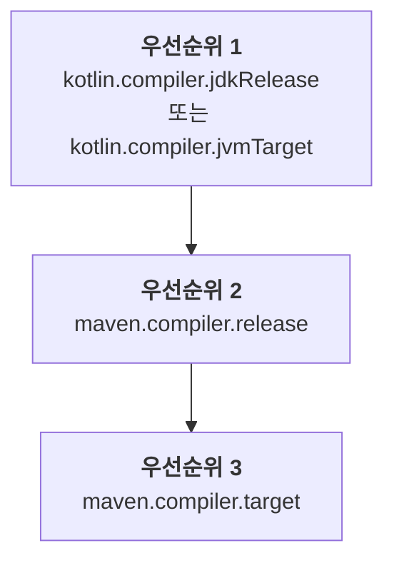

[//]: # (title: Maven 프로젝트 구성하기)

기존 Java Maven 프로젝트에 Kotlin을 도입하거나 새로운 Kotlin Maven 프로젝트를 생성할 때, Kotlin 소스와 모듈을 컴파일하는 Kotlin Maven 플러그인을 추가해야 합니다.

현재 Maven v3만 지원됩니다.

## 자동 설정

`<extensions>` 옵션을 사용하면 Java-Kotlin 혼합 프로젝트와 순수 Kotlin 프로젝트 모두에서 Maven 구성을 간소화할 수 있습니다. 이 방식을 사용하면 Maven 컴파일러 플러그인을 별도로 구성할 필요가 없으므로 시간을 절약할 수 있습니다.

`<extensions>`를 사용하여 Kotlin Maven 플러그인을 적용하려면 `pom.xml` 빌드 파일을 다음과 같이 업데이트하세요.

1. `<properties>` 섹션에서 사용할 Kotlin 및 JVM 버전을 정의합니다.

   ```xml
   <properties>
       <maven.compiler.release>17</maven.compiler.release>
       <kotlin.version>%kotlinVersion%</kotlin.version>
   </properties>
   ```

2. `<build><plugins>` 섹션에 `<extensions>` 옵션이 활성화된 Kotlin Maven 플러그인을 추가합니다.

   ```xml
   <build>
       <plugins>
           <!-- Kotlin 컴파일러 플러그인 구성 -->
           <plugin>
               <groupId>org.jetbrains.kotlin</groupId>
               <artifactId>kotlin-maven-plugin</artifactId>
               <version>${kotlin.version}</version>
               <extensions>true</extensions> <!-- 확장 활성화 -->
           </plugin>
           <!-- 확장을 사용하면 Maven 컴파일러 플러그인을 구성할 필요가 없습니다 -->
       </plugins>
   </build>
   ```

`<extensions>` 옵션은 다음 작업을 수행합니다.

* `src/main/kotlin` 및 `src/test/kotlin` 디렉터리가 이미 존재하지만 플러그인 구성에 지정되지 않은 경우, 이를 소스 루트(source roots)로 등록합니다.
* 프로젝트에 [`kotlin-stdlib` 의존성](maven-set-dependencies.md#dependency-on-the-standard-library)이 정의되어 있지 않은 경우 이를 추가합니다.
* `compile`, `test-compile`, `kapt`, `test-kapt` 실행(executions)을 빌드에 추가하고, 적절한 [생명 주기 단계(lifecycle phases)](https://maven.apache.org/guides/introduction/introduction-to-the-lifecycle.html)에 바인딩합니다. 따라서 올바른 순서로 실행되도록 `kapt`, Kotlin의 `compile`, Java의 `compile` 실행에 대해 `<id>`와 `<goals>`가 포함된 `<executions>` 섹션을 수동으로 설정할 필요가 없습니다.
* [프로젝트에 구성된 Java 컴파일러 버전과 JVM 대상 버전을 자동으로 맞춥니다.](#jvm-target-version)
   
Java와 Kotlin 혼합 프로젝트의 경우, 이 구성은 다음을 보장합니다.

* Kotlin 코드가 먼저 컴파일됩니다.
* Java 코드는 Kotlin 이후에 컴파일되며 Kotlin 클래스를 참조할 수 있습니다.
* Maven의 기본 동작이 플러그인 순서를 덮어쓰지 않습니다.

확장 구성은 전체 `<executions>` 섹션을 대체합니다. 실행을 직접 구성해야 하는 경우, [Kotlin 및 Java 소스 컴파일](#compile-kotlin-and-java-sources)의 예시를 참고하세요.

> 여러 빌드 플러그인이 기본 생명 주기를 덮어쓰고 있고 `<extensions>` 옵션도 활성화한 경우, `<build>` 섹션의 마지막 플러그인이 생명 주기 설정에 대해 우선순위를 가집니다. 생명 주기 설정에 대한 이전의 모든 변경 사항은 무시됩니다.
>
{style="note"}

### JVM 대상 버전

`<extensions>` 옵션은 Kotlin과 Maven 컴파일러가 동일한 바이트코드 버전을 대상으로 하도록 보장합니다.

Kotlin Maven 플러그인은 다음 순서에 따라 JVM 대상 버전을 자동으로 결정합니다.



#### Kotlin 컴파일러 버전

프로젝트에 `kotlin.compiler.jdkRelease` 또는 `kotlin.compiler.jvmTarget` 속성 중 하나가 정의되어 있으면 해당 버전이 우선순위를 가집니다.

이 Kotlin 컴파일러 옵션들은 서로 다르게 동작한다는 점에 유의하세요.

| Kotlin 컴파일러 옵션 | 출력 바이트코드 버전 제어 | API를 특정 JDK로 제한 |
|------------------------------|-----------------------------------------|-----------------------------------------------------------------------------------------------|
| `kotlin.compiler.jvmTarget`  | 예 | 코드에서 JDK API 사용에 제한 없음 |
| `kotlin.compiler.jdkRelease` | 예 | 예 − 특정 API 버전만 허용됨 (Java의 `--release` 컴파일러 옵션과 동일) |

> `kotlin.compiler.jdkRelease`와 `kotlin.compiler.jvmTarget`에 서로 다른 JDK 옵션을 동시에 설정하지 마세요. 그렇지 않으면 오류가 발생합니다.
>
{style="note"}

#### Maven 컴파일러 버전

* `kotlin.compiler.jdkRelease`와 `kotlin.compiler.jvmTarget` 옵션이 모두 설정되지 않은 경우, 플러그인은 `maven.compiler.release` 버전을 사용합니다.

  `maven.compiler.release` 버전은 프로젝트 속성으로 정의하거나 `maven-compiler-plugin` 구성 내에서 정의할 수 있습니다.
* Maven release 버전이 설정되지 않은 경우, 플러그인은 `maven.compiler.target` 버전을 사용합니다.

  이 또한 프로젝트 속성으로 정의하거나 `maven-compiler-plugin` 구성 내에서 정의할 수 있습니다.

Maven 컴파일러의 `target`과 `release` 옵션은 서로 다르게 동작한다는 점에 유의하세요.

| Maven 컴파일러 옵션 | Kotlin의 `jvmTarget` 설정 | Kotlin의 `jdkRelease` 설정 | API를 특정 JDK로 제한 |
|--------------------------|---------------------------|----------------------------|----------------------------------------------|
| `maven.compiler.target`  | 예 | 아니요 | 아니요 − 빌드의 JDK 클래스패스가 계속 표시됨 |
| `maven.compiler.release` | 예 | 예 | 예 − 특정 API 버전으로만 제한됨 |

> `<extensions>` 옵션은 프로젝트 수준의 속성과 전역 `maven-compiler-plugin` 구성만 확인합니다. 플러그인의 `<executions>` 섹션에 정의된 구성은 확인하지 않습니다.
>
{style="note"}

### Maven 컴파일러 버전

현재 `<extensions>`와 함께 사용되는 Maven 컴파일러 플러그인의 기본 버전은 **%mavenExtensionsVersion%**입니다. 다음과 같이 다른 버전을 별도로 설정할 수 있습니다.

```xml
<build>
    <plugins>
        <!-- Kotlin 컴파일러 플러그인 구성 -->
        <plugin>
            <groupId>org.jetbrains.kotlin</groupId>
            <artifactId>kotlin-maven-plugin</artifactId>
            <version>${kotlin.version}</version>
            <extensions>true</extensions>
        </plugin>
        <!-- Java 클래스를 위한 Maven 컴파일러 플러그인 구성 -->
        <plugin>
            <groupId>org.apache.maven.plugins</groupId>
            <artifactId>maven-compiler-plugin</artifactId>
            <version>%mavenPluginVersion%</version>
        </plugin>
    </plugins>
</build>
```

## 수동 구성

Kotlin Maven 플러그인에서 `<extensions>`를 활성화하지 않는 경우, 소스 코드가 올바르게 컴파일되도록 프로젝트를 수동으로 구성해야 합니다.

[Java와 Kotlin 소스 혼합](#compile-kotlin-and-java-sources) 또는 [Kotlin 전용 소스](#compile-kotlin-only-sources)를 컴파일하도록 Maven 프로젝트를 설정할 수 있습니다.

### Kotlin 및 Java 소스 컴파일

Kotlin과 Java 소스 파일이 모두 포함된 프로젝트를 컴파일하려면 Kotlin 컴파일러가 Java 컴파일러보다 먼저 실행되도록 해야 합니다.

Java 컴파일러는 Kotlin 선언이 `.class` 파일로 컴파일되기 전까지는 이를 볼 수 없습니다. Java 코드에서 Kotlin 클래스를 사용하는 경우, `cannot find symbol` 오류를 방지하기 위해 해당 클래스들을 먼저 컴파일해야 합니다.

Maven은 다음 두 가지 주요 요소를 기반으로 플러그인 실행 순서를 결정합니다.

* `pom.xml` 파일 내 플러그인 선언 순서.
* `default-compile` 및 `default-testCompile`과 같은 기본 제공 실행. 이는 `pom.xml` 파일에서의 위치와 관계없이 항상 사용자 정의 실행보다 먼저 실행됩니다.

실행 순서를 제어하려면 다음을 수행하세요.

* `maven-compiler-plugin`보다 앞에 `kotlin-maven-plugin`을 선언합니다.
* Java 컴파일러 플러그인의 기본 실행을 비활성화합니다.
* 컴파일 단계를 명시적으로 제어하기 위해 사용자 정의 실행(executions)을 추가합니다.

> Maven에서 특수한 `none` 단계를 사용하여 기본 실행을 비활성화할 수 있습니다.
>
{style="note"}

Kotlin Maven 플러그인을 적용하려면 `pom.xml` 빌드 파일을 다음과 같이 업데이트하세요.

```xml
<build>
    <plugins>
        <!-- Kotlin 컴파일러 플러그인 구성 -->
        <plugin>
            <groupId>org.jetbrains.kotlin</groupId>
            <artifactId>kotlin-maven-plugin</artifactId>
            <version>${kotlin.version}</version>
            <executions>
                <execution>
                    <id>kotlin-compile</id>
                    <phase>compile</phase>
                    <goals>
                        <goal>compile</goal>
                    </goals>
                    <configuration>
                        <sourceDirs>
                            <sourceDir>src/main/kotlin</sourceDir>
                            <!-- Kotlin 코드가 Java 코드를 참조할 수 있도록 보장 -->
                            <sourceDir>src/main/java</sourceDir>
                        </sourceDirs>
                    </configuration>
                </execution>
                <execution>
                    <id>kotlin-test-compile</id>
                    <phase>test-compile</phase>
                    <goals>
                        <goal>test-compile</goal>
                    </goals>
                    <configuration>
                        <sourceDirs>
                            <sourceDir>src/test/kotlin</sourceDir>
                            <sourceDir>src/test/java</sourceDir>
                        </sourceDirs>
                    </configuration>
                </execution>
            </executions>
        </plugin>

        <!-- Maven 컴파일러 플러그인 구성 -->
        <plugin>
            <groupId>org.apache.maven.plugins</groupId>
            <artifactId>maven-compiler-plugin</artifactId>
            <version>3.15.0</version>
            <executions>
                <!-- 기본 실행 비활성화 -->
                <execution>
                    <id>default-compile</id>
                    <phase>none</phase>
                </execution>
                <execution>
                    <id>default-testCompile</id>
                    <phase>none</phase>
                </execution>

                <!-- 사용자 정의 실행 정의 -->
                <execution>
                    <id>java-compile</id>
                    <phase>compile</phase>
                    <goals>
                        <goal>compile</goal>
                    </goals>
                </execution>
                <execution>
                    <id>java-test-compile</id>
                    <phase>test-compile</phase>
                    <goals>
                        <goal>testCompile</goal>
                    </goals>
                </execution>
            </executions>
        </plugin>
    </plugins>
</build>
```

이 구성은 다음을 보장합니다.

* Kotlin 코드가 먼저 컴파일됩니다.
* Java 코드는 Kotlin 이후에 컴파일되며 Kotlin 클래스를 참조할 수 있습니다.
* Maven의 기본 동작이 플러그인 순서를 덮어쓰지 않습니다.

Maven이 플러그인 실행을 처리하는 방법에 대한 자세한 내용은 공식 Maven 문서의 [기본 플러그인 실행 ID 가이드(Guide to default plugin execution IDs)](https://maven.apache.org/guides/mini/guide-default-execution-ids.html)를 참고하세요.

### Kotlin 전용 소스 컴파일

Kotlin 소스 파일만 있는 프로젝트를 컴파일하려면 소스 루트를 선언하고 Kotlin Maven 플러그인을 구성하세요.

1. `<build>` 섹션에 소스 디렉터리를 지정합니다.

    ```xml
    <build>
        <sourceDirectory>src/main/kotlin</sourceDirectory>
        <testSourceDirectory>src/test/kotlin</testSourceDirectory>
    </build>
    ```

2. Kotlin Maven 플러그인이 적용되었는지 확인합니다.

    ```xml
    <build>
        <plugins>
            <plugin>
                <groupId>org.jetbrains.kotlin</groupId>
                <artifactId>kotlin-maven-plugin</artifactId>
                <version>${kotlin.version}</version>
                <executions>
                    <execution>
                        <id>compile</id>
                        <goals>
                            <goal>compile</goal>
                        </goals>
                    </execution>
                    <execution>
                        <id>test-compile</id>
                        <goals>
                            <goal>test-compile</goal>
                        </goals>
                    </execution>
                </executions>
            </plugin>
        </plugins>
    </build>
    ```

### JDK 버전 설정

Kotlin은 빌드에서 JDK 버전을 관리하는 데 도움이 되는 [Maven 툴체인(Maven Toolchains)](https://maven.apache.org/guides/mini/guide-using-toolchains.html)을 지원합니다.

빌드에 `maven-toolchains-plugin`을 구성하면, Maven을 실행하는 JVM 버전(`JAVA_HOME` 경로에 설정됨)과 관계없이 Kotlin 컴파일에 사용할 JDK 버전을 지정할 수 있습니다. 그러면 Kotlin Maven 플러그인이 선택된 JDK 툴체인을 자동으로 가져옵니다.

이를 통해 Kotlin 컴파일을 포함하여 빌드의 모든 플러그인에서 사용되는 JDK를 제어하는 단일 툴체인을 구성할 수 있습니다. 예를 들어:

```xml
<plugin>
    <groupId>org.apache.maven.plugins</groupId>
    <artifactId>maven-toolchains-plugin</artifactId>
    <version>3.2.0</version>
    <executions>
        <execution>
            <goals>
                <goal>toolchain</goal>
            </goals>
        </execution>
    </executions>
    <configuration>
        <toolchains>
            <jdk>
                <version>21</version>
            </jdk>
        </toolchains>
    </configuration>
</plugin>
```

JDK 버전을 설정하는 다양한 방법의 우선순위를 유의하세요.

```Mermaid
graph TD
    A["<b>우선순위 1</b><br/>kotlin-maven-plugin의<br/>jdkHome 옵션"]
    B["<b>우선순위 2</b><br/>maven-toolchains-plugin에<br/>설정된 JDK 버전"]
    C["<b>우선순위 3</b><br/>JAVA_HOME 버전"]

    A --> B
    B --> C
```

* `kotlin-maven-plugin` 구성의 `jdkHome` 옵션에 설정된 JDK 버전은 항상 툴체인 버전보다 우선합니다.
* `maven-toolchains-plugin`의 JDK 버전은 `JAVA_HOME` 경로에 설정된 JDK 버전을 덮어씁니다.

플러그인 전용 `<jdkToolchain>` 옵션을 사용하여 `kotlin-maven-plugin`의 툴체인에서 JDK 버전을 직접 설정할 수도 있습니다. `maven-toolchains-plugin`을 사용하는 것과 비교하여, 이 매개변수는 Kotlin 컴파일에만 영향을 미치며 빌드의 다른 플러그인에는 영향을 주지 않습니다.

> 현재 특정 JDK 버전을 사용하도록 `maven-toolchains-plugin`을 설정하는 것은 `kotlin-maven-plugin`의 [`kapt` 및 `test-kapt` 골(goals)에 영향을 미치지 않습니다](https://youtrack.jetbrains.com/issue/KT-79897). 대신 `JAVA_HOME` 경로에 필요한 버전을 설정하세요.
>
{style="note"}

#### JDK 17 사용

JDK 17을 사용하려면 `.mvn/jvm.config` 파일에 다음을 추가하세요.

```none
--add-opens=java.base/java.lang=ALL-UNNAMED
--add-opens=java.base/java.io=ALL-UNNAMED
```

## 다음 단계는?

[Kotlin Maven 프로젝트의 의존성 설정](maven-set-dependencies.md)