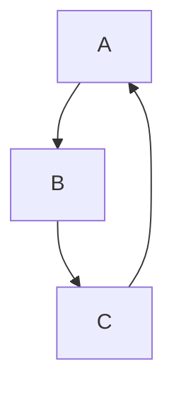
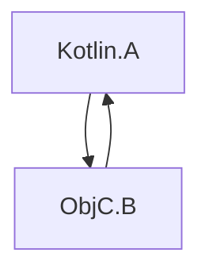

[//]: # (title: Swift/Objective-C ARC와의 통합)

Kotlin과 Objective-C는 서로 다른 메모리 관리 전략을 사용합니다. Kotlin은 트레이싱 가비지 컬렉터(tracing garbage collector)를 사용하는 반면, Objective-C는 자동 참조 카운팅(ARC, automatic reference counting)에 의존합니다.

이러한 전략 간의 통합은 일반적으로 매끄러우며 추가 작업이 필요하지 않습니다. 하지만 다음 몇 가지 사항을 염두에 두어야 합니다:

## 스레드

### 초기화 해제자

Swift/Objective-C 객체 및 이들이 참조하는 객체의 초기화 해제는 이 객체들이 메인 스레드에서 Kotlin으로 전달되는 경우 메인 스레드에서 호출됩니다. 예를 들어:

```kotlin
// Kotlin
class KotlinExample {
    fun action(arg: Any) {
        println(arg)
    }
}
```

```swift
// Swift
class SwiftExample {
    init() {
        print("init on \(Thread.current)")
    }

    deinit {
        print("deinit on \(Thread.current)")
    }
}

func test() {
    KotlinExample().action(arg: SwiftExample())
}
```

결과 출력:

```text
init on <_NSMainThread: 0x600003bc0000>{number = 1, name = main}
shared.SwiftExample
deinit on <_NSMainThread: 0x600003bc0000>{number = 1, name = main}
```

Swift/Objective-C 객체의 초기화 해제는 다음 경우에 메인 스레드 대신 특수 GC 스레드에서 호출됩니다:

*   Swift/Objective-C 객체가 메인 스레드 이외의 스레드에서 Kotlin으로 전달되는 경우.
*   메인 디스패치 큐가 처리되지 않는 경우.

특수 GC 스레드에서 초기화 해제를 명시적으로 호출하려면 `gradle.properties` 파일에 `kotlin.native.binary.objcDisposeOnMain=false`를 설정하세요. 이 옵션은 Swift/Objective-C 객체가 메인 스레드에서 Kotlin으로 전달되었더라도 특수 GC 스레드에서 초기화 해제를 가능하게 합니다.

특수 GC 스레드는 Objective-C 런타임을 준수하며, 이는 런 루프와 오토릴리즈 풀(autorelease pool)을 드레인(drain)한다는 의미입니다.

### 완료 핸들러

Swift에서 Kotlin 코루틴 함수를 호출할 때, 완료 핸들러(completion handler)는 메인 스레드 이외의 스레드에서 호출될 수 있습니다. 예를 들어:

```kotlin
// Kotlin
// coroutineScope, launch, and delay are from kotlinx.coroutines
suspend fun asyncFunctionExample() = coroutineScope {
    launch {
        delay(1000L)
        println("World!")
    }
    println("Hello")
}
```

```swift
// Swift
func test() {
    print("Running test on \(Thread.current)")
    PlatformKt.asyncFunctionExample(completionHandler: { _ in
        print("Running completion handler on \(Thread.current)")
    })
}
```

결과 출력:

```text
Running test on <_NSMainThread: 0x600001b100c0>{number = 1, name = main}
Hello
World!
Running completion handler on <NSThread: 0x600001b45bc0>{number = 7, name = (null)}
```

## 가비지 컬렉션 및 수명 주기

### 객체 회수

객체는 가비지 컬렉션(garbage collection) 중에만 회수됩니다. 이는 Kotlin/Native와의 상호 운용 경계(interop boundary)를 넘나드는 Swift/Objective-C 객체에도 적용됩니다. 예를 들어:

```kotlin
// Kotlin
class KotlinExample {
    fun action(arg: Any) {
        println(arg)
    }
}
```

```swift
// Swift
class SwiftExample {
    deinit {
        print("SwiftExample deinit")
    }
}

func test() {
    swiftTest()
    kotlinTest()
}

func swiftTest() {
    print(SwiftExample())
    print("swiftTestFinished")
}

func kotlinTest() {
    KotlinExample().action(arg: SwiftExample())
    print("kotlinTest finished")
}
```

결과 출력:

```text
shared.SwiftExample
SwiftExample deinit
swiftTestFinished
shared.SwiftExample
kotlinTest finished
SwiftExample deinit
```

### Objective-C 객체 수명 주기

Objective-C 객체가 필요 이상으로 오래 남아있을 수 있으며, 이는 때때로 성능 문제를 야기할 수 있습니다. 예를 들어, 장시간 실행되는 루프가 각 반복마다 Swift/Objective-C 상호 운용 경계를 넘나드는 임시 객체를 여러 개 생성하는 경우입니다.

[GC 로그](native-memory-manager.md#monitor-gc-performance)에는 루트 집합(root set)에 있는 안정 참조(stable refs)의 수가 표시됩니다. 이 숫자가 계속 증가한다면, Swift/Objective-C 객체가 필요한 시점에 해제되지 않고 있음을 나타낼 수 있습니다. 이 경우, 상호 운용 호출을 수행하는 루프 본문 주변에 `autoreleasepool` 블록을 사용해 보세요:

```kotlin
// Kotlin
fun growingMemoryUsage() {
    repeat(Int.MAX_VALUE) {
        NSLog("$it
")
    }
}

fun steadyMemoryUsage() {
    repeat(Int.MAX_VALUE) {
        autoreleasepool {
            NSLog("$it
")
        }
    }
}
```

### Swift 및 Kotlin 객체 체인의 가비지 컬렉션

다음 예시를 살펴보세요:

```kotlin
// Kotlin
interface Storage {
    fun store(arg: Any)
}

class KotlinStorage(var field: Any? = null) : Storage {
    override fun store(arg: Any) {
        field = arg
    }
}

class KotlinExample {
    fun action(firstSwiftStorage: Storage, secondSwiftStorage: Storage) {
        // Here, we create the following chain:
        // firstKotlinStorage -> firstSwiftStorage -> secondKotlinStorage -> secondSwiftStorage.
        val firstKotlinStorage = KotlinStorage()
        firstKotlinStorage.store(firstSwiftStorage)
        val secondKotlinStorage = KotlinStorage()
        firstSwiftStorage.store(secondKotlinStorage)
        secondKotlinStorage.store(secondSwiftStorage)
    }
}
```

```swift
// Swift
class SwiftStorage : Storage {

    let name: String

    var field: Any? = nil

    init(_ name: String) {
        self.name = name
    }

    func store(arg: Any) {
        field = arg
    }

    deinit {
        print("deinit SwiftStorage \(name)")
    }
}

func test() {
    KotlinExample().action(
        firstSwiftStorage: SwiftStorage("first"),
        secondSwiftStorage: SwiftStorage("second")
    )
}
```

"deinit SwiftStorage first" 메시지와 "deinit SwiftStorage second" 메시지가 로그에 나타나기까지 시간이 걸립니다. 그 이유는 `firstKotlinStorage`와 `secondKotlinStorage`가 서로 다른 GC 사이클에서 수집되기 때문입니다. 이벤트 시퀀스는 다음과 같습니다:

1.  `KotlinExample.action`이 완료됩니다. `firstKotlinStorage`는 아무것도 참조하지 않으므로 "죽은" 것으로 간주되지만, `secondKotlinStorage`는 `firstSwiftStorage`에 의해 참조되므로 그렇지 않습니다.
2.  첫 번째 GC 사이클이 시작되고 `firstKotlinStorage`가 수집됩니다.
3.  `firstSwiftStorage`에 대한 참조가 없으므로 이것 역시 "죽은" 상태가 되고, `deinit`이 호출됩니다.
4.  두 번째 GC 사이클이 시작됩니다. `firstSwiftStorage`가 더 이상 `secondKotlinStorage`를 참조하지 않으므로 `secondKotlinStorage`가 수집됩니다.
5.  `secondSwiftStorage`가 마침내 회수됩니다.

Swift 및 Objective-C 객체의 초기화 해제가 GC 사이클 이후에 발생하기 때문에 이 네 가지 객체를 수집하려면 두 번의 GC 사이클이 필요합니다. 이 제약은 `deinit`이 GC 일시 중지(GC pause) 중에 실행될 수 없는 Kotlin 코드를 포함하여 임의의 코드를 호출할 수 있다는 점에 기인합니다.

### 참조 순환

_참조 순환(retain cycle)_에서 여러 객체가 강한 참조를 사용하여 서로를 순환적으로 참조합니다:



Kotlin의 트레이싱 GC와 Objective-C의 ARC는 참조 순환을 다르게 처리합니다. 객체가 접근 불가능(unreachable)해지면 Kotlin의 GC는 이러한 순환을 적절하게 회수할 수 있지만, Objective-C의 ARC는 그렇지 못합니다. 따라서 Kotlin 객체의 참조 순환은 회수될 수 있지만, [Swift/Objective-C 객체의 참조 순환은 회수될 수 없습니다](https://docs.swift.org/swift-book/documentation/the-swift-programming-language/automaticreferencecounting/#Strong-Reference-Cycles-Between-Class-Instances).

참조 순환에 Objective-C 객체와 Kotlin 객체가 모두 포함된 경우를 고려해 보세요:



이는 Kotlin과 Objective-C의 메모리 관리 모델을 결합하는 것으로, 함께 참조 순환을 처리(회수)할 수 없습니다. 즉, Objective-C 객체가 하나라도 존재하면 전체 객체 그래프의 참조 순환이 회수될 수 없으며, Kotlin 측에서 순환을 끊는 것이 불가능합니다.

아쉽게도 현재 Kotlin/Native 코드에서 참조 순환을 자동으로 감지하는 특별한 도구는 없습니다. 참조 순환을 피하려면 [약한 참조(weak reference) 또는 비소유 참조(unowned reference)](https://docs.swift.org/swift-book/documentation/the-swift-programming-language/automaticreferencecounting/#Resolving-Strong-Reference-Cycles-Between-Class-Instances)를 사용하세요.

## 백그라운드 상태 및 앱 확장 지원

현재 메모리 관리자는 기본적으로 애플리케이션 상태를 추적하지 않으며, [앱 확장(App Extensions)](https://developer.apple.com/app-extensions/)과 즉시 통합되지 않습니다.

이는 메모리 관리자가 GC 동작을 그에 맞춰 조정하지 않음을 의미하며, 특정 경우에는 해로울 수 있습니다. 이 동작을 변경하려면 `gradle.properties` 파일에 다음 [실험적(Experimental)](components-stability.md) 바이너리 옵션을 추가하세요:

```none
kotlin.native.binary.appStateTracking=enabled
```

이 옵션은 애플리케이션이 백그라운드 상태일 때 타이머 기반 가비지 컬렉터 호출을 끄므로, GC는 메모리 사용량이 너무 높아질 때만 호출됩니다.

## 다음 단계

[Swift/Objective-C 상호 운용성](native-objc-interop.md)에 대해 자세히 알아보세요.