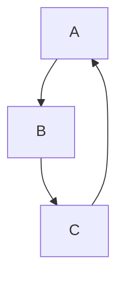
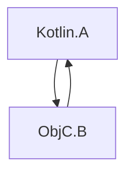

[//]: # (title: Swift/Objective-C ARC와의 통합)

Kotlin과 Objective-C는 서로 다른 메모리 관리 전략을 사용합니다. Kotlin은 트레이싱 가비지 컬렉터(tracing garbage collector)를 사용하는 반면, Objective-C는 자동 참조 카운팅(Automatic Reference Counting, ARC)에 의존합니다.

이러한 전략 간의 통합은 일반적으로 원활하며 추가 작업이 필요하지 않습니다. 하지만 몇 가지 유의해야 할 사항이 있습니다:

## 스레드

### 역초기화자

Swift/Objective-C 객체와 해당 객체가 참조하는 객체의 역초기화(Deinitialization)는, 만약 이 객체들이 메인 스레드에서 Kotlin으로 전달되었다면 메인 스레드에서 호출됩니다. 예를 들어:

```kotlin
// Kotlin
class KotlinExample {
    fun action(arg: Any) {
        println(arg)
    }
}
```

```swift
// Swift
class SwiftExample {
    init() {
        print("init on \(Thread.current)")
    }

    deinit {
        print("deinit on \(Thread.current)")
    }
}

func test() {
    KotlinExample().action(arg: SwiftExample())
}
```

결과 출력:

```text
init on <_NSMainThread: 0x600003bc0000>{number = 1, name = main}
shared.SwiftExample
deinit on <_NSMainThread: 0x600003bc0000>{number = 1, name = main}
```

Swift/Objective-C 객체의 역초기화는 다음의 경우 메인 스레드 대신 특별한 GC 스레드에서 호출됩니다:

*   Swift/Objective-C 객체가 메인 스레드 이외의 스레드에서 Kotlin으로 전달된 경우.
*   메인 디스패치 큐(main dispatch queue)가 처리되지 않는 경우.

특별한 GC 스레드에서 역초기화를 명시적으로 호출하려면 `gradle.properties` 파일에 `kotlin.native.binary.objcDisposeOnMain=false`를 설정하세요. 이 옵션은 Swift/Objective-C 객체가 메인 스레드에서 Kotlin으로 전달되었더라도 특별한 GC 스레드에서 역초기화를 활성화합니다.

특별한 GC 스레드는 Objective-C 런타임을 준수하며, 이는 런 루프(run loop)와 오토리리즈 풀(autorelease pools)을 비우는 기능을 가지고 있음을 의미합니다.

### 완료 핸들러

Swift에서 Kotlin의 중단 함수(suspending functions)를 호출할 때, 완료 핸들러(completion handlers)는 메인 스레드 이외의 스레드에서 호출될 수 있습니다. 예를 들어:

```kotlin
// Kotlin
// coroutineScope, launch, and delay are from kotlinx.coroutines
suspend fun asyncFunctionExample() = coroutineScope {
    launch {
        delay(1000L)
        println("World!")
    }
    println("Hello")
}
```

```swift
// Swift
func test() {
    print("Running test on \(Thread.current)")
    PlatformKt.asyncFunctionExample(completionHandler: { _ in
        print("Running completion handler on \(Thread.current)")
    })
}
```

결과 출력:

```text
Running test on <_NSMainThread: 0x600001b100c0>{number = 1, name = main}
Hello
World!
Running completion handler on <NSThread: 0x600001b45bc0>{number = 7, name = (null)}
```

## 가비지 컬렉션 및 수명 주기

### 객체 회수

객체는 가비지 컬렉션(garbage collection) 중에만 회수됩니다. 이는 Kotlin/Native로 상호 운용 경계(interop boundaries)를 넘나드는 Swift/Objective-C 객체에도 적용됩니다. 예를 들어:

```kotlin
// Kotlin
class KotlinExample {
    fun action(arg: Any) {
        println(arg)
    }
}
```

```swift
// Swift
class SwiftExample {
    deinit {
        print("SwiftExample deinit")
    }
}

func test() {
    swiftTest()
    kotlinTest()
}

func swiftTest() {
    print(SwiftExample())
    print("swiftTestFinished")
}

func kotlinTest() {
    KotlinExample().action(arg: SwiftExample())
    print("kotlinTest finished")
}
```

결과 출력:

```text
shared.SwiftExample
SwiftExample deinit
swiftTestFinished
shared.SwiftExample
kotlinTest finished
SwiftExample deinit
```

### Objective-C 객체 수명 주기

Objective-C 객체는 필요 이상으로 오래 존재할 수 있으며, 이는 때때로 성능 문제를 야기할 수 있습니다. 예를 들어, 장기 실행 루프가 각 반복마다 Swift/Objective-C 상호 운용 경계를 넘나드는 여러 임시 객체를 생성할 때 그렇습니다.

[GC 로그](native-memory-manager.md#monitor-gc-performance)에는 루트 세트(root set)에 있는 안정적인 참조(stable refs)의 수가 표시됩니다. 이 수가 계속 증가한다면, Swift/Objective-C 객체가 제때 해제되지 않고 있음을 나타낼 수 있습니다. 이 경우, 상호 운용 호출(interop calls)을 수행하는 루프 본문 주위에 `autoreleasepool` 블록을 사용해 보세요:

```kotlin
// Kotlin
fun growingMemoryUsage() {
    repeat(Int.MAX_VALUE) {
        NSLog("$it
")
    }
}

fun steadyMemoryUsage() {
    repeat(Int.MAX_VALUE) {
        autoreleasepool {
            NSLog("$it
")
        }
    }
}
```

### Swift 및 Kotlin 객체 체인의 가비지 컬렉션

다음 예시를 살펴보세요:

```kotlin
// Kotlin
interface Storage {
    fun store(arg: Any)
}

class KotlinStorage(var field: Any? = null) : Storage {
    override fun store(arg: Any) {
        field = arg
    }
}

class KotlinExample {
    fun action(firstSwiftStorage: Storage, secondSwiftStorage: Storage) {
        // Here, we create the following chain:
        // firstKotlinStorage -> firstSwiftStorage -> secondKotlinStorage -> secondSwiftStorage.
        val firstKotlinStorage = KotlinStorage()
        firstKotlinStorage.store(firstSwiftStorage)
        val secondKotlinStorage = KotlinStorage()
        firstSwiftStorage.store(secondKotlinStorage)
        secondKotlinStorage.store(secondSwiftStorage)
    }
}
```

```swift
// Swift
class SwiftStorage : Storage {

    let name: String

    var field: Any? = nil

    init(_ name: String) {
        self.name = name
    }

    func store(arg: Any) {
        field = arg
    }

    deinit {
        print("deinit SwiftStorage \(name)")
    }
}

func test() {
    KotlinExample().action(
        firstSwiftStorage: SwiftStorage("first"),
        secondSwiftStorage: SwiftStorage("second")
    )
}
```

로그에 "deinit SwiftStorage first"와 "deinit SwiftStorage second" 메시지가 나타나는 데 시간이 걸립니다. 그 이유는 `firstKotlinStorage`와 `secondKotlinStorage`가 다른 GC 사이클에서 수집되기 때문입니다. 일련의 사건은 다음과 같습니다:

1.  `KotlinExample.action`이 완료됩니다. `firstKotlinStorage`는 아무것도 참조하지 않으므로 "죽은(dead)" 것으로 간주되지만, `secondKotlinStorage`는 `firstSwiftStorage`에 의해 참조되므로 그렇지 않습니다.
2.  첫 번째 GC 사이클이 시작되고 `firstKotlinStorage`가 수집됩니다.
3.  `firstSwiftStorage`에 대한 참조가 없으므로 이 또한 "죽은" 상태가 되며, `deinit`이 호출됩니다.
4.  두 번째 GC 사이클이 시작됩니다. `firstSwiftStorage`가 더 이상 `secondKotlinStorage`를 참조하지 않으므로 `secondKotlinStorage`가 수집됩니다.
5.  `secondSwiftStorage`가 최종적으로 회수됩니다.

이 네 개의 객체를 수집하려면 두 번의 GC 사이클이 필요합니다. 이는 Swift 및 Objective-C 객체의 역초기화가 GC 사이클 후에 발생하기 때문입니다. 이러한 제약은 `deinit`이 임의의 코드를 호출할 수 있다는 점, 즉 GC 일시 중지(pause) 중에 실행될 수 없는 Kotlin 코드를 포함할 수 있다는 점에 기인합니다.

### 순환 참조

_순환 참조(retain cycle)_에서는 여러 객체가 강한 참조(strong references)를 사용하여 순환적으로 서로를 참조합니다:



Kotlin의 트레이싱 GC와 Objective-C의 ARC는 순환 참조를 다르게 처리합니다. 객체가 도달할 수 없게 되면 Kotlin의 GC는 이러한 순환을 제대로 회수할 수 있지만, Objective-C의 ARC는 그렇지 못합니다. 따라서 Kotlin 객체의 순환 참조는 회수될 수 있지만, [Swift/Objective-C 객체의 순환 참조는 회수될 수 없습니다](https://docs.swift.org/swift-book/documentation/the-swift-programming-language/automaticreferencecounting/#Strong-Reference-Cycles-Between-Class-Instances).

순환 참조가 Objective-C와 Kotlin 객체를 모두 포함하는 경우를 생각해 봅시다:



이는 Kotlin과 Objective-C의 메모리 관리 모델을 결합하는 것으로, 순환 참조를 함께 처리(회수)할 수 없습니다. 즉, Objective-C 객체가 하나라도 존재한다면 전체 객체 그래프의 순환 참조는 회수될 수 없으며, Kotlin 측에서 순환을 끊는 것은 불가능합니다.

불행히도, 현재 Kotlin/Native 코드에서 순환 참조를 자동으로 감지하는 특별한 도구는 없습니다. 순환 참조를 피하려면 [약한 참조(weak references) 또는 비소유 참조(unowned references)](https://docs.swift.org/swift-book/documentation/the-swift-programming-language/automaticreferencecounting/#Resolving-Strong-Reference-Cycles-Between-Class-Instances)를 사용하세요.

## 백그라운드 상태 및 앱 확장 프로그램 지원

현재 메모리 관리자는 기본적으로 애플리케이션 상태를 추적하지 않으며, [앱 확장 프로그램(App Extensions)](https://developer.apple.com/app-extensions/)과 별도의 설정 없이 통합되지 않습니다.

이는 메모리 관리자가 GC 동작을 그에 따라 조정하지 않으므로, 일부 경우에는 해로울 수 있음을 의미합니다. 이 동작을 변경하려면 `gradle.properties`에 다음 [실험적(Experimental)](components-stability.md) 바이너리 옵션을 추가하세요:

```none
kotlin.native.binary.appStateTracking=enabled
```

이 옵션은 애플리케이션이 백그라운드에 있을 때 타이머 기반의 가비지 컬렉터 호출을 비활성화하여, 메모리 소비량이 너무 높아질 때만 GC가 호출되도록 합니다.

## 다음 단계

[Swift/Objective-C 상호 운용성](native-objc-interop.md)에 대해 더 자세히 알아보세요.