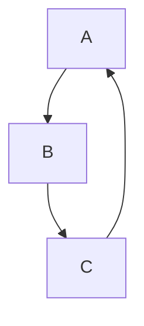
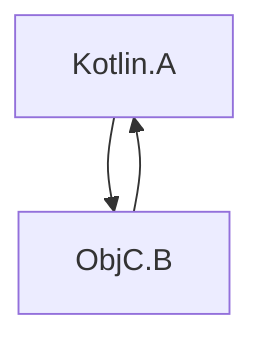

[//]: # (title: Swift/Objective-C ARC와의 통합)

Kotlin과 Objective-C는 서로 다른 메모리 관리 전략을 사용합니다. Kotlin은 트레이싱 가비지 컬렉터(tracing garbage collector)를 사용하는 반면, Objective-C는 자동 참조 카운팅(ARC, automatic reference counting)에 의존합니다.

이러한 전략 간의 통합은 보통 매끄럽게 이루어지며 일반적으로 추가적인 작업이 필요하지 않습니다. 하지만 유의해야 할 몇 가지 세부 사항이 있습니다.

## 스레드(Threads)

### 디이니셜라이저(Deinitializers)

Swift/Objective-C 객체가 메인 스레드에서 Kotlin으로 전달된 경우, 해당 객체와 이 객체가 참조하는 객체들에 대한 디이니셜라이제이션(Deinitialization)은 메인 스레드에서 호출됩니다. 예를 들면 다음과 같습니다.

```kotlin
// Kotlin
class KotlinExample {
    fun action(arg: Any) {
        println(arg)
    }
}
```

```swift
// Swift
class SwiftExample {
    init() {
        print("init on \(Thread.current)")
    }

    deinit {
        print("deinit on \(Thread.current)")
    }
}

func test() {
    KotlinExample().action(arg: SwiftExample())
}
```

실행 결과:

```text
init on <_NSMainThread: 0x600003bc0000>{number = 1, name = main}
shared.SwiftExample
deinit on <_NSMainThread: 0x600003bc0000>{number = 1, name = main}
```

다음과 같은 경우에는 Swift/Objective-C 객체의 디이니셜라이제이션이 메인 스레드 대신 특별한 GC 스레드에서 호출됩니다.

* Swift/Objective-C 객체가 메인 스레드가 아닌 다른 스레드에서 Kotlin으로 전달된 경우.
* 메인 디스패치 큐(main dispatch queue)가 처리되지 않는 경우.

특별한 GC 스레드에서 디이니셜라이제이션을 명시적으로 호출하려면, `gradle.properties`에 `kotlin.native.binary.objcDisposeOnMain=false`를 설정하세요. 이 옵션을 사용하면 Swift/Objective-C 객체가 메인 스레드에서 Kotlin으로 전달되었더라도 특별한 GC 스레드에서 디이니셜라이제이션이 수행됩니다.

특별한 GC 스레드는 Objective-C 런타임을 준수하며, 이는 런 루프(run loop)를 가지고 있고 오토릴리즈 풀(autorelease pool)을 비운다는(drain) 것을 의미합니다.

### 완료 핸들러(Completion handlers)

Swift에서 Kotlin의 서스펜드 함수(suspending function)를 호출할 때, 완료 핸들러(completion handler)는 메인 스레드가 아닌 다른 스레드에서 호출될 수 있습니다. 예를 들면 다음과 같습니다.

```kotlin
// Kotlin
// coroutineScope, launch, delay는 kotlinx.coroutines에서 제공됨
suspend fun asyncFunctionExample() = coroutineScope {
    launch {
        delay(1000L)
        println("World!")
    }
    println("Hello")
}
```

```swift
// Swift
func test() {
    print("Running test on \(Thread.current)")
    PlatformKt.asyncFunctionExample(completionHandler: { _ in
        print("Running completion handler on \(Thread.current)")
    })
}
```

실행 결과:

```text
Running test on <_NSMainThread: 0x600001b100c0>{number = 1, name = main}
Hello
World!
Running completion handler on <NSThread: 0x600001b45bc0>{number = 7, name = (null)}
```

## 가비지 컬렉션 및 생명주기

### 객체 회수(Object reclamation)

객체는 가비지 컬렉션 중에만 회수됩니다. 이는 Kotlin/Native와의 상호운용성 경계(interop boundaries)를 넘나드는 Swift/Objective-C 객체에도 적용됩니다. 예를 들면 다음과 같습니다.

```kotlin
// Kotlin
class KotlinExample {
    fun action(arg: Any) {
        println(arg)
    }
}
```

```swift
// Swift
class SwiftExample {
    deinit {
        print("SwiftExample deinit")
    }
}

func test() {
    swiftTest()
    kotlinTest()
}

func swiftTest() {
    print(SwiftExample())
    print("swiftTestFinished")
}

func kotlinTest() {
    KotlinExample().action(arg: SwiftExample())
    print("kotlinTest finished")
}
```

실행 결과:

```text
shared.SwiftExample
SwiftExample deinit
swiftTestFinished
shared.SwiftExample
kotlinTest finished
SwiftExample deinit
```

### Objective-C 객체 생명주기

Objective-C 객체가 예상보다 오래 유지되어 때때로 성능 문제를 일으킬 수 있습니다. 예를 들어, 오래 실행되는 루프 내의 각 반복문에서 상호운용성 경계를 넘나드는 여러 임시 객체를 생성하는 경우입니다.

[GC 로그](native-memory-manager.md#monitor-gc-performance)에는 루트 세트(root set)의 스테이블 참조(stable refs) 수가 표시됩니다. 만약 이 숫자가 계속 증가한다면 Swift/Objective-C 객체가 적절한 시점에 해제되지 않고 있음을 나타낼 수 있습니다. 이 경우, 상호운용성 호출을 수행하는 루프 본문을 `autoreleasepool` 블록으로 감싸보세요.

```kotlin
// Kotlin
fun growingMemoryUsage() {
    repeat(Int.MAX_VALUE) {
        NSLog("$it
")
    }
}

fun steadyMemoryUsage() {
    repeat(Int.MAX_VALUE) {
        autoreleasepool {
            NSLog("$it
")
        }
    }
}
```

### Swift 및 Kotlin 객체 체인의 가비지 컬렉션

다음 예시를 살펴보겠습니다.

```kotlin
// Kotlin
interface Storage {
    fun store(arg: Any)
}

class KotlinStorage(var field: Any? = null) : Storage {
    override fun store(arg: Any) {
        field = arg
    }
}

class KotlinExample {
    fun action(firstSwiftStorage: Storage, secondSwiftStorage: Storage) {
        // 여기서 다음과 같은 체인을 생성합니다:
        // firstKotlinStorage -> firstSwiftStorage -> secondKotlinStorage -> secondSwiftStorage.
        val firstKotlinStorage = KotlinStorage()
        firstKotlinStorage.store(firstSwiftStorage)
        val secondKotlinStorage = KotlinStorage()
        firstSwiftStorage.store(secondKotlinStorage)
        secondKotlinStorage.store(secondSwiftStorage)
    }
}
```

```swift
// Swift
class SwiftStorage : Storage {

    let name: String

    var field: Any? = nil

    init(_ name: String) {
        self.name = name
    }

    func store(arg: Any) {
        field = arg
    }

    deinit {
        print("deinit SwiftStorage \(name)")
    }
}

func test() {
    KotlinExample().action(
        firstSwiftStorage: SwiftStorage("first"),
        secondSwiftStorage: SwiftStorage("second")
    )
}
```

로그에 "deinit SwiftStorage first"와 "deinit SwiftStorage second" 메시지가 나타나기까지 어느 정도 시간이 걸립니다. 그 이유는 `firstKotlinStorage`와 `secondKotlinStorage`가 서로 다른 GC 사이클에서 수집되기 때문입니다. 이벤트 순서는 다음과 같습니다.

1. `KotlinExample.action`이 종료됩니다. `firstKotlinStorage`는 아무것도 참조하지 않으므로 "비활성(dead)" 상태로 간주되지만, `secondKotlinStorage`는 `firstSwiftStorage`에 의해 참조되고 있으므로 그렇지 않습니다.
2. 첫 번째 GC 사이클이 시작되고 `firstKotlinStorage`가 수집됩니다.
3. 이제 `firstSwiftStorage`에 대한 참조가 없으므로 이 역시 "비활성" 상태가 되며 `deinit`이 호출됩니다.
4. 두 번째 GC 사이클이 시작됩니다. `firstSwiftStorage`가 더 이상 참조하지 않으므로 `secondKotlinStorage`가 수집됩니다.
5. 마침내 `secondSwiftStorage`가 회수됩니다.

Swift 및 Objective-C 객체의 디이니셜라이제이션은 GC 사이클 이후에 발생하므로, 이 네 객체를 수집하는 데 두 번의 GC 사이클이 필요합니다. 이러한 제약은 `deinit`에서 임의의 코드를 호출할 수 있고, 여기에는 GC 일시 중단(pause) 중에는 실행될 수 없는 Kotlin 코드가 포함될 수 있기 때문에 발생합니다.

### 순환 참조(Retain cycles)

_순환 참조(retain cycle)_에서는 여러 객체가 강한 참조를 사용하여 서로를 순환적으로 참조합니다.


```mermaid
graph TD
    A --> B
    B --> C
    C --> A
```

Kotlin의 트레이싱 GC와 Objective-C의 ARC는 순환 참조를 다르게 처리합니다. 객체에 도달할 수 없게 되면 Kotlin의 GC는 이러한 순환 참조를 적절히 회수할 수 있지만, Objective-C의 ARC는 그렇지 못합니다. 따라서 Kotlin 객체 간의 순환 참조는 회수될 수 있지만, [Swift/Objective-C 객체 간의 순환 참조는 회수될 수 없습니다](https://docs.swift.org/swift-book/documentation/the-swift-programming-language/automaticreferencecounting/#Strong-Reference-Cycles-Between-Class-Instances).

순환 참조에 Objective-C 객체와 Kotlin 객체가 모두 포함된 경우를 생각해 보겠습니다.


```mermaid
graph TD
    Kotlin.A --> ObjC.B
    ObjC.B --> Kotlin.A
```

이 상황은 순환 참조를 함께 처리(회수)할 수 없는 Kotlin과 Objective-C의 메모리 관리 모델이 결합된 형태입니다. 즉, 최소 하나 이상의 Objective-C 객체가 포함되어 있다면 전체 객체 그래프의 순환 참조를 회수할 수 없으며, Kotlin 쪽에서 이 순환 고리를 끊는 것도 불가능합니다.

안타깝게도 현재 Kotlin/Native 코드에서 순환 참조를 자동으로 감지하는 특별한 도구는 제공되지 않습니다. 순환 참조를 피하려면 [약한 참조(weak) 또는 미소유 참조(unowned)](https://docs.swift.org/swift-book/documentation/the-swift-programming-language/automaticreferencecounting/#Resolving-Strong-Reference-Cycles-Between-Class-Instances)를 사용하세요.

## 백그라운드 상태 및 앱 익스텐션 지원

현재의 메모리 매니저는 기본적으로 애플리케이션 상태를 추적하지 않으며, [앱 익스텐션(App Extensions)](https://developer.apple.com/app-extensions/)과 즉시 통합되지 않습니다.

즉, 메모리 매니저가 그에 따라 GC 동작을 조정하지 않으므로 일부 경우에는 해로울 수 있습니다. 이 동작을 변경하려면 `gradle.properties`에 다음과 같은 [실험적(Experimental)](components-stability.md) 바이너리 옵션을 추가하세요.

```none
kotlin.native.binary.appStateTracking=enabled
```

이 옵션을 활성화하면 애플리케이션이 백그라운드에 있을 때 타이머 기반의 가비지 컬렉터 호출을 끕니다. 따라서 메모리 소비가 너무 높아질 때만 GC가 호출됩니다.

## 다음 단계

[Swift/Objective-C 상호운용성](native-objc-interop.md)에 대해 더 자세히 알아보세요.