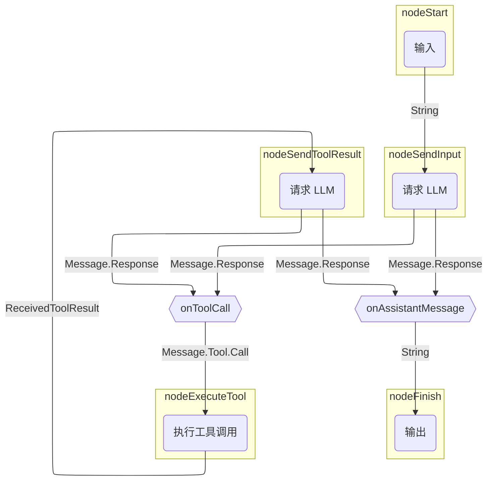
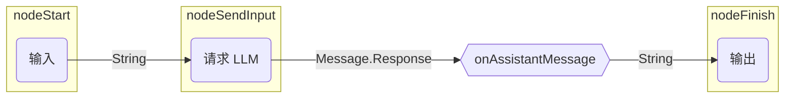

# 基于图的智能体

使用基于图的智能体，您可以将行为建模为显式状态机：图策略的节点表示操作（LLM 调用、工具执行），而边表示节点之间的数据流。

基于图的智能体的主要优点是：

- 易于可视化
- 状态持久化
- 可组合架构

??? note "前提条件"

    --8<-- "quickstart-snippets.md:prerequisites"

    --8<-- "quickstart-snippets.md:dependencies"

    --8<-- "quickstart-snippets.md:api-key"

    本页中的示例假设您正在通过 Ollama 在本地运行 Llama 3.2。

本页介绍了如何重新创建 [基础智能体](basic-agents.md) 所使用的策略图。它向 LLM 发送请求，然后要么输出响应（如果 LLM 以助手消息响应），要么执行工具（如果 LLM 请求工具调用）。在工具调用的情况下，智能体会将工具结果发送给 LLM，然后要么输出响应，要么执行工具。

以下是策略图的示意图：



## 构建策略图

在 Koog 中，您使用 [`AIAgentGraphStrategyBuilder`](https://api.koog.ai/agents/agents-core/ai.koog.agents.core.dsl.builder/-a-i-agent-graph-strategy-builder/index.html) 实现策略。就像每个节点都有输入和输出类型一样，策略作为一个整体也定义了某些输入和输出类型。本示例假设输入和输出类型都是字符串，这意味着实现此策略的智能体将接收一个字符串并返回一个字符串。

要创建策略，请使用 [`strategy()`](https://api.koog.ai/agents/agents-core/ai.koog.agents.core.dsl.builder/strategy.html) 函数，并使用两个泛型作为输入和输出类型，为策略提供唯一标识符，并定义节点和边。

<!--- INCLUDE
import ai.koog.agents.core.dsl.builder.forwardTo
import ai.koog.agents.core.dsl.builder.strategy
import ai.koog.agents.core.dsl.extension.*
-->
```kotlin
val calculatorAgentStrategy = strategy<String, String>("Simple calculator") {
    val nodeSendInput by nodeLLMRequest()
    val nodeExecuteTool by nodeExecuteTool()
    val nodeSendToolResult by nodeLLMSendToolResult()
    
    edge(nodeStart forwardTo nodeSendInput)
    edge(nodeSendInput forwardTo nodeFinish onAssistantMessage { true })
    edge(nodeSendInput forwardTo nodeExecuteTool onToolCall { true })
    edge(nodeExecuteTool forwardTo nodeSendToolResult)
    edge(nodeSendToolResult forwardTo nodeFinish onAssistantMessage { true })
    edge(nodeSendToolResult forwardTo nodeExecuteTool onToolCall { true })
}
```
<!--- KNIT example-graph-agents-01.kt -->

本示例仅使用了 [预定义节点](../nodes-and-components.md)，但您也可以创建 [自定义节点](../custom-nodes.md)。

每个策略图都必须有一条从 `nodeStart` 到 `nodeFinish` 且通过 [边](../custom-strategy-graphs.md#edges) 连接的路径。边可以包含条件，以确定何时遵循特定的边。边还可以在将上一个节点的输出传递给下一个节点之前对其进行转换。这对于连接输出和输入类型不匹配的节点是必需的。

在前面的示例中，`onToolCall { true }` 表示仅当上一个节点返回工具调用 `Message.Tool.Call` 时，才会遵循该边。

当使用 `onAssistantMessage { true }` 时，仅当上一个节点返回助手消息 `Message.Assistant` 时，才会遵循该边。此函数还会提取助手消息的内容，有效地将 `Message.Assistant` 转换为 `String`，因为 `nodeFinish` 需要一个字符串。

!!! tip

    除了使用 `onAssistantMessage {true}`，您还可以执行以下操作：

    ```kotlin
    onIsInstance(Message.Assistant::class) transformed { it.content }
    ```

    或者：

    ```kotlin
    onCondition { it is Message.Assistant } transformed { it.asAssistantMessage().content }
    ```

## 创建并运行智能体

让我们使用此策略创建一个智能体实例并运行它：

<!--- CLEAR -->
<!--- INCLUDE
import ai.koog.agents.core.agent.AIAgent
import ai.koog.agents.core.dsl.builder.forwardTo
import ai.koog.agents.core.dsl.builder.strategy
import ai.koog.agents.core.dsl.extension.*
import ai.koog.agents.core.dsl.extension.nodeExecuteTool
import ai.koog.agents.core.dsl.extension.nodeLLMRequest
import ai.koog.agents.core.dsl.extension.nodeLLMSendToolResult
import ai.koog.prompt.executor.llms.all.simpleOllamaAIExecutor
import ai.koog.prompt.executor.ollama.client.OllamaModels
import kotlinx.coroutines.runBlocking
-->
```kotlin
val calculatorAgentStrategy = strategy<String, String>("Simple calculator") {
    val nodeSendInput by nodeLLMRequest()
    val nodeExecuteTool by nodeExecuteTool()
    val nodeSendToolResult by nodeLLMSendToolResult()

    edge(nodeStart forwardTo nodeSendInput)
    edge(nodeSendInput forwardTo nodeFinish onAssistantMessage { true })
    edge(nodeSendInput forwardTo nodeExecuteTool onToolCall { true })
    edge(nodeExecuteTool forwardTo nodeSendToolResult)
    edge(nodeSendToolResult forwardTo nodeFinish onAssistantMessage { true })
    edge(nodeSendToolResult forwardTo nodeExecuteTool onToolCall { true })
}

val mathAgent = AIAgent(
    promptExecutor = simpleOllamaAIExecutor(),
    llmModel = OllamaModels.Meta.LLAMA_3_2,
    strategy = calculatorAgentStrategy
)

fun main() = runBlocking {
    val result = mathAgent.run("Multiply 3 by 4, then multiply the result by 5, then add 10, then add 123.")
    println(result)
}
```
<!--- KNIT example-graph-agents-02.kt -->

当您运行此智能体时，它将返回类似以下内容的响应：

```text
To calculate this, I'll follow the order of operations:

1. Multiply 3 by 4: 3 * 4 = 12
2. Multiply the result by 5: 12 * 5 = 60
3. Add 10: 60 + 10 = 70
4. Add 123: 70 + 123 = 193

The final answer is 193.
```

然而，由于此智能体没有任何工具，LLM 永远不会返回工具调用，而只是简单地生成整个答案。实际发生的情况如下：



尽管在这种情况下结果是正确的，但答案将取决于底层 LLM 的算术能力。为了确保计算正确，我们应该为智能体提供数学工具。然后，LLM 将能够决定调用工具来确定性地执行计算。

## 添加工具

定义用于执行数学运算的 [工具](../tools-overview.md)，并将其添加到 [ToolRegistry](https://api.koog.ai/agents/agents-tools/ai.koog.agents.core.tools/-tool-registry/index.html) 中：

<!--- INCLUDE
import ai.koog.agents.core.tools.ToolRegistry
import ai.koog.agents.core.tools.annotations.LLMDescription
import ai.koog.agents.core.tools.annotations.Tool
import ai.koog.agents.core.tools.reflect.ToolSet
import ai.koog.agents.core.tools.reflect.tools
-->
```kotlin
@LLMDescription("Tools for performing math operations")
class MathTools : ToolSet {
    @Tool
    @LLMDescription("Adds two numbers and returns the result")
    fun add(a: Int, b: Int): Int {
        // 这不是必须的，但它有助于在控制台输出中查看工具调用
        println("Adding $a and $b...")
        return a + b
    }
    @Tool
    @LLMDescription("Multiplies two numbers and returns the result")
    fun multiply(a: Int, b: Int): Int {
        // 这不是必须的，但它有助于在控制台输出中查看工具调用
        println("Multiplying $a and $b...")
        return a * b
    }
}

val toolRegistry = ToolRegistry {
    tools(MathTools())
}
```
<!--- KNIT example-graph-agents-03.kt -->

将工具注册表添加到智能体配置中：

<!--- INCLUDE
import ai.koog.agents.core.agent.AIAgent
import ai.koog.agents.core.dsl.builder.forwardTo
import ai.koog.agents.core.dsl.builder.strategy
import ai.koog.agents.core.dsl.extension.*
import ai.koog.agents.core.dsl.extension.nodeExecuteTool
import ai.koog.agents.core.dsl.extension.nodeLLMRequest
import ai.koog.agents.core.dsl.extension.nodeLLMSendToolResult
import ai.koog.agents.core.tools.ToolRegistry
import ai.koog.agents.core.tools.annotations.LLMDescription
import ai.koog.agents.core.tools.annotations.Tool
import ai.koog.agents.core.tools.reflect.ToolSet
import ai.koog.agents.core.tools.reflect.tools
import ai.koog.prompt.executor.llms.all.simpleOllamaAIExecutor
import ai.koog.prompt.executor.ollama.client.OllamaModels
import kotlinx.coroutines.runBlocking

@LLMDescription("Tools for performing math operations")
class MathTools : ToolSet {
    @Tool
    @LLMDescription("Adds two numbers and returns the result")
    fun add(a: Int, b: Int): Int {
        // 这不是必须的，但它有助于在控制台输出中查看工具调用
        println("Adding $a and $b...")
        return a + b
    }
    @Tool
    @LLMDescription("Multiplies two numbers and returns the result")
    fun multiply(a: Int, b: Int): Int {
        // 这不是必须的，但它有助于在控制台输出中查看工具调用
        println("Multiplying $a and $b...")
        return a * b
    }
}

val toolRegistry = ToolRegistry {
    tools(MathTools())
}

val calculatorAgentStrategy = strategy<String, String>("Simple calculator") {
    val nodeSendInput by nodeLLMRequest()
    val nodeExecuteTool by nodeExecuteTool()
    val nodeSendToolResult by nodeLLMSendToolResult()

    edge(nodeStart forwardTo nodeSendInput)
    edge(nodeSendInput forwardTo nodeFinish onAssistantMessage { true })
    edge(nodeSendInput forwardTo nodeExecuteTool onToolCall { true })
    edge(nodeExecuteTool forwardTo nodeSendToolResult)
    edge(nodeSendToolResult forwardTo nodeFinish onAssistantMessage { true })
    edge(nodeSendToolResult forwardTo nodeExecuteTool onToolCall { true })
}
-->
```kotlin
val mathAgent = AIAgent(
    promptExecutor = simpleOllamaAIExecutor(),
    llmModel = OllamaModels.Meta.LLAMA_3_2,
    strategy = calculatorAgentStrategy,
    toolRegistry = toolRegistry
)

fun main() = runBlocking {
    val result = mathAgent.run("Multiply 3 by 4, then multiply the result by 5, then add 10, then add 123.")
    println(result)
}
```
<!--- KNIT example-graph-agents-04.kt -->

现在运行智能体时，它将返回类似以下内容的响应：

```text
Multiplying 3 and 4...
The output from the first operation was multiplied by 5:
5 * 12 = 60

Then, 10 was added to the result:
60 + 10 = 70

Finally, 123 was added to the result:
70 + 123 = 193
```

根据此输出，智能体正确地执行了计算，但它只调用了一次 `multiply` 工具，而不是为每个操作调用相应的工具。我们可以通过在系统提示词中描述其角色并提供使用适当工具的指令来帮助智能体。

## 提供系统提示词

[系统提示词](../prompts/prompt-creation/index.md#system-message) 定义了智能体的角色以及执行任务的指令。在我们的示例中，描述智能体应如何处理复杂的多步计算非常重要：

<!--- INCLUDE
import ai.koog.agents.core.agent.AIAgent
import ai.koog.agents.core.dsl.builder.forwardTo
import ai.koog.agents.core.dsl.builder.strategy
import ai.koog.agents.core.dsl.extension.*
import ai.koog.agents.core.dsl.extension.nodeExecuteTool
import ai.koog.agents.core.dsl.extension.nodeLLMRequest
import ai.koog.agents.core.dsl.extension.nodeLLMSendToolResult
import ai.koog.agents.core.tools.ToolRegistry
import ai.koog.agents.core.tools.annotations.LLMDescription
import ai.koog.agents.core.tools.annotations.Tool
import ai.koog.agents.core.tools.reflect.ToolSet
import ai.koog.agents.core.tools.reflect.tools
import ai.koog.prompt.executor.llms.all.simpleOllamaAIExecutor
import ai.koog.prompt.executor.ollama.client.OllamaModels
import kotlinx.coroutines.runBlocking

@LLMDescription("Tools for performing math operations")
class MathTools : ToolSet {
    @Tool
    @LLMDescription("Adds two numbers and returns the result")
    fun add(a: Int, b: Int): Int {
        // 这不是必须的，但它有助于在控制台输出中查看工具调用
        println("Adding $a and $b...")
        return a + b
    }
    @Tool
    @LLMDescription("Multiplies two numbers and returns the result")
    fun multiply(a: Int, b: Int): Int {
        // 这不是必须的，但它有助于在控制台输出中查看工具调用
        println("Multiplying $a and $b...")
        return a * b
    }
}

val toolRegistry = ToolRegistry {
    tools(MathTools())
}

val calculatorAgentStrategy = strategy<String, String>("Simple calculator") {
    val nodeSendInput by nodeLLMRequest()
    val nodeExecuteTool by nodeExecuteTool()
    val nodeSendToolResult by nodeLLMSendToolResult()

    edge(nodeStart forwardTo nodeSendInput)
    edge(nodeSendInput forwardTo nodeFinish onAssistantMessage { true })
    edge(nodeSendInput forwardTo nodeExecuteTool onToolCall { true })
    edge(nodeExecuteTool forwardTo nodeSendToolResult)
    edge(nodeSendToolResult forwardTo nodeFinish onAssistantMessage { true })
    edge(nodeSendToolResult forwardTo nodeExecuteTool onToolCall { true })
}
-->
```kotlin
val mathAgent = AIAgent(
    promptExecutor = simpleOllamaAIExecutor(),
    llmModel = OllamaModels.Meta.LLAMA_3_2,
    systemPrompt = """
                You are a simple calculator assistant.
                You can add and multiply two numbers using the 'add' and 'multiply' tools.
                When the user provides input, extract the numbers and operations they requested.
                Use the appropriate tool for the first operation, then the next one, and so on, until you calculate the result.
                Always respond with a clear, friendly message showing the calculation and result.
                """.trimIndent(),
    toolRegistry = toolRegistry,
    strategy = calculatorAgentStrategy
)

fun main() = runBlocking {
    val result = mathAgent.run("Multiply 3 by 4, then multiply the result by 5, then add 10, then add 123.")
    println(result)
}
```
<!--- KNIT example-graph-agents-05.kt -->

现在运行智能体时，它将返回类似以下内容的响应：

```text
Multiplying 3 and 4...
Multiplying 12 and 5...
Adding 60 and 10...
Adding 70 and 123...
The final result is: 193
```

如您所见，智能体现在为每个操作正确地调用了适当的工具，确保它确定性地执行计算，而不是冒着产生幻觉结果的风险。

## 下一步

- 与 [函数式智能体](functional-agents.md) 和 [规划器智能体](planner-agents/index.md) 进行比较
- 通过 [安装额外功能](../features-overview.md) 来增强您的智能体
- 通过 [结构化输出](../structured-output.md) 提高可预测性和可靠性