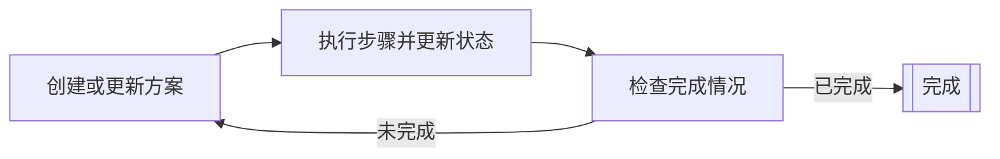

# 规划器智能体

--8<-- "versioning-snippets.md:beta"

规划器智能体是通过迭代规划周期来规划和执行多步任务的 AI 智能体。
它们会持续构建或更新方案、执行步骤，并根据当前状态检查完成标准。

规划器智能体适用于复杂的任务，这些任务需要将高级目标分解为更小的、可执行的步骤，并根据每个步骤的结果调整方案。

虽然在[基于图的智能体](../graph-based-agents.md)中，您需要定义所有的节点和边，
但对于规划器智能体，您只需定义带有类型的输入和输出的操作 (节点)。
规划器会创建适合实现预期状态的合理边，并且还可以更新步骤之间的最优路径。
与基于图的智能体相比，这允许使用更动态的方法，功能可能更强大，但可控性较低。

规划器智能体通过迭代规划周期运行：

1. 规划器根据当前状态创建或更新方案。
2. 规划器执行方案中的单个步骤，并更新状态。
3. 规划器根据当前状态判断方案是否已完成。
    - 如果方案已完成，则周期结束。
    - 如果方案未完成，则从第一步开始重复该周期。

Koog 提供两种类型的规划器智能体：

- [基于 LLM 的规划器](llm-based-planners.md)使用 LLM 来创建和更新方案
- [GOAP 智能体](goap-agents.md)使用特殊算法来确定最优操作序列