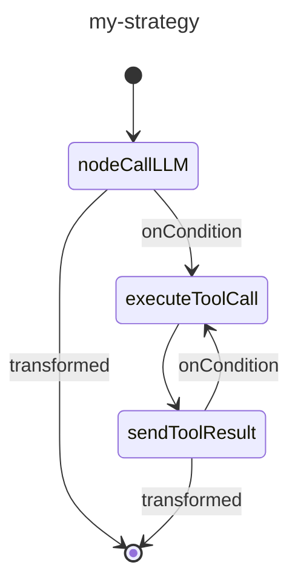

# 自定义策略图

策略图是 Koog framework 中代理工作流的核心支柱。它们定义了代理如何处理输入、与工具交互以及生成输出。策略图由通过边连接的节点组成，执行流由条件决定。

创建策略图能让你根据特定需求定制代理的行为，无论是构建一个简单的聊天机器人、一个复杂的数据处理流水线，还是介于两者之间的任何事物。

## 策略图架构

从高层视角看，策略图由以下组件构成：

-   **Strategy**：图的顶层容器，使用 `strategy` 函数创建，并使用泛型参数指定输入和输出类型。
-   **子图**：图中可以拥有自己工具集和上下文的部分。
-   **节点**：工作流中的单个操作或转换。
-   **边**：定义转换条件和转换的节点间连接。

策略图从一个名为 `nodeStart` 的特殊节点开始，到 `nodeFinish` 结束。这些节点之间的路径由图中指定的边和条件决定。

## 策略图组件

### 节点

节点是策略图的构建块。每个节点代表一个特定操作。

Koog framework 提供了预定义节点，也允许你使用 `node` 函数创建自定义节点。

详情请参见 [预定义节点和组件](nodes-and-components.md) 和 [自定义节点](custom-nodes.md)。

### 边

边连接节点并定义策略图中的操作流。边通过 `edge` 函数和 `forwardTo` 中缀函数创建：

<!--- INCLUDE
import ai.koog.agents.core.dsl.builder.forwardTo
import ai.koog.agents.core.dsl.builder.strategy

val strategy = strategy<String, String>("strategy_name") {
        val sourceNode by node<String, String> { input -> input }
        val targetNode by node<String, String> { input -> input }
-->
<!--- SUFFIX
}
-->
```kotlin
edge(sourceNode forwardTo targetNode)
```
<!--- KNIT example-custom-strategy-graphs-01.kt -->

#### 条件

条件决定了何时跟随策略图中的特定边。条件有以下几种类型，这里列出一些常见的：

| 条件类型         | 描述                                                                           |
| :--------------- | :----------------------------------------------------------------------------- |
| onCondition      | 接受一个返回布尔值的 lambda 表达式的通用条件。                                 |
| onToolCall       | 当 LLM 调用工具时匹配的条件。                                                  |
| onAssistantMessage | 当 LLM 响应消息时匹配的条件。                                                  |
| onMultipleToolCalls | 当 LLM 调用多个工具时匹配的条件。                                              |
| onToolNotCalled  | 当 LLM 未调用工具时匹配的条件。                                                |

你可以在将输出传递给目标节点之前，使用 `transformed` 函数对其进行转换：

<!--- INCLUDE
import ai.koog.agents.core.dsl.builder.forwardTo
import ai.koog.agents.core.dsl.builder.strategy

val strategy = strategy<String, String>("strategy_name") {
        val sourceNode by node<String, String> { input -> input }
        val targetNode by node<String, String> { input -> input }
-->
<!--- SUFFIX
}
-->
```kotlin
edge(sourceNode forwardTo targetNode 
        onCondition { input -> input.length > 10 }
        transformed { input -> input.uppercase() }
)
```
<!--- KNIT example-custom-strategy-graphs-02.kt -->

### 子图

子图是策略图的一部分，它们使用自己的一套工具和上下文进行操作。策略图可以包含多个子图。每个子图通过 `subgraph` 函数定义：

<!--- INCLUDE
import ai.koog.agents.core.dsl.builder.strategy

typealias Input = String
typealias Output = Int

typealias FirstInput = String
typealias FirstOutput = Int

typealias SecondInput = String
typealias SecondOutput = Int
-->
```kotlin
val strategy = strategy<Input, Output>("strategy-name") {
    val firstSubgraph by subgraph<FirstInput, FirstOutput>("first") {
        // Define nodes and edges for this subgraph
    }
    val secondSubgraph by subgraph<SecondInput, SecondOutput>("second") {
        // Define nodes and edges for this subgraph
    }
}
```
<!--- KNIT example-custom-strategy-graphs-03.kt -->

子图可以使用工具注册表中的任何工具。但是，你可以从该注册表中指定一个工具子集，并将其作为实参传递给 `subgraph` 函数，以供子图使用：

<!--- INCLUDE
import ai.koog.agents.core.dsl.builder.strategy
import ai.koog.agents.ext.tool.SayToUser

typealias Input = String
typealias Output = Int

typealias FirstInput = String
typealias FirstOutput = Int

val someTool = SayToUser

-->
```kotlin
val strategy = strategy<Input, Output>("strategy-name") {
    val firstSubgraph by subgraph<FirstInput, FirstOutput>(
        name = "first",
        tools = listOf(someTool)
    ) {
        // Define nodes and edges for this subgraph
    }
   // Define other subgraphs
}
```
<!--- KNIT example-custom-strategy-graphs-04.kt -->

## 基本策略图创建

基本策略图的运行方式如下：

1.  将输入发送到 LLM。
2.  如果 LLM 响应消息，则结束该过程。
3.  如果 LLM 调用工具，则运行该工具。
4.  将工具结果发送回 LLM。
5.  如果 LLM 响应消息，则结束该过程。
6.  如果 LLM 调用另一个工具，则运行该工具，然后过程从第 4 步重复。


以下是基本策略图的示例：

<!--- INCLUDE
import ai.koog.agents.core.dsl.builder.forwardTo
import ai.koog.agents.core.dsl.builder.strategy
import ai.koog.agents.core.dsl.extension.nodeExecuteTool
import ai.koog.agents.core.dsl.extension.nodeLLMRequest
import ai.koog.agents.core.dsl.extension.nodeLLMSendToolResult
import ai.koog.agents.core.dsl.extension.onAssistantMessage
import ai.koog.agents.core.dsl.extension.onToolCall

-->
```kotlin
val myStrategy = strategy<String, String>("my-strategy") {
    val nodeCallLLM by nodeLLMRequest()
    val executeToolCall by nodeExecuteTool()
    val sendToolResult by nodeLLMSendToolResult()

    edge(nodeStart forwardTo nodeCallLLM)
    edge(nodeCallLLM forwardTo nodeFinish onAssistantMessage { true })
    edge(nodeCallLLM forwardTo executeToolCall onToolCall { true })
    edge(executeToolCall forwardTo sendToolResult)
    edge(sendToolResult forwardTo nodeFinish onAssistantMessage { true })
    edge(sendToolResult forwardTo executeToolCall onToolCall { true })
}
```
<!--- KNIT example-custom-strategy-graphs-05.kt -->

## 可视化策略图

在 JVM 上，你可以为策略图生成 [Mermaid 状态图](https://mermaid.js.org/syntax/stateDiagram.html)。

对于上一个示例中创建的图，你可以运行：

<!--- INCLUDE
import ai.koog.agents.core.agent.asMermaidDiagram
import ai.koog.agents.core.dsl.builder.forwardTo
import ai.koog.agents.core.dsl.builder.strategy
import ai.koog.agents.core.dsl.extension.nodeExecuteTool
import ai.koog.agents.core.dsl.extension.nodeLLMRequest
import ai.koog.agents.core.dsl.extension.nodeLLMSendToolResult
import ai.koog.agents.core.dsl.extension.onAssistantMessage
import ai.koog.agents.core.dsl.extension.onToolCall

fun main() {
    val myStrategy = strategy("my-strategy") {
        val nodeCallLLM by nodeLLMRequest()
        val executeToolCall by nodeExecuteTool()
        val sendToolResult by nodeLLMSendToolResult()
    
        edge(nodeStart forwardTo nodeCallLLM)
        edge(nodeCallLLM forwardTo nodeFinish onAssistantMessage { true })
        edge(nodeCallLLM forwardTo executeToolCall onToolCall { true })
        edge(executeToolCall forwardTo sendToolResult)
        edge(sendToolResult forwardTo nodeFinish onAssistantMessage { true })
        edge(sendToolResult forwardTo executeToolCall onToolCall { true })
    }
-->
<!--- SUFFIX
}
-->

```kotlin
val mermaidDiagram: String = myStrategy.asMermaidDiagram()

println(mermaidDiagram)
```

输出将是：


<!--- KNIT example-custom-strategy-graphs-06.kt -->

## 高级策略技术

### 历史记录压缩

对于长期运行的对话，历史记录可能会变得很大并消耗大量 token。关于如何压缩历史记录，请参见 [历史记录压缩](history-compression.md)。

### 并行工具执行

对于需要并行执行多个工具的工作流，你可以使用 `nodeExecuteMultipleTools` 节点：

<!--- INCLUDE
import ai.koog.agents.core.dsl.builder.forwardTo
import ai.koog.agents.core.dsl.builder.strategy
import ai.koog.agents.core.dsl.extension.nodeExecuteMultipleTools
import ai.koog.agents.core.dsl.extension.nodeLLMSendMultipleToolResults
import ai.koog.prompt.message.Message

val strategy = strategy<String, String>("strategy_name") {
    val someNode by node<String, List<Message.Tool.Call>> { emptyList() }
-->
<!--- SUFFIX
}
-->
```kotlin
val executeMultipleTools by nodeExecuteMultipleTools()
val processMultipleResults by nodeLLMSendMultipleToolResults()

edge(someNode forwardTo executeMultipleTools)
edge(executeMultipleTools forwardTo processMultipleResults)
```
<!--- KNIT example-custom-strategy-graphs-07.kt -->

你也可以使用 `toParallelToolCallsRaw` 扩展函数处理流式数据：

<!--- INCLUDE
/*
-->
<!--- SUFFIX
*/
-->
```kotlin
parseMarkdownStreamToBooks(markdownStream).toParallelToolCallsRaw(BookTool::class).collect()
```
<!--- KNIT example-custom-strategy-graphs-08.kt -->

要了解更多信息，请参见 [工具](tools-overview.md#parallel-tool-calls)。

### 并行节点执行

并行节点执行允许你并发地运行多个节点，从而提高性能并启用复杂的工作流。

要启动并行节点运行，请使用 `parallel` 方法：

<!--- INCLUDE
import ai.koog.agents.core.dsl.builder.strategy

val strategy = strategy<String, String>("strategy_name") {
    val nodeCalcTokens by node<String, Int> { 42 }
    val nodeCalcSymbols by node<String, Int> { 42 }
    val nodeCalcWords by node<String, Int> { 42 }

-->
<!--- SUFFIX
}
-->
```kotlin
val calc by parallel<String, Int>(
    nodeCalcTokens, nodeCalcSymbols, nodeCalcWords,
) {
    selectByMax { it }
}
```
<!--- KNIT example-custom-strategy-graphs-09.kt -->

上述代码创建了一个名为 `calc` 的节点，该节点并行运行 `nodeCalcTokens`、`nodeCalcSymbols` 和 `nodeCalcWords` 节点，并将结果作为 `AsyncParallelResult` 的一个实例返回。

关于并行节点执行和详细参考的更多信息，请参见 [并行节点执行](parallel-node-execution.md)。

### 条件分支

对于需要根据特定条件采取不同路径的复杂工作流，你可以使用条件分支：

<!--- INCLUDE
import ai.koog.agents.core.dsl.builder.forwardTo
import ai.koog.agents.core.dsl.builder.strategy

val strategy = strategy<String, String>("strategy_name") {
    val someNode by node<String, String> { it }
-->
<!--- SUFFIX
}
-->
```kotlin
val branchA by node<String, String> { input ->
    // Logic for branch A
    "Branch A: $input"
}

val branchB by node<String, String> { input ->
    // Logic for branch B
    "Branch B: $input"
}

edge(
    (someNode forwardTo branchA)
            onCondition { input -> input.contains("A") }
)
edge(
    (someNode forwardTo branchB)
            onCondition { input -> input.contains("B") }
)
```
<!--- KNIT example-custom-strategy-graphs-10.kt -->

## 最佳实践

创建自定义策略图时，请遵循以下最佳实践：

-   保持简单。从一个简单的图开始，根据需要增加复杂性。
-   给你的节点和边起描述性名称，使图更易于理解。
-   处理所有可能的路径和边缘情况。
-   用各种输入测试你的图，确保其行为符合预期。
-   记录你的图的目的和行为，以备将来参考。
-   使用预定义策略或常见模式作为起点。
-   对于长期运行的对话，使用历史记录压缩以减少 token 使用量。
-   使用子图来组织你的图并管理工具访问。

## 用法示例

### 语气分析策略

语气分析策略是基于工具的策略的一个很好的示例，它包括历史记录压缩：

<!--- INCLUDE
import ai.koog.agents.core.agent.entity.AIAgentGraphStrategy
import ai.koog.agents.core.dsl.builder.forwardTo
import ai.koog.agents.core.dsl.builder.strategy
import ai.koog.agents.core.dsl.extension.nodeExecuteTool
import ai.koog.agents.core.dsl.extension.nodeLLMCompressHistory
import ai.koog.agents.core.dsl.extension.nodeLLMRequest
import ai.koog.agents.core.dsl.extension.nodeLLMSendToolResult
import ai.koog.agents.core.dsl.extension.onAssistantMessage
import ai.koog.agents.core.dsl.extension.onToolCall
import ai.koog.agents.core.environment.ReceivedToolResult
import ai.koog.agents.core.tools.ToolRegistry
-->
```kotlin
fun toneStrategy(name: String, toolRegistry: ToolRegistry): AIAgentGraphStrategy<String, String> {
    return strategy(name) {
        val nodeSendInput by nodeLLMRequest()
        val nodeExecuteTool by nodeExecuteTool()
        val nodeSendToolResult by nodeLLMSendToolResult()
        val nodeCompressHistory by nodeLLMCompressHistory<ReceivedToolResult>()

        // Define the flow of the agent
        edge(nodeStart forwardTo nodeSendInput)

        // If the LLM responds with a message, finish
        edge(
            (nodeSendInput forwardTo nodeFinish)
                    onAssistantMessage { true }
        )

        // If the LLM calls a tool, execute it
        edge(
            (nodeSendInput forwardTo nodeExecuteTool)
                    onToolCall { true }
        )

        // If the history gets too large, compress it
        edge(
            (nodeExecuteTool forwardTo nodeCompressHistory)
                    onCondition { _ -> llm.readSession { prompt.messages.size > 100 } }
        )

        edge(nodeCompressHistory forwardTo nodeSendToolResult)

        // Otherwise, send the tool result directly
        edge(
            (nodeExecuteTool forwardTo nodeSendToolResult)
                    onCondition { _ -> llm.readSession { prompt.messages.size <= 100 } }
        )

        // If the LLM calls another tool, execute it
        edge(
            (nodeSendToolResult forwardTo nodeExecuteTool)
                    onToolCall { true }
        )

        // If the LLM responds with a message, finish
        edge(
            (nodeSendToolResult forwardTo nodeFinish)
                    onAssistantMessage { true }
        )
    }
}
```
<!--- KNIT example-custom-strategy-graphs-11.kt -->

此策略执行以下操作：

1.  将输入发送到 LLM。
2.  如果 LLM 响应消息，策略将结束该过程。
3.  如果 LLM 调用工具，策略将运行该工具。
4.  如果历史记录过大（超过 100 条消息），策略将在发送工具结果之前压缩它。
5.  否则，策略将直接发送工具结果。
6.  如果 LLM 调用另一个工具，策略将运行它。
7.  如果 LLM 响应消息，策略将结束该过程。

## 故障排除

创建自定义策略图时，你可能会遇到一些常见问题。以下是一些故障排除技巧：

### 图无法到达结束节点

如果你的图未到达结束节点，请检查以下内容：

-   从开始节点到结束节点的所有路径最终都通向结束节点。
-   你的条件不过于严格，以致阻止边被跟随。
-   图中没有没有退出条件的循环。

### 工具调用未运行

如果工具调用未运行，请检查以下内容：

-   工具是否在工具注册表中正确注册。
-   从 LLM 节点到工具执行节点的边是否具有正确的条件 (`onToolCall { true }`)。

### 历史记录过大

如果你的历史记录过大并消耗过多 token，请考虑以下几点：

-   添加一个历史记录压缩节点。
-   使用条件检测历史记录的大小，并在它过大时压缩它。
-   使用更积极的压缩策略（例如，`FromLastNMessages` 并使用更小的 N 值）。

### 图行为异常

如果你的图采取了意料之外的分支，请检查以下内容：

-   你的条件定义正确。
-   条件的求值顺序符合预期（边的检测顺序与它们的定义顺序一致）。
-   你没有意外覆盖更通用的条件。

### 出现性能问题

如果你的图有性能问题，请考虑以下几点：

-   通过删除不必要的节点和边来简化图。
-   对独立操作使用并行工具执行。
-   压缩历史记录。
-   使用更高效的节点和操作。