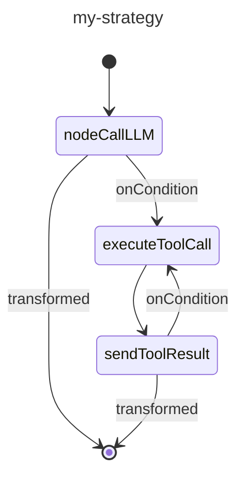

# 自定义策略图

策略图是 Koog 框架中智能体工作流的核心。它们定义了智能体如何处理输入、与工具交互以及生成输出。策略图由通过边连接的节点组成，其执行流程由条件决定。

通过创建策略图，你可以根据特定需求定制智能体的行为，无论是构建简单的聊天机器人、复杂的数据处理流水线，还是介于两者之间的任何应用。

## 策略图架构

从高层级来看，策略图由以下组件组成：

- **策略 (Strategy)**：图的顶级容器，使用 `strategy` 函数创建，并通过泛型参数指定输入和输出类型。
- **子图 (Subgraphs)**：图的各个部分，可以拥有自己的一套工具和上下文。
- **节点 (Nodes)**：工作流中的单个操作或转换。
- **边 (Edges)**：节点之间的连接，定义了转换条件和转换逻辑。

策略图从名为 `nodeStart` 的特殊节点开始，到 `nodeFinish` 结束。这些节点之间的路径由图中指定的边和条件决定。

## 策略图组件

### 节点

节点是策略图的构建块。每个节点代表一个特定的操作。

Koog 框架提供了预定义节点，同时也允许你使用 `node` 函数创建自定义节点。

有关详细信息，请参阅[预定义节点与组件](nodes-and-components.md)和[自定义节点](custom-nodes.md)。

### 边

边连接节点并定义策略图中的操作流。使用 `edge` 函数和 `forwardTo` 中缀函数创建边：

=== "Kotlin"

    <!--- INCLUDE
    import ai.koog.agents.core.dsl.builder.forwardTo
    import ai.koog.agents.core.dsl.builder.strategy
    import ai.koog.agents.core.dsl.builder.node
    import ai.koog.agents.core.dsl.builder.parallel
    import ai.koog.agents.core.dsl.builder.subgraph
    val strategy = strategy<String, String>("strategy_name") {
            val sourceNode by node<String, String> { input -> input }
            val targetNode by node<String, String> { input -> input }
    -->
    <!--- SUFFIX
    }
    -->
    ```kotlin
    edge(sourceNode forwardTo targetNode)
    ```
    <!--- KNIT example-custom-strategy-graphs-01.kt -->

=== "Java"

    <!--- INCLUDE
    import ai.koog.agents.core.agent.entity.AIAgentGraphStrategy;
    import ai.koog.agents.core.agent.entity.AIAgentNode;
    class exampleCustomStrategyGraphsJava01 {
        public static void main(String[] args) {
            var strategy = AIAgentGraphStrategy.builder("strategyName")
                .withInput(String.class)
                .withOutput(String.class);
            var sourceNode = AIAgentNode.doNothing(String.class);
            var targetNode = AIAgentNode.doNothing(String.class);
    -->
    <!--- SUFFIX
        }
    }
    -->
    ```java
    strategy.edge(sourceNode, targetNode);
    ```
    <!--- KNIT exampleCustomStrategyGraphsJava01.java -->

#### 条件

条件决定何时沿策略图中的特定边执行。有多种类型的条件，以下是一些常见的：

| 条件类型 | 描述 |
|---------------------|------------------------------------------------------------------------------------------|
| onCondition         | 通用条件，接受一个返回布尔值的 lambda表达式。 |
| onToolCall          | 当 LLM 调用工具时匹配的条件。 |
| onAssistantMessage  | 当 LLM 以消息形式响应时匹配的条件。 |
| onMultipleToolCalls | 当 LLM 调用多个工具时匹配的条件。 |
| onToolNotCalled     | 当 LLM 未调用工具时匹配的条件。 |

在将输出传递给目标节点之前，你可以使用 `transformed` 函数对其进行转换：

=== "Kotlin"

    <!--- INCLUDE
    import ai.koog.agents.core.dsl.builder.forwardTo
    import ai.koog.agents.core.dsl.builder.strategy
    import ai.koog.agents.core.dsl.builder.node
    import ai.koog.agents.core.dsl.builder.parallel
    import ai.koog.agents.core.dsl.builder.subgraph
    val strategy = strategy<String, String>("strategy_name") {
            val sourceNode by node<String, String> { input -> input }
            val targetNode by node<String, String> { input -> input }
    -->
    <!--- SUFFIX
    }
    -->
    ```kotlin
    edge(sourceNode forwardTo targetNode 
            onCondition { input -> input.length > 10 }
            transformed { input -> input.uppercase() }
    )
    ```
    <!--- KNIT example-custom-strategy-graphs-02.kt -->

=== "Java"

    <!--- INCLUDE
    import ai.koog.agents.core.agent.entity.AIAgentEdge;
    import ai.koog.agents.core.agent.entity.AIAgentGraphStrategy;
    import ai.koog.agents.core.agent.entity.AIAgentNode;
    class exampleCustomStrategyGraphsJava02 {
        public static void main(String[] args) {
            var strategy = AIAgentGraphStrategy.builder("strategyName")
                .withInput(String.class)
                .withOutput(String.class);
            var sourceNode = AIAgentNode.doNothing(String.class);
            var targetNode = AIAgentNode.doNothing(String.class);
    -->
    <!--- SUFFIX
        }
    }
    -->
    ```java
    strategy.edge(AIAgentEdge.builder()
        .from(sourceNode)
        .to(targetNode)
        .onCondition(input -> input.length() > 10)
        .transformed(input -> input.toUpperCase())
        .build());
    ```
    <!--- KNIT exampleCustomStrategyGraphsJava02.java -->

### 子图

子图是策略图的一部分，使用自己的一套工具和上下文运行。策略图可以包含多个子图。每个子图使用 `subgraph` 函数定义：

=== "Kotlin"

    <!--- INCLUDE
    import ai.koog.agents.core.dsl.builder.strategy
    import ai.koog.agents.core.dsl.builder.node
    import ai.koog.agents.core.dsl.builder.parallel
    import ai.koog.agents.core.dsl.builder.subgraph
    typealias Input = String
    typealias Output = Int
    typealias FirstInput = String
    typealias FirstOutput = Int
    typealias SecondInput = String
    typealias SecondOutput = Int
    -->
    ```kotlin
    val strategy = strategy<Input, Output>("strategy-name") {
        val firstSubgraph by subgraph<FirstInput, FirstOutput>("first") {
            // 为该子图定义节点和边
        }
        val secondSubgraph by subgraph<SecondInput, SecondOutput>("second") {
            // 为该子图定义节点和边
        }
    }
    ```
    <!--- KNIT example-custom-strategy-graphs-03.kt -->

=== "Java"

    <!--- INCLUDE
    import ai.koog.agents.core.agent.entity.AIAgentSubgraph;
    class exampleCustomStrategyGraphsJava03 {
        class FirstInput {}
        class FirstOutput {}
        class SecondInput {}
        class SecondOutput {}
        public static void main(String[] args) {
    -->
    <!--- SUFFIX
        }
    }
    -->
    ```java
    var firstSubgraph = AIAgentSubgraph.builder("first")
        .withInput(FirstInput.class)
        .withOutput(FirstOutput.class)
        .define(subgraph -> {
            // 为该子图定义节点和边
        })
        .build();

    var secondSubgraph = AIAgentSubgraph.builder("second")
        .withInput(SecondInput.class)
        .withOutput(SecondOutput.class)
        .define(subgraph -> {
            // 为该子图定义节点和边
        })
        .build();
    ```
    <!--- KNIT exampleCustomStrategyGraphsJava03.java -->

子图可以使用工具注册表中的任何工具。但是，你可以从该注册表中指定一个可在子图中使用的工具子集，并将其作为参数传递给 `subgraph` 函数：

=== "Kotlin"

    <!--- INCLUDE
    import ai.koog.agents.core.dsl.builder.strategy
    import ai.koog.agents.core.dsl.builder.node
    import ai.koog.agents.core.dsl.builder.parallel
    import ai.koog.agents.core.dsl.builder.subgraph
    import ai.koog.agents.ext.tool.SayToUser
    typealias Input = String
    typealias Output = Int
    typealias FirstInput = String
    typealias FirstOutput = Int
    val someTool = SayToUser
    -->
    ```kotlin
    val strategy = strategy<Input, Output>("strategy-name") {
        val firstSubgraph by subgraph<FirstInput, FirstOutput>(
            name = "first",
            tools = listOf(someTool)
        ) {
            // 为该子图定义节点和边
        }
       // 定义其他子图
    }
    ```
    <!--- KNIT example-custom-strategy-graphs-04.kt -->

=== "Java"

    <!--- INCLUDE
    import ai.koog.agents.core.agent.entity.AIAgentSubgraph;
    import ai.koog.agents.core.tools.reflect.ToolSet;
    class exampleCustomStrategyGraphsJava04 {
        class FirstInput {}
        class FirstOutput {}
        static ToolSet someTools = null;
        public static void main(String[] args) {
    -->
    <!--- SUFFIX
        }
    }
    -->
    ```java
    var firstSubgraph = AIAgentSubgraph.builder("first")
        .withInput(FirstInput.class)
        .withOutput(FirstOutput.class)
        .limitedTools(someTools)
        .define(subgraph -> {
            // 为该子图定义节点和边
        })
        .build();
    ```
    <!--- KNIT exampleCustomStrategyGraphsJava04.java -->

## 基础策略图创建

基础策略图的运行方式如下：

1. 将输入发送给 LLM。
2. 如果 LLM 以消息形式响应，则结束流程。
3. 如果 LLM 调用工具，则运行该工具。
4. 将工具结果发送回 LLM。
5. 如果 LLM 以消息形式响应，则结束流程。
6. 如果 LLM 调用另一个工具，则运行该工具，并从第 4 步开始重复该过程。


以下是一个基础策略图的示例：

=== "Kotlin"

    <!--- INCLUDE
    import ai.koog.agents.core.dsl.builder.forwardTo
    import ai.koog.agents.core.dsl.builder.strategy
    import ai.koog.agents.core.dsl.builder.node
    import ai.koog.agents.core.dsl.builder.parallel
    import ai.koog.agents.core.dsl.builder.subgraph
    import ai.koog.agents.core.dsl.extension.nodeExecuteTool
    import ai.koog.agents.core.dsl.extension.nodeLLMRequest
    import ai.koog.agents.core.dsl.extension.nodeLLMSendToolResult
    import ai.koog.agents.core.dsl.extension.onAssistantMessage
    import ai.koog.agents.core.dsl.extension.onToolCall
    -->
    ```kotlin
    val myStrategy = strategy<String, String>("my-strategy") {
        val nodeCallLLM by nodeLLMRequest()
        val executeToolCall by nodeExecuteTool()
        val sendToolResult by nodeLLMSendToolResult()
    
        edge(nodeStart forwardTo nodeCallLLM)
        edge(nodeCallLLM forwardTo nodeFinish onAssistantMessage { true })
        edge(nodeCallLLM forwardTo executeToolCall onToolCall { true })
        edge(executeToolCall forwardTo sendToolResult)
        edge(sendToolResult forwardTo nodeFinish onAssistantMessage { true })
        edge(sendToolResult forwardTo executeToolCall onToolCall { true })
    }
    ```
    <!--- KNIT example-custom-strategy-graphs-05.kt -->

=== "Java"

    <!--- INCLUDE
    import ai.koog.agents.core.agent.entity.AIAgentEdge;
    import ai.koog.agents.core.agent.entity.AIAgentGraphStrategy;
    import ai.koog.agents.core.agent.entity.AIAgentNode;
    import ai.koog.prompt.message.Message;
    class exampleCustomStrategyGraphsJava05 {
        public static void main(String[] args) {
    -->
    <!--- SUFFIX
        }
    }
    -->
    ```java
    var graph = AIAgentGraphStrategy.builder("single_run")
        .withInput(String.class)
        .withOutput(String.class);

    var nodeCallLLM = AIAgentNode.llmRequest(true, "sendInput");
    var nodeExecuteTool = AIAgentNode.executeTool("nodeExecuteTool");
    var nodeSendToolResult = AIAgentNode.llmSendToolResult("nodeSendToolResult");

    graph.edge(graph.nodeStart, nodeCallLLM);

    graph.edge(AIAgentEdge.builder()
        .from(nodeCallLLM)
        .to(nodeExecuteTool)
        .onIsInstance(Message.Tool.Call.class)
        .build());

    graph.edge(AIAgentEdge.builder()
        .from(nodeCallLLM)
        .to(graph.nodeFinish)
        .onIsInstance(Message.Assistant.class)
        .transformed(Message.Assistant::getContent)
        .build());

    graph.edge(nodeExecuteTool, nodeSendToolResult);

    graph.edge(AIAgentEdge.builder()
        .from(nodeSendToolResult)
        .to(graph.nodeFinish)
        .onIsInstance(Message.Assistant.class)
        .transformed(Message.Assistant::getContent)
        .build());

    graph.edge(AIAgentEdge.builder()
        .from(nodeSendToolResult)
        .to(nodeExecuteTool)
        .onIsInstance(Message.Tool.Call.class)
        .build());

    var strategy = graph.build();
    ```
    <!--- KNIT exampleCustomStrategyGraphsJava05.java -->

## 可视化策略图

在 JVM 上，你可以为策略图生成 [Mermaid 状态图](https://mermaid.js.org/syntax/stateDiagram.html)。

对于上一个示例中创建的图，你可以运行：

=== "Kotlin"

    <!--- INCLUDE
    import ai.koog.agents.core.agent.asMermaidDiagram
    import ai.koog.agents.core.dsl.builder.forwardTo
    import ai.koog.agents.core.dsl.builder.strategy
    import ai.koog.agents.core.dsl.builder.node
    import ai.koog.agents.core.dsl.builder.parallel
    import ai.koog.agents.core.dsl.builder.subgraph
    import ai.koog.agents.core.dsl.extension.nodeExecuteTool
    import ai.koog.agents.core.dsl.extension.nodeLLMRequest
    import ai.koog.agents.core.dsl.extension.nodeLLMSendToolResult
    import ai.koog.agents.core.dsl.extension.onAssistantMessage
    import ai.koog.agents.core.dsl.extension.onToolCall
    fun main() {
        val myStrategy = strategy("my-strategy") {
            val nodeCallLLM by nodeLLMRequest()
            val executeToolCall by nodeExecuteTool()
            val sendToolResult by nodeLLMSendToolResult()
            edge(nodeStart forwardTo nodeCallLLM)
            edge(nodeCallLLM forwardTo nodeFinish onAssistantMessage { true })
            edge(nodeCallLLM forwardTo executeToolCall onToolCall { true })
            edge(executeToolCall forwardTo sendToolResult)
            edge(sendToolResult forwardTo nodeFinish onAssistantMessage { true })
            edge(sendToolResult forwardTo executeToolCall onToolCall { true })
        }
    -->
    <!--- SUFFIX
    }
    -->
    
    ```kotlin
    val mermaidDiagram: String = myStrategy.asMermaidDiagram()
    
    println(mermaidDiagram)
    ```
    <!--- KNIT example-custom-strategy-graphs-06.kt -->

=== "Java"

    <!--- INCLUDE
    import ai.koog.agents.core.agent.MermaidDiagramGenerator;
    import ai.koog.agents.core.agent.entity.AIAgentGraphStrategy;
    class exampleCustomStrategyGraphsJava06 {
        public static void main(String[] args) {
            var myStrategy = AIAgentGraphStrategy.builder("single_run")
                .withInput(String.class)
                .withOutput(String.class)
                .build();
    -->
    <!--- SUFFIX
        }
    }
    -->
    ```java
    var mermaidDiagram = MermaidDiagramGenerator.INSTANCE.generate(myStrategy);
    System.out.println(mermaidDiagram);
    ```
    <!--- KNIT exampleCustomStrategyGraphsJava06.java -->

输出将是：

```mermaid
---
title: my-strategy
---
stateDiagram
    state "nodeCallLLM" as nodeCallLLM
    state "executeToolCall" as executeToolCall
    state "sendToolResult" as sendToolResult

    [*] --> nodeCallLLM
    nodeCallLLM --> [*] : transformed
    nodeCallLLM --> executeToolCall : onCondition
    executeToolCall --> sendToolResult
    sendToolResult --> [*] : transformed
    sendToolResult --> executeToolCall : onCondition
```
<!--- KNIT example-custom-strategy-graphs-01.txt -->

## 高级策略技巧

### 历史压缩

对于长时间运行的对话，历史记录可能会变得很大并消耗大量 token。要了解如何压缩历史记录，请参阅[历史压缩](history-compression.md)。

### 并行工具执行

对于需要并行执行多个工具的工作流，可以使用 `nodeExecuteMultipleTools` 节点：

<!--- INCLUDE
import ai.koog.agents.core.dsl.builder.forwardTo
import ai.koog.agents.core.dsl.builder.strategy
import ai.koog.agents.core.dsl.builder.node
import ai.koog.agents.core.dsl.builder.parallel
import ai.koog.agents.core.dsl.builder.subgraph
import ai.koog.agents.core.dsl.extension.nodeExecuteMultipleTools
import ai.koog.agents.core.dsl.extension.nodeLLMSendMultipleToolResults
import ai.koog.prompt.message.Message

val strategy = strategy<String, String>("strategy_name") {
    val someNode by node<String, List<Message.Tool.Call>> { emptyList() }
-->
<!--- SUFFIX
}
-->
```kotlin
val executeMultipleTools by nodeExecuteMultipleTools()
val processMultipleResults by nodeLLMSendMultipleToolResults()

edge(someNode forwardTo executeMultipleTools)
edge(executeMultipleTools forwardTo processMultipleResults)
```
<!--- KNIT example-custom-strategy-graphs-07.kt -->

你还可以对流数据使用 `toParallelToolCallsRaw` 扩展函数：

<!--- INCLUDE
/*
-->
<!--- SUFFIX
*/
-->
```kotlin
parseMarkdownStreamToBooks(markdownStream).toParallelToolCallsRaw(BookTool::class).collect()
```
<!--- KNIT example-custom-strategy-graphs-08.kt -->

要了解更多信息，请参阅[工具](tools-overview.md#parallel-tool-calls)。 

### 并行节点执行 

并行节点执行允许你并发运行多个节点，从而提高性能并启用复杂的工作流。

要发起并行节点运行，请使用 `parallel` 方法：

<!--- INCLUDE
import ai.koog.agents.core.dsl.builder.strategy
import ai.koog.agents.core.dsl.builder.node
import ai.koog.agents.core.dsl.builder.parallel
import ai.koog.agents.core.dsl.builder.subgraph

val strategy = strategy<String, String>("strategy_name") {
    val nodeCalcTokens by node<String, Int> { 42 }
    val nodeCalcSymbols by node<String, Int> { 42 }
    val nodeCalcWords by node<String, Int> { 42 }

-->
<!--- SUFFIX
}
-->
```kotlin
val calc by parallel<String, Int>(
    nodeCalcTokens, nodeCalcSymbols, nodeCalcWords,
) {
    selectByMax { it }
}
```
<!--- KNIT example-custom-strategy-graphs-09.kt -->

上述代码创建了一个名为 `calc` 的节点，它并行运行 `nodeCalcTokens`、`nodeCalcSymbols` 和 `nodeCalcWords` 节点，并将结果作为 `AsyncParallelResult` 实例返回。

有关并行节点执行的更多信息和详细参考，请参阅[并行节点执行](parallel-node-execution.md)。

### 条件分支

对于需要根据某些条件采取不同路径的复杂工作流，可以使用条件分支：

<!--- INCLUDE
import ai.koog.agents.core.dsl.builder.forwardTo
import ai.koog.agents.core.dsl.builder.strategy
import ai.koog.agents.core.dsl.builder.node
import ai.koog.agents.core.dsl.builder.parallel
import ai.koog.agents.core.dsl.builder.subgraph

val strategy = strategy<String, String>("strategy_name") {
    val someNode by node<String, String> { it }
-->
<!--- SUFFIX
}
-->
```kotlin
val branchA by node<String, String> { input ->
    // 分支 A 的逻辑
    "Branch A: $input"
}

val branchB by node<String, String> { input ->
    // 分支 B 的逻辑
    "Branch B: $input"
}

edge(
    (someNode forwardTo branchA)
            onCondition { input -> input.contains("A") }
)
edge(
    (someNode forwardTo branchB)
            onCondition { input -> input.contains("B") }
)
```
<!--- KNIT example-custom-strategy-graphs-10.kt -->

## 最佳做法

创建自定义策略图时，请遵循以下最佳做法：

- 保持简单。从简单的图开始，并根据需要增加复杂性。
- 为节点和边提供描述性名称，使图更易于理解。
- 处理所有可能的路径和边缘情况。
- 使用各种输入测试你的图，以确保其行为符合预期。
- 记录图的用途和行为，以备将来参考。
- 使用预定义策略或常见模式作为起点。
- 对于长时间运行的对话，使用历史压缩来减少 token 使用量。
- 使用子图来组织你的图并管理工具访问。

## 使用示例

### 语气分析策略

语气分析策略是基于工具的策略的一个很好的例子，它包含了历史压缩：

<!--- INCLUDE
import ai.koog.agents.core.agent.entity.AIAgentGraphStrategy
import ai.koog.agents.core.dsl.builder.forwardTo
import ai.koog.agents.core.dsl.builder.strategy
import ai.koog.agents.core.dsl.builder.node
import ai.koog.agents.core.dsl.builder.parallel
import ai.koog.agents.core.dsl.builder.subgraph
import ai.koog.agents.core.dsl.extension.nodeExecuteTool
import ai.koog.agents.core.dsl.extension.nodeLLMCompressHistory
import ai.koog.agents.core.dsl.extension.nodeLLMRequest
import ai.koog.agents.core.dsl.extension.nodeLLMSendToolResult
import ai.koog.agents.core.dsl.extension.onAssistantMessage
import ai.koog.agents.core.dsl.extension.onToolCall
import ai.koog.agents.core.environment.ReceivedToolResult
import ai.koog.agents.core.tools.ToolRegistry
-->
```kotlin
fun toneStrategy(name: String, toolRegistry: ToolRegistry): AIAgentGraphStrategy<String, String> {
    return strategy(name) {
        val nodeSendInput by nodeLLMRequest()
        val nodeExecuteTool by nodeExecuteTool()
        val nodeSendToolResult by nodeLLMSendToolResult()
        val nodeCompressHistory by nodeLLMCompressHistory<ReceivedToolResult>()

        // 定义智能体的流程
        edge(nodeStart forwardTo nodeSendInput)

        // 如果 LLM 以消息形式响应，则结束
        edge(
            (nodeSendInput forwardTo nodeFinish)
                    onAssistantMessage { true }
        )

        // 如果 LLM 调用工具，则执行它
        edge(
            (nodeSendInput forwardTo nodeExecuteTool)
                    onToolCall { true }
        )

        // 如果历史记录变得太大，则进行压缩
        edge(
            (nodeExecuteTool forwardTo nodeCompressHistory)
                    onCondition { _ -> llm.readSession { prompt.messages.size > 100 } }
        )

        edge(nodeCompressHistory forwardTo nodeSendToolResult)

        // 否则，直接发送工具结果
        edge(
            (nodeExecuteTool forwardTo nodeSendToolResult)
                    onCondition { _ -> llm.readSession { prompt.messages.size <= 100 } }
        )

        // 如果 LLM 调用另一个工具，则执行它
        edge(
            (nodeSendToolResult forwardTo nodeExecuteTool)
                    onToolCall { true }
        )

        // 如果 LLM 以消息形式响应，则结束
        edge(
            (nodeSendToolResult forwardTo nodeFinish)
                    onAssistantMessage { true }
        )
    }
}
```
<!--- KNIT example-custom-strategy-graphs-11.kt -->

该策略执行以下操作：

1. 将输入发送给 LLM。
2. 如果 LLM 以消息形式响应，策略将结束流程。
3. 如果 LLM 调用工具，策略将运行该工具。
4. 如果历史记录太大（超过 100 条消息），策略会在发送工具结果之前先压缩历史记录。
5. 否则，策略直接发送工具结果。
6. 如果 LLM 调用另一个工具，策略将运行它。
7. 如果 LLM 以消息形式响应，策略将结束流程。

## 故障排除

创建自定义策略图时，你可能会遇到一些常见问题。以下是一些故障排除提示：

### 图无法到达结束节点

如果你的图没有到达结束节点，请检查以下内容：

- 从开始节点出发的所有路径最终都能通向结束节点。
- 你的条件没有过于严格，从而阻止了边的执行。
- 图中没有缺少退出条件的循环。

### 工具调用未运行

如果工具调用未运行，请检查以下内容：

- 工具已在工具注册表中正确注册。
- 从 LLM 节点到工具执行节点的边具有正确的条件（`onToolCall { true }`）。

### 历史记录变得太大

如果你的历史记录变得太大并消耗过多 token，请考虑以下事项：

- 添加历史压缩节点。
- 使用条件检查历史记录的大小，并在其过大时进行压缩。
- 使用更激进的压缩策略（例如，使用较小 N 值的 `FromLastNMessages`）。

### 图的行为不符合预期

如果你的图进入了意料之外的分支，请检查以下内容：

- 你的条件定义正确。
- 条件按预期的顺序进行评估（边按定义的顺序进行检查）。
- 你没有意外地用更通用的条件覆盖了特定条件。

### 出现性能问题

如果你的图存在性能问题，请考虑以下事项：

- 通过移除不必要的节点和边来简化图。
- 对独立操作使用并行工具执行。
- 压缩历史记录。
- 使用更高效的节点和操作。