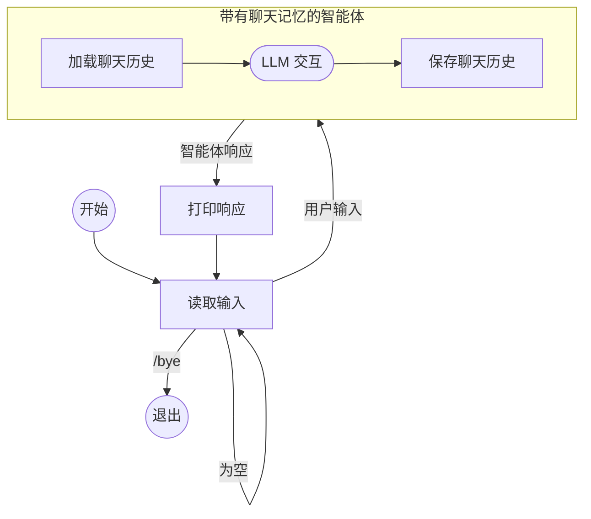

# 构建带有记忆功能的聊天智能体

本指南演示如何使用 [ChatMemory](index.md) 功能创建一个对话式命令行聊天应用程序，该程序可以在多次智能体 (agent) 交互中记住之前的消息。

该命令行 (CLI) 应用程序执行以下循环：

- 从控制台读取输入。
- 如果输入不是 `/bye` 且不为空，则使用用户输入和指定的会话 ID (session ID) 运行智能体。
- 智能体首先加载该会话 ID 的历史对话记录，并将其与用户输入一起添加到提示词中。
- 智能体进行 LLM 交互。
- 运行结束时，在返回响应之前，智能体会将完整的历史对话记录存储在指定的会话 ID 下，并将大小限制为最近的 20 条消息。
- 随后，应用打印出智能体的响应。

下图为流程演示：



## 代码

??? note "先决条件"

    --8<-- "quickstart-snippets.md:prerequisites"

    添加主要的 [Koog agents 软件包](https://central.sonatype.com/artifact/ai.koog/koog-agents/) 和 [聊天记忆功能软件包](https://mvnrepository.com/artifact/ai.koog/agents-features-memory) 作为依赖项：

    === "Gradle (Kotlin)"
    
        ```kotlin title="build.gradle.kts"
        dependencies {
            implementation("ai.koog:koog-agents:1.0.0")
            implementation("ai.koog:agents-features-memory:1.0.0")
        }
        ```
    
    === "Gradle (Groovy)"
    
        ```groovy title="build.gradle"
        dependencies {
            implementation 'ai.koog:koog-agents:0.7.0'
            implementation 'ai.koog:agents-features-memory:0.7.0'
        }
        ```
    
    === "Maven"
    
        ```xml title="pom.xml"
        <dependency>
            <groupId>ai.koog</groupId>
            <artifactId>koog-agents-jvm</artifactId>
            <version>1.0.0</version>
        </dependency>
        <dependency>
            <groupId>ai.koog</groupId>
            <artifactId>agents-features-memory-jvm</artifactId>
            <version>0.7.0</version>
        </dependency>
        ```

    --8<-- "quickstart-snippets.md:api-key"

    此页面上的示例假定您已设置了 `OPENAI_API_KEY` 环境变量。

=== "Kotlin"

    <!--- INCLUDE
    import ai.koog.agents.chatMemory.feature.ChatMemory
    import ai.koog.agents.chatMemory.feature.InMemoryChatHistoryProvider
    import ai.koog.agents.core.agent.AIAgent
    import ai.koog.prompt.executor.clients.openai.OpenAIModels
    import ai.koog.prompt.executor.llms.all.simpleOpenAIExecutor
    -->
    ```kotlin
    suspend fun main() {
        val sessionId = "my-conversation"

        simpleOpenAIExecutor(System.getenv("OPENAI_API_KEY")).use { executor ->
            val agent = AIAgent(
                promptExecutor = executor,
                llmModel = OpenAIModels.Chat.GPT5_2,
                systemPrompt = "You are a helpful assistant."
            ) {
                install(ChatMemory) {
                    windowSize(20) // 仅保留最近的 20 条消息
                }
            }

            while (true) {
                print("You: ")
                val input = readln().trim()
                if (input == "/bye") break
                if (input.isEmpty()) continue

                val reply = agent.run(input, sessionId)
                println("Assistant: $reply
")
            }
        }
    }
    ```

=== "Java"

    ```java
    public class ExampleChatAgentOpenAI {
        public static void main(String[] args) {
            String sessionId = "my-conversation";
    
            try (var executor = simpleOpenAIExecutor(System.getenv("OPENAI_API_KEY"))) {
                AIAgent<String, String> agent = AIAgent.builder()
                        .promptExecutor(executor)
                        .llmModel(OpenAIModels.Chat.GPT5_2)
                        .systemPrompt("You are a helpful assistant.")
                        .install(ChatMemory.Feature, config -> {
                            config.windowSize(20); // 仅保留最近的 20 条消息
                        })
                        .build();
    
                Scanner scanner = new Scanner(System.in);
                while (true) {
                    System.out.print("You: ");
                    String input = scanner.nextLine().trim();
                    if (input.equals("/bye")) break;
                    if (input.isEmpty()) continue;
    
                    String reply = agent.run(input, sessionId);
                    System.out.println("Assistant: " + reply + "
");
                }
            } catch (Exception e) {
                e.printStackTrace();
            }
        }
    }
    ```

## 实现细节

`agent.run()` 的第二个参数是用于识别和区分正在进行的对话的 [会话 ID](index.md#session-ids)。在本示例中，它是常量，因为一次只有一个对话。在实际应用中，您可以为例如与同一用户相关的对话分配一个单独的唯一 ID。

智能体使用默认的 [历史记录提供程序](index.md#history-providers)，该程序将对话历史存储在内存中。这意味着当应用程序退出时，历史记录将会丢失。在实际应用中，您应该实现自定义历史记录提供程序，以便将历史记录持久化存储在数据库或文件中。

`windowSize(20)` [预处理程序](index.md#preprocessors) 确保了上下文大小受限：智能体仅存储最多 20 条最近的消息。如果没有这一设置，提示词的大小可能会超出上下文限制。

## 示例会话

```
You: My name is Alice.
Assistant: Nice to meet you, Alice! How can I help you today?

You: What's my favorite color? It's blue.
Assistant: Got it — your favorite color is blue!

You: What's my name?
Assistant: Your name is Alice!
```

即使每次交互都是独立的智能体运行，智能体也能正确回答 “Your name is Alice!”，因为 `ChatMemory` 功能在处理第三条消息之前加载了先前的对话内容。