# 预定义节点与组件

节点是 Koog 框架中智能体工作流的基础构建块。
每个节点代表工作流中的特定操作或转换，可以使用边 (edge) 将它们连接起来以定义执行流。

通常，节点允许您将复杂的逻辑封装到可重用的组件中，这些组件可以轻松集成到不同的智能体工作流中。本指南将带您了解可以在智能体策略中使用的现有节点。

每个节点本质上是一个函数，接收特定类型的输入并返回特定类型的输出。

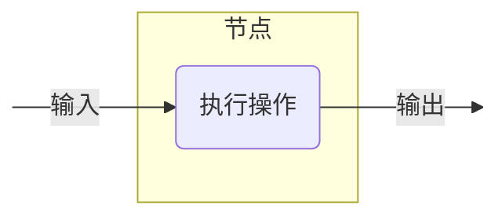

以下是如何定义一个预期字符串作为输入并返回字符串长度（整数）作为输出的节点：

<!--- INCLUDE
import ai.koog.agents.core.dsl.builder.strategy
import ai.koog.agents.core.dsl.builder.node

val strategy = strategy<String, String>("strategy_name") {
-->
<!--- SUFFIX
}
-->
```kotlin
val nodeLength by node<String, Int> { input ->
    input.length
}
```
<!--- KNIT example-nodes-and-component-01.kt -->

要了解更多信息，请参阅 [`node()`](api:agents-core::ai.koog.agents.core.dsl.builder.AIAgentSubgraphBuilderBase.node)。

## 实用节点

### nodeDoNothing

一个简单的直通节点，不执行任何操作并将输入作为输出返回。有关详情，请参阅 [API 参考](api:agents-core::ai.koog.agents.core.dsl.extension.nodeDoNothing)。

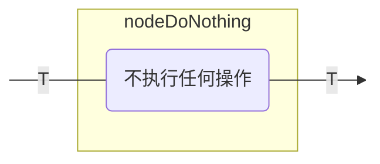

您可以将此节点用于以下目的：

- 在图表中创建占位符节点。
- 在不修改数据的情况下创建连接点。

示例如下：

<!--- INCLUDE
import ai.koog.agents.core.dsl.builder.forwardTo
import ai.koog.agents.core.dsl.builder.strategy
import ai.koog.agents.core.dsl.builder.node
import ai.koog.agents.core.dsl.extension.nodeDoNothing

val strategy = strategy<String, String>("strategy_name") {
-->
<!--- SUFFIX
}
-->
```kotlin
val passthrough by nodeDoNothing<String>("passthrough")

edge(nodeStart forwardTo passthrough)
edge(passthrough forwardTo nodeFinish)
```
<!--- KNIT example-nodes-and-component-02.kt -->

## LLM 节点

### nodeAppendPrompt

该节点使用提供的提示词构建器向 LLM 提示词添加消息。
这对于在发起实际 LLM 请求之前修改对话上下文非常有用。有关详情，请参阅 [API 参考](api:agents-core::ai.koog.agents.core.dsl.extension.nodeUpdatePrompt)。

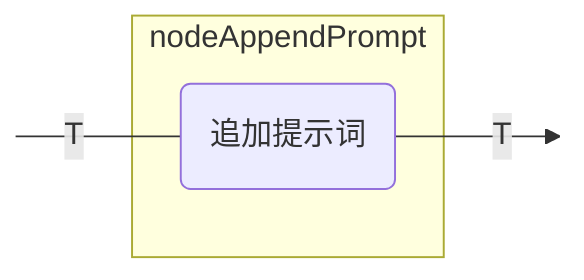

您可以将此节点用于以下目的：

- 向提示词添加系统指令。
- 在对话中插入用户消息。
- 为后续的 LLM 请求准备上下文。

示例如下：

<!--- INCLUDE
import ai.koog.agents.core.dsl.builder.forwardTo
import ai.koog.agents.core.dsl.builder.strategy
import ai.koog.agents.core.dsl.builder.node
import ai.koog.agents.core.dsl.extension.nodeAppendPrompt

typealias Input = Unit
typealias Output = Unit

val strategy = strategy<String, String>("strategy_name") {
-->
<!--- SUFFIX
}
-->
```kotlin
val firstNode by node<Input, Output> {
    // 将输入转换为输出
}

val secondNode by node<Output, Output> {
    // 将输出转换为输出
}

// 节点将从上一个节点获取 Output 类型的值作为输入，并将其透传到下一个节点
val setupContext by nodeAppendPrompt<Output>("setupContext") {
    system("You are a helpful assistant specialized in Kotlin programming.")
    user("I need help with Kotlin coroutines.")
}

edge(firstNode forwardTo setupContext)
edge(setupContext forwardTo secondNode)
```
<!--- KNIT example-nodes-and-component-03.kt -->

### nodeLLMSendMessageOnlyCallingTools

该节点将用户消息追加到 LLM 提示词，并获取一个 LLM 仅能调用工具的响应。有关详情，请参阅 [API 参考](api:agents-core::ai.koog.agents.core.dsl.extension.nodeLLMSendMessageOnlyCallingTools)。

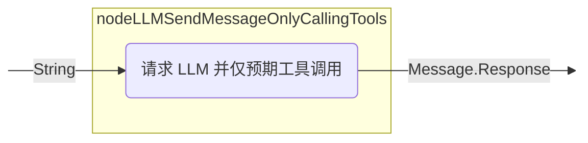

### nodeLLMSendMessageForceOneTool

该节点将用户消息追加到 LLM 提示词，并强制 LLM 使用特定工具。有关详情，请参阅 [API 参考](api:agents-core::ai.koog.agents.core.dsl.extension.nodeLLMSendMessageForceOneTool)。

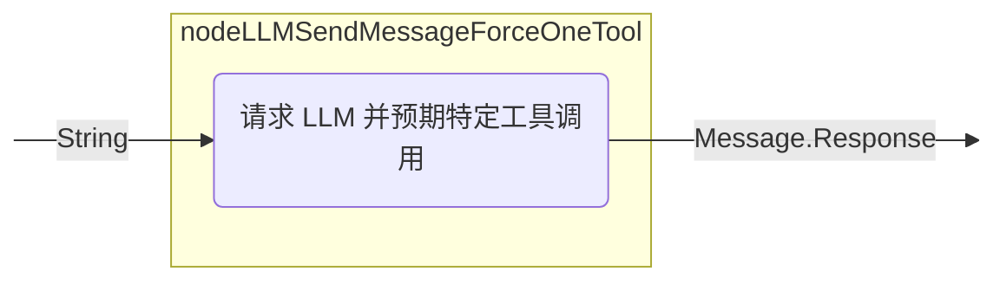

### nodeLLMRequest

该节点将用户消息追加到 LLM 提示词，并获取包含可选工具使用的响应。节点配置决定了在处理消息期间是否允许工具调用。有关详情，请参阅 [API 参考](api:agents-core::ai.koog.agents.core.dsl.extension.nodeLLMRequest)。

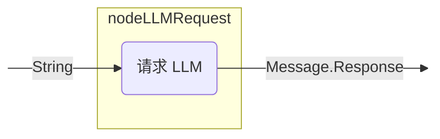

您可以将此节点用于以下目的：

- 为当前提示词生成 LLM 响应，控制是否允许 LLM 生成工具调用。

示例如下：

<!--- INCLUDE
import ai.koog.agents.core.dsl.builder.forwardTo
import ai.koog.agents.core.dsl.builder.strategy
import ai.koog.agents.core.dsl.builder.node
import ai.koog.agents.core.dsl.extension.nodeLLMRequest
import ai.koog.agents.core.dsl.extension.nodeDoNothing

val strategy = strategy<String, String>("strategy_name") {
    val getUserQuestion by nodeDoNothing<String>()
-->
<!--- SUFFIX
}
-->
```kotlin
val requestLLM by nodeLLMRequest("requestLLM", allowToolCalls = true)
edge(getUserQuestion forwardTo requestLLM)
```
<!--- KNIT example-nodes-and-component-04.kt -->

### nodeLLMRequestStructured

该节点将用户消息追加到 LLM 提示词，并请求来自 LLM 的结构化数据，具备纠错能力。有关详情，请参阅 [API 参考](api:agents-core::ai.koog.agents.core.dsl.extension.nodeLLMRequestStructured)。

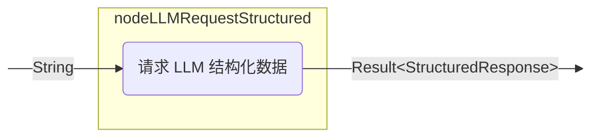

### nodeLLMRequestStreaming

该节点将用户消息追加到 LLM 提示词，并以流式传输 LLM 响应，支持或不支持流数据转换。有关详情，请参阅 [API 参考](api:agents-core::ai.koog.agents.core.dsl.extension.nodeLLMRequestStreaming)。

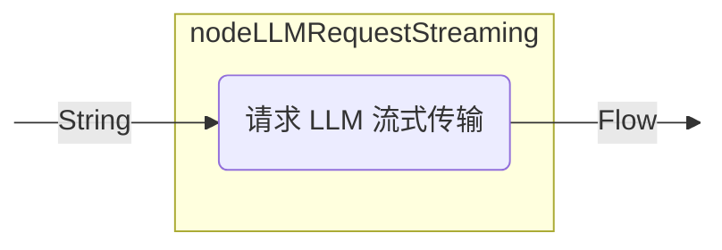

### nodeLLMRequestMultiple

该节点将用户消息追加到 LLM 提示词，并获取多个启用了工具调用的 LLM 响应。有关详情，请参阅 [API 参考](api:agents-core::ai.koog.agents.core.dsl.extension.nodeLLMRequestMultiple)。

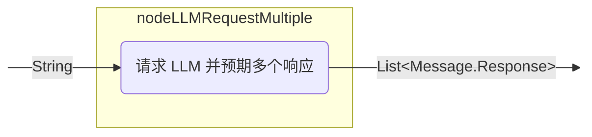

您可以将此节点用于以下目的：

- 处理需要多次工具调用的复杂查询。
- 生成多个工具调用。
- 实现需要多个并行操作的工作流。

示例如下：

<!--- INCLUDE
import ai.koog.agents.core.dsl.builder.forwardTo
import ai.koog.agents.core.dsl.builder.strategy
import ai.koog.agents.core.dsl.builder.node
import ai.koog.agents.core.dsl.extension.nodeLLMRequestMultiple
import ai.koog.agents.core.dsl.extension.nodeDoNothing

val strategy = strategy<String, String>("strategy_name") {
    val getComplexUserQuestion by nodeDoNothing<String>()
-->
<!--- SUFFIX
}
-->
```kotlin
val requestLLMMultipleTools by nodeLLMRequestMultiple()
edge(getComplexUserQuestion forwardTo requestLLMMultipleTools)
```
<!--- KNIT example-nodes-and-component-05.kt -->

### nodeLLMCompressHistory

该节点将当前的 LLM 提示词（消息历史）压缩为摘要，用简明的摘要 (TL;DR) 替换消息。有关详情，请参阅 [API 参考](api:agents-core::ai.koog.agents.core.dsl.extension.nodeLLMCompressHistory)。
这对于通过压缩历史记录以减少 token 使用量来管理长对话非常有用。

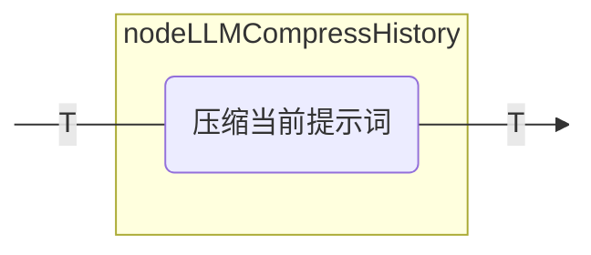

要了解有关历史记录压缩的更多信息，请参阅 [历史记录压缩](history-compression.md)。

您可以将此节点用于以下目的：

- 管理长对话以减少 token 使用量。
- 总结对话历史以维持上下文。
- 在长期运行的智能体中实现内存管理。

示例如下：

<!--- INCLUDE
import ai.koog.agents.core.dsl.builder.forwardTo
import ai.koog.agents.core.dsl.builder.strategy
import ai.koog.agents.core.dsl.builder.node
import ai.koog.agents.core.dsl.extension.nodeLLMCompressHistory
import ai.koog.agents.core.dsl.extension.nodeDoNothing
import ai.koog.agents.core.dsl.extension.HistoryCompressionStrategy

val strategy = strategy<String, String>("strategy_name") {
    val generateHugeHistory by nodeDoNothing<String>()
-->
<!--- SUFFIX
}
-->
```kotlin
val compressHistory by nodeLLMCompressHistory<String>(
    "compressHistory",
    strategy = HistoryCompressionStrategy.FromLastNMessages(10),
    preserveMemory = true
)
edge(generateHugeHistory forwardTo compressHistory)
```
<!--- KNIT example-nodes-and-component-06.kt -->

## 工具节点

### nodeExecuteTool

执行单个工具调用并返回其结果的节点。此节点用于处理 LLM 发起的工具调用。有关详情，请参阅 [API 参考](api:agents-core::ai.koog.agents.core.dsl.extension.nodeExecuteTool)。

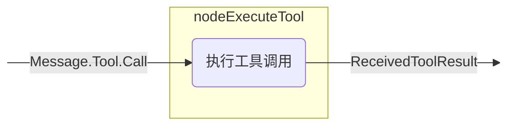

您可以将此节点用于以下目的：

- 执行 LLM 请求的工具。
- 处理响应 LLM 决策的特定操作。
- 将外部功能集成到智能体工作流中。

示例如下：

<!--- INCLUDE
import ai.koog.agents.core.dsl.builder.forwardTo
import ai.koog.agents.core.dsl.builder.strategy
import ai.koog.agents.core.dsl.builder.node
import ai.koog.agents.core.dsl.extension.nodeExecuteTool
import ai.koog.agents.core.dsl.extension.nodeLLMRequest
import ai.koog.agents.core.dsl.extension.onToolCall

val strategy = strategy<String, String>("strategy_name") {
-->
<!--- SUFFIX
}
-->
```kotlin
val requestLLM by nodeLLMRequest()
val executeTool by nodeExecuteTool()
edge(requestLLM forwardTo executeTool onToolCall { true })
```
<!--- KNIT example-nodes-and-component-07.kt -->

### nodeLLMSendToolResult

该节点将工具结果添加到提示词并请求 LLM 响应。有关详情，请参阅 [API 参考](api:agents-core::ai.koog.agents.core.dsl.extension.nodeLLMSendToolResult)。

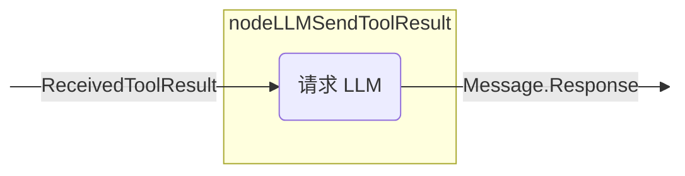

您可以将此节点用于以下目的：

- 处理工具执行的结果。
- 根据工具输出生成响应。
- 在工具执行后继续对话。

示例如下：

<!--- INCLUDE
import ai.koog.agents.core.dsl.builder.forwardTo
import ai.koog.agents.core.dsl.builder.strategy
import ai.koog.agents.core.dsl.builder.node
import ai.koog.agents.core.dsl.extension.nodeExecuteTool
import ai.koog.agents.core.dsl.extension.nodeLLMSendToolResult

val strategy = strategy<String, String>("strategy_name") {
-->
<!--- SUFFIX
}
-->
```kotlin
val executeTool by nodeExecuteTool()
val sendToolResultToLLM by nodeLLMSendToolResult()
edge(executeTool forwardTo sendToolResultToLLM)
```
<!--- KNIT example-nodes-and-component-08.kt -->

### nodeExecuteMultipleTools

用于执行多个工具调用的节点。这些调用可以选择并行执行。有关详情，请参阅 [API 参考](api:agents-core::ai.koog.agents.core.dsl.extension.nodeExecuteMultipleTools)。

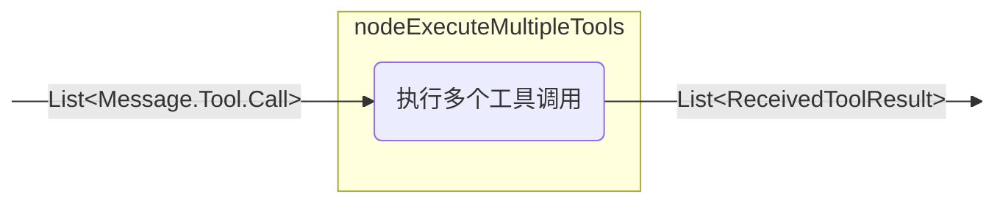

您可以将此节点用于以下目的：

- 并行执行多个工具。
- 处理需要多次工具执行的复杂工作流。
- 通过批量处理工具调用来优化性能。

示例如下：

<!--- INCLUDE
import ai.koog.agents.core.dsl.builder.forwardTo
import ai.koog.agents.core.dsl.builder.strategy
import ai.koog.agents.core.dsl.builder.node
import ai.koog.agents.core.dsl.extension.nodeLLMRequestMultiple
import ai.koog.agents.core.dsl.extension.nodeExecuteMultipleTools
import ai.koog.agents.core.dsl.extension.onMultipleToolCalls

val strategy = strategy<String, String>("strategy_name") {
-->
<!--- SUFFIX
}
-->
```kotlin
val requestLLMMultipleTools by nodeLLMRequestMultiple()
val executeMultipleTools by nodeExecuteMultipleTools()
edge(requestLLMMultipleTools forwardTo executeMultipleTools onMultipleToolCalls { true })
```
<!--- KNIT example-nodes-and-component-09.kt -->

### nodeLLMSendMultipleToolResults

该节点将多个工具结果添加到提示词并获取多个 LLM 响应。有关详情，请参阅 [API 参考](api:agents-core::ai.koog.agents.core.dsl.extension.nodeLLMSendMultipleToolResults)。

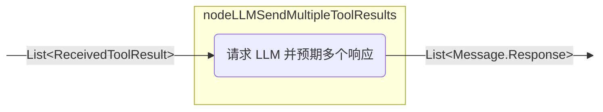

您可以将此节点用于以下目的：

- 处理多个工具执行的结果。
- 生成多个工具调用。
- 实现具有多个并行操作的复杂工作流。

示例如下：

<!--- INCLUDE
import ai.koog.agents.core.dsl.builder.forwardTo
import ai.koog.agents.core.dsl.builder.strategy
import ai.koog.agents.core.dsl.builder.node
import ai.koog.agents.core.dsl.extension.nodeLLMSendMultipleToolResults
import ai.koog.agents.core.dsl.extension.nodeExecuteMultipleTools

val strategy = strategy<String, String>("strategy_name") {
-->
<!--- SUFFIX
}
-->
```kotlin
val executeMultipleTools by nodeExecuteMultipleTools()
val sendMultipleToolResultsToLLM by nodeLLMSendMultipleToolResults()
edge(executeMultipleTools forwardTo sendMultipleToolResultsToLLM)
```
<!--- KNIT example-nodes-and-component-10.kt -->

## 节点输出转换

框架提供了 `transform` 扩展函数，允许您创建节点的转换版本，对其输出应用转换。当您需要将节点的输出转换为不同的类型或格式，同时保留原始节点的功能时，这非常有用。

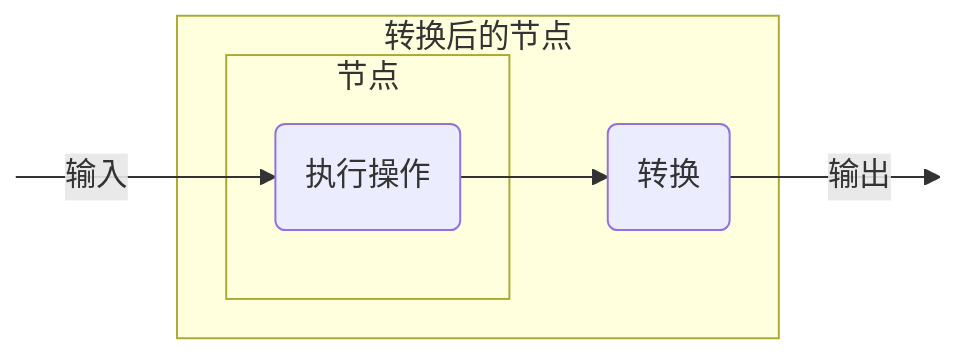

### transform

[`transform()`](api:agents-core::ai.koog.agents.core.dsl.builder.AIAgentNodeDelegate.transform) 函数创建一个新的 `AIAgentNodeDelegate`，它包装原始节点并对其输出应用转换函数。

<!--- INCLUDE
/**
-->
<!--- SUFFIX
**/
-->
```kotlin
inline fun <reified T> AIAgentNodeDelegate<Input, Output>.transform(
    noinline transformation: suspend (Output) -> T
): AIAgentNodeDelegate<Input, T>
```
<!--- KNIT example-nodes-and-component-11.kt -->

#### 自定义节点转换

将自定义节点的输出转换为不同的数据类型：

<!--- INCLUDE
import ai.koog.agents.core.dsl.builder.forwardTo
import ai.koog.agents.core.dsl.builder.strategy
import ai.koog.agents.core.dsl.builder.node
import ai.koog.agents.core.dsl.extension.nodeDoNothing

val strategy = strategy<String, Int>("strategy_name") {
-->
<!--- SUFFIX
}
-->
```kotlin
val textNode by nodeDoNothing<String>("textNode").transform<Int> { text ->
    text.split(" ").filter { it.isNotBlank() }.size
}

edge(nodeStart forwardTo textNode)
edge(textNode forwardTo nodeFinish)
```
<!--- KNIT example-nodes-and-component-12.kt -->

#### 内置节点转换

转换内置节点（如 `nodeLLMRequest`）的输出：

<!--- INCLUDE
import ai.koog.agents.core.dsl.builder.forwardTo
import ai.koog.agents.core.dsl.builder.strategy
import ai.koog.agents.core.dsl.builder.node
import ai.koog.agents.core.dsl.extension.nodeLLMRequest

val strategy = strategy<String, Int>("strategy_name") {
-->
<!--- SUFFIX
}
-->
```kotlin
val lengthNode by nodeLLMRequest("llmRequest").transform<Int> { assistantMessage ->
    assistantMessage.content.length
}

edge(nodeStart forwardTo lengthNode)
edge(lengthNode forwardTo nodeFinish)
```
<!--- KNIT example-nodes-and-component-13.kt -->

## 预定义子图

框架提供了封装常用模式和工作流的预定义子图。这些子图通过自动处理基础节点和边的创建，简化了复杂智能体策略的开发。

通过使用预定义子图，您可以实现各种流行流水线。示例如下：

1. 准备数据。
2. 运行任务。
3. 验证任务结果。如果结果不正确，则带着反馈消息返回第 2 步进行调整。

### subgraphWithTask

一个使用提供的工具执行特定任务并返回结构化结果的子图。它支持多响应 LLM 交互（助手可能会产生多个穿插有工具调用的响应），并允许您控制工具调用的执行方式。有关详情，请参阅 [API 参考](api:agents-ext::ai.koog.agents.ext.agent.subgraphWithTask)。

您可以将此子图用于以下目的：

- 创建在较大工作流中处理特定任务的特殊组件。
- 封装具有清晰输入和输出接口的复杂逻辑。
- 配置任务特定的工具、模型和提示词。
- 管理具有自动压缩功能的对话历史。
- 开发结构化智能体工作流和任务执行流水线。
- 从 LLM 任务执行中生成结构化结果，包括具有多个助手响应和工具调用的流。

该 API 允许您使用可选参数微调执行：

- runMode：控制任务期间工具调用的执行方式（默认为顺序执行）。在底层模型/执行器支持时，使用此参数在不同的工具执行策略之间切换。
- assistantResponseRepeatMax：限制在得出任务无法完成的结论之前允许多少次助手响应（如果未提供，则默认为安全内部限制）。

您可以以文本形式向子图提供任务，根据需要配置 LLM 并提供必要的工具，子图将处理并解决任务。示例如下：

<!--- INCLUDE
import ai.koog.agents.core.dsl.builder.strategy
import ai.koog.agents.core.dsl.builder.node
import ai.koog.agents.ext.tool.SayToUser
import ai.koog.prompt.executor.clients.openai.OpenAIModels
import ai.koog.agents.ext.agent.subgraphWithTask
import ai.koog.agents.core.agent.ToolCalls

val searchTool = SayToUser
val calculatorTool = SayToUser
val weatherTool = SayToUser

val strategy = strategy<String, String>("strategy_name") {
-->
<!--- SUFFIX
}
-->
```kotlin
val processQuery by subgraphWithTask<String, String>(
    tools = listOf(searchTool, calculatorTool, weatherTool),
    llmModel = OpenAIModels.Chat.GPT4o,
    runMode = ToolCalls.SEQUENTIAL,
    assistantResponseRepeatMax = 3,
) { userQuery ->
    """
    You are a helpful assistant that can answer questions about various topics.
    Please help with the following query:
    $userQuery
    """
}
```
<!--- KNIT example-nodes-and-component-14.kt -->

### subgraphWithVerification

`subgraphWithTask` 的特殊版本，用于验证任务是否执行正确，并提供遇到的任何问题的详细信息。此子图对于需要验证或质量检查的工作流非常有用。有关详情，请参阅 [API 参考](api:agents-ext::ai.koog.agents.ext.agent.subgraphWithVerification)。

您可以将此子图用于以下目的：

- 验证任务执行的正确性。
- 在工作流中实现质量控制流程。
- 创建自我验证组件。
- 生成具有成功/失败状态和详细反馈的结构化验证结果。

该子图确保 LLM 在工作流结束时调用验证工具，以检查任务是否成功完成。它保证验证作为最后一步执行，并返回 `CriticResult`，指示任务是否成功完成并提供详细反馈。
示例如下：

<!--- INCLUDE
import ai.koog.agents.core.dsl.builder.strategy
import ai.koog.agents.core.dsl.builder.node
import ai.koog.agents.ext.tool.SayToUser
import ai.koog.prompt.executor.clients.anthropic.AnthropicModels
import ai.koog.agents.ext.agent.subgraphWithVerification
import ai.koog.agents.core.agent.ToolCalls

val runTestsTool = SayToUser
val analyzeTool = SayToUser
val readFileTool = SayToUser

val strategy = strategy<String, String>("strategy_name") {
-->
<!--- SUFFIX
}
-->
```kotlin
val verifyCode by subgraphWithVerification<String>(
    tools = listOf(runTestsTool, analyzeTool, readFileTool),
    llmModel = AnthropicModels.Opus_4_6,
    runMode = ToolCalls.SEQUENTIAL,
    assistantResponseRepeatMax = 3,
) { codeToVerify ->
    """
    You are a code reviewer. Please verify that the following code meets all requirements:
    1. It compiles without errors
    2. All tests pass
    3. It follows the project's coding standards

    Code to verify:
    $codeToVerify
    """
}
```
<!--- KNIT example-nodes-and-component-15.kt -->

## 预定义策略与常用策略模式

框架提供了结合各种节点的预定义策略。
这些节点使用边连接以定义操作流，并带有指定何时遵循每条边的条件。

如果需要，您可以将这些策略集成到您的智能体工作流中。

### 单次运行策略

单次运行策略专为非交互式用例设计，智能体处理一次输入并返回结果。

当您需要运行不需要复杂逻辑的简单流程时，可以使用此策略。

<!--- INCLUDE
import ai.koog.agents.core.agent.entity.AIAgentGraphStrategy
import ai.koog.agents.core.dsl.builder.forwardTo
import ai.koog.agents.core.dsl.builder.strategy
import ai.koog.agents.core.dsl.builder.node
import ai.koog.agents.core.dsl.extension.*

-->
```kotlin

public fun singleRunStrategy(): AIAgentGraphStrategy<String, String> = strategy("single_run") {
    val nodeCallLLM by nodeLLMRequest("sendInput")
    val nodeExecuteTool by nodeExecuteTool("nodeExecuteTool")
    val nodeSendToolResult by nodeLLMSendToolResult("nodeSendToolResult")

    edge(nodeStart forwardTo nodeCallLLM)
    edge(nodeCallLLM forwardTo nodeExecuteTool onToolCall { true })
    edge(nodeCallLLM forwardTo nodeFinish onAssistantMessage { true })
    edge(nodeExecuteTool forwardTo nodeSendToolResult)
    edge(nodeSendToolResult forwardTo nodeFinish onAssistantMessage { true })
    edge(nodeSendToolResult forwardTo nodeExecuteTool onToolCall { true })
}
```
<!--- KNIT example-nodes-and-component-16.kt -->

### 基于工具的策略

基于工具的策略专为严重依赖工具来执行特定操作的工作流而设计。
它通常根据 LLM 的决策执行工具并处理结果。

<!--- INCLUDE
import ai.koog.agents.core.agent.entity.AIAgentGraphStrategy
import ai.koog.agents.core.dsl.builder.forwardTo
import ai.koog.agents.core.dsl.builder.strategy
import ai.koog.agents.core.dsl.builder.node
import ai.koog.agents.core.dsl.extension.*
import ai.koog.agents.core.tools.ToolRegistry

-->
```kotlin
fun toolBasedStrategy(name: String, toolRegistry: ToolRegistry): AIAgentGraphStrategy<String, String> {
    return strategy(name) {
        val nodeSendInput by nodeLLMRequest()
        val nodeExecuteTool by nodeExecuteTool()
        val nodeSendToolResult by nodeLLMSendToolResult()

        // 定义智能体的流
        edge(nodeStart forwardTo nodeSendInput)

        // 如果 LLM 响应消息，则结束
        edge(
            (nodeSendInput forwardTo nodeFinish)
                    onAssistantMessage { true }
        )

        // 如果 LLM 调用工具，则执行它
        edge(
            (nodeSendInput forwardTo nodeExecuteTool)
                    onToolCall { true }
        )

        // 将工具结果发送回 LLM
        edge(nodeExecuteTool forwardTo nodeSendToolResult)

        // 如果 LLM 调用另一个工具，则执行它
        edge(
            (nodeSendToolResult forwardTo nodeExecuteTool)
                    onToolCall { true }
        )

        // 如果 LLM 响应消息，则结束
        edge(
            (nodeSendToolResult forwardTo nodeFinish)
                    onAssistantMessage { true }
        )
    }
}
```
<!--- KNIT example-nodes-and-component-17.kt -->

### 数据流策略

数据流策略专为处理来自 LLM 的流式数据而设计。它通常请求流式数据，对其进行处理，并可能使用处理后的数据调用工具。

<!--- INCLUDE
import ai.koog.agents.core.dsl.builder.forwardTo
import ai.koog.agents.core.dsl.builder.strategy
import ai.koog.agents.core.dsl.builder.node
import ai.koog.agents.example.exampleStreamingApi03.Book
import ai.koog.agents.example.exampleStreamingApi04.markdownBookDefinition
import ai.koog.agents.example.exampleStreamingApi06.parseMarkdownStreamToBooks
-->
```kotlin
val agentStrategy = strategy<String, List<Book>>("library-assistant") {
    // 描述包含输出流解析的节点
    val getMdOutput by node<String, List<Book>> { booksDescription ->
        val books = mutableListOf<Book>()
        val mdDefinition = markdownBookDefinition()

        llm.writeSession { 
            appendPrompt { user(booksDescription) }
            // 以定义 `mdDefinition` 的形式启动响应流
            val markdownStream = requestLLMStreaming(mdDefinition)
            // 调用解析器处理响应流的结果并对结果执行操作
            parseMarkdownStreamToBooks(markdownStream).collect { book ->
                books.add(book)
                println("Parsed Book: ${book.title} by ${book.author}")
            }
        }

        books
    }
    // 描述智能体的图，确保节点可访问
    edge(nodeStart forwardTo getMdOutput)
    edge(getMdOutput forwardTo nodeFinish)
}
```
<!--- KNIT example-nodes-and-component-18.kt -->