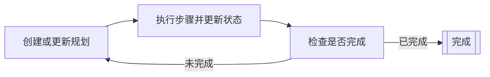

# 规划器 Agent

规划器 Agent 是一类可以通过迭代规划周期来规划和执行多步任务的 AI Agent。
它们会持续构建或更新规划、执行步骤，并根据当前状态检查完成标准。

规划器 Agent 适用于复杂的任务，
这些任务需要将高层目标分解为较小的、可操作的步骤，
并根据每一步的结果调整规划。

规划器 Agent 通过迭代规划周期运行：

1. 规划器根据当前状态创建或更新规划。
2. 规划器执行规划中的单个步骤，并更新状态。
3. 规划器根据当前状态确定规划是否已完成。
    - 如果规划已完成，循环结束。
    - 如果规划未完成，循环从第一步重新开始。



## 前提条件

在开始之前，请确保你具备以下条件：

- 一个可以运行的 Kotlin/JVM 项目。
- 已安装 Java 17+。
- 来自你用于实现 AI Agent 的 LLM 提供者的有效 API 密钥。有关所有可用提供者的列表，
请参阅 [LLM 提供者](llm-providers.md)。

!!! tip
    使用环境变量或安全的配置管理系统来存储你的 API 密钥。
    避免在源代码中直接硬编码 API 密钥。

## 添加依赖项

要使用规划器 Agent，请在你的构建配置中包含以下依赖项：

```
dependencies {
    implementation("ai.koog:koog-agents:VERSION")
}
```

有关所有可用的安装方法，请参阅[安装 Koog](getting-started.md#install-koog)。

## 基于 LLM 的简单规划器

基于 LLM 的简单规划器使用 LLM 来生成和评估规划。
它们在基于字符串的状态上运行，并通过 LLM 请求执行步骤。
基于字符串的状态意味着 Agent 状态被记录为单个字符串，
其中 Agent 接受一个初始状态字符串并返回最终状态字符串作为结果。

Koog 提供了两种简单的规划器：

- [SimpleLLMPlanner](https://api.koog.ai/agents/agents-core/ai.koog.agents.planner.llm/-simple-l-l-m-planner/index.html)
    仅在最开始生成一次规划，然后遵循该规划直至完成。
    要包含重新规划功能，请扩展 `SimpleLLMPlanner` 并重写 `assessPlan` 方法，
    以指示 Agent 何时应重新规划。
- [SimpleLLMWithCriticPlanner](https://api.koog.ai/agents/agents-core/ai.koog.agents.planner.llm/-simple-l-l-m-with-critic-planner/index.html)
    实现了使用 LLM 的 `assessPlan` 方法。
    该方法通过 LLM 请求检查规划的有效性，并评估 Agent 是否应该重新规划。

以下示例展示了如何使用 `SimpleLLMPlanner` 创建一个简单的规划器 Agent：

<!--- INCLUDE
import ai.koog.agents.core.agent.config.AIAgentConfig
import ai.koog.agents.planner.AIAgentPlannerStrategy
import ai.koog.agents.planner.PlannerAIAgent
import ai.koog.agents.planner.llm.SimpleLLMPlanner
import ai.koog.prompt.dsl.prompt
import ai.koog.prompt.executor.clients.openai.OpenAIModels
import ai.koog.prompt.executor.llms.all.simpleOpenAIExecutor
import kotlinx.coroutines.runBlocking
-->
```kotlin
// Create the planner
val planner = SimpleLLMPlanner()

// Wrap it in a planner strategy
val strategy = AIAgentPlannerStrategy(
    name = "simple-planner",
    planner = planner
)

// Configure the agent
val agentConfig = AIAgentConfig(
    prompt = prompt("planner") {
        system("You are a helpful planning assistant.")
    },
    model = OpenAIModels.Chat.GPT4o,
    maxAgentIterations = 50
)

// Create the planner agent
val agent = PlannerAIAgent(
    promptExecutor = simpleOpenAIExecutor(System.getenv("OPENAI_API_KEY")),
    strategy = strategy,
    agentConfig = agentConfig
)

suspend fun main() {
    // Run the agent with a task
    val result = agent.run("Create a plan to organize a team meeting")
    println(result)
}
```
<!--- KNIT example-planner-01.kt -->

## GOAP (目标导向型行动规划)

GOAP 是一种算法规划方法，它使用 [A* 搜索](https://en.wikipedia.org/wiki/A*_search_algorithm) 来寻找最优操作序列。
GOAP Agent 并不使用 LLM 来生成规划，
而是根据预定义的终端目标和操作自动发现操作序列。
在 Koog 中，GOAP 通过 DSL 实现，让你可以声明式地定义终端目标和操作。

GOAP 规划器涉及三个主要概念：

- **状态 (State)**：代表世界的当前状态。
- **操作 (Actions)**：定义可以执行的内容，包括前置条件、效果（信念）、开销和执行逻辑。
- **终端目标 (Goals)**：定义目标条件、启发式开销和价值函数。

GOAP 规划器使用 A* 搜索来寻找既能满足终端目标条件又能使总开销最小的操作序列。

要创建 GOAP Agent，你需要：

1. 将状态定义为一个数据类，其属性代表与你的终端目标相关的各个方面。
2. 使用 [goap()](https://api.koog.ai/agents/agents-core/ai.koog.agents.planner.goap/goap.html) 函数创建一个 [GOAPPlanner](https://api.koog.ai/agents/agents-core/ai.koog.agents.planner.goap/-g-o-a-p-planner/index.html) 实例。
    1. 使用 [action()](https://api.koog.ai/agents/agents-core/ai.koog.agents.planner.goap/-g-o-a-p-planner-builder/action.html) 函数定义带有前置条件和信念的操作。
    2. 使用 [goal()](https://api.koog.ai/agents/agents-core/ai.koog.agents.planner.goap/-g-o-a-p-planner-builder/goal.html) 函数定义带有完成条件的终端目标。
3. 使用 [AIAgentPlannerStrategy](https://api.koog.ai/agents/agents-core/ai.koog.agents.planner/-a-i-agent-planner-strategy/index.html) 包装该规划器，并将其传递给 [PlannerAIAgent](https://api.koog.ai/agents/agents-core/ai.koog.agents.planner/-planner-a-i-agent/index.html) 构造函数。

!!! note

    规划器选择单个操作及其序列。
    每个操作都包含一个必须为真才能执行该操作的前置条件，
    以及一个定义预测结果的信念。
    有关信念的更多信息，请参阅[状态信念与实际执行的比较](#状态信念与实际执行的比较)。

在以下示例中，GOAP 处理创建文章的高层规划（大纲 → 草稿 → 审查 → 发布），
而 LLM 则在每个操作中执行实际的内容生成。

<!--- INCLUDE
import ai.koog.agents.core.agent.AIAgent
import ai.koog.agents.core.agent.config.AIAgentConfig
import ai.koog.agents.planner.AIAgentPlannerStrategy
import ai.koog.agents.planner.goap.GoapAgentState
import ai.koog.prompt.dsl.prompt
import ai.koog.prompt.executor.clients.openai.OpenAIModels
import ai.koog.prompt.executor.llms.all.simpleOpenAIExecutor
-->
```kotlin
// Define a state for content creation
data class ContentState(
    val topic: String,
    val hasOutline: Boolean = false,
    val outline: String = "",
    val hasDraft: Boolean = false,
    val draft: String = "",
    val hasReview: Boolean = false,
    val isPublished: Boolean = false
) : GoapAgentState<String, String>(topic) {
    // output of the agent:
    override fun provideOutput(): String = draft
}

// Create and run the agent
val agentConfig = AIAgentConfig(
    prompt = prompt("writer") {
        system("You are a professional content writer.")
    },
    model = OpenAIModels.Chat.GPT4o,
    maxAgentIterations = 20
)

// Create GOAP planner strategy with LLM-powered actions
val plannerStrategy = AIAgentPlannerStrategy.goap("content-planner", ::ContentState) {
    // Define actions with preconditions and beliefs
    action(
        name = "Create outline",
        precondition = { state -> !state.hasOutline },
        belief = { state -> state.copy(hasOutline = true, outline = "Outline") },
        cost = { 1.0 }
    ) { ctx, state ->
        // Use LLM to create the outline
        val response = ctx.llm.writeSession {
            appendPrompt {
                user("Create a detailed outline for an article about: ${state.topic}")
            }
            requestLLM()
        }
        state.copy(hasOutline = true, outline = response.content)
    }

    action(
        name = "Write draft",
        precondition = { state -> state.hasOutline && !state.hasDraft },
        belief = { state -> state.copy(hasDraft = true, draft = "Draft") },
        cost = { 2.0 }
    ) { ctx, state ->
        // Use LLM to write the draft
        val response = ctx.llm.writeSession {
            appendPrompt {
                user("Write an article based on this outline:
${state.outline}")
            }
            requestLLM()
        }
        state.copy(hasDraft = true, draft = response.content)
    }

    action(
        name = "Review content",
        precondition = { state -> state.hasDraft && !state.hasReview },
        belief = { state -> state.copy(hasReview = true) },
        cost = { 1.0 }
    ) { ctx, state ->
        // Use LLM to review the draft
        val response = ctx.llm.writeSession {
            appendPrompt {
                user("Review this article and suggest improvements:
${state.draft}")
            }
            requestLLM()
        }
        println("Review feedback: ${response.content}")
        state.copy(hasReview = true)
    }

    action(
        name = "Publish",
        precondition = { state -> state.hasReview && !state.isPublished },
        belief = { state -> state.copy(isPublished = true) },
        cost = { 1.0 }
    ) { ctx, state ->
        println("Publishing article...")
        state.copy(isPublished = true)
    }

    // Define the goal with a completion condition
    goal(
        name = "Published article",
        description = "Complete and publish the article",
        condition = { state -> state.isPublished }
    )
}

val agent = AIAgent(
    promptExecutor = simpleOpenAIExecutor(System.getenv("OPENAI_API_KEY")),
    strategy = plannerStrategy,
    agentConfig = agentConfig
)

suspend fun main() {
    val result = agent.run("The Future of AI in Software Development")
    println("Final draft: $result")
}
```
<!--- KNIT example-planner-02.kt -->

## 高级 GOAP 功能

### 自定义开销函数

由于 A* 搜索将开销作为寻找最优操作序列的一个因素，
你可以为操作和终端目标定义自定义开销函数来引导规划器：

```kotlin
action(
    name = "Expensive operation",
    precondition = { true },
    belief = { state -> state.copy(operationDone = true) },
    cost = { state ->
        // Dynamic cost based on state
        if (state.hasOptimization) 1.0 else 10.0
    }
) { ctx, state ->
    // Execute action
    state.copy(operationDone = true)
}
```

### 状态信念与实际执行的比较

GOAP 区分了信念（乐观预测）和实际执行这两个概念：

- **信念 (Belief)**：规划器认为会发生的事情，用于规划。
- **执行 (Execution)**：实际发生的情况，用于真实的状态更新。

这使得规划器能够根据预期结果制定规划，同时妥善处理实际结果：

```kotlin
action(
    name = "Attempt complex task",
    precondition = { state -> !state.taskComplete },
    belief = { state ->
        // Optimistic belief: task will succeed
        state.copy(taskComplete = true)
    },
    cost = { 5.0 }
) { ctx, state ->
    // Actual execution might fail or have different results
    val success = performComplexTask()
    state.copy(
        taskComplete = success,
        attempts = state.attempts + 1
    )
}