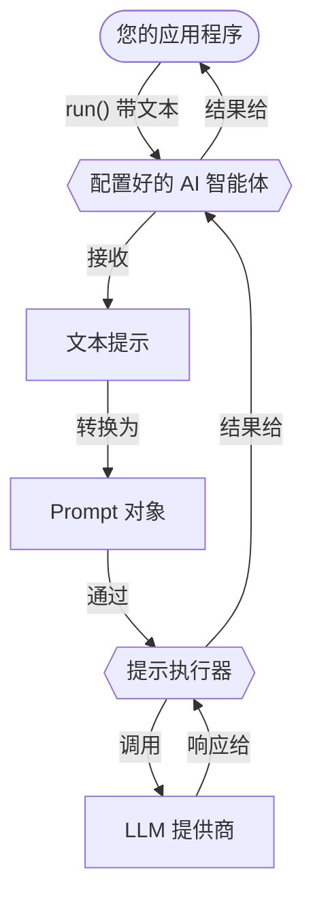

# 提示

提示是大语言模型 (LLM) 的指令，用于指导它们生成响应。它们定义了您与 LLM 交互的内容和结构。本节介绍如何使用 Koog 创建和运行提示。

## 创建提示

在 Koog 中，提示是 [**Prompt**](https://api.koog.ai/prompt/prompt-model/ai.koog.prompt.dsl/-prompt/index.html) 数据类的实例，具有以下属性：

-   `id`：提示的唯一标识符。
-   `messages`：表示与 LLM 对话的消息 list。
-   `params`：可选的 [LLM 配置参数](prompt-creation/index.md#prompt-parameters)（例如 `temperature`、`tool choice` 及其他）。

虽然您可以直接实例化 `Prompt` 类，但推荐的创建提示方式是使用 [Kotlin DSL](prompt-creation/index.md)，它提供了一种结构化的方式来定义对话。

<!--- INCLUDE
import ai.koog.prompt.dsl.prompt
-->
```kotlin
val myPrompt = prompt("hello-koog") {
    system("You are a helpful assistant.")
    user("What is Koog?")
}
```
<!--- KNIT example-prompts-01.kt -->

!!! note
    AI 智能体可以接受简单的文本提示作为输入。它们会自动将文本提示转换为 Prompt 对象并发送给 LLM 执行。这对于只需要运行单个请求且不需要复杂对话逻辑的[基本智能体](../basic-agents.md)非常有用。

## 运行提示

Koog 提供了两个抽象层级，用于针对 LLM 运行提示：LLM 客户端和提示执行器。它们都接受 Prompt 对象，可用于直接提示执行，无需 AI 智能体。客户端和执行器的执行流程是相同的：


<div class="grid cards" markdown>

-   :material-arrow-right-bold:{ .lg .middle } [**LLM 客户端**](llm-clients.md)

    ---

    用于与特定 LLM 提供商直接交互的低级接口。当您使用单个提供商且不需要高级生命周期管理时使用。

-   :material-swap-horizontal:{ .lg .middle } [**提示执行器**](prompt-executors.md)

    ---

    管理一个或多个 LLM 客户端生命周期的高级抽象。当您需要统一 API 以跨多个提供商运行提示，并支持它们之间的动态切换和回退时使用。

</div>

## 优化性能和处理故障

Koog 允许您在运行提示时优化性能并处理故障。

<div class="grid cards" markdown>

-   :material-cached:{ .lg .middle } [**LLM 响应缓存**](llm-response-caching.md)

    ---

    缓存 LLM 响应以优化性能并降低重复请求的成本。

-   :material-shield-check:{ .lg .middle } [**处理故障**](handling-failures.md)

    ---

    在您的应用程序中使用内置重试、超时和其他错误处理机制。

</div>

## AI 智能体中的提示

在 Koog 中，AI 智能体在其生命周期内维护和管理提示。虽然 LLM 客户端或执行器用于运行提示，但智能体处理提示更新的流程，确保对话历史保持相关性和一致性。

智能体中的提示生命周期通常包括几个阶段：

1.  初始提示设置。
2.  自动提示更新。
3.  上下文窗口管理。
4.  手动提示管理。

### 初始提示设置

当您[初始化智能体](../getting-started/#create-and-run-an-agent)时，您会定义一个[系统消息](prompt-creation/index.md#system-message)，用于设置智能体的行为。然后，当您调用智能体的 `run()` 方法时，您通常会提供一个初始的[用户消息](prompt-creation/index.md#user-messages)作为输入。这些消息共同构成了智能体的初始提示。例如：

<!--- INCLUDE
import ai.koog.agents.core.agent.AIAgent
import ai.koog.prompt.executor.clients.openai.OpenAIModels
import ai.koog.prompt.executor.llms.all.simpleOpenAIExecutor
import kotlinx.coroutines.runBlocking

val apiKey = System.getenv("OPENAI_API_KEY")

fun main() = runBlocking {
-->
<!--- SUFFIX
}
-->
```kotlin
// Create an agent
val agent = AIAgent(
    promptExecutor = simpleOpenAIExecutor(apiKey),
    systemPrompt = "You are a helpful assistant.",
    llmModel = OpenAIModels.Chat.GPT4o
)

// Run the agent
val result = agent.run("What is Koog?")
```
<!--- KNIT example-prompts-02.kt -->

在该示例中，智能体自动将文本提示转换为 Prompt 对象并将其发送给提示执行器：



对于更[高级的配置](../complex-workflow-agents.md#4-configure-the-agent)，您还可以使用 [AIAgentConfig](https://api.koog.ai/agents/agents-core/ai.koog.agents.core.agent.config/-a-i-agent-config/index.html) 来定义智能体的初始提示。

### 自动提示更新

当智能体运行其策略时，[预定义节点](../nodes-and-components.md)会自动更新提示。例如：

-   [`nodeLLMRequest`](../nodes-and-components/#nodellmrequest)：向提示追加用户消息并捕获 LLM 响应。
-   [`nodeLLMSendToolResult`](../nodes-and-components/#nodellmsendtoolresult)：向对话追加工具执行结果。
-   [`nodeAppendPrompt`](../nodes-and-components/#nodeappendprompt)：在工作流的任何时刻向提示插入特定消息。

### 上下文窗口管理

为避免在长时间运行的交互中超出 LLM 上下文窗口，智能体可以使用[历史压缩](../history-compression.md)特性。

### 手动提示管理

对于复杂的工作流，您可以使用 [LLM 会话](../sessions.md)手动管理提示。在智能体策略或自定义节点中，您可以使用 `llm.writeSession` 来访问和更改 `Prompt` 对象。这使您可以根据需要添加、删除或重新排序消息。