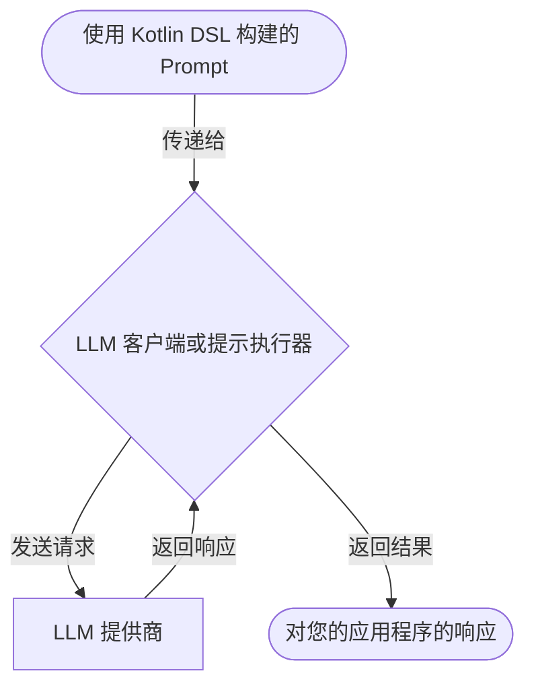
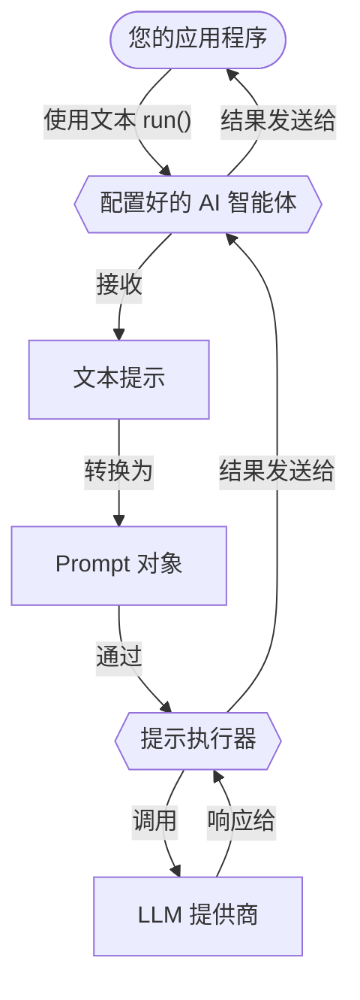

# 提示

提示是大语言模型 (LLM) 的指令，用于指导它们生成响应。它们定义了您与 LLM 交互的内容和结构。本节介绍如何使用 Koog 创建和运行提示。

## 创建提示

在 Koog 中，所有提示都表示为 [**Prompt**](https://api.koog.ai/prompt/prompt-model/ai.koog.prompt.dsl/-prompt/index.html) 对象。一个 Prompt 对象包含：

-   **ID**：提示的唯一标识符。
-   **Messages**：表示与 LLM 对话的消息 list。
-   **Parameters**：可选的 [LLM 配置参数](https://api.koog.ai/prompt/prompt-model/ai.koog.prompt.params/-l-l-m-params/index.html)（例如 `temperature`、`tool choice` 等）。

所有 Prompt 对象都是使用 Kotlin DSL 定义的结构化提示，让您可以指定对话的结构。

!!! note
    AI 智能体允许您提供一个简单的文本提示，而不是创建一个 Prompt 对象。它们会自动将文本提示转换为 Prompt 对象并发送给 LLM 执行。这对于只需要运行单个请求的[基本智能体](basic-agents.md)非常有用。

<div class="grid cards" markdown>

-   :material-code-braces:{ .lg .middle } [**结构化提示**](structured-prompts.md)

    ---

    为复杂的多次轮对话创建类型安全的结构化提示。

-   :material-multimedia:{ .lg .middle } [**多模态输入**](multimodal-inputs.md)

    ---

    在结构化提示中，除了文本，还可以发送图像、音频、视频和文档。

</div>

## 运行提示

Koog 提供了两个抽象层级，用于针对 LLM 运行提示：LLM 客户端和提示执行器。它们只接受 Prompt 对象，可用于直接提示执行，无需 AI 智能体。客户端和执行器的执行流程是相同的：



<div class="grid cards" markdown>

-   :material-arrow-right-bold:{ .lg .middle } [**LLM 客户端**](llm-clients.md)

    ---

    用于与特定 LLM 提供商直接交互的低级接口。当您使用单个提供商且不需要高级生命周期管理时使用。

-   :material-swap-horizontal:{ .lg .middle } [**提示执行器**](prompt-executors.md)

    ---

    管理一个或多个 LLM 客户端生命周期的高级抽象。当您需要统一 API 以跨多个提供商运行提示，并支持它们之间的动态切换和回退时使用。

</div>

如果您想运行一个简单的文本提示，可以使用 Kotlin DSL 将其封装在 Prompt 对象中，或者使用 AI 智能体，它会自动为您完成此操作。以下是智能体的执行流程：



<!--- INCLUDE
import ai.koog.agents.core.agent.AIAgent
import ai.koog.prompt.executor.clients.openai.OpenAIModels
import ai.koog.prompt.executor.llms.all.simpleOpenAIExecutor
import kotlinx.coroutines.runBlocking

val apiKey = System.getenv("OPENAI_API_KEY")

fun main() = runBlocking {
-->
<!--- SUFFIX
}
-->
```kotlin
// Create an agent
val agent = AIAgent(
    promptExecutor = simpleOpenAIExecutor(apiKey),
    llmModel = OpenAIModels.Chat.GPT4o
)

// Run the agent
val result = agent.run("What is Koog?")
```
<!--- KNIT example-prompts-01.kt -->

## 优化性能和处理故障

Koog 允许您在运行提示时优化性能并处理故障。

<div class="grid cards" markdown>

-   :material-cached:{ .lg .middle } [**LLM 响应缓存**](llm-response-caching.md)

    ---

    缓存 LLM 响应以优化性能并降低重复请求的成本。

-   :material-shield-check:{ .lg .middle } [**处理故障**](handling-failures.md)

    ---

    在您的应用程序中使用内置重试、超时和其他错误处理机制。

</div>