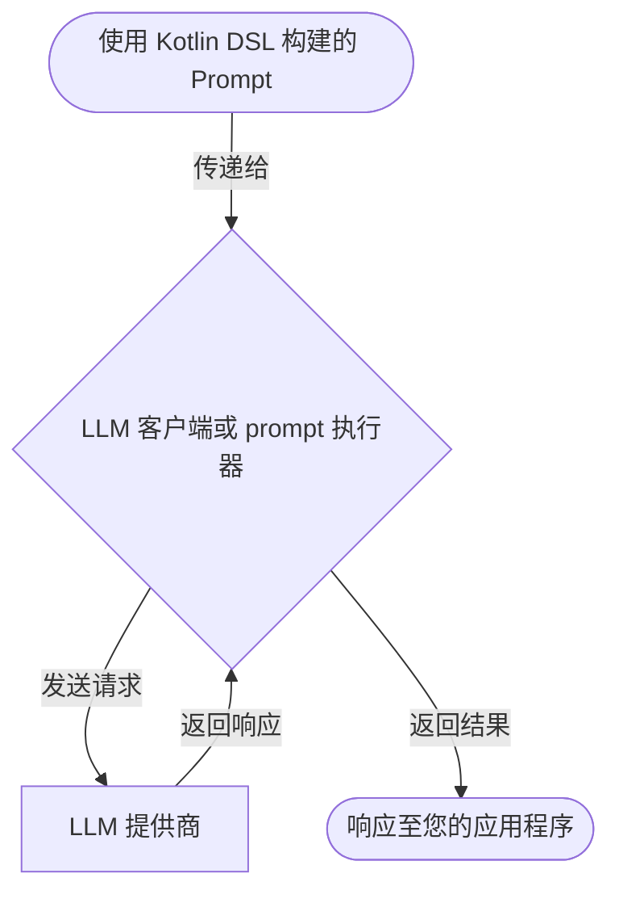
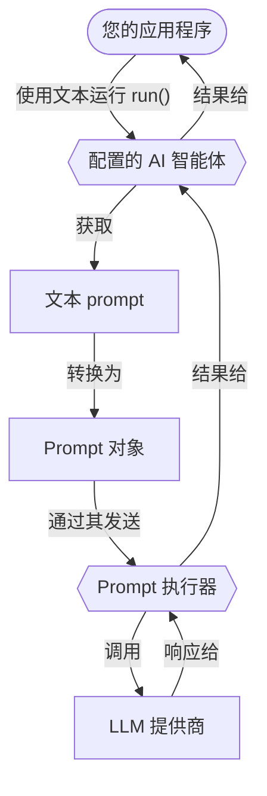

# Prompt

Prompt 是针对大型语言模型 (LLM) 的指令，用于引导其生成响应。
它们定义了您与 LLM 交互的内容和结构。
本节介绍了如何使用 Koog 创建和运行 prompt。

## 创建 prompt

在 Koog 中，prompt 是 [**Prompt**](api:prompt-model::ai.koog.prompt.dsl.Prompt) 数据类的实例，具有以下属性：

- `id`：prompt 的唯一标识符。
- `messages`：代表与 LLM 对话的消息列表。
- `params`：可选的 [LLM 配置参数](prompt-creation/index.md#prompt-parameters)（例如 temperature、工具选择等）。

虽然您可以直接实例化 `Prompt` 类，但推荐的创建方式是使用 [Kotlin DSL](prompt-creation/index.md)，它提供了一种结构化的方式来定义对话。

<!--- INCLUDE
import ai.koog.prompt.dsl.prompt
-->
```kotlin
val myPrompt = prompt("hello-koog") {
    system("You are a helpful assistant.")
    user("What is Koog?")
}
```
<!--- KNIT example-prompts-01.kt -->

!!! note
    AI 智能体可以将简单的文本 prompt 作为输入。
    它们会自动将文本 prompt 转换为 Prompt 对象并发送给 LLM 执行。
    这对于只需要运行单个请求且不需要复杂对话逻辑的[基础智能体](../basic-agents.md)非常有用。

## 运行 prompt

Koog 为针对 LLM 运行 prompt 提供了两个抽象级别：LLM 客户端和 prompt 执行器。
两者都接受 Prompt 对象，并且可以在没有 AI 智能体的情况下用于直接执行 prompt。
客户端和执行器的执行流程相同：


```mermaid
flowchart TB
    A([使用 Kotlin DSL 构建的 Prompt])
    B{LLM 客户端或 prompt 执行器}
    C[LLM 提供商]
    D([响应至您的应用程序])

    A -->|"传递给"| B
    B -->|"发送请求"| C
    C -->|"返回响应"| B
    B -->|"返回结果"| D
```

<div class="grid cards" markdown>

-   :material-arrow-right-bold:{ .lg .middle } [**LLM 客户端**](llm-clients.md)

    ---

    用于与特定 LLM 提供商直接交互的低层接口。
    当您使用单个提供商且不需要高级生命周期管理时，请使用它们。

-   :material-swap-horizontal:{ .lg .middle } [**Prompt 执行器**](prompt-executors.md)

    ---

    管理一个或多个 LLM 客户端生命周期的高层抽象。
    当您需要统一的 API 来跨多个提供商运行 prompt，并希望在它们之间进行动态切换和回退时，请使用它们。

</div>

## 优化性能和处理失败

Koog 允许您在运行 prompt 时优化性能并处理失败。

<div class="grid cards" markdown>

-   :material-cached:{ .lg .middle } [**LLM 响应缓存**](llm-response-caching.md)

    ---

    缓存 LLM 响应，以针对重复请求优化性能并降低成本。

-   :material-shield-check:{ .lg .middle } [**处理失败**](handling-failures.md)

    ---

    在您的应用程序中使用内置的重试、超时和其他错误处理机制。

</div>

## AI 智能体中的 prompt

在 Koog 中，AI 智能体在生命周期内维护并管理 prompt。
虽然 LLM 客户端或执行器用于运行 prompt，但智能体负责处理 prompt 更新流程，确保对话历史记录保持相关性和一致性。

智能体中的 prompt 生命周期通常包含几个阶段：

1. 初始 prompt 设置。
2. 自动 prompt 更新。
3. 上下文窗口管理。
4. 手动 prompt 管理。

### 初始 prompt 设置

当您[初始化智能体](../getting-started/#create-and-run-an-agent)时，需要定义一条[系统消息](prompt-creation/index.md#system-message)来设定智能体的行为。
然后，当您调用智能体的 `run()` 方法时，通常会提供一条初始[用户消息](prompt-creation/index.md#user-messages)作为输入。这些消息共同构成了智能体的初始 prompt。例如：

<!--- INCLUDE
import ai.koog.agents.core.agent.AIAgent
import ai.koog.prompt.executor.clients.openai.OpenAIModels
import ai.koog.prompt.executor.llms.all.simpleOpenAIExecutor
import kotlinx.coroutines.runBlocking

val apiKey = System.getenv("OPENAI_API_KEY")

fun main() = runBlocking {
-->
<!--- SUFFIX
}
-->
```kotlin
// 创建智能体
val agent = AIAgent(
    promptExecutor = simpleOpenAIExecutor(apiKey),
    systemPrompt = "You are a helpful assistant.",
    llmModel = OpenAIModels.Chat.GPT4o
)

// 运行智能体
val result = agent.run("What is Koog?")
```
<!--- KNIT example-prompts-02.kt -->

在示例中，智能体会自动将文本 prompt 转换为 Prompt 对象并将其发送给 prompt 执行器：


```mermaid
flowchart TB
    A([您的应用程序])
    B{{配置的 AI 智能体}}
    C["文本 prompt"]
    D["Prompt 对象"]
    E{{Prompt 执行器}}
    F[LLM 提供商]

    A -->|"使用文本运行 run()"| B
    B -->|"获取"| C
    C -->|"转换为"| D
    D -->|"通过其发送"| E
    E -->|"调用"| F
    F -->|"响应给"| E
    E -->|"结果给"| B
    B -->|"结果给"| A
```

对于更[高级的配置](../complex-workflow-agents.md#4-configure-the-agent)，您还可以使用 [AIAgentConfig](api:agents-core::ai.koog.agents.core.agent.config.AIAgentConfig) 来定义智能体的初始 prompt。

### 自动 prompt 更新

随着智能体运行其策略，[预定义节点](../nodes-and-components.md)会自动更新 prompt。
例如：

- [`nodeLLMRequest`](../nodes-and-components/#nodellmrequest)：将用户消息附加到 prompt 并捕获 LLM 响应。
- [`nodeLLMSendToolResult`](../nodes-and-components/#nodellmsendtoolresult)：将工具执行结果附加到对话中。
- [`nodeAppendPrompt`](../nodes-and-components/#nodeappendprompt)：在工作流的任何位置向 prompt 插入特定消息。

### 上下文窗口管理

为了避免在长时间运行的交互中超出 LLM 上下文窗口，智能体可以使用[历史记录压缩](../history-compression.md)功能。

### 手动 prompt 管理

对于复杂的工作流，您可以使用 [LLM 会话](../sessions.md)手动管理 prompt。
在智能体策略或自定义节点中，您可以使用 `llm.writeSession` 来访问和更改 `Prompt` 对象。
这让您可以根据需要添加、移除或重新排序消息。