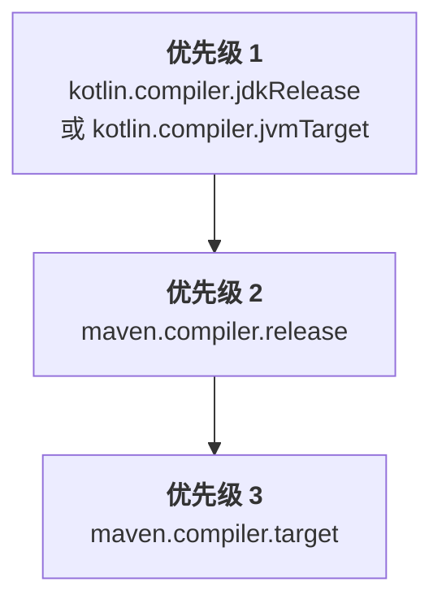

[//]: # (title: 配置 Maven 项目)

当您将 Kotlin 引入现有的 Java Maven 项目或创建一个新的 Kotlin Maven 项目时，您需要添加用于编译 Kotlin 源代码和模块的 Kotlin Maven 插件。

目前仅支持 Maven v3。

## 自动配置

在 Java-Kotlin 混合项目和纯 Kotlin 项目中，您都可以使用 `<extensions>` 扩展程序选项来简化 Maven 配置。这种方法可以节省您的时间，因为您不需要配置 Maven 编译器插件。

要应用带有 `<extensions>` 的 Kotlin Maven 插件，请按以下方式更新您的 `pom.xml` 构建文件：

1. 在 `<properties>` 部分，定义 Kotlin 和 JVM 的目标版本：

   ```xml
   <properties>
       <maven.compiler.release>17</maven.compiler.release>
       <kotlin.version>%kotlinVersion%</kotlin.version>
   </properties>
   ```

2. 在 `<build><plugins>` 部分，添加启用了 `<extensions>` 选项的 Kotlin Maven 插件：

   ```xml
   <build>
       <plugins>
           <!-- Kotlin 编译器插件配置 -->
           <plugin>
               <groupId>org.jetbrains.kotlin</groupId>
               <artifactId>kotlin-maven-plugin</artifactId>
               <version>${kotlin.version}</version>
               <extensions>true</extensions> <!-- 启用扩展程序 -->
           </plugin>
           <!-- 使用扩展程序后无需配置 Maven 编译器插件 -->
       </plugins>
   </build>
   ```

`<extensions>` 选项会：

* 如果 `src/main/kotlin` 和 `src/test/kotlin` 目录已经存在但未在插件配置中指定，则将其注册为源根目录。
* 如果项目中尚未定义 [`kotlin-stdlib` 依赖项](maven-set-dependencies.md#dependency-on-the-standard-library)，则自动添加。
* 将 `compile`、`test-compile`、`kapt` 和 `test-kapt` 执行添加到您的构建中，并绑定到相应的[生命周期阶段](https://maven.apache.org/guides/introduction/introduction-to-the-lifecycle.html)。因此，您无需手动设置带有 `<id>` 和 `<goals>` 的 `<executions>` 部分来处理 `kapt`、Kotlin 的 `compile` 以及 Java 的 `compile` 执行，以确保它们按正确的顺序运行。
* [自动将 JVM 目标版本与项目中配置的 Java 编译器版本对齐。](#jvm-目标版本)
   
如果您拥有一个 Java 与 Kotlin 混合项目，该配置可确保：

* Kotlin 代码首先进行编译。
* Java 代码在 Kotlin 之后编译，并可以引用 Kotlin 类。
* 默认的 Maven 行为不会覆盖插件顺序。

扩展程序配置会替换整个 `<executions>` 部分。如果您需要配置特定的执行，请参阅[编译 Kotlin 和 Java 源代码](#编译-kotlin-和-java-源代码)中的示例。

> 如果有多个构建插件覆盖了默认生命周期，并且您还启用了 `<extensions>` 选项，则 `<build>` 部分中的最后一个插件在生命周期设置方面具有优先级。所有较早的生命周期设置更改都将被忽略。
>
{style="note"}

### JVM 目标版本

`<extensions>` 选项可确保 Kotlin 和 Maven 编译器以相同的字节码版本为目标。

Kotlin Maven 插件会按以下顺序自动解析 JVM 目标版本：



#### Kotlin 编译器版本

如果项目中定义了 `kotlin.compiler.jdkRelease` 或 `kotlin.compiler.jvmTarget` 属性，则其设置的版本具有优先级。

请记住，这些 Kotlin 编译器选项的行为有所不同：

| Kotlin 编译器选项 | 控制输出的字节码版本 | 限制 API 至指定的 JDK |
|------------------------------|-----------------------------------------|-----------------------------------------------------------------------------------------------|
| `kotlin.compiler.jvmTarget`  | 是 | 对代码中的 JDK API 无限制 |
| `kotlin.compiler.jdkRelease` | 是 | 是 － 仅允许特定的 API 版本（相当于 Java 的 `--release` 编译器选项） |

> 不要同时为 `kotlin.compiler.jdkRelease` 和 `kotlin.compiler.jvmTarget` 设置不同的 JDK 选项。否则，您将收到错误。
>
{style="note"}

#### Maven 编译器版本

* 如果既未设置 `kotlin.compiler.jdkRelease` 也未设置 `kotlin.compiler.jvmTarget` 选项，则插件将采用 `maven.compiler.release` 版本。

  `maven.compiler.release` 版本既可以定义为项目属性，也可以在 `maven-compiler-plugin` 配置中定义。
* 如果未设置 Maven release 版本，则插件将采用 `maven.compiler.target` 版本。

  它既可以定义为项目属性，也可以在 `maven-compiler-plugin` 配置中定义。

请记住，Maven 编译器的 `target` 和 `release` 选项行为不同：

| Maven 编译器选项 | 设置 Kotlin 的 `jvmTarget` | 设置 Kotlin 的 `jdkRelease` | 限制 API 至指定的 JDK |
|--------------------------|---------------------------|----------------------------|----------------------------------------------|
| `maven.compiler.target`  | 是 | 否 | 否 － 构建的 JDK 类路径保持可见 |
| `maven.compiler.release` | 是 | 是 | 是 － 仅限特定的 API 版本 |

> `<extensions>` 选项仅检查项目级属性和全局 `maven-compiler-plugin` 配置。它不会检查插件 `<executions>` 部分中定义的配置。
>
{style="note"}

### Maven 编译器版本

目前，与 `<extensions>` 配合使用的 Maven 编译器插件的默认版本为 **%mavenExtensionsVersion%**。您可以单独设置不同的版本：

```xml
<build>
    <plugins>
        <!-- Kotlin 编译器插件配置 -->
        <plugin>
            <groupId>org.jetbrains.kotlin</groupId>
            <artifactId>kotlin-maven-plugin</artifactId>
            <version>${kotlin.version}</version>
            <extensions>true</extensions>
        </plugin>
        <!-- 针对 Java 类的 Maven 编译器插件配置 -->
        <plugin>
            <groupId>org.apache.maven.plugins</groupId>
            <artifactId>maven-compiler-plugin</artifactId>
            <version>%mavenPluginVersion%</version>
        </plugin>
    </plugins>
</build>
```

## 手动配置

如果不启用 Kotlin Maven 插件中的 `<extensions>`，您需要手动配置项目以确保源代码正确编译。

您可以将 Maven 项目设置为编译 [Java 与 Kotlin 混合源代码](#编译-kotlin-和-java-源代码)或[仅编译 Kotlin 源代码](#仅编译-kotlin-源代码)。

### 编译 Kotlin 和 Java 源代码

要编译同时包含 Kotlin 和 Java 源文件的项目，请确保 Kotlin 编译器在 Java 编译器之前运行。

Java 编译器在 Kotlin 代码被编译为 `.class` 文件之前无法看到 Kotlin 声明。如果您的 Java 代码使用了 Kotlin 类，则必须先编译这些类以避免 `cannot find symbol`（找不到符号）错误。

Maven 根据两个主要因素确定插件执行顺序：

* `pom.xml` 文件中插件声明的顺序。
* 内置的默认执行，例如 `default-compile` 和 `default-testCompile`，无论它们在 `pom.xml` 文件中的位置如何，它们始终在用户定义的执行之前运行。

要控制执行顺序：

* 在 `maven-compiler-plugin` 之前声明 `kotlin-maven-plugin`。
* 禁用 Java 编译器插件的默认执行。
* 添加自定义执行以显式控制编译阶段。

> 您可以使用 Maven 中特殊的 `none` 阶段来禁用默认执行。
>
{style="note"}

要应用 Kotlin Maven 插件，请按以下方式更新您的 `pom.xml` 构建文件：

```xml
<build>
    <plugins>
        <!-- Kotlin 编译器插件配置 -->
        <plugin>
            <groupId>org.jetbrains.kotlin</groupId>
            <artifactId>kotlin-maven-plugin</artifactId>
            <version>${kotlin.version}</version>
            <executions>
                <execution>
                    <id>kotlin-compile</id>
                    <phase>compile</phase>
                    <goals>
                        <goal>compile</goal>
                    </goals>
                    <configuration>
                        <sourceDirs>
                            <sourceDir>src/main/kotlin</sourceDir>
                            <!-- 确保 Kotlin 代码可以引用 Java 代码 -->
                            <sourceDir>src/main/java</sourceDir>
                        </sourceDirs>
                    </configuration>
                </execution>
                <execution>
                    <id>kotlin-test-compile</id>
                    <phase>test-compile</phase>
                    <goals>
                        <goal>test-compile</goal>
                    </goals>
                    <configuration>
                        <sourceDirs>
                            <sourceDir>src/test/kotlin</sourceDir>
                            <sourceDir>src/test/java</sourceDir>
                        </sourceDirs>
                    </configuration>
                </execution>
            </executions>
        </plugin>

        <!-- Maven 编译器插件配置 -->
        <plugin>
            <groupId>org.apache.maven.plugins</groupId>
            <artifactId>maven-compiler-plugin</artifactId>
            <version>3.15.0</version>
            <executions>
                <!-- 禁用默认执行 -->
                <execution>
                    <id>default-compile</id>
                    <phase>none</phase>
                </execution>
                <execution>
                    <id>default-testCompile</id>
                    <phase>none</phase>
                </execution>

                <!-- 定义自定义执行 -->
                <execution>
                    <id>java-compile</id>
                    <phase>compile</phase>
                    <goals>
                        <goal>compile</goal>
                    </goals>
                </execution>
                <execution>
                    <id>java-test-compile</id>
                    <phase>test-compile</phase>
                    <goals>
                        <goal>testCompile</goal>
                    </goals>
                </execution>
            </executions>
        </plugin>
    </plugins>
</build>
```

该配置可确保：

* Kotlin 代码首先进行编译。
* Java 代码在 Kotlin 之后编译，并可以引用 Kotlin 类。
* 默认的 Maven 行为不会覆盖插件顺序。

有关 Maven 如何处理插件执行的更多详细信息，请参阅 Maven 官方文档中的[默认插件执行 ID 指南](https://maven.apache.org/guides/mini/guide-default-execution-ids.html)。

### 仅编译 Kotlin 源代码

要编译仅包含 Kotlin 源文件的项目，请声明源根目录并配置 Kotlin Maven 插件：

1. 在 `<build>` 部分中指定源目录：

    ```xml
    <build>
        <sourceDirectory>src/main/kotlin</sourceDirectory>
        <testSourceDirectory>src/test/kotlin</testSourceDirectory>
    </build>
    ```

2. 确保应用了 Kotlin Maven 插件：

    ```xml
    <build>
        <plugins>
            <plugin>
                <groupId>org.jetbrains.kotlin</groupId>
                <artifactId>kotlin-maven-plugin</artifactId>
                <version>${kotlin.version}</version>
                <executions>
                    <execution>
                        <id>compile</id>
                        <goals>
                            <goal>compile</goal>
                        </goals>
                    </execution>
                    <execution>
                        <id>test-compile</id>
                        <goals>
                            <goal>test-compile</goal>
                        </goals>
                    </execution>
                </executions>
            </plugin>
        </plugins>
    </build>
    ```

### 设置 JDK 版本

Kotlin 支持 [Maven Toolchains](https://maven.apache.org/guides/mini/guide-using-toolchains.html)，可帮助您管理构建中的 JDK 版本。

如果您在构建中配置了 `maven-toolchains-plugin`，则可以指定用于 Kotlin 编译的 JDK 版本，该版本独立于运行 Maven 的 JVM 版本（在 `JAVA_HOME` 路径中设置）。随后，Kotlin Maven 插件会自动提取所选的 JDK 工具链。

这允许您配置单个工具链来控制整个构建中所有插件使用的 JDK，包括 Kotlin 编译。例如：

```xml
<plugin>
    <groupId>org.apache.maven.plugins</groupId>
    <artifactId>maven-toolchains-plugin</artifactId>
    <version>3.2.0</version>
    <executions>
        <execution>
            <goals>
                <goal>toolchain</goal>
            </goals>
        </execution>
    </executions>
    <configuration>
        <toolchains>
            <jdk>
                <version>21</version>
            </jdk>
        </toolchains>
    </configuration>
</plugin>
```

请记住设置 JDK 版本的不同方式的优先级：

```Mermaid
graph TD
    A["<b>优先级 1</b><br/>kotlin-maven-plugin 的 jdkHome 选项"]
    B["<b>优先级 2</b><br/>maven-toolchains-plugin 中设置的 <br/>JDK 版本"]
    C["<b>优先级 3</b><br/>JAVA_HOME 版本"]

    A --> B
    B --> C
```

* `kotlin-maven-plugin` 配置中 `jdkHome` 选项设置的 JDK 版本始终优先于工具链版本。
* `maven-toolchains-plugin` 中的 JDK 版本会覆盖 `JAVA_HOME` 路径中设置的 JDK 版本。

您还可以使用特定于插件的 `<jdkToolchain>` 选项直接在 `kotlin-maven-plugin` 的工具链中设置 JDK 版本。与使用 `maven-toolchains-plugin` 相比，此形参仅影响 Kotlin 编译，对构建中的其他插件没有影响。

> 目前，将 `maven-toolchains-plugin` 设置为使用特定 JDK 版本 [不会影响 `kotlin-maven-plugin` 的 `kapt` 和 `test-kapt` 目标](https://youtrack.jetbrains.com/issue/KT-79897)。请改为在 `JAVA_HOME` 路径中设置必要的版本。
>
{style="note"}

#### 使用 JDK 17

要在使用 JDK 17 时，在您的 `.mvn/jvm.config` 文件中添加：

```none
--add-opens=java.base/java.lang=ALL-UNNAMED
--add-opens=java.base/java.io=ALL-UNNAMED
```

## 下一步？

[设置您的 Kotlin Maven 项目的依赖项](maven-set-dependencies.md)