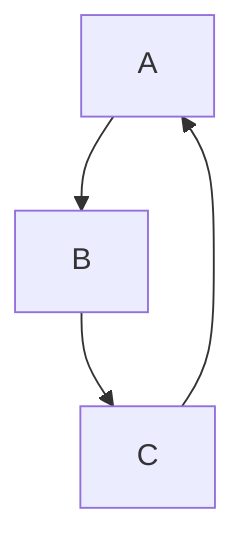
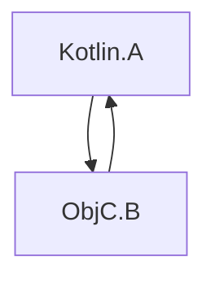

[//]: # (title: 与 Swift/Objective-C ARC 集成)

Kotlin 和 Objective-C 使用不同的内存管理策略。Kotlin 有追踪式垃圾收集器，而 Objective-C 依赖自动引用计数 (ARC)。

这些策略之间的集成通常是无缝的，并且通常不需要额外的工作。但是，您需要牢记一些特殊之处：

## 线程

### 析构器

如果 Swift/Objective-C 对象及其引用的对象在主线程上传递给 Kotlin，例如：

```kotlin
// Kotlin
class KotlinExample {
    fun action(arg: Any) {
        println(arg)
    }
}
```

```swift
// Swift
class SwiftExample {
    init() {
        print("init on \(Thread.current)")
    }

    deinit {
        print("deinit on \(Thread.current)")
    }
}

func test() {
    KotlinExample().action(arg: SwiftExample())
}
```

结果输出：

```text
init on <_NSMainThread: 0x600003bc0000>{number = 1, name = main}
shared.SwiftExample
deinit on <_NSMainThread: 0x600003bc0000>{number = 1, name = main}
```

如果出现以下情况，Swift/Objective-C 对象的析构将在特殊的 GC 线程而不是主线程上调用：

* Swift/Objective-C 对象在非主线程上传递给 Kotlin。
* 主调度队列未被处理。

如果您想显式地在特殊的 GC 线程上调用析构，请在您的 `gradle.properties` 中设置 `kotlin.native.binary.objcDisposeOnMain=false`。此选项启用在特殊的 GC 线程上析构，即使 Swift/Objective-C 对象是在主线程上传递给 Kotlin 的。

特殊的 GC 线程符合 Objective-C 运行时，这意味着它有一个运行循环并释放自动释放池。

### 完成处理程序

当从 Swift 调用 Kotlin 挂起函数时，完成处理程序可能会在非主线程上调用，例如：

```kotlin
// Kotlin
// coroutineScope, launch, and delay are from kotlinx.coroutines
suspend fun asyncFunctionExample() = coroutineScope {
    launch {
        delay(1000L)
        println("World!")
    }
    println("Hello")
}
```

```swift
// Swift
func test() {
    print("Running test on \(Thread.current)")
    PlatformKt.asyncFunctionExample(completionHandler: { _ in
        print("Running completion handler on \(Thread.current)")
    })
}
```

结果输出：

```text
Running test on <_NSMainThread: 0x600001b100c0>{number = 1, name = main}
Hello
World!
Running completion handler on <NSThread: 0x600001b45bc0>{number = 7, name = (null)}
```

## 垃圾收集和生命周期

### 对象回收

对象仅在垃圾收集期间被回收。这适用于跨越互操作边界进入 Kotlin/Native 的 Swift/Objective-C 对象，例如：

```kotlin
// Kotlin
class KotlinExample {
    fun action(arg: Any) {
        println(arg)
    }
}
```

```swift
// Swift
class SwiftExample {
    deinit {
        print("SwiftExample deinit")
    }
}

func test() {
    swiftTest()
    kotlinTest()
}

func swiftTest() {
    print(SwiftExample())
    print("swiftTestFinished")
}

func kotlinTest() {
    KotlinExample().action(arg: SwiftExample())
    print("kotlinTest finished")
}
```

结果输出：

```text
shared.SwiftExample
SwiftExample deinit
swiftTestFinished
shared.SwiftExample
kotlinTest finished
SwiftExample deinit
```

### Objective-C 对象的生命周期

Objective-C 对象可能存活时间比预期更长，这有时可能导致性能问题。例如，当一个长运行循环在每次迭代中创建多个跨越 Swift/Objective-C 互操作边界的临时对象时。

在 [GC 日志](native-memory-manager.md#monitor-gc-performance)中，根集合中存在一些稳定引用。如果这个数量持续增长，可能表明 Swift/Objective-C 对象没有在它们应该被释放时被释放。在这种情况下，尝试在执行互操作调用的循环体周围使用 `autoreleasepool` 块：

```kotlin
// Kotlin
fun growingMemoryUsage() {
    repeat(Int.MAX_VALUE) {
        NSLog("$it
")
    }
}

fun steadyMemoryUsage() {
    repeat(Int.MAX_VALUE) {
        autoreleasepool {
            NSLog("$it
")
        }
    }
}
```

### Swift 和 Kotlin 对象链的垃圾收集

考虑以下示例：

```kotlin
// Kotlin
interface Storage {
    fun store(arg: Any)
}

class KotlinStorage(var field: Any? = null) : Storage {
    override fun store(arg: Any) {
        field = arg
    }
}

class KotlinExample {
    fun action(firstSwiftStorage: Storage, secondSwiftStorage: Storage) {
        // Here, we create the following chain:
        // firstKotlinStorage -> firstSwiftStorage -> secondKotlinStorage -> secondSwiftStorage.
        val firstKotlinStorage = KotlinStorage()
        firstKotlinStorage.store(firstSwiftStorage)
        val secondKotlinStorage = KotlinStorage()
        firstSwiftStorage.store(secondKotlinStorage)
        secondKotlinStorage.store(secondSwiftStorage)
    }
}
```

```swift
// Swift
class SwiftStorage : Storage {

    let name: String

    var field: Any? = nil

    init(_ name: String) {
        self.name = name
    }

    func store(arg: Any) {
        field = arg
    }

    deinit {
        print("deinit SwiftStorage \(name)")
    }
}

func test() {
    KotlinExample().action(
        firstSwiftStorage: SwiftStorage("first"),
        secondSwiftStorage: SwiftStorage("second")
    )
}
```

"deinit SwiftStorage first" 和 "deinit SwiftStorage second" 消息出现在日志中需要一些时间。原因是 `firstKotlinStorage` 和 `secondKotlinStorage` 在不同的 GC 周期中被收集。以下是事件序列：

1.  `KotlinExample.action` 完成。`firstKotlinStorage` 被认为是“死”的，因为它没有被任何东西引用，而 `secondKotlinStorage` 不是，因为它被 `firstSwiftStorage` 引用。
2.  第一个 GC 周期开始，`firstKotlinStorage` 被收集。
3.  没有对 `firstSwiftStorage` 的引用，因此它也“死”了，并调用了 `deinit`。
4.  第二个 GC 周期开始。`secondKotlinStorage` 被收集，因为 `firstSwiftStorage` 不再引用它。
5.  `secondSwiftStorage` 最终被回收。

收集这四个对象需要两个 GC 周期，因为 Swift 和 Objective-C 对象的析构发生在 GC 周期之后。这种限制源于 `deinit` 可以调用任意代码，包括无法在 GC 暂停期间运行的 Kotlin 代码。

### 循环引用

在_循环引用_中，多个对象使用强引用相互循环引用：



Kotlin 的追踪式 GC 和 Objective-C 的 ARC 处理循环引用的方式不同。当对象变得不可达时，Kotlin 的 GC 可以正确地回收此类循环，而 Objective-C 的 ARC 不能。因此，Kotlin 对象的循环引用可以被回收，而 [Swift/Objective-C 对象的循环引用不能](https://docs.swift.org/swift-book/documentation/the-swift-programming-language/automaticreferencecounting/#Strong-Reference-Cycles-Between-Class-Instances)。

考虑循环引用同时包含 Objective-C 和 Kotlin 对象的情况：



这涉及结合 Kotlin 和 Objective-C 的内存管理模型，这些模型无法共同处理（回收）循环引用。这意味着如果至少存在一个 Objective-C 对象，则整个对象图的循环引用无法被回收，并且无法从 Kotlin 侧打破循环。

遗憾的是，目前没有可用的特殊工具来自动检测 Kotlin/Native 代码中的循环引用。为了避免循环引用，请使用[弱引用或无主引用](https://docs.swift.org/swift-book/documentation/the-swift-programming-language/automaticreferencecounting/#Resolving-Strong-Reference-Cycles-Between-Class-Instances)。

## 对后台状态和 App Extensions 的支持

当前内存管理器默认情况下不跟踪应用程序状态，也无法开箱即用地与 [App Extensions](https://developer.apple.com/app-extensions/) 集成。

这意味着内存管理器不会相应地调整 GC 行为，这在某些情况下可能有害。为了改变这种行为，请在您的 `gradle.properties` 中添加以下 [实验性](components-stability.md) 二进制选项：

```none
kotlin.native.binary.appStateTracking=enabled
```

它会在应用程序处于后台时关闭基于计时器的垃圾收集器调用，因此只有当内存消耗过高时才会调用 GC。

## 接下来

了解更多关于 [Swift/Objective-C 互操作性](native-objc-interop.md) 的信息。