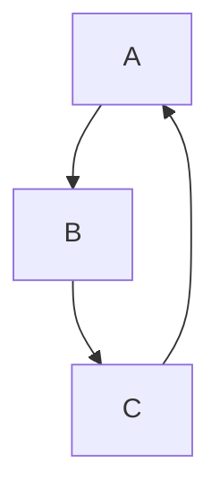
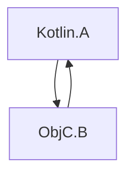

[//]: # (title: 与 Swift/Objective-C ARC 集成)

Kotlin 和 Objective-C 使用不同的内存管理策略。Kotlin 拥有跟踪式垃圾回收器，而 Objective-C 依赖于自动引用计数 (ARC)。

这些策略之间的集成通常是无缝的，且通常无需额外工作。然而，你需要记住以下一些具体事项：

## 线程

### 析构器

如果 Swift/Objective-C 对象及其引用的对象在主线程上被传递给 Kotlin，则这些对象的析构将在主线程上调用，例如：

```kotlin
// Kotlin
class KotlinExample {
    fun action(arg: Any) {
        println(arg)
    }
}
```

```swift
// Swift
class SwiftExample {
    init() {
        print("init on \(Thread.current)")
    }

    deinit {
        print("deinit on \(Thread.current)")
    }
}

func test() {
    KotlinExample().action(arg: SwiftExample())
}
```

结果输出为：

```text
init on <_NSMainThread: 0x600003bc0000>{number = 1, name = main}
shared.SwiftExample
deinit on <_NSMainThread: 0x600003bc0000>{number = 1, name = main}
```

如果出现以下情况，Swift/Objective-C 对象的析构将在特殊 GC 线程上调用，而非主线程：

*   Swift/Objective-C 对象在非主线程上被传递给 Kotlin。
*   主调度队列未被处理。

如果你想显式地在特殊 GC 线程上调用析构，请在你的 `gradle.properties` 中设置 `kotlin.native.binary.objcDisposeOnMain=false`。此选项将启用在特殊 GC 线程上的析构，即使 Swift/Objective-C 对象是在主线程上被传递给 Kotlin 的。

特殊 GC 线程符合 Objective-C 运行时，这意味着它具有运行循环并会排出自动释放池。

### 完成处理器

从 Swift 调用 Kotlin 挂起函数时，完成处理器可能在非主线程上被调用，例如：

```kotlin
// Kotlin
// coroutineScope, launch, and delay are from kotlinx.coroutines
suspend fun asyncFunctionExample() = coroutineScope {
    launch {
        delay(1000L)
        println("World!")
    }
    println("Hello")
}
```

```swift
// Swift
func test() {
    print("Running test on \(Thread.current)")
    PlatformKt.asyncFunctionExample(completionHandler: { _ in
        print("Running completion handler on \(Thread.current)")
    })
}
```

结果输出为：

```text
Running test on <_NSMainThread: 0x600001b100c0>{number = 1, name = main}
Hello
World!
Running completion handler on <NSThread: 0x600001b45bc0>{number = 7, name = (null)}
```

## 垃圾回收和生命周期

### 对象回收

对象仅在垃圾回收期间被回收。这适用于跨越互操作边界进入 Kotlin/Native 的 Swift/Objective-C 对象，例如：

```kotlin
// Kotlin
class KotlinExample {
    fun action(arg: Any) {
        println(arg)
    }
}
```

```swift
// Swift
class SwiftExample {
    deinit {
        print("SwiftExample deinit")
    }
}

func test() {
    swiftTest()
    kotlinTest()
}

func swiftTest() {
    print(SwiftExample())
    print("swiftTestFinished")
}

func kotlinTest() {
    KotlinExample().action(arg: SwiftExample())
    print("kotlinTest finished")
}
```

结果输出为：

```text
shared.SwiftExample
SwiftExample deinit
swiftTestFinished
shared.SwiftExample
kotlinTest finished
SwiftExample deinit
```

### Objective-C 对象的生命周期

Objective-C 对象的存活时间可能超出预期，这有时可能导致性能问题。例如，当一个长时间运行的循环在每次迭代中创建多个跨越 Swift/Objective-C 互操作边界的临时对象时。

在 [GC 日志](native-memory-manager.md#monitor-gc-performance)中，根集合中存在一定数量的稳定引用。如果这个数量持续增长，则可能表明 Swift/Objective-C 对象未能及时释放。在这种情况下，请尝试在执行互操作调用的循环体周围使用 `autoreleasepool` 代码块：

```kotlin
// Kotlin
fun growingMemoryUsage() {
    repeat(Int.MAX_VALUE) {
        NSLog("$it
")
    }
}

fun steadyMemoryUsage() {
    repeat(Int.MAX_VALUE) {
        autoreleasepool {
            NSLog("$it
")
        }
    }
}
```

### Swift 和 Kotlin 对象链的垃圾回收

考虑以下示例：

```kotlin
// Kotlin
interface Storage {
    fun store(arg: Any)
}

class KotlinStorage(var field: Any? = null) : Storage {
    override fun store(arg: Any) {
        field = arg
    }
}

class KotlinExample {
    fun action(firstSwiftStorage: Storage, secondSwiftStorage: Storage) {
        // Here, we create the following chain:
        // firstKotlinStorage -> firstSwiftStorage -> secondKotlinStorage -> secondSwiftStorage.
        val firstKotlinStorage = KotlinStorage()
        firstKotlinStorage.store(firstSwiftStorage)
        val secondKotlinStorage = KotlinStorage()
        firstSwiftStorage.store(secondKotlinStorage)
        secondKotlinStorage.store(secondSwiftStorage)
    }
}
```

```swift
// Swift
class SwiftStorage : Storage {

    let name: String

    var field: Any? = nil

    init(_ name: String) {
        self.name = name
    }

    func store(arg: Any) {
        field = arg
    }

    deinit {
        print("deinit SwiftStorage \(name)")
    }
}

func test() {
    KotlinExample().action(
        firstSwiftStorage: SwiftStorage("first"),
        secondSwiftStorage: SwiftStorage("second")
    )
}
```

“deinit SwiftStorage first” 和 “deinit SwiftStorage second” 消息出现在日志中需要一些时间。原因是 `firstKotlinStorage` 和 `secondKotlinStorage` 在不同的 GC 周期中被回收。事件序列如下：

1.  `KotlinExample.action` 完成。`firstKotlinStorage` 被视为“死亡”，因为没有东西引用它，而 `secondKotlinStorage` 则不是，因为它被 `firstSwiftStorage` 引用。
2.  第一个 GC 周期开始，并且 `firstKotlinStorage` 被回收。
3.  `firstSwiftStorage` 没有引用，因此它也被视为“死亡”，并且会调用 `deinit`。
4.  第二个 GC 周期开始。`secondKotlinStorage` 被回收，因为 `firstSwiftStorage` 不再引用它。
5.  `secondSwiftStorage` 最终被回收。

回收这四个对象需要两个 GC 周期，因为 Swift 和 Objective-C 对象的析构发生在 GC 周期之后。此限制源于 `deinit` 可以调用任意代码，包括无法在 GC 暂停期间运行的 Kotlin 代码。

### 引用循环

在 _引用循环_ 中，多个对象通过强引用循环地相互引用：



Kotlin 的跟踪式 GC 和 Objective-C 的 ARC 处理引用循环的方式不同。当对象变得不可达时，Kotlin 的 GC 可以正确回收此类循环，而 Objective-C 的 ARC 则不能。因此，Kotlin 对象的引用循环可以被回收，而 [Swift/Objective-C 对象的引用循环不能](https://docs.swift.org/swift-book/documentation/the-swift-programming-language/automaticreferencecounting/#Strong-Reference-Cycles-Between-Class-Instances)。

考虑引用循环同时包含 Objective-C 和 Kotlin 对象的情况：



这涉及结合 Kotlin 和 Objective-C 的内存管理模型，它们无法共同处理（回收）引用循环。这意味着如果至少存在一个 Objective-C 对象，则整个对象图的引用循环无法被回收，并且无法从 Kotlin 侧打破循环。

遗憾的是，目前没有可用的特殊工具来自动检测 Kotlin/Native 代码中的引用循环。为避免引用循环，请使用 [弱引用或无主引用](https://docs.swift.org/swift-book/documentation/the-swift-programming-language/automaticreferencecounting/#Resolving-Strong-Reference-Cycles-Between-Class-Instances)。

## 对后台状态和 App Extensions 的支持

当前的内存管理器默认情况下不跟踪应用程序状态，也不支持 [App Extensions](https://developer.apple.com/app-extensions/) 的开箱即用集成。

这意味着内存管理器不会相应地调整 GC 行为，这在某些情况下可能有害。要更改此行为，请将以下[实验性的](components-stability.md)二进制选项添加到你的 `gradle.properties` 中：

```none
kotlin.native.binary.appStateTracking=enabled
```

当应用程序处于后台时，它会关闭基于计时器的垃圾回收器调用，因此只有当内存消耗过高时才调用 GC。

## 下一步

了解更多关于 [Swift/Objective-C 互操作](native-objc-interop.md)。