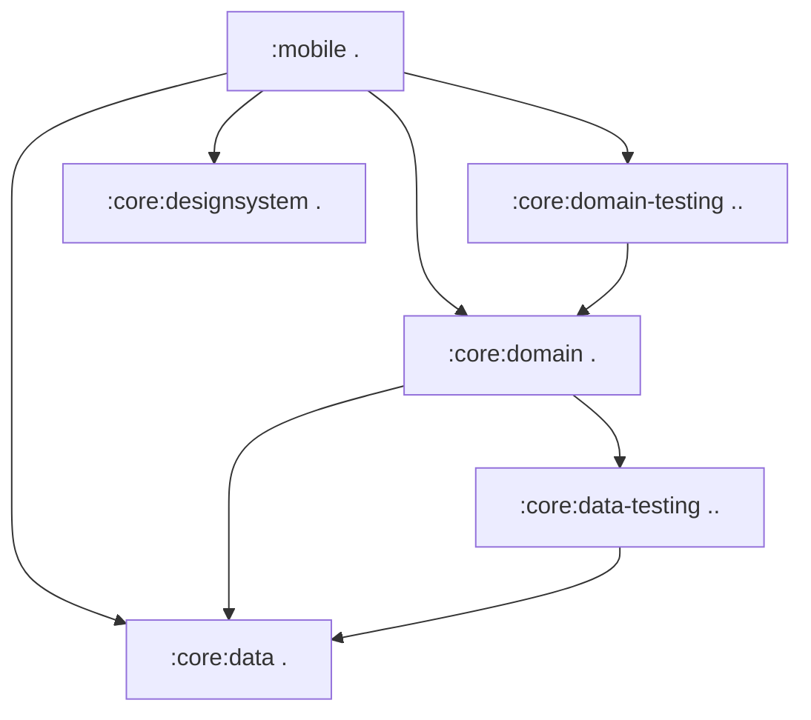
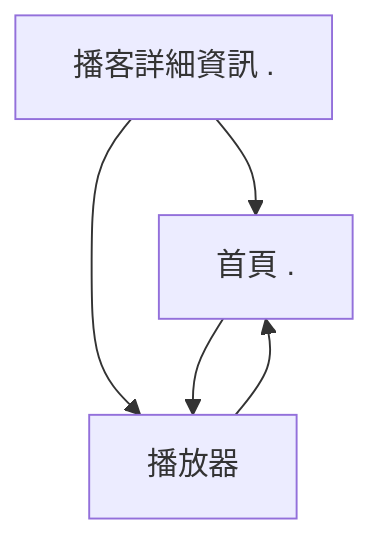

[//]: # (title: 將 Jetpack Compose 應用程式遷移至 Kotlin Multiplatform)

<secondary-label ref="IntelliJ IDEA"/>
<secondary-label ref="Android Studio"/>

<tldr>
<p>本教學使用 IntelliJ IDEA，但您也可以在 Android Studio 中進行。
   這兩個 IDE 擁有相同的核心功能和 Kotlin Multiplatform 支援。</p>
</tldr>

本指南旨在說明如何將一個僅限 Android 的應用程式，從業務邏輯到 UI，全面遷移為多平台應用程式。
它將透過一個進階的 Compose 範例，闡釋常見的挑戰與解決方案。
您可以仔細依照提交序列（commit sequence）進行，或快速瀏覽一般的遷移步驟，然後深入研究任何您感興趣的部分。

起始應用程式是 [Jetcaster](https://github.com/android/compose-samples/tree/main/Jetcaster)，
這是一個使用 Jetpack Compose 為 Android 建置的播客範例應用程式。
此範例是一個功能齊全的應用程式，依賴於：
* 多個模組。
* Android 資源管理。
* 網路和資料庫存取。
* Compose 導航。
* 最新的 Material Expressive 元件。

所有這些功能都可以使用 Kotlin Multiplatform 和 Compose Multiplatform 框架，應用到跨平台應用程式中。

為了讓您的 Android 應用程式能在其他平台上運作，您可以：

1. 了解如何評估您的專案是否適合 Kotlin Multiplatform (KMP) 遷移。
2. 了解如何將 Gradle 模組區分為跨平台和平台專用模組。
   對於 Jetcaster，我們能夠將大部分業務邏輯模組轉換為多平台，
   除了某些需要針對 iOS 和 Android 分別編寫的低階系統呼叫。
3. 遵循逐步將業務邏輯模組轉換為多平台的流程，
   透過逐漸更新建置指令碼（build scripts）和程式碼，以最小的變動在不同的工作狀態之間移動。
4. 了解 UI 程式碼如何轉換為共享實作：
   使用 Compose Multiplatform，您可以共享 Jetcaster 中的大部分 UI 程式碼。
   更重要的是，您將看到如何逐步實現此轉換，一個畫面接著一個畫面。

最終的應用程式可在 Android、iOS 和桌面平台執行。
桌面應用程式也作為一個 [Compose Hot Reload](compose-hot-reload.md) 範例：
一種快速迭代 UI 行為的方式。

## 潛在 Kotlin Multiplatform 遷移的清單

潛在 KMP 遷移的主要障礙是 Java 和 Android Views。
如果您的專案已經以 Kotlin 編寫並使用 Jetpack Compose 作為 UI，
那將大大降低遷移的複雜性。

以下是您在遷移專案或模組之前應考慮的準備工作的一般清單：

1. [轉換或隔離 Java 程式碼](#convert-or-isolate-java-code)
2. [檢查您的 Android/JVM 專用依賴項](#check-your-android-jvm-only-dependencies)
3. [補齊模組化技術債](#catch-up-with-modularization-technical-debt)
4. [遷移到 Compose](#migrate-from-views-to-jetpack-compose)

### 轉換或隔離 Java 程式碼

在原始的 Android Jetcaster 範例中，存在 `Objects.hash()` 和 `Uri.encode()` 等僅限 Java 的呼叫，
以及廣泛使用 `java.time` 套件。

儘管您可以從 Kotlin 呼叫 Java，反之亦然，
但 `commonMain` 原始碼集（source set），其中包含 Kotlin Multiplatform 模組中的共享程式碼，不能包含 Java 程式碼。
因此，當您將 Android 應用程式轉換為多平台時，您需要：
* 將這些程式碼隔離在 `androidMain` 中（並為 iOS 重寫），或者
* 使用多平台相容依賴項將 Java 程式碼轉換為 Kotlin。

另一個僅限 Java 的函式庫 RxJava 並未在 Jetcaster 中使用，但被廣泛採用。由於它是一個
用於管理非同步操作的 Java 框架，
建議在開始 KMP 遷移之前遷移到 `kotlinx-coroutines`。

有 [從 Java 遷移到 Kotlin 的指南](https://kotlinlang.org/docs/java-to-kotlin-idioms-strings.html)，
以及 IntelliJ IDEA 中的一個 [輔助工具](https://www.jetbrains.com/help/idea/get-started-with-kotlin.html#convert-java-to-kotlin)，
可以自動轉換 Java 程式碼並簡化此過程。

### 檢查您的 Android/JVM 專用依賴項

雖然許多專案，尤其是較新的專案，可能不包含太多 Java 程式碼，但它們通常會有 Android 專用依賴項。
對於 Jetcaster，識別替代方案並遷移到它們構成了大部分工作。

重要的一步是建立您計劃共享的程式碼中使用的依賴項清單，並確保有可用的多平台替代方案。
儘管多平台生態系統不如 Java 生態系統龐大，但它正在迅速擴展。
使用 [klibs.io](https://klibs.io) 作為起點來評估潛在選項。

對於 Jetcaster，這些函式庫的清單如下：

* Dagger/Hilt，一個流行的依賴注入解決方案（已替換為 [Koin](https://insert-koin.io/)）

  Koin 是一個可靠的多平台 DI 框架。如果它不符合您的需求或所需的重寫工作量過大，還有其他解決方案。
  [Metro](https://zacsweers.github.io/metro/latest/) 框架也是多平台的。
  它透過支援 [與其他註解的互通性](https://zacsweers.github.io/metro/latest/interop/)，
  包括 Dagger 和 Kotlin Inject，幫助簡化遷移。
* Coil 2，一個影像載入函式庫（[在版本 3 中成為多平台](https://coil-kt.github.io/coil/upgrading_to_coil3/)）。
* ROME，一個 RSS 框架（已替換為多平台 [RSS Parser](https://github.com/prof18/RSS-Parser)）。
* JUnit，一個測試框架（已替換為 [kotlin-test](https://kotlinlang.org/api/core/kotlin-test/)）。

隨著您的進行，您可能會發現一些小段程式碼在多平台中停止運作，因為尚無跨平台實作存在。
例如，在 Jetcaster 中，我們必須將 Compose UI 函式庫的一部分 `AnnotatedString.fromHtml()` 函式，
替換為第三方多平台依賴項。

很難預先識別所有這些情況，因此請準備好在遷移過程中尋找替代方案或重寫程式碼。
這就是為什麼我們展示如何以最小的步驟從一個工作狀態轉移到另一個工作狀態。這樣一來，單一問題
就不會因為許多部分同時變動而阻礙您的進度。

### 補齊模組化技術債

KMP 允許您選擇性地、模組化、逐畫面地遷移到多平台狀態。
但為了使其順利運作，您的模組結構需要清晰且易於操作。
考慮根據 [高內聚、低耦合原則](https://developer.android.com/topic/modularization/patterns#cohesion-coupling)，
以及其他建議的模組結構實踐來評估您的模組化。

一般建議可歸納如下：

* 將應用程式功能的獨特部分分離到功能模組中，
  並將功能模組與處理和提供資料存取的資料模組分開。
* 在模組內封裝特定領域的資料和業務邏輯。
  將相關資料類型分組在一起，並避免在不相關的領域之間混合邏輯或資料。
* 透過使用 Kotlin [可見性修飾符](https://kotlinlang.org/docs/visibility-modifiers.html) 阻止外部存取模組的實作細節和資料來源。

有了清晰的結構，即使您的專案有很多模組，
您也應該能夠單獨將它們遷移到 KMP。這種方法比嘗試全面重寫更順暢。

### 從 Views 遷移到 Jetpack Compose

Kotlin Multiplatform 提供了 Compose Multiplatform 作為建立跨平台 UI 程式碼的方式。
為了順利過渡到 Compose Multiplatform，您的 UI 程式碼應該已經使用 Compose 編寫。如果您目前使用的是 Views，
您將需要以新的範例和使用新的框架重寫該程式碼。
這顯然是預先完成會更容易。

Google 長期以來一直在推進和豐富 Compose。請查看 [Jetpack Compose 遷移指南](https://developer.android.com/develop/ui/compose/migrate)
以獲取最常見情境的幫助。
您也可以使用 Views-Compose 互通性，但就像 Java 程式碼一樣，此程式碼必須隔離在您的
`androidMain` 原始碼集中。

## 將應用程式轉換為多平台的步驟

完成初步準備和評估後，一般流程是：

1. [遷移到多平台函式庫](#migrate-to-multiplatform-libraries)

2. [將您的業務邏輯轉換為 KMP](#migrating-the-business-logic)。
   1. 從依賴項最少的模組開始。
   2. 將其遷移到 KMP 模組結構，並遷移為使用多平台函式庫。
   3. 選擇依賴樹中的下一個模組，並重複此過程。
   
   {type="alpha-lower"}
3. [將您的 UI 程式碼轉換為 Compose Multiplatform](#migrating-to-multiplatform-ui)。
   當您的所有業務邏輯都已經是多平台時，轉換到 Compose Multiplatform 會相對
   簡單。
   對於 Jetcaster，我們展示了逐畫面增量遷移。我們還展示了如何在某些畫面已遷移而另一些未遷移時調整導航圖。

為了簡化範例，我們從一開始就移除了 Android 專用的 Glance、TV 和穿戴式裝置目標，
因為它們無論如何都不會與多平台程式碼互動，也不需要遷移。

> 您可以按照下面的步驟描述進行，或者直接跳轉到 [包含最終多平台 Jetcaster 專案的儲存庫](https://github.com/kotlin-hands-on/jetcaster-kmp-migration/commits/main/)。
> 每個提交都代表應用程式的一個工作狀態，以展示從僅限 Android 到完全 Kotlin Multiplatform 的逐步遷移潛力。
> 
{style="tip"}

### 準備環境 {collapsible="true"}

如果您想依照遷移步驟或在您的機器上執行提供的範例，
請確保您已準備好環境：

1. 依照快速入門的說明，完成 [設定 Kotlin Multiplatform 環境](quickstart.md#set-up-the-environment)。

   > 您需要一台搭載 macOS 的 Mac 才能建置並執行 iOS 應用程式。
   > 這是 Apple 的要求。
   >
   {style="note"}

2. 在 IntelliJ IDEA 或 Android Studio 中，透過克隆範例儲存庫來建立一個新專案：

   ```text
   git@github.com:kotlin-hands-on/jetcaster-kmp-migration.git
   ```

## 遷移到多平台函式庫

應用程式的大部分功能依賴於幾個函式庫。
我們可以在配置模組以支援多平台之前，將它們的使用轉換為 KMP 相容：

* 從 ROME tools 解析器遷移到多平台 RSS Parser。
  這需要考慮 API 之間的差異，其中之一是它們處理日期的方式。

  > 請參閱 [最終提交](https://github.com/kotlin-hands-on/jetcaster-kmp-migration/commit/703d670ed82656c761ed2180dc5118b89fc9c805)。
* 在整個應用程式中，包括僅限 Android 的進入點模組 `mobile`，從 Dagger/Hilt 遷移到 Koin 4。
  這需要根據 Koin 的方法重寫依賴注入邏輯，但 `*.di` 套件之外的程式碼基本上不受影響。

  當您從 Hilt 遷移時，請確保清除 `/build` 目錄，以避免先前生成的 Hilt 程式碼中出現編譯錯誤。

  > 請參閱 [最終提交](https://github.com/kotlin-hands-on/jetcaster-kmp-migration/commit/9c59808a5e3d74e6a55cd357669b24f77bbcd9c8)。

* 從 Coil 2 升級到 Coil 3。同樣，程式碼修改相對較少。

  > 請參閱 [最終提交](https://github.com/kotlin-hands-on/jetcaster-kmp-migration/commit/826fdd2b87a516d2f0bfe6b13ab8e989a065ee7a)。

* 從 JUnit 遷移到 `kotlin-test`。這涉及所有帶有測試的模組，但由於 `kotlin-test` 的相容性，
  實施遷移所需的變更非常少。

  > 請參閱 [最終提交](https://github.com/kotlin-hands-on/jetcaster-kmp-migration/commit/82109598dbfeda9dceecc10b40487f80639c5db4)。

### 將 Java 依賴程式碼重寫為 Kotlin

現在主要的函式庫都已是多平台，我們需要消除僅限 Java 的依賴項。

一個僅限 Java 呼叫的簡單範例是 `Objects.hash()`，我們已在 Kotlin 中重新實作。
請參閱 [最終提交](https://github.com/kotlin-hands-on/jetcaster-kmp-migration/commit/29341a430e6c98a4f7deaed1d6863edb98e25659)。

但主要阻止我們在 Jetcaster 範例中直接通用化程式碼的是 `java.time` 套件。
時間計算在播客應用程式中幾乎無處不在，因此我們需要將該程式碼遷移到 `kotlin.time` 和 `kotlinx-datetime`
才能真正受益於 KMP 程式碼共享。

所有與時間相關的重寫都收集在 [此提交](https://github.com/kotlin-hands-on/jetcaster-kmp-migration/commit/0cb5b31964991fdfaed7615523bb734b22f9c755) 中。

## 遷移業務邏輯

一旦主要依賴項都是多平台，我們就可以選擇一個模組來開始遷移。
建立專案中模組的依賴圖會很有幫助。
像 [Junie](https://www.jetbrains.com//junie/) 這樣的 AI 代理程式可以輕鬆地幫助完成此操作。
對於 Jetcaster，簡化的模組依賴圖如下所示：



例如，這表示以下序列：

1. `:core:data`
2. `:core:data-testing`
4. `:core:domain`
5. `:core:domain-testing`
1. `:core:designsystem` — 雖然它沒有模組依賴項，但這是一個 UI 輔助模組，
   因此我們只在準備好將 UI 程式碼移至共享模組時才處理它。

### 遷移 :core:data

#### 配置 :core:data 並遷移資料庫程式碼

Jetcaster 使用 [Room](https://developer.android.com/training/data-storage/room) 作為資料庫函式庫。
由於 Room 從版本 2.7.0 開始支援多平台，
我們只需更新程式碼以跨平台運作。
此時我們還沒有 iOS 應用程式，但我們已經可以編寫平台專用程式碼，當我們設定 iOS 進入點時將會呼叫這些程式碼。
我們還為其他平台（iOS 和 JVM）新增了目標配置，為稍後新增進入點做準備。

為了切換到 Room 的多平台版本，我們遵循了 Android 的 [通用設定指南](https://developer.android.com/kotlin/multiplatform/room)。

> 請參閱 [最終提交](https://github.com/kotlin-hands-on/jetcaster-kmp-migration/commit/ab22fb14e9129087b310a989eb08bcc77b0e12e8)。

* 請注意新的程式碼結構，包含 `androidMain`、`commonMain`、`iosMain` 和 `jvmMain` 原始碼集。
* 大部分程式碼變更都與為 Room 和相應的 DI 變更建立 expect/actual 結構有關。
* 有一個新的 `OnlineChecker` 介面，用於處理我們僅在 Android 上檢查網際網路連線的事實。在我們 [新增 iOS 應用程式作為目標](#add-an-ios-entry-point) 之前，Online Checker 將是一個存根（stub）。

我們也可以立即重新配置 `:core:data-testing` 模組以使其成為多平台。
請參閱 [最終提交](https://github.com/kotlin-hands-on/jetcaster-kmp-migration/commit/098a72a25f07958b90ae8778081ab1c7f2988543)。
它只需要更新 Gradle 配置並遷移到原始碼集
資料夾結構。

#### 配置並遷移 :core:domain

如果所有依賴項都已處理並遷移到多平台，我們唯一需要做的就是
移動程式碼並重新配置模組。

> 請參閱 [最終提交](https://github.com/kotlin-hands-on/jetcaster-kmp-migration/commit/a8376dc2f0eb29ed8b67c929970dcbe505768612)。

類似於 `:core:data-testing`，我們也可以輕鬆地將 `:core:domain-testing` 模組更新為多平台。

> 請參閱 [最終提交](https://github.com/kotlin-hands-on/jetcaster-kmp-migration/commit/a46f0a98b8d95656e664dca0d95da196034f2ec3)。

#### 配置並遷移 :core:designsystem

僅剩 UI 程式碼需要遷移，我們開始轉換 `:core:designsystem` 模組，其中包含字體資源
和字體排版。
除了配置 KMP 模組並建立 `commonMain` 原始碼集之外，我們還將 `MaterialExpressiveTheme` 的 `JetcasterTypography` 參數
變為可組合項（composable），封裝了對多平台字體的呼叫。

> 請參閱 [最終提交](https://github.com/kotlin-hands-on/jetcaster-kmp-migration/commit/4aa92e3f38d06aa64444163d865753e47e9b2a97)。

## 遷移到多平台 UI

當所有 `:core` 邏輯都是多平台時，您也可以開始將 UI 移至共享程式碼。
再次強調，由於我們的目標是完全遷移，我們尚未新增 iOS 目標，只是確保 Android 應用程式
可以在共享程式碼中放置 Compose 部分。

為了可視化我們將遵循的邏輯，以下是一個簡化的圖表，表示 Jetcaster 畫面之間的關係：

<!-- 為了簡潔起見，深層連結連線和支援窗格已註解掉，但可能很有趣。 --> 



首先，我們建立了一個共享 UI 模組，用於我們要通用化的 UI 程式碼。

> 請參閱 [最終提交](https://github.com/kotlin-hands-on/jetcaster-kmp-migration/commit/a48bb1281c63a235fcc1d80e2912e75ddd5cbed4)。

為了演示逐步遷移 UI，我們將逐畫面進行。
每個步驟都將以一次提交結束，其中包含應用程式的工作狀態，距離完全共享 UI 更近一步。

在上述畫面圖表的引導下，我們從播客詳細資訊畫面開始：

1. 遷移後的畫面將與仍位於 Android 模組中的 Compose 主題一起運作。
   我們需要做的是：
   1. 更新 ViewModel 和相應的 DI 程式碼。
   2. 更新資源和資源存取器（resource accessors）。
      儘管多平台資源函式庫與 Android 體驗緊密結合，但仍有一些
      需要解決的顯著差異：
      * 資源檔案的處理方式略有不同。
        例如，資源目錄需要命名為 `composeResources` 而非 `res`，
        並且 Android XML 檔案中的 `@android:color` 用法需要替換為顏色十六進位碼。
        請參閱 [多平台資源](compose-multiplatform-resources.md) 文件以了解更多資訊。
      * 生成的帶有資源存取器的類別名為 `Res`（與 Android 上的 `R` 不同）。
        移動並調整資源檔案後，重新生成存取器並替換 UI 程式碼中每個資源的導入。
      
   > 請參閱 [最終提交](https://github.com/kotlin-hands-on/jetcaster-kmp-migration/commit/801f044e56224398d812eb8fd1c1d46b0e9b0087)。

2. 遷移 Compose 主題。我們還為色彩方案（color schemes）的平台專用實作提供了存根。

   > 請參閱 [最終提交](https://github.com/kotlin-hands-on/jetcaster-kmp-migration/commit/07be9bba96a0dd91e4e0761075898b3d5272ca57)。

3. 繼續處理首頁畫面：
   1. 遷移 ViewModel。
   2. 將程式碼移至共享 UI 模組中的 `commonMain`。
   3. 移動和調整對資源的引用。

   > 請參閱 [最終提交](https://github.com/kotlin-hands-on/jetcaster-kmp-migration/commit/ad0012becc527c1c8cb354bb73b5da9741733a1f)。

4. 為了展示另一種原子化（atomize）遷移的方式，我們部分遷移了導航。
   我們可以在共享程式碼中將畫面與 Android 原生畫面結合。
   `PlayerScreen` 仍位於 `mobile` 模組中，並且僅在 Android 進入點中包含在導航中。
   它被注入到總體多平台導航中。

   > 請參閱 [最終提交](https://github.com/kotlin-hands-on/jetcaster-kmp-migration/commit/2e0107dd4d217346b38cc9b3d5180fedcc12fb8b)。
   
5. 完成剩餘的所有內容：
   * 將導航的其餘部分移至共享程式碼（[最終提交](https://github.com/kotlin-hands-on/jetcaster-kmp-migration/commit/48f13acc02d3630871e3671114f736cb3db51424)）。
   * 將最後一個畫面 `PlayerScreen` 遷移到 Compose Multiplatform（[最終提交](https://github.com/kotlin-hands-on/jetcaster-kmp-migration/commit/60d5a2f96943705c869b5726622e873925fc2651)）。

現在所有 UI 程式碼都已通用化，我們可以用它來快速為其他平台建立應用程式。

## 可選：新增 JVM 進入點

此可選步驟有助於：
* 展示將一個已完全多平台化的 Android 應用程式建立為桌面應用程式所需的精力有多麼少。
* 展示 [Compose Hot Reload](compose-hot-reload.md) 作為快速迭代 Compose UI 的工具，目前僅支援桌面目標。

所有 UI 程式碼都已共享，為桌面 JVM 應用程式新增一個進入點，只是建立一個 `main()` 函式並將其與 DI 框架整合的問題。

> 請參閱 [最終提交](https://github.com/kotlin-hands-on/jetcaster-kmp-migration/commit/af033dbf39188ef3991466727d155b988c30f1d3)。

## 新增 iOS 進入點

iOS 進入點需要一個與 KMP 程式碼連結的 iOS 專案。

在 KMP 專案中建立和嵌入 iOS 應用程式在 [將您的應用程式多平台化](https://kotlinlang.org/docs/multiplatform/multiplatform-integrate-in-existing-app.html#create-an-ios-project-in-xcode)
教學中有所介紹。

> 我們這裡使用的直接整合方法最為直接，但可能不適用於您的專案。
> 請參閱 [iOS 整合方法概述](multiplatform-ios-integration-overview.md) 以了解一系列替代方案。
>
{style="note"}

在 iOS 應用程式中，我們需要將 Swift UI 程式碼與我們的 Compose Multiplatform 程式碼連接。
我們透過新增一個函式來實現，該函式返回一個 `UIViewController`，其中嵌入了 `JetcasterApp` 可組合項，並將其加入 iOS 應用程式。

> 請參閱 [最終提交](https://github.com/kotlin-hands-on/jetcaster-kmp-migration/commit/2b2c412596e199b140089efc73de03e46f5c1d77) 中新增的 iOS 專案和相應的程式碼更新。

## 執行應用程式

在遷移應用程式的最終狀態中，有初始 Android 模組 (`mobile`)
和新的 iOS 應用程式的執行配置。
您可以從相應的 `main.kt` 檔案執行桌面應用程式。
同時執行它們，看看共享 UI 如何在所有平台上運作！

## 最終摘要

在此遷移中，我們遵循了將純 Android 應用程式轉換為 Kotlin Multiplatform 應用程式的一般步驟：

* 轉換為多平台依賴項，或在不可能時重寫程式碼。
* 將可在其他平台使用的 Android 模組逐一轉換為多平台模組。
* 為 Compose Multiplatform 程式碼建立一個共享 UI 模組，並逐畫面轉換為共享 UI 程式碼。
* 為其他平台建立進入點。

這個序列並非一成不變。也可以從其他平台的進入點開始，
並逐漸在它們之下建立基礎，直到它們運作。
在 Jetcaster 範例中，我們選擇了一個更清晰的變更序列，易於循序漸進。

如果您對本指南或所展示的解決方案有任何回饋，請在 [YouTrack](https://kotl.in/issue) 中建立一個問題。