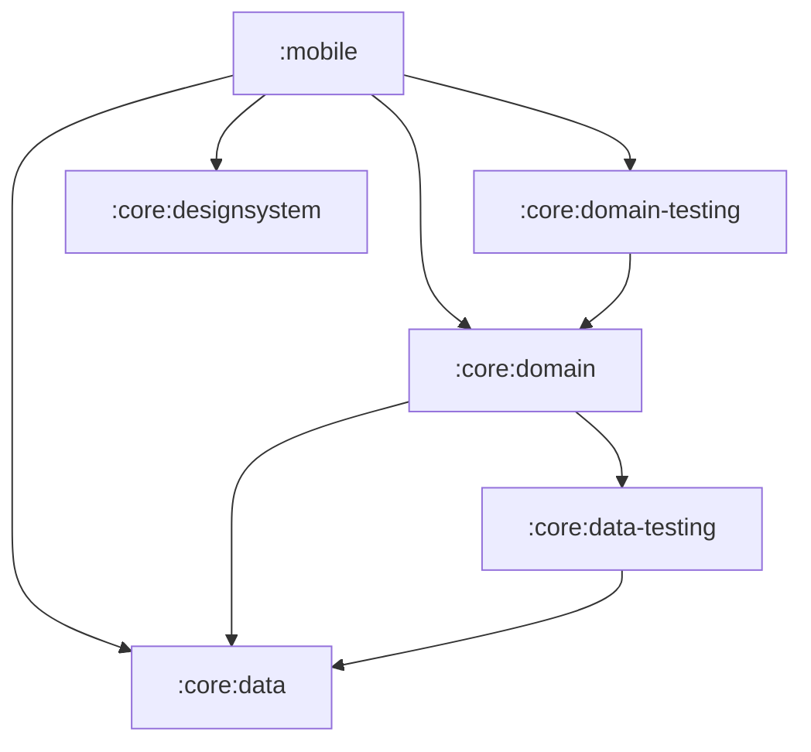
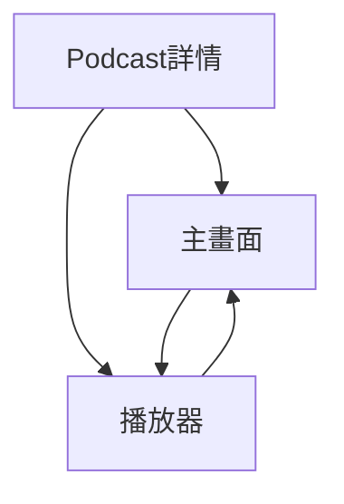

[//]: # (title: 將 Jetpack Compose 應用程式遷移至 Kotlin Multiplatform)

<secondary-label ref="IntelliJ IDEA"/>
<secondary-label ref="Android Studio"/>

<tldr>
<p>本教學使用 IntelliJ IDEA，但您也可以在 Android Studio 中進行。這兩款 IDE 具有相同的核心功能與 Kotlin Multiplatform 支援。</p>
</tldr>

本指南關於將一個僅限 Android 的應用程式，從商業邏輯到 UI 的整個技術堆疊遷移至多平台。
它透過一個進階的 Compose 範例展示了常見的挑戰與解決方案。
您可以緊跟提交（commit）順序，或是瀏覽一般的遷移步驟，並深入研究您感興趣的任何部分。

初始應用程式為 [Jetcaster](https://github.com/android/compose-samples/tree/main/Jetcaster)，這是一個使用 Jetpack Compose 為 Android 建置的 Podcast 範例應用程式。
該範例是一個功能齊全的應用程式，依賴於：
* 多個模組（module）。
* Android 資源管理。
* 網路與資料庫存取。
* Compose Navigation。
* 最新的 Material Expressive 元件。

所有這些特性都可以使用 Kotlin Multiplatform 與 Compose Multiplatform 架構適配為跨平台應用程式。

為了準備讓您的 Android 應用程式在其他平台上運作，您可以：

1. 學習如何將您的專案評估為 Kotlin Multiplatform (KMP) 遷移的候選對象。
2. 瞭解如何將 Gradle 模組分離為跨平台模組與平台特定模組。
   在 Jetcaster 中，除了某些需要針對 iOS 與 Android 分別編寫程式的低階系統呼叫外，我們能夠將大部分商業邏輯模組轉換為多平台。
3. 遵循逐一將商業邏輯模組轉換為多平台的過程，透過逐步更新組建指令碼（script）與程式碼，以最小的變動在不同工作狀態間切換。
4. 瞭解 UI 程式碼如何轉換為共享實作：
   使用 Compose Multiplatform，您可以共享 Jetcaster 中大部分的 UI 程式碼。
   更重要的是，您將看到如何逐一畫面（screen by screen）地漸進式實作此轉換。

最終的應用程式可在 Android、iOS 與桌面端執行。
桌面端應用程式同時也作為 [Compose Hot Reload](compose-hot-reload.md) 的範例：這是一種快速迭代 UI 行為的方法。

## 潛在 Kotlin Multiplatform 遷移的檢查清單

潛在 KMP 遷移的主要障礙是 Java 與 Android View。
如果您的專案已經使用 Kotlin 編寫並使用 Jetpack Compose 作為 UI，這會大幅降低遷移的複雜度。

以下是在遷移專案或模組前，您應該考慮的通用檢查清單：

1. [轉換或隔離 Java 程式碼](#convert-or-isolate-java-code)
2. [檢查您僅限 Android/JVM 的相依性](#check-your-android-jvm-only-dependencies)
3. [補齊模組化技術債](#catch-up-with-modularization-technical-debt)
4. [遷移至 Compose](#migrate-from-views-to-jetpack-compose)

### 轉換或隔離 Java 程式碼

在原始的 Android Jetcaster 範例中，存在僅限 Java 的呼叫，例如 `Objects.hash()` 與 `Uri.encode()`，以及對 `java.time` 套件的大量使用。

雖然您可以從 Kotlin 呼叫 Java，反之亦然，但 Kotlin Multiplatform 模組中包含共享程式碼的 `commonMain` 原始碼集（source set）不能包含 Java 程式碼。
因此，當您將 Android 應用程式轉換為多平台時，您需要：
* 將此程式碼隔離在 `androidMain` 中（並為 iOS 重寫），或者
* 使用多平台相容的相依性將 Java 程式碼轉換為 Kotlin。

另一個 Java 特定的程式庫 RxJava 雖然未在 Jetcaster 中使用，但被廣泛採用。由於它是一個用於管理非同步操作的 Java 架構，建議在開始 KMP 遷移前先遷移至 `kotlinx-coroutines`。

目前有[將 Java 遷移至 Kotlin 的指南](https://kotlinlang.org/docs/java-to-kotlin-idioms-strings.html)，以及 IntelliJ IDEA 中的[輔助工具](https://www.jetbrains.com/help/idea/get-started-with-kotlin.html#convert-java-to-kotlin)，可以自動轉換 Java 程式碼並簡化流程。

### 檢查您僅限 Android/JVM 的相依性

雖然許多專案（尤其是較新的專案）可能不包含太多 Java 程式碼，但它們通常具有僅限 Android 的相依性。對於 Jetcaster 而言，尋找替代方案並遷移至這些方案佔據了大部分工作。

重要的一步是列出您計畫共享的程式碼中所使用的相依性，並確保有可用的多平台替代方案。
雖然多平台生態系統不像 Java 生態系統那麼龐大，但它正在迅速擴張。
請使用 [klibs.io](https://klibs.io) 作為評估潛在選項的起點。

對於 Jetcaster，這些程式庫的清單如下：

* Dagger/Hilt：一種流行的相依注入解決方案（替換為 [Koin](https://insert-koin.io/)）。

  Koin 是一個可靠的多平台 DI 架構。如果它不符合您的需求或所需的重寫工作量太大，還有其他解決方案。
  [Metro](https://zacsweers.github.io/metro/latest/) 架構也是多平台的。它透過支援[與其他註解的互通性](https://zacsweers.github.io/metro/latest/interop/)（包括 Dagger 與 Kotlin Inject）來協助減輕遷移負擔。
* Coil 2：一個圖片載入程式庫（在[第 3 版中變為多平台](https://coil-kt.github.io/coil/upgrading_to_coil3/)）。
* ROME：一個 RSS 架構（替換為多平台的 [RSS Parser](https://github.com/prof18/RSS-Parser)）。
* JUnit：一個測試架構（替換為 [kotlin-test](https://kotlinlang.org/api/core/kotlin-test/)）。

在進行過程中，您可能會發現一小部分程式碼在多平台中停止運作，因為目前尚不存在跨平台的實作。
例如，在 Jetcaster 中，我們必須將作為 Compose UI 程式庫一部分的 `AnnotatedString.fromHtml()` 函式替換為第三方多平台相依性。

很難提前識別所有此類情況，因此請準備好在遷移過程中尋找替代品或重寫程式碼。這就是為什麼我們展示如何以盡可能小的步驟從一個工作狀態移動到另一個狀態。這樣，單一問題就不會耽誤您的進度。

### 補齊模組化技術債

KMP 允許您有選擇性地、逐一模組、逐一畫面地遷移至多平台狀態。
但為了讓這項工作順利進行，您的模組結構需要清晰且易於操作。
請考慮根據[高內聚、低耦合原則](https://developer.android.com/topic/modularization/patterns#cohesion-coupling)以及其他建議的模組結構實務來評估您的模組化。

一般建議可總結如下：

* 將應用程式功能的各個部分分離到功能模組（feature module）中，並將功能模組與處理及提供資料存取的資料模組（data module）分開。
* 在模組中封裝特定網域的資料與商業邏輯。將相關的資料型別分組在一起，避免跨不相關網域混用邏輯或資料。
* 使用 Kotlin [可見性修飾符](https://kotlinlang.org/docs/visibility-modifiers.html)防止外部存取模組的實作細節與資料來源。

有了清晰的結構，即使您的專案有很多模組，您也應該能夠將它們單獨遷移至 KMP。這種方法比嘗試完全重寫更平滑。

### 從 View 遷移至 Jetpack Compose

Kotlin Multiplatform 提供 Compose Multiplatform 作為建立跨平台 UI 程式碼的方式。
為了順利過渡到 Compose Multiplatform，您的 UI 程式碼應已經使用 Compose 編寫。如果您目前正在使用 View，您需要在新典範中並使用新架構重寫該程式碼。
顯然，如果提前完成這項工作會更容易。

Google 長期以來一直致力於推進與豐富 Compose。請查看 [Jetpack Compose 遷移指南](https://developer.android.com/develop/ui/compose/migrate)以獲取常見場景的協助，或嘗試[使用 AI 遷移的代理技能](https://github.com/android/skills/blob/main/jetpack-compose/migration/migrate-xml-views-to-jetpack-compose/SKILL.md)。
您也可以使用 View 與 Compose 的互通性，但就像 Java 程式碼一樣，這些程式碼必須隔離在您的 `androidMain` 原始碼集中。

## 讓應用程式多平台化的步驟

在完成初步準備與評估後，一般流程如下：

1. [遷移至多平台程式庫](#migrate-to-multiplatform-libraries)

2. [將您的商業邏輯過渡到 KMP](#migrating-the-business-logic)。
   1. 從相依於它的模組最少的模組開始。
   2. 將其遷移至 KMP 模組結構，並遷移至使用多平台程式庫。
   3. 選擇相依性樹中的下一個模組並重複此過程。
   
   {type="alpha-lower"}
3. [將您的 UI 程式碼過渡到 Compose Multiplatform](#migrating-to-multiplatform-ui)。
   當您所有的商業邏輯都已經是多平台時，過渡到 Compose Multiplatform 就變得相對簡單。
   對於 Jetcaster，我們展示了逐一畫面進行的增量遷移。我們還展示了當某些畫面已遷移而某些尚未遷移時，如何調整導覽圖（navigation graph）。

為了簡化範例，我們從一開始就移除了 Android 特定的 Glance、TV 與穿戴裝置目標，因為它們反正不會與多平台程式庫互動，也不需要遷移。

> 您可以參考下方步驟說明，或直接跳轉至[包含最終多平台 Jetcaster 專案的存儲庫](https://github.com/kotlin-hands-on/jetcaster-kmp-migration/commits/main/)。
> 每個提交（commit）代表應用程式的一個工作狀態，以展示從僅限 Android 漸進式遷移至完全 Kotlin Multiplatform 的潛力。
> 
{style="tip"}

### 準備環境 {collapsible="true"}

如果您想遵循遷移步驟或在您的電腦上執行提供的範例，請確保您已準備好環境：

1. 從快速入門指南中，完成[設定 Kotlin Multiplatform 環境](quickstart.md#set-up-the-environment)的說明。

   > 您需要一部搭載 macOS 的 Mac 來建置並執行 iOS 應用程式。
   > 這是 Apple 的要求。
   >
   {style="note"}

2. 在 IntelliJ IDEA 或 Android Studio 中，透過複製範例存儲庫建立新專案：

   ```text
   git@github.com:kotlin-hands-on/jetcaster-kmp-migration.git
   ```

## 遷移至多平台程式庫

應用程式的大部分功能都依賴於幾個程式庫。
在為多平台支援配置模組之前，我們可以先將它們的使用過渡到與 KMP 相容：

* 從 ROME 工具剖析器遷移至多平台的 RSS Parser。
  這需要考慮 API 之間的差異，其中之一是它們處理日期的方式。

  > 參見[產出的提交](https://github.com/kotlin-hands-on/jetcaster-kmp-migration/commit/703d670ed82656c761ed2180dc5118b89fc9c805)。
* 在整個應用程式（包括僅限 Android 的進入點模組 `mobile`）中從 Dagger/Hilt 遷移至 Koin 4。
  這需要根據 Koin 的方法重寫相依注入邏輯，但 `*.di` 套件之外的程式碼基本上不受影響。

  當您從 Hilt 遷移時，請確保清理 `/build` 目錄，以避免先前產生的 Hilt 程式碼中出現編譯錯誤。

  > 參見[產出的提交](https://github.com/kotlin-hands-on/jetcaster-kmp-migration/commit/9c59808a5e3d74e6a55cd357669b24f77bbcd9c8)。

* 從 Coil 2 升級至 Coil 3。同樣地，修改的程式碼相對較少。

  > 參見[產出的提交](https://github.com/kotlin-hands-on/jetcaster-kmp-migration/commit/826fdd2b87a516d2f0bfe6b13ab8e989a065ee7a)。

* 從 JUnit 遷移至 `kotlin-test`。這涉及所有帶有測試的模組，但歸功於 `kotlin-test` 的相容性，實作遷移時需要的變動非常少。

  > 參見[產出的提交](https://github.com/kotlin-hands-on/jetcaster-kmp-migration/commit/82109598dbfeda9dceecc10b40487f80639c5db4)。

### 將 Java 相關程式碼重寫為 Kotlin

現在主要的程式庫都已經是多平台了，我們需要消除僅限 Java 的相依性。

僅限 Java 呼叫的一個簡單例子是 `Objects.hash()`，我們在 Kotlin 中重新實作了它。
參見[產出的提交](https://github.com/kotlin-hands-on/jetcaster-kmp-migration/commit/29341a430e6c98a4f7deaed1d6863edb98e25659)。

但在 Jetcaster 範例中，最阻礙我們直接將程式碼通用化的是 `java.time` 套件。
時間計算在 Podcast 應用程式中幾乎無處不在，因此我們需要將該程式碼遷移至 `kotlin.time` 與 `kotlinx-datetime`，才能真正從 KMP 程式碼共享中獲益。

所有與時間相關的重寫都收集在[這個提交](https://github.com/kotlin-hands-on/jetcaster-kmp-migration/commit/0cb5b31964991fdfaed7615523bb734b22f9c755)中。

## 遷移商業邏輯

一旦主要相依性變為多平台，我們就可以選擇一個模組開始遷移。
為專案中的模組建立相依圖會很有幫助。
像 [Junie](https://www.jetbrains.com//junie/) 這樣的 AI 代理可以輕鬆協助完成這項工作。
對於 Jetcaster，模組相依性的簡化圖如下所示：


```mermaid
flowchart TB
  %% Style for modules
  %% classDef Module fill:#e6f7ff,stroke:#0086c9,stroke-width:1px,color:#003a52

  %% Modules
  M_MOBILE[":mobile"]
  M_CORE_DATA[":core:data"]
  M_CORE_DATA_TESTING[":core:data-testing"]
  M_CORE_DOMAIN[":core:domain"]
  M_CORE_DOMAIN_TESTING[":core:domain-testing"]
  M_CORE_DESIGNSYSTEM[":core:designsystem"]

  class M_MOBILE,M_CORE_DATA,M_CORE_DATA_TESTING,M_CORE_DOMAIN,M_CORE_DOMAIN_TESTING,M_CORE_DESIGNSYSTEM Module

  %% Internal dependencies between modules
  %% :mobile
  M_MOBILE --> M_CORE_DATA
  M_MOBILE --> M_CORE_DESIGNSYSTEM
  M_MOBILE --> M_CORE_DOMAIN
  M_MOBILE --> M_CORE_DOMAIN_TESTING

  %% :core:domain
  M_CORE_DOMAIN --> M_CORE_DATA
  M_CORE_DOMAIN --> M_CORE_DATA_TESTING

  %% :core:data-testing
  M_CORE_DATA_TESTING --> M_CORE_DATA

  %% :core:domain-testing
  M_CORE_DOMAIN_TESTING --> M_CORE_DOMAIN

  %% :core:designsystem and :core:data have no intra-project dependencies
```

這建議了例如以下的順序：

1. `:core:data`
2. `:core:data-testing`
3. `:core:domain`
4. `:core:domain-testing`
5. `:core:designsystem` —— 雖然它沒有模組相依性，但這是一個 UI 輔助模組，因此我們只在準備將 UI 程式碼移入共享模組時才處理它。 

### 遷移 :core:data

#### 配置 :core:data 並遷移資料庫程式碼

Jetcaster 使用 [Room](https://developer.android.com/training/data-storage/room) 作為資料庫程式庫。
由於 Room 從 2.7.0 版開始支援多平台，我們只需要更新程式碼即可跨平台運作。
此時我們還沒有 iOS 應用程式，但我們已經可以編寫在設定 iOS 入口點時將被呼叫的平台特定程式碼。
我們還為其他平台（iOS 與 JVM）新增了目標配置，以準備稍後新增新的入口點。

為了切換到 Room 的多平台版本，我們遵循了 Android 的[一般設定指南](https://developer.android.com/kotlin/multiplatform/room)。

> 參見[產出的提交](https://github.com/kotlin-hands-on/jetcaster-kmp-migration/commit/ab22fb14e9129087b310a989eb08bcc77b0e12e8)。

* 注意新的程式碼結構，包含 `androidMain`、`commonMain`、`iosMain` 與 `jvmMain` 原始碼集。
* 大部分的程式碼變動是關於為 Room 建立 expect/actual 結構以及相應的 DI 變更。
* 有一個新的 `OnlineChecker` 介面，用來彌補我們目前僅在 Android 上檢查網路連線的事實。在我們[新增 iOS 應用程式作為目標](#add-an-ios-entry-point)之前，此線上檢查器將是一個虛設常式。

我們也可以立即將 `:core:data-testing` 模組重新配置為多平台。
參見[產出的提交](https://github.com/kotlin-hands-on/jetcaster-kmp-migration/commit/098a72a25f07958b90ae8778081ab1c7f2988543)。
它只需要更新 Gradle 配置並移動至原始碼集資料夾結構。

#### 配置與遷移 :core:domain

如果所有的相依性都已考慮到並遷移至多平台，我們唯一要做的就是移動程式碼並重新配置模組。

> 參見[產出的提交](https://github.com/kotlin-hands-on/jetcaster-kmp-migration/commit/a8376dc2f0eb29ed8b67c929970dcbe505768612)。

與 `:core:data-testing` 類似，我們也可以輕鬆地將 `:core:domain-testing` 模組更新為多平台。

> 參見[產出的提交](https://github.com/kotlin-hands-on/jetcaster-kmp-migration/commit/a46f0a98b8d95656e664dca0d95da196034f2ec3)。

#### 配置與遷移 :core:designsystem

在只剩下 UI 程式碼需要遷移的情況下，我們開始轉換包含字體資源與排版的 `:core:designsystem` 模組。
除了配置 KMP 模組與建立 `commonMain` 原始碼集外，我們還將 `MaterialExpressiveTheme` 的 `JetcasterTypography` 引數改為一個 composable，封裝了對多平台字體的呼叫。

> 參見[產出的提交](https://github.com/kotlin-hands-on/jetcaster-kmp-migration/commit/4aa92e3f38d06aa64444163d865753e47e9b2a97)。

## 遷移至多平台 UI

當所有 `:core` 邏輯都變為多平台後，您也可以開始將 UI 移至通用程式碼中。
再次強調，由於我們的目標是完全遷移，我們目前尚未新增 iOS 目標，只是確保 Android 應用程式能與放置在通用程式碼中的 Compose 部分協作。

為了將我們遵循的邏輯視覺化，這裡有一個表示 Jetcaster 畫面之間關係的簡化圖：


```mermaid
---
config:
  labelBackground: '#ded'
---
flowchart TB
  %% Nodes (plain labels, no quotes/parentheses/braces)
  %% Start[開始]
  Home[主畫面]
  Player[播放器]
  PodcastDetailsRoute[Podcast詳情]

  %% Start and primary navigation
  %% Start --> Home

  %% Home main actions
  Home --> Player

  %% From standalone PodcastDetails route
  PodcastDetailsRoute --> Player
  PodcastDetailsRoute --> Home

  %% Back behavior from Player (returns to previous context)
  Player --> Home
```

首先，我們為即將通用的 UI 程式碼建立了一個共享 UI 模組。

> 參見[產出的提交](https://github.com/kotlin-hands-on/jetcaster-kmp-migration/commit/a48bb1281c63a235fcc1d80e2912e75ddd5cbed4)。

為了展示漸進式遷移 UI，我們將逐一畫面進行移動。
每個步驟都將以一個包含應用程式工作狀態的提交結束，離完全共享的 UI 更近一步。

根據上方的畫面圖引導，我們從 Podcast 詳情畫面開始：

1. 遷移後的畫面將在 Compose 主題仍保留在 Android 模組中的情況下運作。
   我們需要做的是：
   1. 更新 ViewModel 與相應的 DI 程式碼。
   2. 更新資源與資源存取器。
      雖然多平台資源程式庫與 Android 的體驗高度一致，但仍有一些顯著差異需要處理：
      * 資源檔案的處理方式略有不同。
        例如，資源目錄需要命名為 `composeResources` 而非 `res`，且 Android XML 檔案中對 `@android:color` 的使用需要替換為顏色十六進制代碼。
        請參閱[多平台資源](compose-multiplatform-resources.md)文件以了解更多。
      * 生成的資源存取器類別稱為 `Res`（相對於 Android 上的 `R`）。
        移動並調整資源檔案後，請重新產生存取器並替換 UI 程式碼中每個資源的匯入。
      
   > 參見[產出的提交](https://github.com/kotlin-hands-on/jetcaster-kmp-migration/commit/801f044e56224398d812eb8fd1c1d46b0e9b0087)。

2. 遷移 Compose 主題。我們還為配色方案的平台特定實作提供了虛設常式。

   > 參見[產出的提交](https://github.com/kotlin-hands-on/jetcaster-kmp-migration/commit/07be9bba96a0dd91e4e0761075898b3d5272ca57)。

3. 繼續處理主畫面（home screen）：
   1. 遷移 ViewModel。
   2. 將程式碼移至共享 UI 模組中的 `commonMain`。
   3. 移動並調整資源參照。

   > 參見[產出的提交](https://github.com/kotlin-hands-on/jetcaster-kmp-migration/commit/ad0012becc527c1c8cb354bb73b5da9741733a1f)。

4. 為了展示另一種原子化遷移的方法，我們部分遷移了導覽（navigation）。
   我們可以將通用程式碼中的畫面與 Android 原生畫面結合。
   `PlayerScreen` 仍位於 `mobile` 模組中，且僅針對 Android 入口點包含在導覽中。
   它被注入到整體的多平台導覽中。

   > 參見[產出的提交](https://github.com/kotlin-hands-on/jetcaster-kmp-migration/commit/2e0107dd4d217346b38cc9b3d5180fedcc12fb8b)。
   
5. 完成剩餘內容的移動：
   * 將剩餘的導覽移至通用程式碼（[產出的提交](https://github.com/kotlin-hands-on/jetcaster-kmp-migration/commit/48f13acc02d3630871e3671114f736cb3db51424)）。
   * 將最後一個畫面 `PlayerScreen` 遷移至 Compose Multiplatform（[產出的提交](https://github.com/kotlin-hands-on/jetcaster-kmp-migration/commit/60d5a2f96943705c869b5726622e873925fc2651)）。

現在所有的 UI 程式碼都已經通用化，我們可以用它快速為其他平台建立應用程式。

## 選用：新增 JVM 入口點

這個選用步驟有助於：
* 展示將完全多平台化的 Android 應用程式建立為桌面應用程式所需的工作量是多麼地少。
* 展示 [Compose Hot Reload](compose-hot-reload.md)（目前僅在桌面端目標受支援），作為快速迭代 Compose UI 的工具。

在所有 UI 程式碼共享的情況下，為桌面 JVM 應用程式新增入口點只需要建立一個 `main()` 函式並將其與 DI 架構整合即可。

> 參見[產出的提交](https://github.com/kotlin-hands-on/jetcaster-kmp-migration/commit/af033dbf39188ef3991466727d155b988c30f1d3)。

## 新增 iOS 入口點

iOS 入口點需要一個與 KMP 程式碼連結的 iOS 專案。

在 KMP 專案中建立與嵌入 iOS 應用程式的內容已在[讓您的應用程式多平台化](https://kotlinlang.org/docs/multiplatform/multiplatform-integrate-in-existing-app.html#create-an-ios-project-in-xcode)教學中介紹。

> 我們在這裡使用的直接整合方法是最簡單的，但對於您的專案來說可能不是最好的。
> 請參閱 [iOS 整合方法概覽](multiplatform-ios-integration-overview.md)以了解各種替代方案。
>
{style="note"}

在 iOS 應用程式中，我們需要將 Swift UI 程式碼與我們的 Compose Multiplatform 程式碼連接。
我們透過新增一個函式來達成此目的，該函式會將帶有嵌入式 `JetcasterApp` composable 的 `UIViewController` 傳回給 iOS 應用程式。

> 參見[產出的提交](https://github.com/kotlin-hands-on/jetcaster-kmp-migration/commit/2b2c412596e199b140089efc73de03e46f5c1d77)中新增的 iOS 專案與對應的程式碼更新。

## 執行應用程式

在遷移後的應用程式最終狀態中，初始 Android 模組 (`mobile`) 與新的 iOS 應用程式都有執行配置。
您可以從對應的 `main.kt` 檔案執行桌面應用程式。
同時執行它們，看看共享 UI 在所有平台上的運作方式！

## 最終總結

在此遷移過程中，我們遵循了將純 Android 應用程式轉變為 Kotlin Multiplatform 應用程式的一般步驟：

* 轉換至多平台相依性，或者在無法達成時重寫程式碼。
* 將可在其他平台上使用的 Android 模組逐一轉換為多平台模組。
* 為 Compose Multiplatform 程式碼建立共享 UI 模組，並逐一畫面地過渡到共享 UI 程式碼。
* 為其他平台建立入口點。

這個順序並非一成不變。也可以從其他平台的入口點開始，逐步在其下建立基礎直到它們運作。
在 Jetcaster 範例中，我們選擇了一個較清晰的變動順序，便於按部就班地遵循。

如果您對本指南或展示的解決方案有任何回饋，請在 [YouTrack](https://kotl.in/issue) 建立問題。